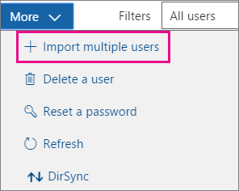
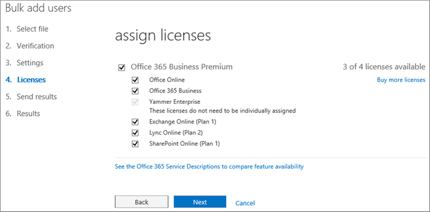
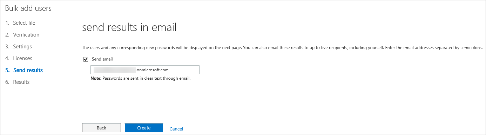

# <a name="add-several-users-at-the-same-time-to-office-365---admin-help"></a>同時に複数のユーザーを Office 365 に追加する - 管理者ヘルプ

メールや Office などの Office 365 サービスにサインインしてアクセスするには、チームの各メンバーにユーザー アカウントが必要です。 ユーザー数が多い場合、Excel のスプレッドシートまたは CSV 形式で保存された他のファイルから、ユーザー アカウントを一括で追加することができます。 [CSV 書式の定義](add-several-users-at-the-same-time.md#__toc316652088)
  
## <a name="add-multiple-users-to-office-365-in-the-office-365-admin-center"></a>Office 365 管理センターで複数のユーザーを Office 365 に追加する

1. 職場または学校のアカウントを使用して、Office 365 にサインインします。 
    
2. In the Office 365 admin center, choose **Users** \> **Active users**.
    
    
  
3. [ **詳細**] ドロップダウンで [ **複数のユーザーをインポート**] を選びます。
    
4. [ **複数のユーザーをインポート**] パネルで、サンプルの CSV ファイルをサンプル データがある状態、またはない状態でダウンロードできます。 
    
    
  
    スプレッドシートには、サンプルと **まったく同じ列見出し** が含まれている必要があります (ユーザー名、名、など)。テンプレートを使用する場合は、メモ帳などのテキスト編集ツールでテンプレートを開き、1 行目のすべてのデータをそのままにして実際のデータを 2 行目以降にのみ入力することを検討してください。 
    
    スプレッドシートには、各ユーザーのユーザー名 (bob@contoso.com など) と表示名 (Bob Kelly など) の値を含める必要があります。 
    
  ```
  User Name,First Name,Last Name,Display Name,Job Title,Department,Office Number,Office Phone,Mobile Phone,Fax,Address,City,State or Province,ZIP or Postal Code,Country or Region
  chris@contoso.com,Chris,Green,Chris Green,IT Manager,Information Technology,123451,123-555-1211,123-555-6641,123-555-9821,1 Microsoft way,Redmond,Wa,98052,United States
  ben@contoso.com,Ben,Andrews,Ben Andrews,IT Manager,Information Technology,123452,123-555-1212,123-555-6642,123-555-9822,1 Microsoft way,Redmond,Wa,98052,United States
  david@contoso.com,David,Longmuir,David Longmuir,IT Manager,Information Technology,123453,123-555-1213,123-555-6643,123-555-9823,1 Microsoft way,Redmond,Wa,98052,United States
  cynthia@contoso.com,Cynthia,Carey,Cynthia Carey,IT Manager,Information Technology,123454,123-555-1214,123-555-6644,123-555-9824,1 Microsoft way,Redmond,Wa,98052,United States
  melissa@contoso.com,Melissa,MacBeth,Melissa MacBeth,IT Manager,Information Technology,123455,123-555-1215,123-555-6645,123-555-9825,1 Microsoft way,Redmond,Wa,98052,United States
  
  ```

5. ボックスにファイル パスを入力するか、[ **参照**] を選択して CSV ファイルの場所を参照し、[ **確認**] を選びます。
    
    
  
    ファイルに問題がある場合は、パネルにその問題が表示されます。ログ ファイルをダウンロードすることもできます。
    
6. [ **ユーザー オプションの設定**] ダイアログで、サインイン状態を設定し、すべてのユーザーに割り当てられる製品ライセンスを選択できます。 
    
7. [ **結果の表示**] ダイアログで、結果を自分や他のユーザーに送信するかどうかを選択できます (パスワードはプレーン テキストとなります)。作成されたユーザーの数も表示されます。新規ユーザーに割り当てるライセンスを追加購入することもできます。 
    
## <a name="watch-the-video"></a>ビデオの視聴
<a name="bk_preview"> </a>

 ユーザーの一括追加方法についての短いビデオを確認してください。 
  
> [!VIDEO https://www.microsoft.com/videoplayer/embed/f4e7f161-8ae6-4264-a429-9297b539a8de?autoplay=false]
  
## <a name="next-steps"></a>次の手順
<a name="bk_preview"> </a>

- これらのユーザーはアカウントを所有しているので、 [office 365 または office 2016 を PC または Mac にダウンロードしてインストールまたは再](https://support.office.com/article/4414eaaf-0478-48be-9c42-23adc4716658)インストールする必要があります。 チームのメンバー 1 人につき、最大 5 台の PC または Mac に Office 365 をインストールできます。 
    
- 各ユーザーは、1つの[モバイルデバイスで Office アプリとメール](https://support.office.com/article/7dabb6cb-0046-40b6-81fe-767e0b1f014f)をセットアップすることもできます。これには、Iphones、Ipad、Android の携帯電話、タブレットなどの最大5台のタブレットと5台の電話機があります。 このようにすると、どこにいても Office のファイルを編集できます。 
    
    セットアップ手順のエンドツーエンドのリストについては、「 [Office 365 for business の](https://support.office.com/article/6a3a29a0-e616-4713-99d1-15eda62d04fa)セットアップ」を参照してください。 
    
## <a name="more-information-about-how-to-add-users-to-office-365"></a>Office 365 へのユーザー追加方法に関するその他の情報
<a name="bk_preview"> </a>

### <a name="not-sure-what-csv-format-is"></a>CSV 書式の定義
<a name="__toc316652088"> </a>

CSV ファイルは、コンマで区切られた値を含むファイルです。 テキスト エディターまたは Excel などのスプレッドシート プログラムを使って、このようなファイルを作成または編集することができます。
  
出発点として、[このサンプル スプレッドシート](https://www.microsoft.com/en-us/download/details.aspx?id=45485)をダウンロードして使うことができます。Office 365 には 1 行目の列見出しが必要なので、別のテキストで置き換えないでください。 
  
新しい名前でファイルを保存し、CSV 形式を指定します。
  

  
ファイルを保存するときに、CSV 形式でファイルを保存すると、ブックの一部の機能が失われるというメッセージが表示されることがあります。 このメッセージは問題ありません。 [ **はい**] をクリックして続けます。 
  

  
### <a name="tips-for-formatting-your-spreadsheet"></a>スプレッドシートの書式設定のヒント
<a name="__toc314595848"> </a>

- **サンプル スプレッドシートと同じ列見出しにする必要はありますか?** はい。サンプル スプレッドシートの 1 行目には列見出しが含まれています。列見出しは必須です。見出しの下に、Office 365 に追加するユーザーごとに 1 行を作成します。列見出しのいずれかを追加、変更、または削除すると、Office 365 でファイル内の情報からユーザーを作成できなくなる可能性があります。 
    
- **各ユーザーに必要な情報が揃っていない場合はどのようになりますか?** ユーザー名と表示名は必須で、この情報がないと新しいユーザーは追加できません。FAX 番号などの他の情報が一部欠けている場合は、フィールドが空白であることを示すために、スペースに加えてコンマを使用することができます。 
    
- ** How small or large can the spreadsheet be? ** The spreadsheet must have at least two rows. One is for the column headings (the user data column label) and one for the user. You cannot have more than 251 rows. If you need to import more than 250 users, you can create more than one spreadsheet. 
    
- ** What languages can I use? ** When you create your spreadsheet, you can enter user data column labels in any language or characters, but you must not change the order of the labels, as shown in the sample. You can then make entries into the fields, using any language or characters, and save your file in a Unicode or UTF-8 format. 
    
- **異なる国や地域のユーザーを追加する場合はどうですか?** 領域ごとに別のスプレッドシートを作成します。 スプレッドシートごとにユーザーの一括追加ウィザードの手順を実行し、処理中のファイルに含まれるすべてのユーザーを 1 つの場所にまとめるようにします。 
    
- **使用できる文字数に制限はありますか?** 次の表は、サンプルのスプレッドシート内のユーザーデータの列ラベルと、それぞれの最大文字数を示しています。 
    
|**ユーザー データの 列 ラベル**|**最大文字数**|
|:-----|:-----|
|ユーザー名 (必須)  <br/> |name@domain.\<extension\> という形式で、@ 記号を含めて 79 文字です。 ユーザーの別名は 30 文字を超えることはできず、ドメイン名は 48 文字を超えることはできません。  <br/> |
|名  <br/> |64  <br/> |
|姓  <br/> |64  <br/> |
|表示名 (必須)  <br/> |256  <br/> |
|役職  <br/> |64  <br/> |
|部署  <br/> |64  <br/> |
|事務所番号  <br/> |128  <br/> |
|会社電話  <br/> |64  <br/> |
|携帯電話  <br/> |64  <br/> |
|FAX  <br/> |64  <br/> |
|番地  <br/> |1023  <br/> |
|市区町村  <br/> |128  <br/> |
|都道府県  <br/> |128  <br/> |
|郵便番号  <br/> |40  <br/> |
|国または地域  <br/> |128  <br/> |
   
### <a name="still-having-problems-when-adding-users-to-office-365"></a>Office 365 にユーザーを追加するときの問題がまだ解決しない場合

- **スプレッドシートの形式が正しいかどうか慎重にチェックしてください。** サンプル ファイル内の見出しと一致しているか、列見出しをチェックします。文字数の制限に従い、各フィールドがカンマで区切られるようにします。 
    
- ** If you don't see the new users in Office 365 right away, wait a few minutes. ** It can take a little while for changes to go across all the services in Office 365. 
    
## <a name="add-multiple-users-to-office-365-in-the-old-office-365-admin-center"></a>以前の Office 365 管理センターで複数のユーザーを Office 365 に追加する

1. [このサンプル スプレッドシート](https://www.microsoft.com/en-us/download/details.aspx?id=45485)をダウンロードし、Excel で開きます。 
    
    スプレッドシートには、サンプルと **まったく同じ列見出し** が含まれている必要があります ("ユーザー名"、"名" など)。テンプレートを使用する場合は、1 行目のすべてのデータをそのままにして実際のデータを 2 行目以降にのみ入力することを検討してください。 
    
    また、このスプレッドシートには各ユーザーのユーザー名 (たとえば akito@contoso.com) と表示名 (たとえば "佐藤 明人") が入力されている必要があります。その他のフィールドを空白のままにするには、次の図のように半角スペース 1 個とコンマを入力してください。 
    
    
  
    複数の国に従業員がいる場合、国ごとにユーザーのスプレッドシートを 1 つ作成する必要があります。たとえば、米国で勤務している全ユーザーのスプレッドシートと、日本で勤務している全ユーザーのスプレッドシートを作成します。これは、Office 365 サービスを利用できるかどうかが、地域によって異なるためです。 
    
    **ヒント:** 多数のユーザーを追加する前に、サンプル スプレッドシートで練習することもできます。たとえば、サンプル スプレッドシートを編集して、5 人や 10 人など、少数のユーザー データを含め、新しい名前でファイルを保存します。この手順に従って、結果を確認し、新しいアカウントを削除して、最初から実行し直します。このようにすると、あらゆるデータについて実際の状況に合わせて練習することができます。また、[スプレッドシートの書式設定のヒント](add-several-users-at-the-same-time.md#__toc314595848)も参照してください。
    
2. 職場または学校のアカウントを使用して、Office 365 にサインインします。 
    
3. Office 365 管理センターに移動します。
    
4. For people to use Office 365 services, they need to be assigned a license. Before continuing, you might want to check that you have enough licenses for everyone listed in your spreadsheet. Choose **Billing** \> **Subscriptions** to see if you have enough. If you need to buy more licenses, choose ** Change license quantity **. Or, you can run the wizard and assign the licenses you have, then buy more licenses later and rerun the wizard. 
    
5. ユーザーの一括追加ウィザードを開き、[ **ユーザー**] \> [ **アクティブなユーザー**] を選びます。 次の図のように、 を選びます。 
    
    ![Office 365 管理センターの [ユーザー] セクションの画像](media/2cd5ff86-9c0b-438e-9bb9-13b12a2675de.png)
  
    ユーザーの一括追加ウィザードが表示されます。画面の手順に従って、複数のユーザーを Office 365 に追加することができます。 
    
6. 次の図のように、作成したスプレッドシートを手順 1 の [CSV ファイルの選択] で指定します。
    
    
  
7. 手順 2 の [確認] に、スプレッドシートの内容が正しい書式で設定されているかどうかが表示されます。
    
    
  
8. 手順 3 の [設定] で [ **許可**] を選び、スプレッドシートに記載されたメンバーが Office 365 を使用できるようにします。また、メンバーが Office 365 を使用する国も選びます。組織内の一部のメンバーが異なる国で Office 365 を使用する場合、そのメンバー名が記載された別のスプレッドシートを作成し、ユーザーの一括追加ウィザードをもう一度実行して追加します。 
    
    
  
9. [ライセンスの割り当て] ページには、使用できるライセンス数が表示されます。 
    
    
  
    [ **ライセンスを追加購入する**] を選ぶこともできますが、ユーザーの一括追加ウィザードを終了して Office 365 管理センター の [ **課金**] に移動することになります。ライセンスを追加購入したら、注文の処理が完了するまで数分待ち、その後でユーザーの一括追加ウィザードを最初から実行する必要があります。 
    
    ライセンスを追加購入しない場合、スプレッドシートに記載されている全員分のアカウントは作成されません。 
    
    この例では、ライセンスを追加購入せずに、ユーザーの一括追加ウィザードを続行します。
    
10. In Step 5 - Send Results, type the email addresses of the people who you want to get an email that lists  *all*  of the Office 365 user names and temporary passwords for the people in the spreadsheet. 
    
    
  
    手順 5 の [電子メール] で指定したすべてのメール アドレスに次のメールが送信されます。 このメールには、作成されたアカウントが記載されています。 この例では、ライセンス数が足りなかったため、一部のユーザーについてのアカウントは作成されませんでした。 
    
    
  
    後でライセンスを追加購入し、同じスプレッドシートを使ってユーザーの一括追加ウィザードを再実行することができます。 既にアカウントがあるユーザーはスキップされます。既にアカウントが存在するユーザーであることを示す "重複するユーザー名です" という結果のレポートが表示されます。
    
11. ユーザーの一括追加ウィザードの最後のページには、次の図のように、ユーザー名と一時パスワードの一覧が表示されます。
    
    
  
12. ユーザーを Office 365 に追加した後は、Office 365 のアカウント情報についてユーザーに知らせる必要があります。新しいパスワードを通知する通常のプロセスを使ってください。
    

