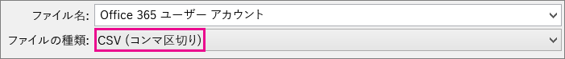
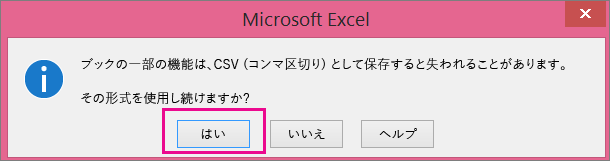

# <a name="add-several-users-at-the-same-time-to-office-365---admin-help"></a><span data-ttu-id="77deb-105">同時に複数のユーザーを Office 365 に追加する - 管理者ヘルプ</span><span class="sxs-lookup"><span data-stu-id="77deb-105">Add several users at the same time to Office 365 - Admin Help</span></span>

<span data-ttu-id="77deb-p102">メールや Office などの Office 365 サービスにサインインしてアクセスするには、チームの各メンバーにユーザー アカウントが必要です。 ユーザー数が多い場合、Excel のスプレッドシートまたは CSV 形式で保存された他のファイルから、ユーザー アカウントを一括で追加することができます。 [CSV 書式の定義](add-several-users-at-the-same-time.md#__toc316652088)</span><span class="sxs-lookup"><span data-stu-id="77deb-p102">Each person on your team needs a user account before they can sign in and access Office 365 services, such as email and Office. If you have a lot of people, you can add their accounts all at once from an Excel spreadsheet or other file saved in CSV format. [Not sure what CSV format is?](add-several-users-at-the-same-time.md#__toc316652088)</span></span>
  
> [!NOTE] 
> <span data-ttu-id="77deb-109">新しい Microsoft 365 管理センターを利用していない場合、[ホーム] ページの上部にある [**新しい管理センターをお試しください**] の切り替えを選択して有効にすることができます。</span><span class="sxs-lookup"><span data-stu-id="77deb-109">If you're not using the new Microsoft 365 admin center, you can turn it on by selecting the **Try the new admin center** toggle located at the top of the Home page.</span></span>

## <a name="add-multiple-users-to-office-365-in-the-microsoft-365-admin-center"></a><span data-ttu-id="77deb-110">Microsoft 365 管理センターの Office 365 に複数のユーザーを追加する</span><span class="sxs-lookup"><span data-stu-id="77deb-110">Add multiple users to Office 365 in the Microsoft 365 admin center</span></span>

1. <span data-ttu-id="77deb-111">職場または学校のアカウントを使用して、Office 365 にサインインします。</span><span class="sxs-lookup"><span data-stu-id="77deb-111">Sign in to Office 365 with your work or school account.</span></span> 
    
2. <span data-ttu-id="77deb-112">In the admin center, choose **Users** \> **Active users**.</span><span class="sxs-lookup"><span data-stu-id="77deb-112">In the admin center, choose **Users** \> **Active users**.</span></span>

3. <span data-ttu-id="77deb-113">[**複数のユーザーを追加**] を選択します。</span><span class="sxs-lookup"><span data-stu-id="77deb-113">Select **Add multiple users**.</span></span>

4. <span data-ttu-id="77deb-114">[ **複数のユーザーをインポート**] パネルで、サンプルの CSV ファイルをサンプル データがある状態、またはない状態でダウンロードできます。</span><span class="sxs-lookup"><span data-stu-id="77deb-114">On the **Import multiple users** panel, you can optionally download a sample CSV file with or without sample data filled in.</span></span> 
    
    <span data-ttu-id="77deb-115">スプレッドシートには、サンプルと **まったく同じ列見出し** が含まれている必要があります (ユーザー名、名、など)。テンプレートを使用する場合は、メモ帳などのテキスト編集ツールでテンプレートを開き、1 行目のすべてのデータをそのままにして実際のデータを 2 行目以降にのみ入力することを検討してください。</span><span class="sxs-lookup"><span data-stu-id="77deb-115">Your spreadsheet needs to include the **exact same column headings** as the sample one (User Name, First Name, etc...). If you use the template, open it in a text editing tool, like Notepad, and consider leaving all the data in row 1 alone, and only entering data in rows 2 and below.</span></span> 
    
    <span data-ttu-id="77deb-116">スプレッドシートには、各ユーザーのユーザー名 (bob@contoso.com など) と表示名 (Bob Kelly など) の値を含める必要があります。</span><span class="sxs-lookup"><span data-stu-id="77deb-116">Your spreadsheet also needs to include values for the user name (like bob@contoso.com) and a display name (like Bob Kelly) for each user.</span></span> 
    
  ```
  User Name,First Name,Last Name,Display Name,Job Title,Department,Office Number,Office Phone,Mobile Phone,Fax,Address,City,State or Province,ZIP or Postal Code,Country or Region
  chris@contoso.com,Chris,Green,Chris Green,IT Manager,Information Technology,123451,123-555-1211,123-555-6641,123-555-9821,1 Microsoft way,Redmond,Wa,98052,United States
  ben@contoso.com,Ben,Andrews,Ben Andrews,IT Manager,Information Technology,123452,123-555-1212,123-555-6642,123-555-9822,1 Microsoft way,Redmond,Wa,98052,United States
  david@contoso.com,David,Longmuir,David Longmuir,IT Manager,Information Technology,123453,123-555-1213,123-555-6643,123-555-9823,1 Microsoft way,Redmond,Wa,98052,United States
  cynthia@contoso.com,Cynthia,Carey,Cynthia Carey,IT Manager,Information Technology,123454,123-555-1214,123-555-6644,123-555-9824,1 Microsoft way,Redmond,Wa,98052,United States
  melissa@contoso.com,Melissa,MacBeth,Melissa MacBeth,IT Manager,Information Technology,123455,123-555-1215,123-555-6645,123-555-9825,1 Microsoft way,Redmond,Wa,98052,United States
  
  ```

5. <span data-ttu-id="77deb-117">ボックスにファイル パスを入力するか、[ **参照**] を選択して CSV ファイルの場所を参照し、[ **確認**] を選びます。</span><span class="sxs-lookup"><span data-stu-id="77deb-117">Enter a file path into the box, or choose **Browse** to browse to the CSV file location, then choose **Verify**.</span></span>
  
    <span data-ttu-id="77deb-p103">ファイルに問題がある場合は、パネルにその問題が表示されます。ログ ファイルをダウンロードすることもできます。</span><span class="sxs-lookup"><span data-stu-id="77deb-p103">If there are problems with the file, the problem is displayed in the panel. You can also download a log file.</span></span>
    
5. <span data-ttu-id="77deb-120">[ **ユーザー オプションの設定**] ダイアログで、サインイン状態を設定し、すべてのユーザーに割り当てられる製品ライセンスを選択できます。</span><span class="sxs-lookup"><span data-stu-id="77deb-120">On the **Set user options** dialog you can set the sign-in status and choose the product license that will be assigned to all users.</span></span> 
    
6. <span data-ttu-id="77deb-121">[ **結果の表示**] ダイアログで、結果を自分や他のユーザーに送信するかどうかを選択できます (パスワードはプレーン テキストとなります)。作成されたユーザーの数も表示されます。新規ユーザーに割り当てるライセンスを追加購入することもできます。</span><span class="sxs-lookup"><span data-stu-id="77deb-121">On the **View your result** dialog you can choose to send the results to either yourself or other users (passwords will be in plain text) and you can see how many users were created, and if you need to purchase more licenses to assign to some of the new users.</span></span> 
    
## <a name="watch-the-video"></a><span data-ttu-id="77deb-122">ビデオの視聴</span><span class="sxs-lookup"><span data-stu-id="77deb-122">Watch the video</span></span>
<span data-ttu-id="77deb-123"><a name="bk_preview"> </a></span><span class="sxs-lookup"><span data-stu-id="77deb-123"></span></span>

 <span data-ttu-id="77deb-124">ユーザーの一括追加方法についての短いビデオを確認してください。</span><span class="sxs-lookup"><span data-stu-id="77deb-124">Watch a short video that shows you how to bulk add users.</span></span> 
  
> [!VIDEO https://www.microsoft.com/videoplayer/embed/f4e7f161-8ae6-4264-a429-9297b539a8de?autoplay=false]
  
## <a name="next-steps"></a><span data-ttu-id="77deb-125">次の手順</span><span class="sxs-lookup"><span data-stu-id="77deb-125">Next steps</span></span>
<span data-ttu-id="77deb-126"><a name="bk_preview"> </a></span><span class="sxs-lookup"><span data-stu-id="77deb-126"></span></span>

- <span data-ttu-id="77deb-127">これらのユーザーはアカウントを所有しているので、 [office 365 または office 2016 を PC または Mac にダウンロードしてインストールまたは再](https://support.office.com/article/4414eaaf-0478-48be-9c42-23adc4716658)インストールする必要があります。</span><span class="sxs-lookup"><span data-stu-id="77deb-127">Now that these people have accounts, they need to [Download and install or reinstall Office 365 or Office 2016 on a PC or Mac](https://support.office.com/article/4414eaaf-0478-48be-9c42-23adc4716658).</span></span> <span data-ttu-id="77deb-128">チームのメンバー 1 人につき、最大 5 台の PC または Mac に Office 365 をインストールできます。</span><span class="sxs-lookup"><span data-stu-id="77deb-128">Each person on your team can install Office 365 on up to 5 PCs or Macs.</span></span> 
    
- <span data-ttu-id="77deb-129">各ユーザーは、1つの[モバイルデバイスで Office アプリとメール](https://support.office.com/article/7dabb6cb-0046-40b6-81fe-767e0b1f014f)をセットアップすることもできます。これには、Iphones、Ipad、Android の携帯電話、タブレットなどの最大5台のタブレットと5台の電話機があります。</span><span class="sxs-lookup"><span data-stu-id="77deb-129">Each person can also [Set up Office apps and email on a mobile device](https://support.office.com/article/7dabb6cb-0046-40b6-81fe-767e0b1f014f) on up to 5 tablets and 5 phones, such as iPhones, iPads, and Android phones and tablets.</span></span> <span data-ttu-id="77deb-130">このようにすると、どこにいても Office のファイルを編集できます。</span><span class="sxs-lookup"><span data-stu-id="77deb-130">This way they can edit Office files from anywhere.</span></span> 
    
    <span data-ttu-id="77deb-131">セットアップ手順のエンドツーエンドのリストについては、「 [Office 365 for business の](https://support.office.com/article/6a3a29a0-e616-4713-99d1-15eda62d04fa)セットアップ」を参照してください。</span><span class="sxs-lookup"><span data-stu-id="77deb-131">See [Set up Office 365 for business](https://support.office.com/article/6a3a29a0-e616-4713-99d1-15eda62d04fa) for an end-to-end list of the setup steps.</span></span> 
    
## <a name="more-information-about-how-to-add-users-to-office-365"></a><span data-ttu-id="77deb-132">Office 365 へのユーザー追加方法に関するその他の情報</span><span class="sxs-lookup"><span data-stu-id="77deb-132">More information about how to add users to Office 365</span></span>
<span data-ttu-id="77deb-133"><a name="bk_preview"> </a></span><span class="sxs-lookup"><span data-stu-id="77deb-133"></span></span>

### <a name="not-sure-what-csv-format-is"></a><span data-ttu-id="77deb-134">CSV 書式の定義</span><span class="sxs-lookup"><span data-stu-id="77deb-134">Not sure what CSV format is?</span></span>
<span data-ttu-id="77deb-135"><a name="__toc316652088"> </a></span><span class="sxs-lookup"><span data-stu-id="77deb-135"></span></span>

<span data-ttu-id="77deb-p106">CSV ファイルは、コンマで区切られた値を含むファイルです。 テキスト エディターまたは Excel などのスプレッドシート プログラムを使って、このようなファイルを作成または編集することができます。</span><span class="sxs-lookup"><span data-stu-id="77deb-p106">A CSV file is a file with comma separated values. You can create or edit a file like this with any text editor or spreadsheet program, such as Excel.</span></span>
  
<span data-ttu-id="77deb-p107">出発点として、[このサンプル スプレッドシート](https://www.microsoft.com/download/details.aspx?id=45485)をダウンロードして使うことができます。Office 365 には 1 行目の列見出しが必要なので、別のテキストで置き換えないでください。</span><span class="sxs-lookup"><span data-stu-id="77deb-p107">You can download [this sample spreadsheet](https://www.microsoft.com/download/details.aspx?id=45485) as a starting point. Remember that Office 365 requires column headings in the first row so don't replace them with something else.</span></span> 
  
<span data-ttu-id="77deb-140">新しい名前でファイルを保存し、CSV 形式を指定します。</span><span class="sxs-lookup"><span data-stu-id="77deb-140">Save the file with a new name, and specify CSV format.</span></span>
  

  
<span data-ttu-id="77deb-p108">ファイルを保存するときに、CSV 形式でファイルを保存すると、ブックの一部の機能が失われるというメッセージが表示されることがあります。 このメッセージは問題ありません。 [ **はい**] をクリックして続けます。</span><span class="sxs-lookup"><span data-stu-id="77deb-p108">When you save the file, you'll probably get a prompt that some features in your workbook will be lost if you save the file in CSV format. This is okay. Click **Yes** to continue.</span></span> 
  

  
### <a name="tips-for-formatting-your-spreadsheet"></a><span data-ttu-id="77deb-146">スプレッドシートの書式設定のヒント</span><span class="sxs-lookup"><span data-stu-id="77deb-146">Tips for formatting your spreadsheet</span></span>
<span data-ttu-id="77deb-147"><a name="__toc314595848"> </a></span><span class="sxs-lookup"><span data-stu-id="77deb-147"></span></span>

- <span data-ttu-id="77deb-p109">**サンプル スプレッドシートと同じ列見出しにする必要はありますか?** はい。サンプル スプレッドシートの 1 行目には列見出しが含まれています。列見出しは必須です。見出しの下に、Office 365 に追加するユーザーごとに 1 行を作成します。列見出しのいずれかを追加、変更、または削除すると、Office 365 でファイル内の情報からユーザーを作成できなくなる可能性があります。</span><span class="sxs-lookup"><span data-stu-id="77deb-p109">**Do I need the same column headings as in the sample spreadsheet?** Yes. The sample spreadsheet contains column headings in the first row. These headings are required. For each user you want to add to Office 365, create a row under the heading. If you add, change, or delete any of the column headings, Office 365 might not be able to create users from the information in the file.</span></span> 
    
- <span data-ttu-id="77deb-p110">**各ユーザーに必要な情報が揃っていない場合はどのようになりますか?** ユーザー名と表示名は必須で、この情報がないと新しいユーザーは追加できません。FAX 番号などの他の情報が一部欠けている場合は、フィールドが空白であることを示すために、スペースに加えてコンマを使用することができます。</span><span class="sxs-lookup"><span data-stu-id="77deb-p110">**What if I don't have all the information required for each user?** The user name and display name are required, and you cannot add a new user without this information. If you don't have some of the other information, such as the fax, you can use a space plus a comma to indicate that the field should remain blank.</span></span> 
    
- <span data-ttu-id="77deb-p111">\*\* How small or large can the spreadsheet be? \*\* The spreadsheet must have at least two rows. One is for the column headings (the user data column label) and one for the user. You cannot have more than 251 rows. If you need to import more than 250 users, you can create more than one spreadsheet.</span><span class="sxs-lookup"><span data-stu-id="77deb-p111">\*\* How small or large can the spreadsheet be? \*\* The spreadsheet must have at least two rows. One is for the column headings (the user data column label) and one for the user. You cannot have more than 251 rows. If you need to import more than 250 users, you can create more than one spreadsheet.</span></span> 
    
- <span data-ttu-id="77deb-p112">\*\* What languages can I use? \*\* When you create your spreadsheet, you can enter user data column labels in any language or characters, but you must not change the order of the labels, as shown in the sample. You can then make entries into the fields, using any language or characters, and save your file in a Unicode or UTF-8 format.</span><span class="sxs-lookup"><span data-stu-id="77deb-p112">\*\* What languages can I use? \*\* When you create your spreadsheet, you can enter user data column labels in any language or characters, but you must not change the order of the labels, as shown in the sample. You can then make entries into the fields, using any language or characters, and save your file in a Unicode or UTF-8 format.</span></span> 
    
- <span data-ttu-id="77deb-p113">**異なる国や地域のユーザーを追加する場合はどうですか?** 領域ごとに別のスプレッドシートを作成します。 スプレッドシートごとにユーザーの一括追加ウィザードの手順を実行し、処理中のファイルに含まれるすべてのユーザーを 1 つの場所にまとめるようにします。</span><span class="sxs-lookup"><span data-stu-id="77deb-p113">**What if I'm adding users from different countries or regions?** Create a separate spreadsheet for each area. You'll need to step through the Bulk add users wizard which each spreadsheet, giving a single location of all users included in the file that you're working with.</span></span> 
    
- <span data-ttu-id="77deb-p114">**使用できる文字数に制限はありますか?** 次の表は、サンプルのスプレッドシート内のユーザーデータの列ラベルと、それぞれの最大文字数を示しています。</span><span class="sxs-lookup"><span data-stu-id="77deb-p114">**Is there a limit to the number of characters I can use?** The following table shows the user data column labels and the maximum character length for each in the sample spreadsheet.</span></span> 
    
|<span data-ttu-id="77deb-170">**ユーザー データの 列 ラベル**</span><span class="sxs-lookup"><span data-stu-id="77deb-170">**User data column label**</span></span>|<span data-ttu-id="77deb-171">**最大文字数**</span><span class="sxs-lookup"><span data-stu-id="77deb-171">**Maximum character length**</span></span>|
|:-----|:-----|
|<span data-ttu-id="77deb-172">ユーザー名 (必須)</span><span class="sxs-lookup"><span data-stu-id="77deb-172">User Name (Required)</span></span>  <br/> |<span data-ttu-id="77deb-p115">name@domain.\<extension\> という形式で、@ 記号を含めて 79 文字です。 ユーザーの別名は 30 文字を超えることはできず、ドメイン名は 48 文字を超えることはできません。</span><span class="sxs-lookup"><span data-stu-id="77deb-p115">79 including the at sign (@), in the format name@domain.\<extension\>. The user's alias cannot exceed 30 characters, and the domain name cannot exceed 48 characters.</span></span>  <br/> |
|<span data-ttu-id="77deb-175">名</span><span class="sxs-lookup"><span data-stu-id="77deb-175">First Name</span></span>  <br/> |<span data-ttu-id="77deb-176">64</span><span class="sxs-lookup"><span data-stu-id="77deb-176">64</span></span>  <br/> |
|<span data-ttu-id="77deb-177">姓</span><span class="sxs-lookup"><span data-stu-id="77deb-177">Last Name</span></span>  <br/> |<span data-ttu-id="77deb-178">64</span><span class="sxs-lookup"><span data-stu-id="77deb-178">64</span></span>  <br/> |
|<span data-ttu-id="77deb-179">表示名 (必須)</span><span class="sxs-lookup"><span data-stu-id="77deb-179">Display Name (required)</span></span>  <br/> |<span data-ttu-id="77deb-180">256</span><span class="sxs-lookup"><span data-stu-id="77deb-180">256</span></span>  <br/> |
|<span data-ttu-id="77deb-181">役職</span><span class="sxs-lookup"><span data-stu-id="77deb-181">Job Title</span></span>  <br/> |<span data-ttu-id="77deb-182">64</span><span class="sxs-lookup"><span data-stu-id="77deb-182">64</span></span>  <br/> |
|<span data-ttu-id="77deb-183">部署</span><span class="sxs-lookup"><span data-stu-id="77deb-183">Department</span></span>  <br/> |<span data-ttu-id="77deb-184">64</span><span class="sxs-lookup"><span data-stu-id="77deb-184">64</span></span>  <br/> |
|<span data-ttu-id="77deb-185">事務所番号</span><span class="sxs-lookup"><span data-stu-id="77deb-185">Office Number</span></span>  <br/> |<span data-ttu-id="77deb-186">128</span><span class="sxs-lookup"><span data-stu-id="77deb-186">128</span></span>  <br/> |
|<span data-ttu-id="77deb-187">会社電話</span><span class="sxs-lookup"><span data-stu-id="77deb-187">Office Phone</span></span>  <br/> |<span data-ttu-id="77deb-188">64</span><span class="sxs-lookup"><span data-stu-id="77deb-188">64</span></span>  <br/> |
|<span data-ttu-id="77deb-189">携帯電話</span><span class="sxs-lookup"><span data-stu-id="77deb-189">Mobile Phone</span></span>  <br/> |<span data-ttu-id="77deb-190">64</span><span class="sxs-lookup"><span data-stu-id="77deb-190">64</span></span>  <br/> |
|<span data-ttu-id="77deb-191">FAX</span><span class="sxs-lookup"><span data-stu-id="77deb-191">Fax</span></span>  <br/> |<span data-ttu-id="77deb-192">64</span><span class="sxs-lookup"><span data-stu-id="77deb-192">64</span></span>  <br/> |
|<span data-ttu-id="77deb-193">番地</span><span class="sxs-lookup"><span data-stu-id="77deb-193">Address</span></span>  <br/> |<span data-ttu-id="77deb-194">1023</span><span class="sxs-lookup"><span data-stu-id="77deb-194">1023</span></span>  <br/> |
|<span data-ttu-id="77deb-195">市区町村</span><span class="sxs-lookup"><span data-stu-id="77deb-195">City</span></span>  <br/> |<span data-ttu-id="77deb-196">128</span><span class="sxs-lookup"><span data-stu-id="77deb-196">128</span></span>  <br/> |
|<span data-ttu-id="77deb-197">都道府県</span><span class="sxs-lookup"><span data-stu-id="77deb-197">State or Province</span></span>  <br/> |<span data-ttu-id="77deb-198">128</span><span class="sxs-lookup"><span data-stu-id="77deb-198">128</span></span>  <br/> |
|<span data-ttu-id="77deb-199">郵便番号</span><span class="sxs-lookup"><span data-stu-id="77deb-199">ZIP or Postal Code</span></span>  <br/> |<span data-ttu-id="77deb-200">40</span><span class="sxs-lookup"><span data-stu-id="77deb-200">40</span></span>  <br/> |
|<span data-ttu-id="77deb-201">国または地域</span><span class="sxs-lookup"><span data-stu-id="77deb-201">Country or Region</span></span>  <br/> |<span data-ttu-id="77deb-202">128</span><span class="sxs-lookup"><span data-stu-id="77deb-202">128</span></span>  <br/> |
   
### <a name="still-having-problems-when-adding-users-to-office-365"></a><span data-ttu-id="77deb-203">Office 365 にユーザーを追加するときの問題がまだ解決しない場合</span><span class="sxs-lookup"><span data-stu-id="77deb-203">Still having problems when adding users to Office 365?</span></span>

- <span data-ttu-id="77deb-p116">**スプレッドシートの形式が正しいかどうか慎重にチェックしてください。** サンプル ファイル内の見出しと一致しているか、列見出しをチェックします。文字数の制限に従い、各フィールドがカンマで区切られるようにします。</span><span class="sxs-lookup"><span data-stu-id="77deb-p116">**Double-check that the spreadsheet is formatted correctly.** Check the column headings to make sure they match the headings in the sample file. Make sure you're following the rules for character lengths and that each field is separated by a comma.</span></span> 
    
- <span data-ttu-id="77deb-207">**Office 365 で新しいユーザーがすぐに表示されない場合は、数分待機してください。**</span><span class="sxs-lookup"><span data-stu-id="77deb-207">**If you don't see the new users in Office 365 right away, wait a few minutes.**</span></span> <span data-ttu-id="77deb-208">Office 365 のすべてのサービスに変更が加えられるのに少し時間がかかる場合があります。</span><span class="sxs-lookup"><span data-stu-id="77deb-208">It can take a little while for changes to go across all the services in Office 365.</span></span> 
    
