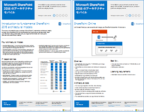
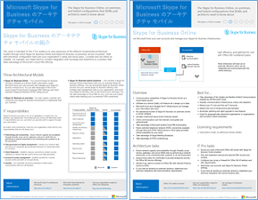
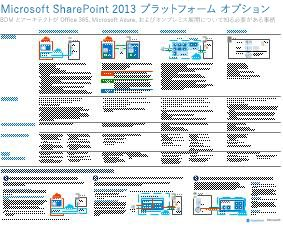
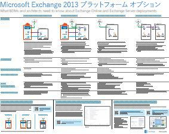
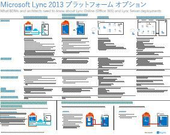
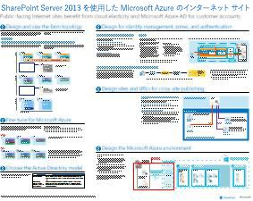
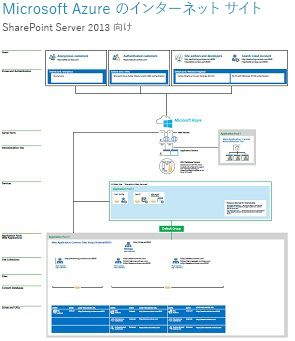

# SharePoint、Exchange、Skype for Business、Lync のアーキテクチャ モデルArchitectural models for SharePoint, Exchange, Skype for Business, and Lync

 **概要:** アーキテクチャ モデル、展開、および SharePoint、Exchange、Skype for Business、および Lync のプラットフォーム オプションについて説明している IT ポスターを取得します。**Summary:** Get the IT posters that describe the architectural models, deployment, and platform options for SharePoint, Exchange, Skype for Business, and Lync.
  
これらの IT ポスターは、SharePoint、Exchange、Skype for Business、Lync のアーキテクチャ モデルと展開オプションについて説明し、Microsoft Azure で SharePoint を展開するための設計情報を提供します。These IT posters describe the architectural models and deployment options for SharePoint, Exchange, Skype for Business, and Lync, and they provide design information for deploying SharePoint in Microsoft Azure.
  
Office 365 では、ユーザーが慣れ親しんでいるコラボレーション サービスや通信サービスを、クラウドベースのサービスとして提供できます。いくつかの例外はありますが、オンプレミスの展開の場合も、Office 365 でも、ユーザー エクスペリエンスは同じです。この統合されたユーザー エクスペリエンスにより、それぞれの作業負荷の配置決定はより複雑になり、次のような疑問が生じます。With Office 365, you can provide the collaboration and communication services your users are familiar with as a cloud-based service. With a few exceptions, the user experience remains the same whether you are maintaining an on-premises deployment or using Office 365. This unified user experience makes it less straightforward to decide where to place each workload and raises questions such as:
  
- 個々のワークロードに対して選択するプラットフォーム オプションをどのように決定するか。How do you determine which platform option to choose for your individual workloads?
    
- オンプレミスのサービスを残すことに意味はあるか。Does it make sense to keep any service on-premises?
    
- どのようなシナリオではハイブリッド展開が適切か。What is a scenario where a hybrid deployment is appropriate?
    
- Microsoft Azure は図にどのように適合するか。How does Microsoft Azure fit in the picture?
    
- Azure の Office Server ワークロードでサポートされている構成はどのようなものか。What are the supported configurations for Office Server workloads in Azure?
    
> [!TIP]
> このページのポスターのほとんどは、中国語、英語、フランス語、ドイツ語、イタリア語、日本語、韓国語、ポルトガル語、ロシア語、スペイン語を含む複数の言語で提供されています。これらの言語のいずれかのポスターをダウンロードするには、ポスターの **[その他の言語]** リンクをクリックします。Most of the posters on this page are available in multiple languages, including Chinese, English, French, German, Italian, Japanese, Korean, Portuguese, Russian, and Spanish. To download a poster in one of these languages, click the **More languages** link for that poster.
  
ご意見を電子メールで [cloudadopt@microsoft.com](mailto:cloudadopt@microsoft.com) 宛てにお送りください。Let us know what you think! Send us email at [cloudadopt@microsoft.com](mailto:cloudadopt@microsoft.com). 
  
このページには次のポスターへのリンクがあります。This page links you to the following posters:
  
- **アーキテクチャ モデルのポスター** これらのリソースを使用して、SharePoint 2016 および Skype for Business 2015 用の理想的なプラットフォームと構成を決定することができます。**Architectural models posters** You can use these resources to determine your ideal platform and configuration for SharePoint 2016 and Skype for Business 2015.
    
  - [Microsoft SharePoint 2016 アーキテクチャ モデルMicrosoft SharePoint 2016 Architectural Models](architectural-models-for-sharepoint-exchange-skype-for-business-and-lync.md#SP2016_ArchModel)
    
  - [OneDrive の複数地域機能および Office 365 の SharePoint OnlineMulti-Geo Capabilities in OneDrive and SharePoint Online in Office 365](architectural-models-for-sharepoint-exchange-skype-for-business-and-lync.md#MultiGeoO365ODB)
    
  - [SharePoint Server 2016 データベースSharePoint Server 2016 Databases](architectural-models-for-sharepoint-exchange-skype-for-business-and-lync.md#SP2016_Databases)
    
  - [Microsoft Skype for Business 2015 アーキテクチャ モデルMicrosoft Skype for Business 2015 Architectural Models](architectural-models-for-sharepoint-exchange-skype-for-business-and-lync.md#SfB2015_ArchModel)
    
- **プラットフォーム オプションのポスター** これらのリソースを使用して、SharePoint 2013、Exchange 2013、Lync 2013 用の理想的なプラットフォームと構成を決定することができます。**Platform options posters** You can use these resources to determine your ideal platform and configuration for SharePoint 2013, Exchange 2013, and Lync 2013.
    
  - [SharePoint 2013 プラットフォーム オプションSharePoint 2013 Platform Options](architectural-models-for-sharepoint-exchange-skype-for-business-and-lync.md#SP2013_Options)
    
  - [Exchange 2013 プラットフォーム オプションExchange 2013 Platform Options](architectural-models-for-sharepoint-exchange-skype-for-business-and-lync.md#Exch2013_options)
    
  - [Lync 2013 プラットフォーム オプションLync 2013 Platform Options](architectural-models-for-sharepoint-exchange-skype-for-business-and-lync.md#Lync2013_Options)
    
- **Azure の SharePoint Server 2013 のソリューションのポスター** これらの IT ポスターを使用して、Azure インフラストラクチャ サービスの SharePoint Server 2013 ワークロード用の設計および構成を決定することができます。**SharePoint Server 2013 in Azure solutions posters** You can use these IT posters to determine the design and configuration for SharePoint Server 2013 workloads in Azure infrastructure services.
    
  - [SharePoint Server 2013 を使用した Microsoft Azure のインターネット サイトInternet sites in Microsoft Azure using SharePoint Server 2013](architectural-models-for-sharepoint-exchange-skype-for-business-and-lync.md#Azure_sharepoint2013)
    
  - [設計サンプル: SharePoint 2013 のための Microsoft Azure のインターネット サイトDesign sample: Internet sites in Microsoft Azure for SharePoint 2013](architectural-models-for-sharepoint-exchange-skype-for-business-and-lync.md#DesignSampleInternetSites)
    
  - [Microsoft Azure に対する SharePoint の障害復旧SharePoint Disaster Recovery to Microsoft Azure](architectural-models-for-sharepoint-exchange-skype-for-business-and-lync.md#sharepoint_recovery_Azure)
    
## アーキテクチャ モデルのポスターArchitectural models posters

これらの SharePoint 2016 および Skype for Business 2015 向けの新しい IT ポスターは、印刷しやすい形式で、さまざまな展開の方法を比較する手段を提供します。各ポスターは利用可能な構成またはプラットフォーム オプションすべての一覧を示し、オプションごとに次の情報を説明します。These new IT posters for SharePoint 2016 and Skype for Business 2015 provide a way to compare the various deployment methods in an easy-to-print format. Each poster provides a list of all the configurations or platform options available and gives you the following information for each option:
  
- **概要** 概念図などの、プラットフォームの簡単な要約です。**Overview** A brief summary of the platform, including a conceptual diagram.
    
- **最適シナリオ** 特定のプラットフォームが最適な、一般的なシナリオです。**Best for** Common scenarios that are ideally suited for the particular platform.
    
- **ライセンス要件** 展開に必要なライセンスです。**License requirements** The licenses you need for deployment.
    
- **アーキテクチャ タスク** 事業計画担当が下す必要がある決定です。**Architecture tasks** The decisions you need to make as an architect.
    
- **IT 技術者のタスクまたは業務** IT スタッフが計画する必要がある毎日の業務です。**IT Pro tasks or responsibilities** The daily responsibilities that your IT staff needs to plan for.
    

### Microsoft SharePoint 2016 のアーキテクチャ モデルMicrosoft SharePoint 2016 Architectural Models

|**アイテム****Item**|**説明****Description**|
|:-----|:-----|
|[          ](https://www.microsoft.com/download/details.aspx?id=52650)[          ](https://www.microsoft.com/download/details.aspx?id=52650)   [PDF](https://download.microsoft.com/download/4/F/A/4FA0F94B-EE2F-41DB-A047-D9864FEF41E9/SharePoint2016ArchitecturalModels.pdf)  \| [Visio](https://download.microsoft.com/download/4/F/A/4FA0F94B-EE2F-41DB-A047-D9864FEF41E9/SharePoint2016ArchitecturalModels.vsdx)  \| [その他の言語](https://www.microsoft.com/download/details.aspx?id=52650)[PDF](https://download.microsoft.com/download/4/F/A/4FA0F94B-EE2F-41DB-A047-D9864FEF41E9/SharePoint2016ArchitecturalModels.pdf)  \| [Visio](https://download.microsoft.com/download/4/F/A/4FA0F94B-EE2F-41DB-A047-D9864FEF41E9/SharePoint2016ArchitecturalModels.vsdx)  \| [More languages](https://www.microsoft.com/download/details.aspx?id=52650)   | この IT ポスターでは、ビジネスの意思決定者とソリューション設計担当者が知っておく必要のある SharePoint Online、Microsoft Azure、SharePoint のオンプレミス構成について説明しています。This IT poster describes the SharePoint Online, Microsoft Azure, and SharePoint on-premises configurations that business decision makers and solutions architects need to know about.    - **SharePoint Online (SaaS)** - サービスとしてのソフトウェア (SaaS) サブスクリプション モデルを介して SharePoint を使用します。- **SharePoint Online (SaaS)** - Consume SharePoint through a Software as a Service (SaaS) subscription model.   - **SharePoint ハイブリッド** - 自分のペースで SharePoint サイトとアプリをクラウドに移動します。- **SharePoint Hybrid** - Move your SharePoint sites and apps to the cloud at your own pace.   - **Azure での SharePoint (IaaS)** - オンプレミス環境を Microsoft Azure に拡張して、そこに SharePoint 2016 Server を展開します (これは高可用性/障害復旧環境や開発/テスト環境の場合に推奨されます)。- **SharePoint in Azure (IaaS)** - You extend your on-premises environment into Microsoft Azure and deploy SharePoint 2016 Servers there. (This is recommended for High Availability/Disaster Recovery and dev/test environments.)   - **オンプレミスの SharePoint** - 保守しているデータセンター内で SharePoint 環境の計画、展開、保守、カスタマイズを行います。- **SharePoint On-premises** - You plan, deploy, maintain and customize your SharePoint environment in a datacenter that you maintain.   |
   

### OneDrive の複数地域機能および Office 365 の SharePoint OnlineMulti-Geo Capabilities in OneDrive and SharePoint Online in Office 365

|**アイテム****Item**|**説明****Description**|
|:-----|:-----|
|[          ](https://github.com/MicrosoftDocs/OfficeDocs-Enterprise/raw/live/Enterprise/media/Multi-Geo-ODB.pdf)[          ](https://github.com/MicrosoftDocs/OfficeDocs-Enterprise/raw/live/Enterprise/media/Multi-Geo-ODB.pdf)   [PDF](https://github.com/MicrosoftDocs/OfficeDocs-Enterprise/raw/live/Enterprise/media/Multi-Geo-ODB.pdf) \| [Visio](https://github.com/MicrosoftDocs/OfficeDocs-Enterprise/raw/live/Enterprise/media/Multi-Geo-ODB.vsdx)[PDF](https://github.com/MicrosoftDocs/OfficeDocs-Enterprise/raw/live/Enterprise/media/Multi-Geo-ODB.pdf)  \| [Visio](https://github.com/MicrosoftDocs/OfficeDocs-Enterprise/raw/live/Enterprise/media/Multi-Geo-ODB.vsdx)   | このポスターは、Office 365 の OneDrive および SharePoint Online での Multi-Geo Capabilities の 1 ページの概要です。このモデルには以下が含まれます。This poster is a one-page overview of Multi-Geo Capabilities in OneDrive and SharePoint Online in Office 365. This model includes:    - メリット- Benefits   - 展開の手順- Steps for deployment   - 構成の例- An example configuration     Office 365 の OneDrive および SharePoint Online での Multi-Geo Capabilities について詳しくは、[こちら](https://aka.ms/onedrivemultigeo)をクリックしてください。For more information about Multi-Geo Capabilities in OneDrive and SharePoint Online in Office 365, click [here](https://aka.ms/onedrivemultigeo).    |
   

### SharePoint Server 2016 DatabaseSharePoint Server 2016 Databases

|**アイテム****Item**|**説明****Description**|
|:-----|:-----|
|[          ](https://www.microsoft.com/download/details.aspx?id=55041)[          ](https://www.microsoft.com/download/details.aspx?id=55041)   [PDF](https://download.microsoft.com/download/D/5/D/D5DC1121-8BC5-4953-834F-1B5BB03EB691/DBrefguideSPS2016_tabloid.pdf)  \| [Visio](https://download.microsoft.com/download/D/5/D/D5DC1121-8BC5-4953-834F-1B5BB03EB691/DBrefguideSPS2016_tabloid.vsdx)  \| [その他の言語](https://www.microsoft.com/download/details.aspx?id=55041)[PDF](https://download.microsoft.com/download/D/5/D/D5DC1121-8BC5-4953-834F-1B5BB03EB691/DBrefguideSPS2016_tabloid.pdf)  \| [Visio](https://download.microsoft.com/download/D/5/D/D5DC1121-8BC5-4953-834F-1B5BB03EB691/DBrefguideSPS2016_tabloid.vsdx)  \| [More languages](https://www.microsoft.com/download/details.aspx?id=55041)   | この IT ポスターは、SharePoint Server 2016 データベースのクイック リファレンス ガイドです。各データベースには、以下の詳細情報があります。 This IT poster is a quick reference guide for SharePoint Server 2016 databases. Each database has the following details:    - サイズ- Size   - 拡大縮小のガイド- Scaling guidance   - I/O パターン- I/O patterns   - 要件- Requirements     最初のページには、SharePoint システム データベースと、データベースが複数存在するサービス アプリケーションが含まれています。2 番目のページには、1 つのデータベースを持つサービス アプリケーションのすべてが表示されます。The first page has the SharePoint system databases and the service applications that have multiple databases. The second page shows all of the service applications that have single databases.     SharePoint Server 2016 データベースの詳細については、「[データベースの種類と説明 (SharePoint Server 2016)](https://technet.microsoft.com/ja-JP/library/cc678868%28v=office.16%29.aspx)」を参照してください。For more information about the SharePoint Server 2016 databases, see [Database types and descriptions in SharePoint Server 2016](https://technet.microsoft.com/ja-JP/library/cc678868%28v=office.16%29.aspx)   |
   

### Microsoft Skype for Business 2015 のアーキテクチャ モデルMicrosoft Skype for Business 2015 Architectural Models

|**アイテム****Item**|**説明****Description**|
|:-----|:-----|
|[          ](https://www.microsoft.com/download/details.aspx?id=55022)[          ](https://www.microsoft.com/download/details.aspx?id=55022)   [PDF](https://download.microsoft.com/download/7/7/4/7741262C-A60D-41F7-863B-99BF5964FBFE/Skype%20for%20Business%20Architectural%20Models.pdf)  \| [Visio](https://download.microsoft.com/download/7/7/4/7741262C-A60D-41F7-863B-99BF5964FBFE/Skype%20for%20Business%20Architectural%20Models.vsd)  \| [その他の言語](https://www.microsoft.com/download/details.aspx?id=55022)[PDF](https://download.microsoft.com/download/7/7/4/7741262C-A60D-41F7-863B-99BF5964FBFE/Skype%20for%20Business%20Architectural%20Models.pdf)  \| [Visio](https://download.microsoft.com/download/7/7/4/7741262C-A60D-41F7-863B-99BF5964FBFE/Skype%20for%20Business%20Architectural%20Models.vsd)  \| [More languages](https://www.microsoft.com/download/details.aspx?id=55022)   |このポスターでは、ビジネスの意思決定者とソリューション設計担当者が知っておく必要のある Skype for Business Online、オンプレミス、ハイブリッド、クラウド PBX、ならびに Exchange および SharePoint との統合の構成について説明しています。This poster describes the Skype for Business Online, on-premises, hybrid, cloud PBX, and integration with Exchange and SharePoint configurations that business decision makers and solutions architects need to know about.    これは、Skype for Business Online およびオンプレミスの Skype for Business を利用するための異なる基本的なアーキテクチャ モデルに対する IT 担当者の意識を高めることを目的としています。It is intended for the IT Pro audience to raise awareness of the different fundamental architectural models through which Skype for Business Online and Skype for Business on premises can be consumed.   組織のニーズおよび将来の計画に最も適した構成から開始します。必要に応じて、他の構成を考慮して使用します。たとえば、Exchange および SharePoint との統合、または Microsoft のクラウド PBX を活用したソリューションを検討する必要がある場合があります。Start with whichever configuration best suits your organization's needs and future plans. Consider and use others as needed. For example, you might want to consider integration with Exchange and SharePoint or a solution that takes advantage of Microsoft's Cloud PBX offering.    |
   
## プラットフォーム オプションのポスターPlatform options posters

SharePoint 2013、Exchange 2013 および Lync 2013 向けのこれらの IT ポスターは、大きなポスターの形式で、一目でさまざまな展開の方法を比較する手段を提供します。各ポスターは利用可能な構成またはプラットフォーム オプションすべての一覧を示し、オプションごとに次の情報を説明します。These IT posters for SharePoint 2013, Exchange 2013, and Lync 2013 provide a way to compare the various deployment methods at a single glance in a large poster format. Each poster provides a list of all the configurations or platform options available and gives you the following information for each option:
  
- **概要** 概念図などの、プラットフォームの簡単な要約です。**Overview** A brief summary of the platform, including a conceptual diagram.
    
- **最適シナリオ** 特定のプラットフォームが最適な、一般的なシナリオです。**Best for** Common scenarios that are ideally suited for the particular platform.
    
- **ライセンス要件** 展開に必要なライセンスです。**License requirements** The licenses you need for deployment.
    
- **アーキテクチャ タスク** 事業計画担当が下す必要がある決定です。**Architecture tasks** The decisions you need to make as an architect.
    
- **IT 技術者のタスクまたは業務** IT スタッフが計画する必要がある毎日の業務です。**IT Pro tasks or responsibilities** The daily responsibilities that your IT staff needs to plan for.
    

## SharePoint 2013 プラットフォーム オプションSharePoint 2013 Platform Options

****

|**アイテム****Item**|**説明****Description**|
|:-----|:-----|
|[          ](https://www.microsoft.com/download/details.aspx?id=40332)[          ](https://www.microsoft.com/download/details.aspx?id=40332)   [PDF](http://go.microsoft.com/fwlink/p/?LinkId=324594)  \| [Visio](https://go.microsoft.com/fwlink/p/?LinkId=324593)  \| [その他の言語](https://www.microsoft.com/download/details.aspx?id=40332)[PDF](http://go.microsoft.com/fwlink/p/?LinkId=324594)  \| [Visio](https://go.microsoft.com/fwlink/p/?LinkId=324593)  \| [More languages](https://www.microsoft.com/download/details.aspx?id=40332)   |ビジネス意思決定者 (BDM) およびアーキテクト向けです。このモデルでは SharePoint 2013 (Office 365 の SharePoint、Office 365 を搭載したオンプレミス ハイブリッド、Azure、およびオンプレミスのデプロイのみ) のプラットフォーム オプションを示します。これには、各アーキテクチャの概要、推奨事項、ライセンス要件、およびプラットフォームごとのアーキテクトと IT 担当者のタスクのリストが含まれています。Azure の SharePoint ソリューションのいくつかは強調表示されています。For business decision makers (BDMs) and architects, this model shows the platform options for SharePoint 2013, SharePoint in Office 365, on-premises hybrid with Office 365, Azure, and on-premises only deployments. It includes an overview of each architecture, recommendations, license requirements, and lists of architect and IT Pro tasks for each platform. Several SharePoint solutions on Azure are highlighted.   このポスターのアクセス可能テキスト版については、「[アクセス可能な図 - Microsoft SharePoint 2013 プラットフォーム オプション](accessible-diagrammicrosoft-sharepoint-2013-platform-options.md)」をご覧ください。For an accessible text version of this poster, see [Accessible diagram - Microsoft SharePoint 2013 Platform Options](accessible-diagrammicrosoft-sharepoint-2013-platform-options.md).    |
   

## Exchange 2013 プラットフォーム オプションExchange 2013 Platform Options

****

|**アイテム****Item**|**説明****Description**|
|:-----|:-----|
|[          ](https://www.microsoft.com/download/details.aspx?id=42676)[          ](https://www.microsoft.com/download/details.aspx?id=42676)   [PDF](https://go.microsoft.com/fwlink/p/?LinkID=398740)  \| [Visio](https://go.microsoft.com/fwlink/p/?LinkID=398742)  \| [その他の言語](https://www.microsoft.com/download/details.aspx?id=42676)[PDF](https://go.microsoft.com/fwlink/p/?LinkID=398740)  \| [Visio](https://go.microsoft.com/fwlink/p/?LinkID=398742)  \| [More languages](https://www.microsoft.com/download/details.aspx?id=42676)   |このモデルは、管理職意思決定者と事業計画担当のために、Exchange 2013 の使用可能なプラットフォーム オプションを示しています。お客様は Office 365 による Exchange Online、Hybrid Exchange、オンプレミス Exchange Server、Hosted Exchange から選択できます。ポスターにはそれぞれのオプションに最適なシナリオ、ライセンス要件、および IT 技術者の業務などを含む、各アーキテクチャのオプションの詳細が含まれています。For BDMs and architects, this model describes the available platform options for Exchange 2013. Customers can choose from Exchange Online with Office 365, Hybrid Exchange, Exchange Server on-premises and Hosted Exchange. The poster includes details of each architectural option, including the most ideal scenarios for each, the license requirements and IT Pro responsibilities.   このポスターのアクセス可能テキスト版については、「[アクセス可能な図 - Microsoft Exchange 2013 プラットフォーム オプション](accessible-diagrammicrosoft-exchange-2013-platform-options.md)」をご覧ください。For an accessible text version of this poster, see [Accessible diagram - Microsoft Exchange 2013 Platform Options](accessible-diagrammicrosoft-exchange-2013-platform-options.md).    |
   

## Lync 2013 プラットフォーム オプションLync 2013 Platform Options

****

|**アイテム****Item**|**説明****Description**|
|:-----|:-----|
|[          ](https://www.microsoft.com/download/details.aspx?id=41677)[          ](https://www.microsoft.com/download/details.aspx?id=41677)   [PDF](https://go.microsoft.com/fwlink/p/?LinkID=391837)  \| [Visio](https://go.microsoft.com/fwlink/p/?LinkID=391839)  \| [その他の言語](https://www.microsoft.com/download/details.aspx?id=41677)[PDF](https://go.microsoft.com/fwlink/p/?LinkID=391837)  \| [Visio](https://go.microsoft.com/fwlink/p/?LinkID=391839)  \| [More languages](https://www.microsoft.com/download/details.aspx?id=41677)   |このモデルは、管理職意思決定者と事業計画担当のために、Lync 2013 の使用可能なプラットフォーム オプションを示しています。お客様は Office 365 による Lync Online、Hybrid Lync、オンプレミス Lync Server、Hosted Lync から選択できます。IT ポスターにはそれぞれのオプションに最適なシナリオ、ライセンス要件、および IT 技術者の業務などを含む、各アーキテクチャのオプションの詳細が含まれています。For BDMs and architects, this model describes the available platform options for Lync 2013. Customers can choose from Lync Online with Office 365, Hybrid Lync, Lync Server on-premises and Hosted Lync. The IT poster includes details of each architectural option, including the most ideal scenarios for each, the license requirements and IT Pro responsibilities.    |
   

## Azure の SharePoint のソリューションのポスターSharePoint in Azure solutions posters

これらの IT ポスターは、大きなポスターの形式で、SharePoint Server 2013 を使用する Azure ベースのソリューションを示します。These IT posters show Azure-based solutions using SharePoint Server 2013 in a large poster format.
  

### SharePoint Server 2013 を使用した Microsoft Azure のインターネット サイトInternet sites in Microsoft Azure using SharePoint Server 2013

****

|**アイテム****Item**|**説明****Description**|
|:-----|:-----|
|[          ](https://www.microsoft.com/download/details.aspx?id=41992)[          ](https://www.microsoft.com/download/details.aspx?id=41992)   [PDF](https://go.microsoft.com/fwlink/p/?LinkId=392552)  \| [Visio](https://go.microsoft.com/fwlink/p/?LinkId=392551)  \| [その他の言語](https://www.microsoft.com/download/details.aspx?id=41992)[PDF](https://go.microsoft.com/fwlink/p/?LinkId=392552)  \| [Visio](https://go.microsoft.com/fwlink/p/?LinkId=392551)  \| [More languages](https://www.microsoft.com/download/details.aspx?id=41992)   |このポスターは、インターネットに接続された Azure のサイトの主要な設計活動と、推奨されるアーキテクチャの選択肢の概要を説明しています。このポスターのアクセス可能テキスト版については、「[アクセス可能な図 - SharePoint 2013 のための Microsoft Azure のインターネット サイト](accessible-diagraminternet-sites-in-microsoft-azure-for-sharepoint-2013.md)」をご覧ください。This poster outlines key design activities and recommended architecture choices for Internet-facing sites in Azure. For an accessible text version of this poster, see [Accessible diagram - Internet sites in Microsoft Azure for SharePoint 2013](accessible-diagraminternet-sites-in-microsoft-azure-for-sharepoint-2013.md).     詳細については、以下の記事を参照してください。For more information, see the following articles:     - [SharePoint Server 2013 を使用した Microsoft Azure のインターネット サイト](internet-sites-in-microsoft-azure-using-sharepoint-server-2013.md)- [Internet Sites in Microsoft Azure using SharePoint Server 2013](internet-sites-in-microsoft-azure-using-sharepoint-server-2013.md)   - [SharePoint 2013 用の Microsoft Azure アーキテクチャ](microsoft-azure-architectures-for-sharepoint-2013.md)- [Microsoft Azure Architectures for SharePoint 2013](microsoft-azure-architectures-for-sharepoint-2013.md)   |
   

### 設計サンプル: SharePoint 2013 のための Microsoft Azure のインターネット サイトDesign sample: Internet sites in Microsoft Azure for SharePoint 2013

****

|**アイテム****Item**|**説明****Description**|
|:-----|:-----|
|[          ](https://www.microsoft.com/download/details.aspx?id=41991)[          ](https://www.microsoft.com/download/details.aspx?id=41991)   [PDF](https://go.microsoft.com/fwlink/p/?LinkId=392549)  \| [Visio](https://go.microsoft.com/fwlink/p/?LinkId=392548)  \| [その他の言語](https://www.microsoft.com/download/details.aspx?id=41991)[PDF](https://go.microsoft.com/fwlink/p/?LinkId=392549)  \| [Visio](https://go.microsoft.com/fwlink/p/?LinkId=392548)  \| [More languages](https://www.microsoft.com/download/details.aspx?id=41991)   |この設計サンプルを、Azure を使用する、インターネットに接続された SharePoint Server 2013 のサイトの独自アーキテクチャの開始点として使用してください。このポスターのアクセス可能テキスト版については、「[アクセス可能な図 - 設計サンプル: SharePoint 2013 のための Microsoft Azure のインターネット サイト](accessible-diagramdesign-sample-internet-sites-in-microsoft-azure-for-sharepoint.md)」をご覧ください。Use this design sample as a starting point for your own architecture Internet-facing site in Azure using SharePoint Server 2013. For an accessible text version of this poster, see [Accessible diagram - Design sample: Internet sites in Microsoft Azure for SharePoint 2013](accessible-diagramdesign-sample-internet-sites-in-microsoft-azure-for-sharepoint.md).     詳細については、以下の記事を参照してください。For more information, see the following articles:     - [SharePoint Server 2013 を使用した Microsoft Azure のインターネット サイト](internet-sites-in-microsoft-azure-using-sharepoint-server-2013.md)- [Internet Sites in Microsoft Azure using SharePoint Server 2013](internet-sites-in-microsoft-azure-using-sharepoint-server-2013.md)   - [SharePoint 2013 用の Microsoft Azure アーキテクチャ](microsoft-azure-architectures-for-sharepoint-2013.md)- [Microsoft Azure Architectures for SharePoint 2013](microsoft-azure-architectures-for-sharepoint-2013.md)   |
   

### Microsoft Azure に対する SharePoint の障害復旧SharePoint Disaster Recovery to Microsoft Azure

****

|**アイテム****Item**|**説明****Description**|
|:-----|:-----|
|[          ](https://www.microsoft.com/download/details.aspx?id=41993)[          ](https://www.microsoft.com/download/details.aspx?id=41993)   [PDF](https://go.microsoft.com/fwlink/p/?LinkId=392555)  \| [Visio](https://go.microsoft.com/fwlink/p/?LinkId=392554)  \| [その他の言語](https://www.microsoft.com/download/details.aspx?id=41993)[PDF](https://go.microsoft.com/fwlink/p/?LinkId=392555)  \| [Visio](https://go.microsoft.com/fwlink/p/?LinkId=392554)  \| [More languages](https://www.microsoft.com/download/details.aspx?id=41993)   |この IT ポスターは、Azure での障害復旧環境のアーキテクチャ原則を示しています。このポスターのアクセス可能テキスト版については、「[アクセス可能な図 - Microsoft Azure に対する SharePoint の障害復旧](accessible-diagramsharepoint-disaster-recovery-to-microsoft-azure.md)」をご覧ください。This IT poster shows architecture principles for a disaster recovery environment in Azure. For an accessible text version of this poster, see [Accessible diagram - SharePoint Disaster Recovery to Microsoft Azure](accessible-diagramsharepoint-disaster-recovery-to-microsoft-azure.md).     詳細については、以下の記事を参照してください。For more information, see the following articles:     - [Microsoft Azure での SharePoint Server 2013 の障害復旧](sharepoint-server-2013-disaster-recovery-in-microsoft-azure.md)- [SharePoint Server 2013 Disaster Recovery in Microsoft Azure](sharepoint-server-2013-disaster-recovery-in-microsoft-azure.md)   - [SharePoint 2013 用の Microsoft Azure アーキテクチャ](microsoft-azure-architectures-for-sharepoint-2013.md)- [Microsoft Azure Architectures for SharePoint 2013](microsoft-azure-architectures-for-sharepoint-2013.md)   |
   

## 関連項目See Also

[クラウド導入およびハイブリッド ソリューションCloud adoption and hybrid solutions](cloud-adoption-and-hybrid-solutions.md)
  
[Microsoft クラウド IT アーキテクチャのリソースMicrosoft Cloud IT architecture resources](microsoft-cloud-it-architecture-resources.md)
  
[クラウド導入のテスト ラボ ガイド (TLG)Cloud adoption Test Lab Guides (TLGs)](cloud-adoption-test-lab-guides-tlgs.md)
  
[ハイブリッド ソリューションHybrid solutions](hybrid-solutions.md)

