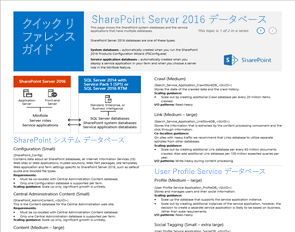
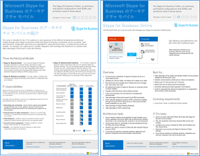
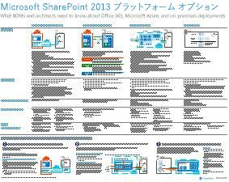
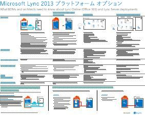
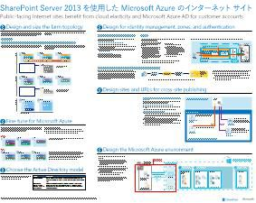
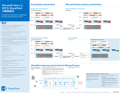

# SharePoint、Exchange、Skype for Business、Lync のアーキテクチャ モデル

 **の概要:**モデルのアーキテクチャ、展開、および SharePoint、Exchange、Skype のビジネス、および Lync のプラットフォーム ・ オプションを説明する IT のポスターを取得します。
  
これらの IT ポスターは、SharePoint、Exchange、Skype for Business、Lync のアーキテクチャ モデルと展開オプションについて説明し、Microsoft Azure で SharePoint を展開するための設計情報を提供します。
  
Office 365 では、コラボレーションと通信サービスが、ユーザーがクラウド ベースのサービスとしてよく使わを提供できます。いくつかの例外では、ユーザーの操作性は同じです、設置型の配置を維持するか、Office 365 を使用するかどうか。この統一されたユーザー エクスペリエンスでは、各作業負荷を配置する場所を決定するのには単純し、疑問を次のように。
  
- 個々のワークロードに対して選択するプラットフォーム オプションをどのように決定するか。
    
- オンプレミスのサービスを残すことに意味はあるか。
    
- どのようなシナリオではハイブリッド展開が適切か。
    
- Microsoft Azure は、画像にどのように合わせてでしょうか。
    
- Azure の Office Server ワークロードでサポートされている構成はどのようなものか。
    
> [!TIP]
> このページのポスターのほとんどは、中国語、英語、フランス語、ドイツ語、イタリア語、日本語、韓国語、ポルトガル語、ロシア語、スペイン語を含む複数の言語で提供されています。これらの言語のいずれかのポスターをダウンロードするには、ポスターの **[その他の言語]** リンクをクリックします。
  
ご意見をお知らせください。[cloudadopt@microsoft.com](mailto:cloudadopt@microsoft.com) に電子メールを送信してください。 
  
このページには次のポスターへのリンクがあります。
  
- **設計モデルのポスター**これらのリソースを使用するには、理想的なプラットフォームと SharePoint 2016 とビジネス 2015年の Skype の構成を決定します。
    
  - [Microsoft SharePoint 2016 のアーキテクチャ モデル](architectural-models-for-sharepoint-exchange-skype-for-business-and-lync.md#SP2016_ArchModel)
    
  - [Office 365 の OneDrive の複数の地域のプレビュー](architectural-models-for-sharepoint-exchange-skype-for-business-and-lync.md#MultiGeoO365ODB)
    
  - [SharePoint Server 2016 データベース](architectural-models-for-sharepoint-exchange-skype-for-business-and-lync.md#SP2016_Databases)
    
  - [マイクロソフトの Skype ビジネス 2015年のアーキテクチャ モデル](architectural-models-for-sharepoint-exchange-skype-for-business-and-lync.md#SfB2015_ArchModel)
    
- **プラットフォームのオプションのポスター**これらのリソースを使用するには、理想的なプラットフォームと SharePoint 2013、Exchange 2013 では、Lync 2013 の構成を決定します。
    
  - [SharePoint 2013 のプラットフォーム ・ オプション](architectural-models-for-sharepoint-exchange-skype-for-business-and-lync.md#SP2013_Options)
    
  - [Exchange 2013 のプラットフォーム ・ オプション](architectural-models-for-sharepoint-exchange-skype-for-business-and-lync.md#Exch2013_options)
    
  - [Lync 2013 のプラットフォーム ・ オプション](architectural-models-for-sharepoint-exchange-skype-for-business-and-lync.md#Lync2013_Options)
    
- **Azure ソリューション ポスターで、SharePoint Server 2013**デザインと Azure インフラストラクチャ サービスに、SharePoint Server 2013 の作業負荷の構成を確認するのには、これら IT のポスターを使用できます。
    
  - [SharePoint Server 2013 を使用して Microsoft Azure 内のインターネット サイト](architectural-models-for-sharepoint-exchange-skype-for-business-and-lync.md#Azure_sharepoint2013)
    
  - [設計サンプル: SharePoint 2013 の Microsoft Azure 内のインターネット サイト](architectural-models-for-sharepoint-exchange-skype-for-business-and-lync.md#DesignSampleInternetSites)
    
  - [Microsoft Azure への SharePoint 災害復旧](architectural-models-for-sharepoint-exchange-skype-for-business-and-lync.md#sharepoint_recovery_Azure)
    
## アーキテクチャ モデルのポスター

これらの SharePoint 2016 および Skype for Business 2015 向けの新しい IT ポスターは、印刷しやすい形式で、さまざまな展開の方法を比較する手段を提供します。各ポスターは利用可能な構成またはプラットフォーム オプションすべての一覧を示し、オプションごとに次の情報を説明します。
  
- **概要**概念図を含む、プラットフォームの概要です。
    
- **最適**適している特定のプラットフォームの一般的なシナリオです。
    
- **ライセンスの要件**展開に必要なライセンスです。
    
- **アーキテクチャ タスク**アーキテクトとして作成する必要があります決定します。
    
- **IT プロフェッショナルのタスクや責任の範囲**計画を立てる必要があるお客様の IT スタッフが日常業務です。
    
### Microsoft SharePoint 2016 のアーキテクチャ モデル

|**アイテム**|**説明**|
|:-----|:-----|
|[          ](https://www.microsoft.com/download/details.aspx?id=52650)   [PDF](https://download.microsoft.com/download/4/F/A/4FA0F94B-EE2F-41DB-A047-D9864FEF41E9/SharePoint2016ArchitecturalModels.pdf)  \| [Visio](https://download.microsoft.com/download/4/F/A/4FA0F94B-EE2F-41DB-A047-D9864FEF41E9/SharePoint2016ArchitecturalModels.vsdx)  \| [その他の言語](https://www.microsoft.com/download/details.aspx?id=52650)   | この IT ポスターでは、ビジネスの意思決定者とソリューション設計担当者が知っておく必要のある SharePoint Online、Microsoft Azure、SharePoint のオンプレミス構成について説明しています。    - **SharePoint Online (SaaS)**のサービス (SaaS) のサブスクリプション モデルとソフトウェアを SharePoint を消費します。   - **SharePoint のハイブリッド**に、SharePoint サイトおよびアプリケーションを自分のペースでクラウドに移行します。   - **Azure (IaaS) で SharePoint**の Microsoft Azure に設置環境を拡張し、ある 2016年の SharePoint のサーバーを展開します。(これは推奨高可用性/災害復旧/開発/テスト環境で)  - **SharePoint 設置**の計画、展開、管理および保存されているデータ ・ センターの SharePoint 環境をカスタマイズします。   |
   
### Office 365 の OneDrive の複数の地域のプレビュー

|**アイテム**|**説明**|
|:-----|:-----|
|[          ](http://download.microsoft.com/download/0/5/9/0594634F-7893-4201-938A-C2FF2F21B655/Multi-Geo-ODB.pdf)   [PDF](http://download.microsoft.com/download/0/5/9/0594634F-7893-4201-938A-C2FF2F21B655/Multi-Geo-ODB.pdf)  \| [Visio](http://download.microsoft.com/download/0/5/9/0594634F-7893-4201-938A-C2FF2F21B655/Multi-Geo-ODB.vsdx)   | このモデルは、Office 365 は、プライベートのプレビューでは、現在の複数の地域の OneDrive の 1 ページの概要です。このモデルが含まれています。   メリット   導入のステップ   -構成の例     Office 365 の OneDrive の複数地域のプレビューの詳細についてをクリックして[ここ](https://aka.ms/onedrivemultigeo)。    |
   
### SharePoint Server 2016 Database

|**アイテム**|**説明**|
|:-----|:-----|
|[          ](https://www.microsoft.com/download/details.aspx?id=55041)   [PDF](https://download.microsoft.com/download/D/5/D/D5DC1121-8BC5-4953-834F-1B5BB03EB691/DBrefguideSPS2016_tabloid.pdf)  \| [Visio](https://download.microsoft.com/download/D/5/D/D5DC1121-8BC5-4953-834F-1B5BB03EB691/DBrefguideSPS2016_tabloid.vsdx)  \| [その他の言語](https://www.microsoft.com/download/details.aspx?id=55041)   | この IT ポスターは、SharePoint Server 2016 データベースのクイック リファレンス ガイドです。各データベースには、以下の詳細情報があります。   サイズ   -ガイダンスをスケーリングします。   -I/O パターン   要件     最初のページには、SharePoint のシステム データベースとデータベースが複数存在するサービス アプリケーションが含まれています。2 番目のページには、1 つのデータベースが存在するサービス アプリケーションのすべてが表示されます。    SharePoint サーバー 2016年データベースの詳細については、[データベースの種類と SharePoint サーバーの 2016年の説明](https://technet.microsoft.com/en-us/library/cc678868%28v=office.16%29.aspx)参照してください。   |
   
### Microsoft Skype for Business 2015 のアーキテクチャ モデル

|**アイテム**|**説明**|
|:-----|:-----|
|[          ](https://www.microsoft.com/download/details.aspx?id=55022)   [PDF](https://download.microsoft.com/download/7/7/4/7741262C-A60D-41F7-863B-99BF5964FBFE/Skype%20for%20Business%20Architectural%20Models.pdf)  \| [Visio](https://download.microsoft.com/download/7/7/4/7741262C-A60D-41F7-863B-99BF5964FBFE/Skype%20for%20Business%20Architectural%20Models.vsd)  \| [その他の言語](https://www.microsoft.com/download/details.aspx?id=55022)   |このポスターは、ビジネス オンライン、社内設置型で、ハイブリッドに、Skype を説明、クラウド PBX、および Exchange と SharePoint の構成との統合、ビジネスの意思決定者とソリューション ・ アーキテクトを知る必要があります。    ビジネス オンラインの Skype と設置型のビジネス用の Skype を消費することができます、別の基本的なアーキテクチャ モデルの認識を高めるための IT プロフェッショナルのユーザー向けのものです。   ベストのどちらの構成に適した、組織のニーズと将来の計画を開始します。考慮し、必要に応じて他のユーザーを使用します。などの Exchange と SharePoint またはマイクロソフトのクラウド PBX ソリューションを活用するソリューションとの統合を検討します。    |
   
## プラットフォーム オプションのポスター

SharePoint 2013、Exchange 2013 および Lync 2013 向けのこれらの IT ポスターは、大きなポスターの形式で、一目でさまざまな展開の方法を比較する手段を提供します。各ポスターは利用可能な構成またはプラットフォーム オプションすべての一覧を示し、オプションごとに次の情報を説明します。
  
- **概要**概念図を含む、プラットフォームの概要です。
    
- **最適**適している特定のプラットフォームの一般的なシナリオです。
    
- **ライセンスの要件**展開に必要なライセンスです。
    
- **アーキテクチャ タスク**アーキテクトとして作成する必要があります決定します。
    
- **IT プロフェッショナルのタスクや責任の範囲**計画を立てる必要があるお客様の IT スタッフが日常業務です。
    
## SharePoint 2013 プラットフォーム オプション

****

|**アイテム**|**説明**|
|:-----|:-----|
|[          ](https://www.microsoft.com/download/details.aspx?id=40332)   [PDF](http://go.microsoft.com/fwlink/p/?LinkId=324594)  \| [Visio](https://go.microsoft.com/fwlink/p/?LinkId=324593)  \| [その他の言語](https://www.microsoft.com/download/details.aspx?id=40332)   |ビジネス ディシジョン メーカー (Bdm) と設計者は、このモデルは、SharePoint 2013、SharePoint で、Office 365、Office 365、Azure では、設置型のみの展開とオンプレミスのハイブリッドのプラットフォーム ・ オプションを示します。各アーキテクチャ、推奨事項、ライセンス契約の要件、およびアーキテクトおよびプラットフォームごとの IT プロフェッショナルの作業の一覧の概要を掲載しています。Azure 上のいくつかの SharePoint ソリューションを強調表示されます。  アクセシブルなテキストには、このポスターのバージョンが、[アクセス可能なダイアグラムを Microsoft SharePoint 2013 のプラットフォーム ・ オプション](accessible-diagrammicrosoft-sharepoint-2013-platform-options.md)を参照してください。    |
   
## Exchange 2013 プラットフォーム オプション

****

|**アイテム**|**説明**|
|:-----|:-----|
|[          ](https://www.microsoft.com/download/details.aspx?id=42676)   [PDF](https://go.microsoft.com/fwlink/p/?LinkID=398740)  \| [Visio](https://go.microsoft.com/fwlink/p/?LinkID=398742)  \| [その他の言語](https://www.microsoft.com/download/details.aspx?id=42676)   |Bdm とアーキテクトは、このモデルは、Exchange 2013 の利用可能なプラットフォームのオプションを説明します。お客様は、Office 365 では、ハイブリッドの交換、Exchange Server、オンプレミスおよびホストされている Exchange で Exchange のオンラインから選択できます。ポスターには、各ライセンス要件、IT プロフェッショナルの責任の最も理想的なシナリオを含め、アーキテクチャの各オプションの詳細が含まれています。  アクセシブルなテキストには、このポスターのバージョンが、[アクセス可能なダイアグラムを Microsoft Exchange 2013 のプラットフォーム ・ オプション](accessible-diagrammicrosoft-exchange-2013-platform-options.md)を参照してください。    |
   
## Lync 2013 プラットフォーム オプション

****

|**アイテム**|**説明**|
|:-----|:-----|
|[          ](https://www.microsoft.com/download/details.aspx?id=41677)   [PDF](https://go.microsoft.com/fwlink/p/?LinkID=391837)  \| [Visio](https://go.microsoft.com/fwlink/p/?LinkID=391839)  \| [その他の言語](https://www.microsoft.com/download/details.aspx?id=41677)   |このモデルは、管理職意思決定者と事業計画担当のために、Lync 2013 の使用可能なプラットフォーム オプションを示しています。お客様は Office 365 による Lync Online、Hybrid Lync、オンプレミス Lync Server、Hosted Lync から選択できます。IT ポスターにはそれぞれのオプションに最適なシナリオ、ライセンス要件、および IT 技術者の業務などを含む、各アーキテクチャのオプションの詳細が含まれています。    |
   
## Azure の SharePoint のソリューションのポスター

これら IT のポスターは、SharePoint Server 2013 を使用して大規模なポスター形式で Azure ベースのソリューションを表示します。
  
### SharePoint Server 2013 を使用した Microsoft Azure のインターネット サイト

****

|**アイテム**|**説明**|
|:-----|:-----|
|[          ](https://www.microsoft.com/download/details.aspx?id=41992)   [PDF](https://go.microsoft.com/fwlink/p/?LinkId=392552)  \| [Visio](https://go.microsoft.com/fwlink/p/?LinkId=392551)  \| [その他の言語](https://www.microsoft.com/download/details.aspx?id=41992)   |このポスターは、主要な設計活動の概要について説明し、Azure でインターネットに接続するサイトのアーキテクチャの選択肢をお勧めします。アクセシブルなテキストには、このポスターのバージョンが、[アクセス可能なダイアグラム - SharePoint 2013 の Microsoft Azure 内のインターネット サイト](accessible-diagraminternet-sites-in-microsoft-azure-for-sharepoint-2013.md)を参照してください。   詳細については、以下の記事を参照してください。     - [SharePoint Server 2013 を使用して Microsoft Azure 内のインターネット サイト](internet-sites-in-microsoft-azure-using-sharepoint-server-2013.md)   - [SharePoint 2013 の Microsoft Azure アーキテクチャ](microsoft-azure-architectures-for-sharepoint-2013.md)   - [Azure Active Directory を使用して SharePoint 2013 の認証のため](using-microsoft-azure-active-directory-for-sharepoint-2013-authentication.md)   |
   
### 設計サンプル: SharePoint 2013 のための Microsoft Azure のインターネット サイト

****

|**アイテム**|**説明**|
|:-----|:-----|
|[          ](https://www.microsoft.com/download/details.aspx?id=41991)   [PDF](https://go.microsoft.com/fwlink/p/?LinkId=392549)  \| [Visio](https://go.microsoft.com/fwlink/p/?LinkId=392548)  \| [その他の言語](https://www.microsoft.com/download/details.aspx?id=41991)   |独自アーキテクチャのインターネットに接続するサイトで、SharePoint Server 2013 を使用して、Azure の開始点としてこの設計サンプルを使用します。アクセシブルなテキストには、このポスターのバージョンが、次を参照してください。[アクセス可能な図の設計サンプル: インターネットのサイトで、SharePoint 2013 の Microsoft Azure](accessible-diagramdesign-sample-internet-sites-in-microsoft-azure-for-sharepoint.md)。   詳細については、以下の記事を参照してください。     - [SharePoint Server 2013 を使用して Microsoft Azure 内のインターネット サイト](internet-sites-in-microsoft-azure-using-sharepoint-server-2013.md)   - [SharePoint 2013 の Microsoft Azure アーキテクチャ](microsoft-azure-architectures-for-sharepoint-2013.md)   - [Azure Active Directory を使用して SharePoint 2013 の認証のため](using-microsoft-azure-active-directory-for-sharepoint-2013-authentication.md)   |
   
### Microsoft Azure に対する SharePoint の障害復旧

****

|**アイテム**|**説明**|
|:-----|:-----|
|[          ](https://www.microsoft.com/download/details.aspx?id=41993)   [PDF](https://go.microsoft.com/fwlink/p/?LinkId=392555)  \| [Visio](https://go.microsoft.com/fwlink/p/?LinkId=392554)  \| [その他の言語](https://www.microsoft.com/download/details.aspx?id=41993)   |この IT のポスターは、Azure での災害復旧環境のアーキテクチャの原則を示しています。アクセシブルなテキストには、このポスターのバージョンが、[アクセス可能なダイアグラム - Microsoft Azure に SharePoint の災害復旧](accessible-diagramsharepoint-disaster-recovery-to-microsoft-azure.md)を参照してください。   詳細については、以下の記事を参照してください。     - [Microsoft Azure では SharePoint Server 2013 の災害復旧](sharepoint-server-2013-disaster-recovery-in-microsoft-azure.md)   - [SharePoint 2013 の Microsoft Azure アーキテクチャ](microsoft-azure-architectures-for-sharepoint-2013.md)   |
   
## See Also

[クラウド導入およびハイブリッド ソリューション](cloud-adoption-and-hybrid-solutions.md)
  
[Microsoft クラウド IT アーキテクチャのリソース](microsoft-cloud-it-architecture-resources.md)
  
[クラウド導入のテスト ラボ ガイド (TLG)](cloud-adoption-test-lab-guides-tlgs.md)
  
[ハイブリッド ソリューション](hybrid-solutions.md)

