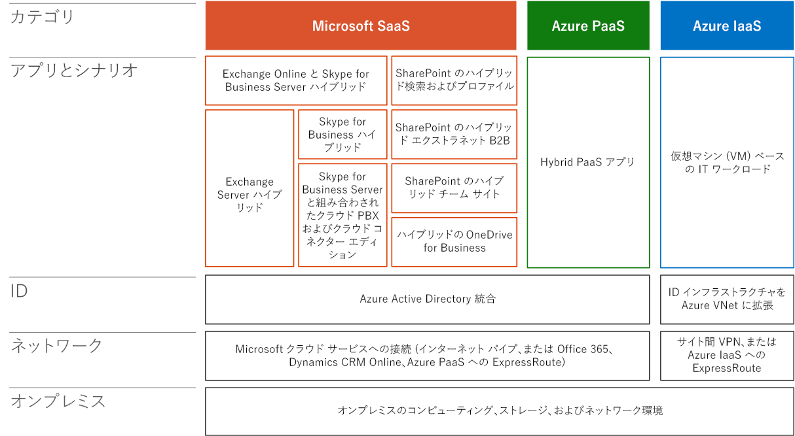

# Microsoft ハイブリッド クラウド シナリオのアーキテクチャ

 **概要:** Microsoft のハイブリッド クラウド製品のアーキテクチャについて説明します。
  
アーキテクチャ アプローチを使用して、Microsoft クラウド サービスおよびプラットフォームを使用するハイブリッド クラウド シナリオを計画して実装します。
  
**図 1:Microsoft ハイブリッド クラウド スタック**

  
図 1 は、Microsoft ハイブリッド クラウド スタックとそのレイヤーを示しています。レイヤーには、オンプレミス、ネットワーク、ID、アプリとシナリオ、およびクラウド サービスのカテゴリ (Microsoft SaaS、Azure PaaS、Azure PaaS) が含まれます。
  
アプリとシナリオのレイヤーには、このモデルの他の記事で詳しく説明された特定のハイブリッド クラウド シナリオが含まれます。ID、ネットワーク、オンプレミスのレイヤーは、クラウド サービスのカテゴリ (SaaS、PaaS、または PaaS) では共通である場合があります。
  
- オンプレミス
    
    ハイブリッド シナリオのオンプレミス インフラストラクチャには、SharePoint、Exchange、Skype for Business のサーバーと、基幹業務アプリケーションが含まれます。データ ストア (データベース、リスト、ファイル) を含めることもできます。ExpressRoute 接続がない場合、オンプレミス データ ストアへのアクセスは、リバース プロキシを介すか、サーバーまたはデータを DMZ またはエクストラネットでアクセス可能にすることによって許可する必要があります。
    
- ネットワーク
    
    Microsoft クラウド プラットフォームとサービスに接続するには、既存のインターネット パイプか ExpressRoute のいずれかを使用します。予測可能なパフォーマンスが重要な場合は、ExpressRoute 接続を使用します。ExpressRoute 接続を使用して、Microsoft SaaS サービス (Office 365 と Dynamics 365)、Azure PaaS サービス、および Azure PaaS サービスに直接接続できます。
    
- ID
    
    クラウド ID インフラストラクチャについては、Microsoft クラウド プラットフォームによって、2 つの方法があります。SaaS および Azure PaaS については、Azure AD にオンプレミス ID インフラストラクチャを統合するか、オンプレミス ID インフラストラクチャまたはサードパーティ ID プロバイダーでフェデレーションを行います。Azure で実行されている VM については、Windows Server AD などのオンプレミス ID インフラストラクチャを、VM が存在する仮想ネットワーク (VNet) に拡張できます。
    
## 3 段階のクラウド導入プロセスのハイブリッド クラウド シナリオ

Microsoft を含む多くの企業は、クラウドの採用に 3 段階のアプローチを使用します。ハイブリッド クラウド シナリオは各段階で役割を果たすことができます。
  
1. 生産性ワークロードを SaaS に移行する
    
    現状の生産性ワークロード、またはオンプレミスで維持する必要がある生産性ワークロードについて、ハイブリッド シナリオでは対応するクラウド ワークロードと統合できます。
    
2. Azure PaaS で最新のアプリケーションを開発する
    
    Azure PaaS ハイブリッド アプリケーションは、オンプレミスのサーバーまたはストレージ リソースを安全に活用できます。
    
3. 既存のアプリケーションを Azure IaaS に移動する
    
    移行 (リフトアンドシフト) およびクラウド内構築シナリオでは、Azure VM で実行されているサーバーベースのアプリケーションが容易なプロビジョニングとスケーリングを提供します。
    
## See Also

#### 

[エンタープライズ アーキテクトのための Microsoft ハイブリッド クラウド](microsoft-hybrid-cloud-for-enterprise-architects.md)
  
[Microsoft クラウド IT アーキテクチャのリソース](microsoft-cloud-it-architecture-resources.md)
#### 

[Microsoft's Enterprise Cloud Roadmap: Resources for IT Decision Makers](https://sway.com/FJ2xsyWtkJc2taRD)

