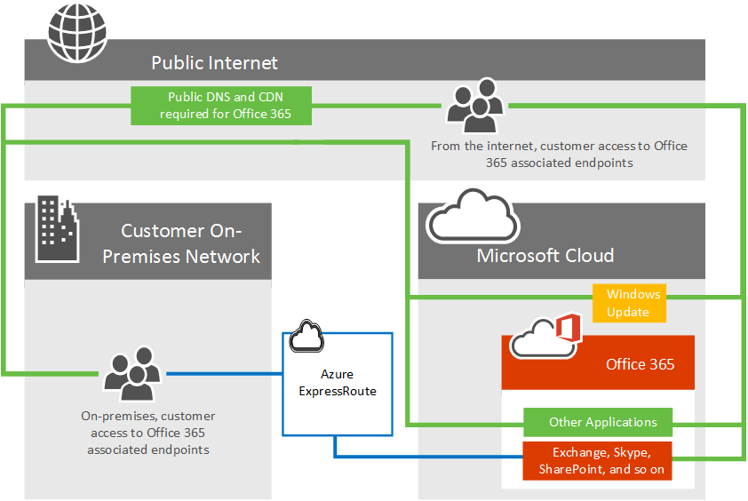

# Office 365 向け Azure ExpressRoute

Office 365 で Azure の ExpressRoute を使用する方法と、Office 365 で使用するための Azure ExpressRoute を展開する場合に求められるネットワークの実装プロジェクトを計画する方法について説明します。Azure で実行されているインフラストラクチャおよびプラットフォームのサービスは、ネットワーク アーキテクチャとパフォーマンスの考慮事項に対応することでメリットは多くの場合。Azure の ExpressRoute は、このような場合にお勧めします。としてサービスの提供、インターネット経由で安全かつ確実にアクセスするのには、Office 365、Dynamics 365 をビルドされているようなソフトウェアです。したがって、のみをお勧め ExpressRoute 特定のシナリオでこれらのアプリケーションです。インターネットのパフォーマンスとセキュリティを使用して Office 365 の[Office 365 へのネットワーク接続](network-connectivity.md)の資料に、Azure ExpressRoute を検討する可能性がありますを読み取ることができます。

> [!NOTE]
> 2017 年 7 月 31日の開始からは、Azure の管理コンソールまたは PowerShell を使用して直接 Microsoft Peering を有効にできます。Microsoft Peering を有効にすると、特定の BGP ルートのアドバタイズを受信するルート フィルターを作成できます。Office 365 のフィルターを作成するための承認を必要があり、いつでも Dynamics 365 お客様との契約 (旧 CRM Online) のアプリケーション フィルターを作成できます。Office 365 のルートのフィルターを作成するための承認を取得するプロセスについては、マイクロソフト アカウント チームに説明します。[エラー メッセージ](https://support.microsoft.com/kb/3181709)を取得するは、承認されていないサブスクリプションの Office 365 のルート フィルターを作成しようとしています。

選択した Office 365 のネットワーク トラフィックを Office 365 に今すぐネットワークに直接接続を追加できます。Azure の ExpressRoute は、予測可能なパフォーマンスは、直接接続を提供していますが、Microsoft ネットワーク コンポーネントの稼働時間 SLA 99.95% が付属しています。Azure ExpressRoute 経由でサポートされていないサービスのインターネットに接続を要求することもあります。

## Office 365 を Azure の ExpressRoute を計画します。

インターネット接続のほか、Office 365 のネットワーク トラフィックのサブセットを予測可能性と、99.95% の稼働時間 SLA の Microsoft ネットワーク コンポーネントへの直接接続経由でルーティングすることができます。Azure ExpressRoute に、この専用のネットワーク接続にする Office 365 とその他のマイクロソフトのクラウド サービスに提供します。

既存 MPLS WAN は、次の 3 つの方法の 1 つのネットワーク アーキテクチャに ExpressRoute を追加できます。クラウドがサポートされている exchange コロケーション プロバイダー、イーサネット ポイント ツー ポイント接続のプロバイダー、または MPLS 接続プロバイダーを使用します。どのような[プロバイダーは、お住まいの地域で利用可能な](https://azure.microsoft.com/documentation/articles/expressroute-locations/)を参照してください。ExpressRoute の直接の接続はで説明されているアプリケーションへの接続を有効にする[どのような Office 365 サービスに含まれているですか?](azure-expressroute.md#BKMK_WhatDoIGet)の下。他のすべてのアプリケーションとサービスのネットワーク トラフィックは、インターネット上をスキャンするように続けます。

一般的な Office 365 ユーザーが Office 365、Windows の更新プログラム、および TechNet など、Microsoft のすべてのアプリケーションへのアクセスをインターネット経由でマイクロソフトのデータ センターに接続するには次のような高レベルのネットワーク図を検討してください。お客様は、オンプレミスのネットワークから、または個別のインターネット接続から、接続するかどうかに関係なくネットワーク パスを使用します。

次に、更新された図は、インターネットと ExpressRoute の両方を使用して、Office 365 に接続するのには Office 365 ユーザーを示しています。パブリック DNS、コンテンツ配信ネットワークのノードなどのいくつかの接続は、パブリック インターネット接続をまだ必要とすることを確認します。またお客様のユーザーが接続されている建物は、インターネット経由で接続している、ExpressRoute で配置されていないを確認します。

詳細についてはしますか。については[Office 365 の Azure ExpressRoute でネットワーク トラフィックを管理](https://support.office.com/article/e1da26c6-2d39-4379-af6f-4da213218408)する方法について学習し、 [Office 365 の Azure ExpressRoute を構成](https://azure.microsoft.com/documentation/articles/expressroute-faqs/)する方法です。概念をより詳細に説明するためにチャネル 9 の 10 の一部の[Office 365 のトレーニングの Azure ExpressRoute](https://channel9.msdn.com/series/aer)シリーズ記録しました。

([Office 365 の azure ExpressRoute](azure-expressroute.md#BKMK_HOME))

## Office 365 サービスは、含まれているでしょうか。

次の表は、ExpressRoute 経由でサポートされている Office 365 のサービスを一覧します。これらのアプリケーションには、どのネットワーク要求は、インターネット接続を必要とするかを理解するのには[Office 365 の端点の資料](https://aka.ms/o365endpoints)を参照してください。

|**含まれているアプリケーション**|
|:-----|
|Exchange オンライン1   Exchange のオンライン保護1   1をを説明します。   |
|Skype ビジネス オンライン1   |
|SharePoint のオンライン1   ビジネス1の OneDrive   プロジェクト オンライン1   |
|ポータルと共有1   Azure Active Directory の1   AAD1をを接続します。   Office オンライン1   |

1それぞれのアプリケーションは、ExpressRoute 経由ではサポートされていないインターネット接続の要件がある、詳細については[Office 365 の端点の資料](https://aka.ms/o365endpoints)を参照してください。

Office 365 の ExpressRoute に含まれていないサービスは、Office 365 用リソースのクライアントのダウンロード、設置の Id プロバイダーのサインイン、および中国の (21 の Vianet 運用している)、Office 365 のサービスです。

([Office 365 の azure ExpressRoute](azure-expressroute.md#BKMK_HOME))

## Office 365 向け ExpressRoute での実装

ExpressRoute を実装するネットワークおよびアプリケーションの所有者の関与を必要とし、新しい[ネットワーク ルーティングのアーキテクチャ](https://support.office.com/article/e1da26c6-2d39-4379-af6f-4da213218408)セキュリティがありますが、帯域幅の要件を決定することを計画するように注意してください、実装、高可用性を実現する必要があります。などなど。ExpressRoute を実装する必要があります。

1. ExpressRoute は、Office 365 の接続の計画で満たす必要性を完全に理解するには。インターネットや ExpressRoute に使用するどのようなアプリケーションを理解する、セキュリティ、および高可用性が必要なインターネットと ExpressRoute の両方を使用して、Office 365 用のコンテキストではトラフィックのネットワークの容量の計画を綿密に。

2. 出口とインターネットとのトラフィックの ExpressRoute1の両方のピアリングの場所を決定します。

3. インターネットと ExpressRoute の接続に必要な容量を決定します。

4. セキュリティおよびその他の標準的な境界コントロール1を実装するために計画があります。

5. ExpressRoute を購読するのには有効な Microsoft Azure アカウントがあります。

6. 接続モデルとの[プロバイダーの承認](https://azure.microsoft.com/documentation/articles/expressroute-locations/)を選択します。注意してください、お客様は、複数の接続モデルを選択できます、または、パートナーのパートナーとする必要はありません、既存のネットワーク プロバイダーの場合と同じにします。

7. ExpressRoute へのトラフィックを送信する前に配置を検証します。

8. 必要に応じて、 [QoS を実装](https://support.office.com/article/ExpressRoute-and-QoS-in-Skype-for-Business-Online-20c654da-30ee-4e4f-a764-8b7d8844431d)および地域の拡張を評価します。

1パフォーマンスに関する重要な考慮事項です。意思決定ここでは、重要なビジネス用の Skype などのアプリケーションは、遅延を大幅に可能性があります。

その他の参照には、 [ExpressRoute のマニュアル](https://azure.microsoft.com/documentation/articles/expressroute-introduction/)だけでなくさまざまな[ルーティング ガイド](https://support.office.com/article/Routing-with-ExpressRoute-for-Office-365-e1da26c6-2d39-4379-af6f-4da213218408)を使用します。

Office 365 の ExpressRoute を購入するには、1 つまたは複数[のプロバイダーを承認](https://azure.microsoft.com/documentation/articles/expressroute-locations/)に必要な数とサイズの回路、ExpressRoute のプレミアム サブスクリプションの準備を使用する必要があります。Office 365 を購入するライセンスを追加することはありません。

戻るを使用することができます短いリンクを以下に示します。[https://aka.ms/expressrouteoffice365](https://aka.ms/expressrouteoffice365)

[Office 365 の ExpressRoute](https://aka.ms/ert)にサインアップできるでしょうか。

([Office 365 の azure ExpressRoute](azure-expressroute.md#BKMK_HOME))

## 関連項目

[Office 365 へのネットワーク接続](network-connectivity.md)

[Office 365 向け ExpressRoute の管理](managing-expressroute-for-connectivity.md)

[Office 365 向け ExpressRoute でのルーティング](routing-with-expressroute.md)

[Office 365 向け ExpressRoute でのネットワーク計画](network-planning-with-expressroute.md)

[Office 365 向け ExpressRoute での実装](implementing-expressroute.md)

[ExpressRoute に BGP のコミュニティを使用して Office 365 シナリオ (プレビュー)](bgp-communities-in-expressroute.md)

[メディアの品質とオンライン ビジネスの Skype でのネットワーク接続のパフォーマンス](https://support.office.com/article/5fe3e01b-34cf-44e0-b897-b0b2a83f0917)

[ベースラインとパフォーマンス履歴を使用した、Office 365 のパフォーマンスのチューニング](performance-tuning-using-baselines-and-history.md)

[Office 365 のパフォーマンスに関するトラブルシューティングの計画](performance-troubleshooting-plan.md)

[Office 365 の URL と IP アドレス範囲](https://support.office.com/article/8548a211-3fe7-47cb-abb1-355ea5aa88a2)

[Office 365 のネットワークとパフォーマンスの調整](network-planning-and-performance.md)
