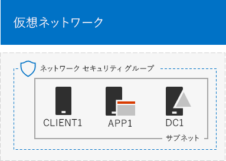
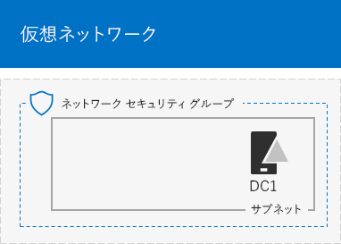

# <a name="base-configuration-devtest-environment"></a>基本構成開発/テスト環境

 **概要:** Microsoft Azure で、開発/テスト環境として簡略化されたイントラネットを作成します。
  
この記事では、Azure で次の基本構成開発/テスト環境を作成する手順について説明します。
  

  
**図 1: 基本構成開発/テスト環境**

図 1 の基本構成開発/テスト環境は、インターネットに接続された簡略化されたプライベート イントラネットをシミュレートする、TestLab というクラウド専用 Azure Virtual Network 内の企業ネットワーク サブネットで構成されています。Windows Server 2016 を実行している次の 3 つの Azure 仮想マシンが含まれます。
  
- イントラネット ドメイン コントローラーとドメイン ネーム システム (DNS) サーバーとして構成されている DC1
    
- 一般的なアプリケーションおよび Web サーバーとして構成されている APP1
    
- イントラネット クライアントとして動作する CLIENT1
    
この構成では、DC1、APP1、CLIENT1、他の企業ネットワークのサブネットのコンピューターを、次のようにします。 
  
- 更新プログラムをインストールするためにインターネットに接続して、リアルタイムでインターネット リソースにアクセスし、Microsoft Office 365 とその他の Azure サービスなどのパブリック クラウド テクノロジに参加する。
    
- インターネットや組織のネットワークに接続されているコンピューターから、リモート デスクトップ接続を使用してリモートで管理する。
    
作成したテスト環境を、次の目的に使用できます。
  
- アプリケーション開発とテスト。
    
- 追加の仮想マシン、Azure サービス、その他の Microsoft クラウド サービス (Office 365 や Enterprise Mobility + Security (EMS) など) を含む、独自の設計の拡張されたテスト環境の初期構成として。
    
このような環境を作成するには、2 つの方法があります。

1. Azure Resource Manager のテンプレート
2. Azure PowerShell

## <a name="method-1-build-your-simulated-intranet-with-an-azure-resource-manager-template"></a>方法 1: Azure Resource Manager テンプレートを使用して、シミュレートされたイントラネットを構築する

この方法では、Azure Resource Manager (ARM) テンプレートを使用してシミュレートされたイントラネットを構築します。ARM テンプレートには、Azure ネットワーク インフラストラクチャおよび仮想マシンを作成して構成するためのすべての手順が含まれています。

テンプレートを展開する前に「[テンプレートの Readme ページ](https://github.com/maxskunkworks/TLG/tree/master/tlg-base-config_3-vm)」を確認し、次の情報をご用意ください。

- Azure サブスクリプションの名前。**[カスタムの導入]** ページの **[サブスクリプション]** フィールドにこのラベルを入力する必要があります。
- Azure リソース グループの名前。**[カスタムの導入]** ページの **[リソース グループ]** フィールドにこのラベルを入力する必要があります。
- 仮想マシンのパブリック IP アドレスの URL の DNS ラベル プレフィックス。[**カスタム デプロイ**] ページの [**DNS ラベル プレフィックス**] フィールドにこのラベルを入力する必要があります。

手順をすべて確認したら、[[テンプレートの Readme ページ](https://github.com/maxskunkworks/TLG/tree/master/tlg-base-config_3-vm)] で [**Azure に展開**] をクリックして展開を開始します。

>[!Note]
>ARM テンプレートで作成されたシミュレートされたイントラネットでは、Azure の有料サブスクリプションが必要です。
>

こちらがテンプレート完了後の構成です。


## <a name="method-2-build-your-simulated-intranet-with-azure-powershell"></a>方法 2: Azure PowerShell を使用してシミュレートされたイントラネットを構築する

この方法では、Windows PowerShell と Azure PowerShell モジュールを使用してネットワーク インフラストラクチャ、仮想マシン、およびその構成を構築します。

Azure インフラストラクチャの要素を作成する作業を、PowerShell でコマンド ブロックを 1 つずつ進める方法で経験してみたいという場合は、この方法をお使いください。その後、Azure で他の仮想マシンを展開するために PowerShell コマンドのブロックをカスタマイズできます。

Azure PowerShell を使った基本構成テスト環境の設定には次の 4 つのステップがあります。
  
1. 仮想ネットワークを作成します。
    
2. DC1 を構成します。
    
3. APP1 を構成します。
    
4. CLIENT1 を構成します。
    
まだ Azure サブスクリプションを取得していない場合は、「[Azure の無料アカウントを今すぐ作成しましょう](https://azure.microsoft.com/pricing/free-trial/)」で無料トライアルにサインアップできます。MSDN や Visual Studio のサブスクリプションを取得している場合は、「[Visual Studio サブスクライバー向けの月単位の Azure クレジット](https://azure.microsoft.com/pricing/member-offers/msdn-benefits-details/)」を参照してください。
  
> [!NOTE]
> Azure の仮想マシンは、実行中に継続して金銭的なコストが発生します。このコストは、無料試用版、MSDN サブスクリプション、有料版サブスクリプションに対して請求されます。Azure 仮想マシンの実行にかかるコストの詳細については、「[Linux Virtual Machines の料金](https://azure.microsoft.com/pricing/details/virtual-machines/)」と「[料金計算ツール](https://azure.microsoft.com/pricing/calculator/)」を参照してください。コストを低く抑えるには、「[Azure のテスト環境の仮想マシンのコストを最小限に抑える](base-configuration-dev-test-environment.md#mincost)」を参照してください。 
  

  
> [!TIP]
> [ここ](http://aka.ms/catlgstack)をクリックして、One Microsoft Cloud のテスト ラボ ガイド スタックに含まれるすべての記事のビジュアル マップをご確認ください。
  
### <a name="step-1-create-the-virtual-network"></a>ステップ 1: 仮想ネットワークを作成します。

このステップでは、Azure で TestLab 仮想ネットワークを作成します。

最初に、Azure PowerShell プロンプトを起動します。
  
> [!NOTE]
> 次に示すコマンド セットは、Azure PowerShell の最新版を使用します。「[Azure PowerShell の概要](https://docs.microsoft.com/ja-JP/powershell/azureps-cmdlets-docs/)」を参照してください。 
  
次のコマンドを使用して Azure アカウントにログインします。
  
```
Login-AzureRMAccount
```

> [!TIP]
> この記事に掲載されているすべての PowerShell コマンドを含むテキスト ファイルを入手するには、[ここ](https://gallery.technet.microsoft.com/PowerShell-commands-for-ba957d3d)をクリックしてください。
  
次のコマンドを使用して、サブスクリプションの名前を取得します。
  
```
Get-AzureRMSubscription | Sort Name | Select Name
```

Azure サブスクリプションを設定します。二重引用符内のすべて (「<」と「>」の文字を含む) を正しい名前に置き換えます。
  
```
$subscr="<subscription name>"
Get-AzureRmSubscription -SubscriptionName $subscr | Select-AzureRmSubscription
```

次に、基本構成テスト ラボ用の新しいリソース グループを作成します。一意のリソース グループ名を特定するには、このコマンドを使用して既存のリソース グループを一覧表示します。
  
```
Get-AzureRMResourceGroup | Sort ResourceGroupName | Select ResourceGroupName
```

これらのコマンドを使用して、新しいリソース グループを作成します。二重引用符内のすべて (< 文字と > 文字を含む) を正しい名前に置き換えます。
  
```
$rgName="<resource group name>"
$locName="<location name, such as West US>"
New-AzureRMResourceGroup -Name $rgName -Location $locName
```

次に、基本構成の企業ネットワークのサブネットをホストする TestLab 仮想ネットワークを作成し、ネットワーク セキュリティ グループで保護します。
  
```
$rgName="<name of your new resource group>"
$locName=(Get-AzureRmResourceGroup -Name $rgName).Location
$corpnetSubnet=New-AzureRMVirtualNetworkSubnetConfig -Name Corpnet -AddressPrefix 10.0.0.0/24
New-AzureRMVirtualNetwork -Name TestLab -ResourceGroupName $rgName -Location $locName -AddressPrefix 10.0.0.0/8 -Subnet $corpnetSubnet -DNSServer 10.0.0.4
$rule1=New-AzureRMNetworkSecurityRuleConfig -Name "RDPTraffic" -Description "Allow RDP to all VMs on the subnet" -Access Allow -Protocol Tcp -Direction Inbound -Priority 100 -SourceAddressPrefix Internet -SourcePortRange * -DestinationAddressPrefix * -DestinationPortRange 3389
New-AzureRMNetworkSecurityGroup -Name Corpnet -ResourceGroupName $rgName -Location $locName -SecurityRules $rule1
$vnet=Get-AzureRMVirtualNetwork -ResourceGroupName $rgName -Name TestLab
$nsg=Get-AzureRMNetworkSecurityGroup -Name Corpnet -ResourceGroupName $rgName
Set-AzureRMVirtualNetworkSubnetConfig -VirtualNetwork $vnet -Name Corpnet -AddressPrefix "10.0.0.0/24" -NetworkSecurityGroup $nsg
```

こちらが現在の構成です。
  

  
### <a name="step-2-configure-dc1"></a>ステップ 2: DC1 を構成する

このステップでは、DC1 仮想マシンを作成し、それを Windows Server Active Directory (AD) の corp.contoso.comis ドメインのドメイン コントローラー、および TestLab 仮想ネットワークの仮想マシン用の DNS サーバーとして構成します。

> [!NOTE]
> 以下のコマンド ブロックを実行する前に、選択した Azure リージョン (場所) が Azure の仮想マシンのサイズをサポートしているか確認してください。既定では、Standard_A1 に設定されています。[ここ](https://azure.microsoft.com/global-infrastructure/services/?products=virtual-machines)をクリックすると Azure 仮想マシンのサイズと場所を確認できます。
  
DC1 用の Azure 仮想マシンを作成するには、リソース グループの名前を入力して、次に示すコマンドをローカル コンピューターの Azure PowerShell コマンド プロンプトから実行します。
  
```
$rgName="<resource group name>"
$locName=(Get-AzureRmResourceGroup -Name $rgName).Location
$vnet=Get-AzureRMVirtualNetwork -Name TestLab -ResourceGroupName $rgName
$pip=New-AzureRMPublicIpAddress -Name DC1-PIP -ResourceGroupName $rgName -Location $locName -AllocationMethod Dynamic
$nic=New-AzureRMNetworkInterface -Name DC1-NIC -ResourceGroupName $rgName -Location $locName -SubnetId $vnet.Subnets[0].Id -PublicIpAddressId $pip.Id -PrivateIpAddress 10.0.0.4
$vm=New-AzureRMVMConfig -VMName DC1 -VMSize Standard_A1
$cred=Get-Credential -Message "Type the name and password of the local administrator account for DC1."
$vm=Set-AzureRMVMOperatingSystem -VM $vm -Windows -ComputerName DC1 -Credential $cred -ProvisionVMAgent -EnableAutoUpdate
$vm=Set-AzureRMVMSourceImage -VM $vm -PublisherName MicrosoftWindowsServer -Offer WindowsServer -Skus 2016-Datacenter -Version "latest"
$vm=Add-AzureRMVMNetworkInterface -VM $vm -Id $nic.Id
$vm=Set-AzureRmVMOSDisk -VM $vm -Name "DC1-OS" -DiskSizeInGB 128 -CreateOption FromImage -StorageAccountType "Standard_LRS"
$diskConfig=New-AzureRmDiskConfig -AccountType "Standard_LRS" -Location $locName -CreateOption Empty -DiskSizeGB 20
$dataDisk1=New-AzureRmDisk -DiskName "DC1-DataDisk1" -Disk $diskConfig -ResourceGroupName $rgName
$vm=Add-AzureRmVMDataDisk -VM $vm -Name "DC1-DataDisk1" -CreateOption Attach -ManagedDiskId $dataDisk1.Id -Lun 1
New-AzureRMVM -ResourceGroupName $rgName -Location $locName -VM $vm
```

DC1 のローカル管理者アカウントのユーザー名とパスワードを入力するようダイアログが表示されます。強力なパスワードを使用して、安全な場所に名前とパスワードの両方を記録します。
  
次に、DC1 仮想マシンに接続します。
  
1. [Azure portal](https://portal.azure.com) で、**[リソース グループ] > **「新しいリソース グループの名前」** > [DC1] > [接続]** の順にクリックします。
    
2. 起動ウィンドウで **[RDP ファイルのダウンロード]** をクリックします。ダウンロードされる DC1.rdp ファイルを開いてから、**[接続]** をクリックします。
    
3. DC1 のローカル管理者アカウント名を指定します。
    
  - Windows 7 の場合:
    
    **[Windows セキュリティ]** ダイアログ ボックスで、**[別のアカウントを使用]** をクリックします。**[ユーザー名]** に「**DC1\\**[ローカル管理者アカウント名]」を入力します。
    
  - Windows 8 または Windows 10 の場合:
    
    **[Windows セキュリティ]** ダイアログ ボックスで、**[その他]** をクリックし、**[別のアカウントを使用する]** をクリックします。**[ユーザー名]** に、「**DC1\\**[ローカル管理者アカウント名]」を入力します。
    
4. **[パスワード]** にローカル管理者アカウントのパスワードを入力して、**[OK]** をクリックします。
    
5. ダイアログが表示されたら、**[はい]** をクリックします。
    
次に、DC1 の管理者レベルの Windows PowerShell コマンド プロンプトで次のコマンドを使用して、新しいボリュームとして別のデータ ディスク (ドライブ文字 F:) を追加します。
  
```
Get-Disk | Where PartitionStyle -eq "RAW" | Initialize-Disk -PartitionStyle MBR -PassThru | New-Partition -AssignDriveLetter -UseMaximumSize | Format-Volume -FileSystem NTFS -NewFileSystemLabel "WSAD Data"
```

次に corp.contoso.com ドメインのドメイン コントローラーおよび DNS サーバーとして DC1 を構成します。管理者レベルの Windows PowerShell コマンド プロンプトで、次のコマンドを実行します。
  
```
Install-WindowsFeature AD-Domain-Services -IncludeManagementTools
Install-ADDSForest -DomainName corp.contoso.com -DatabasePath "F:\NTDS" -SysvolPath "F:\SYSVOL" -LogPath "F:\Logs"
```
セーフ モードの管理者パスワードを指定する必要があります。パスワードを安全な場所に保存します。
  
これらのコマンドの完了には数分かかることがあります。
  
DC1 の再起動後に、ドメインの資格情報を使って DC1 仮想マシンに再接続します。
  
1. [Azure portal](https://portal.azure.com) で、**[リソース グループ] > **[リソース グループ名]** > [DC1] > [接続]** をクリックします。
    
2. ダウンロードされる DC1.rdp ファイルを実行して、**[接続]** をクリックします。
    
3. **[Windows セキュリティ]** で **[別のアカウントを使用]** をクリックします。**[ユーザー名]** に「**CORP\\**[ローカル管理者アカウント名]」を入力します。
    
4. **[パスワード]** にローカル管理者アカウントのパスワードを入力して、**[OK]** をクリックします。
    
5. ダイアログが表示されたら、**[はい]** をクリックします。
    
次に、CORP ドメイン メンバー コンピューターにログインするときに使用する、Active Directory のユーザー アカウントを作成します。管理者レベルの Windows PowerShell コマンド プロンプトで、次のコマンドを実行します。
  
```
New-ADUser -SamAccountName User1 -AccountPassword (read-host "Set user password" -assecurestring) -name "User1" -enabled $true -PasswordNeverExpires $true -ChangePasswordAtLogon $false
```

このコマンドでは、User1 アカウントのパスワードを入力するよう求められることに注意してください。このアカウントは、すべての CORP ドメイン メンバー コンピューターのリモート デスクトップ接続に使用するため、強力なパスワードを選択してください。User1 アカウントのパスワードを記録し、セキュリティで保護された場所に保管します。
  
次に、エンタープライズ管理者として新しい User1 のアカウントを構成します。管理者レベルの Windows PowerShell コマンド プロンプトで、次のコマンドを実行します。
  
```
Add-ADPrincipalGroupMembership -Identity "CN=User1,CN=Users,DC=corp,DC=contoso,DC=com" -MemberOf "CN=Enterprise Admins,CN=Users,DC=corp,DC=contoso,DC=com","CN=Domain Admins,CN=Users,DC=corp,DC=contoso,DC=com","CN=Schema Admins,CN=Users,DC=corp,DC=contoso,DC=com"
```

DC1 とのリモート デスクトップ セッションを終了し、CORP\\User1 のアカウントを使用して再接続します。
  
次に、Ping ツールのトラフィックを許可するため、管理者レベルの Windows PowerShell コマンド プロンプトで、次のコマンドを実行します。
  
```
Set-NetFirewallRule -DisplayName "File and Printer Sharing (Echo Request - ICMPv4-In)" -enabled True
```

こちらが現在の構成です。
  

  
### <a name="step-3-configure-app1"></a>ステップ 3: APP1 を構成する

このステップでは、Web およびファイル共有サービスを提供する APP1 を作成して構成します。

> [!NOTE]
> 以下のコマンド ブロックを実行する前に、選択した Azure リージョン (場所) が Azure の仮想マシンのサイズをサポートしているか確認してください。既定では、Standard_A1 に設定されています。[ここ](https://azure.microsoft.com/global-infrastructure/services/?products=virtual-machines)をクリックすると Azure 仮想マシンのサイズと場所を確認できます。
  
APP1 用の Azure 仮想マシンを作成するには、リソース グループの名前を入力して、次に示すコマンドをローカル コンピューターの Azure PowerShell コマンド プロンプトから実行します。
  
```
$rgName="<resource group name>"
$locName=(Get-AzureRmResourceGroup -Name $rgName).Location
$vnet=Get-AzureRMVirtualNetwork -Name TestLab -ResourceGroupName $rgName
$pip=New-AzureRMPublicIpAddress -Name APP1-PIP -ResourceGroupName $rgName -Location $locName -AllocationMethod Dynamic
$nic=New-AzureRMNetworkInterface -Name APP1-NIC -ResourceGroupName $rgName -Location $locName -SubnetId $vnet.Subnets[0].Id -PublicIpAddressId $pip.Id
$vm=New-AzureRMVMConfig -VMName APP1 -VMSize Standard_A1
$cred=Get-Credential -Message "Type the name and password of the local administrator account for APP1."
$vm=Set-AzureRMVMOperatingSystem -VM $vm -Windows -ComputerName APP1 -Credential $cred -ProvisionVMAgent -EnableAutoUpdate
$vm=Set-AzureRMVMSourceImage -VM $vm -PublisherName MicrosoftWindowsServer -Offer WindowsServer -Skus 2016-Datacenter -Version "latest"
$vm=Add-AzureRMVMNetworkInterface -VM $vm -Id $nic.Id
$vm=Set-AzureRmVMOSDisk -VM $vm -Name "APP1-OS" -DiskSizeInGB 128 -CreateOption FromImage -StorageAccountType "Standard_LRS"
New-AzureRMVM -ResourceGroupName $rgName -Location $locName -VM $vm
```

次に、APP1 のローカル管理者アカウント名とパスワードを使用して APP1 仮想マシンに接続し、Windows PowerShell コマンド プロンプトを開きます。
  
APP1 と DC1 の間の名前の解決とネットワーク通信を確認するには、**ping dc1.corp.contoso.com** コマンドを実行し、4 つの応答があることを確認します。
  
次に、Windows PowerShell プロンプトでこれらのコマンドを使用して、APP1 仮想マシンを CORP ドメインに参加させます。
  
```
Add-Computer -DomainName corp.contoso.com
Restart-Computer
```

**Add-Computer** コマンドの実行後には、CORP\\User1 ドメイン アカウントの資格情報を入力する必要がある点に注意してください。
  
APP1 の再起動後に、CORP\\User1 のアカウントを使用して接続し、管理者レベルの Windows PowerShell コマンド プロンプトを開きます。
  
次に、APP1 の Windows PowerShell コマンド プロンプトで、このコマンドを使用して、APP1 を Web サーバーにします。
  
```
Install-WindowsFeature Web-WebServer -IncludeManagementTools
```

次に、APP1 で共有フォルダーを次の PowerShell コマンドを使用して作成し、そのフォルダー内にテキスト ファイルを作成します。
  
```
New-Item -path c:\files -type directory
Write-Output "This is a shared file." | out-file c:\files\example.txt
New-SmbShare -name files -path c:\files -changeaccess CORP\User1
```

こちらが現在の構成です。
  

  
### <a name="step-4-configure-client1"></a>ステップ 4: CLIENT1 を構成する

このステップでは、Contoso イントラネット上の一般的なラップトップ、タブレット、またはデスクトップ コンピューターとして機能する CLIENT1 を作成して構成します。

> [!NOTE]  
> 次のコマンド セットでは、Windows Server 2016 Datacenter を実行する CLIENT1 を作成します。これは、すべての Azure サブスクリプションのタイプに対して実行できます。Visual Studio ベースの Azure サブスクリプションがある場合は、[Azure portal](https://portal.azure.com) で、Windows 10 を実行する CLIENT1 を作成できます。 
  

> [!NOTE]
> 以下のコマンド ブロックを実行する前に、選択した Azure リージョン (場所) が Azure の仮想マシンのサイズをサポートしているか確認してください。既定では、Standard_A1 に設定されています。[ここ](https://azure.microsoft.com/global-infrastructure/services/?products=virtual-machines)をクリックすると Azure 仮想マシンのサイズと場所を確認できます。
  
CLIENT1 用の Azure 仮想マシンを作成するには、リソース グループの名前を入力して、次に示すコマンドをローカル コンピューターの Azure PowerShell コマンド プロンプトから実行します。
  
```
$rgName="<resource group name>"
$locName=(Get-AzureRmResourceGroup -Name $rgName).Location
$vnet=Get-AzureRMVirtualNetwork -Name TestLab -ResourceGroupName $rgName
$pip=New-AzureRMPublicIpAddress -Name CLIENT1-PIP -ResourceGroupName $rgName -Location $locName -AllocationMethod Dynamic
$nic=New-AzureRMNetworkInterface -Name CLIENT1-NIC -ResourceGroupName $rgName -Location $locName -SubnetId $vnet.Subnets[0].Id -PublicIpAddressId $pip.Id
$vm=New-AzureRMVMConfig -VMName CLIENT1 -VMSize Standard_A1
$cred=Get-Credential -Message "Type the name and password of the local administrator account for CLIENT1."
$vm=Set-AzureRMVMOperatingSystem -VM $vm -Windows -ComputerName CLIENT1 -Credential $cred -ProvisionVMAgent -EnableAutoUpdate
$vm=Set-AzureRMVMSourceImage -VM $vm -PublisherName MicrosoftWindowsServer -Offer WindowsServer -Skus 2016-Datacenter -Version "latest"
$vm=Add-AzureRMVMNetworkInterface -VM $vm -Id $nic.Id
$vm=Set-AzureRmVMOSDisk -VM $vm -Name "CLIENT1-OS" -DiskSizeInGB 128 -CreateOption FromImage -StorageAccountType "Standard_LRS"
New-AzureRMVM -ResourceGroupName $rgName -Location $locName -VM $vm
```

次に、CLIENT1 のローカル管理者アカウント名とパスワードを使用して、CLIENT1 仮想マシンに接続し、管理者レベルの Windows PowerShell コマンド プロンプトを開きます。
  
CLIENT1 と DC1 の間の名前の解決とネットワーク通信を確認するには、Windows PowerShell コマンド プロンプトで **ping dc1.corp.contoso.com** コマンドを実行し、4 つの応答があることを確認します。
  
次に、Windows PowerShell プロンプトで次のコマンドを使用して、CLIENT1 仮想マシンを CORP ドメインに参加させます。
  
```
Add-Computer -DomainName corp.contoso.com
Restart-Computer
```

**Add-Computer** コマンドの実行後に、CORP\\User1 ドメイン アカウントの資格情報を入力する必要がある点に注意してください。
  
CLIENT1 の再起動後に、CORP\\User1 のアカウント名とパスワードを使用して接続し、管理者レベルの Windows PowerShell コマンド プロンプトを開きます。
  
次に、CLIENT1 から APP1 の Web リソースおよびファイル共有リソースにアクセスできることを確認します。
  
1. サーバー マネージャーのツリー ウィンドウで、**[ローカル サーバー]** をクリックします。
    
2. **[CLIENT1 のプロパティ]** で、**[IE セキュリティ強化の構成]** の横にある **[オン]** をクリックします。
    
3. **[Internet Explorer セキュリティ強化の構成]** で、**[管理者]** と **[ユーザー]** の **[オフ]** をクリックしてから、**[OK]** をクリックします。
    
4. スタート画面で、**[Internet Explorer]** をクリックしてから、**[OK]** をクリックします。
    
5. アドレス バーに「**http:\//app1.corp.contoso.com/**」と入力してから、ENTER キーを押します。APP1 の既定のインターネット インフォメーション サービスの Web ページが表示されます。
    
6. デスクトップのタスクバーで、[エクスプローラー] アイコンをクリックします。
    
7. アドレス バーに「**\\\\app1\\Files**」と入力して、ENTER キーを押します。フォルダー ウィンドウにファイルの共有フォルダーのコンテンツが表示されます。
    
8. **[ファイル]** の共有フォルダー ウィンドウで、**[Example.txt]** ファイルをダブルクリックします。Example.txt ファイルのコンテンツが表示されます。
    
9. **[example.txt - メモ帳]** と **[ファイル]** の共有フォルダーのウィンドウを閉じます。
    
これが、最終的な構成です。
  

  
Azure の基本構成は、アプリケーション開発とテスト、追加のテスト環境の作成を行うための準備ができました。 
  
> [!TIP]
> [ここ](http://aka.ms/catlgstack)をクリックして、One Microsoft Cloud のテスト ラボ ガイド スタックに含まれるすべての記事のビジュアル マップをご確認ください。
  
<a name="mincost"> </a>
## <a name="minimizing-the-costs-of-test-environment-virtual-machines-in-azure"></a>Azure のテスト環境の仮想マシンのコストを最小限に抑える

テスト環境の仮想マシンを実行するコストを最小限に抑えるには、次のいずれかの操作を行います。
  
- テスト環境を作成し、できるだけ早く、必要なテストとデモを行います。完了したら、テスト環境のリソース グループを削除します。
    
- テスト環境の仮想マシンをシャットダウンして、割り当てが解除された状態にします。
    
Azure PowerShell で仮想マシンをシャットダウンするには、リソース グループ名を入力し、次のコマンドを実行してください。
  
```
$rgName="<your resource group name>"
Stop-AzureRMVM -ResourceGroupName $rgName -Name "CLIENT1" -Force
Stop-AzureRMVM -ResourceGroupName $rgName -Name "APP1" -Force
Stop-AzureRMVM -ResourceGroupName $rgName -Name "DC1" -Force
```

すべての仮想マシンを停止 (割り当て解除) 状態から起動するときに正常に動作させるには、仮想マシンを次の順序で起動する必要があります。
  
1. DC1
2. APP1
3. CLIENT1
    
Azure PowerShell で仮想マシンを順番に起動するには、リソース グループ名を入力し、次のコマンドを実行してください。
  
```
$rgName="<your resource group name>"
Start-AzureRMVM -ResourceGroupName $rgName -Name "DC1"
Start-AzureRMVM -ResourceGroupName $rgName -Name "APP1"
Start-AzureRMVM -ResourceGroupName $rgName -Name "CLIENT1"
```

## <a name="see-also"></a>関連項目

- [Office 365 開発/テスト環境](office-365-dev-test-environment.md)
- [Office 365 開発/テスト環境の DirSync](dirsync-for-your-office-365-dev-test-environment.md)
- [Office 365 開発/テスト環境の Cloud App Security](cloud-app-security-for-your-office-365-dev-test-environment.md)
- [Office 365 開発/テスト環境の Advanced Threat Protection](advanced-threat-protection-for-your-office-365-dev-test-environment.md)
- [クラウド導入およびハイブリッド ソリューション](cloud-adoption-and-hybrid-solutions.md)
