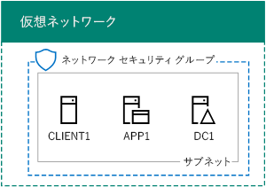
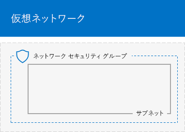
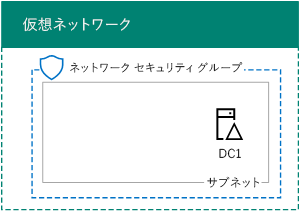
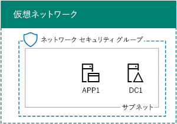

# <a name="base-configuration-devtest-environment"></a>基本構成開発/テスト環境

 **の概要:**Microsoft Azure で開発/テスト環境としては、簡略化されたイントラネットを作成します。
  
この記事では、Azure で次の基本構成開発/テスト環境を作成するための詳しい手順について説明します。
  
**図 1: 基本構成の開発/テスト環境**


  
図 1 の基本構成開発/テスト環境は、インターネットに接続された簡略化されたプライベート イントラネットをシミュレートする、TestLab というクラウド専用 Azure 仮想ネットワーク内の企業ネットワーク サブネットで構成されています。Windows Server 2016 を実行している次の 3 つの Azure 仮想マシンが含まれます。
  
- イントラネット ドメイン コントローラーとドメイン ネーム システム (DNS) サーバーとして構成されている DC1
    
- 一般的なアプリケーションおよび Web サーバーとして構成されている APP1
    
- 	イントラネット クライアントとして動作する CLIENT1
    
この構成では、DC1、APP1、CLIENT1、他の企業ネットワークのサブネットのコンピューターを、次のようにできます。  
  
- 更新プログラムをインストールするのにはインターネットに接続されているをリアルタイムに、インターネット リソースにアクセスし、Microsoft Office 365 とその他の Azure のサービスなどのパブリック クラウド テクノロジに参加します。
    
- 	インターネットや組織のネットワークに接続されているコンピューターから、リモート デスクトップ接続を使用してリモートで管理する。
    
作成したテスト環境を、次の目的に使用できます。
  
- アプリケーション開発とテスト。
    
- 独自設計の拡張されたテスト環境の初期構成としては、追加の仮想マシン、Azure のサービス、またはその他のマイクロソフトのクラウド サービス Office 365 およびエンタープライズ セキュリティ + 移動などを含みます。
    
Azure の基本構成テスト環境の設定には次の 4 つのフェーズがあります。
  
1. 	仮想ネットワークを作成します。
    
2. 	DC1 を構成します。
    
3. 	APP1 を構成します。
    
4. 	CLIENT1 を構成します。
    
Azure サブスクリプションがあるない場合[と Azure](https://azure.microsoft.com/pricing/free-trial/)の無料試用版にサインアップすることができます。MSDN または Visual Studio のサブスクリプションがある場合は、 [Visual Studio のサブスクライバーに対して毎月 Azure のクレジット](https://azure.microsoft.com/pricing/member-offers/msdn-benefits-details/)を参照してください。
  
> [!NOTE]
> Azure の仮想マシンでは、実行されている場合に、継続的な金銭的コストが発生します。このコストは無料試用版を MSDN サブスクリプションに対して請求されるか、またはサブスクリプションを支払います。Azure の仮想マシンを実行しているの詳細については、コストは、[仮想マシンの価格設定の詳細](https://azure.microsoft.com/pricing/details/virtual-machines/)と[Azure の価格の計算](https://azure.microsoft.com/pricing/calculator/)を参照してください。コスト削減を維持、 [Azure でテスト環境の仮想マシンのコストを最小限に抑えること](base-configuration-dev-test-environment.md#mincost)を参照してください。 
  

  
> [!TIP]
> 
            [ここ](http://aka.ms/catlgstack)をクリックして、One Microsoft Cloud のテスト ラボ ガイド スタックに含まれるすべての記事のビジュアル マップをご確認ください。
  
## <a name="phase-1-create-the-virtual-network"></a>フェーズ 1: 仮想ネットワークを作成する

最初に、Azure PowerShell プロンプトを起動します。
  
> [!NOTE]
> 次のコマンド セットは、Azure の PowerShell の最新バージョンを使用します。[Azure の PowerShell コマンドレットの入門](https://docs.microsoft.com/en-us/powershell/azureps-cmdlets-docs/)を参照してください。 
  
次のコマンドを使用して Azure アカウントにログインします。
  
```
Login-AzureRMAccount
```

> [!TIP]
> クリックして[ここでは](https://gallery.technet.microsoft.com/PowerShell-commands-for-ba957d3d)この資料ですべての PowerShell コマンドを含むテキスト ファイルを取得します。
  
次のコマンドを使用して、サブスクリプションの名前を取得します。
  
```
Get-AzureRMSubscription | Sort Name | Select Name
```

Azure サブスクリプションを設定します。二重引用符内のすべて (「<」と「>」の文字を含む) を正しい名前に置き換えます。
  
```
$subscr="<subscription name>"
Get-AzureRmSubscription -SubscriptionName $subscr | Select-AzureRmSubscription
```

次に、基本構成テスト ラボ用の新しいリソース グループを作成します。一意のリソース グループ名を特定するには、このコマンドを使用して既存のリソース グループを一覧表示します。
  
```
Get-AzureRMResourceGroup | Sort ResourceGroupName | Select ResourceGroupName
```

これらのコマンドを使用して、新しいリソース グループを作成します。二重引用符内のすべて (< 文字と > 文字を含む) を正しい名前に置き換えます。
  
```
$rgName="<resource group name>"
$locName="<location name, such as West US>"
New-AzureRMResourceGroup -Name $rgName -Location $locName
```

次に、基本構成の企業ネットワークのサブネットをホストする TestLab 仮想ネットワークを作成し、ネットワーク セキュリティ グループで保護します。
  
```
$rgName="<name of your new resource group>"
$locName=(Get-AzureRmResourceGroup -Name $rgName).Location
$corpnetSubnet=New-AzureRMVirtualNetworkSubnetConfig -Name Corpnet -AddressPrefix 10.0.0.0/24
New-AzureRMVirtualNetwork -Name TestLab -ResourceGroupName $rgName -Location $locName -AddressPrefix 10.0.0.0/8 -Subnet $corpnetSubnet -DNSServer 10.0.0.4
$rule1=New-AzureRMNetworkSecurityRuleConfig -Name "RDPTraffic" -Description "Allow RDP to all VMs on the subnet" -Access Allow -Protocol Tcp -Direction Inbound -Priority 100 -SourceAddressPrefix Internet -SourcePortRange * -DestinationAddressPrefix * -DestinationPortRange 3389
New-AzureRMNetworkSecurityGroup -Name Corpnet -ResourceGroupName $rgName -Location $locName -SecurityRules $rule1
$vnet=Get-AzureRMVirtualNetwork -ResourceGroupName $rgName -Name TestLab
$nsg=Get-AzureRMNetworkSecurityGroup -Name Corpnet -ResourceGroupName $rgName
Set-AzureRMVirtualNetworkSubnetConfig -VirtualNetwork $vnet -Name Corpnet -AddressPrefix "10.0.0.0/24" -NetworkSecurityGroup $nsg
```

これは、現在の構成です。
  

  
## <a name="phase-2-configure-dc1"></a>フェーズ 2:DC1 を構成する

このフェーズでは、DC1 仮想マシンを作成し、それを Windows Server Active Directory (AD) の corp.contoso.comis ドメインのドメイン コントローラー、および TestLab 仮想ネットワークの仮想マシン用の DNS サーバーとして構成します。
  
DC1 用には、Azure の仮想マシンを作成するに、リソース グループの名前を入力し、Azure の PowerShell コマンド プロンプトで、ローカル コンピューターでこれらのコマンドを実行します。
  
```
$rgName="<resource group name>"
$locName=(Get-AzureRmResourceGroup -Name $rgName).Location
$vnet=Get-AzureRMVirtualNetwork -Name TestLab -ResourceGroupName $rgName
$pip=New-AzureRMPublicIpAddress -Name DC1-PIP -ResourceGroupName $rgName -Location $locName -AllocationMethod Dynamic
$nic=New-AzureRMNetworkInterface -Name DC1-NIC -ResourceGroupName $rgName -Location $locName -SubnetId $vnet.Subnets[0].Id -PublicIpAddressId $pip.Id -PrivateIpAddress 10.0.0.4
$vm=New-AzureRMVMConfig -VMName DC1 -VMSize Standard_A1
$cred=Get-Credential -Message "Type the name and password of the local administrator account for DC1."
$vm=Set-AzureRMVMOperatingSystem -VM $vm -Windows -ComputerName DC1 -Credential $cred -ProvisionVMAgent -EnableAutoUpdate
$vm=Set-AzureRMVMSourceImage -VM $vm -PublisherName MicrosoftWindowsServer -Offer WindowsServer -Skus 2016-Datacenter -Version "latest"
$vm=Add-AzureRMVMNetworkInterface -VM $vm -Id $nic.Id
$vm=Set-AzureRmVMOSDisk -VM $vm -Name "DC1-OS" -DiskSizeInGB 128 -CreateOption FromImage -StorageAccountType "StandardLRS"
$diskConfig=New-AzureRmDiskConfig -AccountType "StandardLRS" -Location $locName -CreateOption Empty -DiskSizeGB 20
$dataDisk1=New-AzureRmDisk -DiskName "DC1-DataDisk1" -Disk $diskConfig -ResourceGroupName $rgName
$vm=Add-AzureRmVMDataDisk -VM $vm -Name "DC1-DataDisk1" -CreateOption Attach -ManagedDiskId $dataDisk1.Id -Lun 1
New-AzureRMVM -ResourceGroupName $rgName -Location $locName -VM $vm
```

DC1 のローカル管理者アカウントのユーザー名とパスワードを入力するようダイアログが表示されます。強力なパスワードを使用して、安全な場所に名前とパスワードの両方を記録します。
  
次に、DC1 仮想マシンに接続します。
  
### <a name="connect-to-dc1-using-local-administrator-account-credentials"></a>ローカルの管理者アカウントの資格情報を使用して DC1 に接続する

1. [Azure ポータル](https://portal.azure.com)をクリックして**リソース グループ >** <the name of your new resource group> **> DC1 > 接続**。
    
2. 、ダウンロードした DC1.rdp ファイルを開くし、[**接続**] をクリックします。
    
3. DC1 のローカル管理者のアカウント名を指定します。
    
  - Windows 7 の場合:
    
    **Windows セキュリティ**] ダイアログ ボックスで**別のアカウントを使用**] をクリックします。[**ユーザー名**を入力**DC1\\**[ローカルの管理者アカウントの名前]。
    
  - Windows 8 または Windows 10 の場合:
    
    **Windows セキュリティ**] ダイアログ ボックスでは**より多くの選択肢**をクリックし、**別のアカウントを使用**] をクリックします。[**ユーザー名**を入力**DC1\\**[ローカルの管理者アカウントの名前]。
    
4. [**パスワード**] に、ローカル管理者アカウントのパスワードを入力し、し、[ **OK**] をクリックします。
    
5. ダイアログ ボックスが表示されたら、[**はい**] をクリックします。
    
次に、DC1 上で管理者レベルの Windows PowerShell コマンド プロンプトで次のコマンドでドライブ文字 f: を持つ新しいボリュームとして、余分なデータ ディスクを追加します。
  
```
Get-Disk | Where PartitionStyle -eq "RAW" | Initialize-Disk -PartitionStyle MBR -PassThru | New-Partition -AssignDriveLetter -UseMaximumSize | Format-Volume -FileSystem NTFS -NewFileSystemLabel "WSAD Data"
```

次に corp.contoso.com ドメインのドメイン コントローラーおよび DNS サーバーとして DC1 を構成します。管理者レベルの Windows PowerShell コマンド プロンプトで、次のコマンドを実行します。
  
```
Install-WindowsFeature AD-Domain-Services -IncludeManagementTools
Install-ADDSForest -DomainName corp.contoso.com -DatabasePath "F:\\NTDS" -SysvolPath "F:\\SYSVOL" -LogPath "F:\\Logs"
```

セーフ モードの管理者パスワードを指定する必要があります。パスワードを安全な場所に保存します。
  
これらのコマンドの完了には数分かかることがあります。
  
DC1 の再起動後に、DC1 仮想マシンに再接続します。
  
### <a name="connect-to-dc1-using-domain-credentials"></a>ドメインの資格情報を使用して DC1 に接続する

1. [Azure ポータル](https://portal.azure.com)をクリックして**リソース グループ >** <your resource group name> **> DC1 > 接続**。
    
2. 、ダウンロードした DC1.rdp ファイルを実行し、[**接続**] をクリックします。
    
3. **Windows セキュリティ**] で、**別のアカウントを使用して**をクリックします。[**ユーザー名**を入力**株式会社\\**[ローカルの管理者アカウントの名前]。
    
4. [**パスワード**] に、ローカル管理者アカウントのパスワードを入力し、し、[ **OK**] をクリックします。
    
5. ダイアログ ボックスが表示されたら、[**はい**] をクリックします。
    
次に、CORP ドメイン メンバー コンピューターにログインするときに使用する、Active Directory のユーザー アカウントを作成します。管理者レベルの Windows PowerShell コマンド プロンプトで、次のコマンドを実行します。
  
```
New-ADUser -SamAccountName User1 -AccountPassword (read-host "Set user password" -assecurestring) -name "User1" -enabled $true -PasswordNeverExpires $true -ChangePasswordAtLogon $false
```

このコマンドでは、User1 アカウントのパスワードを入力するよう求められることに注意してください。このアカウントは、すべての CORP ドメイン メンバー コンピューターのリモート デスクトップ接続に使用するため、強力なパスワードを選択してください。User1 アカウントのパスワードを記録し、セキュリティで保護された場所に保管します。
  
次に、エンタープライズ管理者として新しい User1 アカウントを構成します。管理者レベルの Windows PowerShell コマンド プロンプトで、次のコマンドを実行します。
  
```
Add-ADPrincipalGroupMembership -Identity "CN=User1,CN=Users,DC=corp,DC=contoso,DC=com" -MemberOf "CN=Enterprise Admins,CN=Users,DC=corp,DC=contoso,DC=com","CN=Domain Admins,CN=Users,DC=corp,DC=contoso,DC=com","CN=Schema Admins,CN=Users,DC=corp,DC=contoso,DC=com"
```

DC1 とは、リモート デスクトップ セッションを終了し、再度接続 CORP を使用して\\User1 のアカウントです。
  
次に、Ping ツールのトラフィックを許可するため、管理者レベルの Windows PowerShell コマンド プロンプトで、次のコマンドを実行します。
  
```
Set-NetFirewallRule -DisplayName "File and Printer Sharing (Echo Request - ICMPv4-In)" -enabled True
```

これは、現在の構成です。
  

  
## <a name="phase-3-configure-app1"></a>フェーズ 3:APP1 を構成する

APP1 は、Web サービスとファイル共有サービスを提供します。
  
APP1 用の Azure 仮想マシンを作成するには、使用しているリソース グループの名前、Azure の場所、ストレージ アカウント名を入力し、ローカル コンピューターの Azure PowerShell コマンド プロンプトで次のコマンドを実行します。
  
```
$rgName="<resource group name>"
$locName=(Get-AzureRmResourceGroup -Name $rgName).Location
$vnet=Get-AzureRMVirtualNetwork -Name TestLab -ResourceGroupName $rgName
$pip=New-AzureRMPublicIpAddress -Name APP1-PIP -ResourceGroupName $rgName -Location $locName -AllocationMethod Dynamic
$nic=New-AzureRMNetworkInterface -Name APP1-NIC -ResourceGroupName $rgName -Location $locName -SubnetId $vnet.Subnets[0].Id -PublicIpAddressId $pip.Id
$vm=New-AzureRMVMConfig -VMName APP1 -VMSize Standard_A1
$cred=Get-Credential -Message "Type the name and password of the local administrator account for APP1."
$vm=Set-AzureRMVMOperatingSystem -VM $vm -Windows -ComputerName APP1 -Credential $cred -ProvisionVMAgent -EnableAutoUpdate
$vm=Set-AzureRMVMSourceImage -VM $vm -PublisherName MicrosoftWindowsServer -Offer WindowsServer -Skus 2016-Datacenter -Version "latest"
$vm=Add-AzureRMVMNetworkInterface -VM $vm -Id $nic.Id
$vm=Set-AzureRmVMOSDisk -VM $vm -Name "APP1-OS" -DiskSizeInGB 128 -CreateOption FromImage -StorageAccountType "StandardLRS"
New-AzureRMVM -ResourceGroupName $rgName -Location $locName -VM $vm
```

次に、APP1 のローカル管理者アカウント名とパスワードを使用して APP1 仮想マシンに接続し、Windows PowerShell コマンド プロンプトを開きます。
  
APP1 と DC1 との間の名前解決とネットワーク通信を確認するには、 **ping dc1.corp.contoso.com**コマンドを実行し、4 つの応答があることを確認します。
  
次に、Windows PowerShell プロンプトでこれらのコマンドを使用して、APP1 仮想マシンを CORP ドメインに参加させます。
  
```
Add-Computer -DomainName corp.contoso.com
Restart-Computer
```

CORP を指定する必要があります注\\User1 ドメイン アカウントの資格情報、**コンピューターの追加**] コマンドを実行した後。
  
APP1 を再起動した後は、CORP を使用して接続\\User1 のアカウント、しを開きます管理者レベルの Windows PowerShell コマンド プロンプトです。
  
次に、APP1 の Windows PowerShell コマンド プロンプトで、このコマンドを使用して、APP1 を Web サーバーにします。
  
```
Install-WindowsFeature Web-WebServer -IncludeManagementTools
```

次に、APP1 で共有フォルダーを次の PowerShell コマンドを使用して作成し、そのフォルダー内にテキスト ファイルを作成します。
  
```
New-Item -path c:\\files -type directory
Write-Output "This is a shared file." | out-file c:\\files\\example.txt
New-SmbShare -name files -path c:\\files -changeaccess CORP\\User1
```

これは、現在の構成です。
  

  
## <a name="phase-4-configure-client1"></a>フェーズ 4:CLIENT1 を構成する

CLIENT1 は、Contoso イントラネット上の一般的なノート PC、タブレット、デスクトップ コンピューターとして機能します。
  
> [!NOTE]
> CLIENT1 を作成する次のコマンド セット Azure サブスクリプションのすべての種類の動作を行うことができます Windows Server 2016 Datacenter を実行しています。Visual Studio ベースの Azure サブスクリプションがある場合は、 [Azure ポータル](https://portal.azure.com)で、CLIENT1 実行している Windows の 10、Windows 8 の場合、または Windows 7 を作成できます。 
  
CLIENT1 用の Azure 仮想マシンを作成するには、使用しているリソース グループの名前、Azure の場所、ストレージ アカウント名を入力し、ローカル コンピューターの Azure PowerShell コマンド プロンプトで次のコマンドを実行します。
  
```
$rgName="<resource group name>"
$locName=(Get-AzureRmResourceGroup -Name $rgName).Location
$vnet=Get-AzureRMVirtualNetwork -Name TestLab -ResourceGroupName $rgName
$pip=New-AzureRMPublicIpAddress -Name CLIENT1-PIP -ResourceGroupName $rgName -Location $locName -AllocationMethod Dynamic
$nic=New-AzureRMNetworkInterface -Name CLIENT1-NIC -ResourceGroupName $rgName -Location $locName -SubnetId $vnet.Subnets[0].Id -PublicIpAddressId $pip.Id
$vm=New-AzureRMVMConfig -VMName CLIENT1 -VMSize Standard_A1
$cred=Get-Credential -Message "Type the name and password of the local administrator account for CLIENT1."
$vm=Set-AzureRMVMOperatingSystem -VM $vm -Windows -ComputerName CLIENT1 -Credential $cred -ProvisionVMAgent -EnableAutoUpdate
$vm=Set-AzureRMVMSourceImage -VM $vm -PublisherName MicrosoftWindowsServer -Offer WindowsServer -Skus 2016-Datacenter -Version "latest"
$vm=Add-AzureRMVMNetworkInterface -VM $vm -Id $nic.Id
$vm=Set-AzureRmVMOSDisk -VM $vm -Name "CLIENT1-OS" -DiskSizeInGB 128 -CreateOption FromImage -StorageAccountType "StandardLRS"
New-AzureRMVM -ResourceGroupName $rgName -Location $locName -VM $vm
```

次に、CLIENT1 のローカル管理者アカウント名とパスワードを使用して、CLIENT1 仮想マシンに接続し、管理者レベルの Windows PowerShell コマンド プロンプトを開きます。
  
CLIENT1 と DC1 との間の名前解決とネットワーク通信を確認するには、Windows PowerShell コマンド プロンプトで**ping の dc1.corp.contoso.com**コマンドを実行し、4 つの応答があることを確認します。
  
次に、Windows PowerShell プロンプトで次のコマンドを使用して、CLIENT1 仮想マシンを CORP ドメインに参加させます。
  
```
Add-Computer -DomainName corp.contoso.com
Restart-Computer
```

CORP を指定する必要があります注\\User1 ドメイン アカウントの資格情報、**コンピューターの追加**] コマンドを実行した後。
  
CLIENT1 の再起動後は、CORP を使用して接続\\User1 のアカウント名とパスワード、および、管理者レベルの Windows PowerShell コマンド プロンプトを開きます。
  
次に、CLIENT1 から APP1 の Web リソースおよびファイル共有リソースにアクセスできることを確認します。
  
### <a name="verify-client-access-to-app1"></a>APP1 への CLIENT アクセスを確認する

1. サーバー マネージャーで、ツリー ペインで、**ローカル サーバー**をクリックします。
    
2. **CLIENT1 のプロパティ**] で**の** **IE セキュリティ強化の構成**の横にあるをクリックします。
    
3. **Internet Explorer セキュリティ強化の構成**では、**管理者**および**ユーザー**を**オフ**] をクリックし、し、[ **OK**] をクリックします。
    
4. 開始] 画面で、 **Internet Explorer**] をクリックし、[ **OK**] をクリックします。
    
5. アドレス ・ バーでは、 **http://app1.corp.contoso.com/**を入力し、ENTER キーを押します。APP1 の既定のインターネット インフォメーション サービスの web ページを参照してくださいする必要があります。
    
6. デスクトップのタスクバーで [ファイル エクスプ ローラー] アイコンをクリックします。
    
7. アドレス バーに、入力**\\ \\app1\\ファイル**、し、ENTER キーを押します。ファイルの共有フォルダーの内容をフォルダー ウィンドウを参照してくださいする必要があります。
    
8. **ファイル**共有のフォルダー ウィンドウで、 **Example.txt**ファイルをダブルクリックします。Example.txt ファイルの内容を表示する必要があります。
    
9. **Example.txt - メモ帳**と**ファイル**共有のフォルダー ウィンドウを閉じます。
    
これは、最後の構成です。
  

  
Azure の基本構成は、アプリケーション開発とテスト、追加のテスト環境の作成を行うための準備ができました。 
  
> [!TIP]
> [ここ](http://aka.ms/catlgstack)をクリックして、One Microsoft Cloud のテスト ラボ ガイド スタックに含まれるすべての記事のビジュアル マップをご確認ください。
  
## <a name="minimizing-the-costs-of-test-environment-virtual-machines-in-azure"></a>Azure のテスト環境の仮想マシンのコストを最小限に抑える
<a name="mincost"> </a>

テスト環境の仮想マシンを実行するコストを最小限に抑えるには、次のいずれかの操作を行います。
  
- テスト環境を作成し、できるだけ早く、必要なテストとデモを行います。完了したら、テスト環境のリソース グループを削除します。
    
- 	テスト環境の仮想マシンをシャットダウンして、割り当てが解除された状態にします。
    
Azure PowerShell で仮想マシンをシャットダウンするには、リソース グループ名を入力し、次のコマンドを実行してください。
  
```
$rgName="<your resource group name>"
Stop-AzureRMVM -ResourceGroupName $rgName -Name "CLIENT1" -Force
Stop-AzureRMVM -ResourceGroupName $rgName -Name "APP1" -Force
Stop-AzureRMVM -ResourceGroupName $rgName -Name "DC1" -Force
```

すべての仮想マシンを停止 (割り当て解除) 状態から起動するときに正常に動作させるには、仮想マシンを次の順序で起動する必要があります。
  
1. DC1
    
2. APP1
    
3. CLIENT1
    
Azure PowerShell で仮想マシンを順番に起動するには、リソース グループ名を入力し、次のコマンドを実行してください。
  
```
$rgName="<your resource group name>"
Start-AzureRMVM -ResourceGroupName $rgName -Name "DC1"
Start-AzureRMVM -ResourceGroupName $rgName -Name "APP1"
Start-AzureRMVM -ResourceGroupName $rgName -Name "CLIENT1"
```

## <a name="see-also"></a>関連項目

<a name="mincost"> </a>

[Office 365 開発/テスト環境](office-365-dev-test-environment.md)
  
[Office 365 開発/テスト環境の DirSync](dirsync-for-your-office-365-dev-test-environment.md)
  
[Office 365 開発/テスト環境の Cloud App Security](cloud-app-security-for-your-office-365-dev-test-environment.md)
  
[Office 365 開発/テスト環境の Advanced Threat Protection](advanced-threat-protection-for-your-office-365-dev-test-environment.md)
  
[クラウド導入およびハイブリッド ソリューション](cloud-adoption-and-hybrid-solutions.md)


