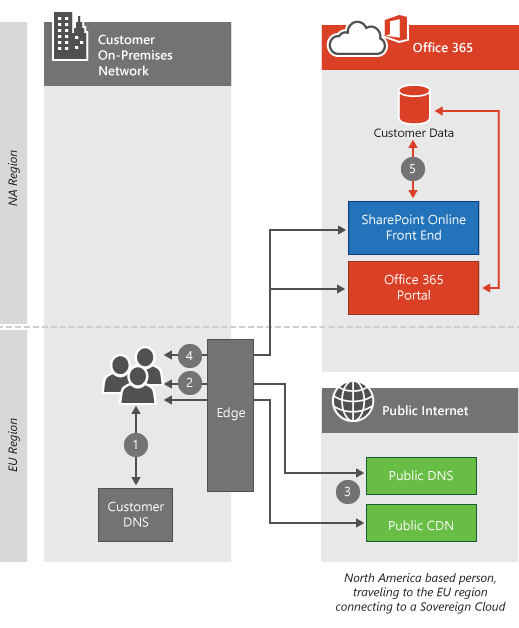

# クライアント接続Client connectivity

 **概要:** クライアントコンピューターと Office 365 テナントデータセンターの場所に応じて、クライアントコンピューターが Office 365 テナントに接続する方法について説明します。**Summary:** Explains how client computers connect to Office 365 tenants, depending on the location of the client computer and Office 365 tenant datacenter.
  
Office 365 は、地震や停電などの1つの地域で重大な問題が発生した場合でも、サービスを継続して稼働させるための Microsoft データセンターに存在します。Office 365 resides in Microsoft datacenters around the world which help keep the service up and running even when there's a major problem in one region, such as an earthquake or a power outage. Office 365 テナントに接続すると、クライアント接続はテナントがホストされている適切なデータセンターに転送されます。When you connect to your Office 365 tenant, the client connection will be directed to the appropriate datacenter where your tenant is being hosted. テナントをホストできる場所を決定するルールは、Microsoft との契約によって定義されます。The rules that determine where your tenant can be hosted are defined by your agreement with Microsoft. クライアントがデータセンターの場所からデータを取得する方法を決定するルールは、使用しているサービスのアーキテクチャによって異なります。The rules that determine how your client acquires the data from that datacenter location depend on the architecture of the service you're using.
  
たとえば、Office 365 ポータルにログオンすると、通常、クライアントに最も近いデータセンターに接続し、次に使用するサービスに応じて指示されます。For example, when you log on to the Office 365 portal, you're usually connected to the closest datacenter to the client and then directed depending on the service you use next. 電子メールを起動しても、UI を表示するための最初の接続が最も近いデータセンターから提供される場合がありますが、ユーザーが読んだメールの内容を表示するために、最も近いデータセンターとテナントが配置されているデータセンターの間に2番目の接続が開かれることがあります。If you launch email, the initial connection to display the UI may still come from the nearest datacenter, but a second connection might be opened between the nearest datacenter and the datacenter where your tenant is located to show you what's in the emails you read. Microsoft は、世界中の上位10のネットワークの1つを運用しており、データセンター間接続が非常に高速になります。Microsoft operates one of the top ten networks in the world, resulting in incredibly fast datacenter-to-datacenter connections.
  
記事を読むと、 [Office 365 の url と IP アドレスの範囲](https://support.office.com/article/8548a211-3fe7-47cb-abb1-355ea5aa88a2)をデータセンターごとに提供していない理由を理解することができます。これは単に相互に相互に相互に接続されていて、そのような場合には相互に依存しています。After you read the article, you'll likely understand why we don't provide [Office 365 URLs and IP address ranges](https://support.office.com/article/8548a211-3fe7-47cb-abb1-355ea5aa88a2) per datacenter, they are simply too interconnected and reliant on each other to make that feasible.
  
Office 365 用の Azure ExpressRoute を使用している場合、ほとんどの場合、接続は、ここで説明するパブリック接続ではなく、Office 365 へのプライベート接続を経由して行われます。If you're using Azure ExpressRoute for Office 365, in most cases your connectivity will go over a private connection to Office 365 instead of the public connection described here. クライアントの接続方法に関する原則は、それでも正確です。The principles about how clients connect are still accurate. [Office 365 の Azure ExpressRoute の](azure-expressroute.md)詳細について説明します。Learn more about [Azure ExpressRoute for Office 365](azure-expressroute.md).
  
Skype for business のネットワーク要求の詳細については、「 [skype For Business Online でのメディア品質とネットワーク接続性のパフォーマンス」](https://support.office.com/article/Media-Quality-and-Network-Connectivity-Performance-in-Skype-for-Business-Online-5fe3e01b-34cf-44e0-b897-b0b2a83f0917)を参照してください。For more depth on Skype for Business network requests, read the article [Media Quality and Network Connectivity Performance in Skype for Business Online](https://support.office.com/article/Media-Quality-and-Network-Connectivity-Performance-in-Skype-for-Business-Online-5fe3e01b-34cf-44e0-b897-b0b2a83f0917).

||
|:-----|
| この記事は[、Office 365 のネットワーク計画とパフォーマンスチューニング](https://aka.ms/tune)に含まれています。This article is part of [Network planning and performance tuning for Office 365](https://aka.ms/tune).|

> [!NOTE]
> お客様のデータを管理して、データセンターでのセキュリティを確保し、機密データを公開するように注意してください。We take great care to manage customer data so it's secure and private in our datacenters. プライバシーを管理するために講じる手順についての詳細は、[セキュリティセンター](https://go.microsoft.com/fwlink/?LinkID=397383)に含まれています。Details about the steps we take to manage privacy are included in the [Trust Center](https://go.microsoft.com/fwlink/?LinkID=397383).
  
## 最も近いデータセンターに接続するConnecting to the nearest datacenter

これは最も一般的な接続の種類であり、Office 365 ポータルと Exchange Online の両方で使用されます。This is the most common type of connection, and it's used by both the Office 365 portal and Exchange Online. このような状況では、クライアントが Office 365 に接続しようとすると、そのコンピューターの DNS クエリによって、コンピューターの受信元の世界の地域が決定されます。 Office 365 は、要求を最も近いデータセンターにリダイレクトします。In this situation, when clients attempt to connect to Office 365, their computer's DNS query determines the region of the world their computer is coming from, and Office 365 redirects the request to the nearest datacenter.
  
最も近いデータセンターにあるポータルの停止に接続すると、クライアントコンピューターにその場所からのクライアントのテナントに関する情報が表示されます。Connections to the portal stop at the nearest datacenter, and the client computer is presented with information about the client's tenant from that location.
  
Exchange Online は、さらに一歩進んでいきます。Exchange Online goes a step further. クライアントコンピューターが最も近いデータセンターに接続されると、そのデータセンターの Exchange サーバーは、以下の *「How to the this work」セクション*に示されているように、テナントが実際に存在するデータセンターに接続されます。Once the client computer is connected to the nearest datacenter, an Exchange server in that datacenter connects to the datacenter where the tenant is actually located as illustrated in the  *How does this work section*  below. その後、最も近いデータセンターの Exchange Online サーバーは、クライアントコンピューターからメールボックスサーバーに要求をプロキシします。The Exchange Online servers in the nearest datacenter then proxy the requests from the client computer to the mailbox server. これにより、電子メールや予定表のアイテムを Microsoft ネットワークに取得する処理が複雑になります。This speeds up the experience for the client computer by moving the heavy lifting of retrieving emails and calendar items to the Microsoft network.
  
## これは標準的なクラウド製品でどのように機能しますか?How does this work for standard cloud offerings?

この接続プロセスは、高トラフィック、高価値 web アプリケーション (Office 365 など) のための標準です。This connection process is standard for high traffic, high value web applications like Office 365. このセクションでは、プロセスの手順の概要を説明します。In this section, we outline and illustrate the steps in the process. クライアントコンピューターがテナントと同じリージョンにない場合、接続はクライアントが接続しているサービスに応じて、多くの異なる外観になります。When the client computer is not in the same region as the tenant, the connection looks much different depending on the service the client is connecting to.
  
 この図は、標準の Office 365 を使用した、北米のテナントでのお客様を示しています。This diagram depicts a customer using a standard Office 365 offering with a tenant in North America. このシナリオでは、要求を行っているユーザーがヨーロッパに出張ており、その場所から Office 365 を使用しています。In this scenario, the person making the request has traveled to Europe and is using Office 365 from that location.
  
1. クライアントコンピューターは、Office 365 に関連付けられている IP アドレスのローカル DNS サーバーに問い合わせます。The client computer asks the local DNS servers for the IP address associated with Office 365.

2. クライアントコンピューターのローカル DNS サーバーは、Office 365 に関連付けられている IP アドレスを Microsoft DNS サーバーに要求します。The client computer's local DNS servers ask the Microsoft DNS servers for the IP address associated with Office 365.

3. Microsoft の DNS サーバーは (クライアントの DNS サーバーの場所に基づいて) 地域サーバー名を返し、クライアントコンピューターは手順1と手順2を繰り返して、地域の Office 365 データセンターの IP アドレスを取得します。Microsoft's DNS servers return the regional server name (based on the location of the client's DNS servers), and the client computer repeats steps 1 and 2 to obtain the IP address of the regional Office 365 datacenter.

4. クライアントコンピューターは、地域のデータセンターの IP アドレスに接続します。The client computer connects to the regional datacenter IP address.

5. Exchange Online サーバーは、お客様のテナントが存在するアクティブなデータセンターへの接続を確立します。The Exchange Online servers establish a connection to the active datacenter where the customer's tenant resides.

  
## これは、独立クラウド製品でどのように動作しますか?How does this work for sovereign cloud offerings?

この接続は、Office 365 が 21 Vianet で運用している独立クラウド製品とは少し異なります。This connection is slightly different for sovereign cloud offerings such as Office 365 operated by 21 Vianet. Office 365 の独立インスタンスでテナントを使用すると、ポータル接続を受け付ける、最も近い Office 365 サーバーが、テナントが存在する独立地域内のサーバーになります。With the tenant in a sovereign instance of Office 365, the nearest Office 365 servers that will accept portal connections are the servers within the sovereign region where the tenant resides. 同様に、独立クラウドまたは標準オファーリングで SharePoint Online にアクセスするお客様は、テナントが存在するフロントエンドサーバーに転送されます。Similarly, customers accessing SharePoint Online in our sovereign cloud or standard offerings will be directed to front end servers where the tenant resides. 下の「アクティブなデータセンターへの接続」を参照してください。See connecting to the active datacenter below.
  
1. クライアントコンピューターは、Office 365 に関連付けられている IP アドレスのローカル DNS サーバーに問い合わせます。The client computer asks the local DNS servers for the IP address associated with Office 365.

2. クライアントコンピューターのローカル DNS サーバーは、Office 365 に関連付けられている IP アドレスを Microsoft DNS サーバーに要求します。The client computer's local DNS servers ask the Microsoft DNS servers for the IP address associated with Office 365.

3. Microsoft の DNS サーバーは (クライアントの DNS サーバーの場所に基づいて) 地域サーバー名を返し、クライアントコンピューターは手順1と手順2を繰り返して、地域の Office 365 データセンターの IP アドレスを取得します。Microsoft's DNS servers return the regional server name (based on the location of the client's DNS servers), and the client computer repeats steps 1 and 2 to obtain the IP address of the regional Office 365 datacenter.

4. クライアントコンピューターは、地域のデータセンターの IP アドレスに接続します。The client computer connects to the regional datacenter IP address.

5. Exchange Online サーバーは、お客様のテナントが存在するアクティブなデータセンターへの接続を確立します。The Exchange Online servers establish a connection to the active datacenter where the customer's tenant resides.

  
## アクティブなデータセンターへの接続Connecting to the active datacenter

アクティブなデータセンターへの接続は、より重いデータ転送のワークロード用に設計されており、現在 SharePoint Online で使用されています。Connecting to the active datacenter is designed for heavier data transfer workloads and is currently used by SharePoint Online. この状況では、クライアントが Office 365 に接続しようとすると、そのブラウザーは SharePoint Online テナントのアクティブなデータセンターにリダイレクトされます。In this situation, when clients attempt to connect to Office 365, their browser is redirected to the active datacenter for their SharePoint Online tenant.
  
## これはどのように動作しますか?How does this work?

クライアントコンピューターが別の地域から SharePoint Online に接続している場合、接続はアクティブな SharePoint Online データセンターにリダイレクトされます。When the client computer is connecting to SharePoint Online from a different region, the connection is redirected to the active SharePoint Online datacenter. このシナリオでは、お客様は標準のオファーリングを使用しており、ポータル接続はローカルに残り、SharePoint Online 接続がアクティブなデータセンターに転送されるようになっています。In this scenario, the customer is using a standard offering, resulting in the portal connections remaining local and the SharePoint Online connections being directed to the active datacenter.
  
1. クライアントコンピューターは、Office 365 に関連付けられている IP アドレスのローカル DNS サーバーに問い合わせます。The client computer asks the local DNS servers for the IP address associated with Office 365.

2. クライアントコンピューターのローカル DNS サーバーは、Office 365 に関連付けられている IP アドレスを Microsoft DNS サーバーに要求します。The client computer's local DNS servers ask the Microsoft DNS servers for the IP address associated with Office 365.

3. Microsoft の DNS サーバーは、アクティブな SharePoint Online データセンターのサーバー名 (クライアントの Office 365 テナントの場所に基づいて) を返し、クライアントコンピューターは手順1と2を繰り返して、アクティブな Office 365 データセンターの IP アドレスを取得します。Microsoft's DNS servers return the server name of the active SharePoint Online datacenter (based on the location of the client's Office 365 tenant), and the client computer repeats steps 1 and 2 to obtain the IP address of the active Office 365 datacenter.

4. クライアントコンピューターは、アクティブなデータセンターの IP アドレスに接続します。The client computer connects to the active datacenter IP address.

  
## 仮想プライベートネットワーク (Vpn) 経由の接続Connecting over Virtual Private Networks (VPNs)

この種類の接続は、クライアントコンピューターが仮想プライベートネットワーク (VPN) を使用している場合にのみ適用されます。This type of connection applies only when a virtual private network (VPN) is used by client computers. 実際には、VPN が使用されているため、Office 365 の動作が変更されることはありませんが、一般に、クライアントコンピューターが Office 365 への接続を確立する方法を制御するために Vpn が使用されているため、通常は機能が低下しているため、それをカバーすることが重要です。In reality, Office 365 behavior isn't changed simply because a VPN is used, but VPNs are commonly used to control how client computers establish connections to Office 365 and usually results in a degraded experience, so it's important to cover.
  
## これはどのように動作しますか?How does this work?

クライアントコンピューターが別の地域にある企業オフィスへの VPN 接続を確立する場合、クライアントコンピューターの場所にある DNS サーバーの代わりに、そのオフィスの DNS サーバーが使用されます。When the client computer establishes a VPN connection to a corporate office in a different region, the DNS servers at that office are used instead of the DNS servers at the client computer's location. ほとんどの場合、VPN 経由のこの特別な接続により、Office 365 の動作が低下します。In most cases, this extra connection over the VPN will degrade the Office 365 experience. Office 365 サービスは、お客様の接続をエンドユーザーにできるだけ近いものにサービスするように最適化されています。The Office 365 services are optimized to service customer connections as close to the end user as possible. 多くのサービスでは、Microsoft ネットワーク上の Azure エッジネットワーク、コンテンツ配信ネットワーク、信頼性の高いネットワーク容量を活用して、Office 365 サービスのネットワーク要求がクライアントコンピューターの近くになるときに、最適なユーザー環境を実現します。可能な限り。Many services leverage the Azure edge network, Content Delivery Networks, and the reliable network capacity on the Microsoft network to deliver the best possible user experience when network requests for Office 365 services are made as close to the client computer as possible.
  
1. クライアントコンピューターは、Office 365 に関連付けられている IP アドレスを VPN DNS サーバーに要求します。The client computer asks the VPN DNS servers for the IP address associated with Office 365.

2. クライアントコンピューターの VPN DNS サーバーは、Office 365 に関連付けられている IP アドレスを Microsoft DNS サーバーに要求します。The client computer's VPN DNS servers ask the Microsoft DNS servers for the IP address associated with Office 365.

3. Microsoft の DNS サーバーは、(VPN DNS サーバーの場所に基づいて) 地域サーバー名を返し、クライアントコンピューターは手順1と2を繰り返して、地域の Office 365 データセンターの IP アドレス情報を取得します。Microsoft's DNS servers return the regional server name (based on the location of the VPN DNS servers), and the client computer repeats steps 1 and 2 to obtain the IP address information of the regional Office 365 datacenter.

4. クライアントコンピューターは、VPN 接続を確立した企業オフィスに最も近いデータセンターの IP アドレスに接続します。The client computer connects to the datacenter IP address that's closest to the corporate office they established a VPN connection with.

  
ここに戻る場合は、次の短いリンクをご利用ください: [https://aka.ms/o365clientconnectivity](https://aka.ms/o365clientconnectivity)Here's a short link you can use to come back: [https://aka.ms/o365clientconnectivity](https://aka.ms/o365clientconnectivity)
  
## 関連項目See also

[Office 365 エンドポイントの管理Managing Office 365 endpoints](https://support.office.com/article/99cab9d4-ef59-4207-9f2b-3728eb46bf9a)
  
[Office 365 のネットワーク接続の評価Assessing Office 365 network connectivity](assessing-network-connectivity.md)
