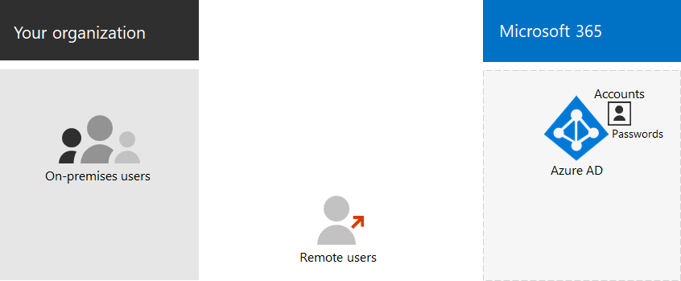

# Microsoft 365 クラウドのみの idMicrosoft 365 cloud-only identity

*この記事は、Microsoft 365 Enterprise と Office 365 Enterprise の両方に適用されます。**This article applies to both Microsoft 365 Enterprise and Office 365 Enterprise.*

クラウド専用の id を使用すると、すべてのユーザー、グループ、および連絡先が、Microsoft 365 サブスクリプションの Azure Active Directory (Azure AD) テナントに格納されます。With cloud-only identity, all your users, groups, and contacts are stored in the Azure Active Directory (Azure AD) tenant of your Microsoft 365 subscription. ここでは、クラウド専用の id の基本的なコンポーネントを示します。Here are the basic components of cloud-only identity.
 

組織内のユーザーとユーザーアカウントは、さまざまな方法で分類できます。Users and their user accounts in organizations can be categorized in a number of ways. たとえば、一部は従業員で、恒久的な状態になっています。For example, some are employees and have a permanent status. 一部のベンダー、請負業者、またはパートナーは、一時的な状態になっています。Some are vendors, contractors, or partners that have a temporary status. ユーザーアカウントを持たない外部ユーザーも、対話とコラボレーションをサポートするために特定のサービスやリソースへのアクセスを引き続き付与する必要があります。Some are external users that have no user accounts but must still be granted access to specific services and resources to support interaction and collaboration. 次に、例を示します。For example:

- テナント アカウントは、組織内でクラウド サービスのライセンスを付与したユーザーを表します。Tenant accounts represent users within your organization that you license for cloud services

- B2B (Business to Busines) アカウントは、コラボレーションへの参加のために招待された組織外部のユーザーを表します。Business to Business (B2B) accounts represent users outside your organization that you invite to participate in collaboration

組織内のユーザーの種類の株価を取得します。Take stock of the types of users in your organization. グループ化とはWhat are the groupings? たとえば、組織に対して、レベルの高い機能または目的によってユーザーをグループ化することができます。For example, you can group users by high-level function or purpose to your organization.

また、一部のクラウド サービスを、ユーザー アカウントを持たない組織外のユーザーと共有できます。この場合、このような外部ユーザーのグループも指定する必要があります。Additionally, some cloud services can be shared with users outside your organization without any user accounts. You'll need to identify these groups of users as well.

Azure AD のグループは、クラウド環境の管理を簡素化するいくつかの目的に使用できます。You can use groups in Azure AD for several purposes that simplify management of your cloud environment. たとえば、Azure AD グループでは、次のことを行うことができます。For example, with Azure AD groups, you can:

- グループベースのライセンスを使用して、Microsoft 365 のライセンスをメンバーとして追加されるとすぐに、自動的にユーザーアカウントに割り当てます。Use group-based licensing to assign licenses for Microsoft 365 to your user accounts automatically as soon as they are added as members.
- ユーザーアカウントの属性 (部署名など) に基づいて、ユーザーアカウントを特定のグループに動的に追加します。Add user accounts to specific groups dynamically based on user account attributes, such as department name.
- サービスとしてのソフトウェア (SaaS) アプリケーションのユーザーを自動的にプロビジョニングし、多要素認証 (MFA) やその他の条件付きアクセスルールを使用してそれらのアプリケーションへのアクセスを保護します。Automatically provision users for Software as a Service (SaaS) applications and to protect access to those applications with multi-factor authentication (MFA) and other Conditional Access rules.
- SharePoint Online チームサイトのアクセス許可とアクセス許可のレベルをプロビジョニングします。Provision permissions and levels of access for SharePoint Online team sites.

次の方法で新しい***ユーザー***を作成します。You create new ***users*** with:

- [Microsoft 365 管理センターThe Microsoft 365 admin center](https://docs.microsoft.com/office365/admin/add-users/add-users)
- [PowerShell for Microsoft 365PowerShell for Microsoft 365](https://docs.microsoft.com/office365/enterprise/powershell/create-user-accounts-with-office-365-powershell)

次のものを使用して、新しい***グループ***を作成します。You create new ***groups*** with:

- [Microsoft 365 管理センターThe Microsoft 365 admin center](https://docs.microsoft.com/office365/admin/create-groups/create-groups)
- [PowerShell for Microsoft 365PowerShell for Microsoft 365](https://docs.microsoft.com/office365/enterprise/powershell/manage-office-365-groups-with-powershell)

## クラウド専用の id の次の手順Next step for cloud-only identity

[ユーザー アカウントにライセンスを割り当てるAssign licenses to user accounts](assign-licenses-to-user-accounts.md)
