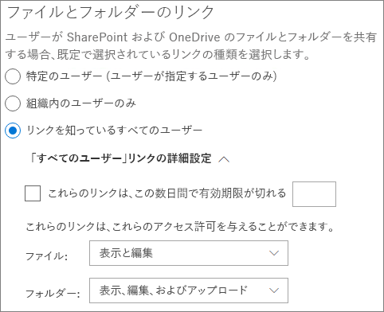

# 文書でのゲストとの共同作業Collaborate with guests on a document

SharePoint または OneDrive のドキュメントでゲストと共同作業を行う必要がある場合は、ドキュメントへの共有リンクを送信することができます。If you need to collaborate with guests on documents in SharePoint or OneDrive, you can send them a sharing link to the document. この記事では、SharePoint と OneDrive の共有リンクを設定するために必要な Microsoft 365 の構成手順について説明します。In this article, we'll walk through the Microsoft 365 configuration steps necessary to set up sharing links for SharePoint and OneDrive.

## Azure の組織上の関係の設定Azure Organizational relationships settings

Microsoft 365 での共有は、Azure Active Directory の組織上の関係の設定によって最上位レベルで管理されます。Sharing in Microsoft 365 is governed at its highest level by the organizational relationships settings in Azure Active Directory. Azure AD でゲストの共有が無効または制限されている場合、これは Microsoft 365 で構成した共有設定よりも優先されます。If guest sharing is disabled or restricted in Azure AD, this will override any sharing settings that you configure in Microsoft 365.

組織上の関係の設定を確認して、ゲストとの共有がブロックされないようにしてください。Check the organizational relationships settings to ensure that sharing with guests is not blocked.

組織上の関係の設定を設定するにはTo set organizational relationship settings

1. Microsoft Azure にログイン[https://portal.azure.com](https://portal.azure.com)します。Log in to Microsoft Azure at [https://portal.azure.com](https://portal.azure.com).
2. 左側のナビゲーションで、[ **Azure Active Directory**] をクリックします。In the left navigation, click **Azure Active Directory**.
3. [**概要**] ウィンドウで、[組織上の**関係**] をクリックします。In the **Overview** pane, click **Organizational relationships**.
4. [組織上の**関係**] ウィンドウで、[**設定**] をクリックします。In the **Organizational relationships** pane, click **Settings**.
5. **管理者とゲスト招待元役割のユーザーが招待できる**ことと、**メンバーが招待**できることを確認します。どちらも **[はい]** に設定されています。Ensure that **Admins and users in the guest inviter role can invite** and **Members can invite** are both set to **Yes**.
6. 変更を加えた場合は、[**保存**] をクリックします。If you made changes, click **Save**.

[**共同作業の制限**] セクションの設定に注意してください。Note the settings in the **Collaboration restrictions** section. 共同作業を行うゲストのドメインがブロックされていないことを確認します。Make sure that the domains of the guests that you want to collaborate with aren't blocked.

## SharePoint 組織レベルの共有設定SharePoint organization level sharing settings

ゲストが SharePoint または OneDrive のドキュメントにアクセスできるようにするには、SharePoint および OneDrive の組織レベルの共有設定でゲストとの共有が許可されている必要があります。In order for guests to have access to a document in SharePoint or OneDrive, the SharePoint and OneDrive organization-level sharing settings must allow for sharing with guests.

SharePoint の組織レベルの設定により、個々の SharePoint サイトで使用できる設定が決定されます。The organization-level settings for SharePoint determine what settings are available for individual SharePoint sites. サイトの設定は、組織レベルの設定よりも制限することはできません。Site settings cannot be more permissive than the organization-level settings. OneDrive の組織レベルの設定により、ユーザーの OneDrive ライブラリで利用可能な共有のレベルが決定されます。The organization-level setting for OneDrive determines what level of sharing is available in users' OneDrive libraries.

[共有] の場合、匿名ユーザーとのファイルとフォルダーの共有を許可する場合は、[**すべて**のユーザー] を選択します。For SharePiont and OneDrive, if you want to allow file and folder sharing with anonymous users, choose **Anyone**. すべてのゲストが認証を必要とするようにするには、[**新規および既存のゲスト**] を選択します。If you want to ensure that all guests have to authenticate, choose **New and existing guests**. 

SharePoint の場合は、組織内のすべてのサイトで必要とされる最も寛容な設定を選択します。For SharePoint, choose the most permissive setting that will be needed by any site in your organization.

SharePoint 組織レベルの共有設定を設定するにはTo set SharePoint organization level sharing settings

1. Microsoft 365 管理センターで、左側のナビゲーションの [**管理センター**] の下にある [ **SharePoint**] をクリックします。In the Microsoft 365 admin center, in the left navigation, under **Admin centers**, click **SharePoint**.
2. SharePoint 管理センターの左側のナビゲーションで、[**共有**] をクリックします。In the SharePoint admin center, in the left navigation, click **Sharing**.
3. SharePoint または OneDrive の外部共有が [すべての**ユーザー** ] または **[既存のゲスト**] に設定されていることを確認します。Ensure that external sharing for SharePoint or OneDrive is set to **Anyone** or **New and existing guests**. (OneDrive の設定は、SharePoint の設定よりも制限がないことに注意してください)。(Note that the OneDrive setting cannot be more permissive than the SharePoint setting.)
4. 変更を加えた場合は、[**保存**] をクリックします。If you made changes, click **Save**.

## SharePoint 組織レベルの既定のリンク設定SharePoint organization level default link settings

既定のファイルとフォルダーのリンク設定によって、ユーザーがファイルまたはフォルダーを共有するときに、どのリンクオプションが既定で表示されるかが決まります。The default file and folder link settings determine which link option is shown to the user by default when they share a file or folder. ユーザーは、必要に応じて、共有する前に、リンクの種類を他のオプションのいずれかに変更できます。Users can change the link type to one of the other options before sharing if desired.

この設定は、組織内の SharePoint サイトや OneDrive に影響を与えることに注意してください。Keep in mind that this setting affects SharePoint sites in your organization, as well as OneDrive.

ユーザーがファイルやフォルダーを共有するときに既定で選択されるリンクの種類を選択します。Choose the type of link that's selected by default when users share files and folders:

- [すべてのユーザー]**リンクを持つすべて**のファイルとフォルダーを匿名ユーザーと共有する予定がある場合は、このオプションを選択します。**Anyone with the link** - Choose this option if you expect to share a lot of files and folders with anonymous users. *すべて*のリンクを許可するが、偶発的な匿名共有について懸念している場合は、他のオプションのいずれかを既定として検討してください。If you want to allow *Anyone* links but are concerned about accidental anonymous sharing, consider one of the other options as the default. このリンクの種類は、**すべて**の共有を有効にした場合にのみ使用できます。This link type is only available if you've enabled **Anyone** sharing.
- [**組織内のユーザーのみ**]-ほとんどのファイルとフォルダーの共有が組織内のユーザーと想定される場合は、このオプションを選択します。**Only people in your organization** - Choose this option if you expect most file and folder sharing to be with people inside your organization.
- **特定のユーザー** -多数のファイルとフォルダーをゲストで共有することが予想される場合は、このオプションを検討してください。**Specific people** - Consider this option if you expect to do a lot of file and folder sharing with guests. この種類のリンクはゲストと連動しており、認証を必要とします。This type of link works with guests and requires them to authenticate.
 

SharePoint と OneDrive の組織レベルの既定のリンク設定を設定するにはTo set the SharePoint and OneDrive organization level default link settings

1. SharePoint 管理センターの [共有] ページに移動します。Navigate to the Sharing page in the SharePoint admin center.
2. [**ファイルとフォルダーのリンク**] で、使用する既定の共有リンクを選択します。Under **File and folder links**, select the default sharing link that you want to use.
3. 変更を加えた場合は、[**保存**] をクリックします。If you made changes, click **Save**.

## SharePoint サイトレベルの共有設定SharePoint site level sharing settings

SharePoint サイトにあるファイルや dler を共有している場合は、そのサイトのサイトレベルでの共有設定も確認する必要があります。If you're sharing files and fodlers that are in a SharePoint site, you also need to check the site-level sharing settings for that site.

サイトレベルの共有設定を設定するにはTo set site-level sharing settings
1. SharePoint 管理センターの左側のナビゲーションで、[**サイト**] を展開し、[**アクティブなサイト**] をクリックします。In the SharePoint admin center, in the left navigation, expand **Sites** and click **Active sites**.
2. 作成したサイトを選択します。Select the site that you just created.
3. リボンの [**共有**] をクリックします。In the ribbon, click **Sharing**.
4. 共有が [**すべてのユーザー** ] または **[既存のゲスト**] に設定されていることを確認します。Ensure that sharing is set to **Anyone** or **New and existing guests**.
5. 変更を加えた場合は、[**保存**] をクリックします。If you made changes, click **Save**.

## ユーザーを招待するInvite users

ゲスト共有の設定が構成されるようになったため、ユーザーはゲストでファイルやフォルダーを共有できるようになりました。Guest sharing settings are now configured, so users can now share files and folders with guests. 詳細については、「 [OneDrive ファイルとフォルダーを共有](https://support.office.com/article/9fcc2f7d-de0c-4cec-93b0-a82024800c07)する」および「 [SharePoint ファイルまたはフォルダーを共有](https://support.office.com/article/1fe37332-0f9a-4719-970e-d2578da4941c)する」を参照してください。See [Share OneDrive files and folders](https://support.office.com/article/9fcc2f7d-de0c-4cec-93b0-a82024800c07) and [Share SharePoint files or folders](https://support.office.com/article/1fe37332-0f9a-4719-970e-d2578da4941c) for more information.

## 関連項目See Also
