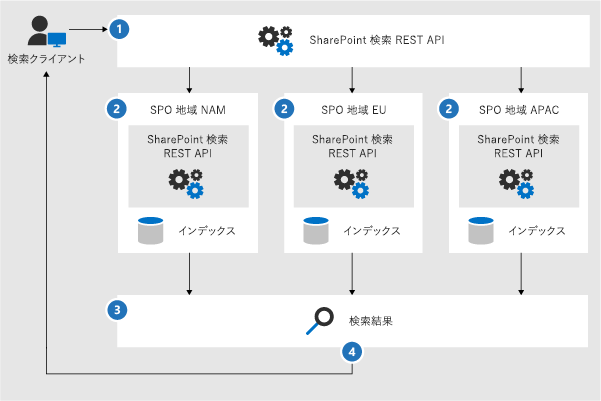
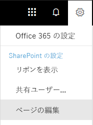
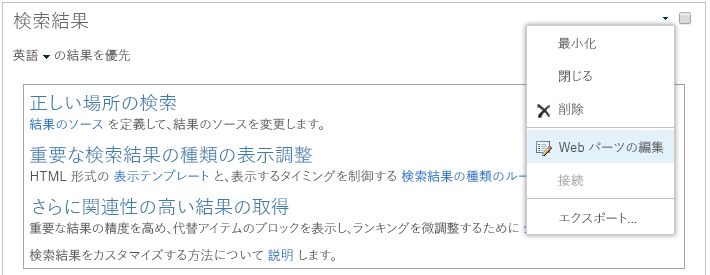

# OneDrive for Business 複数地域の検索の構成Configure Search for OneDrive for Business Multi-Geo

複数地域の SharePoint Online (SPO) 環境では、組織は Office 365 テナントを 1 つ保有しますが、その SharePoint コンテンツを複数地域の場所 (1 つの中央の場所と 1 つ以上のサテライト地域の場所) に保存します。In a Multi-Geo SharePoint Online (SPO) environment, an organization can have one Office 365 tenant, but store their SharePoint content in multiple geographical locations - one central location and one or more satellite geo locations.

それぞれの地理的な場所には、その場所独自の検索インデックスと検索センターがあります。ユーザーが検索すると、すべての索引にクエリがファンアウトされ、マージされた結果が返されます。Each geographical location has its own search index and Search Center. When a user searches, the query is fanned out to all the indexes, and the returned results are merged.

たとえば、ある地域の場所のユーザーが別の地域の場所に格納されているコンテンツを検索したり、別の地域の場所に限定されている SharePoint サイトのコンテンツを検索したりすることができます。このコンテンツへのアクセス権があるユーザーには、その検索結果が表示されます。For example, a user in one geo location can search for content stored in another geo location, or for content on a SharePoint site that’s restricted to a different geo location. If the user has access to this content, search will show the result.

## 複数地域環境で動作する検索クライアントについてWhich search clients work in a Multi-Geo environment?

次のクライアントは、すべての地域の場所からの結果を返します。These clients can return results from all geo locations:

-   OneDrive for BusinessOneDrive for Business

-   DelveDelve

-   SharePoint ホーム ページThe SharePoint home page

-   検索センターThe Search Center

-   SharePoint 検索 API を使用するカスタムの検索アプリケーションCustom search applications that use the SharePoint Search API

### OneDrive for BusinessOneDrive for Business

複数環境の設定が完了した直後に、OneDrive で検索を実行するユーザーには、すべての地域の場所からの結果が返されます。As soon as the Multi-Geo environment has been set up, users that search in OneDrive get results from all geo locations.

### DelveDelve

複数環境の設定が完了した直後に、Delve で検索するユーザーには、すべての地域の場所からの結果が返されます。As soon as the Multi-Geo environment has been set up, users that search in Delve get results from all geo locations.

Delve フィードとプロファイル カードには、**中央**の場所に保存されているファイルのプレビューのみが表示されます。その一方で、サテライト地域の場所に保存されているファイルについては、ファイルの種類に応じたアイコンが表示されます。The Delve feed and the profile card only show previews of files that are stored in the **central** location. For files that are stored in satellite geo locations, the icon for the file type is shown instead.

### SharePoint ホーム ページThe SharePoint home page

複数環境の設定が完了した直後に、ユーザーには、複数地域の場所からのニュース、最近のサイトおよびフォローしているサイトが示された SharePoint ホーム ページが表示されます。ユーザーが SharePoint ホーム ページの検索ボックスを使用すると、複数地域の場所からの結果がマージされて返されます。As soon as the Multi-Geo environment has been set up, users will see news, recent and followed sites from multiple geo locations on their SharePoint home page. If they use the search box on the SharePoint home page, they'll get merged results from multiple geo locations.

### 検索センターThe Search Center

複数環境の設定完了後、それぞれの検索センターには、それらの地域の場所からの結果のみが引き続き表示されます。管理者は、[それぞれの検索センターの設定を変更](#_Set_up_a_1)して、すべての地域の場所からの結果が得られるようにする必要があります。その後、検索センターで検索したユーザーには、すべての地域の場所からの結果が表示されます。After the Multi-Geo environment has been set up, each Search Center continues to only show results from their own geo location. Admins must [change the settings of each Search Center](#_Set_up_a_1) to get results from all geo locations. Afterwards, users that search in the Search Center get results from all geo locations.

### カスタムの検索アプリケーションCustom search applications

通常のように、カスタムの検索アプリケーションは、検索インデックスとの対話型操作に既存の SharePoint 検索 REST API を使用します。すべてまたは一部の地域の場所からの結果を取得するために、アプリケーションでは、要求で [API を呼び出して新しい複数地域クエリ パラメーターを含める](#_Get_custom_search)必要があります。これにより、すべての地域の場所へのクエリのファンアウトがトリガーされます。As usual, custom search applications interact with the search indexes by using the existing SharePoint Search REST APIs. To get results from all, or some geo locations, the application must [call the API and include the new Multi-Geo query parameters](#_Get_custom_search) in the request. This triggers a fan out of the query to all geo locations.

## 複数地域環境での検索の相違点についてWhat’s different about search in a Multi-Geo environment?

複数地域環境では、一部の使い慣れた検索機能の動作が異なります。Some search features you might be familiar with, work differently in a Multi-Geo environment.

<table>
<thead>
<tr class="header">
<th align="left"><strong>機能</strong><strong>Feature</strong></th>
<th align="left"><strong>動作の内容</strong><strong>How does it work</strong></th>
<th align="left"><strong>回避策</strong><strong>Workaround</strong></th>
</tr>
</thead>
<tbody>
<tr class="odd">
<td align="left">昇格結果Promoted results</td>
<td align="left">クエリ ルールは、異なるレベル (テナント全体、サイト コレクション、またはサイト) の昇格結果で作成できます。複数地域環境では、<strong>すべて</strong>の地域の場所の検索センターに結果を昇格する場合、<strong>テナント</strong> レベルで昇格結果を定義します。サイト コレクションまたはサイトの地域の場所にある検索センターで<strong>のみ</strong>結果を昇格する場合は、<strong>サイト コレクション</strong>または<strong>サイト</strong> レベルで結果を定義します。You can create query rules with promoted results at different levels: for the whole tenant, for a site collection, or for a site. In a Multi-Geo environment, define promoted results at the <strong>tenant</strong> level if you want to promote the results to the Search Centers in <strong>all</strong> geo locations. If you <strong>only</strong> want to promote results in the Search Center that’s in the geo location of the site collection or site, define the results at the <strong>site collection</strong> or <strong>site</strong> level.</td>
<td align="left">地域の場所ごとに異なる昇格結果を必要としない場合は (出張の場合の異なるルールなど)、テナント レベルで昇格結果を定義するようにお薦めします。If you don’t need different promoted results per geo location, for example different rules for traveling, we recommend defining promoted results at the tenant level.</td>
</tr>
<tr class="even">
<td align="left">絞り込み検索Search refiners</td>
<td align="left">検索は、テナントのすべての地域の場所からの絞り込み条件を返して、それらを集約します。この集約は、最善努力型であるため、絞り込み条件のカウントが 100% の精度にならないことがあります。ほとんどの検索型シナリオの場合は、この精度で十分です。 Search returns refiners from all the geo locations of a tenant and then aggregates them. The aggregation is a best effort, meaning that the refiner counts might not be 100% accurate. For most search-driven scenarios, this accuracy is sufficient. </td>
<td align="left">絞り込み条件の完全性に依存する検索型アプリケーションの場合は、複数地域のファンアウトを使用しないで、それぞれの地域の場所を個別にクエリします。For search-driven applications that depend on refiner completeness, query each geo location independently without using Multi-Geo fan-out.</td>
</tr>
<tr class="odd">
<td align="left"></td>
<td align="left">複数地域検索では、数値の絞り込み条件の動的バケットはサポートされません。Multi-Geo search doesn’t support dynamic bucketing for numerical refiners.</td>
<td align="left">数値の絞り込み条件には、<a href="https://docs.microsoft.com/en-us/sharepoint/dev/general-development/query-refinement-in-sharepoint">"Discretize" パラメーター</a>を使用してください。Use the <a href="https://docs.microsoft.com/en-us/sharepoint/dev/general-development/query-refinement-in-sharepoint">“Discretize” parameter</a> for numerical refiners.</td>
</tr>
<tr class="even">
<td align="left">ドキュメント IDDocument IDs</td>
<td align="left">ドキュメント ID に依存する検索型アプリケーションを開発する場合、複数地域環境のドキュメント ID は地域の場所ごとに一意ですが、複数の地域の場所にわたって一意でない点に注意してください。If you’re developing a search-driven application that depends on document IDs, note that document IDs in a Multi-Geo environment aren’t unique across geo locations, they are unique per geo location.</td>
<td align="left">地域の場所を特定する列が追加されています。この列を使用して、一意性を確保してください。この列の名前は、"GeoLocationSource" です。We’ve added a column that identifies the geo location. Use this column to achieve uniqueness. This column is named “GeoLocationSource”.</td>
</tr>
<tr class="odd">
<td align="left">結果の数Number of results</td>
<td align="left">検索結果ページには、地域の場所からの結果が結合されて表示されますが、500 件を超える結果をページにまとめることはできません。The search results page shows combined results from the geo locations, but it’s not possible to page beyond 500 results.</td>
<td align="left"></td>
</tr>
</tbody>
</table>

## 複数地域環境の検索でサポートされない内容What’s not supported for search in a Multi-Geo environment?

複数地域環境では、一部の使い慣れた検索機能がサポートされません。Some of the search features you might be familiar with, aren’t supported in a Multi-Geo environment.

<table>
<thead>
<tr class="header">
<th align="left"><strong>検索機能</strong><strong>Search feature</strong></th>
<th align="left"><strong>注</strong><strong>Note</strong></th>
</tr>
</thead>
<tbody>
<tr class="odd">
<td align="left">アプリ専用の認証App-only authentication</td>
<td align="left">複数地域検索では、アプリ専用の認証 (サービスからの特権アクセス) がサポートされません。App-only authentication (privileged access from services) isn’t supported in Multi-Geo search.</td>
</tr>
<tr class="even">
<td align="left">ゲスト ユーザーGuest users</td>
<td align="left">ゲスト ユーザーは、検索対象にしている地域の場所からの結果のみを取得できます。Guest users only get results from the geo location that they’re searching from.</td>
</tr>
</tbody>
</table>

## 複数地域環境での検索の動作についてHow does search work in a Multi-Geo environment?

**すべて**の検索クライアントは、検索インデックスとの対話型の操作に既存の SharePoint 検索 REST API を使用します。**All** the search clients use the existing SharePoint Search REST APIs to interact with the search indexes.

1. 検索クライアントは、クエリ プロパティ EnableMultiGeoSearch = true を設定して、検索 REST エンドポイントを呼び出します。A search client calls the Search REST endpoint with the query property EnableMultiGeoSearch= true.
2. クエリは、テナント内のすべての地域の場所に送信されます。The query is sent to all geo locations in the tenant.
3. それぞれの地域の場所からの検索結果はマージされ、ランク付けされます。Search results from each geo location are merged and ranked.
4. クライアントは、統一された検索結果を取得します。The client gets unified search results.

検索結果は、すべての地域の場所からの結果を受信するまでマージされない点に注意してください。そのため、複数地域の検索では、地域の場所が 1 つの環境での検索と比べると遅延が大きくなります。Notice that we don’t merge the search results until we’ve received results from all the geo locations. This means that Multi-Geo searches have additional latency compared to searches in an environment with only one geo location.

## 検索センターにすべての地域の場所からの結果を表示するGet a Search Center to show results from all geo locations

それぞれの検索センターには、複数のバーティカルがあり、それぞれのバーティカルを個別に設定する必要があります。Each Search Center has several verticals and you have to set up each vertical individually.

1.  ここに示す手順は、検索結果ページと検索結果 Web パーツを編集するためのアクセス許可があるアカウントで実行してください。Ensure that you perform these steps with an account that has permission to edit the search results page and the Search Result Web Part.

2.  検索結果ページに移動します (検索結果ページの[一覧](https://support.office.com/article/174d36e0-2f85-461a-ad9a-8b3f434a4213)を参照してください)Navigate to the search results page (see the [list](https://support.office.com/article/174d36e0-2f85-461a-ad9a-8b3f434a4213) of search results pages)

3.  設定するバーティカルを選択し、右上の **[設定]** ギア アイコンをクリックして、**[ページの編集]** をクリックします。編集モードで、検索結果ページが開きます。Select the vertical to set up, click **Settings** gear icon in the upper, right corner, and then click **Edit Page**. The search results page opens in Edit mode.

     
1.  検索結果 Web パーツで、Web パーツの右上にポインターを移動し、矢印をクリックして、メニューにある **[Web パーツの編集]** をクリックします。ページ右上のリボンの下に、検索結果 Web パーツ ツール ウィンドウが開きます。In the Search Results Web Part, move the pointer to the upper, right corner of the Web Part, click the arrow, and then click **Edit Web Part** on the menu. The Search Results Web Part tool pane opens under the ribbon in the top right of the page. 

1.  Web パーツ ツール ウィンドウの **[設定]** セクションで、**[結果コントロールの設定]** から **[複数地域の検索結果を表示する]** を選択して、検索結果 Web パーツに、すべての地域の場所からの結果が表示されるようにします。In the Web Part tool pane, in the **Settings** section, under **Results control settings**, select **Show Multi-Geo results** to get the Search Results Web Part to show results from all geo locations.

2.  **[OK]** をクリックして変更内容を保存して、Web パーツ ツール ウィンドウを閉じます。Click **OK** to save your change and close the Web Part tool pane.

3.  検索結果 Web パーツに対する変更内容を確認するには、メイン メニューの [ページ] タブで **[チェックイン]** をクリックします。Check your changes to the Search Results Web Part by clicking **Check-In** on the Page tab of the main menu.

4.  ページの上部にあるメモで示されるリンクを使用して、変更内容を公開します。Publish the changes by using the link provided in the note at the top of the page.

## カスタムの検索アプリケーションにすべてまたは一部の地域の場所からの結果を表示するGet custom search applications to show results from all or some geo locations

カスタムの検索アプリケーションは、SharePoint 検索 REST API への要求にクエリ パラメーターを指定することで、すべてまたは一部の地域の場所からの結果を取得するようになります。このクエリ パラメーターに応じて、すべてまたは一部の地域の場所にクエリがファンアウトされます。たとえば、一部の地域の場所に対して関連情報を取得するクエリを実行する必要がある場合は、対象の地域にのみファンアウトするように制御できます。この要求が成功すると、SharePoint 検索 REST API は応答データを返します。Custom search applications get results from all, or some, geo locations by specifying query parameters with the request to the SharePoint Search REST API. Depending on the query parameters, the query is fanned out to all geo locations, or to some geo locations. For example, if you only need to query a subset of geo locations to find relevant information, you can control the fan out to only these. If the request succeeds, the SharePoint Search REST API returns response data.

### クエリ パラメーターQuery parameters

EnableMultiGeoSearch: 複数地域テナントの別の地域の場所のインデックスにクエリがファンアウトされるようにするかどうかを指定するブール値です。クエリをファンアウトする場合は **true** に設定します。クエリをファンアウトしない場合は **false** に設定します。既定値は **false** です。このパラメーターを含めていないと、クエリは別の地域の場所にファンアウト**されなくなります**。複数地域ではない環境でパラメーターを使用すると、このパラメーターは無視されます。EnableMultiGeoSearch - This is a Boolean value that specifies whether the query shall be fanned out to the indexes of other geo locations of the Multi-Geo tenant. Set it to **true** to fan out the query; **false** to not fan out the query. The default value is **false**. If you don’t include this parameter, the query is **not** fanned out to other geo locations. If you use the parameter in an environment that isn’t Multi-Geo, the parameter is ignored.

ClientType: 文字列です。検索アプリケーションごとに一意のクライアント名を入力します。このパラメーターを含めていないと、クエリは別の地域の場所にファンアウト**されなくなります**。ClientType - This is a string. Enter a unique client name for each search application. If you don’t include this parameter, the query is **not** fanned out to other geo locations.

MultiGeoSearchConfiguration: **EnableMultiGeoSearch** が **true** のときに、クエリをファンアウトする複数地域テナントの地域の場所を指定するオプションのリストです。このパラメーターを含めていない場合や空白のままにした場合、クエリはすべての地域の場所にファンアウトされます。地域の場所ごとに、次の項目を JSON 形式で入力します。MultiGeoSearchConfiguration - This is an optional list of which geo locations in the Multi-Geo tenant to fan the query out to when **EnableMultiGeoSearch** is **true**. If you don’t include this parameter, or leave it blank, the query is fanned out to all geo locations. For each geo location, enter the following items, in JSON format:

<table>
<thead>
<tr class="header">
<th align="left">項目Item</th>
<th align="left">説明Description</th>
</tr>
</thead>
<tbody>
<tr class="odd">
<td align="left">DataLocationDataLocation</td>
<td align="left">地域の場所 (例: NAM)。The geo location, for example NAM.</td>
</tr>
<tr class="even">
<td align="left">EndPointEndPoint</td>
<td align="left">接続先のエンドポイント (例: https://contoso.sharepoint.com)。The endpoint to connect to, for example https://contoso.sharepoint.com</td>
</tr>
<tr class="odd">
<td align="left">SourceIdSourceId</td>
<td align="left">検索先の GUID (例: B81EAB55-3140-4312-B0F4-9459D1B4FFEE)。The GUID of the result source, for example B81EAB55-3140-4312-B0F4-9459D1B4FFEE.</td>
</tr>
</tbody>
</table>

DataLocation または EndPoint を省略した場合や DataLocation が重複している場合、要求は失敗します。[テナントの地域の場所のエンドポイントに関する情報は、Microsoft Graph を使用することで取得できます](https://docs.microsoft.com/ja-JP/sharepoint/dev/solution-guidance/multigeo-discovery)。If you omit DataLocation or EndPoint, or if a DataLocation is duplicated, the request fails. [You can get information about the endpoint of a tenant's geo locations by using Microsoft Graph](https://docs.microsoft.com/ja-JP/sharepoint/dev/solution-guidance/multigeo-discovery).

### 応答データResponse data

MultiGeoSearchStatus: 要求に対する応答で SharePoint 検索 API が返すプロパティです。このプロパティの値は文字列であり、SharePoint 検索 API が返す結果について次の情報が得られます。MultiGeoSearchStatus – This is a property that the SharePoint Search API returns in response to a request. The value of the property is a string and gives the following information about the results that the SharePoint Search API returns:

<table>
<thead>
<tr class="header">
<th align="left">値Value</th>
<th align="left">説明Description</th>
</tr>
</thead>
<tbody>
<tr class="odd">
<td align="left">FullFull</td>
<td align="left"><strong>すべて</strong>の地域の場所からの完全な結果。Full results from <strong>all</strong> the geo locations.</td>
</tr>
<tr class="even">
<td align="left">PartialPartial</td>
<td align="left">1 つ以上の地域の場所からの部分的な結果。この結果は一時的なエラーによって不完全なものになります。Partial results from one or more geo locations. The results are incomplete due to a transient error.</td>
</tr>

</tbody>
</table>

### REST サービスを使用したクエリQuery using the REST service

GET 要求の場合は、URL でクエリ パラメーターを指定します。POST 要求の場合は、JavaScript Object Notation (JSON) 形式のクエリ パラメーターを本文で渡します。With a GET request, you specify the query parameters in the URL. With a POST request, you pass the query parameters in the body in JavaScript Object Notation (JSON) format.

#### 要求ヘッダーRequest headers

<table>
<thead>
<tr class="header">
<th align="left">名前Name</th>
<th align="left">値Value</th>
</tr>
</thead>
<tbody>
<tr class="odd">
<td align="left">Content-TypeContent-Type</td>
<td align="left">application/json;odata=verboseapplication/json;odata=verbose</td>
</tr>
</tbody>
</table>

#### **すべて**の地域の場所にファンアウトされる GET 要求の例Sample GET request that’s fanned out to **all** geo locations

https:// \<tenant\>/\_api/search/query?querytext='sharepoint'&Properties='EnableMultiGeoSearch:true'&ClientType='my\_client\_id'https:// \<tenant\>/\_api/search/query?querytext='sharepoint'&Properties='EnableMultiGeoSearch:true'&ClientType='my\_client\_id'

#### **一部**の地域の場所にファンアウトする GET 要求の例Sample GET request to fan out to **some** geo locations

https:// \<tenant\>/\_api/search/query?querytext='site'&ClientType='my_client_id'&Properties='EnableMultiGeoSearch:true, MultiGeoSearchConfiguration:[{DataLocation\\:"NAM"\\,Endpoint\\:"https\\://contosoNAM.sharepoint.com"\\,SourceId\\:"B81EAB55-3140-4312-B0F4-9459D1B4FFEE"}\\,{DataLocation\\:"CAN"\\,Endpoint\\:"https\\://contosoCAN.sharepoint-df.com"}]'https:// \<tenant\>/\_api/search/query?querytext='site'&ClientType='my_client_id'&Properties='EnableMultiGeoSearch:true, MultiGeoSearchConfiguration:[{DataLocation\\:"NAM"\\,Endpoint\\:"https\\://contosoNAM.sharepoint.com"\\,SourceId\\:"B81EAB55-3140-4312-B0F4-9459D1B4FFEE"}\\,{DataLocation\\:"CAN"\\,Endpoint\\:"https\\://contosoCAN.sharepoint-df.com"}]'

> [!NOTE]
> MultiGeoSearchConfiguration プロパティの地理的場所の一覧内のコンマとコロンの前に **バックスラッシュ** 記号が先行します。これは、GET 要求では複数のプロパティの区切りにはコロンが、複数の因数の区切りにはコンマが使用されるためです。エスケープ文字としてバックスラッシュ記号を使わない場合、MultiGeoSearchConfiguration プロパティの解釈は間違ったものになります。Commas and colons in the list of geo-locations for the MultiGeoSearchConfiguration property are preceded by the **backslash** character. This is because GET requests use colons to separate properties and commas to separate arguments of properties. Without the backslash as an escape character, the MultiGeoSearchConfiguration property is interpreted wrongly.

#### **すべて**の地域の場所にファンアウトされる POST 要求の例Sample POST request that’s fanned out to **all** geo locations

    {
        "request": {
            "__metadata": {
            "type": "Microsoft.Office.Server.Search.REST.SearchRequest"
        },
        "Querytext": "sharepoint",
        "Properties": {
            "results": [
                {
                    "Name": "EnableMultiGeoSearch",
                    "Value": {
                        "QueryPropertyValueTypeIndex": 3,
                        "BoolVal": true
                    }
                }
            ]
        },
        "ClientType": "my_client_id"
        }
    }

#### **一部**の地域の場所にファンアウトされる POST 要求の例Sample POST request that’s fanned out to **some** geo locations

    {
        "request": {
            "Querytext": "SharePoint",
            "ClientType": "my_client_id",
            "Properties": {
                "results": [
                    {
                        "Name": "EnableMultiGeoSearch",
                        "Value": {
                            "QueryPropertyValueTypeIndex": 3,
                            "BoolVal": true
                        }
                    },
                    {
                        "Name": "MultiGeoSearchConfiguration",
                        "Value": {
                        "StrVal": "[{\"DataLocation\":\"NAM\",\"Endpoint\":\"https://contoso.sharepoint.com\",\"SourceId\":\"B81EAB55-3140-4312-B0F4-9459D1B4FFEE\"},{\"DataLocation\":\"CAN\",\"Endpoint\":\"https://contosoCAN.sharepoint.com\"}]",
                            "QueryPropertyValueTypeIndex": 1
                        }
                    }
                ]
            }
        }
    }

### CSOM を使用したクエリQuery using CSOM

次に、**すべて**の地域の場所に CSOM クエリの例を示します。Here’s a sample CSOM query that’s fanned out to **all** geo locations:

    var keywordQuery = new KeywordQuery(ctx);
    keywordQuery.QueryText = query.SearchQueryText;
    keywordQuery.ClientType = <enter a string here>;
    keywordQuery["EnableMultiGeoSearch"] = true;

