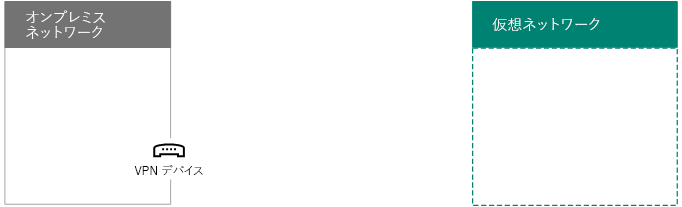
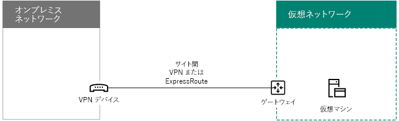

# <a name="connect-an-on-premises-network-to-a-microsoft-azure-virtual-network"></a><span data-ttu-id="32bed-103">オンプレミス ネットワークを Microsoft Azure 仮想ネットワークに接続する</span><span class="sxs-lookup"><span data-stu-id="32bed-103">Connect an on-premises network to a Microsoft Azure virtual network</span></span>

 <span data-ttu-id="32bed-104">**概要:** Office サーバーのワークロードのためにクロスプレミスの Azure 仮想ネットワークを構成する方法について説明します。</span><span class="sxs-lookup"><span data-stu-id="32bed-104">**Summary:** Learn how to configure a cross-premises Azure virtual network for Office server workloads.</span></span>
  
<span data-ttu-id="32bed-p101">クロスプレミス Azure 仮想ネットワークをオンプレミスネットワークに接続することで、Azure インフラサービスにホストされているサブネットや仮想マシンを追加してネットワークを拡張します。この接続により、オンプレミスのネットワークにあるマシンと Azure の仮想マシンが相互に直接アクセスできるようになります。たとえば、Azure 仮想マシンで実行中のディレクトリ同期サーバーは、アカウントへの変更に関してオンプレミスのドメイン コントローラーのクエリを実行し、Office 365 のサブスクリプションにその変更を同期する必要があります。この資料では、Azure 仮想マシンをホストできるようにクロスプレミス Azure 仮想ネットワークを設定する方法を示します。</span><span class="sxs-lookup"><span data-stu-id="32bed-p101">A cross-premises Azure virtual network is connected to your on-premises network, extending your network to include subnets and virtual machines hosted in Azure infrastructure services. This connection allows computers on your on-premises network to directly access virtual machines in Azure and vice versa. For example, a DirSync server running on an Azure virtual machine needs to query your on-premises domain controllers for changes to accounts and synchronize those changes with your Office 365 subscription. This article shows you how to set up a cross-premises Azure virtual network that is ready to host Azure virtual machines.</span></span>

## <a name="overview"></a><span data-ttu-id="32bed-109">概要</span><span class="sxs-lookup"><span data-stu-id="32bed-109">Overview</span></span>

<span data-ttu-id="32bed-p102">Azure の仮想マシンをオンプレミス環境から分離する必要はありません。Azure の仮想マシンをオンプレミスのネットワークリソースに接続するには、クロスプレミス Azure 仮想ネットワークを構成する必要があります。次の図は、Azure において仮想マシンが含まれるクロスプレミスの Azure 仮想ネットワークを展開するために必要なコンポーネントを示しています。</span><span class="sxs-lookup"><span data-stu-id="32bed-p102">Your virtual machines in Azure don't have to be isolated from your on-premises environment. To connect Azure virtual machines to your on-premises network resources, you must configure a cross-premises Azure virtual network. The following diagram shows the required components to deploy a cross-premises Azure virtual network with a virtual machine in Azure.</span></span>
  

  
<span data-ttu-id="32bed-p103">この図では、サイト間の仮想プライベート ネットワーク (VPN) 接続によって、2 つのネットワーク (オンプレミス ネットワークと Azure 仮想ネットワーク) が接続されています。サイト間の VPN 接続はオンプレミス ネットワークの VPN デバイスと Azure 仮想ネットワークの Azure VPN gatewayで終端されます。Azure 仮想ネットワークには仮想マシンがあります。Azure 仮想ネットワークの仮想マシンで発生したネットワーク トラフィックは VPN gatewayに送信され、次にこのトラフィックはサイト間 VPN 接続を介してオンプレミス ネットワーク上の VPN デバイスに送信されます。その後、オンプレミス ネットワークのルーティング インフラストラクチャによって、宛先にトラフィックが送られます。</span><span class="sxs-lookup"><span data-stu-id="32bed-p103">In the diagram, there are two networks connected by a site-to-site virtual private network (VPN) connection: the on-premises network and the Azure virtual network. The site-to-site VPN connection is terminated by a VPN device on the on-premises network and an Azure VPN gateway on the Azure virtual network. The Azure virtual network has virtual machines. Network traffic originating from virtual machines on the Azure virtual network gets forwarded to the VPN gateway, which then forwards the traffic across the site-to-site VPN connection to the VPN device on the on-premises network. The routing infrastructure of the on-premises network then forwards the traffic to its destination.</span></span>
  
<span data-ttu-id="32bed-119">Azure Virtual Network とオンプレミス ネットワーク間の VPN 接続を設定するには、次の手順を実行します。</span><span class="sxs-lookup"><span data-stu-id="32bed-119">To set up the VPN connection between your Azure virtual network and your on-premises network, do the following steps:</span></span> 
  
1. <span data-ttu-id="32bed-120">**オンプレミス:** オンプレミスの VPN デバイスをポイントするオンプレミス ネットワーク ルートを、Azure 仮想ネットワークのアドレス空間上で定義して作成します。</span><span class="sxs-lookup"><span data-stu-id="32bed-120">**On-premises:** Define and create an on-premises network route for the address space of the Azure virtual network that points to your on-premises VPN device.</span></span>
    
2. <span data-ttu-id="32bed-p104">**Microsoft Azure:** サイト間 VPN 接続を使用して Azure 仮想ネットワークを作成します。この資料では [ExpressRoute](https://azure.microsoft.com/services/expressroute/) の使用については説明しません。</span><span class="sxs-lookup"><span data-stu-id="32bed-p104">**Microsoft Azure:** Create an Azure virtual network with a site-to-site VPN connection. This article does not describe the use of [ExpressRoute](https://azure.microsoft.com/services/expressroute/).</span></span>
    
3. <span data-ttu-id="32bed-123">**オンプレミス:** VPN 接続を終了するようにオンプレミスのハードウェアまたはソフトウェア VPN デバイスを構成します。これには、インターネット プロトコル セキュリティ (IPsec) が使用されます。</span><span class="sxs-lookup"><span data-stu-id="32bed-123">**On premises:** Configure your on-premises hardware or software VPN device to terminate the VPN connection, which uses Internet Protocol security (IPsec).</span></span>
    
<span data-ttu-id="32bed-124">サイト間 VPN 接続を確立した後、仮想ネットワークのサブネットに Azure 仮想マシンを追加します。</span><span class="sxs-lookup"><span data-stu-id="32bed-124">After you establish the site-to-site VPN connection, you add Azure virtual machines to the subnets of the virtual network.</span></span>
  
## <a name="plan-your-azure-virtual-network"></a><span data-ttu-id="32bed-125">Azure 仮想ネットワークの計画</span><span class="sxs-lookup"><span data-stu-id="32bed-125">Plan your Azure virtual network</span></span>
<a name="PlanningVirtual"></a>

### <a name="prerequisites"></a><span data-ttu-id="32bed-126">前提条件</span><span class="sxs-lookup"><span data-stu-id="32bed-126">Prerequisites</span></span>
<a name="Prerequisites"></a>

- <span data-ttu-id="32bed-p105">Azure サブスクリプション。Azure サブスクリプションについては、「[Microsoft Azure サブスクリプション ページ](https://azure.microsoft.com/pricing/purchase-options/)」に移動します。</span><span class="sxs-lookup"><span data-stu-id="32bed-p105">An Azure subscription. For information about Azure subscriptions, go to the [Microsoft Azure subscription page](https://azure.microsoft.com/pricing/purchase-options/).</span></span>
    
- <span data-ttu-id="32bed-129">仮想ネットワークとサブネットに割り当て可能なプライベート IPv4 アドレス空間。現在、および将来の拡大で必要となる仮想マシン数に対応できる十分な空き領域が必要です。</span><span class="sxs-lookup"><span data-stu-id="32bed-129">An available private IPv4 address space to assign to the virtual network and its subnets, with sufficient room for growth to accommodate the number of virtual machines needed now and in the future.</span></span>
    
- <span data-ttu-id="32bed-p106">IPsec の要件に対応するサイト間 VPN 接続を終端するための VPN デバイスがオンプレミス ネットワークで利用可能なこと。詳しくは、「[サイト間 VPN Gateway 接続の VPN デバイスについて](https://go.microsoft.com/fwlink/p/?LinkId=393093)」をご覧ください。</span><span class="sxs-lookup"><span data-stu-id="32bed-p106">An available VPN device in your on-premises network to terminate the site-to-site VPN connection that supports the requirements for IPsec. For more information, see [About VPN devices for site-to-site virtual network connections](https://go.microsoft.com/fwlink/p/?LinkId=393093).</span></span>
    
- <span data-ttu-id="32bed-132">ルーティング インフラストラクチャを変更し、Azure Virtual Network のアドレス空間にルーティングされるトラフィックが、サイト間 VPN 接続をホストする VPN デバイスに送られること。</span><span class="sxs-lookup"><span data-stu-id="32bed-132">Changes to your routing infrastructure so that traffic routed to the address space of the Azure virtual network gets forwarded to the VPN device that hosts the site-to-site VPN connection.</span></span>
    
- <span data-ttu-id="32bed-133">オンプレミス ネットワークと Azure Virtual Network に接続するコンピューターにインターネットへのアクセスを提供する Web プロキシ。</span><span class="sxs-lookup"><span data-stu-id="32bed-133">A web proxy that gives computers that are connected to the on-premises network and the Azure virtual network access to the Internet.</span></span>
    
### <a name="solution-architecture-design-assumptions"></a><span data-ttu-id="32bed-134">ソリューション アーキテクチャ設計の前提条件</span><span class="sxs-lookup"><span data-stu-id="32bed-134">Solution architecture design assumptions</span></span>

<span data-ttu-id="32bed-135">次の一覧に、このソリューション アーキテクチャ用に作られた設計の方針を示します。</span><span class="sxs-lookup"><span data-stu-id="32bed-135">The following list represents the design choices that have been made for this solution architecture.</span></span> 
  
- <span data-ttu-id="32bed-p107">このソリューションでは、サイト間 VPN 接続を伴う 1 つの Azure Virtual Network を使用します。Azure Virtual Network は、任意の数の仮想マシンを接続できる単一のサブネットをホストします。</span><span class="sxs-lookup"><span data-stu-id="32bed-p107">This solution uses a single Azure virtual network with a site-to-site VPN connection. The Azure virtual network hosts a single subnet that can contain multiple virtual machines.</span></span> 
    
- <span data-ttu-id="32bed-p108">Windows Server 2016 または Windows Server 2012 でルーティングとリモート アクセス サービス (RRAS) を使用してオンプレミス ネットワークと Azure 仮想ネットワーク間の IPsec サイト間 VPN 接続を確立できます。また、Cisco または Juniper Networks などの VPN デバイスも使用できます。</span><span class="sxs-lookup"><span data-stu-id="32bed-p108">You can use the Routing and Remote Access Service (RRAS) in Windows Server 2016 or Windows Server 2012 to establish an IPsec site-to-site VPN connection between the on-premises network and the Azure virtual network. You can also use other options, such as Cisco or Juniper Networks VPN devices.</span></span>
    
- <span data-ttu-id="32bed-p109">オンプレミス ネットワークには、引き続き Windows Server Active Directory (AD)、ドメイン ネーム システム (DNS)、プロキシ サーバーなどのネットワーク サービスを配置することもできます。要件によっては、そうしたネットワーク リソースの一部を Azure 仮想ネットワークに配置する方がよい場合があります。</span><span class="sxs-lookup"><span data-stu-id="32bed-p109">The on-premises network might still have network services like Windows Server Active Directory (AD), Domain Name System (DNS), and proxy servers. Depending on your requirements, it might be beneficial to place some of these network resources in the Azure virtual network.</span></span>
    
<span data-ttu-id="32bed-p110">1 つ以上のサブネットを使用している既存の Azure 仮想ネットワークの場合、要件に基づいて、必要な仮想マシンをホストするための追加のサブネットのためのアドレス空間が残っているかどうかを判断します。追加のサブネット用のアドレス空間が残っていない場合には、独自のサイト間 VPN 接続を使用した仮想ネットワークを追加作成します。</span><span class="sxs-lookup"><span data-stu-id="32bed-p110">For an existing Azure virtual network with one or more subnets, determine whether there is remaining address space for an additional subnet to host your needed virtual machines, based on your requirements. If you don't have remaining address space for an additional subnet, create an additional virtual network that has its own site-to-site VPN connection.</span></span>
  
### <a name="plan-the-routing-infrastructure-changes-for-the-azure-virtual-network"></a><span data-ttu-id="32bed-144">Azure Virtual Network 用のルーティング インフラストラクチャの変更計画</span><span class="sxs-lookup"><span data-stu-id="32bed-144">Plan the routing infrastructure changes for the Azure virtual network</span></span>

<span data-ttu-id="32bed-145">オンプレミス ルーティング インフラストラクチャを構成し、Azure Virtual Network のアドレス空間宛てのトラフィックを、サイト間 VPN 接続をホストするオンプレミス VPN デバイスに送るようにする必要があります。</span><span class="sxs-lookup"><span data-stu-id="32bed-145">You must configure your on-premises routing infrastructure to forward traffic destined for the address space of the Azure virtual network to the on-premises VPN device that is hosting the site-to-site VPN connection.</span></span>
  
<span data-ttu-id="32bed-146">ルーティング インフラストラクチャを更新する詳細な方法は、ルーティング情報を管理する方法によって異なります。次の方法があります。</span><span class="sxs-lookup"><span data-stu-id="32bed-146">The exact method of updating your routing infrastructure depends on how you manage routing information, which can be:</span></span>
  
- <span data-ttu-id="32bed-147">ルーティング テーブルを手動構成で更新します。</span><span class="sxs-lookup"><span data-stu-id="32bed-147">Routing table updates based on manual configuration.</span></span>
    
- <span data-ttu-id="32bed-148">ルーティング テーブルを、ルーティング情報プロトコル (RIP) または Open Shortest Path First (OSPF) などのルーティング プロトコルに基づいて更新します。</span><span class="sxs-lookup"><span data-stu-id="32bed-148">Routing table updates based on routing protocols, such as Routing Information Protocol (RIP) or Open Shortest Path First (OSPF).</span></span>
    
<span data-ttu-id="32bed-149">ルーティングの専門家に相談し、Azure 仮想ネットワーク宛てのトラフィックがオンプレミス VPN デバイスに確実に送信されるようにしてください。</span><span class="sxs-lookup"><span data-stu-id="32bed-149">Consult with your routing specialist to make sure that traffic destined for the Azure virtual network is forwarded to the on-premises VPN device.</span></span>
  
### <a name="plan-for-firewall-rules-for-traffic-to-and-from-the-on-premises-vpn-device"></a><span data-ttu-id="32bed-150">オンプレミス VPN デバイスとの間のトラフィックに関するファイアウォール規則の計画</span><span class="sxs-lookup"><span data-stu-id="32bed-150">Plan for firewall rules for traffic to and from the on-premises VPN device</span></span>

<span data-ttu-id="32bed-151">VPN デバイスが境界ネットワーク上にあり、境界ネットワークとインターネット間にファイルウォールが存在する場合、サイト間 VPN 接続を行えるようにするため、以下の規則でファイアウォールを構成しなければならないことがあります。</span><span class="sxs-lookup"><span data-stu-id="32bed-151">If your VPN device is on a perimeter network that has a firewall between the perimeter network and the Internet, you might have to configure the firewall for the following rules to allow the site-to-site VPN connection.</span></span>
  
- <span data-ttu-id="32bed-152">VPN デバイスへのトラフィック (インターネットからの受信):</span><span class="sxs-lookup"><span data-stu-id="32bed-152">Traffic to the VPN device (incoming from the Internet):</span></span>
    
  - <span data-ttu-id="32bed-153">VPN デバイスと IP プロトコル 50 の宛先 IP アドレス</span><span class="sxs-lookup"><span data-stu-id="32bed-153">Destination IP address of the VPN device and IP protocol 50</span></span>
    
  - <span data-ttu-id="32bed-154">VPN デバイスと UDP 宛先ポート 500 の宛先 IP アドレス</span><span class="sxs-lookup"><span data-stu-id="32bed-154">Destination IP address of the VPN device and UDP destination port 500</span></span>
    
  - <span data-ttu-id="32bed-155">VPN デバイスと UDP 宛先ポート 4500 の宛先 IP アドレス</span><span class="sxs-lookup"><span data-stu-id="32bed-155">Destination IP address of the VPN device and UDP destination port 4500</span></span>
    
- <span data-ttu-id="32bed-156">VPN デバイスからのトラフィック (インターネットへの発信):</span><span class="sxs-lookup"><span data-stu-id="32bed-156">Traffic from the VPN device (outgoing to the Internet):</span></span>
    
  - <span data-ttu-id="32bed-157">VPN デバイスと IP プロトコル 50 の発信元 IP アドレス</span><span class="sxs-lookup"><span data-stu-id="32bed-157">Source IP address of the VPN device and IP protocol 50</span></span>
    
  - <span data-ttu-id="32bed-158">VPN デバイスと UDP 発信元ポート 500 の発信元 IP アドレス</span><span class="sxs-lookup"><span data-stu-id="32bed-158">Source IP address of the VPN device and UDP source port 500</span></span>
    
  - <span data-ttu-id="32bed-159">VPN デバイスと UDP 発信元ポート 4500 の発信元 IP アドレス</span><span class="sxs-lookup"><span data-stu-id="32bed-159">Source IP address of the VPN device and UDP source port 4500</span></span>
    
### <a name="plan-for-the-private-ip-address-space-of-the-azure-virtual-network"></a><span data-ttu-id="32bed-160">Azure Virtual Network 用のプライベート IP アドレス空間の計画</span><span class="sxs-lookup"><span data-stu-id="32bed-160">Plan for the private IP address space of the Azure virtual network</span></span>

<span data-ttu-id="32bed-161">Azure Virtual Network のプライベート IP アドレス空間は、仮想ネットワークをホストするために Azure が使用するアドレスに対応できるとともに、Azure 仮想マシン用の十分なアドレスが含まれるサブネットが少なくとも 1 つ含まれていなければなりません。</span><span class="sxs-lookup"><span data-stu-id="32bed-161">The private IP address space of the Azure virtual network must be able to accommodate addresses used by Azure to host the virtual network and with at least one subnet that has enough addresses for your Azure virtual machines.</span></span>
  
<span data-ttu-id="32bed-162">サブネットに必要なアドレス数を判別するには、現在必要な仮想マシン数、および今後の拡張で必要となる推定数を数え、次の表を使用してサブネットのサイズを決定します。</span><span class="sxs-lookup"><span data-stu-id="32bed-162">To determine the number of addresses needed for the subnet, count the number of virtual machines that you need now, estimate for future growth, and then use the following table to determine the size of the subnet.</span></span>
  
|<span data-ttu-id="32bed-163">**必要な仮想マシンの数**</span><span class="sxs-lookup"><span data-stu-id="32bed-163">**Number of virtual machines needed**</span></span>|<span data-ttu-id="32bed-164">**必要なホスト ビット数**</span><span class="sxs-lookup"><span data-stu-id="32bed-164">**Number of host bits needed**</span></span>|<span data-ttu-id="32bed-165">**サブネットのサイズ**</span><span class="sxs-lookup"><span data-stu-id="32bed-165">**Size of the subnet**</span></span>|
|:-----|:-----|:-----|
|<span data-ttu-id="32bed-166">1-3</span><span class="sxs-lookup"><span data-stu-id="32bed-166">1-3</span></span>  <br/> |<span data-ttu-id="32bed-167">3</span><span class="sxs-lookup"><span data-stu-id="32bed-167">3.</span></span>  <br/> |<span data-ttu-id="32bed-168">/29</span><span class="sxs-lookup"><span data-stu-id="32bed-168">/29</span></span>  <br/> |
|<span data-ttu-id="32bed-169">4-11</span><span class="sxs-lookup"><span data-stu-id="32bed-169">4-11</span></span>  <br/> |<span data-ttu-id="32bed-170">4</span><span class="sxs-lookup"><span data-stu-id="32bed-170">4.</span></span>  <br/> |<span data-ttu-id="32bed-171">/28</span><span class="sxs-lookup"><span data-stu-id="32bed-171">/28</span></span>  <br/> |
|<span data-ttu-id="32bed-172">12-27</span><span class="sxs-lookup"><span data-stu-id="32bed-172">12-27</span></span>  <br/> |<span data-ttu-id="32bed-173">5</span><span class="sxs-lookup"><span data-stu-id="32bed-173">5.</span></span>  <br/> |<span data-ttu-id="32bed-174">/27</span><span class="sxs-lookup"><span data-stu-id="32bed-174">/27</span></span>  <br/> |
|<span data-ttu-id="32bed-175">28-59</span><span class="sxs-lookup"><span data-stu-id="32bed-175">28-59</span></span>  <br/> |<span data-ttu-id="32bed-176">6</span><span class="sxs-lookup"><span data-stu-id="32bed-176">6.</span></span>  <br/> |<span data-ttu-id="32bed-177">/26</span><span class="sxs-lookup"><span data-stu-id="32bed-177">/26</span></span>  <br/> |
|<span data-ttu-id="32bed-178">60-123</span><span class="sxs-lookup"><span data-stu-id="32bed-178">60-123</span></span>  <br/> |<span data-ttu-id="32bed-179">7</span><span class="sxs-lookup"><span data-stu-id="32bed-179">7.</span></span>  <br/> |<span data-ttu-id="32bed-180">/25</span><span class="sxs-lookup"><span data-stu-id="32bed-180">/25</span></span>  <br/> |
   
### <a name="planning-worksheet-for-configuring-your-azure-virtual-network"></a><span data-ttu-id="32bed-181">Azure Virtual Network を構成するための計画ワークシート</span><span class="sxs-lookup"><span data-stu-id="32bed-181">Planning worksheet for configuring your Azure virtual network</span></span>
<span data-ttu-id="32bed-182"><a name="worksheet"> </a></span><span class="sxs-lookup"><span data-stu-id="32bed-182"></span></span>

<span data-ttu-id="32bed-183">仮想マシンをホストする Azure 仮想ネットワークを作成する前に、次の表で必要な設定を判別する必要があります。</span><span class="sxs-lookup"><span data-stu-id="32bed-183">Before you create an Azure virtual network to host virtual machines, you must determine the settings needed in the following tables.</span></span>
  
<span data-ttu-id="32bed-184">仮想ネットワークの設定を表 V に記入してください。</span><span class="sxs-lookup"><span data-stu-id="32bed-184">For the settings of the virtual network, fill in Table V.</span></span>
  
 <span data-ttu-id="32bed-185">**表 V:クロスプレミスの仮想ネットワーク構成**</span><span class="sxs-lookup"><span data-stu-id="32bed-185">**Table V: Cross-premises virtual network configuration**</span></span>
  
|<span data-ttu-id="32bed-186">**アイテム**</span><span class="sxs-lookup"><span data-stu-id="32bed-186">**Item**</span></span>|<span data-ttu-id="32bed-187">**構成要素**</span><span class="sxs-lookup"><span data-stu-id="32bed-187">**Configuration element**</span></span>|<span data-ttu-id="32bed-188">**説明**</span><span class="sxs-lookup"><span data-stu-id="32bed-188">**Description**</span></span>|<span data-ttu-id="32bed-189">**値**</span><span class="sxs-lookup"><span data-stu-id="32bed-189">**Value**</span></span>|
|:-----|:-----|:-----|:-----|
|<span data-ttu-id="32bed-190">1.</span><span class="sxs-lookup"><span data-stu-id="32bed-190">1.</span></span>  <br/> |<span data-ttu-id="32bed-191">仮想ネットワーク名</span><span class="sxs-lookup"><span data-stu-id="32bed-191">Virtual network name</span></span>  <br/> |<span data-ttu-id="32bed-192">Azure 仮想ネットワークに割り当てる名前 (DirSyncNet など)。</span><span class="sxs-lookup"><span data-stu-id="32bed-192">A name to assign to the Azure virtual network (example DirSyncNet).</span></span>  <br/> | |
|<span data-ttu-id="32bed-193">2.</span><span class="sxs-lookup"><span data-stu-id="32bed-193">2.</span></span>  <br/> |<span data-ttu-id="32bed-194">仮想ネットワークの場所</span><span class="sxs-lookup"><span data-stu-id="32bed-194">Virtual network location</span></span>  <br/> |<span data-ttu-id="32bed-195">仮想ネットワークが含まれる Azure データセンター (米国西部など)。</span><span class="sxs-lookup"><span data-stu-id="32bed-195">The Azure datacenter that will contain the virtual network (such as West US).</span></span>  <br/> |  <br/> |
|<span data-ttu-id="32bed-196">3.</span><span class="sxs-lookup"><span data-stu-id="32bed-196">3.</span></span>  <br/> |<span data-ttu-id="32bed-197">VPN デバイスの IP アドレス</span><span class="sxs-lookup"><span data-stu-id="32bed-197">VPN device IP address</span></span>  <br/> |<span data-ttu-id="32bed-p111">インターネット上の VPN デバイスのインターフェイスのパブリック IPv4 アドレス。IT 部門に問い合わせてこのアドレスを特定してください。</span><span class="sxs-lookup"><span data-stu-id="32bed-p111">The public IPv4 address of your VPN device's interface on the Internet. Work with your IT department to determine this address.</span></span>  <br/> |  <br/> |
|<span data-ttu-id="32bed-200">4.</span><span class="sxs-lookup"><span data-stu-id="32bed-200">4.</span></span>  <br/> |<span data-ttu-id="32bed-201">仮想ネットワークのアドレス スペース</span><span class="sxs-lookup"><span data-stu-id="32bed-201">Virtual network address space</span></span>  <br/> |<span data-ttu-id="32bed-p112">仮想ネットワークのアドレス スペース (1 つのプライベート アドレス プレフィックスで定義されます)。IT 部門に尋ねてこのアドレス スペースを特定してください。アドレス スペースは、クラスレス ドメイン間ルーティング (CIDR) 形式 (別名、ネットワーク プレフィックス形式) でなければなりません。10.24.64.0/20 などです。</span><span class="sxs-lookup"><span data-stu-id="32bed-p112">The address space (defined in a single private address prefix) for the virtual network. Work with your IT department to determine this address space. The address space should be in Classless Interdomain Routing (CIDR) format, also known as network prefix format. An example is 10.24.64.0/20.</span></span>  <br/> | <br/> |
|<span data-ttu-id="32bed-206">5.</span><span class="sxs-lookup"><span data-stu-id="32bed-206">5.</span></span>  <br/> |<span data-ttu-id="32bed-207">IPsec 共有キー</span><span class="sxs-lookup"><span data-stu-id="32bed-207">IPsec shared key</span></span>  <br/> |<span data-ttu-id="32bed-p113">32 文字のランダムな英数字文字列。サイト間 VPN 接続の両側を認証するために使用されます。IT 部門またはセキュリティ部門に尋ねて、このキー値を決定してからそれを安全な場所に格納します。または、「[IPsec 事前共有キーのランダム文字列を作成する](https://social.technet.microsoft.com/wiki/contents/articles/32330.create-a-random-string-for-an-ipsec-preshared-key.aspx)」をご覧ください。</span><span class="sxs-lookup"><span data-stu-id="32bed-p113">A 32-character random, alphanumeric string that will be used to authenticate both sides of the site-to-site VPN connection. Work with your IT or security department to determine this key value and then store it in a secure location. Alternately, see [Create a random string for an IPsec preshared key](https://social.technet.microsoft.com/wiki/contents/articles/32330.create-a-random-string-for-an-ipsec-preshared-key.aspx).  </span></span><br/> | <br/> |
   
<span data-ttu-id="32bed-211">このソリューションのサブネットに関しては表 S に記入してください。</span><span class="sxs-lookup"><span data-stu-id="32bed-211">Fill in Table S for the subnets of this solution.</span></span>
  
- <span data-ttu-id="32bed-p114">最初のサブネットについて、Azure ゲートウェイ サブネットの 28 ビットのアドレス空間 (プレフィックスの長さ /28) を決定します。このアドレス空間の計算方法については「[Azure 仮想ネットワークのゲートウェイ サブネット アドレス空間の計算](https://blogs.technet.microsoft.com/solutions_advisory_board/2016/12/01/calculating-the-gateway-subnet-address-space-for-azure-virtual-networks/)」を参照してください。</span><span class="sxs-lookup"><span data-stu-id="32bed-p114">For the first subnet, determine a 28-bit address space (with a /28 prefix length) for the Azure gateway subnet. See [Calculating the gateway subnet address space for Azure virtual networks](https://blogs.technet.microsoft.com/solutions_advisory_board/2016/12/01/calculating-the-gateway-subnet-address-space-for-azure-virtual-networks/) for information about how to determine this address space.</span></span>
    
- <span data-ttu-id="32bed-214">2 番目のサブネットには、フレンドリ名、仮想ネットワークのアドレス スペースに基づく 1 つの IP アドレス スペース、わかりやすい目的を指定します。</span><span class="sxs-lookup"><span data-stu-id="32bed-214">For the second subnet, specify a friendly name, a single IP address space based on the virtual network address space, and a descriptive purpose.</span></span>
    
<span data-ttu-id="32bed-p115">IT 部門に尋ねて、仮想ネットワークのアドレス スペースに基づきこれらのアドレス スペースを決定してください。どちらのアドレス スペースも CIDR 形式でなければなりません。</span><span class="sxs-lookup"><span data-stu-id="32bed-p115">Work with your IT department to determine these address spaces from the virtual network address space. Both address spaces should be in CIDR format.</span></span>
  
 <span data-ttu-id="32bed-217">**表 S:仮想ネットワーク内のサブネット**</span><span class="sxs-lookup"><span data-stu-id="32bed-217">**Table S: Subnets in the virtual network**</span></span>
  
|<span data-ttu-id="32bed-218">**アイテム**</span><span class="sxs-lookup"><span data-stu-id="32bed-218">**Item**</span></span>|<span data-ttu-id="32bed-219">**サブネット名**</span><span class="sxs-lookup"><span data-stu-id="32bed-219">**Subnet name**</span></span>|<span data-ttu-id="32bed-220">**サブネット アドレス スペース**</span><span class="sxs-lookup"><span data-stu-id="32bed-220">**Subnet address space**</span></span>|<span data-ttu-id="32bed-221">**用途**</span><span class="sxs-lookup"><span data-stu-id="32bed-221">**Purpose**</span></span>|
|:-----|:-----|:-----|:-----|
|<span data-ttu-id="32bed-222">1.</span><span class="sxs-lookup"><span data-stu-id="32bed-222">1.</span></span>  <br/> |<span data-ttu-id="32bed-223">GatewaySubnet</span><span class="sxs-lookup"><span data-stu-id="32bed-223">GatewaySubnet</span></span>  <br/> |  <br/> |<span data-ttu-id="32bed-224">Azure ゲートウェイが使用するサブネット。</span><span class="sxs-lookup"><span data-stu-id="32bed-224">The subnet used by the Azure gateway.</span></span>  <br/> |
|<span data-ttu-id="32bed-225">2.</span><span class="sxs-lookup"><span data-stu-id="32bed-225">2.</span></span>  <br/> |  <br/> |  <br/> |  <br/> |
   
<span data-ttu-id="32bed-p116">仮想ネットワーク内で仮想マシンを使用するオンプレミスの DNS サーバーに関して、表 D に記入してください。各 DNS サーバーにフレンドリ名と 1 つの IP アドレスを指定します。このフレンドリ名は、DNS サーバーのホスト名またはコンピューター名と同じでなくても構いません。空白のエントリが 2 つ表示されていますが、項目は追加できます。IT 部門に尋ねてこの一覧を特定してください。</span><span class="sxs-lookup"><span data-stu-id="32bed-p116">For the on-premises DNS servers that you want the virtual machines in the virtual network to use, fill in Table D. Give each DNS server a friendly name and a single IP address. This friendly name does not need to match the host name or computer name of the DNS server. Note that two blank entries are listed, but you can add more. Work with your IT department to determine this list.</span></span>
  
 <span data-ttu-id="32bed-230">**表 D:オンプレミスの DNS サーバー**</span><span class="sxs-lookup"><span data-stu-id="32bed-230">**Table D: On-premises DNS servers**</span></span>
  
|<span data-ttu-id="32bed-231">**アイテム**</span><span class="sxs-lookup"><span data-stu-id="32bed-231">**Item**</span></span>|<span data-ttu-id="32bed-232">**DNS サーバーのフレンドリ名**</span><span class="sxs-lookup"><span data-stu-id="32bed-232">**DNS server friendly name**</span></span>|<span data-ttu-id="32bed-233">**DNS サーバーの IP アドレス**</span><span class="sxs-lookup"><span data-stu-id="32bed-233">**DNS server IP address**</span></span>|
|:-----|:-----|:-----|
|<span data-ttu-id="32bed-234">1.</span><span class="sxs-lookup"><span data-stu-id="32bed-234">1.</span></span>  <br/> |  <br/> |  <br/> |
|<span data-ttu-id="32bed-235">2.</span><span class="sxs-lookup"><span data-stu-id="32bed-235">2.</span></span>  <br/> |  <br/> |  <br/> |
   
<span data-ttu-id="32bed-p117">Azure 仮想ネットワークから組織のネットワークにサイト間 VPN 接続を介してパケットをルーティングするには、ローカル ネットワークを使用して仮想ネットワークを構成する必要があります。このローカル ネットワークには、仮想ネットワーク内の仮想マシンが到達する必要がある組織のオンプレミス ネットワーク上のすべての場所に関するアドレス スペース (CIDR 形式) の一覧が含まれます。オンプレミス ネットワークまたはサブネットのすべての場所になる可能性があります。ローカル ネットワークを定義するアドレス スペースの一覧は一意である必要があり、他の仮想ネットワークで使用するアドレス スペースと重複させることはできません。</span><span class="sxs-lookup"><span data-stu-id="32bed-p117">To route packets from the Azure virtual network to your organization network across the site-to-site VPN connection, you must configure the virtual network with a local network. This local network contains a list of the address spaces (in CIDR format) for all of the locations on your organization's on-premises network that the virtual machines in the virtual network must reach. This can be all of the locations on the on-premises network or a subset. The list of address spaces that define your local network must be unique and must not overlap with the address spaces used for this virtual network or your other cross-premises virtual networks.</span></span>
  
<span data-ttu-id="32bed-p118">一連のローカル ネットワークのアドレス スペースに関しては表 L に記入します。3 つの空白のエントリが記載されていますが、多くの場合さらに必要となります。IT 部門に尋ねてこの表を記入してください。</span><span class="sxs-lookup"><span data-stu-id="32bed-p118">For the set of local network address spaces, fill in Table L. Note that three blank entries are listed but you will typically need more. Work with your IT department to determine this list.</span></span>
  
 <span data-ttu-id="32bed-242">**表 L:ローカル ネットワークのアドレス プレフィックス**</span><span class="sxs-lookup"><span data-stu-id="32bed-242">**Table L: Address prefixes for the local network**</span></span>
  
|<span data-ttu-id="32bed-243">**アイテム**</span><span class="sxs-lookup"><span data-stu-id="32bed-243">**Item**</span></span>|<span data-ttu-id="32bed-244">**ローカル ネットワークのアドレス スペース**</span><span class="sxs-lookup"><span data-stu-id="32bed-244">**Local network address space**</span></span>|
|:-----|:-----|
|<span data-ttu-id="32bed-245">1.</span><span class="sxs-lookup"><span data-stu-id="32bed-245">1.</span></span>  <br/> |  <br/> |
|<span data-ttu-id="32bed-246">2.</span><span class="sxs-lookup"><span data-stu-id="32bed-246">2.</span></span>  <br/> |  <br/> |
|<span data-ttu-id="32bed-247">3.</span><span class="sxs-lookup"><span data-stu-id="32bed-247">3.</span></span>  <br/> |  <br/> |
   
## <a name="deployment-roadmap"></a><span data-ttu-id="32bed-248">展開のロードマップ</span><span class="sxs-lookup"><span data-stu-id="32bed-248">Deployment roadmap</span></span>
<span data-ttu-id="32bed-249"><a name="DeploymentRoadmap"> </a></span><span class="sxs-lookup"><span data-stu-id="32bed-249"></span></span>

<span data-ttu-id="32bed-250">クロスプレミス仮想ネットワークの作成と Azure への仮想マシンの追加には 3 つのフェーズがあります。</span><span class="sxs-lookup"><span data-stu-id="32bed-250">Creating the cross-premises virtual network and adding virtual machines in Azure consists of three phases:</span></span>
  
- <span data-ttu-id="32bed-251">フェーズ 1: オンプレミス ネットワークの準備</span><span class="sxs-lookup"><span data-stu-id="32bed-251">Phase 1: Prepare your on-premises network.</span></span>
    
- <span data-ttu-id="32bed-252">フェーズ 2: Azure でのクロスプレミスの仮想ネットワークの作成</span><span class="sxs-lookup"><span data-stu-id="32bed-252">Phase 2: Create the cross-premises virtual network in Azure.</span></span>
    
- <span data-ttu-id="32bed-253">フェーズ 3 (省略可能)：仮想コンピューターの追加</span><span class="sxs-lookup"><span data-stu-id="32bed-253">Phase 3 (Optional): Add virtual machines.</span></span>
    
### <a name="phase-1-prepare-your-on-premises-network"></a><span data-ttu-id="32bed-254">フェーズ 1: オンプレミス ネットワークの準備</span><span class="sxs-lookup"><span data-stu-id="32bed-254">Phase 1: Prepare your on-premises network</span></span>
<a name="Phase1"></a>

<span data-ttu-id="32bed-p119">仮想ネットワークのアドレス空間に向けたトラフィックを最終的にオンプレミスネットワークの境界にあるルーターへ送信できるよう、オンプレミスネットワークを設定する必要があります。ネットワーク管理者に問い合わせ、オンプレミス ネットワークのルーティング インフラストラクチャにルートを追加する方法を決定してください。</span><span class="sxs-lookup"><span data-stu-id="32bed-p119">You must configure your on-premises network with a route that points to and ultimately delivers traffic destined for the address space of the virtual network to the router on the edge of the on-premises network. Consult with your network administrator to determine how to add the route to the routing infrastructure of your on-premises network.</span></span>
  
<span data-ttu-id="32bed-257">最終的な構成をここに示します。</span><span class="sxs-lookup"><span data-stu-id="32bed-257">Here is your resulting configuration.</span></span>
  

  
### <a name="phase-2-create-the-cross-premises-virtual-network-in-azure"></a><span data-ttu-id="32bed-259">フェーズ 2: Azure でのクロスプレミスの仮想ネットワークの作成</span><span class="sxs-lookup"><span data-stu-id="32bed-259">Phase 2: Create the cross-premises virtual network in Azure</span></span>
<a name="Phase2"></a>

<span data-ttu-id="32bed-p120">最初に、Azure PowerShell プロンプトを開きます。Azure PowerShell をインストールしていない場合は、「[Azure の PowerShell コマンドレットを使う](https://docs.microsoft.com/powershell/azureps-cmdlets-docs/)」を参照してください。</span><span class="sxs-lookup"><span data-stu-id="32bed-p120">First, open an Azure PowerShell prompt. If you have not installed Azure PowerShell, see [Get started with Azure PowerShell cmdlets](https://docs.microsoft.com/powershell/azureps-cmdlets-docs/).</span></span>
  
> [!NOTE]
> <span data-ttu-id="32bed-p121">これらのコマンドは Azure PowerShell 1.0 以降を対象としています。この記事に掲載されているすべての PowerShell コマンドを含むテキスト ファイルについては、[こちら](https://gallery.technet.microsoft.com/scriptcenter/PowerShell-commands-for-5c5a7c19)をクリックしてください。</span><span class="sxs-lookup"><span data-stu-id="32bed-p121">These commands are for Azure PowerShell 1.0 and above. For a text file that contains all the PowerShell commands in this article, click [here](https://gallery.technet.microsoft.com/scriptcenter/PowerShell-commands-for-5c5a7c19).</span></span> 
  
<span data-ttu-id="32bed-264">次に、このコマンドを使用して Azure アカウントにログインします。</span><span class="sxs-lookup"><span data-stu-id="32bed-264">Next, login to your Azure account with this command.</span></span>
  
```
Login-AzureRMAccount
```

<span data-ttu-id="32bed-265">次のコマンドを使用して、サブスクリプションの名前を取得します。</span><span class="sxs-lookup"><span data-stu-id="32bed-265">Get your subscription name using the following command.</span></span>
  
```
Get-AzureRMSubscription | Sort SubscriptionName | Select SubscriptionName
```

<span data-ttu-id="32bed-p122">これらのコマンドで Azure サブスクリプションを設定します。二重引用符内のすべて (< 文字と > 文字を含む) を正しいサブスクリプション名に置き換えます。</span><span class="sxs-lookup"><span data-stu-id="32bed-p122">Set your Azure subscription with these commands. Replace everything within the quotes, including the < and > characters, with the correct subscription name.</span></span>
  
```
$subscrName="<subscription name>"
Select-AzureRMSubscription -SubscriptionName $subscrName -Current
```

<span data-ttu-id="32bed-p123">次に、仮想ネットワーク用の新しいリソース グループを作成します。一意のリソース グループ名を決定するには、このコマンドを使用して既存のリソース グループを一覧表示します。</span><span class="sxs-lookup"><span data-stu-id="32bed-p123">Next, create a new resource group for your virtual network. To determine a unique resource group name, use this command to list your existing resource groups.</span></span>
  
```
Get-AzureRMResourceGroup | Sort ResourceGroupName | Select ResourceGroupName
```

<span data-ttu-id="32bed-270">これらのコマンドを使用して、新しいリソース グループを作成します。</span><span class="sxs-lookup"><span data-stu-id="32bed-270">Create your new resource group with these commands.</span></span>
  
```
$rgName="<resource group name>"
$locName="<Table V - Item 2 - Value column>"
New-AzureRMResourceGroup -Name $rgName -Location $locName

```

<span data-ttu-id="32bed-p124">リソース マネージャー ベースの仮想マシンでは、リソース マネージャー ベースのストレージ アカウントが必要です。選択するストレージ アカウント名は、小文字の英字と数字のみを含むグローバルに一意の名前でなければなりません。このコマンドを使用して、既存のストレージ アカウントを一覧表示できます。</span><span class="sxs-lookup"><span data-stu-id="32bed-p124">Resource Manager-based virtual machines require a Resource Manager-based storage account. You must pick a globally unique name for your storage account that contains only lowercase letters and numbers. You can use this command to list the existing storage accounts.</span></span>
  
```
Get-AzureRMStorageAccount | Sort Name | Select Name
```

<span data-ttu-id="32bed-274">提案されたストレージ アカウントの名前が一意かどうかをテストするには、このコマンドを使用します。</span><span class="sxs-lookup"><span data-stu-id="32bed-274">Use this command to test whether a proposed storage account name is unique.</span></span>
  
```
Get-AzureRmStorageAccountNameAvailability "<proposed name>"
```

<span data-ttu-id="32bed-275">新しいストレージ アカウントを作成するには、これらのコマンドを実行します。</span><span class="sxs-lookup"><span data-stu-id="32bed-275">To create a new storage account, run these commands.</span></span>
  
```
$rgName="<your new resource group name>"
$locName="<the location of your new resource group>"
$saName="<unique storage account name>"
New-AzureRMStorageAccount -Name $saName -ResourceGroupName $rgName -Type Standard_LRS -Location $locName
```

<span data-ttu-id="32bed-276">次に、Azure 仮想ネットワークを作成します。</span><span class="sxs-lookup"><span data-stu-id="32bed-276">Next, you create the Azure virtual network.</span></span>
  
```
# Fill in the variables from previous values and from Tables V, S, and D
$rgName="<name of your new resource group>"
$locName="<Azure location of your new resource group>"
$vnetName="<Table V - Item 1 - Value column>"
$vnetAddrPrefix="<Table V - Item 4 - Value column>"
$gwSubnetPrefix="<Table S - Item 1 - Subnet address space column>"
$SubnetName="<Table S - Item 2 - Subnet name column>"
$SubnetPrefix="<Table S - Item 2 - Subnet address space column>"
$dnsServers=@( "<Table D - Item 1 - DNS server IP address column>", "<Table D - Item 2 - DNS server IP address column>" )
$locShortName=(Get-AzureRmResourceGroup -Name $rgName).Location

# Create the Azure virtual network and a network security group that allows incoming remote desktop connections to the subnet that is hosting virtual machines
$gatewaySubnet=New-AzureRmVirtualNetworkSubnetConfig -Name "GatewaySubnet" -AddressPrefix $gwSubnetPrefix
$vmSubnet=New-AzureRMVirtualNetworkSubnetConfig -Name $SubnetName -AddressPrefix $SubnetPrefix
New-AzureRMVirtualNetwork -Name $vnetName -ResourceGroupName $rgName -Location $locName -AddressPrefix $vnetAddrPrefix -Subnet $gatewaySubnet,$vmSubnet -DNSServer $dnsServers
$rule1=New-AzureRMNetworkSecurityRuleConfig -Name "RDPTraffic" -Description "Allow RDP to all VMs on the subnet" -Access Allow -Protocol Tcp -Direction Inbound -Priority 100 -SourceAddressPrefix Internet -SourcePortRange * -DestinationAddressPrefix * -DestinationPortRange 3389
New-AzureRMNetworkSecurityGroup -Name $SubnetName -ResourceGroupName $rgName -Location $locShortName -SecurityRules $rule1
$vnet=Get-AzureRMVirtualNetwork -ResourceGroupName $rgName -Name $vnetName
$nsg=Get-AzureRMNetworkSecurityGroup -Name $SubnetName -ResourceGroupName $rgName
Set-AzureRMVirtualNetworkSubnetConfig -VirtualNetwork $vnet -Name $SubnetName -AddressPrefix $SubnetPrefix -NetworkSecurityGroup $nsg
```

<span data-ttu-id="32bed-277">最終的な構成をここに示します。</span><span class="sxs-lookup"><span data-stu-id="32bed-277">Here is your resulting configuration.</span></span>
  

  
<span data-ttu-id="32bed-279">次に、これらのコマンドを使用して、サイト間 VPN 接続のゲートウェイを作成します。</span><span class="sxs-lookup"><span data-stu-id="32bed-279">Next, use these commands to create the gateways for the site-to-site VPN connection.</span></span>
  
```
# Fill in the variables from previous values and from Tables V and L
$vnetName="<Table V - Item 1 - Value column>"
$localGatewayIP="<Table V - Item 3 - Value column>"
$localNetworkPrefix=@( <comma-separated, double-quote enclosed list of the local network address prefixes from Table L, example: "10.1.0.0/24", "10.2.0.0/24"> )
$vnetConnectionKey="<Table V - Item 5 - Value column>"
$vnet=Get-AzureRMVirtualNetwork -Name $vnetName -ResourceGroupName $rgName
# Attach a virtual network gateway to a public IP address and the gateway subnet
$publicGatewayVipName="PublicIPAddress"
$vnetGatewayIpConfigName="PublicIPConfig"
New-AzureRMPublicIpAddress -Name $vnetGatewayIpConfigName -ResourceGroupName $rgName -Location $locName -AllocationMethod Dynamic
$publicGatewayVip=Get-AzureRMPublicIpAddress -Name $vnetGatewayIpConfigName -ResourceGroupName $rgName
$vnetGatewayIpConfig=New-AzureRMVirtualNetworkGatewayIpConfig -Name $vnetGatewayIpConfigName -PublicIpAddressId $publicGatewayVip.Id -SubnetId $vnet.Subnets[0].Id
# Create the Azure gateway
$vnetGatewayName="AzureGateway"
$vnetGateway=New-AzureRMVirtualNetworkGateway -Name $vnetGatewayName -ResourceGroupName $rgName -Location $locName -GatewayType Vpn -VpnType RouteBased -IpConfigurations $vnetGatewayIpConfig
# Create the gateway for the local network
$localGatewayName="LocalNetGateway"
$localGateway=New-AzureRMLocalNetworkGateway -Name $localGatewayName -ResourceGroupName $rgName -Location $locName -GatewayIpAddress $localGatewayIP -AddressPrefix $localNetworkPrefix
# Create the Azure virtual network VPN connection
$vnetConnectionName="S2SConnection"
$vnetConnection=New-AzureRMVirtualNetworkGatewayConnection -Name $vnetConnectionName -ResourceGroupName $rgName -Location $locName -ConnectionType IPsec -SharedKey $vnetConnectionKey -VirtualNetworkGateway1 $vnetGateway -LocalNetworkGateway2 $localGateway
```

<span data-ttu-id="32bed-280">最終的な構成をここに示します。</span><span class="sxs-lookup"><span data-stu-id="32bed-280">Here is your resulting configuration.</span></span>
  

  
<span data-ttu-id="32bed-p125">次に、Azure VPN gatewayに接続するためのオンプレミス VPN デバイスを構成します。詳しくは、「[サイト間 VPN Gateway 接続の VPN デバイスについて](https://docs.microsoft.com/azure/vpn-gateway/vpn-gateway-about-vpn-devices)」をご覧ください。</span><span class="sxs-lookup"><span data-stu-id="32bed-p125">Next, configure your on-premises VPN device to connect to the Azure VPN gateway. For more information, see [About VPN Devices for site-to-site Azure Virtual Network connections](https://docs.microsoft.com/azure/vpn-gateway/vpn-gateway-about-vpn-devices).</span></span>
  
<span data-ttu-id="32bed-284">VPN デバイスを構成するために必要なものを以下に記します。</span><span class="sxs-lookup"><span data-stu-id="32bed-284">To configure your VPN device, you will need the following:</span></span>
  
- <span data-ttu-id="32bed-p126">仮想ネットワーク用の Azure VPN ゲートウェイのパブリック IPv4 アドレス。 **Get-AzureRMPublicIpAddress -Name $vnetGatewayIpConfigName -ResourceGroupName $rgName** コマンドを使って、このアドレスを表示します。</span><span class="sxs-lookup"><span data-stu-id="32bed-p126">The public IPv4 address of the Azure VPN gateway for your virtual network. Use the **Get-AzureRMPublicIpAddress -Name $vnetGatewayIpConfigName -ResourceGroupName $rgName** command to display this address.</span></span>
    
- <span data-ttu-id="32bed-287">サイト間 VPN 接続の IPsec 事前共有キー (表 V - 項目 5 - [値] 列)。</span><span class="sxs-lookup"><span data-stu-id="32bed-287">The IPsec pre-shared key for the site-to-site VPN connection (Table V- Item 5 - Value column).</span></span>
    
<span data-ttu-id="32bed-288">最終的な構成をここに示します。</span><span class="sxs-lookup"><span data-stu-id="32bed-288">Here is your resulting configuration.</span></span>
  

  
### <a name="phase-3-optional-add-virtual-machines"></a><span data-ttu-id="32bed-290">フェーズ 3 (省略可能)：仮想マシンの追加</span><span class="sxs-lookup"><span data-stu-id="32bed-290">Phase 3 (Optional): Add virtual machines</span></span>

<span data-ttu-id="32bed-p127">Azure で必要な仮想マシンを作成します。詳細は「[Azure ポータルで最初の Windows 仮想マシンを作成する](https://go.microsoft.com/fwlink/p/?LinkId=393098)」を参照してください。</span><span class="sxs-lookup"><span data-stu-id="32bed-p127">Create the virtual machines you need in Azure. For more information, see [Create your first Windows virtual machine in the Azure portal](https://go.microsoft.com/fwlink/p/?LinkId=393098).</span></span>
  
<span data-ttu-id="32bed-293">以下の設定を使用します。</span><span class="sxs-lookup"><span data-stu-id="32bed-293">Use the following settings:</span></span>
  
- <span data-ttu-id="32bed-p128">**[基本]** ウィンドウで、仮想ネットワークと同じサブスクリプションおよびリソース グループを選択します。ユーザー名とパスワードを安全な場所に記録します。後ほど、仮想マシンにサインインするときに必要になります。</span><span class="sxs-lookup"><span data-stu-id="32bed-p128">On the **Basics** pane, select the same subscription and resource group as your virtual network. Record the user name and password in a secure location. You will need these later to sign in to the virtual machine.</span></span>
    
- <span data-ttu-id="32bed-297">**[サイズ]** ウィンドウで、適切なサイズを選択します。</span><span class="sxs-lookup"><span data-stu-id="32bed-297">On the **Size** pane, choose the appropriate size.</span></span>
    
- <span data-ttu-id="32bed-p129">**[設定]** ウィンドウの **[ストレージ]** セクションで、 **[標準]** ストレージ タイプと仮想ネットワークを設定したストレージ アカウントを選択します。 **[ネットワーク]** セクションで、(ゲートウェイ サブネットではなく) 仮想マシンをホストするための仮想ネットワークの名前とサブネットを選択します。他のすべての設定は、既定値のままにします。</span><span class="sxs-lookup"><span data-stu-id="32bed-p129">On the **Settings** pane, in the **Storage** section, select the **Standard** storage type and the storage account set up with your virtual network. In the **Network** section, select the name of your virtual network and the subnet for hosting virtual machines (not the GatewaySubnet). Leave all other settings at their default values.</span></span>
    
<span data-ttu-id="32bed-p130">内部 DNS をチェックして A (Address) レコードが新しい仮想マシン用に追加されたことを確認し、仮想マシンが正しく DNS を使用していることを検証します。インターネットにアクセスするためには、Azure 仮想マシンを、オンプレミス ネットワークのプロキシ サーバーを使用するように構成する必要があります。サーバーで実行する追加の構成ステップについては、ネットワーク管理者にお尋ねください。</span><span class="sxs-lookup"><span data-stu-id="32bed-p130">Verify that your virtual machine is using DNS correctly by checking your internal DNS to ensure that Address (A) records were added for you new virtual machine. To access the Internet, your Azure virtual machines must be configured to use your on-premises network's proxy server. Contact your network administrator for additional configuration steps to perform on the server.</span></span>
  
<span data-ttu-id="32bed-304">最終的な構成をここに示します。</span><span class="sxs-lookup"><span data-stu-id="32bed-304">Here is your resulting configuration.</span></span>
  

  
## <a name="next-step"></a><span data-ttu-id="32bed-306">次の手順</span><span class="sxs-lookup"><span data-stu-id="32bed-306">Next step</span></span>
  
[<span data-ttu-id="32bed-307">Microsoft Azure での Office 365 ディレクトリ同期 (DirSync) の展開</span><span class="sxs-lookup"><span data-stu-id="32bed-307">Deploy Office 365 Directory Synchronization (DirSync) in Microsoft Azure</span></span>](deploy-office-365-directory-synchronization-dirsync-in-microsoft-azure.md)
 


