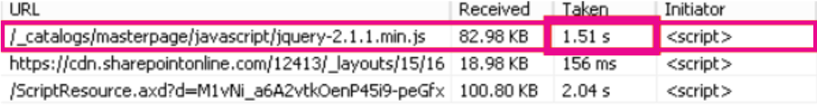

# <a name="content-delivery-networks-cdns"></a><span data-ttu-id="2507f-103">コンテンツ配信ネットワーク (CDNs)</span><span class="sxs-lookup"><span data-stu-id="2507f-103">Content Delivery Networks (CDNs)</span></span>

<span data-ttu-id="2507f-104">CDNs は、エンドユーザーにとって Office 365 を高速かつ信頼性の高い状態に保つことができます。</span><span class="sxs-lookup"><span data-stu-id="2507f-104">CDNs help keep Office 365 fast and reliable for end users.</span></span> <span data-ttu-id="2507f-105">Office 365 などのクラウドサービスでは、CDNs を使用して、ダウンロードを高速化し、エンドユーザーの潜在期間を短縮するために、静的なアセットをブラウザーの近くにキャッシュします。</span><span class="sxs-lookup"><span data-stu-id="2507f-105">Cloud services like Office 365 use CDNs to cache static assets closer to the browsers requesting them to speed up downloads and reduce perceived end user latency.</span></span> <span data-ttu-id="2507f-106">このトピックの情報は、コンテンツ配信ネットワーク (CDNs) と、それらが Office 365 でどのように使用されるかについて理解するのに役立ちます。</span><span class="sxs-lookup"><span data-stu-id="2507f-106">The information in this topic will help you learn about Content Delivery Networks (CDNs) and how they are used by Office 365.</span></span>

## <a name="what-exactly-is-a-cdn"></a><span data-ttu-id="2507f-107">完全に CDN とは何ですか。</span><span class="sxs-lookup"><span data-stu-id="2507f-107">What exactly is a CDN?</span></span>

<span data-ttu-id="2507f-108">CDN は、高速バックボーンネットワークによって接続されるデータセンター内のプロキシサーバーとファイルサーバーで構成される、地理的に分散したネットワークです。</span><span class="sxs-lookup"><span data-stu-id="2507f-108">A CDN is a geographically distributed network consisting of proxy and file servers in datacenters connected by high-speed backbone networks.</span></span> <span data-ttu-id="2507f-109">CDNs は、web サイトまたはサービス内の指定した一連のファイルとオブジェクトの待機時間と読み込み時間を短縮するために使用されます。</span><span class="sxs-lookup"><span data-stu-id="2507f-109">CDNs are used to reduce latency and load times for a specified set of files and objects in a web site or service.</span></span> <span data-ttu-id="2507f-110">CDN には、任意の場所からの着信要求を最適に処理するために、数千のエンドポイントが存在する場合があります。</span><span class="sxs-lookup"><span data-stu-id="2507f-110">A CDN may have many thousands of endpoints for optimal servicing of incoming requests from any location.</span></span>

<span data-ttu-id="2507f-111">通常、CDNs は、javascript ファイル、アイコン、画像などの web サイトまたはサービスの汎用コンテンツのダウンロードを高速化するために使用されます。また、ファイルなどのユーザーコンテンツへのプライベートアクセスを SharePoint Online ドキュメントライブラリ、ストリーミングメディアファイルなどに提供することもできます。、およびカスタムコード。</span><span class="sxs-lookup"><span data-stu-id="2507f-111">CDNs are commonly used to provide faster downloads of generic content for a web site or service such as javascript files, icons and images, and can also provide private access to user content such as files in SharePoint Online document libraries, streaming media files, and custom code.</span></span>

<span data-ttu-id="2507f-112">CDNs は、ほとんどのエンタープライズクラウドサービスで使用されます。</span><span class="sxs-lookup"><span data-stu-id="2507f-112">CDNs are used by most enterprise cloud services.</span></span> <span data-ttu-id="2507f-113">Office 365 のようなクラウドサービスには、多数のユーザーが所有するコンテンツ (メールなど) と汎用コンテンツ (アイコンなど) を同時にダウンロードします。</span><span class="sxs-lookup"><span data-stu-id="2507f-113">Cloud services like Office 365 have millions of customers downloading a mix of proprietary content (such as emails) and generic content (such as icons) at one time.</span></span> <span data-ttu-id="2507f-114">ユーザーのコンピューターにできるだけ近づけるように、すべてのユーザーがアイコンを使用して、画像を追加する方が効率的です。</span><span class="sxs-lookup"><span data-stu-id="2507f-114">It's more efficient to put images everyone uses, like icons, as close to the user's computer as possible.</span></span> <span data-ttu-id="2507f-115">すべてのクラウドサービスで、この汎用コンテンツをすべての大都市エリアに保存する CDN データセンターや、世界中の主要なインターネットハブのすべてにおいて使用することは現実的ではありません。一部の CDNs は共有されています。</span><span class="sxs-lookup"><span data-stu-id="2507f-115">It isn't practical for every cloud service to build CDN datacenters that store this generic content in every metropolitan area, or even in every major Internet hub around the world, so some of these CDNs are shared.</span></span>

## <a name="how-do-cdns-make-services-work-faster"></a><span data-ttu-id="2507f-116">CDNs を使用してサービスを高速化する方法</span><span class="sxs-lookup"><span data-stu-id="2507f-116">How do CDNs make services work faster?</span></span>

<span data-ttu-id="2507f-117">アイコンなどの一般的なオブジェクトをもう一度にダウンロードすると、電子メールやドキュメントなどの重要な個人コンテンツをダウンロードするために使用できるネットワーク帯域幅が必要になることがあります。</span><span class="sxs-lookup"><span data-stu-id="2507f-117">Downloading common objects like icons over and over again can take up network bandwidth that can be better used for downloading important personal content, like email or documents.</span></span> <span data-ttu-id="2507f-118">Office 365 は CDNs を含むアーキテクチャを使用しているため、アイコン、スクリプト、およびその他の汎用コンテンツをサーバーからクライアントコンピューターに近い場所にダウンロードして、ダウンロードを高速化することができます。</span><span class="sxs-lookup"><span data-stu-id="2507f-118">Because Office 365 uses an architecture that includes CDNs, the icons, scripts, and other generic content can be downloaded from servers closer to client computers, making the downloads faster.</span></span> <span data-ttu-id="2507f-119">これは、Office 365 データセンターに安全に格納されている個人コンテンツへのアクセスが高速になることを意味します。</span><span class="sxs-lookup"><span data-stu-id="2507f-119">This means faster access to your personal content, which is securely stored in Office 365 datacenters.</span></span>

<span data-ttu-id="2507f-120">CDNs は、クラウドサービスのパフォーマンスを次のように改善するために役立ちます。</span><span class="sxs-lookup"><span data-stu-id="2507f-120">CDNs help to improve cloud service performance in several ways:</span></span>

- <span data-ttu-id="2507f-121">CDNs は、ネットワークの一部を移行し、クラウドサービスからのファイルダウンロードの負荷を軽減し、ユーザーコンテンツやその他のサービスにサービスを提供するためにクラウドサービスリソースを解放します。これにより、静的アセットの要求を処理する必要性が減少します。</span><span class="sxs-lookup"><span data-stu-id="2507f-121">CDNs shift part of the network and file download burden away from the cloud service, freeing up cloud service resources for serving user content and other services by reducing the need to serve requests for static assets.</span></span>
- <span data-ttu-id="2507f-122">CDNs は、高パフォーマンスのネットワークとファイルサーバーを実装することにより遅延のないファイルアクセスを実現する目的で構築されており、 [HTTP/2](https://en.wikipedia.org/wiki/HTTP/2)などの更新されたネットワークプロトコルを使用して高効率の圧縮と要求多重化を行うことを目的としています。</span><span class="sxs-lookup"><span data-stu-id="2507f-122">CDNs are purpose built to provide low-latency file access by implementing high performance networks and file servers, and by leveraging updated network protocols such as [HTTP/2](https://en.wikipedia.org/wiki/HTTP/2) with highly efficient compression and request multiplexing.</span></span>
- <span data-ttu-id="2507f-123">CDN ネットワークは、グローバルに分散されたエンドポイントを多数使用して、コンテンツを可能な限り近くで利用できるようにします。</span><span class="sxs-lookup"><span data-stu-id="2507f-123">CDN networks use many globally distributed endpoints to make content available as close as possible to users.</span></span>

## <a name="the-office-365-cdn"></a><span data-ttu-id="2507f-124">Office 365 CDN</span><span class="sxs-lookup"><span data-stu-id="2507f-124">The Office 365 CDN</span></span>

<span data-ttu-id="2507f-125">組み込みの Office 365 のコンテンツ配信ネットワーク (CDN) を使用すると、Office 365 管理者は、それを要求するブラウザーに近い静的なアセットをキャッシュすることによって、組織の SharePoint Online ページのパフォーマンスを向上させることができます。ダウンロードして待機時間を短縮します。</span><span class="sxs-lookup"><span data-stu-id="2507f-125">The built-in Office 365 Content Delivery Network (CDN) allows Office 365 administrators to provide better performance for their organization's SharePoint Online pages by caching static assets closer to the browsers requesting them, which helps to speed up downloads and reduce latency.</span></span> <span data-ttu-id="2507f-126">Office 365 CDN は、強化された圧縮およびダウンロード速度を実現するために、 [HTTP/2 プロトコル](https://en.wikipedia.org/wiki/HTTP/2)を使用します。</span><span class="sxs-lookup"><span data-stu-id="2507f-126">The Office 365 CDN uses the [HTTP/2 protocol](https://en.wikipedia.org/wiki/HTTP/2) for improved compression and download speeds.</span></span>

> [!NOTE]
> <span data-ttu-id="2507f-127">Office 365 CDN を使用する場合の制限事項:</span><span class="sxs-lookup"><span data-stu-id="2507f-127">Restrictions for use of the Office 365 CDN:</span></span>
> + <span data-ttu-id="2507f-128">Office 365 CDN は、**運用環境**(世界規模) のクラウドのテナントでのみ使用できます。</span><span class="sxs-lookup"><span data-stu-id="2507f-128">The Office 365 CDN is only available to tenants in the **Production** (worldwide) cloud.</span></span> <span data-ttu-id="2507f-129">米国政府機関のテナント、中国およびドイツのクラウドでは、現在 Office 365 CDN をサポートしていません。</span><span class="sxs-lookup"><span data-stu-id="2507f-129">Tenants in the US Government, China and Germany clouds do not currently support the Office 365 CDN.</span></span>
> + <span data-ttu-id="2507f-130">Office 365 CDN は、現在、カスタムまたは "バニティ" ドメインで構成されているテナントをサポートしていません。</span><span class="sxs-lookup"><span data-stu-id="2507f-130">The Office 365 CDN does not currently support tenants configured with custom or "vanity" domains.</span></span> <span data-ttu-id="2507f-131">「 [Office 365 にドメインを追加](https://docs.microsoft.com/en-us/office365/admin/setup/add-domain?view=o365-worldwide)する」の手順を使用してテナントにドメインを追加した場合、cdn からコンテンツにアクセスしようとすると、OFFICE 365 CDN からエラーが返されます。</span><span class="sxs-lookup"><span data-stu-id="2507f-131">If you have added a domain to your tenant using the instructions in the topic [Add a domain to Office 365](https://docs.microsoft.com/en-us/office365/admin/setup/add-domain?view=o365-worldwide), the Office 365 CDN will return errors when you try to access content from the CDN.</span></span>

<span data-ttu-id="2507f-132">Office 365 CDN は静的資産を複数の場所 _(元の場所)_ でホストできる複数の CDN で構成されているため、静的資産をグローバルな高速ネットワークから提供することができます。</span><span class="sxs-lookup"><span data-stu-id="2507f-132">The Office 365 CDN is composed of multiple CDNs that allow you to host static assets in multiple locations, or _origins_, and serve them from global high-speed networks.</span></span> <span data-ttu-id="2507f-133">Office 365 CDN でホストするコンテンツの種類に応じて、**公開**、**非公開**、またはその両方の元の場所を追加できます。</span><span class="sxs-lookup"><span data-stu-id="2507f-133">Depending on the kind of content you want to host in the Office 365 CDN, you can add **public** origins, **private** origins or both.</span></span>

<span data-ttu-id="2507f-134"></span><span class="sxs-lookup"><span data-stu-id="2507f-134"></span></span>

<span data-ttu-id="2507f-135">Office 365 CDN 内で**公開されている**元の場所のコンテンツは匿名でのアクセスが可能で、ホストされた資産への URL があれば誰でもアクセスできます。</span><span class="sxs-lookup"><span data-stu-id="2507f-135">Content in **public** origins within the Office 365 CDN is accessible anonymously, and can be accessed by anyone who has URLs to hosted assets.</span></span> <span data-ttu-id="2507f-136">公開されている元の場所のコンテンツへのアクセスは匿名になるため、アクセスしたコンテンツは、機密データ以外の一般的なコンテンツ (JavaScript ファイル、スクリプト、アイコン、画像など) をキャッシュする場合にのみ使用するようにしてください。</span><span class="sxs-lookup"><span data-stu-id="2507f-136">Because access to content in public origins is anonymous, you should only use them to cache non-sensitive generic content such as javascript files, scripts, icons and images.</span></span> <span data-ttu-id="2507f-137">Office 365 CDN は、Office 365 クライアント アプリケーションのような一般リソースを、公開されている元の場所からダウンロードする際に既定で使用します。</span><span class="sxs-lookup"><span data-stu-id="2507f-137">The Office 365 CDN is used by default for downloading generic resource assets like the Office 365 client applications from a public origin.</span></span>

<span data-ttu-id="2507f-138">Office 365 CDN 内の**非公開**の元の場所は、SharePoint Online ドキュメント ライブラリ、サイト、メディア (例: 動画) など、ユーザー コンテンツへのプライベート アクセスを行う場合に使用します。</span><span class="sxs-lookup"><span data-stu-id="2507f-138">**Private** origins within the Office 365 CDN provide private access to user content such as SharePoint Online document libraries, sites and media such as videos.</span></span> <span data-ttu-id="2507f-139">公開されている元のファイルのコンテンツへのアクセスは、動的に生成されたトークンで保護されているため、元のドキュメント ライブラリまたは保存場所へのアクセス許可を持つユーザーのみがアクセスできます。</span><span class="sxs-lookup"><span data-stu-id="2507f-139">Access to content in private origins is secured with dynamically generated tokens so it can only be accessed by users with permissions to the original document library or storage location.</span></span> <span data-ttu-id="2507f-140">Office 365 CDN で公開されている元の場所は SharePoint Online コンテンツに対してのみ使用することができ、SharePoint Online テナントからのリダイレクトによってのみ資産にアクセスすることができます。</span><span class="sxs-lookup"><span data-stu-id="2507f-140">Private origins in the Office 365 CDN can only be used for SharePoint Online content, and you can only access assets through redirection from your SharePoint Online tenant.</span></span>

<span data-ttu-id="2507f-141">Office 365 CDN サービスは、SharePoint Online サブスクリプションの一部として含まれます。</span><span class="sxs-lookup"><span data-stu-id="2507f-141">The Office 365 CDN service is included as part of your SharePoint Online subscription.</span></span>

<span data-ttu-id="2507f-142">Office 365 CDN の使用方法の詳細については、「 [SharePoint Online で office 365 コンテンツ配信ネットワークを使用](https://docs.microsoft.com/en-us/office365/enterprise/use-office-365-cdn-with-spo)する」を参照してください。</span><span class="sxs-lookup"><span data-stu-id="2507f-142">For more information about how to use the Office 365 CDN, see [Use the Office 365 content delivery network with SharePoint Online](https://docs.microsoft.com/en-us/office365/enterprise/use-office-365-cdn-with-spo).</span></span>

## <a name="other-microsoft-cdns"></a><span data-ttu-id="2507f-143">その他の Microsoft CDNs</span><span class="sxs-lookup"><span data-stu-id="2507f-143">Other Microsoft CDNs</span></span>

<span data-ttu-id="2507f-144">Office 365 CDN の一部ではありませんが、これらの CDNs を Office 365 テナントで使用して、SharePoint 開発ライブラリ、カスタムコード、および Office 365 CDN の範囲外にあるその他の目的にアクセスすることができます。</span><span class="sxs-lookup"><span data-stu-id="2507f-144">Although not a part of the Office 365 CDN, you can use these CDNs in your Office 365 tenant for access to SharePoint development libraries, custom code and other purposes that fall outside the scope of the Office 365 CDN.</span></span>

### <a name="azure-cdn"></a><span data-ttu-id="2507f-145">Azure CDN</span><span class="sxs-lookup"><span data-stu-id="2507f-145">Azure CDN</span></span>

<span data-ttu-id="2507f-146">**AZURE CDN**を使用すると、カスタム web パーツ、ライブラリ、およびその他のリソースアセットをホストするための独自の cdn インスタンスを展開できます。これにより、アクセスキーを cdn ストレージに適用し、cdn 構成をより細かく制御することができます。</span><span class="sxs-lookup"><span data-stu-id="2507f-146">You can use the **Azure CDN** to deploy your own CDN instance for hosting custom web parts, libraries and other resource assets, which allows you to apply access keys to your CDN storage and exert greater control over your CDN configuration.</span></span> <span data-ttu-id="2507f-147">Azure CDN の使用は無料であり、Azure サブスクリプションが必要です。</span><span class="sxs-lookup"><span data-stu-id="2507f-147">Use of the Azure CDN is not free, and requires an Azure subscription.</span></span>

<span data-ttu-id="2507f-148">Azure CDN インスタンスを構成する方法の詳細については、「[クイックスタート: azure storage アカウントと AZURE cdn を統合](https://docs.microsoft.com/en-us/azure/cdn/cdn-create-a-storage-account-with-cdn)する」を参照してください。</span><span class="sxs-lookup"><span data-stu-id="2507f-148">For more information on how to configure an Azure CDN instance, see [Quickstart: Integrate an Azure storage account with Azure CDN](https://docs.microsoft.com/en-us/azure/cdn/cdn-create-a-storage-account-with-cdn).</span></span>

<span data-ttu-id="2507f-149">SharePoint web パーツをホストするために Azure CDN を使用する方法の例については、「 [sharepoint のクライアント側 web パーツを AZURE CDN に展開](https://docs.microsoft.com/en-us/sharepoint/dev/spfx/web-parts/get-started/deploy-web-part-to-cdn)する」を参照してください。</span><span class="sxs-lookup"><span data-stu-id="2507f-149">For an example of how the Azure CDN can be used to host SharePoint web parts, see [Deploy your SharePoint client-side web part to Azure CDN](https://docs.microsoft.com/en-us/sharepoint/dev/spfx/web-parts/get-started/deploy-web-part-to-cdn).</span></span>

<span data-ttu-id="2507f-150">Azure CDN PowerShell モジュールの詳細については、「 [PowerShell を使用して AZURE cdn を管理](https://docs.microsoft.com/en-us/azure/cdn/cdn-manage-powershell)する」を参照してください。</span><span class="sxs-lookup"><span data-stu-id="2507f-150">For information about the Azure CDN PowerShell module, see [Manage Azure CDN with PowerShell](https://docs.microsoft.com/en-us/azure/cdn/cdn-manage-powershell).</span></span>

### <a name="microsoft-ajax-cdn"></a><span data-ttu-id="2507f-151">Microsoft Ajax CDN</span><span class="sxs-lookup"><span data-stu-id="2507f-151">Microsoft Ajax CDN</span></span>

<span data-ttu-id="2507f-152">Microsoft の**AJAX cdn**は読み取り専用の cdn で、jQuery (およびその他のすべてのライブラリ)、ASP.NET Ajax、ブートストラップ、ノックアウトなどの多くの一般的な開発ライブラリを提供します。</span><span class="sxs-lookup"><span data-stu-id="2507f-152">Microsoft's **Ajax CDN** is a read-only CDN that offers many popular development libraries including jQuery (and all of its other libraries), ASP.NET Ajax, Bootstrap, Knockout.js, and others.</span></span>
  
<span data-ttu-id="2507f-153">これらのスクリプトをプロジェクトに含めるには、プロジェクト自体に含めるのではなく、これらのパブリックなライブラリへの参照を CDN アドレスへの参照に置き換えます。</span><span class="sxs-lookup"><span data-stu-id="2507f-153">To include these scripts in your project, simply replace any references to these publicly available libraries with references to the CDN address instead of including it in your project itself.</span></span> <span data-ttu-id="2507f-154">たとえば、次のコードを使用して jQuery にリンクします。</span><span class="sxs-lookup"><span data-stu-id="2507f-154">For example, use the following code to link to jQuery:</span></span>

``` html
<script src=http://ajax.aspnetcdn.com/ajax/jquery-2.1.1.js> </script>
```

<span data-ttu-id="2507f-155">Microsoft Ajax CDN の使用方法の詳細については、「 [Microsoft AJAX cdn](https://docs.microsoft.com/en-us/aspnet/ajax/cdn/overview)」を参照してください。</span><span class="sxs-lookup"><span data-stu-id="2507f-155">For more information about how to use the Microsoft Ajax CDN, see [Microsoft Ajax CDN](https://docs.microsoft.com/en-us/aspnet/ajax/cdn/overview).</span></span>

## <a name="how-does-office-365-use-content-from-a-cdn"></a><span data-ttu-id="2507f-156">Office 365 で CDN からのコンテンツを使用する方法</span><span class="sxs-lookup"><span data-stu-id="2507f-156">How does Office 365 use content from a CDN?</span></span>

<span data-ttu-id="2507f-157">Office 365 テナントに対して構成する CDN に関係なく、基本的なデータ取得プロセスは同じです。</span><span class="sxs-lookup"><span data-stu-id="2507f-157">Regardless of what CDN you configure for your Office 365 tenant, the basic data retrieval process is the same.</span></span>

1. <span data-ttu-id="2507f-158">クライアント (ブラウザーまたは Office クライアントアプリケーション) は、Office 365 のデータを要求します。</span><span class="sxs-lookup"><span data-stu-id="2507f-158">Your client (a browser or Office client application) requests data from Office 365.</span></span>

2. <span data-ttu-id="2507f-159">Office 365 は、クライアントにデータを直接返すか、またはデータが CDN によってホストされるコンテンツセットの一部である場合、クライアントを CDN URL にリダイレクトします。</span><span class="sxs-lookup"><span data-stu-id="2507f-159">Office 365 either returns the data directly to your client or, if the data is part of a set of content hosted by the CDN, redirects your client to the CDN URL.</span></span>

    <span data-ttu-id="2507f-160">a.</span><span class="sxs-lookup"><span data-stu-id="2507f-160">a.</span></span> <span data-ttu-id="2507f-161">データが_パブリック_の配信元で既にキャッシュされている場合、クライアントは、最も近い CDN の場所からクライアントにデータを直接ダウンロードします。</span><span class="sxs-lookup"><span data-stu-id="2507f-161">If the data is already cached in a _public_ origin, your client downloads the data directly from the nearest CDN location to your client.</span></span>

    <span data-ttu-id="2507f-162">b.</span><span class="sxs-lookup"><span data-stu-id="2507f-162">b.</span></span> <span data-ttu-id="2507f-163">データが既に_プライベート_の配信元でキャッシュされている場合、CDN サービスは、元の Office 365 ユーザーアカウントのアクセス許可を確認します。</span><span class="sxs-lookup"><span data-stu-id="2507f-163">If the data is already cached in a _private_ origin, the CDN service checks your Office 365 user account's permissions on the origin.</span></span> <span data-ttu-id="2507f-164">アクセス許可がある場合、SharePoint Online は CDN および2つのアクセストークン内のアセットへのパスで構成されるカスタム URL を動的に生成し、クライアントにカスタム URL を返します。</span><span class="sxs-lookup"><span data-stu-id="2507f-164">If you have permissions, SharePoint Online dynamically generates a custom URL composed of the path to the asset in the CDN and two access tokens, and returns the custom URL to your client.</span></span> <span data-ttu-id="2507f-165">その後、クライアントは、カスタム URL を使用して、最も近い CDN の場所からクライアントにデータを直接ダウンロードします。</span><span class="sxs-lookup"><span data-stu-id="2507f-165">Your client then downloads the data directly from the nearest CDN location to your client using the custom URL.</span></span>

3. <span data-ttu-id="2507f-166">CDN でデータがキャッシュされていない場合、CDN ノードは Office 365 のデータを要求し、クライアントがデータをダウンロードした後、しばらくの間データをキャッシュします。</span><span class="sxs-lookup"><span data-stu-id="2507f-166">If the data isn't cached at the CDN, the CDN node requests the data from Office 365 and then caches the data for a period of time after your client downloads the data.</span></span>

<span data-ttu-id="2507f-167">CDN は、ユーザーのブラウザーに最も近いデータセンターを特定し、リダイレクトを使用して、そこから要求されたデータをダウンロードします。</span><span class="sxs-lookup"><span data-stu-id="2507f-167">The CDN figures out the closest datacenter to the user's browser and, using redirection, downloads the requested data from there.</span></span> <span data-ttu-id="2507f-168">CDN リダイレクトは短時間で、ユーザーはダウンロード時間を大幅に短縮できます。</span><span class="sxs-lookup"><span data-stu-id="2507f-168">CDN redirection is quick, and can save users a lot of download time.</span></span>

## <a name="how-should-i-set-up-my-network-so-that-cdns-work-best-with-office-365"></a><span data-ttu-id="2507f-169">Office 365 で CDNs が最適に機能するように、どのようにネットワークをセットアップする必要がありますか?</span><span class="sxs-lookup"><span data-stu-id="2507f-169">How should I set up my network so that CDNs work best with Office 365?</span></span>

<span data-ttu-id="2507f-170">ネットワーク上のクライアント間の遅延を最小限に抑え、CDN エンドポイントは、最適なパフォーマンスを確保するための重要な考慮事項です。</span><span class="sxs-lookup"><span data-stu-id="2507f-170">Minimizing latency between clients on your network and CDN endpoints is the key consideration for ensuring optimal performance.</span></span> <span data-ttu-id="2507f-171">「 [Office 365 エンドポイントの管理](managing-office-365-endpoints.md)」に記載されているベストプラクティスを使用すると、クライアントブラウザーが中央のプロキシ経由で cdn トラフィックをルーティングするのではなく、直接 cdn にアクセスできるようになります。不要な待機時間。</span><span class="sxs-lookup"><span data-stu-id="2507f-171">You can use the best practices outlined in [Managing Office 365 endpoints](managing-office-365-endpoints.md) to ensure that your network configuration permits client browsers to access the CDN directly rather than routing CDN traffic through central proxies to avoid introducing unnecessary latency.</span></span>

<span data-ttu-id="2507f-172">また、「office [365 のネットワーク接続の原則](https://aka.ms/o365networkingprinciples)」を参照して、office 365 のネットワークパフォーマンスの最適化の背後にある概念を理解することもできます。</span><span class="sxs-lookup"><span data-stu-id="2507f-172">You can also read [Office 365 Network Connectivity Principles](https://aka.ms/o365networkingprinciples) to understand the concepts behind optimizing Office 365 network performance.</span></span>

## <a name="is-there-a-list-of-all-the-cdns-that-office-365-uses"></a><span data-ttu-id="2507f-173">Office 365 で使用されるすべての CDNs の一覧はありますか。</span><span class="sxs-lookup"><span data-stu-id="2507f-173">Is there a list of all the CDNs that Office 365 uses?</span></span>

<span data-ttu-id="2507f-174">Office 365 で使用されている CDNs は常に変更される可能性があり、多くの場合、イベント1に構成されている複数の CDN パートナーが利用できなくなっています。</span><span class="sxs-lookup"><span data-stu-id="2507f-174">The CDNs in use by Office 365 are always subject to change and in many cases there are multiple CDN partners configured in the event one is unavailable.</span></span> <span data-ttu-id="2507f-175">Office 365 で使用されるプライマリの CDNs は次のとおりです。</span><span class="sxs-lookup"><span data-stu-id="2507f-175">The primary CDNs used by Office 365 are:</span></span>

|<span data-ttu-id="2507f-176">CDN</span><span class="sxs-lookup"><span data-stu-id="2507f-176">CDN</span></span>  |<span data-ttu-id="2507f-177">Company</span><span class="sxs-lookup"><span data-stu-id="2507f-177">Company</span></span>  |<span data-ttu-id="2507f-178">使用方法</span><span class="sxs-lookup"><span data-stu-id="2507f-178">Usage</span></span>  |<span data-ttu-id="2507f-179">リンク</span><span class="sxs-lookup"><span data-stu-id="2507f-179">Link</span></span>  |
|---------|---------|---------|---------|
|<span data-ttu-id="2507f-180">Office 365 CDN</span><span class="sxs-lookup"><span data-stu-id="2507f-180">Office 365 CDN</span></span>     |<span data-ttu-id="2507f-181">Akamai</span><span class="sxs-lookup"><span data-stu-id="2507f-181">Akamai</span></span>         |<span data-ttu-id="2507f-182">一般に公開される出所の汎用アセット、プライベートオリジンでの SharePoint ユーザーコンテンツ</span><span class="sxs-lookup"><span data-stu-id="2507f-182">Generic assets in public origins, SharePoint user content in private origins</span></span>         |[<span data-ttu-id="2507f-183">SharePoint Online での Office 365 コンテンツ配信ネットワークの使用</span><span class="sxs-lookup"><span data-stu-id="2507f-183">Use the Office 365 content delivery network with SharePoint Online</span></span>](https://docs.microsoft.com/en-us/office365/enterprise/use-office-365-cdn-with-spo)         |
|<span data-ttu-id="2507f-184">Azure CDN</span><span class="sxs-lookup"><span data-stu-id="2507f-184">Azure CDN</span></span>     |<span data-ttu-id="2507f-185">Microsoft</span><span class="sxs-lookup"><span data-stu-id="2507f-185">Microsoft</span></span>         |<span data-ttu-id="2507f-186">カスタムコード、SharePoint Framework ソリューション</span><span class="sxs-lookup"><span data-stu-id="2507f-186">Custom code, SharePoint Framework solutions</span></span>         |[<span data-ttu-id="2507f-187">Microsoft Azure CDN</span><span class="sxs-lookup"><span data-stu-id="2507f-187">Microsoft Azure CDN</span></span>](https://azure.microsoft.com/documentation/services/cdn/)         |
|<span data-ttu-id="2507f-188">Microsoft Ajax CDN (読み取り専用)</span><span class="sxs-lookup"><span data-stu-id="2507f-188">Microsoft Ajax CDN (read only)</span></span>     |<span data-ttu-id="2507f-189">Microsoft</span><span class="sxs-lookup"><span data-stu-id="2507f-189">Microsoft</span></span>         |<span data-ttu-id="2507f-190">Ajax、jQuery、ASP.NET、ブートストラップ、ノックアウトなどの共通ライブラリ。</span><span class="sxs-lookup"><span data-stu-id="2507f-190">Common libraries for Ajax, jQuery, ASP.NET, Bootstrap, Knockout.js etc.</span></span>         |[<span data-ttu-id="2507f-191">Microsoft Ajax CDN</span><span class="sxs-lookup"><span data-stu-id="2507f-191">Microsoft Ajax CDN</span></span>](https://docs.microsoft.com/en-us/aspnet/ajax/cdn/overview)         |

## <a name="what-performance-gains-does-a-cdn-provide"></a><span data-ttu-id="2507f-192">CDN によって得られるパフォーマンスの向上</span><span class="sxs-lookup"><span data-stu-id="2507f-192">What performance gains does a CDN provide?</span></span>

<span data-ttu-id="2507f-193">Office 365 から直接ダウンロードされたデータと、特定の CDN からダウンロードされたデータとの間のパフォーマンスの違いを測定する要因は多数あります。たとえば、テナントへの相対位置や、最も近い CDN エンドポイントに対する特定の数、CDN によって提供されるページ上のアセット、およびネットワークの待ち時間と帯域幅の一時的な変化。</span><span class="sxs-lookup"><span data-stu-id="2507f-193">There are many factors involved in measuring specific differences in performance between data downloaded directly from Office 365 and data downloaded from a specific CDN, such as your location relative to your tenant and to the nearest CDN endpoint, the number of assets on a page that are served by the CDN, and transient changes in network latency and bandwidth.</span></span> <span data-ttu-id="2507f-194">ただし、単純な A/B テストでは、特定のファイルのダウンロード時間の違いを表示するのに役立ちます。</span><span class="sxs-lookup"><span data-stu-id="2507f-194">However, a simple A/B test can help to show the difference in download time for a specific file.</span></span>

<span data-ttu-id="2507f-195">次のスクリーンショットは、Office 365 のネイティブファイルの場所と、 [Microsoft Ajax コンテンツ配信ネットワーク](https://docs.microsoft.com/en-us/aspnet/ajax/cdn/overview)上でホストされている同じファイルの間でのダウンロード速度の違いを示しています。</span><span class="sxs-lookup"><span data-stu-id="2507f-195">The following screen shots illustrate the difference in download speed between the native file location in Office 365 and the same file hosted on the [Microsoft Ajax Content Delivery Network](https://docs.microsoft.com/en-us/aspnet/ajax/cdn/overview).</span></span> <span data-ttu-id="2507f-196">これらのスクリーンショットは、Internet Explorer 11 開発者ツールの [**ネットワーク**] タブにあります。</span><span class="sxs-lookup"><span data-stu-id="2507f-196">These screen shots are from the **Network** tab in the Internet Explorer 11 developer tools.</span></span> <span data-ttu-id="2507f-197">これらのスクリーンショットは、人気のあるライブラリ jQuery の待機時間を示しています。</span><span class="sxs-lookup"><span data-stu-id="2507f-197">These screen shots show the latency on the popular library jQuery.</span></span> <span data-ttu-id="2507f-198">この画面を表示するには、Internet Explorer で**F12**キーを押して、wi-fi アイコンで認識されている [**ネットワーク**] タブを選択します。</span><span class="sxs-lookup"><span data-stu-id="2507f-198">To bring up this screen, in Internet Explorer, press **F12** and select the **Network** tab which is symbolized with a Wi-Fi icon.</span></span>
  

  
<span data-ttu-id="2507f-200">このスクリーンショットは、SharePoint Online サイト自体のマスターページギャラリーにアップロードされたライブラリを示しています。</span><span class="sxs-lookup"><span data-stu-id="2507f-200">This screen shot shows the library uploaded to the master page gallery on the SharePoint Online site itself.</span></span> <span data-ttu-id="2507f-201">ライブラリのアップロードにかかった時間は1.51 秒です。</span><span class="sxs-lookup"><span data-stu-id="2507f-201">The time it took to upload the library is 1.51 seconds.</span></span>
  

  
<span data-ttu-id="2507f-203">2番目のスクリーンショットは、Microsoft の CDN によって配信された同じファイルを示しています。</span><span class="sxs-lookup"><span data-stu-id="2507f-203">The second screen shot shows the same file delivered by Microsoft's CDN.</span></span> <span data-ttu-id="2507f-204">この時間が経過すると、遅延は約496ミリ秒になります。</span><span class="sxs-lookup"><span data-stu-id="2507f-204">This time the latency is around 496 milliseconds.</span></span> <span data-ttu-id="2507f-205">これは大規模な改善で、1秒間にオブジェクトをダウンロードする合計時間が短縮されることを示しています。</span><span class="sxs-lookup"><span data-stu-id="2507f-205">This is a large improvement and shows that a whole second is shaved off the total time to download the object.</span></span>
  


## <a name="is-my-data-safe"></a><span data-ttu-id="2507f-207">データは安全ですか?</span><span class="sxs-lookup"><span data-stu-id="2507f-207">Is my data safe?</span></span>

<span data-ttu-id="2507f-208">当社では、ビジネスを実行するデータを保護するために十分な注意を払っています。</span><span class="sxs-lookup"><span data-stu-id="2507f-208">We take great care to protect the data that runs your business.</span></span> <span data-ttu-id="2507f-209">Office 365 CDN に格納されているデータは、移行中と保存時の両方で暗号化され、Office 365 のデータへのアクセスは office 365 のユーザー権限とトークン認証によって保護されます。</span><span class="sxs-lookup"><span data-stu-id="2507f-209">Data stored in the Office 365 CDN is encrypted both in transit and at rest, and access to data in the Office 365 SharePoint CDN is secured by Office 365 user permissions and token authorization.</span></span> <span data-ttu-id="2507f-210">Office 365 SharePoint CDN のデータに対する要求は、Office 365 テナントから参照 (リダイレクト) する必要があります。または、認証トークンは生成されません。</span><span class="sxs-lookup"><span data-stu-id="2507f-210">Requests for data in the Office 365 SharePoint CDN must be referred (redirected) from your Office 365 tenant or an authorization token will not be generated.</span></span>

<span data-ttu-id="2507f-211">データを安全な状態に保つために、ユーザーコンテンツやその他の機密データをパブリック CDN に保存しないことをお勧めします。</span><span class="sxs-lookup"><span data-stu-id="2507f-211">To ensure that your data remains secure, we recommend that you never store user content or other sensitive data in a public CDN.</span></span> <span data-ttu-id="2507f-212">パブリック CDN のデータへのアクセスは匿名であるため、パブリック CDNs は、web スクリプトファイル、アイコン、画像、その他の機密でないアセットなどの汎用コンテンツをホストする場合にのみ使用してください。</span><span class="sxs-lookup"><span data-stu-id="2507f-212">Because access to data in a public CDN is anonymous, public CDNs should only be used to host generic content such as web script files, icons, images and other non-sensitive assets.</span></span>

> [!NOTE]
> <span data-ttu-id="2507f-213">サードパーティの CDN プロバイダーは、Office 365 セキュリティセンターによって規定されているコミットメントとは異なるプライバシーとコンプライアンス標準を備えている場合があります。</span><span class="sxs-lookup"><span data-stu-id="2507f-213">3rd party CDN providers may have privacy and compliance standards that differ from the commitments outlined by the Office 365 Trust Center.</span></span> <span data-ttu-id="2507f-214">CDN サービスを使用してキャッシュされたデータは、Microsoft データ処理条件 (DPT) に準拠していない可能性があり、Office 365 セキュリティセンターのコンプライアンス境界の外にある場合があります。</span><span class="sxs-lookup"><span data-stu-id="2507f-214">Data cached through the CDN service may not conform to the Microsoft Data Processing Terms (DPT), and may be outside of the Office 365 Trust Center compliance boundaries.</span></span>

<span data-ttu-id="2507f-215">Office 365 CDN プロバイダーのプライバシーとデータ保護の詳細については、以下を参照してください。</span><span class="sxs-lookup"><span data-stu-id="2507f-215">For in-depth information about privacy and data protection for Office 365 CDN providers, visit the following:</span></span>  

- <span data-ttu-id="2507f-216">Office 365 のプライバシーとデータ保護の詳細については、「 [Microsoft Trust Center」](https://www.microsoft.com/trustcenter)を参照してください。</span><span class="sxs-lookup"><span data-stu-id="2507f-216">Learn more about Office 365 privacy and data protection at the [Microsoft Trust Center](https://www.microsoft.com/trustcenter)</span></span>
- <span data-ttu-id="2507f-217">Akamai のプライバシーとデータ保護の詳細については、「 [Akamai Privacy セキュリティセンター」](https://www.akamai.com/us/en/about/compliance/data-protection-at-akamai.jsp)を参照してください。</span><span class="sxs-lookup"><span data-stu-id="2507f-217">Learn more about Akamai’s privacy and data protection at the [Akamai Privacy Trust Center](https://www.akamai.com/us/en/about/compliance/data-protection-at-akamai.jsp)</span></span>
- <span data-ttu-id="2507f-218">Azure のプライバシーとデータ保護の詳細については、「 [azure のセキュリティセンター」](https://azure.microsoft.com/en-us/overview/trusted-cloud/)を参照してください。</span><span class="sxs-lookup"><span data-stu-id="2507f-218">Learn more about Azure privacy and data protection at the [Azure Trust Center](https://azure.microsoft.com/en-us/overview/trusted-cloud/)</span></span>

## <a name="how-can-i-secure-my-network-with-all-these-3rd-party-services"></a><span data-ttu-id="2507f-219">これらのサードパーティ製サービスを使用してネットワークをセキュリティで保護するにはどうすればよいですか?</span><span class="sxs-lookup"><span data-stu-id="2507f-219">How can I secure my network with all these 3rd party services?</span></span>

<span data-ttu-id="2507f-220">一連のパートナーサービスを活用することにより、Office 365 は、office 365 を使用しているときに、可用性の要件を拡大縮小し、ユーザーの利便性を向上させることができます。</span><span class="sxs-lookup"><span data-stu-id="2507f-220">Leveraging an extensive set of partner services allows Office 365 to scale and meet availability requirements as well as enhance the user experience when using Office 365.</span></span> <span data-ttu-id="2507f-221">サードパーティ製サービスの Office 365 では、両方の証明書失効リストが含まれています。crl.microsoft.com、sa.symcb.com、CDNs など。r3.res.outlook.com など。</span><span class="sxs-lookup"><span data-stu-id="2507f-221">The 3rd party services Office 365 leverages include both certificate revocation lists; such as crl.microsoft.com or sa.symcb.com, and CDNs; such as r3.res.outlook.com.</span></span> <span data-ttu-id="2507f-222">Office 365 によって生成されるすべての CDN FQDN は、Office 365 のカスタム FQDN です。</span><span class="sxs-lookup"><span data-stu-id="2507f-222">Every CDN FQDN generated by Office 365 is a custom FQDN for Office 365.</span></span> <span data-ttu-id="2507f-223">Office 365 の要求で FQDN に送信した場合は、CDN プロバイダーが FQDN およびその場所の基になるコンテンツを制御することができます。</span><span class="sxs-lookup"><span data-stu-id="2507f-223">If you're sent to a FQDN at the request of Office 365 you can be assured that the CDN provider controls the FQDN and the underlying content at that location.</span></span>
  
<span data-ttu-id="2507f-224">サードパーティに対する要求から、Microsoft または Office 365 データセンター宛ての要求を分離する必要があるお客様のために、 [office 365 エンドポイントの管理](https://support.office.com/article/99cab9d4-ef59-4207-9f2b-3728eb46bf9a)に関するガイダンスを作成しました。</span><span class="sxs-lookup"><span data-stu-id="2507f-224">For customers that want to segregate requests destined for a Microsoft or Office 365 datacenter from requests that are destined for a 3rd party, we've written up guidance on [Managing Office 365 endpoints](https://support.office.com/article/99cab9d4-ef59-4207-9f2b-3728eb46bf9a).</span></span>

## <a name="is-there-a-list-of-all-the-fqdns-that-leverage-cdns"></a><span data-ttu-id="2507f-225">CDNs を利用する Fqdn の一覧はありますか。</span><span class="sxs-lookup"><span data-stu-id="2507f-225">Is there a list of all the FQDNs that leverage CDNs?</span></span>

<span data-ttu-id="2507f-226">Fqdn の一覧と、時間の経過による CDNs の変更の活用方法。</span><span class="sxs-lookup"><span data-stu-id="2507f-226">The list of FQDNs and how they leverage CDNs change over time.</span></span> <span data-ttu-id="2507f-227">CDNs を利用する最新の Fqdn で最新の情報を得るには、「公開された[Office 365 の url と IP アドレスの範囲](https://go.microsoft.com/fwlink/p/?LinkID=293744)」ページを参照してください。</span><span class="sxs-lookup"><span data-stu-id="2507f-227">Refer to our published [Office 365 URLs and IP address ranges](https://go.microsoft.com/fwlink/p/?LinkID=293744) page to get up to date on the latest FQDNs that leverage CDNs.</span></span>

<span data-ttu-id="2507f-228">[Office 365 の Ip アドレスと URL Web サービス](https://docs.microsoft.com/en-us/office365/enterprise/office-365-ip-web-service)を使用して、現在の office 365 の URL と IP アドレス範囲を CSV または JSON として書式設定して要求することもできます。</span><span class="sxs-lookup"><span data-stu-id="2507f-228">You can also use the [Office 365 IP Address and URL Web service](https://docs.microsoft.com/en-us/office365/enterprise/office-365-ip-web-service) to request the current Office 365 URLs and IP address ranges formatted as CSV or JSON.</span></span>

## <a name="can-i-use-my-own-cdn-and-cache-content-on-my-local-network"></a><span data-ttu-id="2507f-229">自分の CDN を使用して、ローカルネットワーク上でコンテンツをキャッシュすることはできますか。</span><span class="sxs-lookup"><span data-stu-id="2507f-229">Can I use my own CDN and cache content on my local network?</span></span>

<span data-ttu-id="2507f-230">お客様のニーズに対応するための新しい方法が絶えず模索されており、現在、キャッシュプロキシソリューションやその他のオンプレミスの CDN ソリューションの使用方法について調査しています。</span><span class="sxs-lookup"><span data-stu-id="2507f-230">We're continually looking for new ways to support our customers needs and are currently exploring the use of caching proxy solutions and other on-premises CDN solutions.</span></span>

<span data-ttu-id="2507f-231">Office 365 CDN の一部ではありませんが、 **AZURE cdn**を使用してカスタム web パーツ、ライブラリ、およびその他のリソースアセットをホストすることができます。これにより、アクセスキーを cdn ストレージに適用して、cdn 構成をより細かく制御することができます。</span><span class="sxs-lookup"><span data-stu-id="2507f-231">Although it is not a part of the Office 365 CDN, you can also use the **Azure CDN** for hosting custom web parts, libraries and other resource assets, which allows you to apply access keys to your CDN storage and exert greater control over your CDN configuration.</span></span> <span data-ttu-id="2507f-232">Azure CDN の使用は無料であり、Azure サブスクリプションが必要です。</span><span class="sxs-lookup"><span data-stu-id="2507f-232">Use of the Azure CDN is not free, and requires an Azure subscription.</span></span> <span data-ttu-id="2507f-233">Azure CDN インスタンスを構成する方法の詳細については、「[クイックスタート: azure storage アカウントと AZURE cdn を統合](https://docs.microsoft.com/en-us/azure/cdn/cdn-create-a-storage-account-with-cdn)する」を参照してください。</span><span class="sxs-lookup"><span data-stu-id="2507f-233">For more information on how to configure an Azure CDN instance, see [Quickstart: Integrate an Azure storage account with Azure CDN](https://docs.microsoft.com/en-us/azure/cdn/cdn-create-a-storage-account-with-cdn).</span></span>

## <a name="im-using-azure-expressroute-for-office-365-does-that-change-things"></a><span data-ttu-id="2507f-234">Office 365 用の Azure ExpressRoute を使用していますが、変更はありますか?</span><span class="sxs-lookup"><span data-stu-id="2507f-234">I'm using Azure ExpressRoute for Office 365, does that change things?</span></span>

<span data-ttu-id="2507f-235">[Office 365 用の Azure ExpressRoute](azure-expressroute.md)は、パブリックインターネットから分離された office 365 インフラストラクチャへの専用の接続を提供します。</span><span class="sxs-lookup"><span data-stu-id="2507f-235">[Azure ExpressRoute for Office 365](azure-expressroute.md) provides a dedicated connection to Office 365 infrastructure that is segregated from the public internet.</span></span> <span data-ttu-id="2507f-236">この場合も、クライアントは、expressroute 以外の接続を介して接続して、ExpressRoute でサポートされているサービスの一覧に明示的に含まれていない他の Microsoft インフラストラクチャに接続する必要があります。</span><span class="sxs-lookup"><span data-stu-id="2507f-236">This means that clients will still need to connect over non-ExpressRoute connections to connect to CDNs and other Microsoft infrastructure that is not explicitly included in the list of services supported by ExpressRoute.</span></span> <span data-ttu-id="2507f-237">CDNs に対する要求など、特定のトラフィックをルーティングする方法の詳細については、「 [Office 365 ネットワークトラフィック管理](routing-with-expressroute.md)」を参照してください。</span><span class="sxs-lookup"><span data-stu-id="2507f-237">For more information about how to route specific traffic such as requests destined for CDNs, refer to [Office 365 network traffic management](routing-with-expressroute.md).</span></span>

## <a name="can-i-use-cdns-with-sharepoint-server-on-premises"></a><span data-ttu-id="2507f-238">オンプレミスの SharePoint Server で CDNs を使用できますか?</span><span class="sxs-lookup"><span data-stu-id="2507f-238">Can I use CDNs with SharePoint Server on-premises?</span></span>

<span data-ttu-id="2507f-239">CDNs の使用は SharePoint Online のコンテキストでのみ有効であり、SharePoint Server で回避する必要があります。</span><span class="sxs-lookup"><span data-stu-id="2507f-239">Using CDNs only makes sense in a SharePoint Online context and should be avoided with SharePoint Server.</span></span> <span data-ttu-id="2507f-240">これは、サーバーが社内に設置されている場合や、地理的に閉じている場合は、地理的な場所に関するすべての利点が true を保持しないためです。</span><span class="sxs-lookup"><span data-stu-id="2507f-240">This is because all of the advantages around geographic location do not hold true if the server is located on-premises or geographically close anyway.</span></span> <span data-ttu-id="2507f-241">また、ホストされているサーバーへのネットワーク接続がある場合は、インターネット接続を使用せずにサイトが使用される可能性があるため、CDN ファイルを取得することはできません。</span><span class="sxs-lookup"><span data-stu-id="2507f-241">Additionally, if there is a network connection to the servers where it's hosted, then the site may be used without an Internet connection and therefore cannot retrieve the CDN files.</span></span> <span data-ttu-id="2507f-242">それ以外の場合は、使用可能で、サイトに必要なライブラリおよびファイルに対して安定したものがある場合は、CDN を使用する必要があります。</span><span class="sxs-lookup"><span data-stu-id="2507f-242">Otherwise, you should use a CDN if there is one available and stable for the library and files you need for your site.</span></span>
  
<span data-ttu-id="2507f-243">ここに戻る場合は、次の短いリンクをご利用ください: [https://aka.ms/o365cdns](https://aka.ms/o365cdns)</span><span class="sxs-lookup"><span data-stu-id="2507f-243">Here's a short link you can use to come back: [https://aka.ms/o365cdns](https://aka.ms/o365cdns)</span></span>
  
## <a name="see-also"></a><span data-ttu-id="2507f-244">関連項目</span><span class="sxs-lookup"><span data-stu-id="2507f-244">See also</span></span>

[<span data-ttu-id="2507f-245">Office 365 ネットワーク接続の原則</span><span class="sxs-lookup"><span data-stu-id="2507f-245">Office 365 Network Connectivity Principles</span></span>](https://aka.ms/o365networkingprinciples)

[<span data-ttu-id="2507f-246">Office 365 のネットワーク接続の評価</span><span class="sxs-lookup"><span data-stu-id="2507f-246">Assessing Office 365 network connectivity</span></span>](assessing-network-connectivity.md)

[<span data-ttu-id="2507f-247">Office 365 エンドポイントの管理</span><span class="sxs-lookup"><span data-stu-id="2507f-247">Managing Office 365 endpoints</span></span>](https://docs.microsoft.com/en-us/office365/enterprise/managing-office-365-endpoints)

[<span data-ttu-id="2507f-248">Office 365 の URL と IP アドレスの範囲</span><span class="sxs-lookup"><span data-stu-id="2507f-248">Office 365 URLs and IP address ranges</span></span>](https://go.microsoft.com/fwlink/p/?LinkID=293744)

[<span data-ttu-id="2507f-249">SharePoint Online での Office 365 コンテンツ配信ネットワークの使用</span><span class="sxs-lookup"><span data-stu-id="2507f-249">Use the Office 365 content delivery network with SharePoint Online</span></span>](https://docs.microsoft.com/en-us/office365/enterprise/use-office-365-cdn-with-spo)

[<span data-ttu-id="2507f-250">Microsoft Trust Center</span><span class="sxs-lookup"><span data-stu-id="2507f-250">Microsoft Trust Center</span></span>](https://www.microsoft.com/trustcenter)