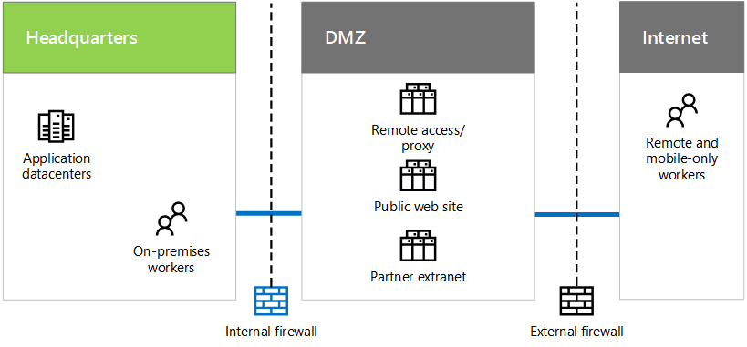

# Contoso 社の IT インフラストラクチャおよびニーズContoso's IT infrastructure and needs

 **概要:** Contoso 社のオンプレミスの IT インフラストラクチャの基本的な構造について、およびそのビジネス ニーズが Microsoft のクラウド サービスによってどのように満たされるかについて説明します。**Summary:** Understand the basic structure of Contoso's on-premises IT infrastructure and how its business needs can be met by Microsoft's cloud offerings.
  
Contoso 社は、集中管理されたオンプレミスの IT インフラストラクチャから、クラウド包括型の IT インフラストラクチャへと移行中です。後者には、クラウドベースの個人生産性のワークロード、アプリケーション、およびハイブリッド シナリオが組み込まれています。Contoso is in the process of transitioning from an on-premises, centralized IT infrastructure to a cloud-inclusive one that incorporates cloud-based personal productivity workloads, applications, and hybrid scenarios.
  
## Contoso 社の既存の IT インフラストラクチャContoso's existing IT infrastructure

Contoso 社では、ほとんど集中管理されたオンプレミスの IT インフラストラクチャを使用しており、アプリケーション データセンターはパリ本社に位置します。Contoso uses a mostly centralized on-premises IT infrastructure, with application datacenters in the Paris headquarters.
  
**図 1:Contoso 社の既存の IT インフラストラクチャ****Figure 1: Contoso's existing IT infrastructure**

  
図 1 は、本社とアプリケーション データセンター、DMZ、およびインターネットを示しています。Figure 1 shows a headquarters office with application datacenters, a DMZ, and the Internet.
  
Contoso 社の DMZ では、サーバーのさまざまなセットが次のことを実現します。In Contoso's DMZ, different sets of servers provide:
  
- パリ本社のワーカーのための Contoso 社イントラネットおよび Web プロキシへのリモート アクセス。Remote access to the Contoso intranet and web proxying for workers in the Paris headquarters.
    
- 顧客が製品、部品、および備品を発注できる Contoso 社のパブリック Web サイトのホスティング。Hosting for the Contoso public web site, from which customers can order products, parts, or supplies.
    
- パートナーの通信およびコラボレーションのための Contoso 社のパートナー エクストラネットのホスティング。Hosting for the Contoso partner extranet for partner communication and collaboration.
    
## Contoso 社のビジネス ニーズContoso's business needs

Contoso 社のビジネス ニーズの優先順位を以下に示します。Here are Contoso's business needs in priority order:
  
1. 地域の規制要件に準拠するAdhere to regional regulatory requirements
    
    罰金を防止し、地方自治体と良い関係を維持するために、Contoso 社はデータ ストレージおよび暗号化の規制に準拠していることを確認する必要があります。To prevent fines and maintain good relations with local governments, Contoso must ensure compliance with data storage and encryption regulations.
    
2. ベンダーおよびパートナー管理を向上させるImprove vendor and partner management
    
    パートナー エクストラネットは古くなってきており、維持するには高額な費用がかかります。Contoso 社では、フェデレーション認証を使用するクラウドベースのソリューションに切り替えることを望んでいます。The partner extranet is aging and expensive to maintain. Contoso wants to replace it with a cloud-based solution that uses federated authentication.
    
3. モバイル要員の生産性、デバイス管理、およびアクセスを向上させるImprove mobile workforce productivity, device management, and access
    
    Contoso 社のモバイル専門の要員は拡大しており、知的財産の保護とリソースへの効率的なアクセスを確保するためにデバイス管理を必要としています。Contoso's mobile-only workforce is expanding and needs device management to ensure intellectual property protection and more efficient access to resources.
    
4. リモート アクセス インフラストラクチャを縮小するReduce remote access infrastructure
    
    リモート ワーカーによってよくアクセスされるリソースをクラウドに移動することで、Contoso 社は、リモート アクセス ソリューションの保守とサポートのコストを抑えて費用を削減します。By moving resources commonly accessed by remote workers to the cloud, Contoso will save money by reducing maintenance and support costs for their remote access solution.
    
5. オンプレミス データセンターをスケールダウンするScale down on-premises datacenters
    
    Contoso 社のデータセンターには数百のサーバーが含まれ、その一部はレガシ機能またはアーカイブ機能を実行しており、IT スタッフがビジネス価値の高いワークロードを維持する上で妨げとなっています。The Contoso datacenters contain hundreds of servers, some of which are running legacy or archival functions that distract IT staff from maintaining high business value workloads.
    
6. 四半期末の処理のためにコンピューティングおよびストレージ リソースをスケールアップするScale-up computing and storage resources for end-of-quarter processing
    
    四半期末の財務会計、予測処理、および在庫管理では、サーバーおよびストレージを短期的に増大することが必要です。End-of-quarter financial accounting and projection processing along with inventory management requires short-term increases in servers and storage.
    
## Contoso 社のビジネス ニーズを Microsoft のクラウド製品にマッピングするMapping Contoso's business needs to Microsoft's cloud offerings

Microsoft のクラウド サービスの分析に基づき、Contoso 社の IT 部門は次のマッピングを決定しました。Based on an analysis of Microsoft's cloud offerings, Contoso's IT department determined the following mapping:
  
|**サービスとしてのソフトウェア (SaaS)****Software as a Service (SaaS)**|**サービスとしてのプラットフォーム (Azure PaaS )****Platform as a Service (Azure PaaS )**|**サービスとしてのインフラストラクチャ (Azure IaaS )****Infrastructure as a Service (Azure IaaS )**|
|:-----|:-----|:-----|
|**Office 365:** クラウド内の主要な、個人およびグループ生産性のアプリケーション。**Office 365:** Primary personal and group productivity applications in the cloud.   ビジネス ニーズ:1 3 5Business needs: 1 3 5    |クラウドベースのアプリを使用して、販売のホストおよびドキュメントと情報システムのサポートを行います。Host sales and support documents and information systems using cloud-based apps.    ビジネス ニーズ:3Business need: 3    |アーカイブ システムおよびレガシ システムをクラウドベースのサーバーに移動します。Move archival and legacy systems to cloud-based servers.    ビジネス ニーズ:5Business need: 5    |
|**Dynamics 365:** クラウド ベースの顧客およびベンダーの管理を使用します。DMZ からパートナー エクストラネットを削除します。**Dynamics 365:** Use cloud-based customer and vendor management. Remove partner extranet in the DMZ.   ビジネス ニーズ:2Business need: 2    |モバイル アプリケーションはクラウドベースであり、パリのデータセンターベースではありません。Mobile applications are cloud-based, rather than Paris datacenter-based.    ビジネス ニーズ:3 4Business needs: 3 4    |使用頻度の低いアプリおよびデータをオンプレミス データセンターから移行します。Migrate low-use apps and data out of on-premises datacenters.    ビジネス ニーズ:5Business need: 5    |
|**Intune/EMS:** iOS および Android デバイスを管理します。**Intune/EMS:** Manage iOS and Android devices.   ビジネス ニーズ:3Business need: 3    ||四半期末の処理のニーズに合わせて一時的なサーバーおよびストレージを追加します。Add temporary servers and storage for end-of-quarter processing needs.    ビジネス ニーズ:6Business need: 6    |
   
## See AlsoSee Also

[Microsoft Cloud の ContosoContoso in the Microsoft Cloud](contoso-in-the-microsoft-cloud.md)
  
[Microsoft クラウド IT アーキテクチャのリソースMicrosoft Cloud IT architecture resources](microsoft-cloud-it-architecture-resources.md)

[Microsoft's Enterprise Cloud Roadmap: Resources for IT Decision MakersMicrosoft's Enterprise Cloud Roadmap: Resources for IT Decision Makers](https://sway.com/FJ2xsyWtkJc2taRD)

