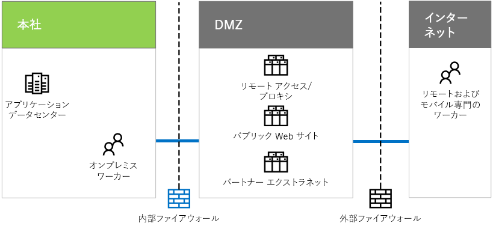

# Contoso 社の IT インフラストラクチャおよびニーズ

 **概要:** Contoso 社のオンプレミスの IT インフラストラクチャの基本的な構造について、およびそのビジネス ニーズが Microsoft のクラウド サービスによってどのように満たされるかについて説明します。
  
Contoso 社は、集中管理されたオンプレミスの IT インフラストラクチャから、クラウド包括型の IT インフラストラクチャへと移行中です。後者には、クラウドベースの個人生産性のワークロード、アプリケーション、およびハイブリッド シナリオが組み込まれています。
  
## Contoso 社の既存の IT インフラストラクチャ

Contoso 社では、ほとんど集中管理されたオンプレミスの IT インフラストラクチャを使用しており、アプリケーション データセンターはパリ本社に位置します。
  
**図 1:Contoso 社の既存の IT インフラストラクチャ**

  
図 1 は、本社とアプリケーション データセンター、DMZ、およびインターネットを示しています。
  
Contoso 社の DMZ では、サーバーのさまざまなセットが次のことを実現します。
  
- パリ本社のワーカーのための Contoso 社イントラネットおよび Web プロキシへのリモート アクセス。
    
- 顧客が製品、部品、および備品を発注できる Contoso 社のパブリック Web サイトのホスティング。
    
- パートナーの通信およびコラボレーションのための Contoso 社のパートナー エクストラネットのホスティング。
    
## Contoso 社のビジネス ニーズ

Contoso 社のビジネス ニーズの優先順位を以下に示します。
  
1. 地域の規制要件に準拠する
    
    罰金を防止し、地方自治体と良い関係を維持するために、Contoso 社はデータ ストレージおよび暗号化の規制に準拠していることを確認する必要があります。
    
2. ベンダーおよびパートナー管理を向上させる
    
    パートナー エクストラネットは古くなってきており、維持するには高額な費用がかかります。Contoso 社では、フェデレーション認証を使用するクラウドベースのソリューションに切り替えることを望んでいます。
    
3. モバイル要員の生産性、デバイス管理、およびアクセスを向上させる
    
    Contoso 社のモバイル専門の要員は拡大しており、知的財産の保護とリソースへの効率的なアクセスを確保するためにデバイス管理を必要としています。
    
4. リモート アクセス インフラストラクチャを縮小する
    
    リモート ワーカーによってよくアクセスされるリソースをクラウドに移動することで、Contoso 社は、リモート アクセス ソリューションの保守とサポートのコストを抑えて費用を削減します。
    
5. オンプレミス データセンターをスケールダウンする
    
    Contoso 社のデータセンターには数百のサーバーが含まれ、その一部はレガシ機能またはアーカイブ機能を実行しており、IT スタッフがビジネス価値の高いワークロードを維持する上で妨げとなっています。
    
6. 四半期末の処理のためにコンピューティングおよびストレージ リソースをスケールアップする
    
    四半期末の財務会計、予測処理、および在庫管理では、サーバーおよびストレージを短期的に増大することが必要です。
    
## Contoso 社のビジネス ニーズを Microsoft のクラウド製品にマッピングする

Microsoft のクラウド サービスの分析に基づき、Contoso 社の IT 部門は次のマッピングを決定しました。
  
|**サービスとしてのソフトウェア (SaaS)**|**サービスとしてのプラットフォーム (Azure PaaS )**|**サービスとしてのインフラストラクチャ (Azure IaaS )**|
|:-----|:-----|:-----|
|**Office 365:** クラウド内の主要な、個人およびグループ生産性のアプリケーション。   ビジネス ニーズ:1 3 5    |クラウドベースのアプリを使用して、販売のホストおよびドキュメントと情報システムのサポートを行います。    ビジネス ニーズ:3    |アーカイブ システムおよびレガシ システムをクラウドベースのサーバーに移動します。    ビジネス ニーズ:5    |
|**Dynamics 365:** クラウド ベースの顧客およびベンダーの管理を使用します。DMZ からパートナー エクストラネットを削除します。   ビジネス ニーズ:2    |モバイル アプリケーションはクラウドベースであり、パリのデータセンターベースではありません。    ビジネス ニーズ:3 4    |使用頻度の低いアプリおよびデータをオンプレミス データセンターから移行します。    ビジネス ニーズ:5    |
|**Intune/EMS:** iOS および Android デバイスを管理します。   ビジネス ニーズ:3    ||四半期末の処理のニーズに合わせて一時的なサーバーおよびストレージを追加します。    ビジネス ニーズ:6    |
   
## See Also

#### 

[Microsoft Cloud の Contoso](contoso-in-the-microsoft-cloud.md)
  
[Microsoft クラウド IT アーキテクチャのリソース](microsoft-cloud-it-architecture-resources.md)
#### 

[Microsoft の Enterprise Cloud ロードマップ: IT の意思決定者向けのリソース](https://sway.com/FJ2xsyWtkJc2taRD)

