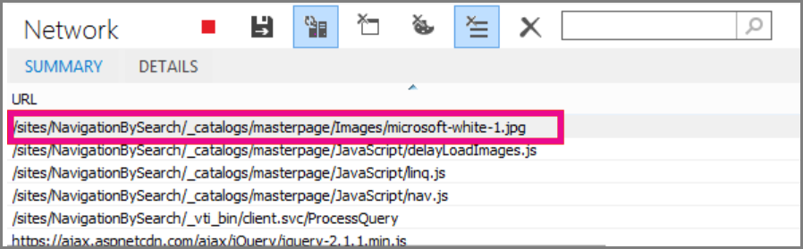

# <a name="delay-loading-images-and-javascript-in-sharepoint-online"></a>SharePoint Online での画像の読み込み遅延と JavaScript

この資料では、イメージの読み込みを遅延するのには JavaScript を使用してページの読み込みの後までの不要な JavaScript を読み込まないようにする、SharePoint Online のページの読み込み時間を小さく方法について説明します。 
  
画像は、SharePoint Online のページの読み込み速度に悪影響を与えることがあります。既定では、最新のインターネット ブラウザーは、HTML ページの読み込み時に画像をプリフェッチします。これにより、ユーザーが下にスクロールするまで画像が画面に表示されない場合、ページ読み込みに不必要に時間がかかることがあります。画像は、ブラウザーによるページの表示部分の読み込みを妨げる可能性があります。この問題を解決するには、JavaScript を使用して、画像を最初に読み込むことを省略します。また、重要でない JavaScript を読み込んだ場合も、SharePoint ページの読み込み時間が長くなることがあります。このトピックでは、SharePoint Online で JavaScript を使ってページの読み込み時間を短縮するいくつかの方法について説明します。 
  
## <a name="improve-page-load-times-by-delaying-image-loading-in-sharepoint-online-pages-by-using-javascript"></a>JavaScript を使用して SharePoint Online のページで画像の読み込みを遅らせてページの読み込み時間を短縮する

フェッチ済みの画像から web ブラウザーをしないようにするのには、JavaScript を使用できます。これは、全体のドキュメントのレンダリングが速くなります。Src 属性の値を削除するには、 \タグを付けるし、次のように、データ属性内のファイルへのパスに置き換えます。 データ ソースです。例えば：
  
```

```

このメソッドを使用すると、ブラウザーはすぐに画像をダウンロードしません。イメージがビューポート内に既に場合は、JavaScript はデータの属性から URL を取得し、src 属性の値として挿入するようブラウザーに指示します。イメージをユーザーがスクロールのみ読み込むし、表示になります。
  
すべてこれの発生、する必要があります JavaScript を使用します。
  
テキスト ファイルに **isElementInViewport()** 関数を定義し、要素がブラウザーのユーザーに表示される部分にあるかどうかを確認します。 
  
```
function isElementInViewport(el) {
  if (!el)
    return false;
  var rect = el.getBoundingClientRect();
  return (
    rect.top >= 0 &amp;&amp;
    rect.left >= 0 &amp;&amp;
    rect.bottom <= (window.innerHeight || document.documentElement.clientHeight) &amp;&amp;
    rect.right <= (window.innerWidth || document.documentElement.clientWidth) 
  );
}

```

続いて、**loadItemsInView()** 関数で **isElementInViewport()** を使用します。**LoadItemsInView()** 関数は、画像がブラウザーのユーザーに表示される部分にある場合、data-src 属性の値を持つ画像をすべて読み込みます。テキスト ファイルに次の関数を追加します。 
  
```
function loadItemsInView() {
  //Select elements by the row id.
  $("#row [data-src]").each(function () {
      var isVisible = isElementInViewport(this);
      if (isVisible) {
          if ($(this).attr("src") == undefined) {
              $(this).attr("src", $(this).data("src"));
          }
      }
  });
}
```

最後に、次の例に示すように、**loadItemsInView()** を **window.onscroll()** 内から呼び出します。これにより、ビューポートにあるすべての画像が、ユーザーが必要なときに読み込まれますが、事前に読み込まれることはありません。テキスト ファイルに以下を追加します。 
  
```
//Example of calling loadItemsInView() from within window.onscroll()
$(window).on("scroll", function () {
    loadItemsInView();
});

```

SharePoint online では、スクロール イベント #s4 のワークスペース上に次の関数をアタッチする必要があります\<div\>タグです。ウィンドウ イベントは、リボンは、ページの上部に接続されていることを確認するためにオーバーライドされるためです。
  
```
//Keep the ribbon at the top of the page
$('#s4-workspace').on("scroll", function () {
    loadItemsInView();
});
```

テキスト ファイルに拡張子 .js を付けて JavaScript ファイルとして保存します (例: delayLoadImages.js)。
  
DelayLoadImages.js の書き込みが終了したら、SharePoint Online でマスター ページに、ファイルの内容を追加できます。マスター ページのヘッダーにスクリプトのリンクを追加するこれを行います。マスター ページが、JavaScript は、そのマスター ページ レイアウトを使用する、SharePoint Online サイト内のすべてのページに適用されます。または、サイトの 1 つのページでのみ使用する場合は、JavaScript をページに埋め込むには、スクリプト エディター Web パーツを使用します。詳細については、これらのトピックを参照してください。
  
- [方法: SharePoint 2013 でサイトにマスター ページを適用](https://go.microsoft.com/fwlink/p/?LinkId=525627)
    
- [[方法]: SharePoint 2013 でページ レイアウトを作成する方法](https://go.microsoft.com/fwlink/p/?LinkId=525628)
    
 **例:SharePoint Online でマスター ページから JavaScript の delayLoadImages.js ファイルを参照する**
  
これが機能するためには、マスター ページで jQuery を参照する必要もあります。次の例では、最初のページの読み込みで、1 つの画像のみが読み込まれていますが、このページにはさらに複数の画像があることが分かります。
  

  
次のスクリーン ショットは、スクロール後にダウンロードされ、表示された残りの画像を示しています。
  

  
JavaScript を使用して画像の読み込みを遅らせることは、パフォーマンスの向上に有効な手法ですが、この手法を公開用の Web サイトに適用する場合、検索エンジンは、通常の形式の画像をクロールするように画像をクロールすることはできません。このことは、ページが読み込まれるまで画像自体のメタデータが実際にないため、検索エンジンのランキングに影響を与えます。検索エンジンのクローラーは HTML のみを読み取るため、画像をページのコンテンツとみなしません。画像は、検索結果でページのランキングに使用される要素の 1 つです。この問題を回避する方法の 1 つは、画像に導入部のテキストを使用することです。
  
## <a name="github-code-sample-injecting-javascript-to-improve-performance"></a>GitHub コードのサンプル:JavaScript を挿入してパフォーマンスを向上

GitHub 上で提供される[JavaScript インジェクション](https://go.microsoft.com/fwlink/p/?LinkId=524759)の資料とコード サンプルをお見逃しなきます。 
  
## <a name="see-also"></a>関連項目

[Office 2013 および Office 365 用リソースでサポートされているブラウザー](https://support.office.com/article/57342811-0dc4-4316-b773-20082ced8a82)
  
[方法: SharePoint 2013 でサイトにマスター ページを適用](https://go.microsoft.com/fwlink/p/?LinkId=525627)
  
[[方法]: SharePoint 2013 でページ レイアウトを作成する方法](https://go.microsoft.com/fwlink/p/?LinkId=525628)

