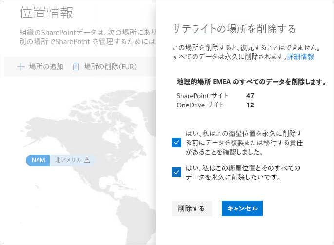

# Office 365 Multi-Geo でサテライトの場所を削除するDelete a satellite location in Office 365 Multi-Geo

サテライトの場所が不要になった場合は、SharePoint 管理センターのテナントから削除できます。If you no longer need a satellite location, you can delete it from your tenant from the SharePoint admin center.

> [!WARNING]
> すべてのサテライトの場所のユーザー データは永久に削除されます。All user data in the satellite location will be permanently deleted. これには、OneDrive for Business のすべてのコンテンツ、SharePoint サイト、および Office 365 グループ メール ボックスを含む Exchangeメール ボックスが含まれます。This includes all OneDrive for Business content, SharePoint sites and Exchange mailboxes including Office 365 Group mailboxes. サテライトの場所を削除する前に、データを別のサテライトの場所または集中管理する場所に移行する必要があります。You must migrate any data to another satellite location or the central location before you delete the satellite location. この操作は元に戻せません。This action cannot be undone.

サテライトの場所はグローバル管理者のみが削除できます。Only global administrators can delete satellite locations.

サテライトの場所を削除するにはTo delete a satellite location

1. SharePoint 管理センターを開きます。Open the SharePoint admin center

2. **[地理的位置]** タブを開きます。Navigate to the **Geo locations** tab.

3. マップ上で削除する地理的位置をクリックします。On the map, click the geo location that you want to delete.

4. **[場所の削除]** をクリックします。Click **Delete location**.

5. 確認のチェック ボックスをオンにして、削除を確認します。Confirm the deletion by selecting the confirmation check boxes.

6. **[削除]** をクリックします。Click **Delete**.
