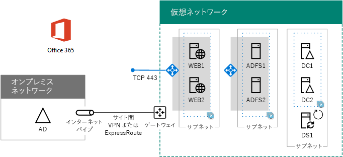

# Azure に Office 365 の高可用性フェデレーション認証を展開するDeploy high availability federated authentication for Office 365 in Azure

 **概要:**Microsoft Azure で Office 365 サブスクリプションの高可用性フェデレーション認証を構成します。**Summary:** Configure high availability federated authentication for your Office 365 subscription in Microsoft Azure.
  
この記事には、次に示す仮想マシンを装備した Azure インフラストラクチャ サービスに Microsoft Office 365 の高可用性フェデレーション認証を展開するための詳細な手順へのリンクが含まれています。This article contains links to the step-by-step instructions for deploying high availability federated authentication for Microsoft Office 365 in Azure infrastructure services with these virtual machines:
  
- 2 つの Web アプリケーション プロキシ サーバーTwo web application proxy servers
    
- 2 つの Active Directory フェデレーション サービス (AD FS) サーバーTwo Active Directory Federation Services (AD FS) servers
    
- 2 つのレプリカ ドメイン コントローラーTwo replica domain controllers
    
- Azure AD Connect を実行する 1 つのディレクトリ同期 (DirSync) サーバーOne directory synchronization (DirSync) server running Azure AD Connect
    
各サーバーのプレースホルダー名を使用した構成がこちらです。Here is the configuration, with placeholder names for each server.
  
**Azure での Office 365 インフラストラクチャの高可用性フェデレーション認証****A high availability federated authentication for Office 365 infrastructure in Azure**

  
すべての仮想マシンが単一のクロスプレミス Azure 仮想ネットワーク (VNet) に入っています。All of the virtual machines are in a single cross-premises Azure virtual network (VNet). 
  
> [!NOTE]
> 個々のユーザーのフェデレーション認証は、オンプレミスのリソースには依存しません。ただし、クロスプレミス接続が使用できなくなると、Windows Server AD で加えられたユーザー アカウントとグループに対する更新が VNet 内のドメイン コントローラーで受信されなくなります。これを回避するために、クロスプレミス接続で高可用性を構成できます。詳細については、「[高可用性のクロスプレミス接続および VNet 間接続](https://docs.microsoft.com/azure/vpn-gateway/vpn-gateway-highlyavailable)」を参照してください。Federated authentication of individual users does not rely on any on-premises resources. However, if the cross-premises connection becomes unavailable, the domain controllers in the VNet will not receive updates to user accounts and groups made in the on-premises Windows Server AD. To ensure this does not happen, you can configure high availability for your cross-premises connection. For more information, see [Highly Available Cross-Premises and VNet-to-VNet Connectivity](https://docs.microsoft.com/azure/vpn-gateway/vpn-gateway-highlyavailable)
  
特定の役割を持つ仮想マシンの各ペアが独自のサブネットと可用性セットに入っています。Each pair of virtual machines for a specific role is in its own subnet and availability set.
  
> [!NOTE]
> この VNet はオンプレミスのネットワークに接続されているため、この構成に管理サブネット上の jumpbox や仮想マシンの監視は含まれません。詳細については、「[N 層のアーキテクチャで Windows VM を実行する](https://docs.microsoft.com/azure/guidance/guidance-compute-n-tier-vm)」を参照してください。Because this VNet is connected to the on-premises network, this configuration does not include jumpbox or monitoring virtual machines on a management subnet. For more information, see [Running Windows VMs for an N-tier architecture](https://docs.microsoft.com/azure/guidance/guidance-compute-n-tier-vm). 
  
この構成の結果として、すべての Office 365 ユーザーがフェデレーション認証を使用できるようになります。この認証では、Office 365 アカウントではなく、Windows Server Active Directory の資格情報を使用してサインインすることができます。フェデレーション認証インフラストラクチャでは、オンプレミスの境界ネットワークよりも Azure インフラストラクチャ サービスでより簡単に展開できるサーバーの冗長セットが使用されます。The result of this configuration is that you will have federated authentication for all of your Office 365 users, in which they can use their Windows Server Active Directory credentials to sign in rather than their Office 365 account. The federated authentication infrastructure uses a redundant set of servers that are more easily deployed in Azure infrastructure services, rather than in your on-premises edge network.
  
## 部品表Bill of materials

このベースライン構成には、Azure のサービスおよびコンポーネントの次のセットが必要です。This baseline configuration requires the following set of Azure services and components:
  
- 7 つの仮想マシンSeven virtual machines
    
- 4 つのサブネットを持つ 1 つのクロスプレミス仮想ネットワークOne cross-premises virtual network with four subnets
    
- 7 つのストレージ アカウントFour resource groups
    
- 4 つのリソース グループThree availability sets
    
- 3 つの可用性セットOne Azure subscription
    
仮想マシンと、この構成用の既定サイズを次に示します。Here are the virtual machines and their default sizes for this configuration.
  
|**項目****Item**|**仮想マシンの説明****Virtual machine description**|**Azure ギャラリー イメージ****Azure gallery image**|**既定のサイズ****Default size**|
|:-----|:-----|:-----|:-----|
|1.1.    |1 つ目のドメイン コントローラーFirst domain controller    |Windows Server 2016 DatacenterWindows Server 2016 Datacenter    |D2D2    |
|2.2.    |2 つ目のドメイン コントローラーSecond domain controller    |Windows Server 2016 DatacenterWindows Server 2016 Datacenter    |D2D2    |
|3.3.    |Azure AD Connect サーバーAzure AD Connect server    |Windows Server 2016 DatacenterWindows Server 2016 Datacenter    |D2D2    |
|4.4.    |1 つ目の AD FS サーバーFirst AD FS server    |Windows Server 2016 DatacenterWindows Server 2016 Datacenter    |D2D2    |
|5.5.    |2 つ目の AD FS サーバーSecond AD FS server    |Windows Server 2016 DatacenterWindows Server 2016 Datacenter    |D2D2    |
|6.6.    |1 つ目の Web アプリケーション プロキシ サーバーFirst web application proxy server    |Windows Server 2016 DatacenterWindows Server 2016 Datacenter    |D2D2    |
|7.7.    |2 つ目の Web アプリケーション プロキシ サーバーSecond web application proxy server    |Windows Server 2016 DatacenterWindows Server 2016 Datacenter    |D2D2    |
   
この構成の見積もりコストを計算するには、「[料金計算ツール](https://azure.microsoft.com/pricing/calculator/)」を参照してくださいTo compute the estimated costs for this configuration, see the [Azure pricing calculator](https://azure.microsoft.com/pricing/calculator/)
  
## 展開のフェーズPhases of deployment

次のフェーズでは、このワークロードを展開します。You deploy this workload in the following phases:
  
<<<<<<< ヘッド<<<<<<< HEAD
- [高可用性の統合認証フェーズ 1: 構成の Azure](high-availability-federated-authentication-phase-1-configure-azure.md)。リソース グループ、ストレージ アカウント、可用性の設定、および設置型の間の仮想ネットワークを作成します。[High availability federated authentication Phase 1: Configure Azure](high-availability-federated-authentication-phase-1-configure-azure.md). Create resource groups, storage accounts, availability sets, and a cross-premises virtual network.
    
- [高可用性の統合認証フェーズ 2: ドメイン コント ローラーを構成する](high-availability-federated-authentication-phase-2-configure-domain-controllers.md)です。作成し、Windows サーバー ・ Active Directory (AD) ドメイン コント ローラーのレプリカと、ディレクトリ同期サーバーを構成します。[High availability federated authentication Phase 2: Configure domain controllers](high-availability-federated-authentication-phase-2-configure-domain-controllers.md). Create and configure replica Windows Server Active Directory (AD) domain controllers and the DirSync server.
    
- [高可用性の統合認証フェーズ 3: AD FS サーバーを構成する](high-availability-federated-authentication-phase-3-configure-ad-fs-servers.md)です。作成し、2 つの AD FS サーバーを構成します。[High availability federated authentication Phase 3: Configure AD FS servers](high-availability-federated-authentication-phase-3-configure-ad-fs-servers.md). Create and configure the two AD FS servers.
    
- [高可用性の統合認証フェーズ 4: web アプリケーションのプロキシを構成する](high-availability-federated-authentication-phase-4-configure-web-application-pro.md)です。作成し、2 つの web アプリケーションのプロキシ サーバーを構成します。[High availability federated authentication Phase 4: Configure web application proxies](high-availability-federated-authentication-phase-4-configure-web-application-pro.md). Create and configure the two web application proxy servers.
    
- [高可用性の統合認証フェーズ 5: Office 365 のフェデレーション認証を構成する](high-availability-federated-authentication-phase-5-configure-federated-authentic.md)です。Office 365 サブスクリプションのフェデレーション認証を構成します。=======[High availability federated authentication Phase 5: Configure federated authentication for Office 365](high-availability-federated-authentication-phase-5-configure-federated-authentic.md). Configure federated authentication for your Office 365 subscription. =======
- [高可用性の統合認証フェーズ 1: Azure の構成](high-availability-federated-authentication-phase-1-configure-azure.md)-リソース グループ、ストレージ アカウント、可用性の設定、および設置型の間の仮想ネットワークを作成します。[High availability federated authentication Phase 1: Configure Azure](high-availability-federated-authentication-phase-1-configure-azure.md) - Create resource groups, storage accounts, availability sets, and a cross-premises virtual network.
    
- [高可用性の統合認証フェーズ 2: ドメイン コント ローラーを構成する](high-availability-federated-authentication-phase-2-configure-domain-controllers.md)- を作成し、Windows サーバー ・ Active Directory (AD) ドメイン コント ローラーのレプリカと、ディレクトリ同期サーバーを構成します。[High availability federated authentication Phase 2: Configure domain controllers](high-availability-federated-authentication-phase-2-configure-domain-controllers.md) - Create and configure replica Windows Server Active Directory (AD) domain controllers and the DirSync server.
    
- [高可用性の統合認証フェーズ 3: AD FS サーバーを構成する](high-availability-federated-authentication-phase-3-configure-ad-fs-servers.md)- を作成し、2 つの AD FS サーバーを構成します。[High availability federated authentication Phase 3: Configure AD FS servers](high-availability-federated-authentication-phase-3-configure-ad-fs-servers.md) - Create and configure the two AD FS servers.
    
- [高可用性の統合認証フェーズ 4: web アプリケーションのプロキシを構成する](high-availability-federated-authentication-phase-4-configure-web-application-pro.md)- を作成し、2 つの web アプリケーションのプロキシ サーバーを構成します。[High availability federated authentication Phase 4: Configure web application proxies](high-availability-federated-authentication-phase-4-configure-web-application-pro.md) - Create and configure the two web application proxy servers.
    
- [高可用性の統合認証フェーズ 5: Office 365 のフェデレーション認証を構成する](high-availability-federated-authentication-phase-5-configure-federated-authentic.md)-Office 365 サブスクリプションのフェデレーション認証を構成します。[High availability federated authentication Phase 5: Configure federated authentication for Office 365](high-availability-federated-authentication-phase-5-configure-federated-authentic.md) - Configure federated authentication for your Office 365 subscription.
>>>>>>> mastermaster
    
この記事では、定義済みのアーキテクチャを使用して、Azure インフラストラクチャ サービスに Office 365 の機能的な高可用性フェデレーション認証を作成するためのフェーズごとの規範となるガイドを提供します。以下の点にご注意ください。These articles provide a prescriptive, phase-by-phase guide for a predefined architecture to create a functional, high availability federated authentication for Office 365 in Azure infrastructure services. Keep the following in mind:
  
- 経験豊富な AD FS の実行者である場合、フェーズ 3 と 4 の手順を自由に適応させて、自分のニーズに最適なサーバーのセットを構築できます。If you are an experienced AD FS implementer, feel free to adapt the instructions in phases 3 and 4 and build the set of servers that best suits your needs.
    
- 既存のクロスプレミスの仮想ネットワークを使用した既存の Azure ハイブリッド クラウド展開がある場合は、フェーズ 1 と 2 の手順を自由に適応させるかスキップして、AD FS と Web アプリケーション プロキシ サーバーを適切なサブネットに配置できます。If you already have an existing Azure hybrid cloud deployment with an existing cross-premises virtual network, feel free to adapt or skip the instructions in phases 1 and 2 and place the AD FS and web application proxy servers on the appropriate subnets.
    
開発/テスト環境、またはこの構成の概念実証を構築するには、「[Office 365 開発/テスト環境のフェデレーション ID](federated-identity-for-your-office-365-dev-test-environment.md)」を参照してください。To build a dev/test environment or a proof-of-concept of this configuration, see [Federated identity for your Office 365 dev/test environment](federated-identity-for-your-office-365-dev-test-environment.md).
  
## 次の手順Next step

このワークロードの構成を「[高可用性フェデレーション認証のフェーズ 1:Azure を構成する](high-availability-federated-authentication-phase-1-configure-azure.md)」から開始します。Start the configuration of this workload with [High availability federated authentication Phase 1: Configure Azure](high-availability-federated-authentication-phase-1-configure-azure.md). 
  
> [!TIP]
> Office 365 の高可用性フェデレーション認証を Azure に素早く展開するためのファイル セットについては、「[Azure への Office 365 のフェデレーション認証の展開キット](https://gallery.technet.microsoft.com/Federated-Authentication-8a9f1664)」を参照してください。For a set of files to more quickly deploy your high availability federated authentication for Office 365 in Azure, see the [Federated Authentication for Office 365 in Azure Deployment Kit](https://gallery.technet.microsoft.com/Federated-Authentication-8a9f1664). 
  
## See AlsoSee Also

[Office 365 開発/テスト環境のフェデレーション IDFederated identity for your Office 365 dev/test environment](federated-identity-for-your-office-365-dev-test-environment.md)
  
[クラウド導入およびハイブリッド ソリューションCloud adoption and hybrid solutions](cloud-adoption-and-hybrid-solutions.md)

[Office 365 のフェデレーション IDFederated identity for Office 365](https://support.office.com/article/Understanding-Office-365-identity-and-Azure-Active-Directory-06a189e7-5ec6-4af2-94bf-a22ea225a7a9#bk_federated)

