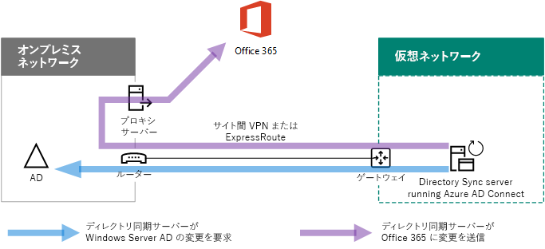
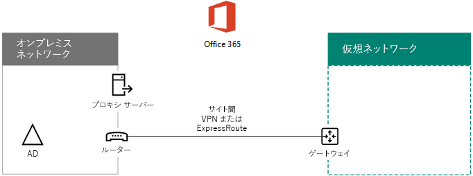
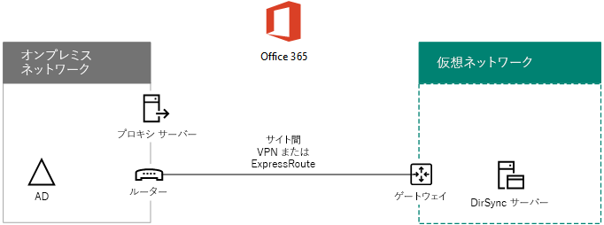
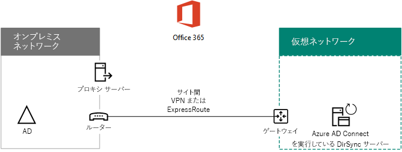

# Microsoft Azure での Office 365 ディレクトリ同期の展開

 **概要:** Azure インフラストラクチャ サービスの仮想マシン上に Azure AD Connect をデプロイし、オンプレミス ディレクトリと Office 365 サブスクリプションの Azure AD テナントとの間でアカウントを同期します。
  
Azure Active Directory (AD) Connect (以前は、ディレクトリ同期ツール、Directory Sync ツール、DirSync.exe ツールなどと呼ばれていました) は、ドメインに参加しているサーバーにインストールして、オンプレミスの Active Directory Domain Services (AD DS) ユーザーを Office 365 サブスクリプションの Azure AD テナントに同期するアプリケーションです。Office 365 では、ディレクトリ サービスに Azure Active Directory (Azure AD) を使用しています。Office 365 サブスクリプションには、Azure AD テナントが含まれています。このテナントは、他の SaaS アプリケーションや Azure のアプリなど、別のクラウド ワークロードで組織の ID を管理するためにも使用できます。

Azure AD Connect はオンプレミス サーバーにインストールできますが、次の理由により、Azure の仮想マシンにもインストールできます。
  
- クラウド ベースのサーバーをより迅速にプロビジョニングして構成でき、ユーザーがすぐにサービスを利用できるようになります。
- Azure では、より少ない労力でより良いサイト可用性が得られます。
- 組織内のオンプレミス サーバーの数を削減できます。

このソリューションには、オンプレミス ネットワークと Azure Virtual Network 間の接続が必要です。詳しくは、「[オンプレミス ネットワークを Microsoft Azure 仮想ネットワークに接続する](connect-an-on-premises-network-to-a-microsoft-azure-virtual-network.md)」をご覧ください。 
  
> [!NOTE]
> この記事では、1 つのフォレスト内の単一ドメインの同期について説明します。Azure AD Connect は、Active Directory フォレスト内のすべての AD DS ドメインを Office 365 と同期します。複数の Active Directory フォレストを Office 365 と同期する場合には、「[シングル サインオン シナリオでの Multi-forest ディレクトリ同期](https://go.microsoft.com/fwlink/p/?LinkId=393091)」をご覧ください。 
  
## Azure における Office 365 ディレクトリ同期のデプロイに関する概要

次の図は、オンプレミスの AD DS フォレストを Office 365 サブスクリプションに同期する Azure AD Connect を示したものです。Azure AD Connect は Azure (ディレクトリ同期サーバー) の仮想マシンで実行されています。
  

  
この図には、サイト間 VPN または ExpressRoute 接続で接続されている 2 つのネットワークがあります。具体的には、AD DS ドメイン コントローラーが配置されているオンプレミス ネットワークと、ディレクトリ同期サーバーとして [Azure AD Connect](https://www.microsoft.com/download/details.aspx?id=47594) を実行している仮想マシンが含まれる Azure 仮想ネットワークの 2 つです。ディレクトリ同期サーバーを発信元とする主要なトラフィック フローは 2 つあります。
  
-  Azure AD Connect は、アカウントとパスワードの変更に関してオンプレミス ネットワーク上のドメイン コントローラーにクエリを実行します。
-  Azure AD Connect は、アカウントとパスワードの変更を Office 365 サブスクリプションの Azure AD インスタンスに送信します。ディレクトリ同期サーバーはオンプレミス ネットワークの拡張部分であるため、これらの変更はオンプレミス ネットワークのプロキシ サーバーを経由して送信されます。
    
> [!NOTE]
> このソリューションでは、1 つの Active Directory フォレスト内の単一 Active Directory ドメインの同期について説明します。Azure AD Connect は、Active Directory フォレスト内のすべての Active Directory ドメインを Office 365 と同期します。複数の Active Directory フォレストを Office 365 と同期する場合には、「[シングル サインオン シナリオでの Multi-forest ディレクトリ同期](https://go.microsoft.com/fwlink/p/?LinkId=393091)」をご覧ください。 
  
このソリューションをデプロイする場合には、次の 2 つの主要な手順があります。
  
1. Azure Virtual Network を作成し、オンプレミスネットワークに対するサイト間 VPN 接続を確立します。詳しくは、「[オンプレミス ネットワークを Microsoft Azure 仮想ネットワークに接続する](connect-an-on-premises-network-to-a-microsoft-azure-virtual-network.md)」をご覧ください。
    
2. [Azure AD Connect ](https://www.microsoft.com/download/details.aspx?id=47594) を Azure のドメインに参加している仮想マシン上にインストールし、オンプレミス AD DS を Office 365 に同期します。これには以下の手順を実行します。
    
    Azure AD Connect を実行するため、Azure Virtual Machine を作成します。
    
    [Azure AD Connect ](https://www.microsoft.com/download/details.aspx?id=47594) をインストールし、設定します。
    
    Azure AD Connect の設定には、Azure AD 管理者アカウントの資格情報 (ユーザー名とパスワード) と、AD DS エンタープライズ管理者アカウントが必要です。Azure AD Connect ツールはすぐに実行され、オンプレミスの AD DS フォレストを Office 365 に継続的に同期します。
    
運用環境でこのソリューションをデプロイする前に、「[Office 365 開発/テスト環境のディレクトリ同期](dirsync-for-your-office-365-dev-test-environment.md)」の手順に従って、概念実証、デモンストレーション、実験用にこの構成を設定することができます。
  
> [!IMPORTANT]
> Azure AD Connect の設定が完了しても、AD DS エンタープライズ管理者アカウントの資格情報は保存されません。 
  
> [!NOTE]
> このソリューションは、1 つの AD DS フォレストを Office 365 と同期する方法について説明しています。この記事で取り上げられているトポロジは、このソリューションを実装する 1 つの方法に過ぎません。組織のトポロジは、固有のネットワーク要件とセキュリティに関する考慮事項によって異なる可能性があります。 
  
## Azure の Office 365 向けにディレクトリ同期サーバーをホストするための計画

### 前提条件

開始する前に、このソリューションの以下の前提条件を確認してください。
  
- 「[Azure 仮想ネットワークの計画](connect-an-on-premises-network-to-a-microsoft-azure-virtual-network.md#plan-your-azure-virtual-network)」に記されている関連する計画内容を確認します。
    
- Azure Virtual Network を構成するためのすべての「[前提条件](connect-an-on-premises-network-to-a-microsoft-azure-virtual-network.md#prerequisites)」を満たしていることを確かめます。
    
- Active Directory 統合機能が含まれている Office 365 サブスクリプションがあることを確認します。Office 365 サブスクリプションについて詳しくは、「[Office 365 サブスクリプションのページ](https://products.office.com/compare-all-microsoft-office-products?tab=2)」をご覧ください。
    
- Azure AD Connect を実行する 1 つの Azure Virtual Machine をプロビジョニングし、オンプレミスの AD DS フォレストを Office 365 と同期します。
    
    AD DS エンタープライズ管理者アカウントと Azure AD 管理者アカウントの資格情報 (名前とパスワード) が必要です。
    
### ソリューション アーキテクチャ設計の前提条件

次の一覧では、このソリューションで採用された設計方針について説明します。
  
- このソリューションでは、サイト間 VPN 接続を伴う 1 つの Azure Virtual Network を使用します。Azure Virtual Network は 1 つのサブネットをホストし、このサブネットには Azure AD Connect を実行する 1 つのディレクトリ同期サーバーが含まれます。 
    
- オンプレミス ネットワークには、ドメイン コントローラーと DNS サーバーが存在します。
    
- Azure AD Connect は、シングル サインオンではなくパスワード ハッシュ同期を実行します (Active Directory フェデレーション サービス (AD FS) インフラストラクチャを展開する必要はありません)。パスワード ハッシュ同期とシングル サインオンのオプションの詳細については、「[Azure Active Directory ハイブリッド ID ソリューションの適切な認証方法の選択](https://aka.ms/auth-options)」を参照してください。
    
ご使用の環境でこのソリューションを展開する場合に考慮できるその他の設計に関する選択内容があります。それらには以下が含まれます。
  
- 既存の Azure Virtual Network 内に既存の DNS サーバーがある場合、オンプレミス ネットワークの DNS サーバーではなく、それらをディレクトリ同期サーバーで使用して名前解決を行うかどうかを決定します。
    
- 既存の Azure Virtual Network にドメイン コントローラーがある場合、Active Directory サイトとサービスを構成するという方法がより有効な選択肢となるかどうかを判別します。ディレクトリ同期サーバーはアカウントとパスワードの変更内容を調べるために、オンプレミス ネットワークのドメイン コントローラーではなく、Azure Virtual Network 内のドメイン コントローラーをクエリできます。
    
## 展開のロードマップ

Azure の仮想マシンへの Azure AD Connect の展開には、3つのフェーズがあります。
  
- フェーズ 1:Azure 仮想ネットワークを作成および構成する
    
- フェーズ 2:Azure 仮想マシンを作成および構成する
    
- フェーズ 3: Azure AD Connect をインストールして構成する
    
デプロイ後、Office 365 の新しいユーザー アカウントに場所とライセンスを割り当てる必要があります。

### フェーズ 1: Azure Virtual Network を作成および構成する

Azure 仮想ネットワークを作成および構成するには、「[オンプレミス ネットワークを Microsoft Azure 仮想ネットワークに接続する](connect-an-on-premises-network-to-a-microsoft-azure-virtual-network.md)」の展開ロードマップにある「[フェーズ 1: オンプレミス ネットワークの準備](connect-an-on-premises-network-to-a-microsoft-azure-virtual-network.md#phase-1-prepare-your-on-premises-network)」および「[フェーズ 2: Azure でのクロスプレミスの仮想ネットワークの作成](connect-an-on-premises-network-to-a-microsoft-azure-virtual-network.md#phase-2-create-the-cross-premises-virtual-network-in-azure)」を完了してください。
  
以下が最終的な構成です。
  

  
この図は、サイト間 VPN や ExpressRoute 接続を介してAzure 仮想ネットワークに接続しているオンプレミスネットワークを示しています。
  
### フェーズ 2:Azure 仮想マシンを作成および構成する

「[Azure ポータルで最初の Windows 仮想マシンを作成する](https://go.microsoft.com/fwlink/p/?LinkId=393098)」の説明に従い、Azure に仮想マシンを作成します。以下の設定を使用します。
  
- **[基本]** ウィンドウで、仮想ネットワークと同じサブスクリプション、場所およびリソース グループを選択します。ユーザー名とパスワードを安全な場所に記録します。後ほど、仮想マシンに接続するときに必要になります。
    
- **[サイズの選択]** ウィンドウで、 **A2 標準** サイズを選択します。
    
- **[設定]** ウィンドウの **[ストレージ]** セクションで、**[標準]** ストレージ タイプを選択します。**[ネットワーク]** セクションで、(ゲートウェイ サブネットではなく) ディレクトリ同期サーバーをホストするための仮想ネットワークの名前とサブネットを選択します。他のすべての設定は、既定値のままにします。
    
内部 DNS をチェックして、ディレクトリ同期サーバーが DNS を正しく使用していることを検証し、仮想マシンに IP アドレスのアドレス (A) レコードが追加されたことを確認します。 
  
「[仮想マシンへの接続とサインオン](https://docs.microsoft.com/azure/virtual-machines/windows/connect-logon)」の説明を参照してリモートデスクトップ接続でディレクトリ同期サーバーに接続します。サインイン後、仮想マシンをオンプレミス AD DS ドメインに参加させます。
  
Azure AD Connect がインターネット リソースにアクセスできるようにするには、オンプレミス ネットワークのプロキシ サーバーを使用するようディレクトリ同期サーバーを構成する必要があります。実行する追加の構成手順は、ネットワーク管理者に問い合わせてください。
  
以下が最終的な構成です。
  

  
この図に、クロスプレミス Azure 仮想ネットワーク内のディレクトリ同期サーバーとしての仮想マシンを示します。
  
### フェーズ 3: Azure AD Connect をインストールして構成する

次の手順を実行します。
  
1. ローカル管理者権限を持つ AD DS ドメイン アカウントを使用して、リモート デスクトップ接続でディレクトリ同期サーバーに接続します。「[仮想マシンへの接続とサインオン](https://docs.microsoft.com/azure/virtual-machines/windows/connect-logon)」を参照してください。
    
2. パスワード ハッシュ同期を使用したディレクトリ同期を行うには、ディレクトリ同期サーバーから「[Office 365 のディレクトリ同期をセットアップする](set-up-directory-synchronization.md)」という記事を開き、指示に従います。
    
> [!CAUTION]
> セットアップによって、ローカル ユーザー組織単位 (OU) 内に **AAD_xxxxxxxxxxxx** というアカウントが作成されます。このアカウントは移動も削除も行わないでください。移動や削除を行うと、同期が失敗します。
  
以下が最終的な構成です。
  

  
この図に、クロスプレミス Azure 仮想ネットワーク内の Azure AD Connect を使ったディレクトリ同期サーバーを示します。
  
### Office 365 のユーザーに場所とライセンスを割り当てる

Azure AD Connect はオンプレミスの AD DS から Office 365 サブスクリプションにアカウントを追加しますが、ユーザーが Office 365 にサインインしてそのサービスを利用するには、アカウントに場所とライセンスが設定されている必要があります。次の手順で、適切なユーザー アカウントに場所を追加し、ライセンス認証を行います。
  
1. [Office 365 ポータル ページ](https://www.office.com)にサインインして、**[管理者]** をクリックします。
    
2. 左側のナビゲーションで、 **[ユーザー] > [アクティブなユーザー]** をクリックします。
    
3. ユーザーアカウントのリストで、アクティブにするユーザー名の隣にあるチェック ボックスをオンにします。
    
4. ユーザーのページで、**[製品ライセンス]** の **[編集]** をクリックします。
    
5. **[製品ライセンス]** ページの **[場所]** でユーザーの場所を選択し、ユーザーの適切なライセンスを有効にします。
    
6. 完了したら、**[保存]** をクリックし、2 回 **[閉じる]** をクリックします。
    
7. 別のユーザーについては、手順 3 に戻ります。
    
## 関連項目

[クラウド導入およびハイブリッド ソリューション](cloud-adoption-and-hybrid-solutions.md)
  
[オンプレミス ネットワークを Microsoft Azure 仮想ネットワークに接続する](connect-an-on-premises-network-to-a-microsoft-azure-virtual-network.md)

[Azure AD Connect をダウンロードする](https://www.microsoft.com/download/details.aspx?id=47594)
  
[Office 365 のディレクトリ同期のセットアップ](set-up-directory-synchronization.md)
  
