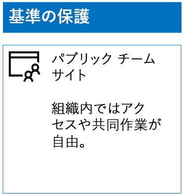
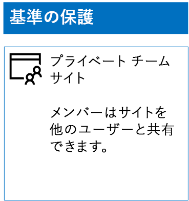
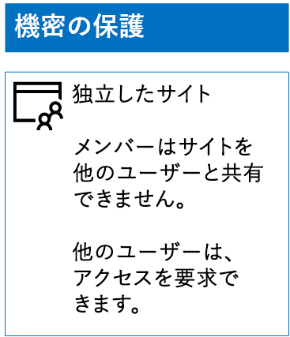
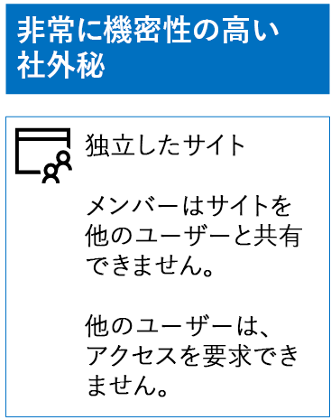

# 保護の 3 つの層を SharePoint Online サイトを展開します。

 **の概要:**作成し、情報保護のさまざまなレベルの SharePoint Online のチーム サイトを構成します。
  
この資料で設計し、ベースライン、機密性の高い、および機密性の高いの SharePoint Online チーム サイトを展開する手順を使用します。これら 3 つの層の保護の詳細については、 [SharePoint のオンラインのセキュリティで保護されたサイトとファイル](secure-sharepoint-online-sites-and-files.md)を参照してください。
  
## ベースライン SharePoint Online チーム サイト

ベースライン保護には、パブリックとプライベートの両方のチーム サイトが含まれます。パブリック チーム サイトは、組織内のだれもが検出およびアクセスできます。プライベート サイトは、チーム サイトと関連付けられた Office 365 グループのメンバーのみが検出とアクセスを行うことができます。これらの種類のチーム サイトでは、メンバーは他のユーザーとサイトを共有することができます。
  
### パブリック

パブリック アクセスとアクセス許可を持つベースライン SharePoint Online チーム サイトを作成するには、次のようにします。
  
1. SharePoint Online チーム サイト (SharePoint Online 管理者) の管理にも使用されるアカウントを使用して Office 365 ポータルにサインインします。ヘルプを表示するには、「[Office 365 にサインインする場所](https://support.office.com/Article/Where-to-sign-in-to-Office-365-e9eb7d51-5430-4929-91ab-6157c5a050b4)」を参照してください。
    
2. タイルのリストで、 **[SharePoint]** をクリックします。
    
3. ブラウザーの新しい **[SharePoint]** タブで、 **[+ サイトの作成]** をクリックします。
    
4. **[サイトの作成]** ページで、 **[チーム サイト]** をクリックします。
    
5. **サイト名**] に、パブリックのチーム サイトの名前を入力します。 
    
6. **チーム サイトの説明**サイトの目的の説明を入力します。
    
7. **[プライバシー設定]** で、 **[パブリック - 組織の全ユーザーがこのサイトにアクセス可能]** を選択して **[次へ]** をクリックします。
    
8. **[誰を追加しますか]** ウィンドウで、 **[完了]** をクリックします。
    
最終的な構成をここに示します。
  

  
### プライベート

プライベート アクセスとアクセス許可を持つベースライン SharePoint Online チーム サイトを作成するには、次のようにします。
  
1. SharePoint Online チーム サイト (SharePoint Online 管理者) の管理にも使用されるアカウントを使用して Office 365 ポータルにサインインします。ヘルプを表示するには、「[Office 365 にサインインする場所](https://support.office.com/Article/Where-to-sign-in-to-Office-365-e9eb7d51-5430-4929-91ab-6157c5a050b4)」を参照してください。
    
2. タイルのリストで、 **[SharePoint]** をクリックします。
    
3. ブラウザーの新しい **[SharePoint]** タブで、 **[+ サイトの作成]** をクリックします。
    
4. **[サイトの作成]** ページで、 **[チーム サイト]** をクリックします。
    
5. [**サイト名**] には、プライベート チーム サイトの名前を入力します。 
    
6. **チーム サイトの説明**では、サイトの目的の説明を入力します。
    
7. **[プライバシー設定]** で、 **[プライベート - メンバーのみがこのサイトにアクセス可能**」を選択して **[次へ]** をクリックします。
    
8. **ユーザーは追加するですか?**ウィンドウの**メンバーの追加**] ボックスで、この秘密のチーム サイトにアクセスできるユーザー アカウントの名前を入力します。
    
9. 終了したら、サイトへのメンバーの初期セットを追加する場合は、**完了**する] をクリックして
    
最終的な構成をここに示します。
  

  
## 機密 SharePoint Online チーム サイト

機密 SharePoint Online チーム サイトは、独立したチーム サイトです。つまり、アクセス許可は、チーム サイトに関連付けられている Office 365 グループのメンバーシップではなく、SharePoint グループのメンバーシップを介して制御されます。
  
独立したチーム サイトを作成するには、2 つの主な手順があります。
  
### 手順 1: 独立したサイトの設計

独立したチーム サイトを設計するには、以下のことを決定する必要があります。
  
- SharePoint グループおよびアクセス許可レベル。
    
- SharePoint グループのメンバーとなるアクセス グループのセット。
    
     アクセス グループの推奨される設定は、サイトのメンバーのいずれかのサイトの閲覧者、サイト管理者のいずれかです。
    
- アクセス グループ内でネストされたグループを使用するかどうか。
    
たとえば、推奨されるグループ構造およびアクセス許可レベルは次のとおりです。
  
|**SharePoint グループ**|**権限レベル**|**アクセス グループ (例)**|
|:-----|:-----|:-----|
|[サイト名]メンバー    |編集    |[サイト名]メンバー    |
|[サイト名]訪問者    |読み取り    |[サイト名]ビューアー    |
|[サイト名]所有者    |フル コントロール    |[サイト名]管理者    |
   
SharePoint グループおよびアクセス許可レベルは、チーム サイトの既定値で作成されます。アクセス グループの名前を決定する必要があります。
  
設計プロセスの詳細については、[独立した SharePoint Online のチーム サイトのデザイン](design-an-isolated-sharepoint-online-team-site.md)を参照してください。
  
### 手順 2: 独立したサイトの展開

独立したサイトを展開するには、最初に次を行う必要があります。
  
- それぞれのアクセス グループに追加するユーザー アカウントとグループを決定します。
    
- アクセス グループを作成し、ユーザーおよびグループ メンバーを追加します。
    
詳細な手順については、 [SharePoint Online の分離のチーム サイトの展開](deploy-an-isolated-sharepoint-online-team-site.md)の**フェーズ 1**を参照してください。
  
次に、次の手順で SharePoint Online チーム サイトを作成します。
  
1. SharePoint Online チーム サイト (SharePoint Online 管理者) の管理にも使用されるアカウントを使用して Office 365 ポータルにサインインします。ヘルプを表示するには、「[Office 365 にサインインする場所](https://support.office.com/Article/Where-to-sign-in-to-Office-365-e9eb7d51-5430-4929-91ab-6157c5a050b4)」を参照してください。
    
2. タイルのリストで、 **[SharePoint]** をクリックします。
    
3. ブラウザーの新しい **[SharePoint]** タブで、 **[+ サイトの作成]** をクリックします。
    
4. **[サイトの作成]** ページで、 **[チーム サイト]** をクリックします。
    
5. [**サイト名**] には、プライベート チーム サイトの名前を入力します。
    
6. **チーム サイトの説明**] には、オプションの説明を入力します。
    
7. **[プライバシー設定]** で、 **[プライベート - メンバーのみがこのサイトにアクセス可能**」を選択して **[次へ]** をクリックします。
    
8. **[誰を追加しますか]** ウィンドウで、 **[完了]** をクリックします。
    
次に、新しい SharePoint Online チーム サイトから、これらの手順を使用してアクセス許可を構成します。
  
1. サイトへのアクセス要求への対応を担当する IT 管理者または他のユーザーのユーザー プリンシパル名 (UPN) を決定します (belindan@contoso.com は、UPN の一例です)。その UPN をここに書き込みます。 _________________________________________。
    
2. ツールバーで、設定アイコンをクリックしてから、 **[サイトの権限]** をクリックします。
    
3. **[サイトの権限]** ウィンドウで、 **[高度な権限の設定]** をクリックします。
    
4. ブラウザーの新しい **[権限]** タブで、 **[アクセス要求の設定]** をクリックします。
    
5. **アクセス要求の設定**] ダイアログ ボックスで。
    
  - **サイトと個々 のファイルとフォルダーを共有するメンバーを許可して** **、サイトのメンバー グループの他のユーザーを招待するメンバーを許可する**チェック ボックスをオフにします。
    
  - **アクセスに対するすべての要求を送信**することで、IT 管理者が手順 1 からの UPN を入力します。
    
  - [ **OK**] をクリックします。
    
6. お使いのブラウザーの [**アクセス許可**] タブで、ボックスの一覧で**[サイト名] のメンバー**をクリックします。
    
7. **[ユーザーとグループ]** で、 **[新規]** をクリックします。
    
8. [**共有**] ダイアログ ボックスでこのサイトのサイトのメンバーのアクセス グループの名前を入力、選択し、[**共有**] をクリックします。
    
9. ブラウザーの戻るボタンをクリックします。
    
10. [ボックスの一覧には、**所有者 [のサイト名]**をクリックします。
    
11. **[ユーザーとグループ]** で、 **[新規]** をクリックします。
    
12. [**共有**] ダイアログ ボックスでこのサイトのサイト管理者のアクセス グループの名前を入力、選択し、[**共有**] をクリックします。
    
13. ブラウザーの戻るボタンをクリックします。
    
14. 一覧で、 **[サイト名] の閲覧者**をクリックします。
    
15. **[ユーザーとグループ]** で、 **[新規]** をクリックします。
    
16. [**共有**] ダイアログ ボックスでこのサイトのサイトの閲覧者のアクセス グループの名前を入力、選択し、[**共有**] をクリックします。
    
17. ブラウザーの **[アクセス権]** タブを閉じます。
    
これらのアクセス権の設定の結果は次のとおりです。
  
- **[サイト名] の所有者**SharePoint グループには、**フル コントロール**アクセス許可レベルがあるすべてのメンバー] ボックスで、サイト管理者のアクセス グループが含まれています。
    
- **[サイト名] のメンバー** SharePoint グループには、すべてのメンバーであるアクセス許可レベルの**編集**サイトのメンバー アクセス グループが含まれています。
    
- **[サイト名] の閲覧者**の SharePoint グループには、**読み取り**のアクセス許可レベルがあるすべてのメンバー] ボックスで、サイト閲覧者アクセス グループが含まれています。
    
- 他のメンバーを招待するメンバーの機能を無効になります。
    
- メンバー以外のユーザーがアクセス権を要求する機能が有効になります。
    
最終的な構成をここに示します。
  

  
いずれかのアクセス グループのグループ メンバーシップを介して、サイトのメンバーはサイトのリソースで安全に共同作業を行えるようになります。
  
## 高機密 SharePoint Online チーム サイト

高機密 SharePoint Online チーム サイトは、独立したチーム サイトです。つまり、アクセス許可は、チーム サイトに関連付けられている Office 365 グループのメンバーシップではなく、SharePoint グループのメンバーシップを介して制御されます。
  
高機密の情報と共同作業用に独立したチーム サイトを作成するには、2 つの主な手順があります。
  
### 手順 1: 独立したサイトの設計

独立したチーム サイトを設計するには、以下のことを決定する必要があります。
  
- SharePoint グループおよびアクセス許可レベル。
    
- SharePoint グループのメンバーとなるアクセス グループのセット。
    
     アクセス グループの推奨される設定は、サイトのメンバーのいずれかのサイトの閲覧者、サイト管理者のいずれかです。
    
- アクセス グループ内でネストされたグループを使用するかどうか。
    
たとえば、推奨されるグループ構造およびアクセス許可レベルは次のとおりです。
  
|**SharePoint グループ**|**権限レベル**|**アクセス グループ (例)**|
|:-----|:-----|:-----|
|[サイト名]メンバー    |編集    |[サイト名]メンバー    |
|[サイト名]訪問者    |読み取り    |[サイト名]ビューアー    |
|[サイト名]所有者    |フル コントロール    |[サイト名]管理者    |
   
SharePoint グループおよびアクセス許可レベルは、チーム サイトの既定値で作成されます。アクセス グループの名前を決定する必要があります。
  
設計プロセスの詳細については、[独立した SharePoint Online のチーム サイトのデザイン](design-an-isolated-sharepoint-online-team-site.md)を参照してください。
  
### 手順 2: 独立したサイトの展開

独立したサイトを展開するには、最初に次を行う必要があります。
  
- それぞれのアクセス グループに追加するユーザーとグループ メンバーを決定する
    
- アクセス グループを作成し、ユーザーおよびグループ メンバーを追加する
    
- アクセス グループを使用する独立したチーム サイトを作成する
    
詳細な手順については、 [SharePoint Online の分離のチーム サイトの展開](deploy-an-isolated-sharepoint-online-team-site.md)を参照してください。
  
このアクセス権の設定の結果は次のとおりです。
  
- **[サイト名] の所有者**SharePoint グループには、**フル コントロール**アクセス許可レベルがあるすべてのメンバー] ボックスで、サイト管理者のアクセス グループが含まれています。
    
- **[サイト名] のメンバー** SharePoint グループには、すべてのメンバーであるアクセス許可レベルの**編集**サイトのメンバー アクセス グループが含まれています。
    
- **[サイト名] の閲覧者**の SharePoint グループには、**読み取り**のアクセス許可レベルがあるすべてのメンバー] ボックスで、サイト閲覧者アクセス グループが含まれています。
    
- 他のメンバーを招待するメンバーの機能を無効になります。
    
- メンバー以外のユーザーがアクセス権を要求する機能が無効になります。
    
最終的な構成をここに示します。
  

  
いずれかのアクセス グループのグループ メンバーシップを介して、サイトのメンバーはサイトのリソースで安全に共同作業を行えるようになります。
  
## 次の手順

[Office 365 のラベルと DLP の SharePoint Online のファイルを保護します。](protect-sharepoint-online-files-with-office-365-labels-and-dlp.md)
    
## See Also

[SharePoint Online サイトとファイルをセキュリティで保護する](secure-sharepoint-online-sites-and-files.md)
  
[開発/テスト環境の SharePoint Online サイトをセキュリティで保護する](secure-sharepoint-online-sites-in-a-dev-test-environment.md)
  
[選挙運動、非営利組織、およびその他のアジャイル組織のための Microsoft Security ガイダンス](microsoft-security-guidance-for-political-campaigns-nonprofits-and-other-agile-o.md)
  
[クラウド導入およびハイブリッド ソリューション](cloud-adoption-and-hybrid-solutions.md)

