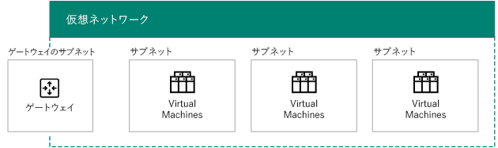
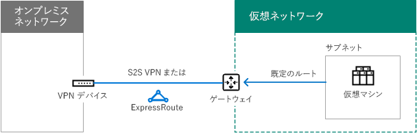

# Microsoft Azure IaaS のためのネットワークの設計

 **概要:**Microsoft Azure IaaS のワークロード用に最適化されたネットワークの設計方法について説明します。
  
Azure IaaS でホストされている IT ワークロード用のネットワーキングを最適化するには、Azure 仮想ネットワーク (VNet)、アドレス空間、ルーティング、DNS、および負荷分散に精通している必要があります。
  
## 任意の VNet 用の手順を計画する

どの種類の VNet も、次の手順に従ってください。
  
### 手順 1:Microsoft クラウド サービス用にインターネットを準備する。

[Microsoft クラウド接続の一般的な要素](common-elements-of-microsoft-cloud-connectivity.md)の「**Microsoft クラウド サービスを利用するためのネットワークの準備の手順**」セクションを読んでください。
  
### 手順 2:インターネット帯域幅を最適化する。

[Microsoft SaaS のためのネットワーク デザイン](designing-networking-for-microsoft-saas.md)の「**Microsoft SaaS サービスを利用するためのネットワークの準備の手順**」セクションに記載されている手順 2 から 4 を使用して、インターネット帯域幅を最適化します。
  
### 手順 3:VNet の種類を決定する (クラウド専用、またはクロスプレミス)。

クラウド専用の VNet には、オンプレミスのネットワークへの接続がありません。次に例を示します。
  
**図 1: クラウド専用の VNet**

  
図 1 は、クラウド専用の VNet の仮想マシンのセットを示しています。
  
クロスプレミスの VNet には、Azure のゲートウェイを経由してオンプレミスのネットワークに接続する、サイト対サイト (S2S) VPN または ExpressRoute 接続があります。次に例を示します。
  
**図 2: クロスプレミスの VNet**

  
図 2 は、オンプレミスのネットワークに接続される、クロスプレミスの VNet での仮想マシンのセットを示しています。
  
追加情報については、この記事の「[クロスプレミスの VNet 用の手順を計画する](designing-networking-for-microsoft-azure-iaas.md#cross_prem)」セクションを参照してください。
  
### 手順 4:VNet のアドレス空間を決定する。

表 1 は、VNet のさまざまな種類のアドレス空間を示しています。
  
|**VNet の種類**|**仮想ネットワークのアドレス スペース**|
|:-----|:-----|
|クラウド専用    |任意のプライベート アドレス空間    |
|相互接続のクラウド専用    |任意のプライベート。ただし、接続された他の VNet と重複しない    |
|クロスプレミス    |プライベート。ただし、オンプレミスと重複しない    |
|相互接続のクロスプレミス    |プライベート。ただし、オンプレミスおよび接続された他の VNet と重複しない    |
   
 **表 1:VNet の種類と対応するアドレス空間**
  
DHCP によって、仮想マシンにサブネットのアドレス空間からアドレス構成が割り当てられます。
  
- アドレス/サブネット マスク
    
- 既定のゲートウェイ
    
- DNS サーバーの IP アドレス
    
静的な IP アドレスを予約することもことができます。
  
仮想マシンには、個別にパブリック IP アドレスを割り当てることもできます。従来の展開のマシンの場合は、含まれているクラウド サービスからパブリック IP アドレスを割り当てることもできます。
  
### 手順 5:VNet 内のサブネットと、各サブネットに割り当てられているアドレス空間を決定する。

VNet には、ゲートウェイ サブネットと仮想マシン ホスト サブネットの、2 種類のサブネットがあります。
  
**図 3:Azure での 2 種類のサブネット**

  
図 3 は、ゲートウェイ サブネットを含む VNet を示しています。このゲートウェイ サブネットには、Azure ゲートウェイと、複数の仮想マシンを含む仮想マシン ホスト サブネットのセットが含まれています。
  
Azure ゲートウェイ サブネットは、Azure で Azure ゲートウェイの 2 つの仮想マシンをホストするために必要です。少なくとも 29 ビットのプレフィックス長でアドレス空間を指定します (例:192.168.15.248/29)。ExpressRoute を使用する予定の場合は、28 ビット以下のプレフィックス長をお勧めします。
  
Azure ゲートウェイ サブネットのアドレス空間を決定する場合のベスト プラクティスを次に示します。
  
1. ゲートウェイ サブネットのサイズを決定します。
    
2. VNet のアドレス空間の可変ビットでは、ゲートウェイ サブネットに使用するビットを 0、残りのビットを 1 に設定します。
    
3. 10 進数に変換して、ゲートウェイ サブネットのサイズに設定されたプレフィックス長のアドレス空間として表現します。
    
このメソッドでは、ゲートウェイ サブネットのアドレス空間は、常に VNet アドレス空間の最後尾になります。
  
ゲートウェイ サブネットのアドレス プレフィックスを定義する例を次に示します。VNet のアドレス空間は 10.119.0.0/16 です。組織では、初めはサイト対サイトの VPN 接続を使用しますが、最終的には ExpressRoute を入手することになります。ゲートウェイ サブネットのアドレス プレフィックスを決定する手順と結果をネットワークのプレフィックス表記 (CIDR とも呼ばれる) で表 2 に示します。

ゲートウェイ サブネットのアドレス プレフィックスを決定する手順と例を以下に示します。

1. ゲートウェイ サブネットのサイズを決定します。この例では、/28 を選択しました。
2. Vnet アドレス空間 (b) の変数部分でのビットをゲートウェイ サブネット ビット (G) では 0、それ以外は 1 (v) に設定します。この例では、VNet に 10.119.0.0/16 アドレス空間を使用しています。 
 10.119. bbbbbbbb . bbbbbbbb  10.119. VVVVVVVV . VVVVGGGG  10.119. 11111111 . 11110000  
3. 手順 2 からの結果を 10 進数に変換し、アドレス空間として表現します。この例では、10.119. 11111111 . 11110000 は 10.119.255.240 となり、手順 1 からのプレフィックス長 (この例では 28) により、結果として得られるゲートウェイ サブネット アドレスのプレフィックスは 10.119.255.240/28 となります。
  
詳細については、「[Azure ゲートウェイ サブネットのアドレス スペースの計算]((https://gallery.technet.microsoft.com/scriptcenter/Address-prefix-calculator-a94b6eed))」を参照してください。
  
Azure 仮想マシンは仮想マシン ホスト サブネットに配置します。これは一般的なオンプレミスのガイドライン (一般的なロール、アプリケーション層、サブネットの分離など) に従って行うことができます。
  
Azure では、各サブネットの最初の 3 つのアドレスを使用します。したがって、Azure サブネットで使用可能なアドレスの数は 2n - 5 になります (n はホスト ビットの数)。必要な仮想マシンの範囲、必要なホスト ビットの数、対応するサブネットのサイズを表 3 に示します。
  
|**必要な仮想マシン**|**ホスト ビット**|**サブネットのサイズ**|
|:-----|:-----|:-----|
|1-3    |3    |/29    |
|4-11    |4    |/28    |
|12-27    |5    |/27    |
|28-59    |6    |/26    |
|60-123    |7    |/25    |
   
 **表 3: 仮想マシンの要件とサブネットのサイズ**
  
サブネットまたは VNet 上の仮想マシンの最大数量の詳細については、「[ネットワークの制限](https://docs.microsoft.com/azure/azure-subscription-service-limits#networking-limits)」を参照してください。
  
詳細については、「[Azure 仮想ネットワークの計画と設計]((https://azure.microsoft.com/documentation/articles/virtual-network-vnet-plan-design-arm/))」を参照してください。
  
### 手順 6:DNS サーバーの構成と DNS サーバーのアドレスを決定して、VNet の VM に割り当てる。

Azure は DHCP によって、仮想マシンに DNS サーバーのアドレスを割り当てます。DNS サーバーは、次のようになります。
  
- Azure で提供:ローカルでの名前登録と、ローカルおよびインターネットでの名前解決を提供します。
    
- ユーザーが提供:ローカルまたはイントラネットでの名前登録と、イントラネットまたはインターネットのいずれかでの名前解決を提供します。
    
表 4 は、DNS サーバーの異なる構成を、VNet の種類ごとに示しています。
    
|**VNet の種類**|**DNS サーバー**|
|:-----|:-----|
|クラウド専用    |Azure で提供される場合は、ローカルおよびインターネットでの名前解決    Azure 仮想マシンの場合は、ローカルおよびインターネットでの名前解決 (DNS 転送)    |
|クロスプレミス    |オンプレミスの場合は、ローカルおよびイントラネットでの名前解決    Azure 仮想マシンの場合は、ローカルおよびイントラネットでの名前解決 (DNS レプリケーションおよび転送)    |
   
 **表 4: 異なる 2 つの種類の VNet 用の DNS サーバーのオプション**
  
詳細については、「[VM とロール インスタンスの名前解決]((https://docs.microsoft.com/azure/virtual-network/virtual-networks-name-resolution-for-vms-and-role-instances))」を参照してください。
  
### 手順 7:負荷分散の構成 (インターネット接続か内部接続か) を決定する。

場合によっては、同じロールのサーバーのセットに着信トラフィックを分散する必要があります。Azure IaaS には、インターネット接続および内部トラフィックの負荷に対してこれを行うための機能が組み込まれています。
  
Azure のインターネット接続の負荷分散は、インターネットから負荷分散セットのメンバーへの未承諾の着信トラフィックをランダムに分散します。
  
**図 4: Azure の外部ロード バランサー**

  
図 4 は、受信 NAT 規則、または負荷分散セット内の仮想マシンへのエンドポイントに着信トラフィックを分散する、Azure の外部ロード バランサーを示しています。
  
Azure の内部負荷分散は、他の Azure VM またはイントラネット コンピューターから負荷分散セットのメンバーへの未承諾の着信トラフィックをランダムに分散します。 
  
**図 5: Azure での内部ロード バランサー**

  
図 5 は、受信 NAT 規則、または負荷分散セット内の仮想マシンへのエンドポイントに着信トラフィックを分散する、Azure の内部ロード バランサーを示しています。
  
詳細については、「[Azure ロード バランサー]((https://docs.microsoft.com/azure/load-balancer/load-balancer-overview))」を参照してください。
  
### 手順 8:仮想アプライアンスおよびユーザー定義ルートの使用を決定する。

トラフィックを VNet の仮想アプライアンスに転送する必要がある場合、サブネットに 1 つ以上のユーザー定義のルートを追加する必要がある場合があります。
  
**図 6: 仮想アプライアンスと Azure 内のユーザー定義ルート**

  
図 6 は、仮想アプライアンスを指す仮想マシン ホスト サブネットに割り当てられたクロスプレミスの VNet とユーザー定義のルートを示しています。
  
詳細については、「[ユーザー定義のルートおよび IP 転送]((https://docs.microsoft.com/azure/virtual-network/virtual-networks-udr-overview))」を参照してください。
  
### 手順 9:インターネットからコンピューターが仮想マシンに接続する方法を決定する。

VNet の仮想マシンへのインターネット アクセス (組織ネットワークからプロキシ サーバーや他のエッジ デバイスを経由するアクセスを含む) を提供する方法は複数あります。
  
未承諾の着信トラフィックをフィルター処理または検査する方法を表 5 に示します。
  
|**メソッド**|**展開モデル**|
|:-----|:-----|
|1.クラウド サービス上で構成されたエンドポイントおよび ACL    |クラシック    |
|2.ネットワーク セキュリティ グループ    |リソース マネージャーおよびクラシック    |
|3.受信 NAT 規則を使用するインターネット接続ロード バランサー    |リソース管理者    |
|4. Azure でのネットワーク セキュリティ アプライアンス 
 Marketplace (表示しない)    |リソース マネージャーおよびクラシック    |
   
 **表 5: 仮想マシンと対応する Azure 展開モデルに接続する方法**
  
**図 7: インターネット経由で Azure 仮想マシンに接続する**

  
図 7 は、エンドポイントを使用してクラウド サービス内の仮想マシンに接続しているインターネットに接続されたコンピューター、ネットワーク セキュリティ グループを使用するサブネット上の仮想マシン、および外部ロード バランサーと受信 NAT 規則を使用するサブネット上の仮想マシンを示しています。
  
追加のセキュリティは、以下のものから提供されます。
  
- 認証され、暗号化されたリモート デスクトップおよび SSH 接続。
    
- 認証され、暗号化されたリモート PowerShell セッション。
    
- エンド ツー エンドの暗号化に使用できる IPsec トランスポート モード。
    
- Azure DDoS の保護。外部および内部の攻撃を防止するために有用。
    
詳細については、「[エンタープライズ アーキテクトのための Microsoft クラウドのセキュリティ]((https://aka.ms/cloudarchsecurity))」および「[Azure のネットワーク セキュリティ]((https://azure.microsoft.com/blog/azure-network-security/))」を参照してください。
  
### 手順 10:複数の VNet に対して、VNet 間の接続トポロジを決定する。

VNet と VNet は、組織のサイトの接続に使用するトポロジと同様のトポロジを使用して、互いに接続することができます。
  
デイジー チェーン構成は、一連の VNet を接続します。
  
**図 8: VNet のデイジー チェーン構成**

  
図 8 は、デイジー チェーン構成を使用して連続的に接続された 5 つの VNet を示しています。
  
スポークおよびハブ構成は複数の VNet を中央の VNet のセットに接続します。中央の VNet のセットでは、VNet と VNet が互いに接続されています。
  
**図 9: VNet のスポークおよびハブ構成**

  
図 9 は 6 つの VNet を示しています。2 つの VNet がハブになります。ハブは互いに接続し、他の 2 つのスポーク VNet にも接続しています。
  
フル メッシュ構成は、すべての VNet を相互接続します。
  
**図 10: VNet のフル メッシュ構成**

  
図 10 は、合計 6 つの VNet 間接続を使用する、すべてが互いに接続された 4 つの VNet を示しています。
  
## クロスプレミスの VNet 用の手順を計画する

次に示すクロスプレミスの VNet 用の手順を実行してください。
  
> [!TIP]
> シミュレートされたクロスプレミスの開発/テスト環境を作成するには、「[Azure でのシミュレートされたクロスプレミスの仮想ネットワーク](simulated-cross-premises-virtual-network-in-azure.md)」を参照してください。 
  
### 手順 1:VNet (S2S VPN または ExpressRoute) へのクロスプレミス接続を決定する。

異なる種類の接続を表 6 に示します。
  
|**接続の種類**|**用途**|
|:-----|:-----|
|サイト対サイト (S2S) VPN    |1 つの VNet に 1 から 10 のサイト (他の VNet を含む) を接続する。    |
|ExpressRoute    |インターネット エクスチェンジ プロバイダー (IXP) またはネットワーク サービス プロバイダー (NSP) 経由で Azure に接続する、プライベートで安全なリンク。    |
|ポイント対サイト (P2S) VPN    |1 台のコンピューターを VNet に接続する。    |
|VNet のピアリングまたは VNet-to-VNet (V2V) VPN    |VNet を他の VNet に接続する。    |
   
 **表 6: クロスプレミス VNet 用の接続の種類**
  
接続の最大数の詳細については、「[ネットワークの制限](https://docs.microsoft.com/azure/azure-subscription-service-limits#networking-limits)」を参照してください。
  
VPN デバイスの詳細については、「[サイト対サイトの仮想ネットワーク接続用の VPN デバイス]((https://docs.microsoft.com/azure/vpn-gateway/vpn-gateway-about-vpn-devices))」を参照してください。
  
VNet ピアリングの詳細については、「[VNet ピアリング]((https://docs.microsoft.com/azure/virtual-network/virtual-network-peering-overview))」を参照してください。
  
**図 11: クロスプレミス VNet に接続する 4 つの方法**

  
図 11 は、VNet の 4 種類の接続方法 (コンピューターからの P2S 接続、オンプレミス ネットワークからの S2S VPN 接続、オンプレミス ネットワークからの ExpressRoute 接続、他の VNet からの VNet 対 VNet 接続) を示しています。 
  
VNet 内の VM には、次の方法で接続できます。
  
- オンプレミス ネットワークまたはインターネットから VNet の VM を管理する
    
- オンプレミス ネットワークからの IT ワークロードのアクセス
    
- 追加の VNet を通じてネットワークを拡張する
    
接続のセキュリティは、次のことから確保されます。
  
- P2S で Secure Socket トンネリング プロトコル (SSTP) を使用する 
    
- S2S および VNet 対 VNet VPN 接続で AES256 を使用した IPsec トンネル モードを使用する
    
- ExpressRoute はプライベート WAN 接続。
    
詳細については、「[エンタープライズ アーキテクトのための Microsoft クラウドのセキュリティ]((https://aka.ms/cloudarchsecurity))」および「[Azure のネットワーク セキュリティ]((https://azure.microsoft.com/blog/azure-network-security/))」を参照してください。
  
### 手順 2:オンプレミスの VPN デバイスまたはルーターを決定する。

オンプレミスの VPN デバイスやルーターは、次のように機能します。
  
- Azure ゲートウェイからの S2S VPN 接続を終了する IPsec ピア。
    
- プライベート ピアリング ExpressRoute 接続の BPG ピアおよび終端点。
    
**図 12: オンプレミスの VPN ルーターまたはデバイス**

  
図 12 は、オンプレミスの VPN ルーターまたはデバイスに接続されるクロスプレミスの VNet を示しています。
  
詳細については、「[VPN Gateway について]((https://docs.microsoft.com/azure/vpn-gateway/vpn-gateway-about-vpngateways))」を参照してください。
  
### 手順 3: VNet のアドレス空間に到達可能なルートをイントラネットに追加する。

オンプレミスから VNet へのルーティングは、次のもので構成されています。
  
1. VPN デバイスを指す VNet アドレス空間のルート。
    
2. S2S VPN または ExpressRoute 接続全体を指す VPN デバイス上の VNet アドレス空間のルート。
    
**図 13: VNet へのアクセスを可能にするために必要なオンプレミスのルート**

  
図 13 は、オンプレミスのルーターと、VNet のアドレス空間を表す VPN ルーターやデバイスに必要なルーティング情報を示しています。
  
### 手順 4:ExpressRoute 用にプロバイダーへの新しい接続を計画する。

次に示す 3 種類の方法で、オンプレミスのネットワークと Microsoft クラウドの間にプライベート ピアリングの ExpressRoute 接続を作成できます。
  
- Cloud Exchange でのコロケーション
    
- ポイント ツー ポイントのイーサネット接続
    
- Any-to-any (IP VPN) ネットワーク
    
**図 14: ExpressRoute を使用してクロスプレミスの VNet に接続する**

  
図 14 は、オンプレミスのルーターから Microsoft Azure へのクロスプレミスの VNet と ExpressRoute 接続を示しています。
  
詳細については、「[Microsoft クラウド接続のための ExpressRoute](expressroute-for-microsoft-cloud-connectivity.md)」を参照してください。
  
### 手順 5:Azure ゲートウェイのローカル ネットのワーク アドレス空間を決定する。

オンプレミスまたは VNet から他の VNet へのルーティングの場合、Azure はゲートウェイに割り当てられたローカル ネットワークのアドレス空間と一致する Azure ゲートウェイを経由して、トラフィックを転送します。
  
**図 15: クロスプレミスの VNet 用のローカル ネットワーク アドレス空間**

  
図 15 は、クロスプレミス VNet と、オンプレミス ネットワークの到達可能なアドレス空間を表す Azure ゲートウェイのローカル ネットワークのアドレス空間を示しています。 
  
ローカル ネットワークのアドレス空間を定義する方法を次に示します。
  
- オプション 1:現在必要か、使用中のアドレス空間のプレフィックスの一覧 (新しいサブネットを追加した場合は更新が必要)。
    
- オプション 2:すべてのオンプレミスのアドレス空間 (新しいアドレス空間を追加した場合のみ更新が必要)。
    
Azure ゲートウェイでは要約ルートが許可されないため、オプション 2 のローカル ネットワークのアドレス空間を定義して、VNet アドレス空間が含まれないようにする必要があります。
  
**図 16: VNet アドレス空間によって作られたアドレス空間の穴**

  
図 16 は、アドレス空間 (ルート領域と VNet アドレス空間) を表しています。
  
次の例は、VNet によって作成されたアドレス空間の「穴」の周囲にあるローカル ネットワークのアドレス空間にプレフィックスを定義します。
  
- 組織はプライベートのアドレス空間 (10.0.0.0/8、172.16.0.0/12、および 192.168.0.0/16) の一部をオンプレミスのネットワーク経由で使用します。組織では VNet のアドレス空間として、オプション 2 と 10.100.100.0/24 を選択します。
    
この例のローカル ネットワークのアドレス空間を定義する手順と、その結果生じるプレフィックスを表 7 に示します。
  
|**手順**|**結果**|
|:-----|:-----|
|1. VNet アドレス空間のルート領域でないプレフィックスを一覧表示する。    |172.16.0.0/12 および 192.168.0.0/16    |
|2.最後に使用した 
  VNet アドレス空間内のオクテットの直前までの、変数オクテットの重複していないプレフィックスを一覧表示する。    |10.0.0.0/16, 10.1.0.0/16…10.99.0.0/16, 10.101.0.0/16…10.254.0.0/16, 10.255.0.0/16 (255 個のプレフィックス、10.100.0.0/16 はスキップ)    |
|3.  
 VNet アドレス空間の最後に使用したオクテット内の重複していないプレフィックスを一覧表示する。    |10.100.0.0/24, 10.100.1.0/24…10.100.99.0/24, 10.100.101.0/24…10.100.254.0/24, 10.100.0.255.0/24 (255 個のプレフィックス,10.100.100.0/24 はスキップ)    |
   
 **表 7:ローカル アドレスのネットワーク空間の例**
  
### 手順 6: DNS レプリケーション用のオンプレミスの DNS サーバーと Azure でホストされる DNS サーバーを構成する

オンプレミス コンピューターが Azure ベースのサーバーの名前を解決したり、Azure ベースのサーバーがオンプレミスのコンピューターの名前を解決するには、次に示す構成を行います。
  
- VNet 内の DNS サーバーを、オンプレミスの DNS サーバーに転送するように構成する
    
- オンプレミスおよび VNet の DNS サーバー間で適切なゾーンの DNS レプリケーションを構成する
    
**図 17: クロスプレミスの VNet 内 DNS サーバーの DNS のレプリケーションおよび転送**

  
図17 は、オンプレミス ネットワークと VNet のサブネットの、クロスプレミスの VNet と DNS サーバーを示しています。DNS レプリケーションと転送は、2 つの DNS サーバー間で構成されています。
  
### 手順 7:強制トンネリングの使用を決定する。

Azure サブネットの既定のシステム ルートは、インターネットをポイントします。仮想マシンからのすべてのトラフィックがクロスプレミス接続全体を移動するようにするには、次ホップ アドレスとして Azure ゲートウェイを使用する既定のルートを指定したルーティング テーブルを作成します。次に、そのルート テーブルをサブネットに関連付けます。これを強制トンネリングといいます。詳細については、「[強制トンネリングの構成]((https://docs.microsoft.com/azure/vpn-gateway/vpn-gateway-forced-tunneling-rm))」を参照してください。
  
**図 18: ユーザー定義のルートおよびクロスプレミスの VNet の強制トンネリング**

  
図 18 は、クロスプレミスの VNet と、Azure ゲートウェイを指しているサブネットのユーザー定義のルートを示しています。
  
## Azure の SharePoint Server 2016 ファーム

Azure IaaS でホストされているイントラネット IT ワークロードの一例として、図 19 に示すように、可用性の高い多層 SharePoint Server 2016 ファームがあります。
  
**図 19:Azure IaaS の高可用性イントラネット SharePoint Server 2016 ファーム**

  
図 19 は、フロントエンド層とデータ層に内部ロード バランサーを使用するクロスプレミス VNet で展開された SharePoint Server 2016 ファームの 9 台のサーバーを示しています。ステップ バイ ステップの設計と展開の手順を含む詳細については、「[Microsoft Azure での SharePoint Server 2016](https://technet.microsoft.com/library/mt779107%28v=office.16%29.aspx)」を参照してください。
  
> [!TIP]
> シミュレートされたクロスプレミス VNet で単一サーバーの SharePoint Server 2016 ファームを作成するには、「[Azure 開発/テスト環境でのイントラネット SharePoint Server 2016](https://technet.microsoft.com/library/mt806351%28v=office.16%29.aspx)」を参照してください。 
  
クロスプレミスの Azure 仮想ネットワーク内の仮想マシンにデプロイされた IT ワークロードに関するその他の例については、「[Azure IaaS のハイブリッド クラウド シナリオ]((https://technet.microsoft.com/library/mt750502.aspx))」を参照してください。
  
## 関連項目

[エンタープライズ アーキテクトのための Microsoft クラウド ネットワーク](microsoft-cloud-networking-for-enterprise-architects.md)
  
[Microsoft クラウド IT アーキテクチャのリソース](microsoft-cloud-it-architecture-resources.md)

[Microsoft's Enterprise Cloud Roadmap: Resources for IT Decision Makers]((https://sway.com/FJ2xsyWtkJc2taRD))

