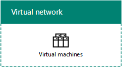
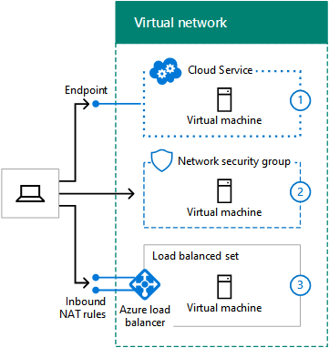
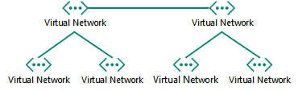

# Microsoft Azure IaaS のためのネットワークの設計Designing networking for Microsoft Azure IaaS

 **概要:** Microsoft Azure IaaS のワークロード用に最適化されたネットワークの設計方法について説明します。**Summary:** Understand how to design optimized networking for workloads in Microsoft Azure IaaS.
  
Azure IaaS でホストされている IT ワークロード用のネットワーキングを最適化するには、Azure 仮想ネットワーク (VNet)、アドレス空間、ルーティング、DNS、および負荷分散に精通している必要があります。Optimizing networking for IT workloads hosted in Azure IaaS requires an understanding of Azure virtual networks (VNets), address spaces, routing, DNS, and load balancing.
  
## 任意の VNet 用の手順を計画するPlanning steps for any VNet

どの種類の VNet も、次の手順に従ってください。Follow these steps for any type of VNet.
  
### 手順 1:Microsoft クラウド サービス用にインターネットを準備する。Step 1: Prepare your intranet for Microsoft cloud services.

[Microsoft クラウド接続の一般的な要素](common-elements-of-microsoft-cloud-connectivity.md)の「**Microsoft クラウド サービスを利用するためのネットワークの準備の手順**」セクションを読んでください。Go through the **Steps to prepare your network for Microsoft cloud services** section in [Common elements of Microsoft cloud connectivity](common-elements-of-microsoft-cloud-connectivity.md).
  
### 手順 2:インターネット帯域幅を最適化する。Step 2: Optimize your Internet bandwidth.

[Microsoft SaaS のためのネットワーク デザイン](designing-networking-for-microsoft-saas.md)の「**Microsoft SaaS サービスを利用するためのネットワークの準備の手順**」セクションに記載されている手順 2 から 4 を使用して、インターネット帯域幅を最適化します。Optimize your Internet bandwidth using steps 2 - 4 of the **Steps to prepare your network for Microsoft SaaS services** section in [Designing networking for Microsoft SaaS](designing-networking-for-microsoft-saas.md).
  
### 手順 3:VNet の種類を決定する (クラウド専用、またはクロスプレミス)。Step 3: Determine the type of VNet (cloud-only or cross-premises).

クラウド専用の VNet には、オンプレミスのネットワークへの接続がありません。次に例を示します。A cloud-only VNet has no connection to an on-premises network. Here is an example.
  
**図 1: クラウド専用の VNet****Figure 1: A cloud-only VNet**

  
図 1 は、クラウド専用の VNet の仮想マシンのセットを示しています。Figure 1 shows a set of virtual machines in a cloud-only VNet.
  
クロスプレミスの VNet には、Azure のゲートウェイを経由してオンプレミスのネットワークに接続する、サイト対サイト (S2S) VPN または ExpressRoute 接続があります。次に例を示します。A cross-premises VNet has a site-to-site (S2S) VPN or ExpressRoute connection to an on-premises network through an Azure gateway. Here is an example.
  
**図 2: クロスプレミスの VNet****Figure 2: A cross-premises VNet**

  
図 2 は、オンプレミスのネットワークに接続される、クロスプレミスの VNet での仮想マシンのセットを示しています。Figure 2 shows a set of virtual machines in a cross-premises VNet, which is connected to an on-premises network.
  
追加情報については、この記事の「[クロスプレミスの VNet 用の手順を計画する](designing-networking-for-microsoft-azure-iaas.md#cross_prem)」セクションを参照してください。See the additional [Planning steps for a cross-premises VNet](designing-networking-for-microsoft-azure-iaas.md#cross_prem) section in this article.
  
### 手順 4:VNet のアドレス空間を決定する。Step 4: Determine the address space of the VNet.

表 1 は、VNet のさまざまな種類のアドレス空間を示しています。Table 1 shows the address spaces for the different types of VNets.
  
|**VNet の種類****Type of VNet**|**仮想ネットワークのアドレス スペース****Virtual network address space**|
|:-----|:-----|
|クラウド専用Cloud-only    |任意のプライベート アドレス空間Arbitrary private address space    |
|相互接続のクラウド専用Interconnected cloud-only    |任意のプライベート。ただし、接続された他の VNet と重複しないArbitrary private, but not overlapping with other connected VNets    |
|クロスプレミスCross-premises    |プライベート。ただし、オンプレミスと重複しないPrivate, but not overlapping with on-premises    |
|相互接続のクロスプレミスInterconnected cross-premises    |プライベート。ただし、オンプレミスおよび接続された他の VNet と重複しないPrivate, but not overlapping with on-premises and other connected VNets    |
   
 **表 1:VNet の種類と対応するアドレス空間****Table 1: Types of VNets and their corresponding address space**
  
DHCP によって、仮想マシンにサブネットのアドレス空間からアドレス構成が割り当てられます。Virtual machines are assigned an address configuration from the address space of the subnet by DHCP:
  
- アドレス/サブネット マスクAddress/subnet mask
    
- 既定のゲートウェイDefault gateway
    
- DNS サーバーの IP アドレスDNS server IP addresses
    
静的な IP アドレスを予約することもことができます。You can also reserve a static IP address.
  
仮想マシンには、個別にパブリック IP アドレスを割り当てることもできます。従来の展開のマシンの場合は、含まれているクラウド サービスからパブリック IP アドレスを割り当てることもできます。Virtual machines can also be assigned a public IP address, either individually or from the containing cloud service (for classic deployment machines only).
  
### 手順 5:VNet 内のサブネットと、各サブネットに割り当てられているアドレス空間を決定する。Step 5: Determine the subnets within the VNet and the address spaces assigned to each.

VNet には、ゲートウェイ サブネットと仮想マシン ホスト サブネットの、2 種類のサブネットがあります。There are two types of subnets in a VNet, a gateway subnet and a virtual machine-hosting subnet.
  
**図 3:Azure での 2 種類のサブネット****Figure 3: The two types of subnets in Azure**

  
図 3 は、ゲートウェイ サブネットを含む VNet を示しています。このゲートウェイ サブネットには、Azure ゲートウェイと、複数の仮想マシンを含む仮想マシン ホスト サブネットのセットが含まれています。Figure 3 shows a VNet containing a gateway subnet that contains an Azure gateway and a set of virtual machine-hosting subnets containing virtual machines.
  
Azure ゲートウェイ サブネットは、Azure で Azure ゲートウェイの 2 つの仮想マシンをホストするために必要です。少なくとも 29 ビットのプレフィックス長でアドレス空間を指定します (例:192.168.15.248/29)。ExpressRoute を使用する予定の場合は、28 ビット以下のプレフィックス長をお勧めします。The Azure gateway subnet is needed by Azure to host the two virtual machines of your Azure gateway. Specify an address space with at least a 29-bit prefix length (example: 192.168.15.248/29). A 28-bit or smaller prefix length is recommended, especially if you are planning to use ExpressRoute.
  
Azure ゲートウェイ サブネットのアドレス空間を決定する場合のベスト プラクティスを次に示します。A best practice for determining the address space of the Azure gateway subnet is the following:
  
1. ゲートウェイ サブネットのサイズを決定します。Decide on the size of the gateway subnet.
    
2. VNet のアドレス空間の可変ビットでは、ゲートウェイ サブネットに使用するビットを 0、残りのビットを 1 に設定します。In the variable bits in the address space of the VNet, set the bits used for the gateway subnet to 0 and set the remaining bits to 1.
    
3. 10 進数に変換して、ゲートウェイ サブネットのサイズに設定されたプレフィックス長のアドレス空間として表現します。Convert to decimal and express as an address space with the prefix length set to the size of the gateway subnet.
    
このメソッドでは、ゲートウェイ サブネットのアドレス空間は、常に VNet アドレス空間の最後尾になります。With this method, the address space for the gateway subnet is always at the farthest end of the VNet address space.
  
ゲートウェイ サブネットのアドレス プレフィックスを定義する例を次に示します。VNet のアドレス空間は 10.119.0.0/16 です。組織では、初めはサイト対サイトの VPN 接続を使用しますが、最終的には ExpressRoute を入手することになります。ゲートウェイ サブネットのアドレス プレフィックスを決定する手順と結果をネットワークのプレフィックス表記 (CIDR とも呼ばれる) で表 2 に示します。Here is an example of defining the address prefix for the gateway subnet: The address space of the VNet is 10.119.0.0/16. The organization will initially use a site-to-site VPN connection, but will eventually get ExpressRoute. Table 2 shows the steps and results of determining the gateway subnet address prefix in network prefix notation (also known as CIDR).

ゲートウェイ サブネットのアドレス プレフィックスを決定する手順と例を以下に示します。Here are the steps and example of determining the gateway subnet address prefix:

1. ゲートウェイ サブネットのサイズを決定します。この例では、/28 を選択しました。Decide on the size of the gateway subnet. For our example, we chose /28.
2. Vnet アドレス空間 (b) の変数部分でのビットをゲートウェイ サブネット ビット (G) では 0、それ以外は 1 (v) に設定します。この例では、VNet に 10.119.0.0/16 アドレス空間を使用しています。Set the bits in the variable portion of the VNet address space (b) to 0 for the gateway subnet bits (G), otherwise 1 (V). For our example, we are using the 10.119.0.0/16 address space for the VNet.  
 10.119. bbbbbbbb . bbbbbbbb 10.119. bbbbbbbb . bbbbbbbb  10.119. VVVVVVVV . VVVVGGGG 10.119. VVVVVVVV . VVVVGGGG  10.119. 11111111 . 1111000010.119. 11111111 . 11110000   
3. 手順 2 からの結果を 10 進数に変換し、アドレス空間として表現します。この例では、10.119. 11111111 . 11110000 は 10.119.255.240 となり、手順 1 からのプレフィックス長 (この例では 28) により、結果として得られるゲートウェイ サブネット アドレスのプレフィックスは 10.119.255.240/28 となります。Convert the result from step 2 to decimal and express as an address space. For our example, 10.119. 11111111 . 11110000 is 10.119.255.240, and with the prefix length from step 1, (28 in our example), the resulting gateway subnet address prefix is 10.119.255.240/28.
  
詳細については、「[Azure ゲートウェイ サブネットのアドレス スペースの計算](https://gallery.technet.microsoft.com/scriptcenter/Address-prefix-calculator-a94b6eed)」を参照してください。See [Address space calculator for Azure gateway subnets](https://gallery.technet.microsoft.com/scriptcenter/Address-prefix-calculator-a94b6eed) for more information.
  
Azure 仮想マシンは仮想マシン ホスト サブネットに配置します。これは一般的なオンプレミスのガイドライン (一般的なロール、アプリケーション層、サブネットの分離など) に従って行うことができます。Virtual machine-hosting subnets are where you place Azure virtual machines, which you can do according to typical on-premises guidelines, such as a common role or tier of an application or for subnet isolation.
  
Azure は、各サブネット上の最初の 3 つのアドレスを使用します。したがって、Azure サブネット上の使用可能なアドレスの数は 2nの 5、ホスト ビットの数です。表 3 に示す必要な場合、ビットをホストする仮想マシンが、必要な数の範囲と対応するサブネットのサイズです。Azure uses the first 3 addresses on each subnet. Therefore, the number of possible addresses on an Azure subnet is 2n - 5, where n is the number of host bits. Table 3 shows the range of virtual machines required, the number of hosts bits needed, and the corresponding subnet size.
  
|**必要な仮想マシン****Virtual machines required**|**ホスト ビット****Host bits**|**サブネットのサイズ****Subnet size**|
|:-----|:-----|:-----|
|1-31-3    |33    |/29/29    |
|4-114-11    |44    |/28/28    |
|12-2712-27    |55    |/27/27    |
|28-5928-59    |66    |/26/26    |
|60-12360-123    |77    |/25/25    |
   
 **表 3: 仮想マシンの要件とサブネットのサイズ****Table 3: Virtual machine requirements and their subnet sizes**
  
サブネットまたは VNet 上の仮想マシンの最大数量の詳細については、「[ネットワークの制限](https://docs.microsoft.com/azure/azure-subscription-service-limits#networking-limits)」を参照してください。For more information about the maximum amount of virtual machines on a subnet or VNet, see [Networking Limits](https://docs.microsoft.com/azure/azure-subscription-service-limits#networking-limits).
  
詳細については、「[Azure 仮想ネットワークの計画と設計](https://azure.microsoft.com/documentation/articles/virtual-network-vnet-plan-design-arm/)」を参照してください。For more information, see [Plan and design Azure Virtual Networks](https://azure.microsoft.com/documentation/articles/virtual-network-vnet-plan-design-arm/).
  
### 手順 6:DNS サーバーの構成と DNS サーバーのアドレスを決定して、VNet の VM に割り当てる。Step 6: Determine the DNS server configuration and the addresses of the DNS servers to assign to VMs in the VNet.

Azure は DHCP によって、仮想マシンに DNS サーバーのアドレスを割り当てます。DNS サーバーは、次のようになります。Azure assigns virtual machines the addresses of DNS servers by DHCP. DNS servers can be:
  
- Azure で提供:ローカルでの名前登録と、ローカルおよびインターネットでの名前解決を提供します。Supplied by Azure: Provides local name registration and local and Internet name resolution
    
- ユーザーが提供:ローカルまたはイントラネットでの名前登録と、イントラネットまたはインターネットのいずれかでの名前解決を提供します。Provided by you: Provides local or intranet name registration and either intranet or Internet name resolution
    
表 4 は、DNS サーバーの異なる構成を、VNet の種類ごとに示しています。Table 4 shows the different configurations of DNS servers for each type of VNet.
    
|**VNet の種類****Type of VNet**|**DNS サーバー****DNS server**|
|:-----|:-----|
|クラウド専用Cloud-only    |Azure で提供される場合は、ローカルおよびインターネットでの名前解決Azure-supplied for local and Internet name resolution    Azure 仮想マシンの場合は、ローカルおよびインターネットでの名前解決 (DNS 転送)Azure virtual machine for local and Internet name resolution (DNS forwarding)    |
|クロスプレミスCross-premises    |オンプレミスの場合は、ローカルおよびイントラネットでの名前解決On-premises for local and intranet name resolution    Azure 仮想マシンの場合は、ローカルおよびイントラネットでの名前解決 (DNS レプリケーションおよび転送)Azure virtual machine for local and intranet name resolution (DNS replication and forwarding)    |
   
 **表 4: 異なる 2 つの種類の VNet 用の DNS サーバーのオプション****Table 4: DNS server options for the two different types of VNets**
  
詳細については、「[VM とロール インスタンスの名前解決](https://docs.microsoft.com/azure/virtual-network/virtual-networks-name-resolution-for-vms-and-role-instances)」を参照してください。For more information, see [Name Resolution for VMs and Role Instances](https://docs.microsoft.com/azure/virtual-network/virtual-networks-name-resolution-for-vms-and-role-instances).
  
### 手順 7:負荷分散の構成 (インターネット接続か内部接続か) を決定する。Step 7: Determine the load balancing configuration (Internet-facing or internal).

場合によっては、同じロールのサーバーのセットに着信トラフィックを分散する必要があります。Azure IaaS には、インターネット接続および内部トラフィックの負荷に対してこれを行うための機能が組み込まれています。In some cases, you want to distribute incoming traffic to a set of servers that have the same role. Azure IaaS has a built-in facility to do this for Internet-facing and internal traffic loads.
  
Azure のインターネット接続の負荷分散は、インターネットから負荷分散セットのメンバーへの未承諾の着信トラフィックをランダムに分散します。Azure Internet-facing load balancing randomly distributes unsolicited incoming traffic from the Internet to the members of a load-balanced set.
  
**図 4: Azure の外部ロード バランサー****Figure 4: An external load balancer in Azure**

  
図 4 は、受信 NAT 規則、または負荷分散セット内の仮想マシンへのエンドポイントに着信トラフィックを分散する、Azure の外部ロード バランサーを示しています。Figure 4 shows an external load balancer in Azure that distributes incoming traffic on an inbound NAT rule or endpoint to a set of virtual machines in a load-balanced set.
  
Azure の内部負荷分散は、他の Azure VM またはイントラネット コンピューターから負荷分散セットのメンバーへの未承諾の着信トラフィックをランダムに分散します。Azure internal load balancing randomly distributes unsolicited incoming traffic from other Azure VMs or from intranet computers to the members of a load-balanced set. 
  
**図 5: Azure での内部ロード バランサー****Figure 5: An internal load balancer in Azure**

  
図 5 は、受信 NAT 規則、または負荷分散セット内の仮想マシンへのエンドポイントに着信トラフィックを分散する、Azure の内部ロード バランサーを示しています。Figure 5 shows an internal load balancer in Azure that distributes incoming traffic on an inbound NAT rule or endpoint to a set of virtual machines in a load-balanced set.
  
詳細については、「[Azure ロード バランサー](https://docs.microsoft.com/azure/load-balancer/load-balancer-overview)」を参照してください。For more information, see [Azure Load Balancer](https://docs.microsoft.com/azure/load-balancer/load-balancer-overview).
  
### 手順 8:仮想アプライアンスおよびユーザー定義ルートの使用を決定する。Step 8: Determine the use of virtual appliances and user-defined routes.

トラフィックを VNet の仮想アプライアンスに転送する必要がある場合、サブネットに 1 つ以上のユーザー定義のルートを追加する必要がある場合があります。If you need to forward traffic to virtual appliances in your VNet, you may need to add one or more user-defined routes to a subnet.
  
**図 6: 仮想アプライアンスと Azure 内のユーザー定義ルート****Figure 6: Virtual appliances and user-defined routes in Azure**

  
図 6 は、仮想アプライアンスを指す仮想マシン ホスト サブネットに割り当てられたクロスプレミスの VNet とユーザー定義のルートを示しています。Figure 6 shows a cross-premises VNet and a user-defined route assigned to a virtual machine-hosting subnet that points to a virtual appliance.
  
詳細については、「[ユーザー定義のルートおよび IP 転送](https://docs.microsoft.com/azure/virtual-network/virtual-networks-udr-overview)」を参照してください。For more information, see [User Defined Routes and IP Forwarding](https://docs.microsoft.com/azure/virtual-network/virtual-networks-udr-overview).
  
### 手順 9:インターネットからコンピューターが仮想マシンに接続する方法を決定する。Step 9: Determine how computers from the Internet will connect to virtual machines.

VNet の仮想マシンへのインターネット アクセス (組織ネットワークからプロキシ サーバーや他のエッジ デバイスを経由するアクセスを含む) を提供する方法は複数あります。There are multiple ways to provide Internet access to the virtual machines on a VNet, which includes access from your organization network through your proxy server or other edge device.
  
未承諾の着信トラフィックをフィルター処理または検査する方法を表 5 に示します。Table 5 lists the methods for filtering or inspecting unsolicited incoming traffic.
  
|**メソッド****Method**|**展開モデル****Deployment model**|
|:-----|:-----|
|1.クラウド サービス上で構成されたエンドポイントおよび ACL1. Endpoints and ACLs configured on cloud services    |クラシックClassic    |
|2.ネットワーク セキュリティ グループ2. Network security groups    |リソース マネージャーおよびクラシックResource Manager and classic    |
|3.受信 NAT 規則を使用するインターネット接続ロード バランサー3. Internet-facing load balancer with inbound NAT rules    |リソース管理者Resource Manager    |
|4.Azure Marketplace でのネットワーク セキュリティ アプライアンス (表示されていません)4. Network security appliances in the Azure Marketplace (not shown)    |リソース マネージャーおよびクラシックResource Manager and classic    |
   
 **表 5: 仮想マシンと対応する Azure 展開モデルに接続する方法****Table 5: Methods of connecting to virtual machines and their corresponding Azure deployment models**
  
**図 7: インターネット経由で Azure 仮想マシンに接続する****Figure 7: Connecting to Azure virtual machines over the Internet**

  
図 7 は、エンドポイントを使用してクラウド サービス内の仮想マシンに接続しているインターネットに接続されたコンピューター、ネットワーク セキュリティ グループを使用するサブネット上の仮想マシン、および外部ロード バランサーと受信 NAT 規則を使用するサブネット上の仮想マシンを示しています。Figure 7 shows an Internet-connected computer connecting to a virtual machine in a cloud service using an endpoint, a virtual machine on a subnet using a network security group, and a virtual machine on a subnet using an external load balancer and inbound NAT rules.
  
追加のセキュリティは、以下のものから提供されます。Additional security is provided by:
  
- 認証され、暗号化されたリモート デスクトップおよび SSH 接続。Remote Desktop and SSH connections, which are authenticated and encrypted.
    
- 認証され、暗号化されたリモート PowerShell セッション。Remote PowerShell sessions, which are authenticated and encrypted.
    
- エンド ツー エンドの暗号化に使用できる IPsec トランスポート モード。IPsec transport mode, which you can use for end-to-end encryption.
    
- Azure DDoS の保護。外部および内部の攻撃を防止するために有用。Azure DDOS protection, which helps prevent external and internal attacks
    
詳細については、「[エンタープライズ アーキテクトのための Microsoft クラウドのセキュリティ](https://aka.ms/cloudarchsecurity)」および「[Azure のネットワーク セキュリティ](https://azure.microsoft.com/blog/azure-network-security/)」を参照してください。For more information, see [Microsoft Cloud Security for Enterprise Architects](https://aka.ms/cloudarchsecurity) and [Azure Network Security](https://azure.microsoft.com/blog/azure-network-security/).
  
### 手順 10:複数の VNet に対して、VNet 間の接続トポロジを決定する。Step 10: For multiple VNets, determine the VNet-to-VNet connection topology.

VNet と VNet は、組織のサイトの接続に使用するトポロジと同様のトポロジを使用して、互いに接続することができます。VNets can be connected to each other using topologies similar to those used for connecting the sites of an organization.
  
デイジー チェーン構成は、一連の VNet を接続します。A daisy chain configuration connects the VNets in a series.
  
**図 8: VNet のデイジー チェーン構成****Figure 8: A daisy-chained configuration for VNets**

  
図 8 は、デイジー チェーン構成を使用して連続的に接続された 5 つの VNet を示しています。Figure 8 shows five VNets connected in series using a daisy-chained configuration.
  
スポークおよびハブ構成は複数の VNet を中央の VNet のセットに接続します。中央の VNet のセットでは、VNet と VNet が互いに接続されています。A spoke and hub configuration connects multiple VNets to a set of central VNets, which are themselves connected to each other.
  
**図 9: VNet のスポークおよびハブ構成****Figure 9: A spoke and hub configuration for VNets**

  
図 9 は 6 つの VNet を示しています。2 つの VNet がハブになります。ハブは互いに接続し、他の 2 つのスポーク VNet にも接続しています。Figure 9 shows six VNets, two VNets are hubs that are connected to each other and also two other spoke VNets.
  
フル メッシュ構成は、すべての VNet を相互接続します。A full mesh configuration connects every VNet to each other.
  
**図 10: VNet のフル メッシュ構成****Figure 10: A full mesh configuration for VNets**

  
図 10 は、合計 6 つの VNet 間接続を使用する、すべてが互いに接続された 4 つの VNet を示しています。Figure 10 shows four VNets that are all connected to each other, using a total of six VNet-to-VNet connections.
  
## クロスプレミスの VNet 用の手順を計画するPlanning steps for a cross-premises VNet

次に示すクロスプレミスの VNet 用の手順を実行してください。Follow these steps for a cross-premises VNet.
  
> [!TIP]
> シミュレートされたクロスプレミスの開発/テスト環境を作成するには、「[Azure でのシミュレートされたクロスプレミスの仮想ネットワーク](simulated-cross-premises-virtual-network-in-azure.md)」を参照してください。To create a simulated cross-premises dev/test environment, see [Simulated cross-premises virtual network in Azure](simulated-cross-premises-virtual-network-in-azure.md). 
  
### 手順 1:VNet (S2S VPN または ExpressRoute) へのクロスプレミス接続を決定する。Step 1: Determine the cross-premises connection to the VNet (S2S VPN or ExpressRoute).

異なる種類の接続を表 6 に示します。Table 6 lists the different types of connections.
  
|**接続の種類****Type of connection**|**用途****Purpose**|
|:-----|:-----|
|サイト対サイト (S2S) VPNSite-to-Site (S2S) VPN    |1 つの VNet に 1 から 10 のサイト (他の VNet を含む) を接続する。Connect 1-10 sites (including other VNets) to a single VNet.    |
|ExpressRouteExpressRoute    |インターネット エクスチェンジ プロバイダー (IXP) またはネットワーク サービス プロバイダー (NSP) 経由で Azure に接続する、プライベートで安全なリンク。A private, secure link to Azure via an Internet Exchange Provider (IXP) or a Network Service Provider (NSP).    |
|ポイント対サイト (P2S) VPNPoint-to-Site (P2S) VPN    |1 台のコンピューターを VNet に接続する。Connects a single computer to a VNet.    |
|VNet のピアリングまたは VNet-to-VNet (V2V) VPNVNet peering or VNet-to-VNet (V2V) VPN    |VNet を他の VNet に接続する。Connects a VNet to another VNet.    |
   
 **表 6: クロスプレミス VNet 用の接続の種類****Table 6: The types of connections for cross-premises VNets**
  
接続の最大数の詳細については、「[ネットワークの制限](https://docs.microsoft.com/azure/azure-subscription-service-limits#networking-limits)」を参照してください。For more information on the maximum number of connections, see [Networking Limits](https://docs.microsoft.com/azure/azure-subscription-service-limits#networking-limits).
  
VPN デバイスの詳細については、「[サイト対サイトの仮想ネットワーク接続用の VPN デバイス](https://docs.microsoft.com/azure/vpn-gateway/vpn-gateway-about-vpn-devices)」を参照してください。For more information about VPN devices, see [VPN devices for site-to-site virtual network connections](https://docs.microsoft.com/azure/vpn-gateway/vpn-gateway-about-vpn-devices).
  
VNet ピアリングの詳細については、「[VNet ピアリング](https://docs.microsoft.com/azure/virtual-network/virtual-network-peering-overview)」を参照してください。For more information about VNet peering, see [VNet peering](https://docs.microsoft.com/azure/virtual-network/virtual-network-peering-overview).
  
**図 11: クロスプレミス VNet に接続する 4 つの方法****Figure 11: The four ways to connect to a cross-premises VNet**

  
図 11 は、VNet の 4 種類の接続方法 (コンピューターからの P2S 接続、オンプレミス ネットワークからの S2S VPN 接続、オンプレミス ネットワークからの ExpressRoute 接続、他の VNet からの VNet 対 VNet 接続) を示しています。Figure 11 shows a VNet with the four types of connections: a P2S connection from a computer, an S2S VPN connection from an on-premises network, an ExpressRoute connection from an on-premises network, and a VNet-to-VNet connection from another VNet. 
  
VNet 内の VM には、次の方法で接続できます。You can connect to VMs in a VNet in the following ways:
  
- オンプレミス ネットワークまたはインターネットから VNet の VM を管理するAdministration of VNet VMs from your on-premises network or the Internet
    
- オンプレミス ネットワークからの IT ワークロードのアクセスIT workload access from your on-premises network
    
- 追加の VNet を通じてネットワークを拡張するExtension of your network through additional VNets
    
接続のセキュリティは、次のことから確保されます。Security for connections is provided by the following:
  
- P2S で Secure Socket トンネリング プロトコル (SSTP) を使用するP2S uses the Secure Socket Tunneling Protocol (SSTP) 
    
- S2S および VNet 対 VNet VPN 接続で AES256 を使用した IPsec トンネル モードを使用するS2S and VNet-to-VNet VPN connections use IPsec tunnel mode with AES256
    
- ExpressRoute はプライベート WAN 接続。ExpressRoute is a private WAN connection
    
詳細については、「[エンタープライズ アーキテクトのための Microsoft クラウドのセキュリティ](https://aka.ms/cloudarchsecurity)」および「[Azure のネットワーク セキュリティ](https://azure.microsoft.com/blog/azure-network-security/)」を参照してください。For more information, see [Microsoft Cloud Security for Enterprise Architects](https://aka.ms/cloudarchsecurity) and [Azure Network Security](https://azure.microsoft.com/blog/azure-network-security/).
  
### 手順 2:オンプレミスの VPN デバイスまたはルーターを決定する。Step 2: Determine the on-premises VPN device or router.

オンプレミスの VPN デバイスやルーターは、次のように機能します。Your on-premises VPN device or router acts as:
  
- Azure ゲートウェイからの S2S VPN 接続を終了する IPsec ピア。An IPsec peer, terminating the S2S VPN connection from the Azure gateway.
    
- プライベート ピアリング ExpressRoute 接続の BPG ピアおよび終端点。The BPG peer and termination point for the private peering ExpressRoute connection.
    
**図 12: オンプレミスの VPN ルーターまたはデバイス****Figure 12: The on-premises VPN router or device**

  
図 12 は、オンプレミスの VPN ルーターまたはデバイスに接続されるクロスプレミスの VNet を示しています。Figure 12 shows a cross-premises VNet connected to an on-premises VPN router or device.
  
詳細については、「[VPN Gateway について](https://docs.microsoft.com/azure/vpn-gateway/vpn-gateway-about-vpngateways)」を参照してください。For more information, see [About VPN gateway](https://docs.microsoft.com/azure/vpn-gateway/vpn-gateway-about-vpngateways).
  
### 手順 3: VNet のアドレス空間に到達可能なルートをイントラネットに追加する。Step 3: Add routes to your intranet to make the address space of the VNet reachable.

オンプレミスから VNet へのルーティングは、次のもので構成されています。Routing to VNets from on-premises consists of the following:
  
1. VPN デバイスを指す VNet アドレス空間のルート。A route for the VNet address space that points toward your VPN device.
    
2. S2S VPN または ExpressRoute 接続全体を指す VPN デバイス上の VNet アドレス空間のルート。A route for the VNet address space on your VPN device that points across the S2S VPN or ExpressRoute connection
    
**図 13: VNet へのアクセスを可能にするために必要なオンプレミスのルート****Figure 13: The on-premises routes needed to make a VNet reachable**

  
図 13 は、オンプレミスのルーターと、VNet のアドレス空間を表す VPN ルーターやデバイスに必要なルーティング情報を示しています。Figure 13 shows the routing information needed by the on-premises routers and the VPN router or device that represents the address space of the VNet.
  
### 手順 4:ExpressRoute 用にプロバイダーへの新しい接続を計画する。Step 4: For ExpressRoute, plan for the new connection with your provider.

次に示す 3 種類の方法で、オンプレミスのネットワークと Microsoft クラウドの間にプライベート ピアリングの ExpressRoute 接続を作成できます。You can create an ExpressRoute connection with private peering between your on-premises network and the Microsoft cloud in three different ways:
  
- Cloud Exchange でのコロケーションCo-located at a cloud exchange
    
- ポイント ツー ポイントのイーサネット接続Point-to-point Ethernet connections
    
- Any-to-any (IP VPN) ネットワークAny-to-any (IP VPN) networks
    
**図 14: ExpressRoute を使用してクロスプレミスの VNet に接続する****Figure 14: Using ExpressRoute to connect to a cross-premises VNet**

  
図 14 は、オンプレミスのルーターから Microsoft Azure へのクロスプレミスの VNet と ExpressRoute 接続を示しています。Figure 14 shows a cross-premises VNet and an ExpressRoute connection from an on-premises router to Microsoft Azure.
  
詳細については、「[Microsoft クラウド接続のための ExpressRoute](expressroute-for-microsoft-cloud-connectivity.md)」を参照してください。For more information, see [ExpressRoute for Microsoft cloud connectivity](expressroute-for-microsoft-cloud-connectivity.md).
  
### 手順 5:Azure ゲートウェイのローカル ネットのワーク アドレス空間を決定する。Step 5: Determine the Local Network address space for the Azure gateway.

オンプレミスまたは VNet から他の VNet へのルーティングの場合、Azure はゲートウェイに割り当てられたローカル ネットワークのアドレス空間と一致する Azure ゲートウェイを経由して、トラフィックを転送します。For the routing to on-premises or other VNets from a VNet, Azure forwards traffic across an Azure gateway that matches the Local Network address space assigned to the gateway.
  
**図 15: クロスプレミスの VNet 用のローカル ネットワーク アドレス空間****Figure 15: The Local Network address space for a cross-premises VNet**

  
図 15 は、クロスプレミス VNet と、オンプレミス ネットワークの到達可能なアドレス空間を表す Azure ゲートウェイのローカル ネットワークのアドレス空間を示しています。Figure 15 shows a cross-premises VNet and the Local Network address space on the Azure gateway, which represents the reachable address space on the on-premises network. 
  
ローカル ネットワークのアドレス空間を定義する方法を次に示します。You can define the Local Network address space in the following ways:
  
- オプション 1:現在必要か、使用中のアドレス空間のプレフィックスの一覧 (新しいサブネットを追加した場合は更新が必要)。Option 1: The list of prefixes for the address space currently needed or in use (updates might be needed when you add new subnets).
    
- オプション 2:すべてのオンプレミスのアドレス空間 (新しいアドレス空間を追加した場合のみ更新が必要)。Option 2: Your entire on-premises address space (updates only needed when you add new address space).
    
Azure ゲートウェイでは要約ルートが許可されないため、オプション 2 のローカル ネットワークのアドレス空間を定義して、VNet アドレス空間が含まれないようにする必要があります。Because the Azure gateway does not allow summarized routes, you must define the Local Network address space for option 2 so that it does not include the VNet address space.
  
**図 16: VNet アドレス空間によって作られたアドレス空間の穴****Figure 16: The address space hole created by the VNet address space**

  
図 16 は、アドレス空間 (ルート領域と VNet アドレス空間) を表しています。Figure 16 shows a representation of an address space, with the root space and the VNet address space.
  
次の例は、VNet によって作成されたアドレス空間の「穴」の周囲にあるローカル ネットワークのアドレス空間にプレフィックスを定義します。Here is an example of defining the prefixes for the Local Network address space around the address space "hole" created by the VNet:
  
- 組織はプライベートのアドレス空間 (10.0.0.0/8、172.16.0.0/12、および 192.168.0.0/16) の一部をオンプレミスのネットワーク経由で使用します。組織では VNet のアドレス空間として、オプション 2 と 10.100.100.0/24 を選択します。An organization uses portions of the private address space (10.0.0.0/8, 172.16.0.0/12, and 192.168.0.0/16) across their on-premises network. They chose option 2 and 10.100.100.0/24 as their VNet address space.
    
この例のローカル ネットワークのアドレス空間を定義する手順と、その結果生じるプレフィックスを表 7 に示します。Table 7 shows the steps and resulting prefixes that define the Local Network address space for this example.
  
|**手順****Step**|**結果****Results**|
|:-----|:-----|
|1. VNet アドレス空間のルート領域でないプレフィックスを一覧表示する。1. List the prefixes that are not the root space for the VNet address space.    |172.16.0.0/12 および 192.168.0.0/16172.16.0.0/12 and 192.168.0.0/16    |
|2.最後に使用した VNet アドレス空間内のオクテットの直前までの、変数オクテットの重複していないプレフィックスを一覧表示する。2. List the non-overlapping prefixes for variable octets up to but not including the last used octet in the VNet address space.    |10.0.0.0/16, 10.1.0.0/16…10.99.0.0/16, 10.101.0.0/16…10.254.0.0/16, 10.255.0.0/16 (255 プレフィックス、10.100.0.0/16 はスキップ)10.0.0.0/16, 10.1.0.0/16…10.99.0.0/16, 10.101.0.0/16…10.254.0.0/16, 10.255.0.0/16 (255 prefixes, skipping 10.100.0.0/16)    |
|3. VNet アドレス空間の最後に使用したオクテット内の重複していないプレフィックスを一覧表示する。3. List the non-overlapping prefixes within the last used octet of the VNet address space.    |10.100.0.0/24, 10.100.1.0/24…10.100.99.0/24, 10.100.101.0/24…10.100.254.0/24, 10.100.0.255.0/24 (255 プレフィックス、10.100.100.0/24 はスキップ)10.100.0.0/24, 10.100.1.0/24…10.100.99.0/24, 10.100.101.0/24…10.100.254.0/24, 10.100.0.255.0/24 (255 prefixes, skipping 10.100.100.0/24)    |
   
 **表 7: ローカル アドレスのネットワーク空間の例****Table 7: Example Local Address network space**
  
### 手順 6: DNS レプリケーション用のオンプレミスの DNS サーバーと Azure でホストされる DNS サーバーを構成するStep 6: Configure on-premises DNS servers for DNS replication with DNS servers hosted in Azure.

オンプレミス コンピューターが Azure ベースのサーバーの名前を解決したり、Azure ベースのサーバーがオンプレミスのコンピューターの名前を解決するには、次に示す構成を行います。To ensure that on-premises computers can resolve the names of Azure-based servers and Azure-based servers can resolve the names of on-premises computers, configure:
  
- VNet 内の DNS サーバーを、オンプレミスの DNS サーバーに転送するように構成するThe DNS servers in your VNet to forward to on-premises DNS servers
    
- オンプレミスおよび VNet の DNS サーバー間で適切なゾーンの DNS レプリケーションを構成するDNS replication of the appropriate zones between DNS servers on-premises and in the VNet
    
**図 17: クロスプレミスの VNet 内 DNS サーバーの DNS のレプリケーションおよび転送****Figure 17: DNS replication and forwarding for a DNS server in a cross-premises VNet**

  
図17 は、オンプレミス ネットワークと VNet のサブネットの、クロスプレミスの VNet と DNS サーバーを示しています。DNS レプリケーションと転送は、2 つの DNS サーバー間で構成されています。Figure 17 shows a cross-premises VNet with DNS servers in the on-premises network and on a subnet in the VNet. DNS replication and forwarding has been configured between the two DNS servers.
  
### 手順 7:強制トンネリングの使用を決定する。Step 7: Determine the use of forced tunneling.

Azure サブネットの既定のシステム ルートは、インターネットをポイントします。仮想マシンからのすべてのトラフィックがクロスプレミス接続全体を移動するようにするには、次ホップ アドレスとして Azure ゲートウェイを使用する既定のルートを指定したルーティング テーブルを作成します。次に、そのルート テーブルをサブネットに関連付けます。これを強制トンネリングといいます。詳細については、「[強制トンネリングの構成](https://docs.microsoft.com/azure/vpn-gateway/vpn-gateway-forced-tunneling-rm)」を参照してください。The default system route for Azure subnets points to the Internet. To ensure that all traffic from virtual machines travels across the cross-premises connection, create a routing table with the default route that uses the Azure gateway as its next-hop address. You then associate the route table with the subnet. This is known as forced tunneling. For more information, see [Configure forced tunneling](https://docs.microsoft.com/azure/vpn-gateway/vpn-gateway-forced-tunneling-rm).
  
**図 18: ユーザー定義のルートおよびクロスプレミスの VNet の強制トンネリング****Figure 18: User-defined routes and forced tunneling for a cross-premises VNet**

  
図 18 は、クロスプレミスの VNet と、Azure ゲートウェイを指しているサブネットのユーザー定義のルートを示しています。Figure 18 shows a cross-premises VNet with a user-defined route for a subnet pointing to the Azure gateway.
  
## Azure の SharePoint Server 2016 ファームSharePoint Server 2016 farm in Azure

Azure IaaS でホストされているイントラネット IT ワークロードの一例として、可用性の高い多層 SharePoint Server 2016 ファームがあります。An example of an intranet IT workload hosted in Azure IaaS is a highly-available, multi-tier SharePoint Server 2016 farm.
  
**図 19:Azure IaaS の高可用性イントラネット SharePoint Server 2016 ファーム****Figure 19: A highly-available intranet SharePoint Server 2016 farm in Azure IaaS**

  
図 19 は、フロントエンド層とデータ層に内部ロード バランサーを使用するクロスプレミス VNet で展開された SharePoint Server 2016 ファームの 9 台のサーバーを示しています。ステップ バイ ステップの設計と展開の手順を含む詳細については、「[Microsoft Azure での SharePoint Server 2016](https://technet.microsoft.com/library/mt779107%28v=office.16%29.aspx)」を参照してください。Figure 19 shows the nine servers of a SharePoint Server 2016 farm deployed in a cross-premises VNet that uses internal load balancers for the front-end and data tiers. For more information, including step-by-step design and deployment instructions, see [SharePoint Server 2016 in Microsoft Azure](https://technet.microsoft.com/library/mt779107%28v=office.16%29.aspx).
  
> [!TIP]
> シミュレートされたクロスプレミス VNet で単一サーバーの SharePoint Server 2016 ファームを作成するには、「[Azure 開発/テスト環境でのイントラネット SharePoint Server 2016](https://technet.microsoft.com/library/mt806351%28v=office.16%29.aspx)」を参照してください。To create a single-server SharePoint Server 2016 farm in a simulated cross-premises VNet, see [Intranet SharePoint Server 2016 in Azure dev/test environment](https://technet.microsoft.com/library/mt806351%28v=office.16%29.aspx). 
  
クロスプレミスの Azure 仮想ネットワーク内の仮想マシンにデプロイされた IT ワークロードに関するその他の例については、「[Azure IaaS のハイブリッド クラウド シナリオ](https://technet.microsoft.com/library/mt750502.aspx)」を参照してください。For additional examples of IT workloads deployed on virtual machines in a cross-premises Azure virtual network, see [Hybrid cloud scenarios for Azure IaaS](https://technet.microsoft.com/library/mt750502.aspx).
  
## 関連項目See also

[エンタープライズ アーキテクトのための Microsoft クラウド ネットワークMicrosoft Cloud Networking for Enterprise Architects](microsoft-cloud-networking-for-enterprise-architects.md)
  
[Microsoft クラウド IT アーキテクチャのリソースMicrosoft Cloud IT architecture resources](microsoft-cloud-it-architecture-resources.md)

[Microsoft's Enterprise Cloud Roadmap: Resources for IT Decision MakersMicrosoft's Enterprise Cloud Roadmap: Resources for IT Decision Makers](https://sway.com/FJ2xsyWtkJc2taRD)

