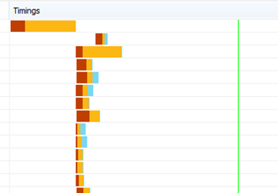

# SharePoint Online のパフォーマンスの問題の診断Diagnosing performance issues with SharePoint Online

この記事では、Internet Explorer 開発者ツールを使用して SharePoint Online サイトの一般的な問題を診断する方法について説明します。This article shows you how you can diagnose common issues with your SharePoint Online site using Internet Explorer developer tools.
  
SharePoint Online サイトのページに、カスタマイズに関するパフォーマンス上の問題があることを特定するには、3種類の方法があります。There are three different ways that you can identify that a page on a SharePoint Online site has a performance problem with the customizations.
  
- F12 ツールバーのネットワークモニターThe F12 tool bar network monitor
    
- カスタマイズされていない基準を比較するComparison to a non-customized baseline
    
- SharePoint Online 応答ヘッダーの指標SharePoint Online response header metrics
    
このトピックでは、これらの各方法を使用して、パフォーマンスの問題を診断する方法について説明します。This topic describes how to use each of these methods to diagnose performance issues. 問題の原因を特定したら、SharePoint のパフォーマンスの向上に関する記事を使用して、ソリューションに向かって作業することがhttp://aka.ms/tuneできます。Once you've figured out the cause of the problem, you can work toward a solution using the articles about improving SharePoint performance that you can find on http://aka.ms/tune.
  
## F12 ツールバーを使用して SharePoint Online のパフォーマンスを診断するUsing the F12 tool bar to diagnose performance in SharePoint Online

この記事では、Internet Explorer 11 を使用します。In this article we use Internet Explorer 11. 他のブラウザーの F12 開発者ツールのバージョンは、同様の機能を備えていますが、外観が若干異なる場合があります。Versions of the F12 developer tools on other browsers have similar features though they may look slightly different. F12 開発者ツールの詳細については、以下を参照してください。For information on the F12 developer tools, see:
  
- [F12 ツールの新機能What's new in F12 Tools](https://go.microsoft.com/fwlink/p/?LinkId=522545)
    
- 
  [F12 開発者ツールの使用](https://go.microsoft.com/fwlink/p/?LinkId=522546)[Using the F12 developer tools](https://go.microsoft.com/fwlink/p/?LinkId=522546)
    
開発者ツールを起動するには、 **F12**キーを押してから、wi-fi アイコンをクリックします。To bring up the developer tools press **F12** and then click the Wi-Fi icon: 
  

  
[**ネットワーク**] タブで、緑色の再生ボタンを押してページをロードします。On the **Network** tab, press the green play button to load a page. このツールは、要求されたページを取得するために、ブラウザーが要求するすべてのファイルを返します。The tool returns all of the files that the browser requests in order to get the page you asked for. 次のスクリーンショットは、このような一覧を示しています。The following screen shot shows one such list. 
  

  
このスクリーンショットに示されているように、右側のファイルのダウンロード時間を確認することもできます。You can also see the download times of the files on the right side as shown in this screen shot.
  

  
これにより、ファイルの読み込みにかかった時間を視覚的に表現できます。This gives you a visual representation of how long the file took to load. 緑色の線は、ページがブラウザーでレンダリングできる状態になったことを表します。The green line represents when the page is ready to be rendered by the browser. これにより、サイトでのページの読み込みが低速になる原因となる可能性のあるさまざまなファイルを簡単に確認できます。This can give you a quick view of the different files that might be causing slow page loads on your site.
  
## SharePoint Online のカスタマイズされていないベースラインの設定Setting up a non-customized baseline for SharePoint Online

サイトのパフォーマンスの強度を判断する最良の方法は、SharePoint Online に完全に使用されていないサイトコレクションをセットアップすることです。The best way to determine your site's performance weak points is to set up a completely out-of-the-box site collection in SharePoint Online. このようにすると、サイトのさまざまな要素を、ページ上でカスタマイズしなくても、その内容と比較できます。This way you can compare all the various aspects of your site with what you would get with no customization on the page. OneDrive for Business ホームページは、カスタマイズが必要となる可能性がある別のサイトコレクションの良い例です。The OneDrive for Business home page is a good example of a separate site collection that is unlikely to have any customizations.
  
## SharePoint 応答ヘッダー情報を表示するViewing SharePoint response header information

SharePoint Online と SharePoint Server 2013 では、各ファイルの応答ヘッダーでブラウザーに送り返される情報にアクセスできます。In SharePoint Online and SharePoint Server 2013 you can access the information that is sent back to the browser in the response header for each file. パフォーマンスの問題を診断するための最も有用な2つの値は、SPRequestDuration および SharePointHealthScore です。The two most useful values for diagnosing performance issues are SPRequestDuration and X-SharePointHealthScore:
  
- **SPRequestDuration****SPRequestDuration**
    
    これは、要求がサーバーで処理されるのにかかった時間の長さです。This is the amount of time that the request took on the server to be processed. これにより、要求が非常に重いもので、リソースを大量に消費しているかどうかを判断できます。This can help determine if the request is very heavy and resource intensive. これは、サーバーがページにサービスを提供するために実行している作業の量を理解するのに最適です。This is the best insight you have into how much work the server is doing to serve the page.
    
- **SharePointHealthScore****X-SharePointHealthScore**
    
    これは、SharePoint インスタンスが実行されているサーバーまたは CPU の使用率を示します。This indicates the utilization of the server, or CPU, on which your SharePoint instance runs. この数は0から10の範囲です。0はサーバーがアイドル状態であることを示し、10はサーバーがビジーであることを示します。This number ranges from 0 to 10 where 0 indicates the server is idle and 10 indicates the server is very busy. 常に9または10になる正常性スコアは、サーバーのパフォーマンスに関する継続的な問題を示している可能性があります。A HealthScore that is consistently 9 or 10 might indicate an ongoing performance issue with the server. その他の番号は、サーバーが予期された範囲内で動作していることを示します。Any other number indicates that server is operating within the expected range.
    
 **SharePoint 応答ヘッダー情報を表示するには****To view SharePoint response header information**
  
1. F12 ツールがインストールされていることを確認します。Ensure that you have the F12 tools installed. これらのツールのダウンロードとインストールの詳細については、「 [F12 ツールの新機能](https://go.microsoft.com/fwlink/p/?LinkId=522545)」を参照してください。For more information on downloading and installing these tools, see [What's new in F12 tools](https://go.microsoft.com/fwlink/p/?LinkId=522545).
    
2. F12 ツールの [**ネットワーク**] タブで、緑色の再生ボタンを押してページを読み込みます。In the F12 tools, on the **Network** tab, press the green play button to load a page. 
    
3. ツールによって返される .aspx ファイルのいずれかをクリックし、[**詳細**] をクリックします。Click one of the .aspx files returned by the tool and then click **DETAILS**. 
    
    
  
4. [**応答ヘッダー**] をクリックします。Click **Response headers**. 
    
    
  
## SharePoint Online でパフォーマンスの問題が発生する原因What's causing performance issues in SharePoint Online?

「 [SharePoint Online のナビゲーションオプション](navigation-options-for-sharepoint-online.md)」では、SPRequestDuration 値を使用して、複雑な構造ナビゲーションによって、ページの処理に長い時間がかかることを判断する例を示します。The article [Navigation options for SharePoint Online](navigation-options-for-sharepoint-online.md) shows an example of using the SPRequestDuration value to determine that the complicated structural navigation was causing the page to take a long time to process on the server. ベースラインサイト (カスタマイズなし) の値を取得することによって、特定のファイルの読み込みに時間がかかるかどうかを判断できます。By taking a value for a baseline site (without customization), it is possible to determine if any given file is taking a long time to load. [SharePoint Online のナビゲーションオプション](navigation-options-for-sharepoint-online.md)で使用されている例は、主に .aspx ファイルです。The example used in [Navigation options for SharePoint Online](navigation-options-for-sharepoint-online.md) is the main .aspx file. このファイルには、ページの読み込みに対して実行される ASP.NET コードの大部分が含まれています。That file contains most of the ASP.NET code that runs for your page load. 使用するサイトテンプレートによっては、ホームページをカスタマイズする場合、default.aspx、default.aspx、default.aspx、またはその他の名前の場合があります。Depending on the site template you use, this could be start.aspx, home.aspx, default.aspx, or another name if you customize the home page. この数値がベースラインサイトよりかなり大きい場合は、パフォーマンスの問題を発生させる、ページに複雑な処理が発生していることを示しています。If this number is considerably higher than your baseline site, then it's a good indication that there is something complex going on in your page that is causing performance issues. 
  
サイトに固有の問題を特定した後、パフォーマンスが低下していることを確認するには、ページのカスタマイズなど、考えられるすべての原因を除去して、それらを1つずつサイトに追加することをお勧めします。Once you have identified that an issue specific to your site, the recommended way to figure out what is causing poor performance is to eliminate all of the possible causes, like page customizations, and then add them back to the site one by one. ページが正常に実行されているカスタマイズを削除すると、特定のカスタマイズを1つずつ追加することができます。Once you have removed enough customizations that the page is performing well, you can then add back specific customizations one by one.
  
たとえば、非常に複雑なナビゲーションの場合は、サブサイトを表示しないようにナビゲーションを変更してから、開発者ツールをチェックして、それに違いがあるかどうかを確認します。For example, if you have a very complex navigation try changing the navigation to not show sub-sites then check the developer tools to see if this makes a difference. または、大量のコンテンツロールアップを使用している場合は、それらをページから削除して、問題が改善されるかどうかを確認します。Or if you have a large amount of content roll-ups try removing them from your page and see if this improves things. 考えられる原因をすべて排除して、一度に1つずつ追加し直すと、どの機能が最大の問題であるかを簡単に特定して、ソリューションに向けて作業できます。If you eliminate all of the possible causes and add them back in one at a time, you can easily identify which features are the biggest problem and then work towards a solution.
  

