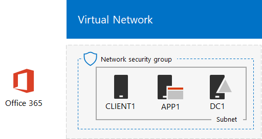

# <a name="directory-synchronization-for-your-office-365-devtest-environment"></a>Office 365 開発/テスト環境のディレクトリ同期

 **概要:** Office 365 の開発/テスト環境に向けたディレクトリ同期を構成します。
  
多くの組織は、Azure AD Connect とディレクトリ同期を使用して、オンプレミスの Windows Server Active Directory (AD) フォレスト内のアカウントのセットを Office 365 内のアカウントのセットに同期しています。この記事では、パスワード ハッシュ同期を伴うディレクトリ同期を Office 365 開発/テスト環境に追加する方法について説明します。最終的な構成は、次のとおりになります。
  

  
この構成は、次の内容で成立します。 
  
- Office 365 E5 試用版サブスクリプション。このサブスクリプションは、作成時から 30 日で有効期限が切れます。
- インターネットに接続する組織の簡易型イントラネット。Azure 仮想ネットワークのサブネット上に配置された 3 つの仮想マシン (DC1、APP1、および CLIENT1) で構成されます。Azure AD Connect は、Windows Server AD ドメインを Office 365 に同期するために APP1 で実行します。
    
この開発/テスト環境は、次に示す 2 つのフェーズで構成します。
  
1. Office 365 の開発/テスト環境を作成します (Azure 仮想ネットワーク内の仮想マシン DC1、APP1、および CLIENT1 と、Office 365 E5 試用版サブスクリプションによる環境)。
2. APP1 に Azure AD Connect をインストールして構成します。
    
> [!TIP]
> [ここ](http://aka.ms/catlgstack)をクリックして、One Microsoft Cloud のテスト ラボ ガイド スタックに含まれるすべての記事のビジュアル マップを確認してください。
  
## <a name="phase-1-create-an-office-365-devtest-environment"></a>フェーズ 1: Office 365 の開発/テスト環境を作成する

[Office 365 開発/テスト環境](office-365-dev-test-environment.md)記事のフェーズ 1、2、および 3 の指示に従ってください。最終的な構成は、次のようになります。
  

  
この構成は、次の内容で成立します。 
  
- Office 365 E5 試用版サブスクリプション。
- インターネットに接続する組織の簡易型イントラネット。Azure 仮想ネットワークのサブネット上に配置された仮想マシン DC1、APP1、および CLIENT1 で構成されます。
    
## <a name="phase-2-install-azure-ad-connect-on-app1"></a>フェーズ 2: APP1 に Azure AD Connect をインストールする

インストールと構成が完了すると、Azure AD Connect は CORP Windows Server AD ドメインのアカウントのセットを Office 365 試用版サブスクリプションのアカウントのセットと同期します。次に示す手順を実行して、APP1 に Azure AD をインストールして、その動作を確認します。
  
### <a name="install-and-configure-azure-ad-connect-on-app1"></a>APP1 上での Azure AD Connect のインストールと構成

1. [Azure portal](https://portal.azure.com) から、CORP\\User1 アカウントを使用して APP1 に接続します。
    
2. APP1 から、管理者レベルの Windows PowerShell コマンド プロンプトを起動して、次に示すコマンドを実行します。
    
  ```
  Set-ItemProperty -Path "HKLM:\SOFTWARE\Microsoft\Active Setup\Installed Components\{A509B1A7-37EF-4b3f-8CFC-4F3A74704073}" -Name "IsInstalled" -Value 0
Set-ItemProperty -Path "HKLM:\SOFTWARE\Microsoft\Active Setup\Installed Components\{A509B1A8-37EF-4b3f-8CFC-4F3A74704073}" -Name "IsInstalled" -Value 0
Stop-Process -Name Explorer -Force

  ```

3. タスク バーで **[Internet Explorer]** をクリックし、[https://aka.ms/aadconnect](https://aka.ms/aadconnect)に移動します。
    
4. [Microsoft Azure Active Directory Connect] ページで、**[ダウンロード]** をクリックして、**[実行]** をクリックします。
    
5. **[Azure AD Connect へようこそ]** ページで、**[同意する]** をクリックして、**[続行]** をクリックします。
    
6. **[簡単設定]** ページで、**[簡単設定を使う]** をクリックします。
    
7. **[Azure AD に接続]** ページで、**[ユーザー名]** に全体管理者のアカウント名、**[パスワード]** にそのパスワードを入力して、**[次へ]** をクリックします。
    
8. **[AD DS に接続]** ページで、**[ユーザー名]** に **CORP\\User1**、**[パスワード]** にそのパスワードを入力して、**[次へ]** をクリックします。
    
9. **[Azure AD サインインの構成]** ページで、**[検証済みのドメインなしで続行する]** をクリックして、**[次へ]** をクリックします。
    
10. **[構成の準備完了]** ページで、**[インストール]** をクリックします。
    
11. **[構成が完了しました]** ページで、**[終了]** をクリックします。
    
12. Internet Explorer で Microsoft 365 管理センター ([https://admin.microsoft.com](https://admin.microsoft.com)) に移動し、グローバル管理者アカウントで Office 365 試用版サブスクリプションにサインインします。
    
13. ポータルのメイン ページで、**[管理]** をクリックします。
    
14. 左側のナビゲーションで、**[ユーザー] > [アクティブなユーザー]** をクリックします。
    
    **User1** という名前のアカウントを記録します。これは CORP Windows Server AD ドメインからのアカウントであり、ディレクトリ同期が機能していることを証明します。
    
15. **[User1]** アカウントをクリックします。製品ライセンスの **[編集]** をクリックします。
    
16. **[製品ライセンス]** で、国を選択してから、**[Office 365 Enterprise E5]** の **[オフ]** コントロールをクリックします (**[オン]** への切り替えが行われます)。ページの下部にある **[保存]** をクリックしてから、**[閉じる]** をクリックします。
    
最終的な構成を示します。
  

  
この構成は、次の内容で成立します。 
  
- Office 365 E5 試用版サブスクリプション。
- インターネットに接続する組織の簡易型イントラネット。Azure 仮想ネットワークのサブネット上に配置された仮想マシン DC1、APP1、および CLIENT1 で構成されます。Azure AD Connect は APP1 上で実行され、CORP Windows Server AD ドメインを 30 分ごとに Office 365 に同期します。
    
## <a name="next-step"></a>次の手順

組織のディレクトリ同期を展開する準備ができたら、「[Microsoft Azure での Office 365 ディレクトリ同期の展開](deploy-office-365-directory-synchronization-dirsync-in-microsoft-azure.md)」を参照してください。

## <a name="see-also"></a>関連項目

[クラウド導入のテスト ラボ ガイド (TLG)](cloud-adoption-test-lab-guides-tlgs.md)

[基本構成開発/テスト環境](base-configuration-dev-test-environment.md)

[Office 365 開発/テスト環境](office-365-dev-test-environment.md)

[Office 365 開発/テスト環境の Cloud App Security](cloud-app-security-for-your-office-365-dev-test-environment.md)

[Office 365 開発/テスト環境の Advanced Threat Protection](advanced-threat-protection-for-your-office-365-dev-test-environment.md)

[クラウド導入およびハイブリッド ソリューション](cloud-adoption-and-hybrid-solutions.md)


