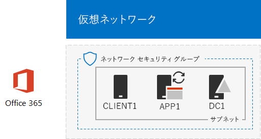

# <a name="directory-synchronization-for-your-office-365-devtest-environment"></a><span data-ttu-id="6e61b-103">Office 365 開発/テスト環境のディレクトリ同期</span><span class="sxs-lookup"><span data-stu-id="6e61b-103">Directory synchronization for your Office 365 dev/test environment</span></span>

 <span data-ttu-id="6e61b-104">**概要:** Office 365 の開発/テスト環境に向けたディレクトリ同期を構成します。</span><span class="sxs-lookup"><span data-stu-id="6e61b-104">**Summary:** Configure directory synchronization for your Office 365 dev/test environment.</span></span>
  
<span data-ttu-id="6e61b-p101">多くの組織は、Azure AD Connect とディレクトリ同期を使用して、オンプレミスの Windows Server Active Directory (AD) フォレスト内のアカウントのセットを Office 365 内のアカウントのセットに同期しています。この記事では、パスワード ハッシュ同期を伴うディレクトリ同期を Office 365 開発/テスト環境に追加する方法について説明します。最終的な構成は、次のとおりになります。</span><span class="sxs-lookup"><span data-stu-id="6e61b-p101">Many organizations use Azure AD Connect and directory synchronization to synchronize the set of accounts in their on-premises Windows Server Active Directory (AD) forest to the set of accounts in Office 365. This article describes how you can add directory synchronization with password hash synchronization to the Office 365 dev/test environment, resulting in the following configuration.</span></span>
  

  
<span data-ttu-id="6e61b-108">この構成は、次の内容で成立します。</span><span class="sxs-lookup"><span data-stu-id="6e61b-108">This configuration consists of:</span></span> 
  
- <span data-ttu-id="6e61b-109">Office 365 E5 試用版サブスクリプション。このサブスクリプションは、作成時から 30 日で有効期限が切れます。</span><span class="sxs-lookup"><span data-stu-id="6e61b-109">An Office 365 E5 Trial Subscription, which expires 30 days from when you create it.</span></span>
- <span data-ttu-id="6e61b-p102">インターネットに接続する組織の簡易型イントラネット。Azure 仮想ネットワークのサブネット上に配置された 3 つの仮想マシン (DC1、APP1、および CLIENT1) で構成されます。Azure AD Connect は、Windows Server AD ドメインを Office 365 に同期するために APP1 で実行します。</span><span class="sxs-lookup"><span data-stu-id="6e61b-p102">A simplified organization intranet connected to the Internet, consisting of three virtual machines on a subnet of an Azure virtual network (DC1, APP1, and CLIENT1). Azure AD Connect runs on APP1 to synchronize the Windows Server AD domain to Office 365.</span></span>
    
<span data-ttu-id="6e61b-112">この開発/テスト環境は、次に示す 2 つのフェーズで構成します。</span><span class="sxs-lookup"><span data-stu-id="6e61b-112">There are two phases to setting up this dev/test environment:</span></span>
  
1. <span data-ttu-id="6e61b-113">Office 365 の開発/テスト環境を作成します (Azure 仮想ネットワーク内の仮想マシン DC1、APP1、および CLIENT1 と、Office 365 E5 試用版サブスクリプションによる環境)。</span><span class="sxs-lookup"><span data-stu-id="6e61b-113">Create the Office 365 dev/test environment (the DC1, APP1, and CLIENT1 virtual machines in an Azure virtual network with an Office 365 E5 trial subscription).</span></span>
2. <span data-ttu-id="6e61b-114">APP1 に Azure AD Connect をインストールして構成します。</span><span class="sxs-lookup"><span data-stu-id="6e61b-114">Install and configure Azure AD Connect on APP1.</span></span>
    
> [!TIP]
> <span data-ttu-id="6e61b-115">[ここ](http://aka.ms/catlgstack)をクリックして、One Microsoft Cloud のテスト ラボ ガイド スタックに含まれるすべての記事のビジュアル マップを確認してください。</span><span class="sxs-lookup"><span data-stu-id="6e61b-115">Click [here](http://aka.ms/catlgstack) for a visual map to all the articles in the One Microsoft Cloud Test Lab Guide stack.</span></span>
  
## <a name="phase-1-create-an-office-365-devtest-environment"></a><span data-ttu-id="6e61b-116">フェーズ 1: Office 365 の開発/テスト環境を作成する</span><span class="sxs-lookup"><span data-stu-id="6e61b-116">Phase 1: Create an Office 365 dev/test environment</span></span>

<span data-ttu-id="6e61b-p103">[Office 365 開発/テスト環境](office-365-dev-test-environment.md)記事のフェーズ 1、2、および 3 の指示に従ってください。最終的な構成は、次のようになります。</span><span class="sxs-lookup"><span data-stu-id="6e61b-p103">Follow the instructions in phases 1, 2, and 3 of the [Office 365 dev/test environment](office-365-dev-test-environment.md) article. Here is the resulting configuration.</span></span>
  

  
<span data-ttu-id="6e61b-120">この構成は、次の内容で成立します。</span><span class="sxs-lookup"><span data-stu-id="6e61b-120">This configuration consists of:</span></span> 
  
- <span data-ttu-id="6e61b-121">Office 365 E5 試用版サブスクリプション。</span><span class="sxs-lookup"><span data-stu-id="6e61b-121">An Office 365 E5 Trial Subscription.</span></span>
- <span data-ttu-id="6e61b-122">インターネットに接続する組織の簡易型イントラネット。Azure 仮想ネットワークのサブネット上に配置された仮想マシン DC1、APP1、および CLIENT1 で構成されます。</span><span class="sxs-lookup"><span data-stu-id="6e61b-122">A simplified organization intranet connected to the Internet, consisting of the DC1, APP1, and CLIENT1 virtual machines on a subnet of an Azure virtual network.</span></span>
    
## <a name="phase-2-install-azure-ad-connect-on-app1"></a><span data-ttu-id="6e61b-123">フェーズ 2: APP1 に Azure AD Connect をインストールする</span><span class="sxs-lookup"><span data-stu-id="6e61b-123">Phase 2: Install Azure AD Connect on APP1</span></span>

<span data-ttu-id="6e61b-p104">インストールと構成が済ませてあると、Azure AD Connect は CORP Windows Server AD ドメインのアカウントのセットを Office 365 試用版サブスクリプションのアカウントのセットと同期します。次に示す手順を実行して、APP1 に Azure AD をインストールして、その動作を確認します。</span><span class="sxs-lookup"><span data-stu-id="6e61b-p104">Once installed and configured, Azure AD Connect synchronizes the set of accounts in the CORP Windows Server AD domain with the set of accounts in your Office 365 trial subscription. The following procedure steps you through installing Azure AD Connect on APP1 and verifying that it works.</span></span>
  
### <a name="install-and-configure-azure-ad-connect-on-app1"></a><span data-ttu-id="6e61b-126">APP1 上での Azure AD Connect のインストールと構成</span><span class="sxs-lookup"><span data-stu-id="6e61b-126">Install and configure Azure AD Connect on APP1</span></span>

1. <span data-ttu-id="6e61b-127">[Azure portal](https://portal.azure.com) から、CORP\\User1 アカウントを使用して APP1 に接続します。</span><span class="sxs-lookup"><span data-stu-id="6e61b-127">From the [Azure portal](https://portal.azure.com), connect to APP1 with the CORP\\User1 account.</span></span>
    
2. <span data-ttu-id="6e61b-128">APP1 から、管理者レベルの Windows PowerShell コマンド プロンプトを起動して、次に示すコマンドを実行します。</span><span class="sxs-lookup"><span data-stu-id="6e61b-128">From APP1, open an administrator-level Windows PowerShell command prompt, and then run these commands:</span></span>
    
  ```
  Set-ItemProperty -Path "HKLM:\SOFTWARE\Microsoft\Active Setup\Installed Components\{A509B1A7-37EF-4b3f-8CFC-4F3A74704073}" -Name "IsInstalled" -Value 0
Set-ItemProperty -Path "HKLM:\SOFTWARE\Microsoft\Active Setup\Installed Components\{A509B1A8-37EF-4b3f-8CFC-4F3A74704073}" -Name "IsInstalled" -Value 0
Stop-Process -Name Explorer -Force

  ```

3. <span data-ttu-id="6e61b-129">タスク バーで **[Internet Explorer]** をクリックし、[https://aka.ms/aadconnect](https://aka.ms/aadconnect)に移動します。</span><span class="sxs-lookup"><span data-stu-id="6e61b-129">From the task bar, click **Internet Explorer** and go to [https://aka.ms/aadconnect](https://aka.ms/aadconnect).</span></span>
    
4. <span data-ttu-id="6e61b-130">[Microsoft Azure Active Directory Connect] ページで、**[ダウンロード]** をクリックして、**[実行]** をクリックします。</span><span class="sxs-lookup"><span data-stu-id="6e61b-130">On the Microsoft Azure Active Directory Connect page, click **Download**, and then click **Run**.</span></span>
    
5. <span data-ttu-id="6e61b-131">**[Azure AD Connect へようこそ]** ページで、**[同意する]** をクリックして、**[続行]** をクリックします。</span><span class="sxs-lookup"><span data-stu-id="6e61b-131">On the **Welcome to Azure AD Connect** page, click **I agree**, and then click **Continue**.</span></span>
    
6. <span data-ttu-id="6e61b-132">**[簡単設定]** ページで、**[簡単設定を使う]** をクリックします。</span><span class="sxs-lookup"><span data-stu-id="6e61b-132">On the **Express Settings** page, click **Use express settings**.</span></span>
    
7. <span data-ttu-id="6e61b-133">**[Azure AD に接続]** ページで、**[ユーザー名]** に全体管理者のアカウント名、**[パスワード]** にそのパスワードを入力して、**[次へ]** をクリックします。</span><span class="sxs-lookup"><span data-stu-id="6e61b-133">On the **Connect to Azure AD** page, type your global administrator account name in **Username,** type its password in **Password**, and then click **Next**.</span></span>
    
8. <span data-ttu-id="6e61b-134">**[AD DS に接続]** ページで、**[ユーザー名]** に **CORP\\User1**、**[パスワード]** にそのパスワードを入力して、**[次へ]** をクリックします。</span><span class="sxs-lookup"><span data-stu-id="6e61b-134">On the **Connect to AD DS** page, type **CORP\\User1** in **Username,** type its password in **Password**, and then click **Next**.</span></span>
    
9. <span data-ttu-id="6e61b-135">**[Azure AD サインインの構成]** ページで、**[検証済みのドメインなしで続行する]** をクリックして、**[次へ]** をクリックします。</span><span class="sxs-lookup"><span data-stu-id="6e61b-135">On the **Azure AD sign-in configuration** page, click **Continue without any verified domains**, and then click **Next**.</span></span>
    
10. <span data-ttu-id="6e61b-136">**[構成の準備完了]** ページで、**[インストール]** をクリックします。</span><span class="sxs-lookup"><span data-stu-id="6e61b-136">On the **Ready to configure** page, click **Install**.</span></span>
    
11. <span data-ttu-id="6e61b-137">**[構成が完了しました]** ページで、**[終了]** をクリックします。</span><span class="sxs-lookup"><span data-stu-id="6e61b-137">On the **Configuration complete** page, click **Exit**.</span></span>
    
12. <span data-ttu-id="6e61b-138">Internet Explorer で Office 365 ポータル ([https://portal.office.com](https://portal.office.com)) に移動し、グローバル管理者アカウントで Office 365 試用版サブスクリプションにサインインします。</span><span class="sxs-lookup"><span data-stu-id="6e61b-138">In Internet Explorer, go to the Office 365 portal ([https://portal.office.com](https://portal.office.com)) and sign in to your Office 365 trial subscription with your global administrator account.</span></span>
    
13. <span data-ttu-id="6e61b-139">ポータルのメイン ページで、**[管理]** をクリックします。</span><span class="sxs-lookup"><span data-stu-id="6e61b-139">From the main portal page, click **Admin**.</span></span>
    
14. <span data-ttu-id="6e61b-140">左側のナビゲーションで、**[ユーザー] > [アクティブなユーザー]** をクリックします。</span><span class="sxs-lookup"><span data-stu-id="6e61b-140">In the left navigation, click **Users > Active users**.</span></span>
    
    <span data-ttu-id="6e61b-p105">**User1** という名前のアカウントを記録します。これは CORP Windows Server AD ドメインからのアカウントであり、ディレクトリ同期が機能していることを証明します。</span><span class="sxs-lookup"><span data-stu-id="6e61b-p105">Note the account named **User1**. This account is from the CORP Windows Server AD domain and is proof that directory synchronization has worked.</span></span>
    
15. <span data-ttu-id="6e61b-p106">**[User1]** アカウントをクリックします。製品ライセンスの **[編集]** をクリックします。</span><span class="sxs-lookup"><span data-stu-id="6e61b-p106">Click the **User1** account. For product licenses, click **Edit**.</span></span>
    
16. <span data-ttu-id="6e61b-p107">**[製品ライセンス]** で、国を選択してから、**[Office 365 Enterprise E5]** の **[オフ]** コントロールをクリックします (**[オン]** への切り替えが行われます)。ページの下部にある **[保存]** をクリックしてから、**[閉じる]** をクリックします。</span><span class="sxs-lookup"><span data-stu-id="6e61b-p107">In **Product licenses**, select your country, and then click the **Off** control for **Office 365 Enterprise E5** (switching it to **On**). Click **Save** at the bottom of the page, and then click **Close**.</span></span>
    
<span data-ttu-id="6e61b-147">最終的な構成を示します。</span><span class="sxs-lookup"><span data-stu-id="6e61b-147">This is the resulting configuration.</span></span>
  

  
<span data-ttu-id="6e61b-149">この構成は、次の内容で成立します。</span><span class="sxs-lookup"><span data-stu-id="6e61b-149">This configuration consists of:</span></span> 
  
- <span data-ttu-id="6e61b-150">Office 365 E5 試用版サブスクリプション。</span><span class="sxs-lookup"><span data-stu-id="6e61b-150">An Office 365 E5 Trial Subscription.</span></span>
- <span data-ttu-id="6e61b-p108">インターネットに接続する組織の簡易型イントラネット。Azure 仮想ネットワークのサブネット上に配置された仮想マシン DC1、APP1、および CLIENT1 で構成されます。Azure AD Connect は APP1 上で実行され、CORP Windows Server AD ドメインを 30 分ごとに Office 365 に同期します。</span><span class="sxs-lookup"><span data-stu-id="6e61b-p108">A simplified organization intranet connected to the Internet, consisting of the DC1, APP1, and CLIENT1 virtual machines on a subnet of an Azure virtual network. Azure AD Connect runs on APP1 to synchronize the CORP Windows Server AD domain to Office 365 every 30 minutes.</span></span>
    
## <a name="next-step"></a><span data-ttu-id="6e61b-153">次の手順</span><span class="sxs-lookup"><span data-stu-id="6e61b-153">Next Step</span></span>

<span data-ttu-id="6e61b-154">組織のディレクトリ同期を展開する準備ができたら、「[Microsoft Azure での Office 365 ディレクトリ同期の展開](deploy-office-365-directory-synchronization-dirsync-in-microsoft-azure.md)」を参照してください。</span><span class="sxs-lookup"><span data-stu-id="6e61b-154">When you are ready to deploy directory synchronization for your organization, see [Deploy Office 365 directory synchronization in Microsoft Azure](deploy-office-365-directory-synchronization-dirsync-in-microsoft-azure.md).</span></span>

## <a name="see-also"></a><span data-ttu-id="6e61b-155">関連項目</span><span class="sxs-lookup"><span data-stu-id="6e61b-155">See Also</span></span>

[<span data-ttu-id="6e61b-156">クラウド導入のテスト ラボ ガイド (TLG)</span><span class="sxs-lookup"><span data-stu-id="6e61b-156">Cloud adoption Test Lab Guides (TLGs)</span></span>](cloud-adoption-test-lab-guides-tlgs.md)

[<span data-ttu-id="6e61b-157">基本構成開発/テスト環境</span><span class="sxs-lookup"><span data-stu-id="6e61b-157">Base Configuration dev/test environment</span></span>](base-configuration-dev-test-environment.md)

[<span data-ttu-id="6e61b-158">Office 365 開発/テスト環境</span><span class="sxs-lookup"><span data-stu-id="6e61b-158">Office 365 dev/test environment</span></span>](office-365-dev-test-environment.md)

[<span data-ttu-id="6e61b-159">Office 365 開発/テスト環境の Cloud App Security</span><span class="sxs-lookup"><span data-stu-id="6e61b-159">Cloud App Security for your Office 365 dev/test environment</span></span>](cloud-app-security-for-your-office-365-dev-test-environment.md)

[<span data-ttu-id="6e61b-160">Office 365 開発/テスト環境の Advanced Threat Protection</span><span class="sxs-lookup"><span data-stu-id="6e61b-160">Advanced Threat Protection for your Office 365 dev/test environment</span></span>](advanced-threat-protection-for-your-office-365-dev-test-environment.md)

[<span data-ttu-id="6e61b-161">クラウド導入およびハイブリッド ソリューション</span><span class="sxs-lookup"><span data-stu-id="6e61b-161">Cloud adoption and hybrid solutions</span></span>](cloud-adoption-and-hybrid-solutions.md)


