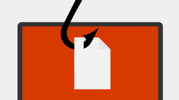
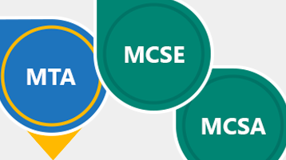

# エンタープライズ組織および Office 365

IT 専門家がスタッフを持つ大規模な組織では、環境を維持するための特定の要件と基準があります。 エンタープライズ向けに Office 365 を計画し、管理するために必要な情報は次のとおりです。
  

> [!VIDEO https://www.microsoft.com/videoplayer/embed/d08b637c-66dc-4f0e-afc2-56da92e99589?autoplay=false]
  
## 主なリソース

  
 **FastTrack からサポートを受ける**
  
FastTrack のヘルプを使用して、Office 365 へのデータの計画、セットアップ、移行を行います。
  
[FastTrack で取得する](https://go.microsoft.com/fwlink/?linkid=238431)
  

  
 **セキュリティ &amp; コンプライアンス**
  
データを保護し、法律または規制基準に準拠します。
  
[Office 365 のセキュリティコンプライアンスの概要 &amp;](https://support.office.com/article/dcb83b2c-ac66-4ced-925d-50eb9698a0b2)
  

  
 **クラウドアーキテクチャについて**
  
エンタープライズクラウドに関するアーキテクチャポスターを参照してください。
  
[ポスターを取得する](https://aka.ms/cloudarch)
  

  
 **一般的な攻撃について**
  
Microsoft が組織の保護を支援する方法について説明します。
  
[ポスターをダウンロードする](https://aka.ms/commonattacks)
  
## IT 担当者向けトレーニング

  
 **IT プロフェッショナル向けトレーニング**
  
LinkedIn Learning が提供する無料のビデオコースを見つけることができます。
  
[高度なトレーニング](https://support.office.com/article/68cc9b95-0bdc-491e-a81f-ee70b3ec63c5.aspx)
  

  
 **Microsoft Learning**
  
Office 365 の IT 担当者向けのトレーニングと認定。
  
[よく使用されるトレーニング](https://go.microsoft.com/fwlink/?linkid=826247)
  

  
 **仮想 Academy**
  
Microsoft Virtual Academy のエキスパートから学ぶことができます。
  
[コースの参照](https://go.microsoft.com/fwlink/?linkid=826248)
  

  
 **edX 大学**
  
Office 365 IT 担当者向けの自習用オンライン学習エクスペリエンス。
  
[今すぐ登録](https://go.microsoft.com/fwlink/?linkid=852994)
  
## おすすめの記事

[ビジネス製品についてサポートに問い合わせる - 管理者ヘルプ](https://support.office.com/article/32a17ca7-6fa0-4870-8a8d-e25ba4ccfd4b)
  
[Windows 用の新しい OneDrive 同期クライアントを展開する](https://support.office.com/article/3f3a511c-30c6-404a-98bf-76f95c519668)
  
[複数のメール アカウントを Office 365 に移行する方法](https://support.office.com/article/0a4913fe-60fb-498f-9155-a86516418842)
  
[Office 2010 サーバー/クライアントからアップグレードする](upgrade-from-office-2010-servers-and-products.md)
  
[Office 365 サービスのセットアップガイド](setup-guides-for-office-365.md)
  
 **エンド ユーザー向けのトレーニング**
  
[Office 365 の生産性トレーニング](https://support.office.com/article/af07cb6b-980d-4f33-8599-322582767408)
  
[ビデオ: Office 365 とは何ですか。](https://support.office.com/article/847caf12-2589-452c-8aca-1c009797678b)
  
 **開発リソース**
  
[Office デベロッパー センター](https://go.microsoft.com/fwlink/?linkid=615418)
  

