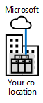
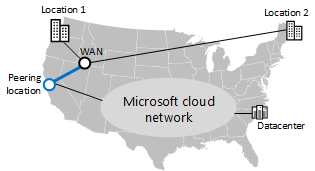

# Microsoft クラウド接続のためのExpressRoute

 **概要:** ExpressRoute による Microsoft のクラウド サービスとプラットフォームへのより早く信頼できる接続が、どのように役立つか説明します。
  
ExpressRoute は、Microsoft のクラウドへのプライベート、専用、高スループットのネットワーク接続を提供します。
  
## Microsoft クラウドへの ExpressRoute

次の図は、ExpressRoute 接続を使用していない場合の Microsoft クラウドへのネットワーク パスを示しています。
  
**図 1:ExpressRoute のないネットワーク パス**

  
図 1 は、オンプレミスのネットワークと Microsoft クラウドとの間の一般的なパスを示しています。オンプレミスのネットワーク エッジは、ISP への WAN リンクを経由してインターネットに接続しています。トラフィックは、インターネットを通過して Microsoft クラウドのエッジに到達します。Microsoft クラウド内のクラウド サービスには、Office 365、Microsoft Azure、Microsoft Intune、Dynamics 365 があります。組織のユーザーは、オンプレミスのネットワークに配置することも、インターネットに配置することもできます。
  
ExpressRoute 接続がない場合、Microsoft クラウドへのトラフィック パスのうち制御可能な部分 (またサービス プロバイダーとの関係がある部分) は、オンプレミスのネットワーク エッジと ISP との間のリンクのみになります。 
  
ISP と Microsoft クラウド エッジとの間のパスは、インターネット上のベストエフォート配信システムになります。インターネットには、停止、トラフィックの輻輳、および悪意のあるユーザーによる監視の恐れがあります。
  
インターネット上のユーザー (ローミング ユーザーやリモート ユーザー) は、Microsoft クラウドへのトラフィックをインターネット経由で送信します。
  
次の図は、ExpressRoute 接続を使用している場合の Microsoft クラウドへのネットワーク パスを示しています。
  
**図 2: ExpressRoute のあるネットワーク パス**

  
図 2 は、2 つのネットワーク パスを示しています。Microsoft Intune へのトラフィックは、通常のインターネットのトラフィックと同じパスを通過します。Office 365、Microsoft Azure、Dynamics 365 へのトラフィックは、ExpressRoute 接続を通過します。この接続は、オンプレミス ネットワークのエッジと Microsoft クラウドのエッジとの間の専用パスです。
  
ExpressRoute 接続では、ここで、サービス ・ プロバイダーとの関係によって、コントロール、クラウドのエッジ、エッジからマイクロソフトへの全体のトラフィック パスを。この接続には、予測可能なパフォーマンスと、 [99.95% の稼働時間 SLA](https://azure.microsoft.com/support/legal/sla/expressroute/v1_3/)を提供できます。
  
これにより、Office 365、Azure、Dynamics 365 サービスへの予測可能なスループットと待機時間は、サービス プロバイダーの接続に基づいて、信頼できるものになります。現時点では、Microsoft Intune への ExpressRoute 接続はサポートされていません。
  
ExpressRoute 接続を通じて送信されるトラフィックは、インターネットの停止、トラフィックの輻輳、および監視についての恐れがなくなります。
  
インターネット上のユーザー (ローミング ユーザーやリモート ユーザーなど) は、この場合も、インターネットを通じて Microsoft クラウドへのトラフィックを送信します。1 つの例外として、Azure IaaS でホストされているイントラネットの基幹業務アプリケーションへのトラフィックが挙げられます。このトラフィックは、オンプレミスのネットワークへのリモート アクセス接続を経由して ExpressRoute で送信されます。
  
ExpressRoute 接続を使用していても、一部のトラフィック (DNS クエリ、証明書失効リストによる確認、コンテンツ配信ネットワーク (CDN) の要求など) はインターネットを通じて送信されます。
  
詳細については、次に示す追加の技術資料を参照してください。
  
- [Office 365 用 ExpressRoute](https://aka.ms/expressrouteoffice365)
    
- [Azure 用 ExpressRoute](https://azure.microsoft.com/services/expressroute/)
    
## Azure 用 ExpressRoute の利点

ここでは、Azure ベースのクラウドサービスに ExpressRoute を使用するいくつかの利点を示します。
  
- **予測可能なパフォーマンス:** Microsoft クラウドのエッジへの専用パスを使用することで、インターネット プロバイダーの停止とインターネット トラフィックの輻輳によるパフォーマンス低下の恐れがなくなります。Microsoft クラウドへのスループットおよび待機時間の SLA に対する責任があるプロバイダーを決定して保持できます。
    
- **トラフィックのデータのプライバシー:** 専用の ExpressRoute 接続を通じて送信されるトラフィックには、悪意のあるユーザーによるインターネットの監視またはパケット キャプチャおよび分析の恐れがありません。これは、Multiprotocol Label Switching (MPLS) ベースの WAN リンクを使用することと同じように安全です。
    
- **高スループットの接続:** 相互接続プロバイダーとネットワーク サービス プロバイダーによる ExpressRoute 接続の広範なサポートがあるため、Microsoft クラウドへの最大 10 Gbps のリンクが使用できます。
    
- **構成によってはコストの低下につながる:** ExpressRoute 接続には追加のコストがかかりますが、Microsoft クラウド サービスへの十分なスループットが得られるように組織の複数の場所でインターネットのキャパシティを増やすよりも、1 つの ExpressRoute 接続にするほうがコストが低くなることがあります。
    
ExpressRoute 接続は、すべての構成でパフォーマンスが向上するということを保証するものではありません。地域の Microsoft データセンターから数ホップしか離れていない高帯域幅のインターネット接続よりも、低帯域幅の ExpressRoute 接続のほうがパフォーマンスが低くなる可能性もあります。
  
ExpressRoute with Office 365 の使用に関する最新の推奨事項については、「[Office 365 向け Azure ExpressRoute](https://support.office.com/article/Azure-ExpressRoute-for-Office-365-6d2534a2-c19c-4a99-be5e-33a0cee5d3bd)」をご覧ください。
  
## ExpressRoute の接続モデル

表 1 に、ExpressRoute 接続の 3 つの主要な接続モデルを示します。
  
|**Cloud Exchange でのコロケーション**|**ポイント ツー ポイントのイーサネット**|**Any-to-Any (IP VPN) 接続**|
|:-----|:-----|:-----|
||||
|Could Exchange を備えた施設にデータセンターが併置されている場合は、併置プロバイダーのイーサネット交換機を通じた Microsoft クラウドへの仮想交差接続をオーダーできます。    |データセンターがオンプレミスに配置されている場合は、Microsoft クラウドへの接続に、ポイント ツー ポイントのイーサネット リンクを使用できます。    |既に、組織のサイトへの接続に IP VPN (MPLS) プロバイダーを使用している場合、Microsoft クラウドへの ExpressRoute 接続はプライベート WAN 上の別の場所と同じように機能します。    |
   
 **表 1:ExpressRoute の接続モデル**
  
## Microsoft クラウド サービスへの ExpressRoute ピアリング関係

1 つの ExpressRoute 接続では、Microsoft クラウドの異なる部分とのボーダー ゲートウェイ プロトコル (BGP) ピアリング関係を最大 3 つまでサポートします。BPG では、信頼を確立してルーティング情報を交換するために、ピアリング関係を使用します。
  
**図 3: 単一の ExpressRoute 接続が対応する 3 つの異なる BGP 関係**

  
図 3 は、オンプレミスのネットワークから、ExpressRoute の接続を示しています。ExpressRoute 接続では、3 つの論理ピアリング関係があります。マイクロソフトのピアリング関係は、マイクロソフトの SaaS などのサービスを Office 365 Dynamcs CRM Online に移動します。パブリック ピアリング関係は、Azure PaaS サービスに移動します。プライベート ピアリング関係は、Azure IaaS と仮想マシンをホストする仮想ネットワークのゲートウェイに送られます。
  
Microsoft ピアリング BGP 関係: 
  
- DMZ のルーターから Office 365 および Dynamics 365 サービスのパブリック アドレスに向けられています。 
    
- 双方向で開始される通信をサポートします。
    
パブリック ピアリング BGP 関係:
  
- DMZ のルーターから Azure サービスのパブリック IP アドレスに向けられています。
    
- 双方向で開始されないオンプレミスのシステムからのみの通信をサポートします。このピアリング関係は、Azure PaaS サービスから開始される通信をサポートしません。
    
プライベート ピアリング BGP 関係:
  
- 組織のネットワークのエッジにあるルーターから Azure VNet に割り当てられたプライベート IP アドレスに向けられています。
    
- 双方向で開始される通信をサポートします。
    
- 組織のネットワークのMicrosoft クラウドへの拡張であり、内部的に一貫したアドレス指定とルーティングを備えています。
    
## ExpressRoute によるアプリケーション展開とトラフィック フローの例

どのようにしてトラフィックが ExpressRoute 接続を通過して Microsoft クラウド内で移動するかは、送信元と送信先の間のパスにある各ホップでのルートとアプリケーションの動作という変数によって変化します。次に、Azure 仮想マシンで実行中のアプリケーションの例を示します。このアプリケーションは、サイト間 VPN 接続を通じてオンプレミスの SharePoint ファームにアクセスします。
  
**図 4:オンプレミス SharePoint ファームにアクセスする Azure 仮想マシン上のアプリケーション**

  
図 4 は、オンプレミスの SharePoint ファーム、オンプレミス ネットワークと Azure IaaS の仮想ネットワークとの間のサイト間 VPN 接続、Azure IaaS 仮想マシンとして実行しているアプリケーション サーバー、およびアプリケーション サーバーと SharePoint ファームとの間のトラフィック フローを示しています。
  
アプリケーションは、オンプレミスの DNS を使用して SharePoint ファームの IP アドレスを見つけます。また、すべてのトラフィックはサイト間 VPN 接続を通じて移動します。
  
この組織は、オンプレミスの SharePoint ファームを Office 365 の SharePoint Online に移行して、ExpressRoute 接続を展開しました。
  
**図 5: オンプレミスの SharePoint ファームを SharePoint Online に移行する**

  
図 5 は、Microsoft SaaS と Office 365 へのピアリング関係と、仮想ネットワーク上にアプリケーション サーバーを含む Azure IaaS へのピアリング関係を持つ ExpressRoute 接続の追加を示しています。オンプレミスの SharePoint ファームは、Office 365 に移行されています。
  
Microsoft ピアリング関係とプライベート ピアリング関係がある場合:
  
- Azure 仮想ネットワーク ゲートウェイから、ExpressRoute 接続を通じてオンプレミスの場所が使用できます。
    
- Office 365 サブスクリプションから、ExpressRoute 接続を通じてエッジ デバイス (プロキシ サーバーなど) のパブリック IP が使用できます。
    
- オンプレミスのネットワーク エッジから、ExpressRoute 接続を通じて Azure VNet のプライベート IP アドレスと Office 365 のパブリック IP アドレスが使用できます。
    
アプリケーションが SharePoint Online の URL にアクセスすると、そのトラフィックは ExpressRoute 接続を通じてエッジにあるプロキシ サーバーに転送されます。 
  
プロキシ サーバーが SharePoint Online の IP アドレスを見つけると、ExpressRoute 接続を通じてトラフィックが戻ります。応答トラフィックは逆方向のパスを通過します。
  
**図 6:SharePoint ファームが Office 365 の SharePoint Online に移行したときのトラフィック フロー**

  
図 6 は、アプリケーション サーバーと Office 365 の SharePoint Online との間で、トラフィックがプライベート ピアリング関係を通じてアプリケーション サーバーからオンプレミスのネットワーク エッジに流れ、Microsoft ピアリング関係を通じてエッジから Office 365 に流れる様子を示しています。
  
結果はヘアピン型になります (ルーティングとアプリケーション動作の結果)。
  
## ExpressRoute と Microsoft のクラウド ネットワーク

ExpressRoute 接続は、ExpressRoute と ExpressRoute Premium という 2 つのバージョンで使用できます。
  
### ExpressRoute

組織のネットワークと Microsoft データセンターとの間でトラフィックが移動する方法は、次の場所の組み合わせになります。
  
- ユーザーの場所。
    
- Microsoft クラウド ピアリングの場所 (Microsoft のエッジに接続する物理的な場所)。
    
- Microsoft データセンターの場所。
    
Microsoft データセンターとクラウド ピアリングの場所は、すべて Microsoft クラウド ネットワークに接続されています。
  
Microsoft クラウド ピアリングの場所への ExpressRoute 接続を作成すると、Microsoft クラウド ネットワークおよび同じ大陸内にあるすべての Microsoft データセンターの場所に接続されます。クラウド ピアリングの場所と宛先の Microsoft データセンターとの間のトラフィックは、Microsoft クラウド ネットワーク経由で転送されます。
  
このため、Any-to-Any 接続モデルの場合は、ローカルの Microsoft データセンターへの配信が最適でなくなる可能性があります。
  
**ExpressRoute の単一の接続を使用する地理的に分散組織の例を図 7:**

  
図 7 は、2 つの場所 (米国の北西にある Location 1 と北東にある Location 2) を持つ組織を示しています。これらは、Any-to-Any の WAN プロバイダーで接続されています。この組織には、西海岸にある Microsoft ピアリングの場所への ExpressRoute 接続もあります。北東にある Location 2 から東海岸のデータセンターに向かうトラフィックは、組織の WAN で西海岸に移動し、Microsoft ピアリングの場所に移動してから、Microsoft クラウド ネットワーク経由で国を横断して東海岸のデータセンターに戻ります。この経路をすべて通過する必要があります。
  
配信を最適化するには、地域の Microsoft クラウド ピアリングの場所への複数の ExpressRoute 接続を使用します。 
  
**図 8: 地域のデータ センターへの最適な配信を確保するために複数の ExpressRoute 接続を使用する**

  
図 8 は、ExpressRoute 接続が 2 つある同じ組織を示しています。それぞれが地域的にローカルの Microsoft ピアリングの場所に接続しています。この構成では、北東にある Location 2 から東海岸のデータセンターに向かうトラフィックは、東海岸のピアリングの場所に直接移動し、Microsoft クラウド ネットワークに移動してから、東海岸のデータセンターに到達します。
  
複数の ExpressRoute 接続には、次の利点があります。
  
- 地域的にローカルな Microsoft データセンターの場所に対するパフォーマンスの向上。
    
- ローカルの ExpressRoute 接続が使用不能になったときの Microsoft クラウドに対する可用性の向上。
    
これは、複数の組織が同じ大陸内にある場合に最適に機能します。ただし、組織のある大陸の外側の Microsoft データセンターへのトラフィックはインターネット経由で移動します。
  
Microsoft クラウド ネットワークを経由する大陸間トラフィックには、ExpressRoute Premium を使用する必要があります。
  
### ExpressRoute Premium

大陸間にグローバルに分散している組織の場合は、ExpressRoute Premium を使用できます。 
  
ExpressRoute Premium では、どの大陸にある Microsoft ピアリングの場所からでも、あらゆる大陸にある任意の Microsoft データセンターに到達できます。大陸間のトラフィックは、Microsoft クラウド ネットワークを通じて転送されます。
  
複数の ExpressRoute Premium 接続を使用すると、次の利点が得られます。
  
- 大陸的にローカルな Microsoft データセンターに対するパフォーマンスの向上。
    
- ローカルの ExpressRoute 接続が使用不能になったときのグローバルな Microsoft クラウドに対する可用性の向上。
    
Office 365 ベースの ExpressRoute 接続には、ExpressRoute Premium が必要になります。ただし、ライセンス付与済みのユーザー数が 500 以上の企業には追加のコストは発生しません。
  
**図 9: 全世界をカバーする Microsoft のクラウド ネットワーク**

  
図 9 は、世界規模の Microsoft クラウド ネットワークの論理図を示しています。この図には、大陸間および地域間に広がるネットワークと、そのネットワークの相互接続が示されています。各大陸にある部分的な Microsoft クラウド ネットワークでは、グローバル企業が、地域拠点の支社からローカルの Microsoft ピアリングの場所までの ExpressRoute Premium 接続を作成します。
  
地域のオフィスで、次に示す宛先に該当する Office 365 トラフィックの移動:
  
- 大陸の Office 365 データセンターへのトラフィックは、その大陸内の Microsoft クラウド ネットワークを通じて移動します。
    
- 別の大陸にある Office 365 データセンターへのトラフィックは、大陸間の Microsoft クラウド ネットワークを通じて移動します。
    
詳細については、以下を参照してください。
  
- [Azure ExpressRoute for Office 365 のトレーニング](https://channel9.msdn.com/series/aer/)
    
- [Office 365 のネットワーク計画とパフォーマンス チューニング](https://aka.ms/tune)
    
- [Office 365 のパフォーマンス管理](https://mva.microsoft.com/en-US/training-courses/office-365-performance-management-8416)
    
## ExpressRoute のオプション

ExpressRoute の展開には、次に示すオプションを組み込むこともできます。
  
- **エッジでのセキュリティ:** ExpressRoute 接続を通じて送受信されるトラフィックに高度なセキュリティ (トラフィック検査や侵入/マルウェア検出など) を提供するには、DMZ 内のトラフィック パスまたはインターネット境界にセキュリティ アプライアンスを配置します。
    
    VM のインターネット トラフィック: インターネットの場所で Azure VM が直接開始されないようにするために、Microsoft への既定のルートを公開します。インターネットへのトラフィックは、ExpressRoute 接続を経由して、オンプレミスのプロキシ サーバーを通過するようにルーティングされます。Azure VM から Azure PaaS サービスや Office 365 へのトラフィックは、ExpressRoute 接続を経由して戻るようにルーティングされます。
    
- **WAN オプティマイザー:** クロスプレミス Azure 仮想ネットワーク (VNet) のプライベート ピアリング接続の両側に WAN オプティマイザーを展開できます。Azure VNet の内部では、Azure マーケットプレースから得られる WAN オプティマイザー ネットワーク アプライアンスと、トラフィックがアプライアンスを通過するようにルーティングするユーザー定義のルーティングを使用します。
    
- **サービスの品質:** トラフィックの IPv4 ヘッダーで DSCP (Differentiated Services Code Point) の値を使用して、そのトラフィックに音声、ビデオ/インタラクティブまたはベストエフォート配信のマークを付けます。これは、Microsoft ピアリング関係と Skype for Business Online のトラフィックには特に重要です。
    
詳細については、次に示す追加の技術資料を参照してください。
  
- [Office 365 用 ExpressRoute](https://aka.ms/expressrouteoffice365)
    
- [Azure ExpressRoute for Office 365 のトレーニング](https://channel9.msdn.com/series/aer/)
    
- [Azure 用 ExpressRoute](https://azure.microsoft.com/services/expressroute/)
    
## 次の手順

[Microsoft SaaS のためのネットワーク デザイン](designing-networking-for-microsoft-saas.md)

## 関連項目

[エンタープライズ アーキテクトのための Microsoft クラウド ネットワーク](microsoft-cloud-networking-for-enterprise-architects.md)
  
[Microsoft クラウド IT アーキテクチャのリソース](microsoft-cloud-it-architecture-resources.md)

