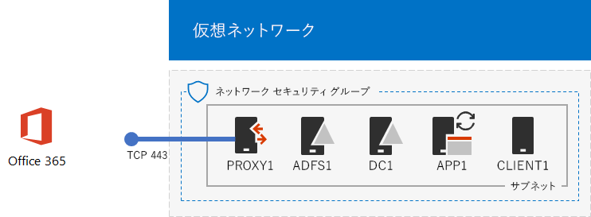
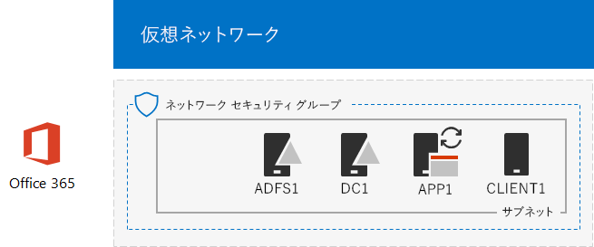

# <a name="federated-identity-for-your-office-365-devtest-environment"></a><span data-ttu-id="0c6f6-103">Office 365 開発/テスト環境のフェデレーション ID</span><span class="sxs-lookup"><span data-stu-id="0c6f6-103">Federated identity for your Office 365 dev/test environment</span></span>

 <span data-ttu-id="0c6f6-104">**の概要:**Office 365 の開発/テスト環境に統合認証を構成します。</span><span class="sxs-lookup"><span data-stu-id="0c6f6-104">**Summary:** Configure federated authentication for your Office 365 dev/test environment.</span></span>
  
<span data-ttu-id="0c6f6-p101">Office 365 は、フェデレートされた識別情報をサポートします。これは、自身の資格情報の検証を実行するのではなく Office 365 を参照している接続のユーザー Office 365 を信頼するフェデレーション認証サーバーを意味します。ユーザーの資格情報が正しい場合は、フェデレーション認証サーバーはクライアントが、認証の証明として Office 365 に送信されるセキュリティ トークンを発行します。フェデレートされた識別情報は少なくて済み、Office 365 サブスクリプションと高度な認証とセキュリティのシナリオの認証のスケール アップのことができます。</span><span class="sxs-lookup"><span data-stu-id="0c6f6-p101">Office 365 supports federated identity. This means that instead of performing the validation of credentials itself, Office 365 refers the connecting user to a federated authentication server that Office 365 trusts. If the user's credentials are correct, the federated authentication server issues a security token that the client then sends to Office 365 as proof of authentication. Federated identity allows for the offloading and scaling up of authentication for an Office 365 subscription and advanced authentication and security scenarios.</span></span>
  
<span data-ttu-id="0c6f6-109">この記事では、Office 365 開発/テスト環境用にフェデレーション認証を構成する方法について説明します。最終的には、次のとおりになります。</span><span class="sxs-lookup"><span data-stu-id="0c6f6-109">This article describes how you can configure federated authentication for the Office 365 dev/test environment, resulting in the following:</span></span>
  
<span data-ttu-id="0c6f6-110">**図 1: Office 365 の開発/テスト環境のフェデレーション認証**</span><span class="sxs-lookup"><span data-stu-id="0c6f6-110">**Figure 1: The federated authentication for Office 365 dev/test environment**</span></span>


  
<span data-ttu-id="0c6f6-112">図 1 に示す構成の内容は、次のとおりです。 </span><span class="sxs-lookup"><span data-stu-id="0c6f6-112">The configuration shown in Figure 1 consists of:</span></span> 
  
- <span data-ttu-id="0c6f6-113">Office 365 E5 試用版サブスクリプション。このサブスクリプションは、作成時から 30 日で有効期限が切れます。</span><span class="sxs-lookup"><span data-stu-id="0c6f6-113">An Office 365 E5 Trial Subscription, which expires 30 days from when you create it.</span></span>
    
- <span data-ttu-id="0c6f6-p102">インターネットに接続する組織の簡易型イントラネット。Azure 仮想ネットワークのサブネット上に配置された 5 つの仮想マシン (DC1、APP1、CLIENT1、ADFS1、PROXY1) で構成されます。APP1 では、Windows Server AD ドメインのアカウントの一覧を Office 365 に同期するために Azure AD Connect が実行されます。PROXY1 は、受信認証要求を受信します。ADFS1 は、DC1 で資格情報を検証し、セキュリティ トークンを発行します。</span><span class="sxs-lookup"><span data-stu-id="0c6f6-p102">A simplified organization intranet connected to the Internet, consisting of five virtual machines on a subnet of an Azure virtual network (DC1, APP1, CLIENT1, ADFS1, and PROXY1). Azure AD Connect runs on APP1 to synchronize the list of accounts in the Windows Server AD domain to Office 365. PROXY1 receives the incoming authentication requests. ADFS1 validates credentials with DC1 and issues security tokens.</span></span>
    
<span data-ttu-id="0c6f6-118">次に示す 5 つのフェーズで、この開発/テスト環境を設定します。</span><span class="sxs-lookup"><span data-stu-id="0c6f6-118">There are five phases to setting up this dev/test environment:</span></span>
  
1. <span data-ttu-id="0c6f6-119">DirSync を使用する、シミュレートされたエンタープライズ Office 365 開発/テスト環境を作成する。</span><span class="sxs-lookup"><span data-stu-id="0c6f6-119">Create the simulated enterprise Office 365 dev/test environment with DirSync.</span></span>
    
2. <span data-ttu-id="0c6f6-120">AD FS サーバー (ADFS1) を作成する。</span><span class="sxs-lookup"><span data-stu-id="0c6f6-120">Create the AD FS server (ADFS1).</span></span>
    
3. <span data-ttu-id="0c6f6-121">Web プロキシ サーバー (PROXY1) を作成する。</span><span class="sxs-lookup"><span data-stu-id="0c6f6-121">Create the web proxy server (PROXY1).</span></span>
    
4. <span data-ttu-id="0c6f6-122">自己署名証明書を作成し、ADFS1 と PROXY1 を構成する。</span><span class="sxs-lookup"><span data-stu-id="0c6f6-122">Create a self-signed certificate and configure ADFS1 and PROXY1.</span></span>
    
5. <span data-ttu-id="0c6f6-123">フェデレーション ID に対応するよう Office 365 を構成する。</span><span class="sxs-lookup"><span data-stu-id="0c6f6-123">Configure Office 365 for federated identity.</span></span>
    
<span data-ttu-id="0c6f6-124">Azure 内の Office 365 のフェデレーション認証の運用環境の導入の手順、 [Azure で Office 365 の展開の高可用性フェデレーション認証](deploy-high-availability-federated-authentication-for-office-365-in-azure.md)を参照してください。</span><span class="sxs-lookup"><span data-stu-id="0c6f6-124">To step through a production deployment of federated authentication for Office 365 in Azure, see [Deploy high availability federated authentication for Office 365 in Azure](deploy-high-availability-federated-authentication-for-office-365-in-azure.md).</span></span>
  
> [!NOTE]
> <span data-ttu-id="0c6f6-125">Azure の試用版サブスクリプションで、この開発/テスト環境を構成することはできません。</span><span class="sxs-lookup"><span data-stu-id="0c6f6-125">You cannot configure this dev/test environment with an Azure Trial subscription.</span></span> 
  
> [!TIP]
> <span data-ttu-id="0c6f6-126">
            [ここ](http://aka.ms/catlgstack)をクリックして、One Microsoft Cloud のテスト ラボ ガイド スタックに含まれるすべての記事のビジュアル マップをご確認ください。</span><span class="sxs-lookup"><span data-stu-id="0c6f6-126">Click [here](http://aka.ms/catlgstack) for a visual map to all the articles in the One Microsoft Cloud Test Lab Guide stack.</span></span>
  
## <a name="phase-1-create-the-simulated-enterprise-office-365-devtest-environment-with-dirsync"></a><span data-ttu-id="0c6f6-127">フェーズ 1:DirSync を使用する、シミュレートされたエンタープライズ Office 365 開発/テスト環境を作成する</span><span class="sxs-lookup"><span data-stu-id="0c6f6-127">Phase 1: Create the simulated enterprise Office 365 dev/test environment with DirSync</span></span>

<span data-ttu-id="0c6f6-128">APP1 でディレクトリ同期サーバーと Office 365 と AD の Windows サーバーとの間の同期の id と Office 365 のシミュレートされたエンタープライズ開発/テスト環境を作成するのには[、Office 365 の開発/テスト環境のディレクトリ同期](dirsync-for-your-office-365-dev-test-environment.md)の指示をに従ってください。DC1 上のアカウントです。</span><span class="sxs-lookup"><span data-stu-id="0c6f6-128">Follow the instructions in [DirSync for your Office 365 dev/test environment](dirsync-for-your-office-365-dev-test-environment.md) to create the simulated enterprise Office 365 dev/test environment with APP1 as the DirSync server and synchronized identity between Office 365 and the Windows Server AD accounts on DC1.</span></span>
  
<span data-ttu-id="0c6f6-p103">次に、現在のドメイン名に基づく新しいパブリック DNS ドメイン名を作成し、Office 365 サブスクリプションに追加します。名前を使用することをお勧めします**testlab。** 。\<、パブリック ・ ドメイン >。たとえば、パブリック ドメイン名が contoso.com である場合は、パブリック ・ ドメイン名の testlab.contoso.com を追加します。</span><span class="sxs-lookup"><span data-stu-id="0c6f6-p103">Next, create a new public DNS domain name based on your current domain name and add it to your Office 365 subscription. We recommend using the name **testlab.**\<your public domain>. For example, if your public domain name is contoso.com, add the public domain name testlab.contoso.com.</span></span>
  
<span data-ttu-id="0c6f6-132">DNS プロバイダーで、適切な DNS レコードを作成し、ドメインを Office 365 試用版サブスクリプションに追加する方法については、[追加のユーザーと Office 365 にドメイン](https://support.office.com/article/Add-users-and-domain-to-Office-365-6383f56d-3d09-4dcb-9b41-b5f5a5efd611)を参照してください。</span><span class="sxs-lookup"><span data-stu-id="0c6f6-132">For instructions on how to create the correct DNS records in your DNS provider and add the domain to your Office 365 trial subscription, see [Add users and domain to Office 365](https://support.office.com/article/Add-users-and-domain-to-Office-365-6383f56d-3d09-4dcb-9b41-b5f5a5efd611).</span></span> 
  
<span data-ttu-id="0c6f6-133">最終的な構成をここに示します。</span><span class="sxs-lookup"><span data-stu-id="0c6f6-133">Here is your resulting configuration.</span></span>
  
<span data-ttu-id="0c6f6-134">**Office 365 の開発/テスト環境の図 2: ディレクトリの同期**</span><span class="sxs-lookup"><span data-stu-id="0c6f6-134">**Figure 2: DirSync for Office 365 dev/test environment**</span></span>


  
<span data-ttu-id="0c6f6-136">図 2 は、Office 365 開発/テスト環境の DirSync を示しています。これには、Office 365 と、Azure 仮想ネットワーク内の CLIENT1、APP1、DC1 の各仮想マシンが含まれています。</span><span class="sxs-lookup"><span data-stu-id="0c6f6-136">Figure 2 shows the DirSync for Office 365 dev/test environment, which includes Office 365 and CLIENT1, APP1, and DC1 virtual machines in an Azure virtual network.</span></span>
  
## <a name="phase-2-create-the-ad-fs-server"></a><span data-ttu-id="0c6f6-137">フェーズ 2:AD FS サーバーを作成する</span><span class="sxs-lookup"><span data-stu-id="0c6f6-137">Phase 2: Create the AD FS server</span></span>

<span data-ttu-id="0c6f6-138">AD FS サーバーは、Office 365 と、DC1 でホストされている corp.contoso.com ドメイン内のアカウントとの間でのフェデレーション認証を提供します。</span><span class="sxs-lookup"><span data-stu-id="0c6f6-138">An AD FS server provides federated authentication between Office 365 and the accounts in the corp.contoso.com domain hosted on DC1.</span></span>
  
<span data-ttu-id="0c6f6-139">ADFS1 の Azure の仮想マシンを作成するに、サブスクリプションおよびリソース ・ グループと、基本構成では、Azure の場所の名前が入力し、Azure の PowerShell コマンド プロンプトで、ローカル コンピューターでこれらのコマンドを実行します。</span><span class="sxs-lookup"><span data-stu-id="0c6f6-139">To create an Azure virtual machine for ADFS1, fill in the name of your subscription and the resource group and Azure location for your Base Configuration, and then run these commands at the Azure PowerShell command prompt on your local computer.</span></span>
  
```
$subscr="<your Azure subscription name>"
$rgName="<the resource group name of your Base Configuration>"
Login-AzureRMAccount
Get-AzureRmSubscription -SubscriptionName $subscr | Select-AzureRmSubscription
$staticIP="10.0.0.100"
$locName=(Get-AzureRmResourceGroup -Name $rgName).Location
$vnet=Get-AzureRMVirtualNetwork -Name TestLab -ResourceGroupName $rgName
$pip = New-AzureRMPublicIpAddress -Name ADFS1-PIP -ResourceGroupName $rgName -Location $locName -AllocationMethod Dynamic
$nic = New-AzureRMNetworkInterface -Name ADFS1-NIC -ResourceGroupName $rgName -Location $locName -SubnetId $vnet.Subnets[0].Id -PublicIpAddressId $pip.Id -PrivateIpAddress $staticIP
$vm=New-AzureRMVMConfig -VMName ADFS1 -VMSize Standard_D2_v2
$cred=Get-Credential -Message "Type the name and password of the local administrator account for ADFS1."
$vm=Set-AzureRMVMOperatingSystem -VM $vm -Windows -ComputerName ADFS1 -Credential $cred -ProvisionVMAgent -EnableAutoUpdate
$vm=Set-AzureRMVMSourceImage -VM $vm -PublisherName MicrosoftWindowsServer -Offer WindowsServer -Skus 2016-Datacenter -Version "latest"
$vm=Add-AzureRMVMNetworkInterface -VM $vm -Id $nic.Id
$vm=Set-AzureRmVMOSDisk -VM $vm -Name "ADFS-OS" -DiskSizeInGB 128 -CreateOption FromImage -StorageAccountType "StandardLRS"
New-AzureRMVM -ResourceGroupName $rgName -Location $locName -VM $vm
```

> [!TIP]
> <span data-ttu-id="0c6f6-140">クリックして[ここでは](https://gallery.technet.microsoft.com/PowerShell-commands-for-f79bc2c2?redir=0)この資料ですべての PowerShell コマンドを含むテキスト ファイルを取得します。</span><span class="sxs-lookup"><span data-stu-id="0c6f6-140">Click [here](https://gallery.technet.microsoft.com/PowerShell-commands-for-f79bc2c2?redir=0) to get a text file that contains all the PowerShell commands in this article.</span></span>
  
<span data-ttu-id="0c6f6-141">次に、 [Azure ポータル](http://portal.azure.com)を使用して、ADFS1 のローカル管理者のアカウント名とパスワードを使用する ADFS1 の仮想マシンに接続し、Windows PowerShell コマンド プロンプトを開きます。</span><span class="sxs-lookup"><span data-stu-id="0c6f6-141">Next, use the [Azure portal](http://portal.azure.com) to connect to the ADFS1 virtual machine using the ADFS1 local administrator account name and password, and then open a Windows PowerShell command prompt.</span></span>
  
<span data-ttu-id="0c6f6-142">ADFS1、DC1 との間の名前解決とネットワーク通信を確認するには、 **ping dc1.corp.contoso.com**コマンドを実行し、4 つの応答があることを確認します。</span><span class="sxs-lookup"><span data-stu-id="0c6f6-142">To check name resolution and network communication between ADFS1 and DC1, run the **ping dc1.corp.contoso.com** command and verify that there are four replies.</span></span>
  
<span data-ttu-id="0c6f6-143">次に、ADFS1 の Windows PowerShell プロンプトで次のコマンドを使用して、ADFS1 仮想マシンを CORP ドメインに参加させます。</span><span class="sxs-lookup"><span data-stu-id="0c6f6-143">Next, join the ADFS1 virtual machine to the CORP domain with these commands at the Windows PowerShell prompt on ADFS1.</span></span>
  
```
$cred=Get-Credential -UserName "CORP\\User1" -Message "Type the User1 account password."
Add-Computer -DomainName corp.contoso.com -Credential $cred
Restart-Computer
```

<span data-ttu-id="0c6f6-144">最終的な構成をここに示します。</span><span class="sxs-lookup"><span data-stu-id="0c6f6-144">Here is your resulting configuration.</span></span>
  
<span data-ttu-id="0c6f6-145">**図 3: AD FS サーバーを追加します。**</span><span class="sxs-lookup"><span data-stu-id="0c6f6-145">**Figure 3: Adding the AD FS server**</span></span>


  
<span data-ttu-id="0c6f6-147">図 3 は、Office 365 開発/テスト環境の DirSync に ADFS1 サーバーが追加されたことを示しています。</span><span class="sxs-lookup"><span data-stu-id="0c6f6-147">Figure 3 shows the addition of the ADFS1 server to the DirSync for Office 365 dev/test environment.</span></span>
  
## <a name="phase-3-create-the-web-proxy-server"></a><span data-ttu-id="0c6f6-148">フェーズ 3：Web プロキシ サーバーを作成する</span><span class="sxs-lookup"><span data-stu-id="0c6f6-148">Phase 3: Create the web proxy server</span></span>

<span data-ttu-id="0c6f6-149">PROXY1 は、認証しようとするユーザーと ADFS1 との間の認証メッセージのプロキシを提供します。</span><span class="sxs-lookup"><span data-stu-id="0c6f6-149">PROXY1 provides proxying of authentication messages between users attempting to authenticate and ADFS1.</span></span>
  
<span data-ttu-id="0c6f6-150">PROXY1 用の Azure 仮想マシンを作成するには、リソース グループ名と Azure の場所を入力し、次のコマンドをローカル コンピューターの Azure PowerShell コマンド プロンプトで実行します。</span><span class="sxs-lookup"><span data-stu-id="0c6f6-150">To create an Azure virtual machine for PROXY1, fill in the name of your resource group and Azure location, and then run these commands at the Azure PowerShell command prompt on your local computer.</span></span>
  
```
$rgName="<the resource group name of your Base Configuration>"
$staticIP="10.0.0.101"
$locName=(Get-AzureRmResourceGroup -Name $rgName).Location
$vnet=Get-AzureRMVirtualNetwork -Name TestLab -ResourceGroupName $rgName
$pip = New-AzureRMPublicIpAddress -Name PROXY1-PIP -ResourceGroupName $rgName -Location $locName -AllocationMethod Static
$nic = New-AzureRMNetworkInterface -Name PROXY1-NIC -ResourceGroupName $rgName -Location $locName -SubnetId $vnet.Subnets[0].Id -PublicIpAddressId $pip.Id -PrivateIpAddress $staticIP
$vm=New-AzureRMVMConfig -VMName PROXY1 -VMSize Standard_D2_v2
$cred=Get-Credential -Message "Type the name and password of the local administrator account for PROXY1."
$vm=Set-AzureRMVMOperatingSystem -VM $vm -Windows -ComputerName PROXY1 -Credential $cred -ProvisionVMAgent -EnableAutoUpdate
$vm=Set-AzureRMVMSourceImage -VM $vm -PublisherName MicrosoftWindowsServer -Offer WindowsServer -Skus 2016-Datacenter -Version "latest"
$vm=Add-AzureRMVMNetworkInterface -VM $vm -Id $nic.Id
$vm=Set-AzureRmVMOSDisk -VM $vm -Name "PROXY1-OS" -DiskSizeInGB 128 -CreateOption FromImage -StorageAccountType "StandardLRS"
New-AzureRMVM -ResourceGroupName $rgName -Location $locName -VM $vm
```

> [!NOTE]
> <span data-ttu-id="0c6f6-151">PROXY1 には静的パブリック IP アドレスが割り当てられます。この IP アドレスを指すパブリック DNS レコードが作成され、PROXY1 仮想マシンを再起動するときにこの IP アドレスを変更することはできないためです。</span><span class="sxs-lookup"><span data-stu-id="0c6f6-151">PROXY1 is assigned a static public IP address because you will create a public DNS record that points to it and it must not change when you restart the PROXY1 virtual machine.</span></span> 
  
<span data-ttu-id="0c6f6-p104">次に、PROXY1 のプライベート IP アドレスと TCP ポート 443 をインターネットからの一方的な着信トラフィックを許可するのには、社内ネットワークのサブネットのネットワークのセキュリティ グループにルールを追加します。Azure の PowerShell コマンド プロンプトで、ローカル コンピューター上のこれらのコマンドを実行します。</span><span class="sxs-lookup"><span data-stu-id="0c6f6-p104">Next, add a rule to the network security group for the CorpNet subnet to allow unsolicited inbound traffic from the Internet to PROXY1's private IP address and TCP port 443. Run these commands at the Azure PowerShell command prompt on your local computer.</span></span>
  
```
$rgName="<the resource group name of your Base Configuration>"
Get-AzureRmNetworkSecurityGroup -Name CorpNet -ResourceGroupName $rgName | Add-AzureRmNetworkSecurityRuleConfig -Name "HTTPS-to-PROXY1" -Description "Allow TCP 443 to PROXY1" -Access "Allow" -Protocol "Tcp" -Direction "Inbound" -Priority 101 -SourceAddressPrefix "Internet" -SourcePortRange "*" -DestinationAddressPrefix "10.0.0.101" -DestinationPortRange "443" | Set-AzureRmNetworkSecurityGroup
```

<span data-ttu-id="0c6f6-154">次に、PROXY1 ローカル管理者のアカウント名とパスワードを使用して PROXY1 仮想マシンに接続するのには、 [Azure ポータル](http://portal.azure.com)を使用し、PROXY1 の Windows PowerShell コマンド プロンプトを開きます。</span><span class="sxs-lookup"><span data-stu-id="0c6f6-154">Next, use the [Azure portal](http://portal.azure.com) to connect to the PROXY1 virtual machine using the PROXY1 local administrator account name and password, and then open a Windows PowerShell command prompt on PROXY1.</span></span>
  
<span data-ttu-id="0c6f6-155">PROXY1、DC1 との間の名前解決とネットワーク通信を確認するには、 **ping dc1.corp.contoso.com**コマンドを実行し、4 つの応答があることを確認します。</span><span class="sxs-lookup"><span data-stu-id="0c6f6-155">To check name resolution and network communication between PROXY1 and DC1, run the **ping dc1.corp.contoso.com** command and verify that there are four replies.</span></span>
  
<span data-ttu-id="0c6f6-156">次に、PROXY1 の Windows PowerShell プロンプトで次のコマンドを使用して、PROXY1 仮想マシンを CORP ドメインに参加させます。</span><span class="sxs-lookup"><span data-stu-id="0c6f6-156">Next, join the PROXY1 virtual machine to the CORP domain with these commands at the Windows PowerShell prompt on PROXY1.</span></span>
  
```
$cred=Get-Credential -UserName "CORP\\User1" -Message "Type the User1 account password."
Add-Computer -DomainName corp.contoso.com -Credential $cred
Restart-Computer
```

<span data-ttu-id="0c6f6-157">ローカル コンピューターで次の Azure PowerShell コマンドを使用して、PROXY1 のパブリック IP アドレスを表示します。</span><span class="sxs-lookup"><span data-stu-id="0c6f6-157">Display the public IP address of PROXY1 with these Azure PowerShell commands on your local computer:</span></span>
  
```
Write-Host (Get-AzureRMPublicIpaddress -Name "PROXY1-PIP" -ResourceGroup $rgName).IPAddress
```

<span data-ttu-id="0c6f6-p105">次に、パブリック DNS プロバイダーを使用しての新しいパブリック DNS の A レコードを作成**fs.testlab です**。\<、DNS ドメイン名 >**のホストの書き込み**コマンドで表示される IP アドレスに解決します。**Fs.testlab です**。\<、DNS ドメイン名 > の*フェデレーション サービスの FQDN*とも呼ぶ。</span><span class="sxs-lookup"><span data-stu-id="0c6f6-p105">Next, work with your public DNS provider and create a new public DNS A record for **fs.testlab.**\<your DNS domain name> that resolves to the IP address displayed by the **Write-Host** command. The **fs.testlab.**\<your DNS domain name> is hereafter referred to as the  *federation service FQDN*  .</span></span>
  
<span data-ttu-id="0c6f6-160">CORP を使用して、DC1 バーチャル マシンへの接続を次に、 [Azure ポータル](http://portal.azure.com)を使用して\\User1 の資格情報、し、次の Windows PowerShell コマンド プロンプトで管理者レベル コマンドします。</span><span class="sxs-lookup"><span data-stu-id="0c6f6-160">Next, use the [Azure portal](http://portal.azure.com) to connect to the DC1 virtual machine using the CORP\\User1 credentials, and then run the following commands at an administrator-level Windows PowerShell command prompt:</span></span>
  
```
$testZone="<the FQDN of your testlab domain from phase 1, example: testlab.contoso.com>"
$testZoneFile= $testZone + ".dns"
Add-DnsServerPrimaryZone -Name $testZone -ZoneFile $testZoneFile
Add-DnsServerResourceRecordA -Name "fs" -ZoneName $testZone -AllowUpdateAny -IPv4Address "10.0.0.100" -TimeToLive 01:00:00
```

<span data-ttu-id="0c6f6-161">これらのコマンドは、Azure 仮想ネットワーク上の仮想マシンが ADFS1 のプライベート IP アドレスに解決できる、フェデレーション サービス FQDN の DNS A レコードを作成します。</span><span class="sxs-lookup"><span data-stu-id="0c6f6-161">These commands create a DNS A record for your federation service FQDN that virtual machines on the Azure virtual network can resolve to ADFS1's private IP address.</span></span>
  
<span data-ttu-id="0c6f6-162">最終的な構成をここに示します。</span><span class="sxs-lookup"><span data-stu-id="0c6f6-162">Here is your resulting configuration.</span></span>
  
<span data-ttu-id="0c6f6-163">**図 4: web アプリケーションのプロキシ サーバーを追加します。**</span><span class="sxs-lookup"><span data-stu-id="0c6f6-163">**Figure 4: Adding the web application proxy server**</span></span>


  
<span data-ttu-id="0c6f6-165">図 4 は、PROXY1 サーバーの追加を示しています。</span><span class="sxs-lookup"><span data-stu-id="0c6f6-165">Figure 4 shows the addition of the PROXY1 server.</span></span>
  
## <a name="phase-4-create-a-self-signed-certificate-and-configure-adfs1-and-proxy1"></a><span data-ttu-id="0c6f6-166">フェーズ 4:自己署名証明書を作成し、ADFS1 と PROXY1 を構成する</span><span class="sxs-lookup"><span data-stu-id="0c6f6-166">Phase 4: Create a self-signed certificate and configure ADFS1 and PROXY1</span></span>

<span data-ttu-id="0c6f6-167">このフェーズでは、フェデレーション サービス FQDN 用の自己署名入りデジタル証明書を作成し、ADFS1 と PROXY1 を AD FS ファームとして構成します。</span><span class="sxs-lookup"><span data-stu-id="0c6f6-167">In this phase, you create a self-signed digital certificate for your federation service FQDN and configure ADFS1 and PROXY1 as an AD FS farm.</span></span>
  
<span data-ttu-id="0c6f6-168">CORP を使用して、DC1 バーチャル マシンへの接続を最初に、 [Azure ポータル](http://portal.azure.com)を使用して\\User1 の資格情報、しを開きます管理者レベルの Windows PowerShell コマンド プロンプトです。</span><span class="sxs-lookup"><span data-stu-id="0c6f6-168">First, use the [Azure portal](http://portal.azure.com) to connect to the DC1 virtual machine using the CORP\\User1 credentials, and then open an administrator-level Windows PowerShell command prompt.</span></span>
  
<span data-ttu-id="0c6f6-169">次に、DC1 の Windows PowerShell コマンド プロンプトで次のコマンドを使用して、AD FS サービス アカウントを作成します。</span><span class="sxs-lookup"><span data-stu-id="0c6f6-169">Next, create AD FS service account with this command at the Windows PowerShell command prompt on DC1:</span></span>
  
```
New-ADUser -SamAccountName ADFS-Service -AccountPassword (read-host "Set user password" -assecurestring) -name "ADFS-Service" -enabled $true -PasswordNeverExpires $true -ChangePasswordAtLogon $false
```

<span data-ttu-id="0c6f6-p106">このコマンドでは、アカウントのパスワードを入力するよう求められることにご注意ください。強力なパスワードを選択して、安全な場所に記録してください。このパスワードは、このフェーズとフェーズ 5 で必要になります。</span><span class="sxs-lookup"><span data-stu-id="0c6f6-p106">Note that this command prompts you to supply the account password. Choose a strong password and record it in a secured location. You will need it for this phase and Phase 5.</span></span>
  
<span data-ttu-id="0c6f6-p107">CORP を使用して、ADFS1 の仮想マシンに接続するのには、 [Azure ポータル](http://portal.azure.com)を使用して\\User1 の資格情報です。ADFS1 で管理者レベルの Windows PowerShell コマンド プロンプトを開きます、フェデレーション サービスの FQDN を入力し、自己署名証明書を作成するのにはこれらのコマンドを実行します。</span><span class="sxs-lookup"><span data-stu-id="0c6f6-p107">Use the [Azure portal](http://portal.azure.com) to connect to the ADFS1 virtual machine using the CORP\\User1 credentials. Open an administrator-level Windows PowerShell command prompt on ADFS1, fill in your federation service FQDN, and then run these commands to create a self-signed certificate:</span></span>
  
```
$fedServiceFQDN="<federation service FQDN>"
New-SelfSignedCertificate -DnsName $fedServiceFQDN -CertStoreLocation "cert:\\LocalMachine\\My"
New-Item -path c:\\Certs -type directory
New-SmbShare -name Certs -path c:\\Certs -changeaccess CORP\\User1
```

<span data-ttu-id="0c6f6-175">次いで、次の手順を使用して新しい自己署名証明書をファイルとして保存します。</span><span class="sxs-lookup"><span data-stu-id="0c6f6-175">Next, use these steps to save the new self-signed certificate as a file.</span></span>
  
1. <span data-ttu-id="0c6f6-176">[**スタート**] ボタン、 **mmc.exe**と入力し、 **Enter**キーを押します。</span><span class="sxs-lookup"><span data-stu-id="0c6f6-176">Click **Start**, type **mmc.exe**, and then press **Enter**.</span></span>
    
2. <span data-ttu-id="0c6f6-177">クリックして**ファイル > スナップインの追加と削除**。</span><span class="sxs-lookup"><span data-stu-id="0c6f6-177">Click **File > Add/Remove Snap-in**.</span></span>
    
3. <span data-ttu-id="0c6f6-178">**追加またはスナップインを削除する**には、利用できるスナップインの一覧に**証明書**をダブルクリックして、**コンピューター アカウント**] をクリックしてで、[**次へ**] をクリックします。</span><span class="sxs-lookup"><span data-stu-id="0c6f6-178">In **Add or Remove Snap-ins**, double-click **Certificates** in the list of available snap-ins, click **Computer account**, and then click **Next**.</span></span>
    
4. <span data-ttu-id="0c6f6-179">**コンピューターの選択]**、[**完了**] をクリックし、[ **OK**] をクリックします。</span><span class="sxs-lookup"><span data-stu-id="0c6f6-179">In **Select Computer**, click **Finish**, and then click **OK**.</span></span>
    
5. <span data-ttu-id="0c6f6-180">ツリー ウィンドウで開くには**[証明書 (ローカル コンピューター) > パーソナル > 証明書**。</span><span class="sxs-lookup"><span data-stu-id="0c6f6-180">In the tree pane, open **Certificates (Local Computer) > Personal > Certificates**.</span></span>
    
6. <span data-ttu-id="0c6f6-181">フェデレーション サービスの FQDN を持つ証明書を右クリックし、**すべてのタスク**] をクリックし、[**エクスポート**] をクリックします。</span><span class="sxs-lookup"><span data-stu-id="0c6f6-181">Right-click the certificate with your federation service FQDN, click **All tasks**, and then click **Export**.</span></span>
    
7. <span data-ttu-id="0c6f6-182">[**ようこそ**] ページで、**次へ**をクリックします。</span><span class="sxs-lookup"><span data-stu-id="0c6f6-182">On the **Welcome** page, click **Next**.</span></span>
    
8. <span data-ttu-id="0c6f6-183">[**秘密キーのエクスポート**] ページで、 **[はい**] をクリックし、[**次へ**] をクリックします。</span><span class="sxs-lookup"><span data-stu-id="0c6f6-183">On the **Export Private Key** page, click **Yes**, and then click **Next**.</span></span>
    
9. <span data-ttu-id="0c6f6-184">[**エクスポート ファイルの形式**] ページで、[**すべての拡張プロパティをエクスポート**する] をクリックし、[**次へ**] をクリックします。</span><span class="sxs-lookup"><span data-stu-id="0c6f6-184">On the **Export File Format** page, click **Export all extended properties**, and then click **Next**.</span></span>
    
10. <span data-ttu-id="0c6f6-185">[**セキュリティ**] ページで、[**パスワード**] をクリックし、[**パスワード**] にパスワードを入力し、**パスワードの確認入力します**。</span><span class="sxs-lookup"><span data-stu-id="0c6f6-185">On the **Security** page, click **Password** and type a password in **Password** and **Confirm password.**</span></span>
    
11. <span data-ttu-id="0c6f6-186">[**エクスポートするファイル**] ページで [**参照**] をクリックします。</span><span class="sxs-lookup"><span data-stu-id="0c6f6-186">On the **File to Export** page, click **Browse**.</span></span>
    
12. <span data-ttu-id="0c6f6-187">参照して、 **c:\\証明書**フォルダー、**ファイル名**、 **SSL**を入力し、**を保存します**。</span><span class="sxs-lookup"><span data-stu-id="0c6f6-187">Browse to the **C:\\Certs** folder, type **SSL** in **File name**, and then click **Save.**</span></span>
    
13. <span data-ttu-id="0c6f6-188">[**エクスポートするファイル**] ページで、**次へ**をクリックします。</span><span class="sxs-lookup"><span data-stu-id="0c6f6-188">On the **File to Export** page, click **Next**.</span></span>
    
14. <span data-ttu-id="0c6f6-p108">[**証明書のエクスポート ウィザードの完了**] ページで [**完了**] をクリックします。ダイアログ ボックスが表示されたら、[ **OK**を] をクリックします。</span><span class="sxs-lookup"><span data-stu-id="0c6f6-p108">On the **Completing the Certificate Export Wizard** page, click **Finish**. When prompted, click **OK**.</span></span>
    
<span data-ttu-id="0c6f6-191">次に、ADFS1 の Windows PowerShell コマンド プロンプトで次のコマンドを使用して、AD FS サービスをインストールします。</span><span class="sxs-lookup"><span data-stu-id="0c6f6-191">Next, install the AD FS service with this command at the Windows PowerShell command prompt on ADFS1:</span></span>
  
```
Install-WindowsFeature ADFS-Federation -IncludeManagementTools
```

<span data-ttu-id="0c6f6-192">インストールが完了するまで待ちます。</span><span class="sxs-lookup"><span data-stu-id="0c6f6-192">Wait for the installation to complete.</span></span>
  
<span data-ttu-id="0c6f6-193">次いで、次の手順で AD FS サービスを構成します。</span><span class="sxs-lookup"><span data-stu-id="0c6f6-193">Next, configure the AD FS service with these steps:</span></span>
  
1. <span data-ttu-id="0c6f6-194">**開始**] をクリックし、**サーバー マネージャー**のアイコンをクリックします。</span><span class="sxs-lookup"><span data-stu-id="0c6f6-194">Click **Start**, and then click the **Server Manager** icon.</span></span>
    
2. <span data-ttu-id="0c6f6-195">サーバー マネージャーのツリー ペインでは、 **AD FS**をクリックします。</span><span class="sxs-lookup"><span data-stu-id="0c6f6-195">In the tree pane of Server Manager, click **AD FS**.</span></span>
    
3. <span data-ttu-id="0c6f6-196">ツールバーの上部にある、オレンジ色の警告の記号をクリックし、**このサーバー上のフェデレーション サービスの構成**] をクリックします。</span><span class="sxs-lookup"><span data-stu-id="0c6f6-196">In the tool bar at the top, click the orange caution symbol, and then click **Configure the federation service on this server**.</span></span>
    
4. <span data-ttu-id="0c6f6-197">Active Directory フェデレーション サービスの構成ウィザードの [**ようこそ**] ページで、**次へ**をクリックします。</span><span class="sxs-lookup"><span data-stu-id="0c6f6-197">On the **Welcome** page of the Active Directory Federation Services Configuration Wizard, click **Next**.</span></span>
    
5. <span data-ttu-id="0c6f6-198">**AD DS への接続**] ページで、[**次へ**] クリックします。</span><span class="sxs-lookup"><span data-stu-id="0c6f6-198">On the **Connect to AD DS** page, click **Next**.</span></span>
    
6. <span data-ttu-id="0c6f6-199">[**サービス プロパティの指定**] ページ。</span><span class="sxs-lookup"><span data-stu-id="0c6f6-199">On the **Specify Service Properties** page:</span></span>
    
  - <span data-ttu-id="0c6f6-200">**SSL 証明書**の下向きの矢印をクリックし、フェデレーション サービスの FQDN の名前を持つ証明書] をクリックします。</span><span class="sxs-lookup"><span data-stu-id="0c6f6-200">For **SSL Certificate**, click the down arrow, and then click the certificate with the name of your federation service FQDN.</span></span>
    
  - <span data-ttu-id="0c6f6-201">**フェデレーション サービスの表示名**] には、架空の組織の名前を入力します。</span><span class="sxs-lookup"><span data-stu-id="0c6f6-201">In **Federation Service Display Name**, type the name of your fictional organization.</span></span>
    
  - <span data-ttu-id="0c6f6-202">[ **次へ**] をクリックします。</span><span class="sxs-lookup"><span data-stu-id="0c6f6-202">Click **Next**.</span></span>
    
7. <span data-ttu-id="0c6f6-203">**サービス アカウントの指定**] ページで、**アカウント名**を [**選択**] をクリックします。</span><span class="sxs-lookup"><span data-stu-id="0c6f6-203">On the **Specify Service Account** page, click **Select** for **Account name**.</span></span>
    
8. <span data-ttu-id="0c6f6-204">**選択のユーザーまたはサービス アカウント**で、 **ADFS サービス**を入力、[**名前の確認**] をクリックし、[ **OK**] をクリックします。</span><span class="sxs-lookup"><span data-stu-id="0c6f6-204">In **Select User or Service Account**, type **ADFS-Service**, click **Check Names**, and then click **OK**.</span></span>
    
9. <span data-ttu-id="0c6f6-205">**アカウントのパスワード**の場合は、ADFS サービス アカウントのパスワードを入力し、[**次へ**] をクリックします。</span><span class="sxs-lookup"><span data-stu-id="0c6f6-205">In **Account Password**, type the password for the ADFS-Service account, and then click **Next**.</span></span>
    
10. <span data-ttu-id="0c6f6-206">**構成データベースの指定**] ページで、[**次へ**] クリックします。</span><span class="sxs-lookup"><span data-stu-id="0c6f6-206">On the **Specify Configuration Database** page, click **Next**.</span></span>
    
11. <span data-ttu-id="0c6f6-207">**オプションの確認**] ページで、[**次へ**] クリックします。</span><span class="sxs-lookup"><span data-stu-id="0c6f6-207">On the **Review Options** page, click **Next**.</span></span>
    
12. <span data-ttu-id="0c6f6-208">**受講前提条件のチェック**] ページで、[**構成**を] をクリックします。</span><span class="sxs-lookup"><span data-stu-id="0c6f6-208">On the **Pre-requisite Checks** page, click **Configure**.</span></span>
    
13. <span data-ttu-id="0c6f6-209">[**結果**] ページで [**閉じる**] をクリックします。</span><span class="sxs-lookup"><span data-stu-id="0c6f6-209">On the **Results** page, click **Close**.</span></span>
    
14. <span data-ttu-id="0c6f6-210">[**スタート**] ボタン、[電源] アイコンをクリックして、**再起動**、し、[**続行**] をクリックします。</span><span class="sxs-lookup"><span data-stu-id="0c6f6-210">Click **Start**, click the power icon, click **Restart**, and then click **Continue**.</span></span>
    
<span data-ttu-id="0c6f6-211">[Azure ポータル](http://portal.azure.com)では、CORP と PROXY1 に接続\\User1 アカウントの資格情報です。</span><span class="sxs-lookup"><span data-stu-id="0c6f6-211">From the [Azure portal](http://portal.azure.com), connect to PROXY1 with the CORP\\User1 account credentials.</span></span>
  
<span data-ttu-id="0c6f6-212">次に、以下の手順を使用して、自己署名証明書をインストールし、PROXY1 を構成します。</span><span class="sxs-lookup"><span data-stu-id="0c6f6-212">Next, use these steps to install the self-signed certificate and configure PROXY1.</span></span>
  
1. <span data-ttu-id="0c6f6-213">[**スタート**] ボタン、 **mmc.exe**と入力し、 **Enter**キーを押します。</span><span class="sxs-lookup"><span data-stu-id="0c6f6-213">Click **Start**, type **mmc.exe**, and then press **Enter**.</span></span>
    
2. <span data-ttu-id="0c6f6-214">クリックして**ファイル > スナップインの追加と削除**。</span><span class="sxs-lookup"><span data-stu-id="0c6f6-214">Click **File > Add/Remove Snap-in**.</span></span>
    
3. <span data-ttu-id="0c6f6-215">**追加またはスナップインを削除する**には、利用できるスナップインの一覧に**証明書**をダブルクリックして、**コンピューター アカウント**] をクリックしてで、[**次へ**] をクリックします。</span><span class="sxs-lookup"><span data-stu-id="0c6f6-215">In **Add or Remove Snap-ins**, double-click **Certificates** in the list of available snap-ins, click **Computer account**, and then click **Next**.</span></span>
    
4. <span data-ttu-id="0c6f6-216">**コンピューターの選択]**、[**完了**] をクリックし、[ **OK**] をクリックします。</span><span class="sxs-lookup"><span data-stu-id="0c6f6-216">In **Select Computer**, click **Finish**, and then click **OK**.</span></span>
    
5. <span data-ttu-id="0c6f6-217">ツリー ウィンドウで開くには**[証明書 (ローカル コンピューター) > パーソナル > 証明書**。</span><span class="sxs-lookup"><span data-stu-id="0c6f6-217">In the tree pane, open **Certificates (Local Computer) > Personal > Certificates**.</span></span>
    
6. <span data-ttu-id="0c6f6-218">**個人**を右クリックし、**すべてのタスク**] をクリックし、[**インポート**] をクリックします。</span><span class="sxs-lookup"><span data-stu-id="0c6f6-218">Right-click **Personal**, click **All tasks**, and then click **Import**.</span></span>
    
7. <span data-ttu-id="0c6f6-219">[**ようこそ**] ページで、**次へ**をクリックします。</span><span class="sxs-lookup"><span data-stu-id="0c6f6-219">On the **Welcome** page, click **Next**.</span></span>
    
8. <span data-ttu-id="0c6f6-220">[**インポートするファイル**] ページで、次のように入力します。 ** \\ \\adfs1\\証明書\\ssl.pfx**、し、[**次へ**] をクリックしします。</span><span class="sxs-lookup"><span data-stu-id="0c6f6-220">On the **File to Import** page, type **\\\\adfs1\\certs\\ssl.pfx**, and then click **Next**.</span></span>
    
9. <span data-ttu-id="0c6f6-221">[**秘密キーの保護**] ページで、**パスワード**、証明書のパスワードを入力しをクリックし、**次**。</span><span class="sxs-lookup"><span data-stu-id="0c6f6-221">On the **Private key protection** page, type the certificate password in **Password**, and then click **Next.**</span></span>
    
10. <span data-ttu-id="0c6f6-222">[**証明書ストア**] ページをクリックして**次**。</span><span class="sxs-lookup"><span data-stu-id="0c6f6-222">On the **Certificate store** page, click **Next.**</span></span>
    
11. <span data-ttu-id="0c6f6-223">[**完了**] ページで [**完了**] をクリックします。</span><span class="sxs-lookup"><span data-stu-id="0c6f6-223">On the **Completing** page, click **Finish**.</span></span>
    
12. <span data-ttu-id="0c6f6-224">[**証明書ストア**] ページで、**次へ**をクリックします。</span><span class="sxs-lookup"><span data-stu-id="0c6f6-224">On the **Certificate Store** page, click **Next**.</span></span>
    
13. <span data-ttu-id="0c6f6-225">ダイアログ ボックスが表示されたら、[ **OK**を] をクリックします。</span><span class="sxs-lookup"><span data-stu-id="0c6f6-225">When prompted, click **OK**.</span></span>
    
14. <span data-ttu-id="0c6f6-226">ツリー ペインで [**証明書**] をクリックします。</span><span class="sxs-lookup"><span data-stu-id="0c6f6-226">Click **Certificates** in the tree pane.</span></span>
    
15. <span data-ttu-id="0c6f6-227">証明書を右クリックし、し、[**コピー**] をクリックします。</span><span class="sxs-lookup"><span data-stu-id="0c6f6-227">Right-click the certificate, and then click **Copy**.</span></span>
    
16. <span data-ttu-id="0c6f6-228">ツリー ウィンドウで開くには**信頼されたルート証明機関 > 証明書**。</span><span class="sxs-lookup"><span data-stu-id="0c6f6-228">In the tree pane, open **Trusted Root Certification Authorities > Certificates**.</span></span>
    
17. <span data-ttu-id="0c6f6-229">証明書がインストールされている、右クリックしをクリックし、一覧の下にマウスのポインターの移動**貼り付け**。</span><span class="sxs-lookup"><span data-stu-id="0c6f6-229">Move your mouse pointer below the list of installed certificates, right-click, and then click **Paste**.</span></span>
    
<span data-ttu-id="0c6f6-230">管理者レベルの PowerShell コマンド プロンプトを開き、次のコマンドを実行します。</span><span class="sxs-lookup"><span data-stu-id="0c6f6-230">Open an administrator-level PowerShell command prompt and run the following command:</span></span>
  
```
Install-WindowsFeature Web-Application-Proxy -IncludeManagementTools
```

<span data-ttu-id="0c6f6-231">インストールが完了するまで待ちます。</span><span class="sxs-lookup"><span data-stu-id="0c6f6-231">Wait for the installation to complete.</span></span>
  
<span data-ttu-id="0c6f6-232">次の手順を使用して、Web アプリケーション プロキシ サービスを構成し、そのフェデレーション サーバーとして ADFS1 を使用します。</span><span class="sxs-lookup"><span data-stu-id="0c6f6-232">Use these steps to configure the web application proxy service to use ADFS1 as its federation server:</span></span>
  
1. <span data-ttu-id="0c6f6-233">**開始**] をクリックし、[**サーバー マネージャー**] をクリックします。</span><span class="sxs-lookup"><span data-stu-id="0c6f6-233">Click **Start**, and then click **Server Manager**.</span></span>
    
2. <span data-ttu-id="0c6f6-234">ツリー ウィンドウで、**リモート アクセス**をクリックします。</span><span class="sxs-lookup"><span data-stu-id="0c6f6-234">In the tree pane, click **Remote Access**.</span></span>
    
3. <span data-ttu-id="0c6f6-235">ツールバーの上部にある、オレンジ色の警告の記号をクリックし、 **Web アプリケーションのプロキシのウィザードを開く**] をクリックします。</span><span class="sxs-lookup"><span data-stu-id="0c6f6-235">In the tool bar at the top, click the orange caution symbol, and then click **Open the Web Application Proxy Wizard**.</span></span>
    
4. <span data-ttu-id="0c6f6-236">Web アプリケーションのプロキシの構成ウィザードの [**ようこそ**] ページで、**次へ**をクリックします。</span><span class="sxs-lookup"><span data-stu-id="0c6f6-236">On the **Welcome** page of the Web Application Proxy Configuration Wizard, click **Next**.</span></span>
    
5. <span data-ttu-id="0c6f6-237">**フェデレーション サーバー**のページ。</span><span class="sxs-lookup"><span data-stu-id="0c6f6-237">On the **Federation Server** page:</span></span>
    
  - <span data-ttu-id="0c6f6-238">**フェデレーション サービスの名前**で、フェデレーション サービスの FQDN を入力します。</span><span class="sxs-lookup"><span data-stu-id="0c6f6-238">Type your federation service FQDN in **Federation service name**.</span></span>
    
  - <span data-ttu-id="0c6f6-239">型**株式会社\\User1** **ユーザー名**にします。</span><span class="sxs-lookup"><span data-stu-id="0c6f6-239">Type **CORP\\User1** in **User name**.</span></span>
    
  - <span data-ttu-id="0c6f6-240">User1 アカウントのパスワードを [**パスワード**] に入力します。</span><span class="sxs-lookup"><span data-stu-id="0c6f6-240">Type the password for the User1 account in **Password**.</span></span>
    
  - <span data-ttu-id="0c6f6-241">[ **次へ**] をクリックします。</span><span class="sxs-lookup"><span data-stu-id="0c6f6-241">Click **Next**.</span></span>
    
6. <span data-ttu-id="0c6f6-242">**AD FS プロキシの証明書**] ページで、下向きの矢印をクリックして、フェデレーション サービスの FQDN を持つ証明書、し、[**次へ**] をクリックします。</span><span class="sxs-lookup"><span data-stu-id="0c6f6-242">On the **AD FS Proxy Certificate** page, click the down arrow, click the certificate with your federation service FQDN, and then click **Next**.</span></span>
    
7. <span data-ttu-id="0c6f6-243">[**確認**] ページで、[**構成**を] をクリックします。</span><span class="sxs-lookup"><span data-stu-id="0c6f6-243">On the **Confirmation** page, click **Configure**.</span></span>
    
8. <span data-ttu-id="0c6f6-244">[**結果**] ページで [**閉じる**] をクリックします。</span><span class="sxs-lookup"><span data-stu-id="0c6f6-244">On the **Results** page, click **Close**.</span></span>
    
## <a name="phase-5-configure-office-365-for-federated-identity"></a><span data-ttu-id="0c6f6-245">フェーズ 5:フェデレーション ID に対応するよう Office 365 を構成する</span><span class="sxs-lookup"><span data-stu-id="0c6f6-245">Phase 5: Configure Office 365 for federated identity</span></span>

<span data-ttu-id="0c6f6-246">[Azure ポータル](http://portal.azure.com)を使用して、CORP と APP1 の仮想マシンに接続する\\User1 アカウントの資格情報です。</span><span class="sxs-lookup"><span data-stu-id="0c6f6-246">Use the [Azure portal](http://portal.azure.com) to connect to the APP1 virtual machine with the CORP\\User1 account credentials.</span></span>
  
<span data-ttu-id="0c6f6-247">次の手順を使用して、フェデレーション認証に対応するよう Azure AD Connect と Office 365 サブスクリプションを構成します。</span><span class="sxs-lookup"><span data-stu-id="0c6f6-247">Use these steps to configure Azure AD Connect and your Office 365 subscription for federated authentication:</span></span>
  
1. <span data-ttu-id="0c6f6-248">デスクトップで、 **Azure AD 接続**をダブルクリックします。</span><span class="sxs-lookup"><span data-stu-id="0c6f6-248">From the desktop, double-click **Azure AD Connect**.</span></span>
    
2. <span data-ttu-id="0c6f6-249">**Azure AD 接続へようこそ**] ページで、[**構成**] をクリックします。</span><span class="sxs-lookup"><span data-stu-id="0c6f6-249">On the **Welcome to Azure AD Connect** page, click **Configure**.</span></span>
    
3. <span data-ttu-id="0c6f6-250">[**追加のタスク**] ページ**変更ユーザー サインイン**] をクリックし、[**次へ**] をクリックします。</span><span class="sxs-lookup"><span data-stu-id="0c6f6-250">On the **Additional tasks** page, click **Change user sign-in**, and then click **Next**.</span></span>
    
4. <span data-ttu-id="0c6f6-251">**Azure AD への接続**] ページで、Office 365 のグローバル管理者アカウント名とパスワードを入力し、[**次へ**] をクリックします。</span><span class="sxs-lookup"><span data-stu-id="0c6f6-251">On the **Connect to Azure AD** page, type your Office 365 global administrator account name and password, and then click **Next**.</span></span>
    
5. <span data-ttu-id="0c6f6-252">**[ユーザー サインイン]** ページで、 **[AD FS とのフェデレーション]** をクリックしてから、 **[次へ]** をクリックします。</span><span class="sxs-lookup"><span data-stu-id="0c6f6-252">On the **User sign-in** page, click **Federation with AD FS**, and then click **Next**.</span></span>
    
6. <span data-ttu-id="0c6f6-253">**AD FS ファーム**] ページで、**既存の AD FS のファームを使用**] をクリックし、**サーバー名**] に**ADFS1**を入力し、[**次へ**] をクリックします。</span><span class="sxs-lookup"><span data-stu-id="0c6f6-253">On the **AD FS farm** page, click **Use an existing AD FS farm**, type **ADFS1** in **Server Name**, and then click **Next**.</span></span>
    
7. <span data-ttu-id="0c6f6-254">サーバーの資格情報のダイアログ ボックスが表示されたら、CORP の資格情報を入力してください。\\User1 アカウント、および、[ **OK**] をクリックします。</span><span class="sxs-lookup"><span data-stu-id="0c6f6-254">When prompted for server credentials, enter the credentials of the CORP\\User1 account, and then click **OK**.</span></span>
    
8. <span data-ttu-id="0c6f6-255">**ドメイン管理者**の資格情報] ページで、次のように入力します。**株式会社\\User1** **ユーザー名**と**パスワード**、アカウントのパスワードで、[**次へ**] をクリックしします。</span><span class="sxs-lookup"><span data-stu-id="0c6f6-255">On the **Domain Administrator** credentials page, type **CORP\\User1** in **Username** and the account password in **Password**, and then click **Next**.</span></span>
    
9. <span data-ttu-id="0c6f6-256">**AD FS サービス アカウント**] ページで、次のように入力します。**株式会社\\ADFS サービス****ドメインのユーザー名**と**ドメイン ユーザーのパスワード**、アカウントのパスワードで、[**次へ**] をクリックしします。</span><span class="sxs-lookup"><span data-stu-id="0c6f6-256">On the **AD FS service account** page, type **CORP\\ADFS-Service** in **Domain Username** and the account password in **Domain User Password**, and then click **Next**.</span></span>
    
10. <span data-ttu-id="0c6f6-257">**Azure AD ドメイン**ページで、**ドメイン**、以前に作成され、フェーズ 1 で、Office 365 のサブスクリプションに追加のドメインの名前を選択し、[**次へ**] をクリックします。</span><span class="sxs-lookup"><span data-stu-id="0c6f6-257">On the **Azure AD Domain** page, in **Domain**, select the name of the domain you previously created and added to your Office 365 subscription in Phase 1, and then click **Next**.</span></span>
    
11. <span data-ttu-id="0c6f6-258">**構成する準備ができました**] ページで [**構成**を] をクリックします。</span><span class="sxs-lookup"><span data-stu-id="0c6f6-258">On the **Ready to configure** page, click **Configure**.</span></span>
    
12. <span data-ttu-id="0c6f6-259">[**インストールの完了**] ページで [**確認**を] をクリックします。</span><span class="sxs-lookup"><span data-stu-id="0c6f6-259">On the **Installation complete** page, click **Verify**.</span></span>
    
    <span data-ttu-id="0c6f6-260">イントラネット構成とインターネット構成の両方が確認されたことを示すメッセージが表示されます。</span><span class="sxs-lookup"><span data-stu-id="0c6f6-260">You should see messages indicating that both the intranet and Internet configuration was verified.</span></span>
    
13. <span data-ttu-id="0c6f6-261">**[インストールの完了]** ページで、 **[終了]** をクリックします。</span><span class="sxs-lookup"><span data-stu-id="0c6f6-261">On the **Installation complete** page, click **Exit**.</span></span>
    
<span data-ttu-id="0c6f6-262">フェデレーション認証が機能していることを実証するには、次の操作を実行します。</span><span class="sxs-lookup"><span data-stu-id="0c6f6-262">To demonstrate that federated authentication is working, do the following:</span></span>
  
1. <span data-ttu-id="0c6f6-263">ローカル コンピューター上のブラウザーの場合は、新しいプライベート インスタンスを開き、 [https://portal.office.com](https://portal.office.com)に移動します。</span><span class="sxs-lookup"><span data-stu-id="0c6f6-263">Open a new private instance of your browser on your local computer and go to [https://portal.office.com](https://portal.office.com).</span></span>
    
2. <span data-ttu-id="0c6f6-264">**@ User1**を入力して、サインイン資格情報を\<のフェーズ 1 で作成したドメイン >。</span><span class="sxs-lookup"><span data-stu-id="0c6f6-264">For the sign-in credentials, type **user1@**\<the domain created in Phase 1>.</span></span> 
    
    <span data-ttu-id="0c6f6-265">たとえば、テスト ドメインが**testlab.contoso.com**の場合は、 **user1@testlab.contoso.com**を入力します。TAB キーを押すか、自動的にリダイレクトするのには Office 365 を許可します。</span><span class="sxs-lookup"><span data-stu-id="0c6f6-265">For example, if your test domain is **testlab.contoso.com**, you would type **user1@testlab.contoso.com**. Press TAB or allow Office 365 to automatically redirect you.</span></span>
    
    <span data-ttu-id="0c6f6-p109">**接続されていないプライベート**ページが表示されます。デスクトップ コンピューターを検証できません ADFS1 に自己署名証明書をインストールしたため、これを表示しています。フェデレーション認証の運用環境の導入で信頼された証明機関から証明書を使用して、ユーザーはこのページが表示されません。</span><span class="sxs-lookup"><span data-stu-id="0c6f6-p109">You should now see a **Your connection is not private** page. You are seeing this because you installed a self-signed certificate on ADFS1 that your desktop computer cannot validate. In a production deployment of federated authentication, you would use a certificate from a trusted certification authority and your users would not see this page.</span></span>
    
3. <span data-ttu-id="0c6f6-269">**接続されていないプライベート**] ページで、[**詳細設定**] をクリックし、**に進んで\<、フェデレーション サービスの FQDN >**。</span><span class="sxs-lookup"><span data-stu-id="0c6f6-269">On the **Your connection is not private** page, click **Advanced**, and then click **Proceed to \<your federation service FQDN>**.</span></span> 
    
4. <span data-ttu-id="0c6f6-270">架空の組織名のページで、次を使用してサインインします。</span><span class="sxs-lookup"><span data-stu-id="0c6f6-270">On the page with the name of your fictional organization, sign in with the following:</span></span>
    
  - <span data-ttu-id="0c6f6-271">**株式会社\\User1**名の</span><span class="sxs-lookup"><span data-stu-id="0c6f6-271">**CORP\\User1** for the name</span></span>
    
  - <span data-ttu-id="0c6f6-272">User1 アカウント: パスワード</span><span class="sxs-lookup"><span data-stu-id="0c6f6-272">The password for the User1 account</span></span>
    
    <span data-ttu-id="0c6f6-273">**Microsoft Office ホーム**ページを参照してくださいする必要があります。</span><span class="sxs-lookup"><span data-stu-id="0c6f6-273">You should see the **Microsoft Office Home** page.</span></span>
    
<span data-ttu-id="0c6f6-p110">この手順では、DC1 上でホストされている Windows サーバー AD corp.contoso.com ドメインを Office 365 試用版サブスクリプションを連携させることを示しています。認証プロセスに関する基本事項を以下に示します。</span><span class="sxs-lookup"><span data-stu-id="0c6f6-p110">This procedure demonstrates that your Office 365 trial subscription is federated with the Windows Server AD corp.contoso.com domain hosted on DC1. Here are the basics of the authentication process:</span></span>
  
1. <span data-ttu-id="0c6f6-276">フェーズ 1 で作成したフェデレーション ドメインをサインイン アカウント名で使用すると、Office 365 はブラウザーをフェデレーション サービス FQDN と PROXY1 にリダイレクトします。</span><span class="sxs-lookup"><span data-stu-id="0c6f6-276">When you use the federated domain that you created in Phase 1 within the sign-in account name, Office 365 redirects your browser to your federation service FQDN and PROXY1.</span></span>
    
2. <span data-ttu-id="0c6f6-277">PROXY1 は、ローカル コンピューターに架空の会社のサインイン ページを送信します。</span><span class="sxs-lookup"><span data-stu-id="0c6f6-277">PROXY1 sends your local computer the fictional company sign-in page.</span></span>
    
3. <span data-ttu-id="0c6f6-278">CORP を送信すると\\ADFS1 に転送して User1 および PROXY1 にパスワードをします。</span><span class="sxs-lookup"><span data-stu-id="0c6f6-278">When you send CORP\\User1 and the password to PROXY1, it forwards them to ADFS1.</span></span>
    
4. <span data-ttu-id="0c6f6-279">ADFS1 CORP を検証する\\User1 と DC1 とパスワード、ローカル コンピューターにセキュリティ トークンを送信するとします。</span><span class="sxs-lookup"><span data-stu-id="0c6f6-279">ADFS1 validates CORP\\User1 and the password with DC1 and sends your local computer a security token.</span></span>
    
5. <span data-ttu-id="0c6f6-280">ローカル コンピューターは、セキュリティ トークンを Office 365 に送信します。</span><span class="sxs-lookup"><span data-stu-id="0c6f6-280">Your local computer sends the security token to Office 365.</span></span>
    
6. <span data-ttu-id="0c6f6-281">Office 365 は、セキュリティ トークンが ADFS1 によって作成されたことを検証して、アクセスを許可します。</span><span class="sxs-lookup"><span data-stu-id="0c6f6-281">Office 365 validates that the security token was created by ADFS1 and allows access.</span></span>
    
<span data-ttu-id="0c6f6-p111">これで、Office 365 試用版のサブスクリプションがフェデレーション認証を行うように構成されました。高度な認証シナリオで、この開発/テスト環境を使用できます。</span><span class="sxs-lookup"><span data-stu-id="0c6f6-p111">Your Office 365 trial subscription is now configured with federated authentication. You can use this dev/test environment for advanced authentication scenarios.</span></span>
  
## <a name="next-step"></a><span data-ttu-id="0c6f6-284">次のステップ</span><span class="sxs-lookup"><span data-stu-id="0c6f6-284">Next Step</span></span>

<span data-ttu-id="0c6f6-285">本番運用に即応を展開する準備ができたら、Azure で Office 365 のフェデレーション認証の高可用性は[Azure で Office 365 の展開の高可用性フェデレーション認証](deploy-high-availability-federated-authentication-for-office-365-in-azure.md)を参照してください。</span><span class="sxs-lookup"><span data-stu-id="0c6f6-285">When you are ready to deploy production-ready, high availability federated authentication for Office 365 in Azure, see [Deploy high availability federated authentication for Office 365 in Azure](deploy-high-availability-federated-authentication-for-office-365-in-azure.md).</span></span>
  
## <a name="see-also"></a><span data-ttu-id="0c6f6-286">関連項目</span><span class="sxs-lookup"><span data-stu-id="0c6f6-286">See Also</span></span>

[<span data-ttu-id="0c6f6-287">クラウド導入のテスト ラボ ガイド (TLG)</span><span class="sxs-lookup"><span data-stu-id="0c6f6-287">Cloud adoption Test Lab Guides (TLGs)</span></span>](cloud-adoption-test-lab-guides-tlgs.md)
  
[<span data-ttu-id="0c6f6-288">基本構成開発/テスト環境</span><span class="sxs-lookup"><span data-stu-id="0c6f6-288">Base Configuration dev/test environment</span></span>](base-configuration-dev-test-environment.md)
  
[<span data-ttu-id="0c6f6-289">Office 365 開発/テスト環境</span><span class="sxs-lookup"><span data-stu-id="0c6f6-289">Office 365 dev/test environment</span></span>](office-365-dev-test-environment.md)
  
[<span data-ttu-id="0c6f6-290">クラウド導入およびハイブリッド ソリューション</span><span class="sxs-lookup"><span data-stu-id="0c6f6-290">Cloud adoption and hybrid solutions</span></span>](cloud-adoption-and-hybrid-solutions.md)
  
[<span data-ttu-id="0c6f6-291">Azure に Office 365 の高可用性フェデレーション認証を展開する</span><span class="sxs-lookup"><span data-stu-id="0c6f6-291">Deploy high availability federated authentication for Office 365 in Azure</span></span>](deploy-high-availability-federated-authentication-for-office-365-in-azure.md)


