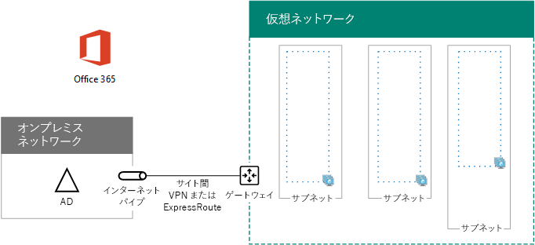

# <a name="high-availability-federated-authentication-phase-1-configure-azure"></a><span data-ttu-id="982ab-103">高可用性フェデレーション認証のフェーズ 1:Azure を構成する</span><span class="sxs-lookup"><span data-stu-id="982ab-103">High availability federated authentication Phase 1: Configure Azure</span></span>

 <span data-ttu-id="982ab-104">**の概要:** Office 365 のホストの高可用性の統合認証に Microsoft Azure インフラストラクチャを構成します。</span><span class="sxs-lookup"><span data-stu-id="982ab-104">**Summary:** Configure the Microsoft Azure infrastructure to host high availability federated authentication for Office 365.</span></span>
  
<span data-ttu-id="982ab-p101">このフェーズでは、リソース グループ、2、3、および 4 の段階で仮想マシンをホストする Azure 内の仮想ネットワーク (VNet)、および可用性を設定を作成します。上に移動する前に、このフェーズを完了する必要があります[高可用性の統合認証フェーズ 2: ドメイン コント ローラーを構成する](high-availability-federated-authentication-phase-2-configure-domain-controllers.md)です。フェーズのすべては、 [Azure で Office 365 の展開の高可用性フェデレーション認証](deploy-high-availability-federated-authentication-for-office-365-in-azure.md)を参照してください。</span><span class="sxs-lookup"><span data-stu-id="982ab-p101">In this phase, you create the resource groups, virtual network (VNet), and availability sets in Azure that will host the virtual machines in phases 2, 3, and 4. You must complete this phase before moving on to [High availability federated authentication Phase 2: Configure domain controllers](high-availability-federated-authentication-phase-2-configure-domain-controllers.md). See [Deploy high availability federated authentication for Office 365 in Azure](deploy-high-availability-federated-authentication-for-office-365-in-azure.md) for all of the phases.</span></span>
  
<span data-ttu-id="982ab-108">Azure は、これらの基本的なコンポーネントを準備する必要があります。</span><span class="sxs-lookup"><span data-stu-id="982ab-108">Azure must be provisioned with these basic components:</span></span>
  
- <span data-ttu-id="982ab-109">リソース グループ</span><span class="sxs-lookup"><span data-stu-id="982ab-109">Resource groups</span></span>
    
- <span data-ttu-id="982ab-110">Azure 仮想マシンをホストするためのサブネットを含むクロスプレミスの Azure 仮想ネットワーク</span><span class="sxs-lookup"><span data-stu-id="982ab-110">A cross-premises Azure virtual network (VNet) with subnets for hosting the Azure virtual machines</span></span>
    
- <span data-ttu-id="982ab-111">サブネットの分離を実行するためのネットワーク セキュリティ グループ</span><span class="sxs-lookup"><span data-stu-id="982ab-111">Network security groups for performing subnet isolation</span></span>
    
- <span data-ttu-id="982ab-112">可用性セット</span><span class="sxs-lookup"><span data-stu-id="982ab-112">Availability sets</span></span>
    
## <a name="configure-azure-components"></a><span data-ttu-id="982ab-113">Azure のコンポーネントの構成</span><span class="sxs-lookup"><span data-stu-id="982ab-113">Configure Azure components</span></span>

<span data-ttu-id="982ab-p102">Azure のコンポーネントの構成を開始する前に、次の表に入力します。Azure の構成の手順を支援する、このセクションを印刷する必要な情報をメモまたはこのセクションをドキュメントにコピーしで塗りつぶします。VNet の設定、テーブル V を入力します。</span><span class="sxs-lookup"><span data-stu-id="982ab-p102">Before you begin configuring Azure components, fill in the following tables. To assist you in the procedures for configuring Azure, print this section and write down the needed information or copy this section to a document and fill it in. For the settings of the VNet, fill in Table V.</span></span>
  
|<span data-ttu-id="982ab-117">**項目**</span><span class="sxs-lookup"><span data-stu-id="982ab-117">**Item**</span></span>|<span data-ttu-id="982ab-118">**構成設定**</span><span class="sxs-lookup"><span data-stu-id="982ab-118">**Configuration setting**</span></span>|<span data-ttu-id="982ab-119">**説明**</span><span class="sxs-lookup"><span data-stu-id="982ab-119">**Description**</span></span>|<span data-ttu-id="982ab-120">**値**</span><span class="sxs-lookup"><span data-stu-id="982ab-120">**Value**</span></span>|
|:-----|:-----|:-----|:-----|
|<span data-ttu-id="982ab-121">1.</span><span class="sxs-lookup"><span data-stu-id="982ab-121">1.</span></span>  <br/> |<span data-ttu-id="982ab-122">VNet 名</span><span class="sxs-lookup"><span data-stu-id="982ab-122">VNet name</span></span>  <br/> |<span data-ttu-id="982ab-123">VNet に割り当てる名前 (例 FedAuthNet)。</span><span class="sxs-lookup"><span data-stu-id="982ab-123">A name to assign to the VNet (example FedAuthNet).</span></span>  <br/> |  <br/> |
|<span data-ttu-id="982ab-124">2.</span><span class="sxs-lookup"><span data-stu-id="982ab-124">2.</span></span>  <br/> |<span data-ttu-id="982ab-125">VNet の場所</span><span class="sxs-lookup"><span data-stu-id="982ab-125">VNet location</span></span>  <br/> |<span data-ttu-id="982ab-126">仮想ネットワークが含まれる地域の Azure データセンター。</span><span class="sxs-lookup"><span data-stu-id="982ab-126">The regional Azure datacenter that will contain the virtual network.</span></span>  <br/> |  <br/> |
|<span data-ttu-id="982ab-127">3.</span><span class="sxs-lookup"><span data-stu-id="982ab-127">3.</span></span>  <br/> |<span data-ttu-id="982ab-128">VPN デバイスの IP アドレス</span><span class="sxs-lookup"><span data-stu-id="982ab-128">VPN device IP address</span></span>  <br/> |<span data-ttu-id="982ab-129">インターネット上の VPN デバイスのインターフェイスのパブリック IPv4 アドレス。</span><span class="sxs-lookup"><span data-stu-id="982ab-129">The public IPv4 address of your VPN device's interface on the Internet.</span></span>  <br/> |  <br/> |
|<span data-ttu-id="982ab-130">4.</span><span class="sxs-lookup"><span data-stu-id="982ab-130">4.</span></span>  <br/> |<span data-ttu-id="982ab-131">VNet アドレス空間</span><span class="sxs-lookup"><span data-stu-id="982ab-131">VNet address space</span></span>  <br/> |<span data-ttu-id="982ab-p103">仮想ネットワークのアドレス空間。このアドレス空間は、IT 部門と協議して決定してください。</span><span class="sxs-lookup"><span data-stu-id="982ab-p103">The address space for the virtual network. Work with your IT department to determine this address space.</span></span>  <br/> |  <br/> |
|<span data-ttu-id="982ab-134">5.</span><span class="sxs-lookup"><span data-stu-id="982ab-134">5.</span></span>  <br/> |<span data-ttu-id="982ab-135">IPsec 共有キー</span><span class="sxs-lookup"><span data-stu-id="982ab-135">IPsec shared key</span></span>  <br/> |<span data-ttu-id="982ab-p104">32 文字のランダムな英数字文字列。サイト間 VPN 接続の両側を認証するために使用されます。このキーの値は、IT 部門またはセキュリティ部門と協議して決定してください。または、「[IPsec 事前共有キーのランダム文字列を作成する](http://social.technet.microsoft.com/wiki/contents/articles/32330.create-a-random-string-for-an-ipsec-preshared-key.aspx)」を参照してください。  </span><span class="sxs-lookup"><span data-stu-id="982ab-p104">A 32-character random, alphanumeric string that will be used to authenticate both sides of the site-to-site VPN connection. Work with your IT or security department to determine this key value. Alternately, see [Create a random string for an IPsec preshared key](http://social.technet.microsoft.com/wiki/contents/articles/32330.create-a-random-string-for-an-ipsec-preshared-key.aspx).  </span></span><br/> |  <br/> |
   
 <span data-ttu-id="982ab-139">**表 V:クロスプレミスの仮想ネットワーク構成**</span><span class="sxs-lookup"><span data-stu-id="982ab-139">**Table V: Cross-premises virtual network configuration**</span></span>
  
<span data-ttu-id="982ab-p105">次に、このソリューションのサブネットついて、「表 S」に必要事項を記入します。すべてのアドレス空間は、クラスレス ドメイン間ルーティング (CIDR) 形式 (別称: ネットワーク プレフィックス形式) にする必要があります。たとえば、10.24.64.0/20 のようにします。</span><span class="sxs-lookup"><span data-stu-id="982ab-p105">Next, fill in Table S for the subnets of this solution. All address spaces should be in Classless Interdomain Routing (CIDR) format, also known as network prefix format. An example is 10.24.64.0/20.</span></span>
  
<span data-ttu-id="982ab-p106">最初の 3 つのサブネットについて、仮想ネットワークのアドレス空間に基づいた名前と単一の IP アドレス空間を指定します。ゲートウェイ サブネットについて、次を実行して、Azure ゲートウェイ サブネットの 27 ビット アドレス空間 (プレフィックス長 /27) を決定します。</span><span class="sxs-lookup"><span data-stu-id="982ab-p106">For the first three subnets, specify a name and a single IP address space based on the virtual network address space. For the gateway subnet, determine the 27-bit address space (with a /27 prefix length) for the Azure gateway subnet with the following:</span></span>
  
1. <span data-ttu-id="982ab-145">VNet アドレス空間の可変ビットを 1 に設定します (ゲートウェイ サブネットに使用しているビット数まで)。残りのビットは 0 に設定します。</span><span class="sxs-lookup"><span data-stu-id="982ab-145">Set the variable bits in the address space of the VNet to 1, up to the bits being used by the gateway subnet, then set the remaining bits to 0.</span></span>
    
2. <span data-ttu-id="982ab-146">その結果のビットを 10 進数に変換して、ゲートウェイ サブネットのサイズに設定されたプレフィックス長のアドレス空間として表現します。</span><span class="sxs-lookup"><span data-stu-id="982ab-146">Convert the resulting bits to decimal and express it as an address space with the prefix length set to the size of the gateway subnet.</span></span>
    
<span data-ttu-id="982ab-147">PowerShell コマンドのブロックとするこの計算を実行するコンソール アプリケーションを C# または Python の[Azure ゲートウェイのサブネットのアドレス領域の計算](https://gallery.technet.microsoft.com/scriptcenter/Address-prefix-calculator-a94b6eed)を参照してください。</span><span class="sxs-lookup"><span data-stu-id="982ab-147">See [Address space calculator for Azure gateway subnets](https://gallery.technet.microsoft.com/scriptcenter/Address-prefix-calculator-a94b6eed) for a PowerShell command block and C# or Python console application that performs this calculation for you.</span></span>
  
<span data-ttu-id="982ab-148">これに該当するアドレス空間については、仮想ネットワークのアドレス空間に基づいて、IT 部門と協議して決定してください。</span><span class="sxs-lookup"><span data-stu-id="982ab-148">Work with your IT department to determine these address spaces from the virtual network address space.</span></span>
  
|<span data-ttu-id="982ab-149">**項目**</span><span class="sxs-lookup"><span data-stu-id="982ab-149">**Item**</span></span>|<span data-ttu-id="982ab-150">**サブネット名**</span><span class="sxs-lookup"><span data-stu-id="982ab-150">**Subnet name**</span></span>|<span data-ttu-id="982ab-151">**サブネット アドレス スペース**</span><span class="sxs-lookup"><span data-stu-id="982ab-151">**Subnet address space**</span></span>|<span data-ttu-id="982ab-152">**用途**</span><span class="sxs-lookup"><span data-stu-id="982ab-152">**Purpose**</span></span>|
|:-----|:-----|:-----|:-----|
|<span data-ttu-id="982ab-153">1.</span><span class="sxs-lookup"><span data-stu-id="982ab-153">1.</span></span>  <br/> |  <br/> |  <br/> |<span data-ttu-id="982ab-154">Windows Server Active Directory (AD) ドメイン コントローラーと DirSync サーバー仮想マシン (VM) が使用するサブネット。</span><span class="sxs-lookup"><span data-stu-id="982ab-154">The subnet used by the Windows Server Active Directory (AD) domain controller and DirSync server virtual machines (VMs).</span></span>  <br/> |
|<span data-ttu-id="982ab-155">2.</span><span class="sxs-lookup"><span data-stu-id="982ab-155">2.</span></span>  <br/> |  <br/> |  <br/> |<span data-ttu-id="982ab-156">AD FS VM が使用するサブネット。</span><span class="sxs-lookup"><span data-stu-id="982ab-156">The subnet used by the AD FS VMs.</span></span>  <br/> |
|<span data-ttu-id="982ab-157">3.</span><span class="sxs-lookup"><span data-stu-id="982ab-157">3.</span></span>  <br/> |  <br/> |  <br/> |<span data-ttu-id="982ab-158">Web アプリケーション プロキシ VM が使用するサブネット。</span><span class="sxs-lookup"><span data-stu-id="982ab-158">The subnet used by the web application proxy VMs.</span></span>  <br/> |
|<span data-ttu-id="982ab-159">4.</span><span class="sxs-lookup"><span data-stu-id="982ab-159">4.</span></span>  <br/> |<span data-ttu-id="982ab-160">GatewaySubnet</span><span class="sxs-lookup"><span data-stu-id="982ab-160">GatewaySubnet</span></span>  <br/> |  <br/> |<span data-ttu-id="982ab-161">Azure ゲートウェイ VM が使用するサブネット。</span><span class="sxs-lookup"><span data-stu-id="982ab-161">The subnet used by the Azure gateway VMs.</span></span>  <br/> |
   
 <span data-ttu-id="982ab-162">**表 S:仮想ネットワーク内のサブネット**</span><span class="sxs-lookup"><span data-stu-id="982ab-162">**Table S: Subnets in the virtual network**</span></span>
  
<span data-ttu-id="982ab-163">次に、仮想マシンとロード バランサーのインスタンスに割り当てる静的 IP について、「表 I」に必要事項を記入します。</span><span class="sxs-lookup"><span data-stu-id="982ab-163">Next, fill in Table I for the static IP addresses assigned to virtual machines and load balancer instances.</span></span>
  
|<span data-ttu-id="982ab-164">**項目**</span><span class="sxs-lookup"><span data-stu-id="982ab-164">**Item**</span></span>|<span data-ttu-id="982ab-165">**用途**</span><span class="sxs-lookup"><span data-stu-id="982ab-165">**Purpose**</span></span>|<span data-ttu-id="982ab-166">**サブネット上の IP アドレス**</span><span class="sxs-lookup"><span data-stu-id="982ab-166">**IP address on the subnet**</span></span>|<span data-ttu-id="982ab-167">**値**</span><span class="sxs-lookup"><span data-stu-id="982ab-167">**Value**</span></span>|
|:-----|:-----|:-----|:-----|
|<span data-ttu-id="982ab-168">1.</span><span class="sxs-lookup"><span data-stu-id="982ab-168">1.</span></span>  <br/> |<span data-ttu-id="982ab-169">最初のドメイン コントローラーの静的 IP アドレス</span><span class="sxs-lookup"><span data-stu-id="982ab-169">Static IP address of the first domain controller</span></span>  <br/> |<span data-ttu-id="982ab-170">「表 S」の「項目 1」で定義されたサブネットのアドレス空間について、4 番目に考えられる IP アドレス。</span><span class="sxs-lookup"><span data-stu-id="982ab-170">The fourth possible IP address for the address space of the subnet defined in Item 1 of Table S.</span></span>  <br/> |  <br/> |
|<span data-ttu-id="982ab-171">2.</span><span class="sxs-lookup"><span data-stu-id="982ab-171">2.</span></span>  <br/> |<span data-ttu-id="982ab-172">2 番目のドメイン コントローラーの静的 IP アドレス</span><span class="sxs-lookup"><span data-stu-id="982ab-172">Static IP address of the second domain controller</span></span>  <br/> |<span data-ttu-id="982ab-173">「表 S」の「項目 1」で定義されたサブネットのアドレス空間について、5 番目に考えられる IP アドレス。</span><span class="sxs-lookup"><span data-stu-id="982ab-173">The fifth possible IP address for the address space of the subnet defined in Item 1 of Table S.</span></span>  <br/> |  <br/> |
|<span data-ttu-id="982ab-174">3.</span><span class="sxs-lookup"><span data-stu-id="982ab-174">3.</span></span>  <br/> |<span data-ttu-id="982ab-175">DirSync サーバーの静的 IP アドレス</span><span class="sxs-lookup"><span data-stu-id="982ab-175">Static IP address of the DirSync server</span></span>  <br/> |<span data-ttu-id="982ab-176">「表 S」の「項目 1」で定義されたサブネットのアドレス空間について、6 番目に考えられる IP アドレス。</span><span class="sxs-lookup"><span data-stu-id="982ab-176">The sixth possible IP address for the address space of the subnet defined in Item 1 of Table S.</span></span>  <br/> |  <br/> |
|<span data-ttu-id="982ab-177">4.</span><span class="sxs-lookup"><span data-stu-id="982ab-177">4.</span></span>  <br/> |<span data-ttu-id="982ab-178">AD FS サーバーの内部ロード バランサーの静的 IP アドレス</span><span class="sxs-lookup"><span data-stu-id="982ab-178">Static IP address of the internal load balancer for the AD FS servers</span></span>  <br/> |<span data-ttu-id="982ab-179">「表 S」の「項目 2」で定義されたサブネットのアドレス空間について、4 番目に考えられる IP アドレス。</span><span class="sxs-lookup"><span data-stu-id="982ab-179">The fourth possible IP address for the address space of the subnet defined in Item 2 of Table S.</span></span>  <br/> |  <br/> |
|<span data-ttu-id="982ab-180">5.</span><span class="sxs-lookup"><span data-stu-id="982ab-180">5.</span></span>  <br/> |<span data-ttu-id="982ab-181">最初の AD FS サーバーの静的 IP アドレス</span><span class="sxs-lookup"><span data-stu-id="982ab-181">Static IP address of the first AD FS server</span></span>  <br/> |<span data-ttu-id="982ab-182">「表 S」の「項目 2」で定義されたサブネットのアドレス空間について、5 番目に考えられる IP アドレス。</span><span class="sxs-lookup"><span data-stu-id="982ab-182">The fifth possible IP address for the address space of the subnet defined in Item 2 of Table S.</span></span>  <br/> |  <br/> |
|<span data-ttu-id="982ab-183">6.</span><span class="sxs-lookup"><span data-stu-id="982ab-183">6.</span></span>  <br/> |<span data-ttu-id="982ab-184">2 番目の AD FS サーバーの静的 IP アドレス</span><span class="sxs-lookup"><span data-stu-id="982ab-184">Static IP address of the second AD FS server</span></span>  <br/> |<span data-ttu-id="982ab-185">「表 S」の「項目 2」で定義されたサブネットのアドレス空間について、6 番目に考えられる IP アドレス。</span><span class="sxs-lookup"><span data-stu-id="982ab-185">The sixth possible IP address for the address space of the subnet defined in Item 2 of Table S.</span></span>  <br/> |  <br/> |
|<span data-ttu-id="982ab-186">7.</span><span class="sxs-lookup"><span data-stu-id="982ab-186">7.</span></span>  <br/> |<span data-ttu-id="982ab-187">最初の Web アプリケーション プロキシ サーバーの静的 IP アドレス</span><span class="sxs-lookup"><span data-stu-id="982ab-187">Static IP address of the first web application proxy server</span></span>  <br/> |<span data-ttu-id="982ab-188">「表 S」の「項目 3」で定義されたサブネットのアドレス空間について、4 番目に考えられる IP アドレス。</span><span class="sxs-lookup"><span data-stu-id="982ab-188">The fourth possible IP address for the address space of the subnet defined in Item 3 of Table S.</span></span>  <br/> |  <br/> |
|<span data-ttu-id="982ab-189">8.</span><span class="sxs-lookup"><span data-stu-id="982ab-189">8.</span></span>  <br/> |<span data-ttu-id="982ab-190">2 番目の Web アプリケーション プロキシ サーバーの静的 IP アドレス</span><span class="sxs-lookup"><span data-stu-id="982ab-190">Static IP address of the second web application proxy server</span></span>  <br/> |<span data-ttu-id="982ab-191">「表 S」の「項目 3」で定義されたサブネットのアドレス空間について、5 番目に考えられる IP アドレス。</span><span class="sxs-lookup"><span data-stu-id="982ab-191">The fifth possible IP address for the address space of the subnet defined in Item 3 of Table S.</span></span>  <br/> |  <br/> |
   
 <span data-ttu-id="982ab-192">**表 I: 仮想ネットワークの静的 IP アドレス**</span><span class="sxs-lookup"><span data-stu-id="982ab-192">**Table I: Static IP addresses in the virtual network**</span></span>
  
<span data-ttu-id="982ab-193">仮想ネットワーク内のドメイン コントローラーを最初にセットアップするときに使用する、オンプレミス ネットワーク内の 2 つのドメイン ネーム システム (DNS) について、「表 D」に必要事項を記入します。IT 部門と協議して、このリストを決定してください。</span><span class="sxs-lookup"><span data-stu-id="982ab-193">For two Domain Name System (DNS) servers in your on-premises network that you want to use when initially setting up the domain controllers in your virtual network, fill in Table D. Work with your IT department to determine this list.</span></span>
  
|<span data-ttu-id="982ab-194">**アイテム**</span><span class="sxs-lookup"><span data-stu-id="982ab-194">**Item**</span></span>|<span data-ttu-id="982ab-195">**DNS サーバーのフレンドリ名**</span><span class="sxs-lookup"><span data-stu-id="982ab-195">**DNS server friendly name**</span></span>|<span data-ttu-id="982ab-196">**DNS サーバーの IP アドレス**</span><span class="sxs-lookup"><span data-stu-id="982ab-196">**DNS server IP address**</span></span>|
|:-----|:-----|:-----|
|<span data-ttu-id="982ab-197">1.</span><span class="sxs-lookup"><span data-stu-id="982ab-197">1.</span></span>  <br/> |  <br/> |  <br/> |
|<span data-ttu-id="982ab-198">2.</span><span class="sxs-lookup"><span data-stu-id="982ab-198">2.</span></span>  <br/> |  <br/> |  <br/> |
   
 <span data-ttu-id="982ab-199">**表 D:オンプレミスの DNS サーバー**</span><span class="sxs-lookup"><span data-stu-id="982ab-199">**Table D: On-premises DNS servers**</span></span>
  
<span data-ttu-id="982ab-p107">クロスプレミス ネットワークからサイト間 VPN 接続を通過して組織ネットワークにパケットをルーティングするには、組織のオンプレミス ネットワーク上の到達可能なすべての場所についてのアドレス空間 (CIDR 表記) の一覧が含まれているローカル ネットワークで仮想ネットワークを構成する必要があります。このローカル ネットワークを定義するアドレス空間の一覧は、一意であることが必要であり、別の仮想ネットワークや別のローカル ネットワークとの重複がないことが必要になります。</span><span class="sxs-lookup"><span data-stu-id="982ab-p107">To route packets from the cross-premises network to your organization network across the site-to-site VPN connection, you must configure the virtual network with a local network that contains a list of the address spaces (in CIDR notation) for all of the reachable locations on your organization's on-premises network. The list of address spaces that define your local network must be unique and must not overlap with the address space used for other virtual networks or other local networks.</span></span>
  
<span data-ttu-id="982ab-p108">一連のローカル ネットワークのアドレス スペースに関しては表 L に記入します。3 つの空白のエントリが記載されていますが、通常はさらに必要となります。IT 部門に尋ねてこのアドレス スペースの一覧を特定してください。</span><span class="sxs-lookup"><span data-stu-id="982ab-p108">For the set of local network address spaces, fill in Table L. Note that three blank entries are listed but you will typically need more. Work with your IT department to determine this list of address spaces.</span></span>
  
|<span data-ttu-id="982ab-204">**アイテム**</span><span class="sxs-lookup"><span data-stu-id="982ab-204">**Item**</span></span>|<span data-ttu-id="982ab-205">**ローカル ネットワークのアドレス スペース**</span><span class="sxs-lookup"><span data-stu-id="982ab-205">**Local network address space**</span></span>|
|:-----|:-----|
|<span data-ttu-id="982ab-206">1.</span><span class="sxs-lookup"><span data-stu-id="982ab-206">1.</span></span>  <br/> |  <br/> |
|<span data-ttu-id="982ab-207">2.</span><span class="sxs-lookup"><span data-stu-id="982ab-207">2.</span></span>  <br/> |  <br/> |
|<span data-ttu-id="982ab-208">3.</span><span class="sxs-lookup"><span data-stu-id="982ab-208">3.</span></span>  <br/> |  <br/> |
   
 <span data-ttu-id="982ab-209">**表 L:ローカル ネットワークのアドレス プレフィックス**</span><span class="sxs-lookup"><span data-stu-id="982ab-209">**Table L: Address prefixes for the local network**</span></span>
  
<span data-ttu-id="982ab-210">ここからは、Office 365 のフェデレーション認証をホストするための Azure インフラストラクチャの構築を開始します。</span><span class="sxs-lookup"><span data-stu-id="982ab-210">Now let's begin building the Azure infrastructure to host your federated authentication for Office 365.</span></span>
  
> [!NOTE]
> <span data-ttu-id="982ab-p109">次のコマンド セットは、Azure PowerShell の最新版を使用します。「[Azure PowerShell の概要](https://docs.microsoft.com/en-us/powershell/azureps-cmdlets-docs/)」を参照してください。</span><span class="sxs-lookup"><span data-stu-id="982ab-p109">The following command sets use the latest version of Azure PowerShell. See [Get started with Azure PowerShell cmdlets](https://docs.microsoft.com/en-us/powershell/azureps-cmdlets-docs/).</span></span> 
  
<span data-ttu-id="982ab-213">まず、Azure PowerShell プロンプトを起動して、自分のアカウントにログインします。</span><span class="sxs-lookup"><span data-stu-id="982ab-213">First, start an Azure PowerShell prompt and login to your account.</span></span>
  
```
Login-AzureRMAccount
```

> [!TIP]
> <span data-ttu-id="982ab-214">すべての PowerShell コマンドは、この資料で即座に実行の PowerShell コマンド ブロックが、カスタム設定に基づくを生成する Microsoft Excel の構成のブックに含まれているテキスト ファイルを参照してください[Office 365 のフェデレーション認証Azure 展開キット](https://gallery.technet.microsoft.com/Federated-Authentication-8a9f1664)です。</span><span class="sxs-lookup"><span data-stu-id="982ab-214">For a text file that contains all of the PowerShell commands in this article and a Microsoft Excel configuration workbook that generates ready-to-run PowerShell command blocks based on your custom settings, see the [Federated Authentication for Office 365 in Azure Deployment Kit](https://gallery.technet.microsoft.com/Federated-Authentication-8a9f1664).</span></span> 
  
<span data-ttu-id="982ab-215">次のコマンドを使用して、サブスクリプションの名前を取得します。</span><span class="sxs-lookup"><span data-stu-id="982ab-215">Get your subscription name using the following command.</span></span>
  
```
Get-AzureRMSubscription | Sort Name | Select Name
```

<span data-ttu-id="982ab-216">Azure PowerShell の以前のバージョンの代わりにこのコマンドを使用します。</span><span class="sxs-lookup"><span data-stu-id="982ab-216">For older versions of Azure PowerShell, use this command instead.</span></span>
  
```
Get-AzureRMSubscription | Sort Name | Select SubscriptionName
```

<span data-ttu-id="982ab-p110">Azure サブスクリプションを設定します。など、二重引用符内のすべてを交換して、\<と > 正しい名前の文字です。</span><span class="sxs-lookup"><span data-stu-id="982ab-p110">Set your Azure subscription. Replace everything within the quotes, including the \< and > characters, with the correct name.</span></span>
  
```
$subscr="<subscription name>"
Get-AzureRmSubscription -SubscriptionName $subscr | Select-AzureRmSubscription
```

<span data-ttu-id="982ab-p111">次に、新しいリソース グループを作成します。リソース グループ名の一意のセットを決定するために、このコマンドを使用して、既存のリソース グループを一覧表示します。</span><span class="sxs-lookup"><span data-stu-id="982ab-p111">Next, create the new resource groups. To determine a unique set of resource group names, use this command to list your existing resource groups.</span></span>
  
```
Get-AzureRMResourceGroup | Sort ResourceGroupName | Select ResourceGroupName
```

<span data-ttu-id="982ab-221">一意のリソース グループ名のセットについて、次に示す表に必要事項を記入します。</span><span class="sxs-lookup"><span data-stu-id="982ab-221">Fill in the following table for the set of unique resource group names.</span></span>
  
|<span data-ttu-id="982ab-222">**項目**</span><span class="sxs-lookup"><span data-stu-id="982ab-222">**Item**</span></span>|<span data-ttu-id="982ab-223">**リソース グループ名**</span><span class="sxs-lookup"><span data-stu-id="982ab-223">**Resource group name**</span></span>|<span data-ttu-id="982ab-224">**用途**</span><span class="sxs-lookup"><span data-stu-id="982ab-224">**Purpose**</span></span>|
|:-----|:-----|:-----|
|<span data-ttu-id="982ab-225">1.</span><span class="sxs-lookup"><span data-stu-id="982ab-225">1.</span></span>  <br/> |  <br/> |<span data-ttu-id="982ab-226">ドメイン コントローラー</span><span class="sxs-lookup"><span data-stu-id="982ab-226">Domain controllers</span></span>  <br/> |
|<span data-ttu-id="982ab-227">2.</span><span class="sxs-lookup"><span data-stu-id="982ab-227">2.</span></span>  <br/> |  <br/> |<span data-ttu-id="982ab-228">AD FS サーバー</span><span class="sxs-lookup"><span data-stu-id="982ab-228">AD FS servers</span></span>  <br/> |
|<span data-ttu-id="982ab-229">3.</span><span class="sxs-lookup"><span data-stu-id="982ab-229">3.</span></span>  <br/> |  <br/> |<span data-ttu-id="982ab-230">Web アプリケーション プロキシ サーバー</span><span class="sxs-lookup"><span data-stu-id="982ab-230">Web application proxy servers</span></span>  <br/> |
|<span data-ttu-id="982ab-231">4.</span><span class="sxs-lookup"><span data-stu-id="982ab-231">4.</span></span>  <br/> |  <br/> |<span data-ttu-id="982ab-232">インフラストラクチャの要素</span><span class="sxs-lookup"><span data-stu-id="982ab-232">Infrastructure elements</span></span>  <br/> |
   
 <span data-ttu-id="982ab-233">**表 R: リソース グループ**</span><span class="sxs-lookup"><span data-stu-id="982ab-233">**Table R: Resource groups**</span></span>
  
<span data-ttu-id="982ab-234">次に示すコマンドで、新しいリソース グループを作成します。</span><span class="sxs-lookup"><span data-stu-id="982ab-234">Create your new resource groups with these commands.</span></span>
  
```
$locName="<an Azure location, such as West US>"
$rgName="<Table R - Item 1 - Name column>"
New-AzureRMResourceGroup -Name $rgName -Location $locName
$rgName="<Table R - Item 2 - Name column>"
New-AzureRMResourceGroup -Name $rgName -Location $locName
$rgName="<Table R - Item 3 - Name column>"
New-AzureRMResourceGroup -Name $rgName -Location $locName
$rgName="<Table R - Item 4 - Name column>"
New-AzureRMResourceGroup -Name $rgName -Location $locName
```

<span data-ttu-id="982ab-235">次に、Azure 仮想ネットワークとそのサブネットを作成します。</span><span class="sxs-lookup"><span data-stu-id="982ab-235">Next, you create the Azure virtual network and its subnets.</span></span>
  
```
$rgName="<Table R - Item 4 - Resource group name column>"
$locName="<your Azure location>"
$vnetName="<Table V - Item 1 - Value column>"
$vnetAddrPrefix="<Table V - Item 4 - Value column>"
$dnsServers=@( "<Table D - Item 1 - DNS server IP address column>", "<Table D - Item 2 - DNS server IP address column>" )
# Get the shortened version of the location
$locShortName=(Get-AzureRmResourceGroup -Name $rgName).Location

# Create the subnets
$subnet1Name="<Table S - Item 1 - Subnet name column>"
$subnet1Prefix="<Table S - Item 1 - Subnet address space column>"
$subnet1=New-AzureRMVirtualNetworkSubnetConfig -Name $subnet1Name -AddressPrefix $subnet1Prefix
$subnet2Name="<Table S - Item 2 - Subnet name column>"
$subnet2Prefix="<Table S - Item 2 - Subnet address space column>"
$subnet2=New-AzureRMVirtualNetworkSubnetConfig -Name $subnet2Name -AddressPrefix $subnet2Prefix
$subnet3Name="<Table S - Item 3 - Subnet name column>"
$subnet3Prefix="<Table S - Item 3 - Subnet address space column>"
$subnet3=New-AzureRMVirtualNetworkSubnetConfig -Name $subnet3Name -AddressPrefix $subnet3Prefix
$gwSubnet4Prefix="<Table S - Item 4 - Subnet address space column>"
$gwSubnet=New-AzureRMVirtualNetworkSubnetConfig -Name "GatewaySubnet" -AddressPrefix $gwSubnet4Prefix

# Create the virtual network
New-AzureRMVirtualNetwork -Name $vnetName -ResourceGroupName $rgName -Location $locName -AddressPrefix $vnetAddrPrefix -Subnet $gwSubnet,$subnet1,$subnet2,$subnet3 -DNSServer $dnsServers

```

<span data-ttu-id="982ab-p112">次に、仮想マシンが含まれているサブネットごとにネットワーク セキュリティ グループを作成します。サブネットを分離するには、サブネットのネットワーク セキュリティ グループでの特定の種類のトラフィックを許可または拒否する規則を追加できます。</span><span class="sxs-lookup"><span data-stu-id="982ab-p112">Next, you create network security groups for each subnet that contains virtual machines. To perform subnet isolation, you can add rules for the specific types of traffic allowed or denied to the network security group of a subnet.</span></span>
  
```
# Create network security groups
$vnet=Get-AzureRMVirtualNetwork -ResourceGroupName $rgName -Name $vnetName

New-AzureRMNetworkSecurityGroup -Name $subnet1Name -ResourceGroupName $rgName -Location $locShortName
$nsg=Get-AzureRMNetworkSecurityGroup -Name $subnet1Name -ResourceGroupName $rgName
Set-AzureRMVirtualNetworkSubnetConfig -VirtualNetwork $vnet -Name $subnet1Name -AddressPrefix $subnet1Prefix -NetworkSecurityGroup $nsg

New-AzureRMNetworkSecurityGroup -Name $subnet2Name -ResourceGroupName $rgName -Location $locShortName
$nsg=Get-AzureRMNetworkSecurityGroup -Name $subnet2Name -ResourceGroupName $rgName
Set-AzureRMVirtualNetworkSubnetConfig -VirtualNetwork $vnet -Name $subnet2Name -AddressPrefix $subnet2Prefix -NetworkSecurityGroup $nsg

New-AzureRMNetworkSecurityGroup -Name $subnet3Name -ResourceGroupName $rgName -Location $locShortName
$nsg=Get-AzureRMNetworkSecurityGroup -Name $subnet3Name -ResourceGroupName $rgName
Set-AzureRMVirtualNetworkSubnetConfig -VirtualNetwork $vnet -Name $subnet3Name -AddressPrefix $subnet3Prefix -NetworkSecurityGroup $nsg
```

<span data-ttu-id="982ab-238">次に、これらのコマンドを使用して、サイト間 VPN 接続のゲートウェイを作成します。</span><span class="sxs-lookup"><span data-stu-id="982ab-238">Next, use these commands to create the gateways for the site-to-site VPN connection.</span></span>
  
```
$rgName="<Table R - Item 4 - Resource group name column>"
$locName="<Azure location>"
$vnetName="<Table V - Item 1 - Value column>"
$vnet=Get-AzureRMVirtualNetwork -Name $vnetName -ResourceGroupName $rgName
$subnet=Get-AzureRmVirtualNetworkSubnetConfig -VirtualNetwork $vnet -Name "GatewaySubnet"

# Attach a virtual network gateway to a public IP address and the gateway subnet
$publicGatewayVipName="PublicIPAddress"
$vnetGatewayIpConfigName="PublicIPConfig"
New-AzureRMPublicIpAddress -Name $vnetGatewayIpConfigName -ResourceGroupName $rgName -Location $locName -AllocationMethod Dynamic
$publicGatewayVip=Get-AzureRMPublicIpAddress -Name $vnetGatewayIpConfigName -ResourceGroupName $rgName
$vnetGatewayIpConfig=New-AzureRMVirtualNetworkGatewayIpConfig -Name $vnetGatewayIpConfigName -PublicIpAddressId $publicGatewayVip.Id -Subnet $subnet

# Create the Azure gateway
$vnetGatewayName="AzureGateway"
$vnetGateway=New-AzureRMVirtualNetworkGateway -Name $vnetGatewayName -ResourceGroupName $rgName -Location $locName -GatewayType Vpn -VpnType RouteBased -IpConfigurations $vnetGatewayIpConfig

# Create the gateway for the local network
$localGatewayName="LocalNetGateway"
$localGatewayIP="<Table V - Item 3 - Value column>"
$localNetworkPrefix=@( <comma-separated, double-quote enclosed list of the local network address prefixes from Table L, example: "10.1.0.0/24", "10.2.0.0/24"> )
$localGateway=New-AzureRMLocalNetworkGateway -Name $localGatewayName -ResourceGroupName $rgName -Location $locName -GatewayIpAddress $localGatewayIP -AddressPrefix $localNetworkPrefix

# Define the Azure virtual network VPN connection
$vnetConnectionName="S2SConnection"
$vnetConnectionKey="<Table V - Item 5 - Value column>"
$vnetConnection=New-AzureRMVirtualNetworkGatewayConnection -Name $vnetConnectionName -ResourceGroupName $rgName -Location $locName -ConnectionType IPsec -SharedKey $vnetConnectionKey -VirtualNetworkGateway1 $vnetGateway -LocalNetworkGateway2 $localGateway

```

> [!NOTE]
> <span data-ttu-id="982ab-p113">個々 のユーザーのフェデレーション認証は、社内設置型のリソースには依存しません。ただし、このサイト間 VPN 接続が利用できなくなった場合、VNet のドメイン コント ローラーではこのユーザー アカウントとグループの設置型の Windows Server AD に加えられた更新プログラムが受信しません。そうでないことを確認するには、サイト間 VPN 接続の高可用性を構成できます。詳細については、[高度利用可能な間、設置型および VNet-VNet への接続](https://docs.microsoft.com/azure/vpn-gateway/vpn-gateway-highlyavailable)を参照してください。</span><span class="sxs-lookup"><span data-stu-id="982ab-p113">Federated authentication of individual users does not rely on any on-premises resources. However, if this site-to-site VPN connection becomes unavailable, the domain controllers in the VNet will not receive updates to user accounts and groups made in the on-premises Windows Server AD. To ensure this does not happen, you can configure high availability for your site-to-site VPN connection. For more information, see [Highly Available Cross-Premises and VNet-to-VNet Connectivity](https://docs.microsoft.com/azure/vpn-gateway/vpn-gateway-highlyavailable)</span></span>
  
<span data-ttu-id="982ab-243">次に、このコマンドの表示から得られる、仮想ネットワーク用の Azure VPN ゲートウェイのパブリック IPv4 アドレスを記録します。</span><span class="sxs-lookup"><span data-stu-id="982ab-243">Next, record the public IPv4 address of the Azure VPN gateway for your virtual network from the display of this command:</span></span>
  
```
Get-AzureRMPublicIpAddress -Name $publicGatewayVipName -ResourceGroupName $rgName
```

<span data-ttu-id="982ab-p114">次に、Azure VPN ゲートウェイに接続するようにオンプレミスの VPN デバイスを構成します。詳細については、「[サイト間 VPN Gateway 接続の VPN デバイスについて](https://docs.microsoft.com/azure/vpn-gateway/vpn-gateway-about-vpn-devices)」を参照してください。</span><span class="sxs-lookup"><span data-stu-id="982ab-p114">Next, configure your on-premises VPN device to connect to the Azure VPN gateway. For more information, see [Configure your VPN device](https://docs.microsoft.com/azure/vpn-gateway/vpn-gateway-about-vpn-devices).</span></span>
  
<span data-ttu-id="982ab-246">オンプレミス VPN デバイスを構成するには、次のものが必要になります。</span><span class="sxs-lookup"><span data-stu-id="982ab-246">To configure your on-premises VPN device, you will need the following:</span></span>
  
- <span data-ttu-id="982ab-247">Azure VPN ゲートウェイのパブリック IPv4 アドレス。</span><span class="sxs-lookup"><span data-stu-id="982ab-247">The public IPv4 address of the Azure VPN gateway.</span></span>
    
- <span data-ttu-id="982ab-248">サイト間 VPN 接続の IPsec 事前共有キー (「表 V」-「項目 5」-「値」列)。</span><span class="sxs-lookup"><span data-stu-id="982ab-248">The IPsec pre-shared key for the site-to-site VPN connection (Table V - Item 5 - Value column).</span></span>
    
<span data-ttu-id="982ab-p115">次に、仮想ネットワークのアドレス空間がオンプレミスのネットワークからアクセスできることを確認します。一般に、これは、仮想ネットワークのアドレス空間から VPN デバイスに対応するルートを追加してから、そのルートを組織ネットワークの残りのルーティング インフラストラクチャに公示することで実行します。IT 部門と協議して、この方法について決定してください。</span><span class="sxs-lookup"><span data-stu-id="982ab-p115">Next, ensure that the address space of the virtual network is reachable from your on-premises network. This is usually done by adding a route corresponding to the virtual network address space to your VPN device and then advertising that route to the rest of the routing infrastructure of your organization network. Work with your IT department to determine how to do this.</span></span>
  
<span data-ttu-id="982ab-p116">次に、3 つの可用性セットの名前を定義します。「表 A」に必要事項を記入します。</span><span class="sxs-lookup"><span data-stu-id="982ab-p116">Next, define the names of three availability sets. Fill out Table A.</span></span> 
  
|<span data-ttu-id="982ab-254">**項目**</span><span class="sxs-lookup"><span data-stu-id="982ab-254">**Item**</span></span>|<span data-ttu-id="982ab-255">**用途**</span><span class="sxs-lookup"><span data-stu-id="982ab-255">**Purpose**</span></span>|<span data-ttu-id="982ab-256">**可用性セット名**</span><span class="sxs-lookup"><span data-stu-id="982ab-256">**Availability set name**</span></span>|
|:-----|:-----|:-----|
|<span data-ttu-id="982ab-257">1.</span><span class="sxs-lookup"><span data-stu-id="982ab-257">1.</span></span>  <br/> |<span data-ttu-id="982ab-258">ドメイン コントローラー</span><span class="sxs-lookup"><span data-stu-id="982ab-258">Domain controllers</span></span>  <br/> |  <br/> |
|<span data-ttu-id="982ab-259">2.</span><span class="sxs-lookup"><span data-stu-id="982ab-259">2.</span></span>  <br/> |<span data-ttu-id="982ab-260">AD FS サーバー</span><span class="sxs-lookup"><span data-stu-id="982ab-260">AD FS servers</span></span>  <br/> |  <br/> |
|<span data-ttu-id="982ab-261">3.</span><span class="sxs-lookup"><span data-stu-id="982ab-261">3.</span></span>  <br/> |<span data-ttu-id="982ab-262">Web アプリケーション プロキシ サーバー</span><span class="sxs-lookup"><span data-stu-id="982ab-262">Web application proxy servers</span></span>  <br/> |  <br/> |
   
 <span data-ttu-id="982ab-263">**表 A: 可用性セット**</span><span class="sxs-lookup"><span data-stu-id="982ab-263">**Table A: Availability sets**</span></span>
  
<span data-ttu-id="982ab-264">これらの名前は、フェーズ 2、3、および 4 で仮想マシンを作成する際に必要になります。</span><span class="sxs-lookup"><span data-stu-id="982ab-264">You will need these names when you create the virtual machines in phases 2, 3, and 4.</span></span>
  
<span data-ttu-id="982ab-265">次に示す Azure PowerShell コマンドで、新しい可用性セットを作成します。</span><span class="sxs-lookup"><span data-stu-id="982ab-265">Create the new availability sets with these Azure PowerShell commands.</span></span>
  
```
$locName="<the Azure location for your new resource group>"
$rgName="<Table R - Item 1 - Resource group name column>"
$avName="<Table A - Item 1 - Availability set name column>"
New-AzureRMAvailabilitySet -ResourceGroupName $rgName -Name $avName -Location $locName -Sku Aligned  -PlatformUpdateDomainCount 5 -PlatformFaultDomainCount 2
$rgName="<Table R - Item 2 - Resource group name column>"
$avName="<Table A - Item 2 - Availability set name column>"
New-AzureRMAvailabilitySet -ResourceGroupName $rgName -Name $avName -Location $locName -Sku Aligned  -PlatformUpdateDomainCount 5 -PlatformFaultDomainCount 2
$rgName="<Table R - Item 3 - Resource group name column>"
$avName="<Table A - Item 3 - Availability set name column>"
New-AzureRMAvailabilitySet -ResourceGroupName $rgName -Name $avName -Location $locName -Sku Aligned  -PlatformUpdateDomainCount 5 -PlatformFaultDomainCount 2
```

<span data-ttu-id="982ab-266">次に、このフェーズが正常に完了した結果の構成を示します。</span><span class="sxs-lookup"><span data-stu-id="982ab-266">This is the configuration resulting from the successful completion of this phase.</span></span>
  
<span data-ttu-id="982ab-267">**フェーズ 1: Office 365 のフェデレーション認証を高可用性を実現するための Azure インフラストラクチャ**</span><span class="sxs-lookup"><span data-stu-id="982ab-267">**Phase 1: The Azure infrastructure for high availability federated authentication for Office 365**</span></span>


  
## <a name="next-step"></a><span data-ttu-id="982ab-269">次の手順</span><span class="sxs-lookup"><span data-stu-id="982ab-269">Next step</span></span>

<span data-ttu-id="982ab-270">使用[高可用性の統合認証フェーズ 2: ドメイン コント ローラーを構成する](high-availability-federated-authentication-phase-2-configure-domain-controllers.md)、この作業負荷の構成を続行するのには。</span><span class="sxs-lookup"><span data-stu-id="982ab-270">Use [High availability federated authentication Phase 2: Configure domain controllers](high-availability-federated-authentication-phase-2-configure-domain-controllers.md) to continue with the configuration of this workload.</span></span>
  
## <a name="see-also"></a><span data-ttu-id="982ab-271">関連項目</span><span class="sxs-lookup"><span data-stu-id="982ab-271">See Also</span></span>

[<span data-ttu-id="982ab-272">Azure に Office 365 の高可用性フェデレーション認証を展開する</span><span class="sxs-lookup"><span data-stu-id="982ab-272">Deploy high availability federated authentication for Office 365 in Azure</span></span>](deploy-high-availability-federated-authentication-for-office-365-in-azure.md)
  
[<span data-ttu-id="982ab-273">Office 365 開発/テスト環境のフェデレーション ID</span><span class="sxs-lookup"><span data-stu-id="982ab-273">Federated identity for your Office 365 dev/test environment</span></span>](federated-identity-for-your-office-365-dev-test-environment.md)
  
[<span data-ttu-id="982ab-274">クラウド導入およびハイブリッド ソリューション</span><span class="sxs-lookup"><span data-stu-id="982ab-274">Cloud adoption and hybrid solutions</span></span>](cloud-adoption-and-hybrid-solutions.md)

[<span data-ttu-id="982ab-275">Office 365 のフェデレーション ID</span><span class="sxs-lookup"><span data-stu-id="982ab-275">Federated identity for Office 365</span></span>](https://support.office.com/article/Understanding-Office-365-identity-and-Azure-Active-Directory-06a189e7-5ec6-4af2-94bf-a22ea225a7a9#bk_federated)


