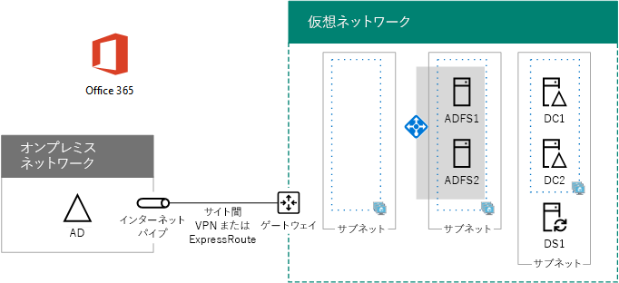

# <a name="high-availability-federated-authentication-phase-3-configure-ad-fs-servers"></a><span data-ttu-id="4675f-103">高可用性フェデレーション認証のフェーズ 3:AD FS サーバーを構成する</span><span class="sxs-lookup"><span data-stu-id="4675f-103">High availability federated authentication Phase 3: Configure AD FS servers</span></span>

 <span data-ttu-id="4675f-104">**の概要:**作成し、Microsoft Azure の Office 365 のフェデレーション認証の高可用性、Active Directory フェデレーション サービス (AD FS) サーバーを構成します。</span><span class="sxs-lookup"><span data-stu-id="4675f-104">**Summary:** Create and configure the Active Directory Federation Services (AD FS) servers for your high availability federated authentication for Office 365 in Microsoft Azure.</span></span>
  
<span data-ttu-id="4675f-105">Azure インフラストラクチャ サービスに Office 365 フェデレーション認証の高可用性を展開するために、このフェーズでは、内部ロード バランサーと 2 つの AD FS サーバーを作成します。</span><span class="sxs-lookup"><span data-stu-id="4675f-105">In this phase of deploying high availability for Office 365 federated authentication in Azure infrastructure services, you create an internal load balancer and two AD FS servers.</span></span>
  
<span data-ttu-id="4675f-p101">上に移動する前に、このフェーズを完了する必要があります[高可用性の統合認証フェーズ 4: web アプリケーションのプロキシを構成する](high-availability-federated-authentication-phase-4-configure-web-application-pro.md)です。フェーズのすべては、 [Azure で Office 365 の展開の高可用性フェデレーション認証](deploy-high-availability-federated-authentication-for-office-365-in-azure.md)を参照してください。</span><span class="sxs-lookup"><span data-stu-id="4675f-p101">You must complete this phase before moving on to [High availability federated authentication Phase 4: Configure web application proxies](high-availability-federated-authentication-phase-4-configure-web-application-pro.md). See [Deploy high availability federated authentication for Office 365 in Azure](deploy-high-availability-federated-authentication-for-office-365-in-azure.md) for all of the phases.</span></span>
  
## <a name="create-the-ad-fs-server-virtual-machines-in-azure"></a><span data-ttu-id="4675f-108">Azure に AD FS サーバー仮想マシンを作成する</span><span class="sxs-lookup"><span data-stu-id="4675f-108">Create the AD FS server virtual machines in Azure</span></span>

<span data-ttu-id="4675f-p102">次に示す PowerShell コマンドのブロックを使用して、2 つの AD FS サーバーの仮想マシンを作成します。この PowerShell コマンド セットには、次の表の値を使用します。</span><span class="sxs-lookup"><span data-stu-id="4675f-p102">Use the following block of PowerShell commands to create the virtual machines for the two AD FS servers. This PowerShell command set uses values from the following tables:</span></span>
  
- <span data-ttu-id="4675f-111">表 M: 仮想マシン用</span><span class="sxs-lookup"><span data-stu-id="4675f-111">Table M, for your virtual machines</span></span>
    
- <span data-ttu-id="4675f-112">表 R: リソース グループ用</span><span class="sxs-lookup"><span data-stu-id="4675f-112">Table R, for your resource groups</span></span>
    
- <span data-ttu-id="4675f-113">表 V: 仮想ネットワークの設定用</span><span class="sxs-lookup"><span data-stu-id="4675f-113">Table V, for your virtual network settings</span></span>
    
- <span data-ttu-id="4675f-114">表 S: サブネット用</span><span class="sxs-lookup"><span data-stu-id="4675f-114">Table S, for your subnets</span></span>
    
- <span data-ttu-id="4675f-115">表 I: 静的 IP アドレス用</span><span class="sxs-lookup"><span data-stu-id="4675f-115">Table I, for your static IP addresses</span></span>
    
- <span data-ttu-id="4675f-116">表 A: 可用性セット用</span><span class="sxs-lookup"><span data-stu-id="4675f-116">Table A, for your availability sets</span></span>
    
<span data-ttu-id="4675f-117">テーブル M が定義されていることを思い出して[高可用性の統合認証フェーズ 2: ドメイン コント ローラーを構成する](high-availability-federated-authentication-phase-2-configure-domain-controllers.md)とテーブル R、V、S、I、および A で[の高可用性の統合認証フェーズ 1: Azure の構成](high-availability-federated-authentication-phase-1-configure-azure.md)。</span><span class="sxs-lookup"><span data-stu-id="4675f-117">Recall that you defined Table M in [High availability federated authentication Phase 2: Configure domain controllers](high-availability-federated-authentication-phase-2-configure-domain-controllers.md) and Tables R, V, S, I, and A in [High availability federated authentication Phase 1: Configure Azure](high-availability-federated-authentication-phase-1-configure-azure.md).</span></span>
  
> [!NOTE]
> <span data-ttu-id="4675f-p103">次のコマンド セットは、Azure の PowerShell の最新バージョンを使用します。[Azure の PowerShell コマンドレットの入門](https://docs.microsoft.com/en-us/powershell/azureps-cmdlets-docs/)を参照してください。</span><span class="sxs-lookup"><span data-stu-id="4675f-p103">The following command sets use the latest version of Azure PowerShell. See [Get started with Azure PowerShell cmdlets](https://docs.microsoft.com/en-us/powershell/azureps-cmdlets-docs/).</span></span> 
  
<span data-ttu-id="4675f-p104">最初に、サーバーを作成する、Azure の内部ロード バランサーの 2 つの AD FS です。削除して、変数の値を指定します\<と > の文字。すべての適切な値を指定すると、ときに、Azure の PowerShell コマンド プロンプトまたは PowerShell ISE で結果のブロックを実行します。</span><span class="sxs-lookup"><span data-stu-id="4675f-p104">First, you create an Azure internal load balancer for the two AD FS servers. Specify the values for the variables, removing the \< and > characters. When you have supplied all the proper values, run the resulting block at the Azure PowerShell command prompt or in the PowerShell ISE.</span></span>
  
> [!TIP]
> <span data-ttu-id="4675f-123">すべての PowerShell コマンドは、この資料で即座に実行の PowerShell コマンド ブロックが、カスタム設定に基づくを生成する Microsoft Excel の構成のブックに含まれているテキスト ファイルを参照してください[Office 365 のフェデレーション認証Azure 展開キット](https://gallery.technet.microsoft.com/Federated-Authentication-8a9f1664)です。</span><span class="sxs-lookup"><span data-stu-id="4675f-123">For a text file that contains all of the PowerShell commands in this article and a Microsoft Excel configuration workbook that generates ready-to-run PowerShell command blocks based on your custom settings, see the [Federated Authentication for Office 365 in Azure Deployment Kit](https://gallery.technet.microsoft.com/Federated-Authentication-8a9f1664).</span></span> 
  
```
# Set up key variables
$locName="<your Azure location>"
$vnetName="<Table V - Item 1 - Value column>"
$subnetName="<Table R - Item 2 - Subnet name column>"
$privIP="<Table I - Item 4 - Value column>"
$rgName=<Table R - Item 4 - Resource group name column>"

$vnet=Get-AzureRMVirtualNetwork -Name $vnetName -ResourceGroupName $rgName
$subnet=Get-AzureRmVirtualNetworkSubnetConfig -VirtualNetwork $vnet -Name $subnetName

$frontendIP=New-AzureRMLoadBalancerFrontendIpConfig -Name "ADFSServers-LBFE" -PrivateIPAddress $privIP -Subnet $subnet
$beAddressPool=New-AzureRMLoadBalancerBackendAddressPoolConfig -Name "ADFSServers-LBBE"

$healthProbe=New-AzureRMLoadBalancerProbeConfig -Name WebServersProbe -Protocol "TCP" -Port 443 -IntervalInSeconds 15 -ProbeCount 2
$lbrule=New-AzureRMLoadBalancerRuleConfig -Name "HTTPSTraffic" -FrontendIpConfiguration $frontendIP -BackendAddressPool $beAddressPool -Probe $healthProbe -Protocol "TCP" -FrontendPort 443 -BackendPort 443
New-AzureRMLoadBalancer -ResourceGroupName $rgName -Name "ADFSServers" -Location $locName -LoadBalancingRule $lbrule -BackendAddressPool $beAddressPool -Probe $healthProbe -FrontendIpConfiguration $frontendIP
```

<span data-ttu-id="4675f-124">次に、AD FS サーバー仮想マシンを作成します。</span><span class="sxs-lookup"><span data-stu-id="4675f-124">Next, create the AD FS server virtual machines.</span></span>
  
<span data-ttu-id="4675f-125">適切な値をすべて指定したら、その結果のブロックを Azure PowerShell コマンド プロンプトまたは PowerShell ISE で実行します。</span><span class="sxs-lookup"><span data-stu-id="4675f-125">When you have supplied all the proper values, run the resulting block at the Azure PowerShell command prompt or in the PowerShell ISE.</span></span>
  
```
# Set up variables common to both virtual machines
$locName="<your Azure location>"
$vnetName="<Table V - Item 1 - Value column>"
$subnetName="<Table R - Item 2 - Subnet name column>"
$avName="<Table A - Item 2 - Availability set name column>"
$rgNameTier="<Table R - Item 2 - Resource group name column>"
$rgNameInfra="<Table R - Item 4 - Resource group name column>"

$rgName=$rgNameInfra
$vnet=Get-AzureRMVirtualNetwork -Name $vnetName -ResourceGroupName $rgName
$subnet=Get-AzureRmVirtualNetworkSubnetConfig -VirtualNetwork $vnet -Name $subnetName
$backendSubnet=Get-AzureRMVirtualNetworkSubnetConfig -Name $subnetName -VirtualNetwork $vnet
$webLB=Get-AzureRMLoadBalancer -ResourceGroupName $rgName -Name "ADFSServers"

$rgName=$rgNameTier
$avSet=Get-AzureRMAvailabilitySet -Name $avName -ResourceGroupName $rgName

# Create the first ADFS server virtual machine
$vmName="<Table M - Item 4 - Virtual machine name column>"
$vmSize="<Table M - Item 4 - Minimum size column>"
$staticIP="<Table I - Item 5 - Value column>"
$diskStorageType="<Table M - Item 4 - Storage type column>"

$nic=New-AzureRMNetworkInterface -Name ($vmName +"-NIC") -ResourceGroupName $rgName -Location $locName -Subnet $backendSubnet -LoadBalancerBackendAddressPool $webLB.BackendAddressPools[0] -PrivateIpAddress $staticIP
$vm=New-AzureRMVMConfig -VMName $vmName -VMSize $vmSize -AvailabilitySetId $avset.Id

$cred=Get-Credential -Message "Type the name and password of the local administrator account for the first AD FS server." 
$vm=Set-AzureRMVMOperatingSystem -VM $vm -Windows -ComputerName $vmName -Credential $cred -ProvisionVMAgent -EnableAutoUpdate
$vm=Set-AzureRMVMSourceImage -VM $vm -PublisherName MicrosoftWindowsServer -Offer WindowsServer -Skus 2016-Datacenter -Version "latest"
$vm=Add-AzureRMVMNetworkInterface -VM $vm -Id $nic.Id
$vm=Set-AzureRmVMOSDisk -VM $vm -Name ($vmName +"-OS") -DiskSizeInGB 128 -CreateOption FromImage -StorageAccountType $diskStorageType
New-AzureRMVM -ResourceGroupName $rgName -Location $locName -VM $vm

# Create the second AD FS virtual machine
$vmName="<Table M - Item 5 - Virtual machine name column>"
$vmSize="<Table M - Item 5 - Minimum size column>"
$staticIP="<Table I - Item 6 - Value column>"
$diskStorageType="<Table M - Item 5 - Storage type column>"

$nic=New-AzureRMNetworkInterface -Name ($vmName +"-NIC") -ResourceGroupName $rgName -Location $locName  -Subnet $backendSubnet -LoadBalancerBackendAddressPool $webLB.BackendAddressPools[0] -PrivateIpAddress $staticIP
$vm=New-AzureRMVMConfig -VMName $vmName -VMSize $vmSize -AvailabilitySetId $avset.Id

$cred=Get-Credential -Message "Type the name and password of the local administrator account for the second AD FS server." 
$vm=Set-AzureRMVMOperatingSystem -VM $vm -Windows -ComputerName $vmName -Credential $cred -ProvisionVMAgent -EnableAutoUpdate
$vm=Set-AzureRMVMSourceImage -VM $vm -PublisherName MicrosoftWindowsServer -Offer WindowsServer -Skus 2016-Datacenter -Version "latest"
$vm=Add-AzureRMVMNetworkInterface -VM $vm -Id $nic.Id
$vm=Set-AzureRmVMOSDisk -VM $vm -Name ($vmName +"-OS") -DiskSizeInGB 128 -CreateOption FromImage -StorageAccountType $diskStorageType
New-AzureRMVM -ResourceGroupName $rgName -Location $locName -VM $vm

```

> [!NOTE]
> <span data-ttu-id="4675f-p105">これらの仮想マシンは、イントラネット アプリケーションには、ためいないパブリック IP アドレスまたは DNS ドメイン名のラベルが割り当てられているそしてインターネットに公開します。ただし、つまり、Azure ポータルからのそれらに接続できません。仮想マシンのプロパティを表示するときは、[**接続**] オプションは使用できません。プライベート IP アドレスまたはイントラネット DNS 名を使用して仮想マシンに接続するリモート デスクトップ接続の付属品、または別のリモート デスクトップ ツールを使用します。</span><span class="sxs-lookup"><span data-stu-id="4675f-p105">Because these virtual machines are for an intranet application, they are not assigned a public IP address or a DNS domain name label and exposed to the Internet. However, this also means that you cannot connect to them from the Azure portal. The **Connect** option is unavailable when you view the properties of the virtual machine. Use the Remote Desktop Connection accessory or another Remote Desktop tool to connect to the virtual machine using its private IP address or intranet DNS name.</span></span>
  
<span data-ttu-id="4675f-p106">仮想マシンごとに、お好みのリモート デスクトップ クライアントを使用して、リモート デスクトップ接続を作成します。イントラネット DNS を使用するか、ローカル管理者アカウントのコンピューター名と資格情報を使用します。</span><span class="sxs-lookup"><span data-stu-id="4675f-p106">For each virtual machine, use the remote desktop client of your choice and create a remote desktop connection. Use its intranet DNS or computer name and the credentials of the local administrator account.</span></span>
  
<span data-ttu-id="4675f-132">仮想マシンごとに、Windows PowerShell プロンプトで次に示すコマンドを使用して、それらの仮想マシンを適切な Windows Server AD ドメインに参加させます。</span><span class="sxs-lookup"><span data-stu-id="4675f-132">For each virtual machine, join them to the appropriate Windows Server AD domain with these commands at the Windows PowerShell prompt.</span></span>
  
```
$domName="<Windows Server AD domain name to join, such as corp.contoso.com>"
$cred=Get-Credential -Message "Type the name and password of a domain acccount."
Add-Computer -DomainName $domName -Credential $cred
Restart-Computer
```

<span data-ttu-id="4675f-133">次に、このフェーズが正常に完了した結果の構成を示します。コンピューター名にはプレース ホルダーを使用しています。</span><span class="sxs-lookup"><span data-stu-id="4675f-133">Here is the configuration resulting from the successful completion of this phase, with placeholder computer names.</span></span>
  
<span data-ttu-id="4675f-134">**フェーズ 3: AD FS サーバーと Azure で、高可用性の統合認証インフラストラクチャの内部ロード バランサー**</span><span class="sxs-lookup"><span data-stu-id="4675f-134">**Phase 3: The AD FS servers and internal load balancer for your high availability federated authentication infrastructure in Azure**</span></span>


  
## <a name="next-step"></a><span data-ttu-id="4675f-136">次の手順</span><span class="sxs-lookup"><span data-stu-id="4675f-136">Next step</span></span>

<span data-ttu-id="4675f-137">使用[高可用性の統合認証フェーズ 4: web アプリケーションのプロキシを構成する](high-availability-federated-authentication-phase-4-configure-web-application-pro.md)この作業負荷の構成を続行します。</span><span class="sxs-lookup"><span data-stu-id="4675f-137">Use [High availability federated authentication Phase 4: Configure web application proxies](high-availability-federated-authentication-phase-4-configure-web-application-pro.md) to continue configuring this workload.</span></span>
  
## <a name="see-also"></a><span data-ttu-id="4675f-138">See Also</span><span class="sxs-lookup"><span data-stu-id="4675f-138">See Also</span></span>

[<span data-ttu-id="4675f-139">Azure に Office 365 の高可用性フェデレーション認証を展開する</span><span class="sxs-lookup"><span data-stu-id="4675f-139">Deploy high availability federated authentication for Office 365 in Azure</span></span>](deploy-high-availability-federated-authentication-for-office-365-in-azure.md)
  
[<span data-ttu-id="4675f-140">Office 365 開発/テスト環境のフェデレーション ID</span><span class="sxs-lookup"><span data-stu-id="4675f-140">Federated identity for your Office 365 dev/test environment</span></span>](federated-identity-for-your-office-365-dev-test-environment.md)


