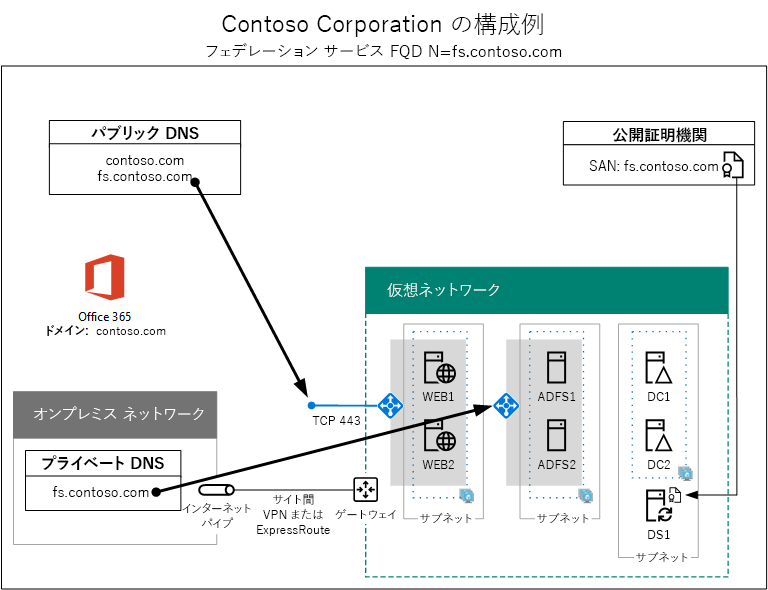

# 高可用性フェデレーション認証のフェーズ 5:Office 365 のフェデレーション認証を構成するHigh availability federated authentication Phase 5: Configure federated authentication for Office 365

 **概要:**Microsoft Azure で Office 365 の高可用性フェデレーション認証用の Azure AD Connect を構成します。**Summary:** Configure Azure AD Connect for your high availability federated authentication for Office 365 in Microsoft Azure.
 
Azure インフラストラクチャ サービスに Office 365 の高可用性フェデレーション認証を展開するために、この最後のフェーズでは、公開証明機関が発行した証明書を取得してインストールし、構成を確認してから DirSync サーバーに Azure AD Connect をインストールして実行します。Azure AD Connect は、フェデレーション認証用に Office 365 サブスクリプション、Active Directory フェデレーション サービス (AD FS)、Web アプリケーション プロキシ サーバーを構成します。In this final phase of deploying high availability federated authentication for Office 365 in Azure infrastructure services, you get and install a certificate issued by a public certification authority, verify your configuration, and then install and run Azure AD Connect on the DirSync server. Azure AD Connect configures your Office 365 subscription and your Active Directory Federation Services (AD FS) and web application proxy servers for federated authentication.
  
すべてのフェーズについては、「[Azure に Office 365 の高可用性フェデレーション認証を展開する](deploy-high-availability-federated-authentication-for-office-365-in-azure.md)」を参照してください。See [Deploy high availability federated authentication for Office 365 in Azure](deploy-high-availability-federated-authentication-for-office-365-in-azure.md) for all of the phases.
  
## 公開証明書を取得し、DirSync サーバーにコピーするGet a public certificate and copy it to the DirSync server

次のプロパティを使用して、公開証明機関からデジタル証明書を取得します。Get a digital certificate from a public certification authority with the following properties:
  
- SSL 接続の作成に適した X.509 証明書。An X.509 certificate suitable for creating SSL connections.
    
- サブジェクトの別名 (SAN) の拡張プロパティは、フェデレーション サービス FQDN に設定されています (例: fs.contoso.com)。The Subject Alternative Name (SAN) extended property is set to your federation service FQDN (example: fs.contoso.com).
    
- 証明書には、秘密キーを PFX 形式で格納する必要があります。The certificate must have the private key and be stored in PFX format.
    
さらに、組織のコンピューターとデバイスでデジタル証明書を発行した公開証明機関を信頼する必要があります。この信頼を確立するには、コンピューターとデバイス上の信頼されたルート証明機関ストアに、公開証明機関から取得したルート証明書をインストールします。通常、Microsoft Windows を実行するコンピューターには、一般的に使用される証明機関が発行したこれらの種類の証明書セットがインストールされています。公開証明機関のルート証明書がまだインストールされていない場合は、この証明書を組織のコンピューターとデバイスに展開する必要があります。Additionally, your organization computers and devices must trust the public certification authority that is issuing the digital certificate. This trust is established by having a root certificate from the public certification authority installed in the trusted root certification authorities store on your computers and devices. Computers running Microsoft Windows typically have a set of these types of certificates installed from commonly-used certification authorities. If the root certificate from your public certification authority is not already installed, you must deploy this to the computers and devices of your organization.
  
フェデレーション認証の証明書要件に関する詳細については、「[フェデレーションのインストールと構成の前提条件](https://docs.microsoft.com/azure/active-directory/connect/active-directory-aadconnect-prerequisites#prerequisites-for-federation-installation-and-configuration)」を参照してください。For more information about certificate requirements for federated authentication, see [Prerequisites for federation installation and configuration](https://docs.microsoft.com/azure/active-directory/connect/active-directory-aadconnect-prerequisites#prerequisites-for-federation-installation-and-configuration).
  
証明書を受け取ったら、DirSync サーバーの C: ドライブ上のフォルダーにコピーします。たとえば、ファイル名を SSL.pfx として、DirSync サーバーの C:\\Certs フォルダーに格納します。When you receive the certificate, copy it to a folder on the C: drive of the DirSync server. For example, name the file SSL.pfx and store it in the C:\\Certs folder on the DirSync server.
  
## 構成を確認するVerify your configuration

これで、Azure AD Connect と Office 365 のフェデレーション認証を構成する準備が整いました。確認用のチェックリストを以下に示します。You should now be ready to configure Azure AD Connect and federated authentication for Office 365. To ensure that you are, here is a checklist:
  
- 組織のパブリック ドメインが Office 365 サブスクリプションに追加されている。Your organization's public domain is added to your Office 365 subscription.
    
- 組織の Office 365 ユーザー アカウントが、組織のパブリック ドメイン名に対して構成されており、正常にサインインできる。Your organization's Office 365 user accounts are configured to your organization's public domain name and can successfully sign in.
    
- フェデレーション サービス FQDN をパブリック ドメイン名に基づいて決定している。You have determined a federation service FQDN based your public domain name.
    
- フェデレーション サービス FQDN のパブリック DNS A レコードが、Web アプリケーション プロキシ サーバー用の Azure インターネット接続ロード バランサーのパブリック IP アドレスを指している。A public DNS A record for your federation service FQDN points to the public IP address of the Internet-facing Azure load balancer for the web application proxy servers.
    
- フェデレーション サービス FQDN のプライベート DNS A レコードが、AD FS サーバー用の内部の Azure ロード バランサーのプライベート IP アドレスを指している。A private DNS A record for your federation service FQDN points to the private IP address of the internal Azure load balancer for the AD FS servers.
    
- フェデレーション サービス FQDN に設定された SAN との SSL 接続に適した公的証明機関が発行したデジタル証明書が、DirSync サーバーに格納されている PFX ファイルである。A public certification authority-isssued digital certificate suitable for SSL connections with the SAN set to your federation service FQDN is a PFX file stored on your DirSync server.
    
- 公的証明機関のルート証明書が、コンピューターとデバイスの信頼されたルート証明機関ストアにインストールされている。The root certificate for the public certification authority is installed in the Trusted Root Certification Authorities store on your computers and devices.
    
Contoso 組織の例を、以下に示します。Here is an example for the Contoso organization:
  
**Azure での高可用性フェデレーション認証インフラストラクチャの構成例****An example configuration for a high availability federated authentication infrastructure in Azure**

  
## Azure AD Connect を実行してフェデレーション認証を構成するRun Azure AD Connect to configure federated authentication

Azure AD Connect ツールは、次に示す手順で、フェデレーション認証用の AD FS サーバー、Web アプリケーション プロキシ サーバー、Office 365 を構成します。The Azure AD Connect tool configures the AD FS servers, the web application proxy servers, and Office 365 for federated authentication with these steps:
  
1. ローカル管理者特権を持つドメイン アカウントを使用して、DirSync サーバーへのリモート デスクトップ接続を作成します。Create a remote desktop connection to your DirSync server with a domain account that has local administrator privileges.
    
2. DirSync サーバーのデスクトップから、Internet Explorer を開き、[https://aka.ms/aadconnect](https://aka.ms/aadconnect) にアクセスします。From the desktop of the DirSync server, open Internet Explorer and go to [https://aka.ms/aadconnect](https://aka.ms/aadconnect).
    
3. **[Microsoft Azure Active Directory Connect]** ページで、 **[ダウンロード]** をクリックしてから **[実行]** をクリックします。On the **Microsoft Azure Active Directory Connect** page, click **Download**, and then click **Run**.
    
4. **[Azure AD Connect へようこそ]** ページで、 **[同意する]** をクリックしてから、 **[続行]** をクリックします。On the **Welcome to Azure AD Connect** page, click **I agree**, and then click **Continue.**
    
5. **[簡単設定]** ページで、 **[カスタマイズ]** をクリックします。On the **Express Settings** page, click **Customize**.
    
6. **[必須コンポーネントのインストール]** ページで、 **[インストール]** をクリックします。On the **Install required components** page, click **Install**.
    
7. **[ユーザー サインイン]** ページで、 **[AD FS とのフェデレーション]** をクリックしてから、 **[次へ]** をクリックします。On the **User sign-in** page, click **Federation with AD FS**, and then click **Next**.
    
8. **[Azure AD に接続]** ページで、Office 365 サブスクリプションのグローバル管理者アカウントの名前とパスワードを入力して、 **[次へ]** をクリックします。On the **Connect to Azure AD** page, type the name and password of a global administrator account for your Office 365 subscription, and then click **Next**.
    
9. **[ディレクトリの接続]** ページで、 **[フォレスト]** でオンプレミスの Windows Server AD フォレストが選択されていることを確認して、ドメイン管理者アカウントの名前とパスワードを入力し、 **[ディレクトリの追加]** をクリックしてから、 **[次へ]** をクリックします。On the **Connect your directories** page, ensure that your on-premises Windows Server AD forest is selected in **Forest**, type the name and password of a domain administrator account, click **Add Directory**, and then click **Next**.
    
10. **[Azure AD サインインの構成]** ページで、 **[次へ]** をクリックします。On the **Azure AD sign-in configuration** page, click **Next**.
    
11. **[ドメインと OU のフィルタリング]** ページで、 **[次へ]** をクリックします。On the **Domain and OU filtering** page, click **Next**.
    
12. **[一意のユーザー識別]** ページで、 **[次へ]** をクリックします。On the **Uniquely identifying your users** page, click **Next**.
    
13. **[ユーザーおよびデバイスのフィルタリング]** ページで、 **[次へ]** をクリックします。On the **Filter users and devices** page, click **Next**.
    
14. **[オプション機能]** ページで、 **[次へ]** をクリックします。On the **Optional features** page, click **Next**.
    
15. **[AD FS ファーム]** ページで、 **[新しい AD FS ファームを構成する]** をクリックします。On the **AD FS farm** page, click **Configure a new AD FS farm**.
    
16. **[参照]** をクリックして、公開証明機関から取得した SSL 証明書の場所と名前を指定します。Click **Browse** and specify the location and name of the SSL certificate from the public certification authority.
    
17. 確認する画面が表示されたら、証明書のパスワードを入力して、 **[OK]** をクリックします。When prompted, type the certificate password, and then click **OK**.
    
18. **[サブジェクト名]** と **[フェデレーション サービス名]** がフェデレーション サービス FQDN に設定されていることを確認して、 **[次へ]** をクリックします。Verify that the **Subject Name** and **Federation Service Name** are set to your federation service FQDN, and then click **Next**.
    
19. **[AD FS サーバー]** ページで、最初の AD FS サーバーの名前 (「表 M」-「項目 4」-「仮想マシン名」列) を入力し、 **[追加]** をクリックします。On the **AD FS servers** page, type your first AD FS server's name (Table M - Item 4 - Virtual machine name column), and then click **Add**.
    
20. 2 番目の AD FS サーバーの名前 (「表 M」-「項目 5」-「仮想マシン名」列) を入力し、 **[追加]** をクリックしてから、 **[次へ]** をクリックします。Type your second AD FS server's name (Table M - Item 5 - Virtual machine name column), click **Add**, and then click **Next**.
    
21. **[Web アプリケーション プロキシ サーバー]** ページで、最初の Web アプリケーション プロキシ サーバーの名前 (「表 M」-「項目 6」-「仮想マシン名」列) を入力し、 **[追加]** をクリックします。On the **Web Application Proxy servers** page, type your first web application proxy server's name (Table M - Item 6 - Virtual machine name column), and then click **Add**.
    
22. 2 番目の Web アプリケーション プロキシ サーバーの名前 (「表 M」-「項目 7」-「仮想マシン名」列) を入力し、 **[追加]** をクリックしてから、 **[次へ]** をクリックします。Type your second web application proxy server's name (Table M - Item 7 - Virtual machine name column), click **Add**, and then click **Next**.
    
23. **[ドメイン管理者の資格情報]** ページで、ドメイン管理者アカウントのユーザー名とパスワードを入力し、 **[次へ]** をクリックします。On the **Domain Administrator credentials** page, type the user name and password of a domain administrator account, and then click **Next**.
    
24. **[AD FS サービス アカウント]** ページで、エンタープライズ管理者アカウントのユーザー名とパスワードを入力し、 **[次へ]** をクリックします。On the **AD FS service account** page, type the user name and password of an enterprise administrator account, and then click **Next**.
    
25. **[Azure AD ドメイン]** ページの **[ドメイン]** で、組織の DNS ドメイン名を選択して、 **[次へ]** をクリックします。On the **Azure AD Domain** page, in **Domain**, select your organization's DNS domain name, and then click **Next**.
    
26. **[構成の準備完了]** ページで、 **[インストール]** をクリックします。On the **Ready to configure** page, click **Install**.
    
27. **[インストールの完了]** ページで **[確認]** をクリックします。イントラネット構成とインターネット構成の両方が正常に確認されたことを示す 2 つのメッセージが表示されます。On the **Installation complete** page, click **Verify**. You should see two messages indicating that both the intranet and Internet configuration was successfully verified.
    
  - イントラネット メッセージには、AD FS サーバー用の Azure 内部ロード バランサーのプライベート IP アドレスが一覧表示されます。The intranet message should list the private IP address of your Azure internal load balancer for your AD FS servers.
    
  - インターネット メッセージには、Web アプリケーション プロキシ サーバー用の Azure インターネット接続ロード バランサーのパブリック IP アドレスが一覧表示されます。The Internet message should list the public IP address of your Azure Internet-facing load balancer for your web application proxy servers.
    
28. **[インストールの完了]** ページで、 **[終了]** をクリックします。On the **Installation complete** page, click **Exit**.
    
サーバーのプレース ホルダー名を使用した、最終構成がこちらです。Here is the final configuration, with placeholder names for the servers.
  
**フェーズ 5:Azure での高可用性フェデレーション認証インフラストラクチャの最終構成****Phase 5: The final configuration of a high availability federated authentication infrastructure in Azure**

  
Azure の Office 365 用の高可用性フェデレーション認証インフラストラクチャが完成しました。Your high availability federated authentication infrastructure for Office 365 in Azure is complete.
  
## See AlsoSee Also

[Azure に Office 365 の高可用性フェデレーション認証を展開するDeploy high availability federated authentication for Office 365 in Azure](deploy-high-availability-federated-authentication-for-office-365-in-azure.md)
  
[Office 365 開発/テスト環境のフェデレーション IDFederated identity for your Office 365 dev/test environment](federated-identity-for-your-office-365-dev-test-environment.md)
  
[クラウド導入およびハイブリッド ソリューションCloud adoption and hybrid solutions](cloud-adoption-and-hybrid-solutions.md)

[Office 365 のフェデレーション IDFederated identity for Office 365](https://support.office.com/article/Understanding-Office-365-identity-and-Azure-Active-Directory-06a189e7-5ec6-4af2-94bf-a22ea225a7a9#bk_federated)

