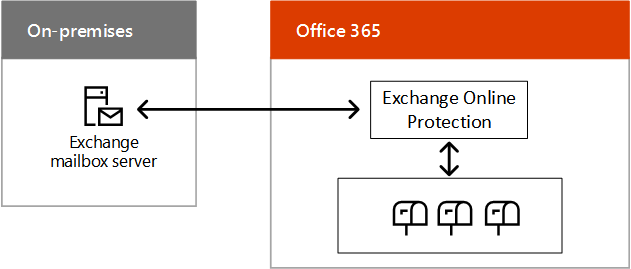

# Microsoft SaaS (Office 365) のハイブリッド クラウド シナリオ

 **の概要:**ハイブリッド アーキテクチャとシナリオを理解するマイクロソフトの SaaS ベースのクラウド ・ ソリューション (Office 365)。
  
クラウド移行または長期的な統合戦略の一環として、Exchange、SharePoint、または Skype for Business のオンプレミス展開を Office 365 内の対応する展開と組み合わせます。
  
## Microsoft SaaS のハイブリッド シナリオ アーキテクチャ

図 1 は、Microsoft SaaS ベースの Office 365 向けハイブリッド シナリオのアーキテクチャを示しています。
  
**Office 365 の図 1: マイクロソフトの SaaS ベースのハイブリッド シナリオ**

  
アーキテクチャの各レイヤーについて:
  
- アプリとシナリオ
    
    SaaS ベースのさまざまなハイブリッド シナリオがあります。Office サーバー製品とそれに対応する Office 365 製品に沿って以下に示します。
    
  - Exchange Server を Exchange Online と組み合わせる (Exchange Server ハイブリッド)
    
  - Skype for Business Server を Skype for Business Online および新しいクラウド PBX とクラウド コネクタ エディションと組み合わせたシナリオ
    
  - SharePoint Server 2016 または SharePoint Server 2013 を SharePoint Online と組み合わせる (複数のシナリオ)
    
    また、Exchange Online をオンプレミスの Skype for Business Server と組み合わせる製品間ハイブリッド シナリオもあります。
    
- ID
    
    オンプレミスの Windows Server AD とのディレクトリ同期を含めることができます。代わりに、サード パーティの ID プロバイダーとフェデレーションを行うように Azure AD を構成することもできます。
    
- ネットワーク
    
    Office 365 か Dynamics 365 用の既存のインターネット パイプか、Microsoft ピアリングとの ExpressRoute 接続で構成されています。
    
- オンプレミス
    
    Exchange、SharePoint、Skype for Business の既存のサーバーで構成でき、これらの製品は最新バージョンに更新する必要があります。その後、ハイブリッド シナリオで Office 365 の対応する製品と組み合わせることができます。
    
独自の[Office 365 の開発/テスト環境](office-365-dev-test-environment.md)を設定します。
  
## Skype for Business 2015 ハイブリッド

ビジネス 2015年ハイブリッドの Skype を使用すると、オンライン ビジネスの Skype で既存のオンプレミスの展開を組み合わせることができます。一部のユーザー ホーム設置型で、一部のユーザーがオンラインで置かれているにもかかわらず、ユーザーが contoso.com など、同じセッション開始プロトコル (SIP) ドメインを共有します。このハイブリッド構成を使用すると、スケジュールに時間の経過と共に Office 365 の設置から移行します。ビジネス 2015年の Skype は、Exchange のオンラインとも統合できます。
  
**図 2: ビジネス 2015年のハイブリッド構成の Skype**

  
ビジネス 2015年のフロント エンド プール、エッジ サーバーとの通信 Skype Office 365 のオンライン ビジネスのため、設置型 Skype から成るビジネス 2015年ハイブリッド構成では、Skype を図 2 に示します。
  
詳細については、以下を参照してください。
  
- [Skype ビジネス サーバーとビジネス オンラインの Skype との間のハイブリッド接続を計画します。](https://technet.microsoft.com/library/jj205403.aspx)
    
- [ビジネス サーバー 2015 の Skype のサポートされているハイブリッドの構成](https://technet.microsoft.com/library/jj945633.aspx)
    
- [Skype ビジネスのハイブリッド](http://hybrid.office.com/skype-for-business/)
    
## Skype for Business Server と組み合わされたクラウド PBX

Skype for Business Server と組み合わされたクラウド PBX を使用すると、既存の Skype for Business Server のオンプレミス展開を、オンプレミスの公衆交換電話網 (PSTN) 接続を備えたトポロジに移行できます。  
  
**図 3: クラウド PBX ビジネス サーバーの Skype で**

  
図 3 は、Skype でクラウド PBX の設置では、Office 365 は、ビジネス用の Skype は、マイクロソフト クラウド PBX に接続されている既存の PBX または通信ゲートウェイ、ビジネスのサーバーで、Skype、PSTN のビジネス サーバー構成オンライン。
  
クラウドに所属する組織内のユーザーは、Microsoft クラウドから通知やボイスメールを含む構内交換機 (PBX) サービスを受信できますが、PSTN 接続 (ダイヤル トーン) はオンプレミスの Skype for Business Server 展開からエンタープライズ VoIP 経由で提供されます。
  
これは、段階的にクラウド ベースのサービスに移行することを可能にするハイブリッド構成の優れた例です。Skype for Business Online への移動を開始するときに、ユーザーのボイス機能を保持することができます。所属する場所にかかわりなく、ユーザーの音声機能は継続されることがわかっているので、自分のペースでユーザーを移動させることができます。  
  
詳細については、[サーバーのビジネスとビジネス オンラインまたは Lync Server 2013 の Skype の Skype 間のハイブリッド接続の計画](https://technet.microsoft.com/library/jj205403.aspx)を参照してください。
  
既存の Lync Server または Skype for Business Server 展開がまだない場合は、クラウド PBX とのオンプレミス PSTN 接続を実装するパッケージ化された仮想マシン (VM) のセットである、Skype for Business クラウド コネクタ エディションを使用できます。
  
詳細については、 [Skype ビジネス クラウド コネクタ ・ エディションの計画](https://technet.microsoft.com/library/mt605227.aspx)を参照してください。
  
## SharePoint ハイブリッド

SharePoint ハイブリッドは、両方のメリットを活かした接続エクスペリエンスを実現するために、Office 365 の SharePoint Online をオンプレミスの SharePoint ファームと組み合わせます。

  
**図 4: SharePoint のハイブリッド構成**

  
図 4 は、SharePoint Online では、Office 365 との通信、設置型の SharePoint ファームで構成される、SharePoint のハイブリッド構成を示しています。
  
SharePoint ハイブリッド シナリオ
  
- [ビジネスのハイブリッド OneDrive](https://technet.microsoft.com/library/mt147425%28v=office.16%29.aspx)
    
- [ハイブリッド チーム サイト](https://technet.microsoft.com/library/mt346110%28v=office.16%29.aspx)
    
- [エクストラネットの B2B のハイブリッド](https://support.office.com/article/SharePoint-Business-to-Business-Collaboration-Extranet-for-Partners-with-Office-365-7b087413-165a-4e94-8871-4393e0b9c037)
    
- [ハイブリッド検索](https://technet.microsoft.com/library/dn720906%28v=office.16%29.aspx)
    
- [ハイブリッド プロファイル](https://support.office.com/article/Plan-hybrid-profiles-96d1eaf0-94eb-40c5-ab76-c82907777db4)
    
- [ハイブリッドの選択](https://support.office.com/article/Hybrid-picker-in-the-SharePoint-Online-admin-center-efce8417-c9bc-4a2c-ac9d-cce6c4e84a9c)
    
    ハイブリッド シナリオは、Office 365 の SharePoint Online 管理センターから入手できる、ハイブリッド構成を自動化するウィザードを使用して、簡単に有効にすることができます。
    
- [拡張可能なハイブリッド アプリケーションの起動プログラム](https://support.office.com/article/The-extensible-hybrid-app-launcher-617a7cb5-53da-4128-961a-64a840c0ab91)
    
    ユーザーは Office 365 ビデオや Delve アプリを表示および使用し、オンプレミスの SharePoint ファームのページ内で体験することができます。
    
これらのすべての SharePoint ハイブリッド シナリオは、拡張可能なハイブリッド アプリ起動ツールを除き、SharePoint 2016 と SharePoint 2013 の両方のユーザーが使用できます。
  
詳細については、 [SharePoint のハイブリッド](http://hybrid.office.com/sharepoint/)を参照してください。
  
## Exchange Server 2016 ハイブリッド

Exchange Server 2016 ハイブリッドを使用すると、オンライン ユーザーにとっての Office 365 の Exchange Online のメリットを実感できます。一方、オンプレミス ユーザーは既存の Exchange Server インフラストラクチャを引き続き使用します。  
  
**図 5: Exchange 2016 のハイブリッド構成**

  
図 5 は、Exchange の 2016年ハイブリッドな構成、オンプレミスの Exchange メールボックス サーバーが Exchange のオンライン保護と Office 365 のメールボックスとの通信を示しています。
  
オンプレミスのメール サーバーを使用するユーザーと Exchange Online を使用するユーザーがいますが、すべてのユーザーは同じメール アドレス空間を共有しています。  
  
このハイブリッド構成の特徴は次のとおりです。
  
- スケジュールで時間の経過と共に Exchange Online に移行するときに、既存の Exchange Server インフラストラクチャを活用します。
    
- 支店のインフラストラクチャに投資することなく、リモート サイトをサポートできます。
    
- Office 365 の Exchange Online Protection 経由で着信インターネット電子メールをルーティングできます。
    
- データをオンプレミスで保持する必要のある、子会社を持つ多国籍企業のニーズに対応します。
    
このハイブリッド構成は、Skype for Business Online や SharePoint Online などのその他の Microsoft Office 365 アプリケーションと統合することもできます。
  
詳細については、[ハイブリッド展開の Exchange Server](https://technet.microsoft.com/library/jj200581%28v=exchg.150%29.aspx)および[Exchange ハイブリッド](http://hybrid.office.com/exchange/)を参照してください。
  
## 関連項目

[エンタープライズ アーキテクトのための Microsoft ハイブリッド クラウド](microsoft-hybrid-cloud-for-enterprise-architects.md)
  
[Microsoft クラウド IT アーキテクチャのリソース](microsoft-cloud-it-architecture-resources.md)

[Microsoft's Enterprise Cloud Roadmap: Resources for IT Decision Makers](https://sway.com/FJ2xsyWtkJc2taRD)

