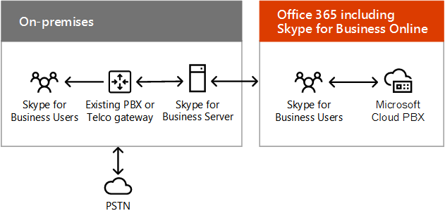

# Microsoft SaaS (Office 365) のハイブリッド クラウドのシナリオHybrid cloud scenarios for Microsoft SaaS (Office 365)

 **概要:** Microsoft の SaaS ベースのクラウド製品のハイブリッドアーキテクチャとシナリオについて説明します (Office 365)。**Summary:** Understand the hybrid architecture and scenarios for Microsoft's SaaS-based cloud offerings (Office 365).
  
クラウド移行または長期的な統合戦略の一環として、Exchange、SharePoint、または Skype for Business のオンプレミスの展開を Office 365 の対応する組み合わせと組み合わせて使用します。Combine on-premises deployments of Exchange, SharePoint, or Skype for Business with their counterparts in Office 365 as part of a cloud migration or long-term integration strategy.
  
## Microsoft SaaS ハイブリッドシナリオアーキテクチャMicrosoft SaaS hybrid scenario architecture

図1は、Office 365 の Microsoft SaaS ベースのハイブリッドシナリオのアーキテクチャを示しています。Figure 1 shows the architecture of Microsoft SaaS-based hybrid scenarios for Office 365.
  
**図 1: Microsoft SaaS ベースの Office 365 のハイブリッドシナリオ****Figure 1: Microsoft SaaS-based hybrid scenarios for Office 365**

  
アーキテクチャの各レイヤーについて:For each layer of the architecture:
  
- アプリとシナリオApps and scenarios
    
    さまざまな SaaS ベースのハイブリッドシナリオでは、Office Server 製品と Office 365 に対応しています。There are a variety of SaaS-based hybrid scenarios, aligning around Office Server products and their Office 365 counterparts:
    
  - Exchange Server と Exchange Online の組み合わせ (Exchange Server ハイブリッド)Exchange Server combined with Exchange Online (Exchange Server hybrid)
    
  - Skype for business Server と Skype for business Online との組み合わせ、新しいクラウド PBX および Cloud Connector エディションのシナリオSkype for Business Server combined with Skype for Business Online and the new Cloud PBX and Cloud Connector Edition scenarios
    
  - Sharepoint Server 2019、SharePoint Server 2016、または sharepoint Server 2013 と SharePoint Online の組み合わせ (複数のシナリオ)SharePoint Server 2019, SharePoint Server 2016, or SharePoint Server 2013 combined with SharePoint Online (multiple scenarios)
    
    また、クロス積ハイブリッドシナリオであるオンプレミスの Skype for Business Server を使用した Exchange Online もあります。There is also Exchange Online with Skype for Business Server on-premises, a cross-product hybrid scenario.
    
- IDIdentity
    
    オンプレミスの Active Directory ドメインサービス (AD DS) とのディレクトリ同期を含めることができます。Can include directory synchronization with your on-premises Active Directory Domain Services (AD DS). または、サードパーティの id プロバイダーとフェデレーションを行うように Azure AD を構成することもできます。Alternately, you can configure Azure AD to federate with a third-party identity provider.
    
- ネットワークNetwork
    
    既存のインターネットパイプ、または Office 365 または Dynamics 365 用の Microsoft ピアリングを備えた ExpressRoute 接続から構成されます。Consists of either your existing Internet pipe or an ExpressRoute connection with Microsoft peering for Office 365 or Dynamics 365.
    
- 社内On-premises
    
    Exchange、SharePoint、および Skype for Business の既存のサーバーから構成することができます。これは、最新のバージョンに更新する必要があります。Can consist of existing servers for Exchange, SharePoint, and Skype for Business, which should be updated to their latest versions. その後、ハイブリッドシナリオ用の Office 365 と組み合わせて使用することができます。You can then combine them with their Office 365 counterparts for hybrid scenarios.
    
独自の Office 365 開発/テスト環境をセットアップするには、「 [office 365 のテストラボガイド](cloud-adoption-test-lab-guides-tlgs.md)」を参照してください。Set up your own Office 365 dev/test environment, see [Office 365 Test Lab Guides](cloud-adoption-test-lab-guides-tlgs.md).
  
## Skype for Business ハイブリッドSkype for Business Hybrid

Skype for Business ハイブリッドを使用すると、既存のオンプレミス展開と Skype for Business Online を組み合わせることができます。Skype for Business Hybrid lets you combine an existing on-premises deployment with Skype for Business Online. 一部のユーザーはオンプレミスに所属しており、一部のユーザーはオンラインに所属していますが、ユーザーは contoso.com などの同じセッション開始プロトコル (SIP) ドメインを共有しています。Some users are homed on-premises and some users are homed online, but the users share the same Session Initiation Protocol (SIP) domain, such as contoso.com. このハイブリッド構成を使用して、オンプレミスから Office 365 への移行をスケジュールで行うことができます。You can use this hybrid configuration to migrate from on-premises to Office 365 over time, on your schedule. また、Skype for Business を[Exchange Online](https://docs.microsoft.com/skypeforbusiness/skype-for-business-hybrid-solutions/integration-with-exchange-and-sharepoint)と統合することもできます。Skype for Business can also be integrated with [Exchange Online](https://docs.microsoft.com/skypeforbusiness/skype-for-business-hybrid-solutions/integration-with-exchange-and-sharepoint).
  
**図 2: Skype for Business のハイブリッド構成****Figure 2: The Skype for Business hybrid configuration**

  
図2は、Office 365 で Skype for business Online と通信するオンプレミスの Skype for Business フロントエンドプールとエッジサーバーで構成される Skype for Business ハイブリッド構成を示しています。Figure 2 shows the Skype for Business hybrid configuration, consisting of an on-premises Skype for Business front end pool and edge server communicating with Skype for Business Online in Office 365.
  
詳細については、「 [skype For Business Server と skype for Business Online の間のハイブリッド接続を計画](https://docs.microsoft.com/skypeforbusiness/skype-for-business-hybrid-solutions/plan-hybrid-connectivity)する」を参照してください。For more information, see [Plan hybrid connectivity between Skype for Business Server and Skype for Business Online](https://docs.microsoft.com/skypeforbusiness/skype-for-business-hybrid-solutions/plan-hybrid-connectivity).
    
## Skype for Business Server を使用したクラウド PBXCloud PBX with Skype for Business Server

クラウド PBX と Skype for business Server を使用すると、既存の Skype for Business Server のオンプレミス展開を、オンプレミスの公衆交換電話網 (PSTN) 接続を備えたトポロジに移行できます。Cloud PBX with Skype for Business Server lets you transition an existing Skype for Business Server on-premises deployment to a topology with on-premises Public Switched Telephone Network (PSTN) connectivity. 
  
**図 3: Skype for Business Server を使用したクラウド PBX****Figure 3: Cloud PBX with Skype for Business Server**

  
図3は、オンプレミスの既存の PBX または電気通信ゲートウェイ、Skype for Business Server、および Office 365 の Microsoft クラウド PBX に接続された PSTN (Skype for business を含む) で構成される、Skype for Business Server の構成を含むクラウド PBX を示しています。オンライン。Figure 3 shows the Cloud PBX with Skype for Business Server configuration, consisting of an on-premises existing PBX or Telco gateway, a Skype for Business Server, and the PSTN connected to the Microsoft Cloud PBX in Office 365, which includes Skype for Business Online.
  
クラウドに所属している組織内のユーザーは、信号とボイスメールを含む Microsoft cloud から構内交換 (PBX) サービスを受けることができますが、オンプレミスのエンタープライズ Voip を介して PSTN 接続 (ダイヤルトーン) が提供されます。Skype for Business Server の展開。Users in the organization who are homed in the cloud can receive private branch exchange (PBX) services from the Microsoft cloud that include signaling and voicemail, but PSTN connectivity (dial tone) is provided through Enterprise Voice from your on-premises Skype for Business Server deployment.
  
これは、クラウドベースのサービスに段階的に移行できるハイブリッド構成の良い例です。This is a great example of a hybrid configuration that lets you gradually migrate to a cloud-based service. Skype for Business Online への移行を開始するときに、ユーザーの音声機能を保持することができます。You can retain your users' voice capabilities as you begin to move them to Skype for Business Online. ユーザーが所属している場所にかかわらず、自分の音声機能が続行されることを確認して、自分のペースでユーザーを移動することができます。You can move your users at your own pace, knowing that their voice features will continue no matter where they are homed. 
  
詳細については、「 [skype For Business Server と skype for Business Online の間のハイブリッド接続を計画](https://docs.microsoft.com/skypeforbusiness/skype-for-business-hybrid-solutions/plan-hybrid-connectivity)する」を参照してください。For more information, see [Plan hybrid connectivity between Skype for Business Server and Skype for Business Online](https://docs.microsoft.com/skypeforbusiness/skype-for-business-hybrid-solutions/plan-hybrid-connectivity).
  
既存の Lync Server または Skype for Business Server の展開をまだ持っていない場合は、Skype for Business Cloud Connector エディションを使用できます。これは、クラウド PBX でオンプレミスの PSTN 接続を実装するパッケージ化された仮想マシン (Vm) のセットです。If you do not already have an existing Lync Server or Skype for Business Server deployment, you can use Skype for Business Cloud Connector Edition, a set of packaged virtual machines (VMs) that implement on-premises PSTN connectivity with Cloud PBX.
  
詳細については、「 [Plan For Skype for Business Cloud Connector Edition](https://docs.microsoft.com/skypeforbusiness/skype-for-business-hybrid-solutions/plan-your-phone-system-cloud-pbx-solution/plan-skype-for-business-cloud-connector-edition)」を参照してください。For more information, see [Plan for Skype for Business Cloud Connector Edition](https://docs.microsoft.com/skypeforbusiness/skype-for-business-hybrid-solutions/plan-your-phone-system-cloud-pbx-solution/plan-skype-for-business-cloud-connector-edition).

  
## SharePoint ハイブリッドSharePoint Hybrid

SharePoint ハイブリッドは、Office 365 の SharePoint Online とオンプレミスの SharePoint ファームを組み合わせて、接続された機能を最大限に活用しています。SharePoint hybrid combines SharePoint Online in Office 365 with your on-premises SharePoint farm for a best of both worlds, connected experience.
  
**図 4: SharePoint ハイブリッド構成****Figure 4: The SharePoint hybrid configuration**

  
図4は、Office 365 で SharePoint Online と通信するオンプレミスの SharePoint ファームで構成される SharePoint ハイブリッド構成を示しています。Figure 4 shows the SharePoint hybrid configuration, consisting of an on-premises SharePoint farm communicating with SharePoint Online in Office 365.
  
SharePoint ハイブリッドシナリオ:SharePoint hybrid scenarios:
  
- [ハイブリッドの OneDrive for BusinessHybrid OneDrive for Business](https://docs.microsoft.com/SharePoint/hybrid/configure-hybrid-onedrive-for-businessroadmap)
    
- [ハイブリッドエクストラネットの B2BHybrid Extranet B2B](https://docs.microsoft.com/sharepoint/create-b2b-extranet)
    
- [ハイブリッド検索Hybrid search](https://docs.microsoft.com/SharePoint/hybrid/configure-cloud-hybrid-searchroadmap)
    
- [ハイブリッド プロファイルHybrid profiles](https://docs.microsoft.com/SharePoint/hybrid/plan-hybrid-profiles)
    
- [ハイブリッドピッカーHybrid Picker](https://docs.microsoft.com/SharePoint/hybrid/hybrid-picker-in-the-sharepoint-online-admin-center)
    
    Office 365 の SharePoint Online 管理センターから利用できるハイブリッド構成を自動化するウィザードを使用して、ハイブリッドシナリオを有効にすることが容易になります。It is easy to enable hybrid scenarios using the wizards that automate hybrid configuration, available from the SharePoint Online admin center in Office 365.
    
- [拡張ハイブリッド アプリ起動ツールExtensible hybrid app launcher](https://docs.microsoft.com/SharePoint/hybrid/the-extensible-hybrid-app-launcher)
    
    オンプレミスの SharePoint ファームのページ内で、ユーザーが Office 365 video および Delve アプリとエクスペリエンスを表示して使用できるようにします。Allows users to view and use Office 365 video and Delve apps and experiences within the pages of their on-premises SharePoint farm.
    
これらの SharePoint ハイブリッドシナリオは、拡張可能なハイブリッドアプリ起動ツールを除くすべて、SharePoint 2016 ユーザーと SharePoint 2013 ユーザーの両方で使用できます。All of these SharePoint hybrid scenarios, except the Extensible hybrid app launcher, are available for both SharePoint 2016 and SharePoint 2013 users.
  
## Exchange Server 2016 ハイブリッドExchange Server 2016 Hybrid

Exchange Server 2016 ハイブリッドを使用すると、オンプレミスのユーザーが既存の Exchange Server インフラストラクチャを引き続き使用している間に、Office 365 での Exchange Online の利点を実感することができます。With Exchange Server 2016 Hybrid, you can realize the benefits of Exchange Online in Office 365 for online users while on-premises users continue to use existing Exchange Server infrastructure. 
  
**図 5: Exchange 2016 ハイブリッド構成****Figure 5: The Exchange 2016 hybrid configuration**

  
図5は、Office 365 の Exchange Online Protection とメールボックスと通信するオンプレミスの Exchange メールボックスサーバーで構成される Exchange 2016 ハイブリッド構成を示しています。Figure 5 shows the Exchange 2016 hybrid configuration, consisting of on-premises Exchange mailbox servers communicating with Exchange Online Protection and mailboxes in Office 365.
  
一部のユーザーはオンプレミスの電子メールサーバーを所有しており、一部のユーザーは Exchange Online を使用していますが、すべてのユーザーが同じ電子メールアドレススペースを共有しています。Some users have an on-premises email server and some users use Exchange Online, but all users share the same e-mail address space. 
  
このハイブリッド構成:This hybrid configuration:
  
- 時間の経過とともに、お客様のスケジュールに基づいて Exchange Online に移行する際に、既存の Exchange Server インフラストラクチャを活用できます。Leverages your existing Exchange Server infrastructure while you migrate to Exchange Online over time, on your schedule.
    
- ブランチオフィスのインフラストラクチャに投資することなく、リモートサイトをサポートできます。Allows you to support remote sites without investing in branch office infrastructure.
    
- Office 365 で Exchange Online Protection 経由で受信インターネットメールをルーティングできるようにします。Allows you to route incoming Internet email through Exchange Online Protection in Office 365.
    
- データをオンプレミスで使用する必要がある子会社を持つ多国籍企業のニーズに対応します。Serves the needs of multinational organizations with subsidiaries that require data to reside on-premises.
    
このハイブリッド構成は、Skype for Business Online や SharePoint Online など、他の Microsoft Office 365 アプリケーションと統合することもできます。You can also integrate this hybrid configuration with other Microsoft Office 365 applications, including Skype for Business Online and SharePoint Online.
  
詳細については、「 [Exchange Server のハイブリッド展開](https://docs.microsoft.com/exchange/exchange-hybrid)」を参照してください。For more information, see [Exchange Server Hybrid Deployments](https://docs.microsoft.com/exchange/exchange-hybrid).
  
## 関連項目See Also

[エンタープライズ アーキテクトのための Microsoft ハイブリッド クラウドMicrosoft Hybrid Cloud for Enterprise Architects](microsoft-hybrid-cloud-for-enterprise-architects.md)
  
[Microsoft クラウド IT アーキテクチャのリソースMicrosoft Cloud IT architecture resources](microsoft-cloud-it-architecture-resources.md)

