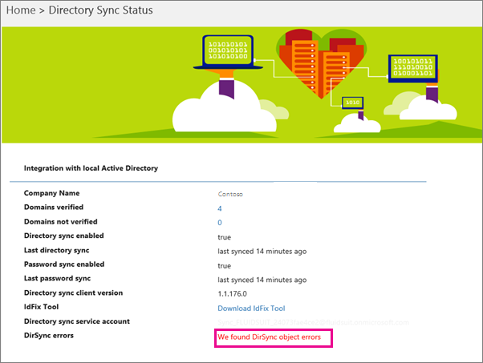

# Microsoft 365 でのディレクトリ同期エラーの表示View directory synchronization errors in Microsoft 365

Microsoft 365 管理センターでディレクトリ同期エラーを確認できます。You can view directory synchronization errors in the Microsoft 365 admin center. ユーザーオブジェクトのエラーのみが表示されます。Only the User object errors are displayed. PowerShell でエラーを表示するには、「[オブジェクトを識別する (Dirsyncプロビジョニングエラー](https://docs.microsoft.com/azure/active-directory/hybrid/how-to-connect-syncservice-duplicate-attribute-resiliency))」を参照してください。To view errors with PowerShell, see [Identify objects with DirSyncProvisioningErrors](https://docs.microsoft.com/azure/active-directory/hybrid/how-to-connect-syncservice-duplicate-attribute-resiliency).

## Microsoft 365 管理センターでディレクトリ同期エラーを表示するView directory synchronization errors in the Microsoft 365 admin center

Microsoft 365 管理センターでエラーを表示するには、次のようにします。To view any errors in the Microsoft 365 admin center:
  
1. グローバル管理者アカウントを使用して、 [Microsoft 365 管理センター](https://admin.microsoft.com)にサインインします。Sign in to the [Microsoft 365 admin center](https://admin.microsoft.com) with a global administrator account. 
    
2. **ホーム**ページに、**ユーザー管理**カードが表示されます。On the **Home** page, you'll see the **User management** card. 
    
    
  
3. カードで、[ **AZURE AD Connect** ] の [**エラーの同期**] を選択して、[**ディレクトリ同期エラー** ] ページのエラーを表示します。On the card, choose **Sync errors** under **Azure AD Connect** to see the errors on the **Directory sync errors** page.   
    
    

4. エラーのいずれかを選択すると、エラーに関する情報と、その修正方法に関するヒントが詳細ウィンドウに表示されます。Choose any of the errors to display the details pane with information about the error and tips on how to fix it.

   
  
表示されたら、「 [Microsoft 365 のディレクトリ同期に関する問題を解決](fix-problems-with-directory-synchronization.md)して、特定の問題を修正する」を参照してください。After viewing, see [fixing problems with directory synchronization for Microsoft 365](fix-problems-with-directory-synchronization.md) to correct any identified issues.

