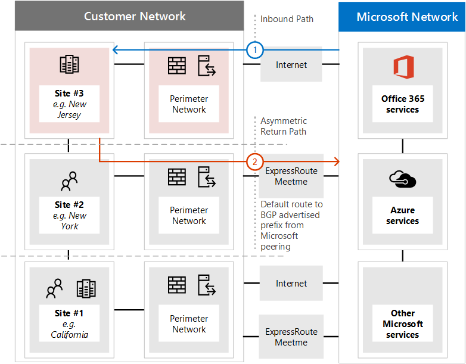

# <a name="implementing-expressroute-for-office-365"></a><span data-ttu-id="a0578-106">Office 365 向け ExpressRoute の実装</span><span class="sxs-lookup"><span data-stu-id="a0578-106">Implementing ExpressRoute for Office 365</span></span>

<span data-ttu-id="a0578-p102">Office 365 の ExpressRoute は、Office 365 サービスが直面している多くのインターネットに代替ルーティング パスを提供します。Office 365 の ExpressRoute のアーキテクチャがアドバタイズされているアクセス可能なインターネット上にこれらの IP プレフィックスの後の再配布の準備、ExpressRoute 回路を Office 365 サービスのパブリック IP のプレフィックスに基づいてください。ネットワークです。ExpressRoute するいくつか異なるルーティング パス、ExpressRoute、およびインターネットを通じて多くの Office 365 サービスを効果的に可能になります。ネットワーク上のルーティングのこの状態は、内部ネットワークのトポロジを設計する方法に大幅な変更を表します。</span><span class="sxs-lookup"><span data-stu-id="a0578-p102">ExpressRoute for Office 365 provides an alternate routing path to many internet facing Office 365 services. The architecture of ExpressRoute for Office 365 is based on advertising public IP prefixes of Office 365 services that are already accessible over the Internet into your provisioned ExpressRoute circuits for subsequent redistribution of those IP prefixes into your network. With ExpressRoute you effectively enable several different routing paths, through the internet and through ExpressRoute, for many Office 365 services. This state of routing on your network may represent a significant change to how your internal network topology is designed.</span></span>
  
 <span data-ttu-id="a0578-111">**の状態:** 完全なガイド v2</span><span class="sxs-lookup"><span data-stu-id="a0578-111">**Status:** Complete Guide v2</span></span>
  
<span data-ttu-id="a0578-p103">中核となるネットワークおよびインターネットに挿入されたルートを持つ両方の専用回線経由で利用可能なルーティングのネットワークの複雑さに対応するために Office 365 の実装については、ExpressRoute を慎重に計画する必要があります。場合は、チームは、詳細な計画と、このガイドのテストを実行しない、お客様はリスクが高いが断続的または ExpressRoute 回路が有効になっているときに Office 365 への接続が完全に途絶えたがサービスします。</span><span class="sxs-lookup"><span data-stu-id="a0578-p103">You must carefully plan your ExpressRoute for Office 365 implementation to accommodate for the network complexities of having routing available via both a dedicated circuit with routes injected into your core network and the internet. If you and your team don't perform the detailed planning and testing in this guide, there is a high risk you'll experience intermittent or a total loss of connectivity to Office 365 services when the ExpressRoute circuit is enabled.</span></span>
  
<span data-ttu-id="a0578-p104">実装を成功させるには、インフラストラクチャの要件を分析、評価の詳細なネットワークを経由し設計、慎重に、段階的かつ制御された方法で展開を計画し、詳細な検証とテスト計画を構築する必要があります。大きな、分散された環境で数か月にわたる実装を表示することも珍しくはありません。このガイドは、事前に計画するために設計されています。</span><span class="sxs-lookup"><span data-stu-id="a0578-p104">To have a successful implementation, you will need to analyze your infrastructure requirements, go through detailed network assessment and design, carefully plan the rollout in a staged and controlled manner, and build a detailed validation and testing plan. For a large, distributed environment it's not uncommon to see implementations span several months. This guide is designed to help you plan ahead.</span></span>
  
<span data-ttu-id="a0578-p105">大規模な展開で成功したことがあります 6 か月計画では、多くの領域からのチーム メンバーは、多くの場合ネットワーク、ファイアウォールとプロキシ サーバーの管理者、Office 365 の管理者、セキュリティ、エンド ユーザー サポート、プロジェクトを含む組織管理、およびスポンサー。計画プロセスへの投資には、ダウンタイムや、複雑で高価なトラブルシューティングの展開の障害を体験する可能性が減少します。</span><span class="sxs-lookup"><span data-stu-id="a0578-p105">Large successful deployments may take six months in planning and often include team members from many areas in the organization including networking, Firewall and Proxy server administrators, Office 365 administrators, security, end-user support, project management, and executive sponsorship. Your investment in the planning process will reduce the likelihood that you'll experience deployment failures resulting in downtime or complex and expensive troubleshooting.</span></span>
  
<span data-ttu-id="a0578-119">この実装ガイドを開始する前に完了するのには次の前提条件と考えています。</span><span class="sxs-lookup"><span data-stu-id="a0578-119">We expect the following pre-requisites to be completed before this implementation guide is started.</span></span>
  
1. <span data-ttu-id="a0578-120">ExpressRoute が推奨し、承認されたかどうかを判断するのには、ネットワークの評価を完了しました。</span><span class="sxs-lookup"><span data-stu-id="a0578-120">You've completed a network assessment to determine if ExpressRoute is recommended and approved.</span></span>

2. <span data-ttu-id="a0578-p106">ExpressRoute ・ ネットワーク ・ サービス ・ プロバイダーを選択しました。[ExpressRoute のパートナーとピアリングの場所](https://azure.microsoft.com/documentation/articles/expressroute-locations/)に関する詳細情報を検索します。</span><span class="sxs-lookup"><span data-stu-id="a0578-p106">You've selected an ExpressRoute network service provider. Find details about the [ExpressRoute partners and peering locations](https://azure.microsoft.com/documentation/articles/expressroute-locations/).</span></span>

3. <span data-ttu-id="a0578-123">開封済みと[ExpressRoute のマニュアル](https://azure.microsoft.com/documentation/services/expressroute/)を理解して、内部ネットワークは ExpressRoute 前提条件のエンド ツー エンドの条件を満たすこと。</span><span class="sxs-lookup"><span data-stu-id="a0578-123">You've already read and understand the [ExpressRoute documentation](https://azure.microsoft.com/documentation/services/expressroute/) and your internal network is able to meet ExpressRoute pre-requisites end to end.</span></span>

4. <span data-ttu-id="a0578-124">チームのすべてのパブリックのガイダンスとドキュメントに読み取り[https://aka.ms/expressrouteoffice365](https://aka.ms/expressrouteoffice365)、[https://aka.ms/ert](https://aka.ms/ert)など、重要な技術的な詳細を理解するのにはチャネル 9 の[Office 365 のトレーニングの Azure ExpressRoute](https://channel9.msdn.com/series/aer)シリーズ。</span><span class="sxs-lookup"><span data-stu-id="a0578-124">Your team has read all of the public guidance and documentation at [https://aka.ms/expressrouteoffice365](https://aka.ms/expressrouteoffice365), [https://aka.ms/ert](https://aka.ms/ert), and watched the [Azure ExpressRoute for Office 365 Training](https://channel9.msdn.com/series/aer) series on Channel 9 to gain an understanding of critical technical details including:</span></span>

      - <span data-ttu-id="a0578-125">SaaS サービスのインターネットの依存関係です。</span><span class="sxs-lookup"><span data-stu-id="a0578-125">The internet dependencies of SaaS services.</span></span>

      - <span data-ttu-id="a0578-126">非対称のルーティングを回避し、複雑なルーティングを処理する方法です。</span><span class="sxs-lookup"><span data-stu-id="a0578-126">How to avoid asymmetric routes and handle complex routing.</span></span>

      - <span data-ttu-id="a0578-127">境界部のセキュリティ、可用性、およびアプリケーション レベルのコントロールを組み込む方法です。</span><span class="sxs-lookup"><span data-stu-id="a0578-127">How to incorporate perimeter security, availability, and application level controls.</span></span>

## <a name="begin-by-gathering-requirements"></a><span data-ttu-id="a0578-128">要件の収集を開始します。</span><span class="sxs-lookup"><span data-stu-id="a0578-128">Begin by gathering requirements</span></span>
<span data-ttu-id="a0578-129"><a name="requirements"> </a></span><span class="sxs-lookup"><span data-stu-id="a0578-129"></span></span>

<span data-ttu-id="a0578-p107">機能とする計画を立てて、組織内でサービスを決定することで起動します。別の Office 365 サービスの機能が使用され、それらの機能を使用するユーザーをホストするは、ネットワーク上のどの場所を決定する必要があります。シナリオのカタログが、ネットワークの属性を追加する必要があります。 これらのシナリオを必要とします。など、受信および送信ネットワーク トラフィックのフローと Office 365 エンドポイントがあるかを ExpressRoute か。</span><span class="sxs-lookup"><span data-stu-id="a0578-p107">Start by determining which features and services you plan to adopt within your organization. You need to determine which features of the different Office 365 services will be used and which locations on your network will host people using those features. With the catalog of scenarios, you need to add the network attributes that each of those scenarios require; such as inbound and outbound network traffic flows and if the Office 365 endpoints are available over ExpressRoute or not.</span></span>
  
<span data-ttu-id="a0578-133">組織の要件を収集します。</span><span class="sxs-lookup"><span data-stu-id="a0578-133">To gather your organization's requirements:</span></span>
  
- <span data-ttu-id="a0578-p108">組織を使用して Office 365 サービスの受信および送信ネットワーク トラフィックのカタログです。別の Office 365 シナリオを必要とするフローの詳細については、Office 365 の Url と IP アドレスの範囲] ページを参照してください。</span><span class="sxs-lookup"><span data-stu-id="a0578-p108">Catalog the inbound and outbound network traffic for the Office 365 services your organization is using. Consult Office 365 URLs and IP address ranges page for the description of flows that different Office 365 scenarios require.</span></span>

- <span data-ttu-id="a0578-136">内部の WAN のバックボーンとトポロジの詳細について、サテライト サイト、ネットワーク境界の出口のポイント、およびプロキシ サービスへのルーティング、最後のマイル ユーザー接続の接続が表示されている既存のネットワーク トポロジのドキュメントを収集します。</span><span class="sxs-lookup"><span data-stu-id="a0578-136">Gather documentation of existing network topology showing details of your internal WAN backbone and topology, connectivity of satellite sites, last mile user connectivity, routing to network perimeter egress points, and proxy services.</span></span>

  - <span data-ttu-id="a0578-137">Office 365 とその他の Microsoft サービスに接続する、インターネットおよび提案された ExpressRoute の接続パスの両方が表示されているネットワークの図での受信サービスのエンドポイントを識別します。</span><span class="sxs-lookup"><span data-stu-id="a0578-137">Identify inbound service endpoints on the network diagrams that Office 365 and other Microsoft services will connect to, showing both internet and proposed ExpressRoute connection paths.</span></span>

  - <span data-ttu-id="a0578-138">すべてのユーザーの地理的な場所および場所現在インターネットに、出口があり、ExpressRoute ピアリングの場所に、出口を持つ場所が提示されると、拠点間の WAN 接続を特定します。</span><span class="sxs-lookup"><span data-stu-id="a0578-138">Identify all geographic user locations and WAN connectivity between locations along with which locations currently have an egress to the internet and which locations are proposed to have an egress to an ExpressRoute peering location.</span></span>

  - <span data-ttu-id="a0578-139">プロキシ、ファイアウォールなど、すべてのエッジ デバイスを識別し、カタログには、インターネットと ExpressRoute フローとの関係。</span><span class="sxs-lookup"><span data-stu-id="a0578-139">Identify all edge devices, such as proxies, firewalls, and so on and catalog their relationship to flows going over the Internet and ExpressRoute.</span></span>

  - <span data-ttu-id="a0578-140">エンド ・ ユーザーがインターネットと ExpressRoute の両方のフローのルーティングを直接または間接アプリケーション プロキシを使用して、Office 365 サービスにアクセスするかどうかを文書化します。</span><span class="sxs-lookup"><span data-stu-id="a0578-140">Document whether end users will access Office 365 services via direct routing or indirect application proxy for both Internet and ExpressRoute flows.</span></span>

- <span data-ttu-id="a0578-141">テナントの場所を追加し、対応の私場所です。</span><span class="sxs-lookup"><span data-stu-id="a0578-141">Add the location of your tenant and meet-me locations to your network diagram.</span></span>

- <span data-ttu-id="a0578-p109">Office 365 にユーザーの主要な場所から、予測と観測のネットワーク パフォーマンスと遅延の特性を予測します。Office 365 は、グローバルな分散環境の一連のサービスと、ユーザーは、テナントの場所とは異なる可能性がある場所に接続することに留意してください。このため、測定し、ExpressRoute とインターネット接続経由でユーザーとマイクロソフトのグローバル ネットワークの最も近い端の間の遅延時間を最適化することをお勧めします。このタスクを支援するためにネットワークの評価から評価結果を使用できます。</span><span class="sxs-lookup"><span data-stu-id="a0578-p109">Estimate the expected and observed network performance and latency characteristics from major user locations to Office 365. Keep in mind that Office 365 is a global and distributed set of services and users will be connecting to locations that may be different from the location of their tenant. For this reason, it is recommended to measure and optimize for latency between the user and the closest edge of Microsoft global network over ExpressRoute and Internet connections. You can use your findings from the network assessment to aid with this task.</span></span>

- <span data-ttu-id="a0578-p110">企業ネットワークのセキュリティと高可用性の要件を満たす必要があります ExpressRoute の新しい接続を一覧表示します。などの操作を行いますユーザー続けるか、インターネットの出口または ExpressRoute の回路のエラーが発生した場合、Office 365 へのアクセスを取得します。</span><span class="sxs-lookup"><span data-stu-id="a0578-p110">List company network security and high availability requirements that need to be met with the new ExpressRoute connection. For example, how do users continue to get access to Office 365 in the event of the Internet egress or ExpressRoute circuit failure.</span></span>

- <span data-ttu-id="a0578-p111">Office 365 受信および送信ネットワークのフロー ドキュメントはインターネット パスを使用し、ExpressRoute を使用します。ユーザーの地理的な場所と、設置型のネットワーク トポロジの詳細についての詳細については、計画を 1 つのユーザーの場所ごとに異なるを必要があります。</span><span class="sxs-lookup"><span data-stu-id="a0578-p111">Document which inbound and outbound Office 365 network flows will use the Internet path and which will use ExpressRoute. The specifics of geographical locations of your users and details of your on-premises network topology may require the plan to be different from one user location to another.</span></span>

### <a name="catalog-your-outbound-and-inbound-network-traffic"></a><span data-ttu-id="a0578-150">カタログの送信および受信ネットワーク トラフィック</span><span class="sxs-lookup"><span data-stu-id="a0578-150">Catalog your outbound and inbound network traffic</span></span>
<span data-ttu-id="a0578-151"><a name="trafficCatalog"> </a></span><span class="sxs-lookup"><span data-stu-id="a0578-151"></span></span>

<span data-ttu-id="a0578-p112">ルーティングおよびその他のネットワークの複雑さを最小限に抑えるには、のみに使用すること ExpressRoute Office 365 の規制要件のため、またはネットワークの評価の結果として、専用の接続を経由するために必要なネットワーク トラフィックのフローをお勧めします。さらに、実装プロジェクトの段階をまったく異なるとして ExpressRoute のルーティングおよびアプローチの送信および受信ネットワーク トラフィックのフローのスコープをステージすることをお勧めします。だけでユーザーには、送信ネットワーク トラフィックのフローとトポロジの複雑さと追加導入する際のリスクの増加を制御するため、インターネット経由での受信ネットワーク トラフィック フローことができます休暇が開始されたは、Office 365 の ExpressRoute を展開非対称可能性をルーティングします。</span><span class="sxs-lookup"><span data-stu-id="a0578-p112">To minimize routing and other network complexities, we recommend that you only use ExpressRoute for Office 365 for the network traffic flows that are required to go over a dedicated connection due to regulatory requirements or as the result of the network assessment. Additionally, we recommend that you stage the scope of ExpressRoute routing and approach outbound and inbound network traffic flows as different and distinct stages of the implementation project. Deploy ExpressRoute for Office 365 for just user initiated outbound network traffic flows and leave inbound network traffic flows across the Internet can help to control the increase in topological complexity and risks of introducing additional asymmetric routing possibilities.</span></span>
  
<span data-ttu-id="a0578-155">ネットワーク トラフィックのカタログには、オンプレミスのネットワークと Microsoft の間でする必要がありますすべての受信および送信ネットワーク接続の一覧が含まれます。</span><span class="sxs-lookup"><span data-stu-id="a0578-155">Your network traffic catalog should contain listings of all the inbound and outbound network connections that you'll have between your on-premises network and Microsoft.</span></span>
  
- <span data-ttu-id="a0578-p113">送信ネットワーク トラフィックのフローは、場所、接続を開始、オンプレミス環境からなど、内部のクライアントまたはサーバー、Microsoft のサービスの宛先からすべてのシナリオです。Office 365 に直接または間接的ななどと接続がプロキシ サーバー、ファイアウォール、またはその他のネットワーク デバイス パスで Office 365 にこれらの接続があります。</span><span class="sxs-lookup"><span data-stu-id="a0578-p113">Outbound network traffic flows are any scenarios where a connection is initiated from your on-premises environment, such as from internal clients or servers, with a destination of the Microsoft services. These connections may be direct to Office 365 or indirect, such as when the connection goes through proxy servers, firewalls, or other networking devices on the path to Office 365.</span></span>

- <span data-ttu-id="a0578-p114">受信ネットワーク トラフィックのフローは、マイクロソフトのクラウドから設置型のホストに接続が開始されたすべてのシナリオです。通常、これらの接続は、ファイアウォールと外部で発行されたフローのお客様のセキュリティ ポリシーを必要とするその他のセキュリティ インフラストラクチャを経由する必要があります。</span><span class="sxs-lookup"><span data-stu-id="a0578-p114">Inbound network traffic flows are any scenarios where a connection is initiated from the Microsoft cloud to an on-premises host. These connections typically need to go through firewall and other security infrastructure that customer security policy requires for externally originated flows.</span></span>

<span data-ttu-id="a0578-160">資料サービスが着信トラフィックを送信して**Office 365 の ExpressRoute**を[Office 365 でマークされている列を探しますを[Office 365 の ExpressRoute とルーティング](https://support.office.com/article/Routing-with-ExpressRoute-for-Office-365-e1da26c6-2d39-4379-af6f-4da213218408)の**ルートの対称性を保つ**」を読む端点](https://support.office.com/article/Office-365-URLs-and-IP-address-ranges-8548a211-3fe7-47cb-abb1-355ea5aa88a2)、残りの接続情報を確認する資料を参照します。</span><span class="sxs-lookup"><span data-stu-id="a0578-160">Read the **Ensuring route symmetry** section of the article [Routing with ExpressRoute for Office 365](https://support.office.com/article/Routing-with-ExpressRoute-for-Office-365-e1da26c6-2d39-4379-af6f-4da213218408) to determine which services will send inbound traffic and look for the column marked **ExpressRoute for Office 365** in the [Office 365 endpoints](https://support.office.com/article/Office-365-URLs-and-IP-address-ranges-8548a211-3fe7-47cb-abb1-355ea5aa88a2) reference article to determine the rest of the connectivity information.</span></span>
  
<span data-ttu-id="a0578-161">送信接続を必要とするサービスごとにネットワークのルーティング、プロキシの構成、パケットの検査などのサービスの計画的な接続について説明し、帯域幅が必要です。</span><span class="sxs-lookup"><span data-stu-id="a0578-161">For each service that requires an outbound connection, you'll want to describe the planned connectivity for the service including network routing, proxy configuration, packet inspection, and bandwidth needs.</span></span>
  
<span data-ttu-id="a0578-p115">受信接続を必要とするサービスごとにいくつかの追加情報を必要があります。マイクロソフト クラウド内のサーバーは、オンプレミスのネットワークへの接続を確立します。接続が正しく作成されていることを確認するには、説明するなどを含む、この接続のすべての側面について説明これらの着信接続を許可するサービスのパブリック DNS エントリを CIDR 形式の IPv4 の IP アドレス、どの ISP の機器が関係すると、および NAT の着信または送信元 NAT は、これらの接続を処理します。</span><span class="sxs-lookup"><span data-stu-id="a0578-p115">For each service that requires an inbound connection, you'll need some additional information. Servers in the Microsoft cloud will establish connections to your on-premises network. to ensure the connections are made correctly, you'll want to describe all aspects of this connectivity, including; the public DNS entries for the services that will accept these inbound connections, the CIDR formatted IPv4 IP addresses, which ISP equipment is involved, and how inbound NAT or source NAT is handled for these connections.</span></span>
  
<span data-ttu-id="a0578-p116">インターネット経由で接続するかどうかに関係なく、着信接続を見直す必要があります。 または非対称のルーティングを確認するのには ExpressRoute が導入されていません。場合によっては、設置型エンドポイントを Office 365 サービスがまた月への着信接続を開始することが他のマイクロソフトおよびマイクロソフト以外のサービスがアクセスする必要があります。ExpressRoute は、これらのサービス用に Office 365 にルーティングを有効にするに他のシナリオは問題を非常に重要です。お客様は、多くの場合、ソース ベースの ExpressRoute を有効にした後、Microsoft からの入力方向のフローが対称維持するために、NAT など、内部のネットワーク固有の変更を実装する必要があります。</span><span class="sxs-lookup"><span data-stu-id="a0578-p116">Inbound connections should be reviewed regardless of whether they're connecting over the internet or ExpressRoute to ensure asymmetric routing hasn't been introduced. In some cases, on-premises endpoints that Office 365 services initiate inbound connections to may also need to be accessed by other Microsoft and non-Microsoft services. It is paramount that enabling ExpressRoute routing to these services for Office 365 purposes doesn't break other scenarios. In many cases, customers may need to implement specific changes to their internal network, such as source based NAT, to ensure that inbound flows from Microsoft remain symmetric after ExpressRoute is enabled.</span></span>
  
<span data-ttu-id="a0578-p117">ここで、必要な詳細レベルのサンプルです。ここでは Exchange ハイブリッドは ExpressRoute 経由で社内のシステムにルーティングします。</span><span class="sxs-lookup"><span data-stu-id="a0578-p117">Here's a sample of the level of detail required. In this case Exchange Hybrid would route to the on-premises system over ExpressRoute.</span></span>

|<span data-ttu-id="a0578-171">**接続のプロパティ**</span><span class="sxs-lookup"><span data-stu-id="a0578-171">**Connection property**</span></span>|<span data-ttu-id="a0578-172">**値**</span><span class="sxs-lookup"><span data-stu-id="a0578-172">**Value**</span></span>|
|:-----|:-----|
|<span data-ttu-id="a0578-173">**ネットワーク トラフィックの方向**</span><span class="sxs-lookup"><span data-stu-id="a0578-173">**Network traffic direction**</span></span> <br/> |<span data-ttu-id="a0578-174">受信</span><span class="sxs-lookup"><span data-stu-id="a0578-174">Inbound</span></span>  <br/> |
|<span data-ttu-id="a0578-175">**サービス**</span><span class="sxs-lookup"><span data-stu-id="a0578-175">**Service**</span></span> <br/> |<span data-ttu-id="a0578-176">Exchange ハイブリッド</span><span class="sxs-lookup"><span data-stu-id="a0578-176">Exchange Hybrid</span></span>  <br/> |
|<span data-ttu-id="a0578-177">**公開の Office 365 エンドポイント (ソース)**</span><span class="sxs-lookup"><span data-stu-id="a0578-177">**Public Office 365 endpoint (source)**</span></span> <br/> |<span data-ttu-id="a0578-178">Exchange Online (IP アドレス)</span><span class="sxs-lookup"><span data-stu-id="a0578-178">Exchange Online (IP addresses)</span></span>  <br/> |
|<span data-ttu-id="a0578-179">**パブリックの設置型エンドポイント (移動先)**</span><span class="sxs-lookup"><span data-stu-id="a0578-179">**Public On-Premises Endpoint (destination)**</span></span> <br/> |<span data-ttu-id="a0578-180">5.5.5.5</span><span class="sxs-lookup"><span data-stu-id="a0578-180">5.5.5.5</span></span>  <br/> |
|<span data-ttu-id="a0578-181">**パブリック (インターネット) DNS エントリ**</span><span class="sxs-lookup"><span data-stu-id="a0578-181">**Public (Internet) DNS entry**</span></span> <br/> |<span data-ttu-id="a0578-182">Autodiscover.contoso.com</span><span class="sxs-lookup"><span data-stu-id="a0578-182">Autodiscover.contoso.com</span></span>  <br/> |
|<span data-ttu-id="a0578-183">**この設置型のエンドポイントに使用するその他の (非-Office 365) マイクロソフトのサービス**</span><span class="sxs-lookup"><span data-stu-id="a0578-183">**Will this on-premises endpoint be used for by other (non-Office 365) Microsoft services**</span></span> <br/> |<span data-ttu-id="a0578-184">不要</span><span class="sxs-lookup"><span data-stu-id="a0578-184">No</span></span>  <br/> |
|<span data-ttu-id="a0578-185">**この設置型エンドポイントによって使用されるインターネット上のユーザーとシステム**</span><span class="sxs-lookup"><span data-stu-id="a0578-185">**Will this on-premises endpoint be used by users/systems on the Internet**</span></span> <br/> |<span data-ttu-id="a0578-186">はい</span><span class="sxs-lookup"><span data-stu-id="a0578-186">Yes</span></span>  <br/> |
|<span data-ttu-id="a0578-187">**パブリック エンドポイントを公開する内部のシステム**</span><span class="sxs-lookup"><span data-stu-id="a0578-187">**Internal systems published through public endpoints**</span></span> <br/> |<span data-ttu-id="a0578-188">Exchange Server のクライアント アクセスの役割 (設置型) 192.168.101, 192.168.102, 192.168.103</span><span class="sxs-lookup"><span data-stu-id="a0578-188">Exchange Server client access role (on-premises) 192.168.101, 192.168.102, 192.168.103</span></span>  <br/> |
|<span data-ttu-id="a0578-189">**パブリック エンドポイントの IP の提供情報**</span><span class="sxs-lookup"><span data-stu-id="a0578-189">**IP advertisement of the public endpoint**</span></span> <br/> |<span data-ttu-id="a0578-190">**インターネットへ**: 5.5.0.0/16</span><span class="sxs-lookup"><span data-stu-id="a0578-190">**To Internet**: 5.5.0.0/16</span></span>  <br/> <span data-ttu-id="a0578-191">**ExpressRoute に**: 5.5.5.0/24</span><span class="sxs-lookup"><span data-stu-id="a0578-191">**To ExpressRoute**: 5.5.5.0/24</span></span>  <br/> |
|<span data-ttu-id="a0578-192">**/境界領域のセキュリティ ・ コントロール**</span><span class="sxs-lookup"><span data-stu-id="a0578-192">**Security/Perimeter Controls**</span></span> <br/> |<span data-ttu-id="a0578-193">**インターネット パス**: DeviceID_002</span><span class="sxs-lookup"><span data-stu-id="a0578-193">**Internet path**: DeviceID_002</span></span>  <br/> <span data-ttu-id="a0578-194">**ExpressRoute パス**: DeviceID_003</span><span class="sxs-lookup"><span data-stu-id="a0578-194">**ExpressRoute path**: DeviceID_003</span></span>  <br/> |
|<span data-ttu-id="a0578-195">**高可用性を実現**</span><span class="sxs-lookup"><span data-stu-id="a0578-195">**High Availability**</span></span> <br/> |<span data-ttu-id="a0578-196">アクティブ/アクティブ冗長地域 2 の間で</span><span class="sxs-lookup"><span data-stu-id="a0578-196">Active/Active across 2 geo-redundant</span></span>  <br/> <span data-ttu-id="a0578-197">ExpressRoute 回路のシカゴとダラス</span><span class="sxs-lookup"><span data-stu-id="a0578-197">ExpressRoute circuits - Chicago and Dallas</span></span>  <br/> |
|<span data-ttu-id="a0578-198">**パス対称コントロール**</span><span class="sxs-lookup"><span data-stu-id="a0578-198">**Path symmetry control**</span></span> <br/> |<span data-ttu-id="a0578-199">**方法**: ソース NAT</span><span class="sxs-lookup"><span data-stu-id="a0578-199">**Method**: Source NAT</span></span>  <br/> <span data-ttu-id="a0578-200">**インターネット パス**: ソース NAT への着信接続 192.168.5.5</span><span class="sxs-lookup"><span data-stu-id="a0578-200">**Internet path**: Source NAT inbound connections to 192.168.5.5</span></span>  <br/> |<span data-ttu-id="a0578-201">**ExpressRoute パス**: ソース NAT 接続が 192.168.1.0 (シカゴ)、192.168.2.0 (ダラス)</span><span class="sxs-lookup"><span data-stu-id="a0578-201">**ExpressRoute path**: Source NAT connections to 192.168.1.0 (Chicago) and 192.168.2.0 (Dallas)</span></span>  <br/> |

<span data-ttu-id="a0578-202">のみで送信されているサービスの例を以下に示します。</span><span class="sxs-lookup"><span data-stu-id="a0578-202">Here's a sample of a service that is outbound only:</span></span>

|<span data-ttu-id="a0578-203">**接続のプロパティ**</span><span class="sxs-lookup"><span data-stu-id="a0578-203">**Connection property**</span></span>|<span data-ttu-id="a0578-204">**値**</span><span class="sxs-lookup"><span data-stu-id="a0578-204">**Value**</span></span>|
|:-----|:-----|
|<span data-ttu-id="a0578-205">**ネットワーク トラフィックの方向**</span><span class="sxs-lookup"><span data-stu-id="a0578-205">**Network traffic direction**</span></span> <br/> |<span data-ttu-id="a0578-206">送信</span><span class="sxs-lookup"><span data-stu-id="a0578-206">Outbound</span></span>  <br/> |
|<span data-ttu-id="a0578-207">**サービス**</span><span class="sxs-lookup"><span data-stu-id="a0578-207">**Service**</span></span> <br/> |<span data-ttu-id="a0578-208">SharePoint Online</span><span class="sxs-lookup"><span data-stu-id="a0578-208">SharePoint Online</span></span>  <br/> |
|<span data-ttu-id="a0578-209">**設置型エンドポイント (ソース)**</span><span class="sxs-lookup"><span data-stu-id="a0578-209">**On-premises endpoint (source)**</span></span> <br/> |<span data-ttu-id="a0578-210">ユーザー ワークステーション</span><span class="sxs-lookup"><span data-stu-id="a0578-210">User workstation</span></span>  <br/> |
|<span data-ttu-id="a0578-211">**Office 365 エンドポイント (移動先) を公開**</span><span class="sxs-lookup"><span data-stu-id="a0578-211">**Public Office 365 endpoint (destination)**</span></span> <br/> |<span data-ttu-id="a0578-212">SharePoint Online (IP アドレス)</span><span class="sxs-lookup"><span data-stu-id="a0578-212">SharePoint Online (IP addresses)</span></span>  <br/> |
|<span data-ttu-id="a0578-213">**パブリック (インターネット) DNS エントリ**</span><span class="sxs-lookup"><span data-stu-id="a0578-213">**Public (Internet) DNS entry**</span></span> <br/> |<span data-ttu-id="a0578-214">\*。 sharepoint.com (および追加の Fqdn)</span><span class="sxs-lookup"><span data-stu-id="a0578-214">\*.sharepoint.com (and additional FQDNs)</span></span>  <br/> |
|<span data-ttu-id="a0578-215">**CDN の紹介**</span><span class="sxs-lookup"><span data-stu-id="a0578-215">**CDN Referrals**</span></span> <br/> |<span data-ttu-id="a0578-216">cdn.sharepointonline.com (および追加の Fqdn) の IP アドレスの CDN プロバイダーによって保持される)</span><span class="sxs-lookup"><span data-stu-id="a0578-216">cdn.sharepointonline.com (and additional FQDNs) - IP addresses maintained by CDN providers)</span></span>  <br/> |
|<span data-ttu-id="a0578-217">**IP の提供情報と使用中の NAT**</span><span class="sxs-lookup"><span data-stu-id="a0578-217">**IP advertisement and NAT in use**</span></span> <br/> |<span data-ttu-id="a0578-218">**インターネット パスまたは送信元 NAT**: 1.1.1.0/24</span><span class="sxs-lookup"><span data-stu-id="a0578-218">**Internet path/Source NAT**: 1.1.1.0/24</span></span>  <br/> <span data-ttu-id="a0578-219">**ExpressRoute パスまたは送信元 NAT**: 1.1.2.0/24 (シカゴ) と 1.1.3.0/24 (ダラス)</span><span class="sxs-lookup"><span data-stu-id="a0578-219">**ExpressRoute path/Source NAT**: 1.1.2.0/24 (Chicago) and 1.1.3.0/24 (Dallas)</span></span>  <br/> |
|<span data-ttu-id="a0578-220">**接続方法**</span><span class="sxs-lookup"><span data-stu-id="a0578-220">**Connectivity method**</span></span> <br/> |<span data-ttu-id="a0578-221">**インターネット**: レイヤー 7 プロキシ (.pac ファイル) を経由して</span><span class="sxs-lookup"><span data-stu-id="a0578-221">**Internet**: via layer 7 proxy (.pac file)</span></span>  <br/> <span data-ttu-id="a0578-222">**ExpressRoute**: 直接のルーティング (プロキシなし)</span><span class="sxs-lookup"><span data-stu-id="a0578-222">**ExpressRoute**: direct routing (no proxy)</span></span>  <br/> |
|<span data-ttu-id="a0578-223">**/境界領域のセキュリティ ・ コントロール**</span><span class="sxs-lookup"><span data-stu-id="a0578-223">**Security/Perimeter Controls**</span></span> <br/> |<span data-ttu-id="a0578-224">**インターネット パス**: DeviceID_002</span><span class="sxs-lookup"><span data-stu-id="a0578-224">**Internet path**: DeviceID_002</span></span>  <br/> <span data-ttu-id="a0578-225">**ExpressRoute パス**: DeviceID_003</span><span class="sxs-lookup"><span data-stu-id="a0578-225">**ExpressRoute path**: DeviceID_003</span></span>  <br/> |
|<span data-ttu-id="a0578-226">**高可用性を実現**</span><span class="sxs-lookup"><span data-stu-id="a0578-226">**High Availability**</span></span> <br/> |<span data-ttu-id="a0578-227">**インターネット パス**: 冗長なインターネットの出口</span><span class="sxs-lookup"><span data-stu-id="a0578-227">**Internet path**: Redundant internet egress</span></span>  <br/> <span data-ttu-id="a0578-228">**ExpressRoute パス**: 2 地理冗長 ExpressRoute 回路全体のシカゴとダラスのアクティブ/アクティブ 'ホット ポテト' ルーティング</span><span class="sxs-lookup"><span data-stu-id="a0578-228">**ExpressRoute path**: Active/Active 'hot potato' routing across 2 geo-redundant ExpressRoute circuits - Chicago and Dallas</span></span>  <br/> |
|<span data-ttu-id="a0578-229">**パス対称コントロール**</span><span class="sxs-lookup"><span data-stu-id="a0578-229">**Path symmetry control**</span></span> <br/> |<span data-ttu-id="a0578-230">**方法**: 送信元 NAT のすべての接続</span><span class="sxs-lookup"><span data-stu-id="a0578-230">**Method**: Source NAT for all connections</span></span>  <br/> |

### <a name="your-network-topology-design-with-regional-connectivity"></a><span data-ttu-id="a0578-231">地域内の接続を持つネットワーク トポロジを設計</span><span class="sxs-lookup"><span data-stu-id="a0578-231">Your network topology design with regional connectivity</span></span>
<span data-ttu-id="a0578-232"><a name="topology"> </a></span><span class="sxs-lookup"><span data-stu-id="a0578-232"></span></span>

<span data-ttu-id="a0578-p118">サービスと、関連するネットワーク トラフィックのフローを理解するとこれらの新しい接続性要件を組み込むし、すれば、ExpressRoute を使用して、Office 365 用に変更を示していますをネットワーク図を作成できます。ダイアグラムを含める必要があります。</span><span class="sxs-lookup"><span data-stu-id="a0578-p118">Once you understand the services and their associated network traffic flows, you can create a network diagram that incorporates these new connectivity requirements and illustrates the changes you'll make to use ExpressRoute for Office 365. Your diagram should include:</span></span>
  
1. <span data-ttu-id="a0578-235">Office 365 とその他のサービスにアクセスするすべてのユーザーの場所です。</span><span class="sxs-lookup"><span data-stu-id="a0578-235">All user locations where Office 365 and other services will be accessed from.</span></span>

2. <span data-ttu-id="a0578-236">すべてのインターネットおよび ExpressRoute の出口のポイントです。</span><span class="sxs-lookup"><span data-stu-id="a0578-236">All internet and ExpressRoute egress points.</span></span>

3. <span data-ttu-id="a0578-237">送信および受信するすべてのデバイスおよびルーター、ファイアウォール、プロキシ サーバーのアプリケーション、および侵入検出/防止を含め、ネットワーク接続を管理します。</span><span class="sxs-lookup"><span data-stu-id="a0578-237">All outbound and inbound devices that manage connectivity in and out of the network, including routers, firewalls, application proxy servers, and intrusion detection/prevention.</span></span>

4. <span data-ttu-id="a0578-238">ADFS web アプリケーションのプロキシ ・ サーバから接続を許可する内部の ADFS サーバーなど、すべての着信トラフィック用の内部宛先です。</span><span class="sxs-lookup"><span data-stu-id="a0578-238">Internal destinations for all inbound traffic, such as internal ADFS servers that accept connections from the ADFS web application proxy servers.</span></span>

5. <span data-ttu-id="a0578-239">提供されるすべての IP サブネットのカタログ</span><span class="sxs-lookup"><span data-stu-id="a0578-239">Catalog of all IP subnets that will be advertised</span></span>

6. <span data-ttu-id="a0578-240">人のユーザーから Office 365 にアクセスするして、即時会議の一覧を表示、それぞれの場所を識別する-私 ExpressRoute を使用する場所です。</span><span class="sxs-lookup"><span data-stu-id="a0578-240">Identify each location where people will access Office 365 from and list the meet-me locations that will be used for ExpressRoute.</span></span>

7. <span data-ttu-id="a0578-241">場所と、ExpressRoute から得たマイクロソフト IP プレフィックスは受け入れられますが、内部のネットワーク トポロジの一部は、フィルターし、に伝達します。</span><span class="sxs-lookup"><span data-stu-id="a0578-241">Locations and portions of your internal network topology, where Microsoft IP prefixes learned from ExpressRoute will be accepted, filtered and propagated to.</span></span>

8. <span data-ttu-id="a0578-242">ネットワーク トポロジには、各ネットワーク セグメントの地理的な場所と方法に接続する Microsoft のネットワーク ExpressRoute や、インターネット上でする必要がありますについて説明します。</span><span class="sxs-lookup"><span data-stu-id="a0578-242">The network topology should illustrate the geographic location of each network segment and how it connects to the Microsoft network over ExpressRoute and/or the Internet.</span></span>

<span data-ttu-id="a0578-243">次の図は、場所を使用するから Office 365 の着信および発信ルーティングの提供情報に Office 365 とそれぞれの場所を示しています。</span><span class="sxs-lookup"><span data-stu-id="a0578-243">The diagram below shows each location where people will be using Office 365 from along with the inbound and outbound routing advertisements to Office 365.</span></span>
  

  
<span data-ttu-id="a0578-245">発信トラフィックの場合は、人は、3 つの方法のいずれかで Office 365 をアクセスします。</span><span class="sxs-lookup"><span data-stu-id="a0578-245">For outbound traffic, the people access Office 365 in one of three ways:</span></span>
  
1. <span data-ttu-id="a0578-246">即時で-私北米カリフォルニア州内のユーザーの場所です。</span><span class="sxs-lookup"><span data-stu-id="a0578-246">Through a meet-me location in North America for the people in California.</span></span>

2. <span data-ttu-id="a0578-247">即時で-私香港に香港の方のための場所です。</span><span class="sxs-lookup"><span data-stu-id="a0578-247">Through a meet-me location in Hong Kong for the people in Hong Kong.</span></span>

3. <span data-ttu-id="a0578-248">を通じてインターネット バングラデシュ人が少なく、ExpressRoute 回路が準備されていません。</span><span class="sxs-lookup"><span data-stu-id="a0578-248">Through the internet in Bangladesh where there are fewer people and no ExpressRoute circuit provisioned.</span></span>


  
<span data-ttu-id="a0578-250">同様に、Office 365 からの受信ネットワーク トラフィックは、3 つの方法のいずれかで返します。</span><span class="sxs-lookup"><span data-stu-id="a0578-250">Similarly, the inbound network traffic from Office 365 returns in one of three ways:</span></span>
  
1. <span data-ttu-id="a0578-251">即時で-私北米カリフォルニア州内のユーザーの場所です。</span><span class="sxs-lookup"><span data-stu-id="a0578-251">Through a meet-me location in North America for the people in California.</span></span>

2. <span data-ttu-id="a0578-252">即時で-私香港に香港の方のための場所です。</span><span class="sxs-lookup"><span data-stu-id="a0578-252">Through a meet-me location in Hong Kong for the people in Hong Kong.</span></span>

3. <span data-ttu-id="a0578-253">を通じてインターネット バングラデシュ人が少なく、ExpressRoute 回路が準備されていません。</span><span class="sxs-lookup"><span data-stu-id="a0578-253">Through the internet in Bangladesh where there are fewer people and no ExpressRoute circuit provisioned.</span></span>


  
### <a name="determine-the-appropriate-meet-me-location"></a><span data-ttu-id="a0578-255">適切な対応を決定-私の場所</span><span class="sxs-lookup"><span data-stu-id="a0578-255">Determine the appropriate meet-me location</span></span>

<span data-ttu-id="a0578-p119">選択範囲を満たすに私、ExpressRoute 回路が Microsoft のネットワークに、ネットワークに接続されている物理的な場所の場所から Office 365 のユーザーのアクセス先の場所が影響を受けます。として SaaS を提供することでは、Office 365 は動作しません IaaS や PaaS 地域モデルでは、Azure では同じように。代わりに、Office 365 は分散コラボレーション サービスでは、一連のユーザーが複数のデータ センターおよび領域では、同じ場所またはユーザーのテナントをホストしている地域で必ずしもエンドポイントに接続する必要があります。</span><span class="sxs-lookup"><span data-stu-id="a0578-p119">The selection of meet-me locations, which are the physical location where your ExpressRoute circuit connects your network to the Microsoft network, is influenced by the locations where people will access Office 365 from. As a SaaS offering, Office 365 does not operate under the IaaS or PaaS regional model in the same way Azure does. Instead, Office 365 is a distributed set of collaboration services, where users may need to connect to endpoints across multiple datacenters and regions, which may not necessarily be in the same location or region where the user's tenant is hosted.</span></span>
  
<span data-ttu-id="a0578-p120">必要な対応を選択する際の最重要事項は、この-私、組織内のユーザーの接続元は、Office 365 の ExpressRoute の場所です。一般的な推奨 Office 365 の最適な接続ができるように、Office 365 サービスへのユーザー要求を引き継ぐ Microsoft のネットワークにネットワークの最短経路をルーティングでは、実装、多くの場合も対象と呼ばれるに 'ホット ポテト' ルーティングします。など、ほとんどの Office 365 ユーザーが 1 つまたは 2 つの場所にある場合は、対応を選択-私がそれらのユーザーの場所に近い場所では、最適な設計を作成します。大多数のユーザーは、多くの異なる領域にある企業、複数の ExpressRoute 回路のことを検討し、対応する可能性があります-私の場所です。ユーザー、サイトの一部は、Microsoft のネットワークと、Office 365 に最短または最も最適なパスできない場合があります、内部の WAN および ExpressRoute の対応を-私には、ポイントが、インターネット経由で。</span><span class="sxs-lookup"><span data-stu-id="a0578-p120">This means the most important consideration you need to make when selecting meet-me locations for ExpressRoute for Office 365 is where the people in your organization will be connecting from. The general recommendation for optimal Office 365 connectivity is implement routing, so that user requests to Office 365 services are handed off into the Microsoft network over the shortest network path, this is also often being referred to as 'hot potato' routing. For example, if most of the Office 365 users are in one or two locations, selecting meet-me locations that are in the closest proximity to the location of those users will create the optimal design. If your company has large user populations in many different regions, you may want to consider having multiple ExpressRoute circuits and meet-me locations. For some of your user locations, the shortest/most optimal path into Microsoft network and Office 365, may not be through your internal WAN and ExpressRoute meet-me points, but via the Internet.</span></span>
  
<span data-ttu-id="a0578-p121">多くの場合に、複数の対応があります-私を持つユーザーの相対的な近接領域内を選択することができる場所です。決定要因には、次の表に記入します。</span><span class="sxs-lookup"><span data-stu-id="a0578-p121">Often times, there are multiple meet-me locations that could be selected within a region with relative proximity to your users. Fill out the following table to guide your decisions.</span></span>

|<span data-ttu-id="a0578-266">**ExpressRoute 対応を計画-私カリフォルニア州とニューヨークの場所**</span><span class="sxs-lookup"><span data-stu-id="a0578-266">**Planned ExpressRoute meet-me locations in California and New York**</span></span>||
|:-----|:-----|
|<span data-ttu-id="a0578-267">場所</span><span class="sxs-lookup"><span data-stu-id="a0578-267">Location</span></span>  <br/> |<span data-ttu-id="a0578-268">人の数</span><span class="sxs-lookup"><span data-stu-id="a0578-268">Number of people</span></span>  <br/> |<span data-ttu-id="a0578-269">出口をインターネット経由で Microsoft ネットワークの待機時間が必要</span><span class="sxs-lookup"><span data-stu-id="a0578-269">Expected latency to Microsoft network over Internet egress</span></span>  <br/> |<span data-ttu-id="a0578-270">ExpressRoute 経由でマイクロソフト ネットワークへの予測した遅延時間</span><span class="sxs-lookup"><span data-stu-id="a0578-270">Expected latency to Microsoft network over ExpressRoute</span></span>  <br/> |
|<span data-ttu-id="a0578-271">ロサンゼルス</span><span class="sxs-lookup"><span data-stu-id="a0578-271">Los Angeles</span></span>  <br/> |<span data-ttu-id="a0578-272">10,000</span><span class="sxs-lookup"><span data-stu-id="a0578-272">10,000</span></span>  <br/> |<span data-ttu-id="a0578-273">~ 使う</span><span class="sxs-lookup"><span data-stu-id="a0578-273">~15ms</span></span>  <br/> |<span data-ttu-id="a0578-274">~ (シリコン バレー) 経由で 10 ミリ秒</span><span class="sxs-lookup"><span data-stu-id="a0578-274">~10ms (via Silicon Valley)</span></span>  <br/> |
|<span data-ttu-id="a0578-275">ワシントン DC</span><span class="sxs-lookup"><span data-stu-id="a0578-275">Washington DC</span></span>  <br/> |<span data-ttu-id="a0578-276">15,000</span><span class="sxs-lookup"><span data-stu-id="a0578-276">15,000</span></span>  <br/> |<span data-ttu-id="a0578-277">~ 20 ミリ秒</span><span class="sxs-lookup"><span data-stu-id="a0578-277">~20ms</span></span>  <br/> |<span data-ttu-id="a0578-278">~ (ニューヨーク) 経由で 10 ミリ秒</span><span class="sxs-lookup"><span data-stu-id="a0578-278">~10ms (via New York)</span></span>  <br/> |
|<span data-ttu-id="a0578-279">ダラス</span><span class="sxs-lookup"><span data-stu-id="a0578-279">Dallas</span></span>  <br/> |<span data-ttu-id="a0578-280">5,000</span><span class="sxs-lookup"><span data-stu-id="a0578-280">5,000</span></span>  <br/> |<span data-ttu-id="a0578-281">~ 使う</span><span class="sxs-lookup"><span data-stu-id="a0578-281">~15ms</span></span>  <br/> |<span data-ttu-id="a0578-282">~ (ニューヨーク) を使用して 40 ms</span><span class="sxs-lookup"><span data-stu-id="a0578-282">~40ms (via New York)</span></span>  <br/> |

<span data-ttu-id="a0578-p122">グローバル ネットワーク アーキテクチャは、Office 365 の領域を示す、ExpressRoute ネットワーク サービス プロバイダーに対応すると、私の場所、および地域別の人々 の数が開発されている、すべての最適化が可能かどうか判断するために使用できます。示してグローバル hairpin ネットワーク接続の集合を取得するために遠く離れた場所にトラフィック ルーティング先の私の場所です。場合は、グローバル ・ ネットワークで、hairpin を検出するには、続行する前にそれを改善する必要があります。別の対応を検索するか-私の場所、または使用選択的なインターネットのブレーク アウト出口ポイント、hairpin を避けるためにします。</span><span class="sxs-lookup"><span data-stu-id="a0578-p122">Once the global network architecture showing the Office 365 region, ExpressRoute network service provider meet-me locations, and the quantity of people by location has been developed, it can be used to identify if any optimizations can be made. It may also show global hairpin network connections where traffic routes to a distant location in order to get the meet-me location. If a hairpin on the global network is discovered it should be remediated before continuing. Either find another meet-me location, or use selective Internet breakout egress points to avoid the hairpin.</span></span>
  
<span data-ttu-id="a0578-p123">最初の図は、北アメリカで 2 つの物理的な場所でお客様の例を示します。オフィスの所在地、Office 365 テナントの場所に関する情報を表示でき、ExpressRoute のいくつかの選択肢に対応-私の場所です。この例では、お客様が選択されて、対応に私の順序で、2 つの原則に基づいて、場所。</span><span class="sxs-lookup"><span data-stu-id="a0578-p123">The first diagram, shows an example of a customer with two physical locations in North America. You can see the information about office locations, Office 365 tenant locations, and several choices for ExpressRoute meet-me locations. In this example, the customer has selected the meet-me location based on two principles, in order:</span></span>
  
1. <span data-ttu-id="a0578-290">自分の組織内のユーザーに近いです。</span><span class="sxs-lookup"><span data-stu-id="a0578-290">Closest proximity to the people in their organization.</span></span>

2. <span data-ttu-id="a0578-291">Office 365 がホストされている Microsoft データ センターの近くに最も近い。</span><span class="sxs-lookup"><span data-stu-id="a0578-291">Closest in proximity to a Microsoft datacenter where Office 365 is hosted.</span></span>


  
<span data-ttu-id="a0578-p124">この概念を少し展開をさらに、同様の情報と意思決定のための例の多国籍顧客が直面している 2 番目の図です。この顧客には、バングラデシュで、設置面積の領域での成長に重点を置いて、10 人の少人数のチームだけで小規模なオフィスがあります。即時がある-私チェンナイと Office 365 でマイクロソフトのデータ センター内の場所でホストされているチェンナイ、即時の私の場所は、意味があります。ただし、10 人の追加回路の費用は大きな負担です。見ると、ネットワーク、ネットワーク間でネットワーク トラフィックを送信することに関連する遅延時間が ExpressRoute の別の回路を取得するために資本を費やすよりも効果的かどうか判断する必要があります。</span><span class="sxs-lookup"><span data-stu-id="a0578-p124">Expanding this concept slightly further, the second diagram shows an example multi-national customer faced with similar information and decision making. This customer has a small office in Bangladesh with only a small team of ten people focused on growing their footprint in the region. There is a meet-me location in Chennai and a Microsoft datacenter with Office 365 hosted in Chennai so a meet-me location would make sense; however, for ten people, the expense of the additional circuit is burdensome. As you look at your network, you'll need to determine if the latency involved in sending your network traffic across your network is more effective than spending the capital to acquire another ExpressRoute circuit.</span></span>
  
<span data-ttu-id="a0578-297">また、バングラデシュに 10 人がありますパフォーマンスを向上させるよりも、最初の図に示した再現しましたと、内部ネットワークのルーティングは、Microsoft のネットワークにインターネットを介して送信ネットワーク トラフィックを以下に。</span><span class="sxs-lookup"><span data-stu-id="a0578-297">Alternatively, the ten people in Bangladesh may experience better performance with their network traffic sent over the internet to the Microsoft network than they would routing on their internal network as we showed in the introductory diagrams and reproduced below.</span></span>
  

  
## <a name="create-your-expressroute-for-office-365-implementation-plan"></a><span data-ttu-id="a0578-299">Office 365 導入の計画の ExpressRoute を作成します。</span><span class="sxs-lookup"><span data-stu-id="a0578-299">Create your ExpressRoute for Office 365 implementation plan</span></span>
<span data-ttu-id="a0578-300"><a name="implementation"> </a></span><span class="sxs-lookup"><span data-stu-id="a0578-300"></span></span>

<span data-ttu-id="a0578-301">実装計画には、次のよう、ネットワーク上の他のすべてのインフラストラクチャの構成の詳細と同様に ExpressRoute を構成するの両方の技術的な詳細をまとめる必要があります。</span><span class="sxs-lookup"><span data-stu-id="a0578-301">Your implementation plan should encompass both the technical details of configuring ExpressRoute as well as the details of configuring all the other infrastructure on your network, such as the following.</span></span>
  
- <span data-ttu-id="a0578-302">ExpressRoute とインターネットの間で分割するサービスを計画します。</span><span class="sxs-lookup"><span data-stu-id="a0578-302">Plan which services split between ExpressRoute and Internet.</span></span>

- <span data-ttu-id="a0578-303">帯域幅、セキュリティ、高可用性およびフェイル オーバーを計画します。</span><span class="sxs-lookup"><span data-stu-id="a0578-303">Plan for bandwidth, security, high availability and failover.</span></span>

- <span data-ttu-id="a0578-304">着信および発信ルーティングでは、適切なルーティング パスの最適化処理の別の場所を含むデザインします。</span><span class="sxs-lookup"><span data-stu-id="a0578-304">Design inbound and outbound routing, including proper routing path optimizations for different locations</span></span>

- <span data-ttu-id="a0578-305">ネットワーク内に ExpressRoute ルートを提供する程度を決定し、クライアントがインターネットまたは ExpressRoute のパスを選択するための機構とはたとえば、ルーティングまたはアプリケーション プロキシを指示します。</span><span class="sxs-lookup"><span data-stu-id="a0578-305">Decide how far ExpressRoute routes will be advertised into your network and what is the mechanism for clients to select Internet or ExpressRoute path; for example, direct routing or application proxy.</span></span>

- <span data-ttu-id="a0578-306">[送信者ポリシー フレームワーク](https://technet.microsoft.com/library/dn789058%28v=exchg.150%29.aspx)のエントリを含む、DNS レコードの変更を計画します。</span><span class="sxs-lookup"><span data-stu-id="a0578-306">Plan DNS record changes, including [Sender Policy Framework](https://technet.microsoft.com/library/dn789058%28v=exchg.150%29.aspx) entries.</span></span>

- <span data-ttu-id="a0578-307">NAT. のソースが送信および受信を含む NAT の戦略を計画します。</span><span class="sxs-lookup"><span data-stu-id="a0578-307">Plan NAT strategy including outbound and inbound source NAT.</span></span>

### <a name="plan-your-routing-with-both-internet-and-expressroute-network-paths"></a><span data-ttu-id="a0578-308">インターネットとネットワーク パスの ExpressRoute の両方で、ルーティングを計画します。</span><span class="sxs-lookup"><span data-stu-id="a0578-308">Plan your routing with both internet and ExpressRoute network paths</span></span>
<span data-ttu-id="a0578-309"><a name="paths"> </a></span><span class="sxs-lookup"><span data-stu-id="a0578-309"></span></span>

- <span data-ttu-id="a0578-310">初期展開時に受信メールや、ハイブリッド接続など、すべての受信サービスはインターネットを使用するのにはお勧めします。</span><span class="sxs-lookup"><span data-stu-id="a0578-310">For your initial deployment, all inbound services, such as inbound email or hybrid connectivity, are recommended to use the internet.</span></span>

- <span data-ttu-id="a0578-311">エンド ユーザー クライアント LAN ルーティングでは、 [PAC と WPAD ファイルを構成する](https://aka.ms/manageo365endpoints)など、既定の工順、プロキシ サーバー、および BGP ルートのアドバタイズを計画します。</span><span class="sxs-lookup"><span data-stu-id="a0578-311">Plan end user client LAN routing, such as [configuring a PAC/WPAD file](https://aka.ms/manageo365endpoints), default route, proxy servers, and BGP route advertisements.</span></span>

- <span data-ttu-id="a0578-312">プロキシ サーバー、ファイアウォール、およびクラウドのプロキシを含む、境界のルーティングを計画します。</span><span class="sxs-lookup"><span data-stu-id="a0578-312">Plan perimeter routing, including proxy servers, firewalls, and cloud proxies.</span></span>

### <a name="plan-your-bandwidth-security-high-availability-and-failover"></a><span data-ttu-id="a0578-313">帯域幅、セキュリティ、高可用性およびフェイル オーバーを計画します。</span><span class="sxs-lookup"><span data-stu-id="a0578-313">Plan your bandwidth, security, high availability and failover</span></span>
<span data-ttu-id="a0578-314"><a name="availability"> </a></span><span class="sxs-lookup"><span data-stu-id="a0578-314"></span></span>

<span data-ttu-id="a0578-p125">各主要な Office 365 のワークロードに必要な帯域幅の計画を作成します。個別にオンライン ビジネスの帯域幅要件の SharePoint Online では、Exchange Online と Skype を見積もります。提供してきましたが Exchange Online とビジネスの出発点としての Skype の見積計算機を使用することができます。ただし、パイロット テストは、ユーザー プロファイル、および場所の代表的なサンプルは、組織の帯域幅のニーズを十分に理解する必要があります。</span><span class="sxs-lookup"><span data-stu-id="a0578-p125">Create a plan for bandwidth required for each major Office 365 workload. Separately estimate Exchange Online, SharePoint Online, and Skype for Business Online bandwidth requirements. You can use the estimation calculators we've provided for Exchange Online and Skype for Business as a starting place; however, a pilot test with a representative sample of the user profiles and locations is required to fully understand the bandwidth needs of your organization.</span></span>
  
<span data-ttu-id="a0578-318">各インターネットおよび計画の ExpressRoute 出口の場所にセキュリティを処理する方法を追加、Office 365 へのすべての ExpressRoute 接続は、パブリック ・ ピアリングを使用し、外部に接続する、会社のセキュリティ ポリシーに従ってもセキュリティで保護する必要があります注意してください。ネットワークです。</span><span class="sxs-lookup"><span data-stu-id="a0578-318">Add how security is handled at each internet and ExpressRoute egress location to your plan, remember all ExpressRoute connections to Office 365 use public peering and must still be secured in accordance with your company security policies of connecting to external networks.</span></span>
  
<span data-ttu-id="a0578-319">詳細については、人が停止し、人が最も簡単な方法で完全にいっぱいに作業を実行することにする方法の種類によって影響を受ける計画を追加します。</span><span class="sxs-lookup"><span data-stu-id="a0578-319">Add details to your plan about which people will be affected by what type of outage and how those people will be able to perform their work at full capacity in the simplest manner.</span></span>
  
#### <a name="plan-bandwidth-requirements-including-skype-for-business-requirements-on-jitter-latency-congestion-and-headroom"></a><span data-ttu-id="a0578-320">ジッター、待機時間、混雑、および余裕のビジネス要件のための Skype を含む帯域幅要件を計画します。</span><span class="sxs-lookup"><span data-stu-id="a0578-320">Plan bandwidth requirements including Skype for Business requirements on Jitter, Latency, Congestion, and Headroom</span></span>
  
<span data-ttu-id="a0578-321">ビジネス オンラインの Skype では、「[メディアの品質とビジネス オンラインの Skype でのネットワーク接続パフォーマンス](https://support.office.com/article/Media-Quality-and-Network-Connectivity-Performance-in-Skype-for-Business-Online-5fe3e01b-34cf-44e0-b897-b0b2a83f0917)の詳細については、その他の特定のネットワーク要件もあります。</span><span class="sxs-lookup"><span data-stu-id="a0578-321">Skype for Business Online also has specific additional network requirements which are detailed in the article [Media Quality and Network Connectivity Performance in Skype for Business Online](https://support.office.com/article/Media-Quality-and-Network-Connectivity-Performance-in-Skype-for-Business-Online-5fe3e01b-34cf-44e0-b897-b0b2a83f0917).</span></span>
  
<span data-ttu-id="a0578-322">**Azure の ExpressRoute は帯域幅の計画**を[Office 365 の ExpressRoute で、ネットワークの計画](https://support.office.com/article/Network-planning-with-ExpressRoute-for-Office-365-103208f1-e788-4601-aa45-504f896511cd)のセクションを参照してください。</span><span class="sxs-lookup"><span data-stu-id="a0578-322">Read the section **Bandwidth planning for Azure ExpressRoute** in [Network planning with ExpressRoute for Office 365](https://support.office.com/article/Network-planning-with-ExpressRoute-for-Office-365-103208f1-e788-4601-aa45-504f896511cd).</span></span>
  
<span data-ttu-id="a0578-323">パイロット ユーザーの帯域幅の評価を実行する場合、番組ガイドを使用できます。[ベースラインとパフォーマンスの履歴を使用して office 365 のパフォーマンスの調整](https://support.office.com/article/Office-365-performance-tuning-using-baselines-and-performance-history-1492cb94-bd62-43e6-b8d0-2a61ed88ebae)をします。</span><span class="sxs-lookup"><span data-stu-id="a0578-323">When performing a bandwidth assessment with your pilot users, you can use our guide; [Office 365 performance tuning using baselines and performance history](https://support.office.com/article/Office-365-performance-tuning-using-baselines-and-performance-history-1492cb94-bd62-43e6-b8d0-2a61ed88ebae).</span></span>
  
#### <a name="plan-for-high-availability-requirements"></a><span data-ttu-id="a0578-324">高可用性の要件の計画</span><span class="sxs-lookup"><span data-stu-id="a0578-324">Plan for high availability requirements</span></span>
  
<span data-ttu-id="a0578-p126">高可用性ニーズを満たすし、更新されたネットワーク トポロジの図にこれを組み込むのための計画を作成します。**高可用性を実現し Azure の ExpressRoute を使用したフェイル オーバー**で[Office 365 の ExpressRoute で、ネットワークの計画](https://support.office.com/article/Network-planning-with-ExpressRoute-for-Office-365-103208f1-e788-4601-aa45-504f896511cd)のセクションを参照してください。</span><span class="sxs-lookup"><span data-stu-id="a0578-p126">Create a plan for high availability to meet your needs and incorporate this into your updated network topology diagram. Read the section **High availability and failover with Azure ExpressRoute** in [Network planning with ExpressRoute for Office 365](https://support.office.com/article/Network-planning-with-ExpressRoute-for-Office-365-103208f1-e788-4601-aa45-504f896511cd).</span></span>
  
#### <a name="plan-for-network-security-requirements"></a><span data-ttu-id="a0578-327">ネットワークのセキュリティ要件の計画</span><span class="sxs-lookup"><span data-stu-id="a0578-327">Plan for network security requirements</span></span>
  
<span data-ttu-id="a0578-p127">ネットワークのセキュリティ要件を満たすし、更新されたネットワーク トポロジの図にこれを組み込むのための計画を作成します。[Office 365 の ExpressRoute で、ネットワークの計画](https://support.office.com/article/Network-planning-with-ExpressRoute-for-Office-365-103208f1-e788-4601-aa45-504f896511cd)では、 **Office 365 シナリオの ExpressRoute を Azure にセキュリティ制御を適用する**] セクションを参照してください。</span><span class="sxs-lookup"><span data-stu-id="a0578-p127">Create a plan to meet your network security requirements and incorporate this into your updated network topology diagram. Read the section **Applying security controls to Azure ExpressRoute for Office 365 scenarios** in [Network planning with ExpressRoute for Office 365](https://support.office.com/article/Network-planning-with-ExpressRoute-for-Office-365-103208f1-e788-4601-aa45-504f896511cd).</span></span>
  
### <a name="design-outbound-service-connectivity"></a><span data-ttu-id="a0578-330">外部サービス接続を設計します。</span><span class="sxs-lookup"><span data-stu-id="a0578-330">Design outbound service connectivity</span></span>
<span data-ttu-id="a0578-331"><a name="outbound"> </a></span><span class="sxs-lookup"><span data-stu-id="a0578-331"></span></span>

<span data-ttu-id="a0578-p128">Office 365 の ExpressRoute には、理解できない場合があります*アウト バウンド*のネットワーク要件があります。具体的には、IP アドレスを Office 365 にユーザーとのネットワークを表すし、マイクロソフトに送信ネットワーク接続のソース エンドポイントが特定の要件を次の手順に従う必要がありますように動作します。</span><span class="sxs-lookup"><span data-stu-id="a0578-p128">ExpressRoute for Office 365 has  *outbound*  network requirements that may be unfamiliar. Specifically, the IP addresses that represent your users and networks to Office 365 and act as the source endpoints for outbound network connections to Microsoft must follow specific requirements outlined below.</span></span>
  
1. <span data-ttu-id="a0578-334">端点は、会社とする ExpressRoute の接続を提供するキャリアに登録されているパブリックの IP アドレスである必要があります。</span><span class="sxs-lookup"><span data-stu-id="a0578-334">The endpoints must be public IP addresses, that are registered to your company or to carrier providing ExpressRoute connectivity to you.</span></span>

2. <span data-ttu-id="a0578-335">エンドポイントでは、ExpressRoute によってマイクロソフトに提供し、検証受け入れをする必要があります。</span><span class="sxs-lookup"><span data-stu-id="a0578-335">The endpoints must be advertised to Microsoft and validated/accepted by ExpressRoute.</span></span>

3. <span data-ttu-id="a0578-336">エンドポイントはする必要があります、同じまたはより優先ルーティング メトリックを使用してインターネットにはアドバタイズされません。</span><span class="sxs-lookup"><span data-stu-id="a0578-336">The endpoints must not be advertised to the Internet with the same or more preferred routing metric.</span></span>

4. <span data-ttu-id="a0578-337">ExpressRoute 経由で構成されていない Microsoft サービスへの接続のエンドポイントを使用しないでください。</span><span class="sxs-lookup"><span data-stu-id="a0578-337">The endpoints must not be used for connectivity to Microsoft services that are not configured over ExpressRoute.</span></span>

<span data-ttu-id="a0578-p129">ネットワーク設計では、これらの要件を満たしていない場合、は、ユーザーの Office 365 と黒 holing のルートまたは非対称のルーティングのためには、他の Microsoft サービスへの接続障害が発生するリスクが高い。これは、ExpressRoute、上で Microsoft サービスに要求がルーティングされるが、応答は、インターネット経由で、またはその逆の場合は、ルーティングし、応答は、ファイアウォールなどのステートフルなネットワーク デバイスによって破棄されたときに発生します。</span><span class="sxs-lookup"><span data-stu-id="a0578-p129">If your network design doesn't meet these requirements, there is a high risk your users will experience connectivity failures to Office 365 and other Microsoft services due to route black holing or asymmetric routing. This occurs when requests to Microsoft services are routed over ExpressRoute, but responses are routed back across the internet, or vice versa, and the responses are dropped by stateful network devices such as firewalls.</span></span>
  
<span data-ttu-id="a0578-p130">上記の要件を満たすために使用することが最も一般的な方法では、ソース、ネットワークの一部として実装されているか、ExpressRoute のキャリアによって提供される NAT を使用します。送信元 NAT を使用すると、詳細情報とプライベート IP アドレス、インターネットのネットワークの ExpressRoute からの抽象化とします。適切な IP ルートのアドバタイズを組み合わせることで、パスの対称性を確認する簡単なメカニズムを提供します。ExpressRoute ピアリングの場所に特有のステートフルなネットワーク デバイスを使用している場合、ピアリング パスの対称性を確保するのには各 ExpressRoute の別の NAT プールを実装しなければなりません。</span><span class="sxs-lookup"><span data-stu-id="a0578-p130">The most common method you can use to meet the above requirements is to use source NAT, either implemented as a part of your network or provided by your ExpressRoute carrier. Source NAT allows you to abstract the details and private IP addressing of your internet network from ExpressRoute and; coupled with proper IP route advertisements, provide an easy mechanism to ensure path symmetry. If you're using stateful network devices that are specific to ExpressRoute peering locations, you must implement separate NAT pools for each ExpressRoute peering to ensure path symmetry.</span></span>
  
<span data-ttu-id="a0578-343">[ExpressRoute NAT 要件](https://azure.microsoft.com/documentation/articles/expressroute-nat/)の詳細を参照します。</span><span class="sxs-lookup"><span data-stu-id="a0578-343">Read more about the [ExpressRoute NAT requirements](https://azure.microsoft.com/documentation/articles/expressroute-nat/).</span></span>
  
<span data-ttu-id="a0578-344">ネットワーク トポロジの図にアウト バウンド接続の変更を追加します。</span><span class="sxs-lookup"><span data-stu-id="a0578-344">Add the changes for the outbound connectivity to the network topology diagram.</span></span>
  
### <a name="design-inbound-service-connectivity"></a><span data-ttu-id="a0578-345">サービスが着信接続を設計します。</span><span class="sxs-lookup"><span data-stu-id="a0578-345">Design inbound service connectivity</span></span>
<span data-ttu-id="a0578-346"><a name="inbound"> </a></span><span class="sxs-lookup"><span data-stu-id="a0578-346"></span></span>

<span data-ttu-id="a0578-p131">大半の企業が Office 365 の展開を想定しています設置型のサービスを Office 365 からの着信接続のいくつかのフォームなど、Exchange、SharePoint、および Skype のビジネス ハイブリッド シナリオ、メールボックスの移行、および ad FS を使用する認証のインフラストラクチャです。アウト バウンド接続のため、設置型のネットワークと Microsoft の間追加ルーティング パスを有効にする ExpressRoute、これらの着信接続が非対称ルーティングによって影響を受ける可能性があります誤ってにこれらのフローを継続する予定がある場合でもインターネットを使用します。インターネットに影響を与えるベースの Office 365 から設置型システムへの受信フローがあることを確認するのには、以下に示すいくつかの対策が推奨されます。</span><span class="sxs-lookup"><span data-stu-id="a0578-p131">The majority of enterprise Office 365 deployments assume some form of inbound connectivity from Office 365 to on-premises services, such as for Exchange, SharePoint, and Skype for Business hybrid scenarios, mailbox migrations, and authentication using ADFS infrastructure. When ExpressRoute you enable an additional routing path between your on-premises network and Microsoft for outbound connectivity, these inbound connections may inadvertently be impacted by asymmetric routing, even if you intend to have those flows continue to use the Internet. A few precautions described below are recommended to ensure there is no impact to Internet based inbound flows from Office 365 to on-premises systems.</span></span>
  
<span data-ttu-id="a0578-p132">着信ネットワーク トラフィック フローの非対称のルーティングのリスクを最小限に抑えるには、するには、送信元 NAT を使用して、ExpressRoute ルーティングの可視性を持つネットワーク セグメントにルーティングして、前にすべての着信接続ください。着信接続が許可された場合のネットワーク セグメント上にソース NAT が存在しない ExpressRoute にルーティングの可視性を Office 365 から送信された要求をインターネットから入力されますが、Office 365 に戻ると、応答には、ExpressRoute が便利非対称ルーティングの原因で、Microsoft ネットワークへのネットワーク パスです。</span><span class="sxs-lookup"><span data-stu-id="a0578-p132">To minimize the risks of asymmetric routing for inbound network traffic flows, all of the inbound connections should use source NAT before they're routed into segments of your network which have routing visibility into ExpressRoute. If the incoming connections are allowed onto a network segment with routing visibility into ExpressRoute without source NAT, requests originating from Office 365 will enter from the internet, but the response going back to Office 365 will prefer the ExpressRoute network path back to the Microsoft network, causing asymmetric routing.</span></span>
  
<span data-ttu-id="a0578-352">この要件を満たすには、次の実装パターンのいずれかを考慮することがあります。</span><span class="sxs-lookup"><span data-stu-id="a0578-352">You may consider one of the following implementation patterns to satisfy this requirement:</span></span>
  
1. <span data-ttu-id="a0578-353">要求がファイアウォールなどのネットワーク機器を使用して内部ネットワークにルーティングされる前にソース NAT を実行またはインターネットから、オンプレミスのシステム パス上の分散システムをロードします。</span><span class="sxs-lookup"><span data-stu-id="a0578-353">Perform source NAT before requests are routed into your internal network using networking equipment such as firewalls or load balancers on the path from the Internet to your on-premises systems.</span></span>

2. <span data-ttu-id="a0578-354">ExpressRoute ルートや前面の受信サービスがサーバーを終了、リバース プロキシ システムでは、インターネットの接続が存在する処理は、ネットワーク セグメントに反映されないことを確認します。</span><span class="sxs-lookup"><span data-stu-id="a0578-354">Ensure that ExpressRoute routes are not propagated to the network segments where inbound services, such as front end servers or reverse proxy systems, handling Internet connections reside.</span></span>

<span data-ttu-id="a0578-355">明示的にこれらのシナリオで、ネットワークの会計とすべての受信ネットワーク トラフィックを保持することを展開し、非対称ルーティングの運用リスクを最小限に抑えるためのインターネットにより流れます。</span><span class="sxs-lookup"><span data-stu-id="a0578-355">Explicitly accounting for these scenarios in your network and keeping all inbound network traffic flows over the Internet helps to minimize deployment and operational risk of asymmetric routing.</span></span>
  
<span data-ttu-id="a0578-p133">ExpressRoute 接続上でいくつかの受信フローを指示することができる場合がある可能性があります。これらのシナリオでは、点を考慮して、次追加します。</span><span class="sxs-lookup"><span data-stu-id="a0578-p133">There may be cases where you may choose to direct some inbound flows over ExpressRoute connections. For these scenarios, take the following additional considerations into account.</span></span>
  
1. <span data-ttu-id="a0578-p134">Office 365 では、ターゲットの設置型のエンドポイントだけパブリック ip アドレスを使用することができます。つまり、でも、オンプレミス ExpressRoute 経由で着信のエンドポイントの公開された Office 365 にのみ、その必要がある場合と、それに関連付けられているパブリックの IP です。</span><span class="sxs-lookup"><span data-stu-id="a0578-p134">Office 365 can only target on-premises endpoints that use public IPs. This means that even if the on-premises inbound endpoint is only exposed to Office 365 over ExpressRoute, it still needs to have public IP associated with it.</span></span>

2. <span data-ttu-id="a0578-p135">設置型のエンドポイントを解決するのには Office 365 のサービスを実行するすべての DNS 名前解決は、パブリック DNS を使用して発生します。これは、受信サービスのエンドポイントの FQDN をインターネット上の IP のマッピングに登録する必要があることを意味します。</span><span class="sxs-lookup"><span data-stu-id="a0578-p135">All DNS name resolution that Office 365 services perform to resolve on-premises endpoints happen using public DNS. This means that you must register inbound service endpoints' FQDN to IP mappings on the Internet.</span></span>

3. <span data-ttu-id="a0578-362">ExpressRoute 経由で着信ネットワーク接続を受信するためには、パブリック IP サブネット上では、これらのエンドポイントを ExpressRoute 経由で Microsoft に提供する必要があります。</span><span class="sxs-lookup"><span data-stu-id="a0578-362">In order to receive inbound network connections over ExpressRoute, the public IP subnets for these endpoints must to be advertised to Microsoft over ExpressRoute.</span></span>

4. <span data-ttu-id="a0578-363">その適切なセキュリティを確保するのにはこれらの受信ネットワーク トラフィック フローを慎重に評価し、ネットワーク制御は、会社のセキュリティおよびネットワークのポリシーを適用します。</span><span class="sxs-lookup"><span data-stu-id="a0578-363">Carefully evaluate these inbound network traffic flows to ensure that proper security and network controls are applied to them in accordance with your company security and network policies.</span></span>

5. <span data-ttu-id="a0578-p136">1 回、設置型受信エンドポイントは、ExpressRoute 経由で Microsoft に提供されて、ExpressRoute は効果的になる Office 365 を含む、すべての Microsoft のサービスのエンドポイントの優先ルーティング パス。つまり、これらのエンドポイントのサブネットは Office 365 のサービスおよび Microsoft ネットワーク上の他のないサービスとの通信にのみ使用する必要があります。それ以外の場合、設計では、戻り値のパスがインターネットを使用して、ExpressRoute、上でルーティング サービスが使用する他の Microsoft からの着信接続が受信する、非対称のルーティングが発生します。</span><span class="sxs-lookup"><span data-stu-id="a0578-p136">Once your on-premises inbound endpoints are advertised to Microsoft over ExpressRoute, ExpressRoute will effectively become the preferred routing path to those endpoints for all Microsoft services, including Office 365. This means that those endpoint subnets must only be used for communications with Office 365 services and no other services on the Microsoft network. Otherwise, your design will cause asymmetric routing where inbound connections from other Microsoft services prefer to route inbound over ExpressRoute, while the return path will use the Internet.</span></span>

6. <span data-ttu-id="a0578-p137">イベント、ExpressRoute の回路かを満たして-me ダウンは、場所、施設内のことを確認する必要があります別のネットワーク パス上で要求を受信する受信エンドポイントを利用できます。そのエンドポイントを複数の ExpressRoute の回路での広告のサブネットがあります。</span><span class="sxs-lookup"><span data-stu-id="a0578-p137">In the event an ExpressRoute circuit or meet-me location is down, you'll need to ensure the on-premises inbound endpoints are still available to accept requests over a separate network path. This may mean advertising subnets for those endpoints through multiple ExpressRoute circuits.</span></span>

7. <span data-ttu-id="a0578-369">これらのフローは、ファイアウォールなどのステートフルなネットワーク デバイスを通過するときに特に ExpressRoute、を通じて、ネットワークを入力するすべての受信ネットワーク トラフィック フローの送信元 NAT を適用することをお勧めします。</span><span class="sxs-lookup"><span data-stu-id="a0578-369">We recommend applying source NAT for all inbound network traffic flows entering your network through ExpressRoute, especially when these flows cross stateful network devices such as firewalls.</span></span>

8. <span data-ttu-id="a0578-p138">ADFS プロキシまたは Exchange の自動検出など、いくつかのオンプレミス サービス Office 365 のサービスと、インターネットからのユーザーの両方から受信要求の受信可能性があります。これらの要求に対して Office 365 はインターネット経由でユーザーの要求と同じ FQDN をターゲットすることにします。接続を許可する入力方向のユーザー、インターネットから、これらの設置型エンドポイントを ExpressRoute を使用する Office 365 の接続を実行する際に重要なルーティングの複雑さを表します。お客様の大多数の ExpressRoute 経由でこのような複雑なシナリオを実装することはお勧めできません運用上の理由。このオーバーヘッドが含まれている非対称ルーティングのリスクを管理して複数のディメンション間でルーティングの提供情報とポリシーを慎重に管理する必要があります。</span><span class="sxs-lookup"><span data-stu-id="a0578-p138">Some on-premises services, such as ADFS proxy or Exchange autodiscover, may receive inbound requests from both Office 365 services and users from the Internet. For these requests Office 365 will target the same FQDN as user requests over the Internet. Allowing inbound user connections from the internet to those on-premises endpoints, while forcing Office 365 connections to use ExpressRoute, represents significant routing complexity. For the vast majority of customers implementing such complex scenarios over ExpressRoute is not recommended due to operational considerations. This additional overhead includes, managing risks of asymmetric routing and will require you to carefully manage routing advertisements and policies across multiple dimensions.</span></span>

### <a name="update-your-network-topology-plan-to-show-how-you-would-avoid-asymmetric-routes"></a><span data-ttu-id="a0578-375">非対称のルーティングを回避する方法を表示するのには、ネットワーク トポロジの計画を更新します。</span><span class="sxs-lookup"><span data-stu-id="a0578-375">Update your network topology plan to show how you would avoid asymmetric routes</span></span>
<span data-ttu-id="a0578-376"><a name="asymmetric"> </a></span><span class="sxs-lookup"><span data-stu-id="a0578-376"></span></span>

<span data-ttu-id="a0578-p139">組織内のユーザー使用できるようにシームレスに Office 365 とその他の重要なサービス、インターネット上に非対称ルーティングされないようにするには。非対称のルーティングが発生する 2 つの一般的な構成のお客様が必要があります。使用し、存在する可能性がありますこれら非対称のルーティングのシナリオのいずれかのかどうかを確認することを計画しているネットワーク構成を確認するのには絶好のタイミングを今すぐです。</span><span class="sxs-lookup"><span data-stu-id="a0578-p139">You want to avoid asymmetric routing to ensure people in your organization can seamlessly use Office 365 as well as other important services on the internet. There are two common configurations customers have that cause asymmetric routing. Now's a good time to review the network configuration you're planning to use and check if one of these asymmetric routing scenarios could exist.</span></span>
  
<span data-ttu-id="a0578-p140">最初に、次のネットワーク ダイアグラムに関連付けられているいくつかのさまざまな状況を説明します。この図では、着信要求を受信するすべてのサーバー ADFS またはオンプレミスのハイブリッドなどサーバー ニュージャージーのデータ ・ センターし、インターネットに提供します。</span><span class="sxs-lookup"><span data-stu-id="a0578-p140">To begin, we'll examine a few different situations associated with the following network diagram. In this diagram, all servers that receive inbound requests, such as ADFS or on-premises hybrid servers are in the New Jersey data center and are advertised to the internet.</span></span>
  
1. <span data-ttu-id="a0578-382">境界領域のネットワークはセキュリティで保護されたは送信元 NAT 受信要求に対して使用します。</span><span class="sxs-lookup"><span data-stu-id="a0578-382">While the perimeter network is secure, there is no Source NAT available for incoming requests.</span></span>

2. <span data-ttu-id="a0578-383">ニュージャージーのデータ ・ センター内のサーバーは、インターネットと ExpressRoute のルートの両方を参照してください。</span><span class="sxs-lookup"><span data-stu-id="a0578-383">The servers in the New Jersey data center are able to see both internet and ExpressRoute routes.</span></span>


  
<span data-ttu-id="a0578-385">それらを修正する方法の提案もあります。</span><span class="sxs-lookup"><span data-stu-id="a0578-385">We also have suggestions on how to fix them.</span></span>
  
#### <a name="problem-1-cloud-to-on-premises-connection-over-the-internet"></a><span data-ttu-id="a0578-386">問題 1: クラウドをインターネット経由で接続を設置する</span><span class="sxs-lookup"><span data-stu-id="a0578-386">Problem 1: Cloud to on-premises connection over the Internet</span></span>
  
<span data-ttu-id="a0578-387">ネットワーク構成は、インターネット経由でマイクロソフトのクラウドからの着信要求に NAT を提供しない場合、非対称のネットワーク パスを次の図に示します。</span><span class="sxs-lookup"><span data-stu-id="a0578-387">The following diagram illustrates the asymmetric network path taken when your network configuration doesn't provide NAT for inbound requests from the Microsoft cloud over the internet.</span></span>
  
1. <span data-ttu-id="a0578-388">Office 365 からの着信要求では、パブリック DNS から設置型エンドポイントの IP アドレスを取得し、境界ネットワークに要求を送信します。</span><span class="sxs-lookup"><span data-stu-id="a0578-388">The inbound request from Office 365 retrieves the IP address of the on-premises endpoint from public DNS and sends the request to your perimeter network.</span></span>

2. <span data-ttu-id="a0578-389">構成ではこの問題がある、送信元 NAT が構成されていないかは境界ネットワークで使用可能な送信した結果として、実際のソース IP アドレスを戻り値の変換先として使用されています。</span><span class="sxs-lookup"><span data-stu-id="a0578-389">In this faulty configuration, there is no Source NAT configured or available at the perimeter network where the traffic is sent resulting in the actual source IP address being used as the return destination.</span></span>

  - <span data-ttu-id="a0578-390">ネットワーク上のサーバーは、任意の利用可能な ExpressRoute ネットワーク接続を介して Office 365 に戻りトラフィックをルーティングします。</span><span class="sxs-lookup"><span data-stu-id="a0578-390">The server on your network routes the return traffic to Office 365 through any available ExpressRoute network connection.</span></span>

  - <span data-ttu-id="a0578-391">切断された接続の結果として、Office 365 には、そのフローの非対称のパスになります。</span><span class="sxs-lookup"><span data-stu-id="a0578-391">The result is an Asymmetric path for that flow to Office 365, resulting in a broken connection.</span></span>


  
##### <a name="solution-1a-source-nat"></a><span data-ttu-id="a0578-393">ソリューション 1 a: NAT のソース</span><span class="sxs-lookup"><span data-stu-id="a0578-393">Solution 1a: Source NAT</span></span>
  
<span data-ttu-id="a0578-p141">この構成が正しくないネットワークを解決する、着信要求を送信元 NAT を追加するだけです。でこの図に示します。</span><span class="sxs-lookup"><span data-stu-id="a0578-p141">Simply adding a source NAT to the inbound request resolves this misconfigured network. In this diagram:</span></span>
  
1. <span data-ttu-id="a0578-p142">着信要求は、ニュージャージーのデータ センターの境界ネットワークからの入力を続けます。このソース NAT は使用可能です。</span><span class="sxs-lookup"><span data-stu-id="a0578-p142">The incoming request continues to enter through the New Jersey data center's perimeter network. This time Source NAT is available.</span></span>

2. <span data-ttu-id="a0578-398">サーバーのルートからの応答は、同じネットワーク パスを返す応答の結果として、元の IP アドレスではなくソース NAT に関連付けられている ip アドレスにバックアップします。</span><span class="sxs-lookup"><span data-stu-id="a0578-398">The response from the server routes back toward the IP associated with the Source NAT instead of the original IP address, resulting in the response returning along the same network path.</span></span>


  
##### <a name="solution-1b-route-scoping"></a><span data-ttu-id="a0578-400">ソリューション 1 b: のルート スコープの設定</span><span class="sxs-lookup"><span data-stu-id="a0578-400">Solution 1b: Route Scoping</span></span>
  
<span data-ttu-id="a0578-p143">または、それらのコンピューターの別のネットワーク パスを削除するプレフィックスが提供されるように ExpressRoute BGP を許可しないように選択できます。でこの図に示します。</span><span class="sxs-lookup"><span data-stu-id="a0578-p143">Alternatively, you can choose to not allow the ExpressRoute BGP prefixes to be advertised, removing the alternate network path for those computers. In this diagram:</span></span>
  
1. <span data-ttu-id="a0578-p144">着信要求は、ニュージャージーのデータ センターの境界ネットワークからの入力を続けます。この時間 ExpressRoute 回線経由で Microsoft からのプレフィックスは、ニュージャージーのデータ ・ センターには使用できません。</span><span class="sxs-lookup"><span data-stu-id="a0578-p144">The incoming request continues to enter through the New Jersey data center's perimeter network. This time the prefixes advertised from Microsoft over the ExpressRoute circuit are not available to the New Jersey data center.</span></span>

2. <span data-ttu-id="a0578-405">サーバーのルートからの応答は、同じネットワーク パスを返す応答の利用可能な唯一のルート経由で、元の IP アドレスに関連付けられた IP にバックアップします。</span><span class="sxs-lookup"><span data-stu-id="a0578-405">The response from the server routes back toward the IP associated with the original IP address over the only route available, resulting in the response returning along the same network path.</span></span>


  
#### <a name="problem-2-cloud-to-on-premises-connection-over-expressroute"></a><span data-ttu-id="a0578-407">ExpressRoute 経由で接続を設置する問題 2: クラウド</span><span class="sxs-lookup"><span data-stu-id="a0578-407">Problem 2: Cloud to on-premises connection over ExpressRoute</span></span>
  
<span data-ttu-id="a0578-408">ネットワーク構成は ExpressRoute 経由でマイクロソフトのクラウドからの着信要求に NAT を提供しない場合、非対称のネットワーク パスを次の図に示します。</span><span class="sxs-lookup"><span data-stu-id="a0578-408">The following diagram illustrates the asymmetric network path taken when your network configuration doesn't provide NAT for inbound requests from the Microsoft cloud over ExpressRoute.</span></span>
  
1. <span data-ttu-id="a0578-409">Office 365 からの着信要求は、DNS から IP アドレスを取得し、境界ネットワークに要求を送信します。</span><span class="sxs-lookup"><span data-stu-id="a0578-409">The inbound request from Office 365 retrieves the IP address from DNS and sends the request to your perimeter network.</span></span>

2. <span data-ttu-id="a0578-410">構成ではこの問題がある、送信元 NAT が構成されていないかは境界ネットワークで使用可能な送信した結果として、実際のソース IP アドレスを戻り値の変換先として使用されています。</span><span class="sxs-lookup"><span data-stu-id="a0578-410">In this faulty configuration, there is no Source NAT configured or available at the perimeter network where the traffic is sent resulting in the actual source IP address being used as the return destination.</span></span>

  - <span data-ttu-id="a0578-411">ネットワーク上のコンピューターは、任意の利用可能な ExpressRoute ネットワーク接続を介して Office 365 に戻りトラフィックをルーティングします。</span><span class="sxs-lookup"><span data-stu-id="a0578-411">The computer on your network routes the return traffic to Office 365 through any available ExpressRoute network connection.</span></span>

  - <span data-ttu-id="a0578-412">Office 365 に非対称の接続になります。</span><span class="sxs-lookup"><span data-stu-id="a0578-412">The result is an Asymmetric connection to Office 365.</span></span>


  
##### <a name="solution-2-source-nat"></a><span data-ttu-id="a0578-414">解決方法 2: 送信元 NAT</span><span class="sxs-lookup"><span data-stu-id="a0578-414">Solution 2: Source NAT</span></span>
  
<span data-ttu-id="a0578-p145">この構成が正しくないネットワークを解決する、着信要求を送信元 NAT を追加するだけです。でこの図に示します。</span><span class="sxs-lookup"><span data-stu-id="a0578-p145">Simply adding a source NAT to the inbound request resolves this misconfigured network. In this diagram:</span></span>
  
1. <span data-ttu-id="a0578-p146">受信要求は、ニューヨークのデータ センターの境界ネットワークからの入力を続けます。このソース NAT は使用可能です。</span><span class="sxs-lookup"><span data-stu-id="a0578-p146">The incoming request continues to enter through the New York data center's perimeter network. This time Source NAT is available.</span></span>

2. <span data-ttu-id="a0578-419">サーバーのルートからの応答は、同じネットワーク パスを返す応答の結果として、元の IP アドレスではなくソース NAT に関連付けられている ip アドレスにバックアップします。</span><span class="sxs-lookup"><span data-stu-id="a0578-419">The response from the server routes back toward the IP associated with the Source NAT instead of the original IP address, resulting in the response returning along the same network path.</span></span>


  
### <a name="paper-verify-that-the-network-design-has-path-symmetry"></a><span data-ttu-id="a0578-421">用紙では、ネットワークの設計がパスの対称性を持っていることを確認します。</span><span class="sxs-lookup"><span data-stu-id="a0578-421">Paper verify that the network design has path symmetry</span></span>

<span data-ttu-id="a0578-p147">この時点では、紙の上、実装計画に Office 365 を使用するさまざまなシナリオのルートの対称性が用意されていることを確認する必要があります。ユーザーが、サービスのさまざまな機能を使用する場合に実行されると予想される特定のネットワーク ルートを特定しておきます。設置型のネットワークと、接続パスの境界デバイスへの WAN のルーティングExpressRoute または、インターネットやオンラインのエンドポイントへの接続にします。</span><span class="sxs-lookup"><span data-stu-id="a0578-p147">At this point, you need to verify on paper that your implementation plan offers route symmetry for the different scenarios in which you'll be using Office 365. You'll identify the specific network route that is expected to be taken when a person uses different features of the service. From the on-premises network and WAN routing, to the perimeter devices, to the connectivity path; ExpressRoute or the internet, and on to the connection to the online endpoint.</span></span>
  
<span data-ttu-id="a0578-425">組織が採用するサービスとして識別していた Office 365 のネットワーク サービスのすべてのする必要があります。</span><span class="sxs-lookup"><span data-stu-id="a0578-425">You'll need to do this for all of the Office 365 network services that were previously identified as services that your organization will adopt.</span></span>
  
<span data-ttu-id="a0578-p148">この用紙ウォークスルーの 2 番目のユーザーにルートを実行するのに役立ちます。次のルートを取得し、ルーティングのパスに慣れていることを確認する各ネットワーク ホップが必要な場所に説明します。ExpressRoute Microsoft サーバーの IP アドレスがインターネットの既定のルートよりもルートのコストを削減することにより範囲のルートを常に提供することを忘れないでください。</span><span class="sxs-lookup"><span data-stu-id="a0578-p148">It helps to do this paper walk through of routes with a second person. Explain to them where each network hop is expected to get its next route from and ensure that you're familiar with the routing paths. Remember that ExpressRoute will always provide a more scoped route to Microsoft server IP addresses giving it lower route cost than an Internet default route.</span></span>
  
### <a name="design-client-connectivity-configuration"></a><span data-ttu-id="a0578-429">デザインのクライアント接続の構成</span><span class="sxs-lookup"><span data-stu-id="a0578-429">Design Client Connectivity Configuration</span></span>
<span data-ttu-id="a0578-430"><a name="asymmetric"> </a></span><span class="sxs-lookup"><span data-stu-id="a0578-430"></span></span>


  
<span data-ttu-id="a0578-p149">使用する場合のトラフィックがインターネットのプロキシ サーバーにバインドされているし、PAC を調整する必要がありますまたは Office 365 に移動する際に必要な ExpressRoute トラフィックを送信するのには、ネットワーク上のクライアント コンピューターを確実にクライアントの構成ファイルが正しく構成されています。プロキシ サーバー、およびいくつかの Office 365 のトラフィックを含め、残りのトラフィックは、関連するプロキシに送信されます。ガイドをお読み、 [Office 365 エンドポイントを管理するの](https://aka.ms/manageo365endpoints)には PAC ファイルです。</span><span class="sxs-lookup"><span data-stu-id="a0578-p149">If you're using a proxy server for internet bound traffic then you need to adjust any PAC or client configuration files to ensure client computers on your network are correctly configured to send the ExpressRoute traffic you desire to Office 365 without transiting your proxy server, and the remaining traffic, including some Office 365 traffic, is sent to the relevant proxy. Read our guide on [managing Office 365 endpoints](https://aka.ms/manageo365endpoints) for example PAC files.</span></span>
  
> [!NOTE]
> <span data-ttu-id="a0578-p150">エンドポイントでは、多くの場合、週単位と同じ頻度を変更します。のみ、サービスと機能は、組織が常に最新情報を確認する必要があります変更の数を減らすために採用していますに基づいて変更する必要があります。RSS フィードの変更を発表しましたが記録の過去すべての変更、IP アドレスは公表に**有効な日付**に注意してのアドバタイズされると、または有効な日付に到達するまでに、広告から削除しない場合があります。</span><span class="sxs-lookup"><span data-stu-id="a0578-p150">The endpoints change frequently, as often as weekly. You should only make changes based on the services and features your organization has adopted to reduce the number of changes you'll need to make to stay current. Pay close attention to the **Effective Date** in the RSS feed where the changes are announced and a record is kept of all past changes, IP addresses that are announced may not be advertised, or removed from advertisement, until the effective date is reached.</span></span>
  
## <a name="build-your-deployment-and-testing-procedures"></a><span data-ttu-id="a0578-437">展開とテスト手順を作成します。</span><span class="sxs-lookup"><span data-stu-id="a0578-437">Build your deployment and testing procedures</span></span>
<span data-ttu-id="a0578-438"><a name="testing"> </a></span><span class="sxs-lookup"><span data-stu-id="a0578-438"></span></span>

<span data-ttu-id="a0578-p151">実装計画には、両方をテストし、ロールバック計画を含める必要があります。最も影響を与える計画を設計する場合は、実装は、期待どおりに動作しない場合、問題を発見した人の数です。高レベルの計画を検討する必要があります事項を次に示します。</span><span class="sxs-lookup"><span data-stu-id="a0578-p151">Your implementation plan should include both testing and rollback planning. If your implementation isn't functioning as expected, the plan should be designed to affect the least number of people before problems are discovered. The following are some high level principles your plan should consider.</span></span>
  
1. <span data-ttu-id="a0578-442">ネットワーク セグメント、ユーザー サービス契約時の中断を最小限に抑えるためのステージです。</span><span class="sxs-lookup"><span data-stu-id="a0578-442">Stage the network segment and user service onboarding to minimize disruption.</span></span>

2. <span data-ttu-id="a0578-443">Traceroute を持つルートをテストするための計画し、TCP が個別のインターネット接続されているホストから接続します。</span><span class="sxs-lookup"><span data-stu-id="a0578-443">Plan for testing routes with traceroute and TCP connect from a separate internet connected host.</span></span>

3. <span data-ttu-id="a0578-444">可能であれば、テスト Office 365 テナントに隔離されたテスト ネットワーク上には、着信および発信のサービスのテストを行ってください。</span><span class="sxs-lookup"><span data-stu-id="a0578-444">Preferably, testing of inbound and outbound services should be done on an isolated test network with a test Office 365 tenant.</span></span>

      - <span data-ttu-id="a0578-445">代わりに、テストを実行できます実稼動ネットワークに、お客様が Office 365 を使用されていないまたはパイロットの場合です。</span><span class="sxs-lookup"><span data-stu-id="a0578-445">Alternatively, testing can be performed on a production network if the customer is not yet using Office 365 or is in pilot.</span></span>

      - <span data-ttu-id="a0578-446">または、テストは、確保されているテストの本番システムの停止時に実行されると監視のみです。</span><span class="sxs-lookup"><span data-stu-id="a0578-446">Alternatively, testing can be performed during a production outage that is set aside for test and monitoring only.</span></span>

      - <span data-ttu-id="a0578-p152">または、レイヤー 3 ルーターの各ノード上の各サービスへのルートを確認することによってには、テストを実行できます。このフォールバックを実行は、他のテストがない場合可能性のある物理的なテストの欠如により、リスクが生じるのためにのみ使用する必要があります。</span><span class="sxs-lookup"><span data-stu-id="a0578-p152">Alternatively, testing can be done by checking routes for each service on each layer 3 router node. This fall back should only be used if no other testing is possible since a lack of physical testing introduces risk.</span></span>

### <a name="build-your-deployment-procedures"></a><span data-ttu-id="a0578-449">展開手順を構築します。</span><span class="sxs-lookup"><span data-stu-id="a0578-449">Build your deployment procedures</span></span>

<span data-ttu-id="a0578-p153">展開手順は必要がありますを人の大規模なグループに展開する前にテストのための段階で人の小規模なグループに展開できます。ExpressRoute の展開を段階的にいくつかの方法を次に示します。</span><span class="sxs-lookup"><span data-stu-id="a0578-p153">Your deployment procedures should roll out to small groups of people in stages to allow for testing before deploying to larger groups of people. The following are several ways to stage the deployment of ExpressRoute.</span></span>
  
1. <span data-ttu-id="a0578-452">Microsoft ピアリングと ExpressRoute を設定し、のみの 1 つのホストに転送するルートのアドバタイズがテストのためのステージングします。</span><span class="sxs-lookup"><span data-stu-id="a0578-452">Set up ExpressRoute with Microsoft peering and have the route advertisements forwarded to a single host only for staged testing purposes.</span></span>

2. <span data-ttu-id="a0578-453">最初に単一のネットワーク セグメントに ExpressRoute ネットワークへのルートをアドバタイズし、ネットワークのセグメントまたは地域別のルートのアドバタイズを展開します。</span><span class="sxs-lookup"><span data-stu-id="a0578-453">Advertise routes to the ExpressRoute network to a single network segment at first and expand route advertisements by network segment or region.</span></span>

3. <span data-ttu-id="a0578-454">場合は、最初に Office 365 の展開、少数の人のパイロットとして、ExpressRoute ネットワークの展開を使用します。</span><span class="sxs-lookup"><span data-stu-id="a0578-454">If deploying Office 365 for the first time, use the ExpressRoute network deployment as a pilot for a small number of people.</span></span>

4. <span data-ttu-id="a0578-455">プロキシ サーバーを使用する場合はテスト PAC ファイルの詳細を追加する前にテストおよびフィードバックを ExpressRoute する人の数が少ないを指示する別の方法として設定できます。</span><span class="sxs-lookup"><span data-stu-id="a0578-455">If using proxy servers, you can alternatively configure a test PAC file to direct a small number of people to ExpressRoute with testing and feedback before adding more.</span></span>

<span data-ttu-id="a0578-p154">実装計画では個々 の展開手順を実行する必要がありますまたはネットワーク構成の展開に使用する必要があるコマンドを一覧表示します。ネットワークの停止時間のすべての変更を事前に記述されている記述の展開計画とピアから行われる必要がありますが到着したときを確認します。ExpressRoute の技術的な構成に関するガイダンスを参照してください。</span><span class="sxs-lookup"><span data-stu-id="a0578-p154">Your implementation plan should list each of the deployment procedures that must be taken or commands that need to be used to deploy the networking configuration. When the network outage time arrives all of the changes being made should be from the written deployment plan which was written in advance and peer reviewed. See our guidance on the technical configuration of ExpressRoute.</span></span>
  
- <span data-ttu-id="a0578-459">電子メールを送信し続けますが、オンプレミス サーバーの IP アドレスを変更した場合は、SPF TXT レコードを更新します。</span><span class="sxs-lookup"><span data-stu-id="a0578-459">Updating your SPF TXT records if you've changed IP addresses for any on-premises servers that will continue to send email.</span></span>

- <span data-ttu-id="a0578-460">新しい NAT 構成に対応する IP アドレスを変更した場合は、オンプレミスのサーバーの DNS エントリをすべてを更新します。</span><span class="sxs-lookup"><span data-stu-id="a0578-460">Updating any DNS entries for on-premises servers if you've changed IP addresses to accommodate a new NAT configuration.</span></span>

- <span data-ttu-id="a0578-461">任意のルーティングまたはプロキシの構成を維持するために Office 365 エンドポイントの通知の RSS フィードを購読していることを確認します。</span><span class="sxs-lookup"><span data-stu-id="a0578-461">Ensure you've subscribed to the RSS feed for Office 365 endpoint notifications to maintain any routing or proxy configurations.</span></span>

<span data-ttu-id="a0578-p155">ExpressRoute 展開が完了した後テスト計画の手順を実行する必要があります。各手順の結果をログに記録する必要があります。テスト計画の結果では、実装に失敗しましたを示す場合に、元の本番環境にロールバックするための手順を含める必要があります。</span><span class="sxs-lookup"><span data-stu-id="a0578-p155">After your ExpressRoute deployment is complete the procedures in the test plan should be executed. Results for each procedure should be logged. You must include procedures for rolling back to the original production environment in the event the test plan results indicate the implementation was not successful.</span></span>
  
### <a name="build-your-test-procedures"></a><span data-ttu-id="a0578-465">ビルド、テストの手順</span><span class="sxs-lookup"><span data-stu-id="a0578-465">Build your test procedures</span></span>

<span data-ttu-id="a0578-p156">テストの手順は、Office 365 用の各 ExpressRoute を使用する送信および受信のネットワーク サービスとすることはできませんのテストを含める必要があります。手順は、各設置企業の LAN 内ではないユーザーを含む一意のネットワークの場所からテストを含める必要があります。</span><span class="sxs-lookup"><span data-stu-id="a0578-p156">Your testing procedures should include tests for each outbound and inbound network service for Office 365 both that will be using ExpressRoute and ones that will not. The procedures should include testing from each unique network location including users who are not on-premises in the corporate LAN.</span></span>
  
<span data-ttu-id="a0578-468">テスト動作のいくつかの例を以下にします。</span><span class="sxs-lookup"><span data-stu-id="a0578-468">Some examples of test activities include the following.</span></span>
  
1. <span data-ttu-id="a0578-469">設置ルーターからネットワーク オペレーター ルーターに ping を実行します。</span><span class="sxs-lookup"><span data-stu-id="a0578-469">Ping from your on-premises router to your network operator router.</span></span>

2. <span data-ttu-id="a0578-470">500 + Office 365 と CRM オンラインの IP アドレス、設置型のルーター アドバタイズを受信を確認します。</span><span class="sxs-lookup"><span data-stu-id="a0578-470">Validate the 500+ Office 365 and CRM Online IP address advertisements are received by your on-premises router.</span></span>

3. <span data-ttu-id="a0578-471">検証、着信と発信 NAT は ExpressRoute と内部ネットワーク間で動作します。</span><span class="sxs-lookup"><span data-stu-id="a0578-471">Validate your inbound and outbound NAT is operating between ExpressRoute and the internal network.</span></span>

4. <span data-ttu-id="a0578-472">NAT へのルートをルーターから提供されていることを検証します。</span><span class="sxs-lookup"><span data-stu-id="a0578-472">Validate that routes to your NAT are being advertised from your router.</span></span>

5. <span data-ttu-id="a0578-473">ExpressRoute が、アドバタイズされたプレフィックスを受け入れたことを検証します。</span><span class="sxs-lookup"><span data-stu-id="a0578-473">Validate that ExpressRoute has accepted your advertised prefixes.</span></span>

      - <span data-ttu-id="a0578-474">ピアリングの提供情報を確認するのにには、次のコマンドレットを使用します。</span><span class="sxs-lookup"><span data-stu-id="a0578-474">Use the following cmdlet to verify peering advertisements:</span></span>

      ```PowerShell
      Get-AzureRmExpressRouteCircuitRouteTable -DevicePath Primary -ExpressRouteCircuitName TestER -ResourceGroupName RG -PeeringType MicrosoftPeering
      ```

6. <span data-ttu-id="a0578-475">パブリック NAT IP を前の例のようにのより広い範囲の特定のサブセットでない場合、範囲は、他の ExpressRoute またはパブリックのインターネットのネットワーク接続経由でマイクロソフトにアドバタイズされませんを検証します。</span><span class="sxs-lookup"><span data-stu-id="a0578-475">Validate your public NAT IP range is not advertised to Microsoft through any other ExpressRoute or public Internet network circuit unless it is a specific subset of a larger range as in the previous example.</span></span>

7. <span data-ttu-id="a0578-476">ExpressRoute 回路がペアになって、両方の BGP セッションを実行していることを検証します。</span><span class="sxs-lookup"><span data-stu-id="a0578-476">ExpressRoute circuits are paired, validate that both BGP sessions are running.</span></span>

8. <span data-ttu-id="a0578-p157">NAT の内側に 1 つのホストを設定し、ホストの outlook.office365.com に新しい回線経由で接続をテストするのには、ping、tracert、および tcpping を使用します。または、Wireshark などのツールを使用する可能性がありますか、Microsoft ネットワーク モニターの 3.4 を検証するために MSEE にミラー化されたポートのいる outlook.office365.com に関連付けられている IP アドレスに接続すること。</span><span class="sxs-lookup"><span data-stu-id="a0578-p157">Set up a single host on the inside of your NAT and use ping, tracert, and tcpping to test connectivity across the new circuit to the host outlook.office365.com. Alternatively, you could use a tool such as Wireshark or Microsoft Network Monitor 3.4 on a mirrored port to the MSEE to validate you're able to connect to the IP address associated with outlook.office365.com.</span></span>

9. <span data-ttu-id="a0578-479">Exchange のオンラインのアプリケーション レベルの機能をテストします。</span><span class="sxs-lookup"><span data-stu-id="a0578-479">Test application level functionality for Exchange Online.</span></span>

  - <span data-ttu-id="a0578-480">テスト Outlook は、Exchange Online に接続し、電子メールを送受信することができます。</span><span class="sxs-lookup"><span data-stu-id="a0578-480">Test Outlook is able to connect to Exchange Online and send/receive email.</span></span>

  - <span data-ttu-id="a0578-481">テストの Outlook は、オンライン モードを使用することができます。</span><span class="sxs-lookup"><span data-stu-id="a0578-481">Test Outlook is able to use online-mode.</span></span>

  - <span data-ttu-id="a0578-482">スマート フォンの接続および送信/受信の機能をテストします。</span><span class="sxs-lookup"><span data-stu-id="a0578-482">Test smartphone connectivity and send/receive capability.</span></span>

10. <span data-ttu-id="a0578-483">SharePoint Online のアプリケーション レベルの機能をテストします。</span><span class="sxs-lookup"><span data-stu-id="a0578-483">Test application level functionality for SharePoint Online</span></span>

  - <span data-ttu-id="a0578-484">同期クライアントのビジネスの OneDrive をテストします。</span><span class="sxs-lookup"><span data-stu-id="a0578-484">Test OneDrive for Business sync client.</span></span>

  - <span data-ttu-id="a0578-485">SharePoint Online の web アクセスをテストします。</span><span class="sxs-lookup"><span data-stu-id="a0578-485">Test SharePoint Online web access.</span></span>

11. <span data-ttu-id="a0578-486">Skype の呼び出し元のビジネス シナリオのアプリケーション レベルの機能をテストします。</span><span class="sxs-lookup"><span data-stu-id="a0578-486">Test application level functionality for Skype for Business calling scenarios:</span></span>

  - <span data-ttu-id="a0578-487">[招待状のエンド ・ ユーザーによって開始された] の認証されたユーザーとして電話会議に参加します。</span><span class="sxs-lookup"><span data-stu-id="a0578-487">Join to conference call as authenticated user [invite initiated by end user].</span></span>

  - <span data-ttu-id="a0578-488">カンファレンス ・ コール [MCU から送信された招待状] にユーザーを招待します。</span><span class="sxs-lookup"><span data-stu-id="a0578-488">Invite user to conference call [invite sent from MCU].</span></span>

  - <span data-ttu-id="a0578-489">ビジネス web アプリケーションで、Skype を使用して、匿名ユーザーとして会議に参加します。</span><span class="sxs-lookup"><span data-stu-id="a0578-489">Join conference as anonymous user using the Skype for Business web application.</span></span>

  - <span data-ttu-id="a0578-490">PC の有線接続、IP 電話、およびモバイル デバイスからの呼び出しを結合します。</span><span class="sxs-lookup"><span data-stu-id="a0578-490">Join call from your wired PC connection, IP phone, and mobile device.</span></span>

  - <span data-ttu-id="a0578-491">フェデレーション ユーザー o 検証の PSTN への呼び出しの呼び出し: 呼び出しが完了した、通話の音質が許容可能な接続時間が許容されます。</span><span class="sxs-lookup"><span data-stu-id="a0578-491">Call to federated user o Call to PSTN Validation: call is completed, call quality is acceptable, connection time is acceptable.</span></span>

  - <span data-ttu-id="a0578-492">テナントの両方のメンバーの更新は、ユーザーとフェデレーション ユーザーの連絡先のプレゼンス状態を確認します。</span><span class="sxs-lookup"><span data-stu-id="a0578-492">Verify presence status for contacts is updated for both members of the tenant and federated users.</span></span>

### <a name="common-problems"></a><span data-ttu-id="a0578-493">一般的な問題</span><span class="sxs-lookup"><span data-stu-id="a0578-493">Common problems</span></span>

<span data-ttu-id="a0578-p158">非対称のルーティングは、最も一般的な実装の問題です。検索するいくつかの一般的なソースを以下に示します。</span><span class="sxs-lookup"><span data-stu-id="a0578-p158">Asymmetric routing is the most common implementation problem. Here are some common sources to look for:</span></span>
  
- <span data-ttu-id="a0578-496">開いているか、フラットなネットワークのルーティング トポロジを使用して、ソースの場所での NAT が存在しません。</span><span class="sxs-lookup"><span data-stu-id="a0578-496">Using an open or flat network routing topology without source NAT in place.</span></span>

- <span data-ttu-id="a0578-497">SNAT を使用していない着信ルーティング サービス、インターネットと ExpressRoute の両方を接続します。</span><span class="sxs-lookup"><span data-stu-id="a0578-497">Not using SNAT to route to inbound services through both the internet and ExpressRoute connections.</span></span>

- <span data-ttu-id="a0578-498">ExpressRoute の広い範囲に展開する前に、テスト ネットワーク上の受信サービスをテストできません。</span><span class="sxs-lookup"><span data-stu-id="a0578-498">Not testing inbound services on ExpressRoute on a test network prior to deploying broadly.</span></span>

## <a name="deploying-expressroute-connectivity-through-your-network"></a><span data-ttu-id="a0578-499">ネットワーク経由の ExpressRoute 接続を展開します。</span><span class="sxs-lookup"><span data-stu-id="a0578-499">Deploying ExpressRoute connectivity through your network</span></span>
<span data-ttu-id="a0578-500"><a name="testing"> </a></span><span class="sxs-lookup"><span data-stu-id="a0578-500"></span></span>

<span data-ttu-id="a0578-p159">新規のネットワーク セグメントごとにロール ・ バックするための計画を使用してネットワークのさまざまな部分に、接続を段階的にロールアウトするには、ネットワークの 1 つのセグメントに配置を準備します。場合、配置は、Office 365 の導入に配置、まず、Office 365 のパイロット ユーザーに展開し、そこから拡張します。</span><span class="sxs-lookup"><span data-stu-id="a0578-p159">Stage your deployment to one segment of the network at a time, progressively rolling out the connectivity to different parts of the network with a plan to roll back for each new network segment. If your deployment is aligned with an Office 365 deployment, deploy to your Office 365 pilot users first and extend from there.</span></span>
  
<span data-ttu-id="a0578-503">テスト用とし、生産の最初の。</span><span class="sxs-lookup"><span data-stu-id="a0578-503">First for your test and then for production:</span></span>
  
- <span data-ttu-id="a0578-504">ExpressRoute を有効にする展開の手順を実行します。</span><span class="sxs-lookup"><span data-stu-id="a0578-504">Run the deployment steps to enable ExpressRoute.</span></span>

- <span data-ttu-id="a0578-505">ネットワークへの経路は、期待どおりに表示をテストします。</span><span class="sxs-lookup"><span data-stu-id="a0578-505">Test your seeing the network routes are as expected.</span></span>

- <span data-ttu-id="a0578-506">各着信および発信のサービスのテストを実行します。</span><span class="sxs-lookup"><span data-stu-id="a0578-506">Perform testing on each inbound and outbound service.</span></span>

- <span data-ttu-id="a0578-507">すべての問題を発見した場合にロールバックします。</span><span class="sxs-lookup"><span data-stu-id="a0578-507">Rollback if you discover any issues.</span></span>

### <a name="set-up-a-test-connection-to-expressroute-with-a-test-network-segment"></a><span data-ttu-id="a0578-508">テスト ネットワーク セグメントを持つ ExpressRoute へのテスト接続を設定します</span><span class="sxs-lookup"><span data-stu-id="a0578-508">Set up a test connection to ExpressRoute with a test network segment</span></span>

<span data-ttu-id="a0578-p160">紙に完成した計画を作成したら、小規模にテストするのには時間を勧めします。このテストでは、設置型ネットワークのテスト サブネットに Microsoft Peering と 1 つの ExpressRoute 接続を確立します。テスト サブネットとの間の接続を使用して[試用版の Office 365 テナント](https://go.microsoft.com/fwlink/p/?LinkID=403802)を構成してテスト サブネット内には、実稼働環境で送信および受信するすべてのサービス使用するにはが含まれます。テストのネットワーク セグメントに DNS をセットアップし、すべての着信および発信のサービスを確立します。テスト計画を実行し、各サービスおよびルートの伝達経路について熟知していることを確認します。</span><span class="sxs-lookup"><span data-stu-id="a0578-p160">Now that you have the completed plan on paper it is time to test at a small scale. In this test you will establish a single ExpressRoute connection with Microsoft Peering to a test subnet on your on-premises network. You can configure a [trial Office 365 tenant](https://go.microsoft.com/fwlink/p/?LinkID=403802) with connectivity to and from the test subnet and include all outbound and inbound services that you will be using in production in the test subnet. Set up DNS for the test network segment and establish all inbound and outbound services. Execute your test plan and ensure that you are familiar with the routing for each service and the route propagation.</span></span>
  
### <a name="execute-the-deployment-and-test-plans"></a><span data-ttu-id="a0578-514">展開およびテスト計画を実行します。</span><span class="sxs-lookup"><span data-stu-id="a0578-514">Execute the deployment and test plans</span></span>

<span data-ttu-id="a0578-515">上記の項目を完了すると、領域を確認、チームを確認して、展開を実行して、計画をテストする前に、完了したし、することを確認します。</span><span class="sxs-lookup"><span data-stu-id="a0578-515">As you complete the items described above, check off the areas you've completed and ensure you and your team have reviewed them before executing your deployment and testing plans.</span></span>
  
- <span data-ttu-id="a0578-516">ネットワークの変更に関連する送信および受信のサービスの一覧です。</span><span class="sxs-lookup"><span data-stu-id="a0578-516">List of outbound and inbound services that are involved in the network change.</span></span>

- <span data-ttu-id="a0578-517">インターネット出口と ExpressRoute の対応の両方を示すグローバル ネットワーク アーキテクチャの図を自分の場所です。</span><span class="sxs-lookup"><span data-stu-id="a0578-517">Global network architecture diagram showing both internet egress and ExpressRoute meet-me locations.</span></span>

- <span data-ttu-id="a0578-518">ネットワーク ルーティング図の各サービスを展開するための別のネットワーク パスを示します。</span><span class="sxs-lookup"><span data-stu-id="a0578-518">Network routing diagram demonstrating the different network paths used for each service deployed.</span></span>

- <span data-ttu-id="a0578-519">展開は、必要に応じて、ロールバック、変更を実装する手順を計画します。</span><span class="sxs-lookup"><span data-stu-id="a0578-519">A deployment plan with steps to implement the changes and rollback if needed.</span></span>

- <span data-ttu-id="a0578-520">各 Office 365 とネットワーク サービスをテストするテスト計画。</span><span class="sxs-lookup"><span data-stu-id="a0578-520">A test plan for testing each Office 365 and network service.</span></span>

- <span data-ttu-id="a0578-521">受信および送信サービスの生産工順の紙の検証を完了します。</span><span class="sxs-lookup"><span data-stu-id="a0578-521">Completed paper validation of production routes for inbound and outbound services.</span></span>

- <span data-ttu-id="a0578-522">可用性のテストを含むテストのネットワーク セグメント間で完了したテストです。</span><span class="sxs-lookup"><span data-stu-id="a0578-522">A completed test across a test network segment including availability testing.</span></span>

<span data-ttu-id="a0578-523">全体の展開計画とテスト計画を実行するのに十分な長さは、いくつかのトラブルシューティングに使用できる時間と時間が必要な場合にバックアップをロールには、停止時間を選択します。</span><span class="sxs-lookup"><span data-stu-id="a0578-523">Choose an outage window that is long enough to run through the entire deployment plan and the test plan, has some time available for troubleshooting and time for rolling back if required.</span></span>
  
> [!CAUTION]
> <span data-ttu-id="a0578-524">インターネットと ExpressRoute の両方をルーティングの複雑な性質上、複雑なルーティングのトラブルシューティングを処理するには、このウィンドウに追加のバッファー時間を追加することをお勧めします。</span><span class="sxs-lookup"><span data-stu-id="a0578-524">Due to the complex nature of routing over both the internet and ExpressRoute, it is recommended that additional buffer time is added to this window to handle troubleshooting complex routing.</span></span>
  
### <a name="configure-qos-for-skype-for-business-online"></a><span data-ttu-id="a0578-525">ビジネス用 Skype の QoS をオンライン設定します。</span><span class="sxs-lookup"><span data-stu-id="a0578-525">Configure QoS for Skype for Business Online</span></span>

<span data-ttu-id="a0578-p161">QoS では、Skype のオンライン ビジネスの音声と会議の利点を取得する必要があります。ExpressRoute ネットワーク接続がブロックされていないこと、他の Office 365 サービスのアクセスのいずれかを確認したら、QoS を設定できます。QoS の構成は、 [ExpressRoute とオンライン ビジネスの Skype での QoS](https://support.office.com/article/ExpressRoute-and-QoS-in-Skype-for-Business-Online-20c654da-30ee-4e4f-a764-8b7d8844431d)の資料の説明です。</span><span class="sxs-lookup"><span data-stu-id="a0578-p161">QoS is necessary to obtain voice and meeting benefits for Skype for Business Online. You can configure QoS after you have ensured that the ExpressRoute network connection does not block any of your other Office 365 service access. Configuration for QoS is described in the article [ExpressRoute and QoS in Skype for Business Online](https://support.office.com/article/ExpressRoute-and-QoS-in-Skype-for-Business-Online-20c654da-30ee-4e4f-a764-8b7d8844431d) .</span></span>
  
## <a name="troubleshooting-your-implementation"></a><span data-ttu-id="a0578-529">実装のトラブルシューティング</span><span class="sxs-lookup"><span data-stu-id="a0578-529">Troubleshooting your implementation</span></span>
<span data-ttu-id="a0578-530"><a name="troubleshooting"> </a></span><span class="sxs-lookup"><span data-stu-id="a0578-530"></span></span>

<span data-ttu-id="a0578-p162">されたいずれかのこの実装のガイドの手順を検索する最初の場所は、実装計画に失敗したか。戻って、さらに小規模なネットワークのエラーを複製し、デバッグが可能な場合にテストを実行します。</span><span class="sxs-lookup"><span data-stu-id="a0578-p162">The first place to look is at the steps in this implementation guide, were any missed in your implementation plan? Go back and run further small network testing if possible to replicate the error and debug it there.</span></span>
  
<span data-ttu-id="a0578-p163">あるインバウンドまたはアウト バウンド サービスは、テスト中に失敗しましたを識別します。失敗したサービスごとに専用の IP アドレスとサブネットを取得します。さあ、紙の上のネットワーク トポロジの図の説明、およびルーティングの検証します。具体的には、ExpressRoute ルーティング アドバタイズを確認、そのルーティング システムの停止時に可能な場合はトレースをテストします。</span><span class="sxs-lookup"><span data-stu-id="a0578-p163">Identify which inbound or outbound services failed during testing. Get specifically the IP addresses and subnets for each of the services which failed. Go ahead and walk the network topology diagram on paper and validate the routing. Validate specifically where the ExpressRoute routing is advertised to, Test that routing during the outage if possible with traces.</span></span>
  
<span data-ttu-id="a0578-p164">お客様のエンドポイントごとにネットワーク トレースを使用して PSPing を実行し、期待どおりにされることを検証するために送信元と宛先の IP アドレスを評価します。SNAT も、これが予想される場合に、元のソース IP アドレスを隠していることを確認してポート 25 上で公開するすべてのメール ホストに telnet を実行します。</span><span class="sxs-lookup"><span data-stu-id="a0578-p164">Run PSPing with a network trace to each customer endpoint and evaluate source and destination IP addresses to validate that they are as expected. Run telnet to any mail host that you expose on port 25 and verify that SNAT is hiding the original source IP address if this is expected.</span></span>
  
<span data-ttu-id="a0578-p165">注意してください ExpressRoute の両方のネットワーク構成を確認する必要があります ExpressRoute 接続を使用して Office 365 の展開中に、最適に設計されていて、クライアント コンピューターなど、ネットワーク上の他のコンポーネントを最適化してもします。この計画ガイドを使用して、トラブルシューティングの手順を実行したことがある、他も用意されています[パフォーマンスのトラブルシューティング Office 365 のプラン](https://support.office.com/article/Performance-troubleshooting-plan-for-Office-365-e241e5d9-b1d8-4f1d-a5c8-4106b7325f8c)です。</span><span class="sxs-lookup"><span data-stu-id="a0578-p165">Keep in mind that while deploying Office 365 with an ExpressRoute connection you'll need to ensure both the network configuration for ExpressRoute is optimally designed and you've also optimized the other components on your network such as client computers. In addition to using this planning guide to troubleshoot the steps you may have missed, we also have written a [Performance troubleshooting plan for Office 365](https://support.office.com/article/Performance-troubleshooting-plan-for-Office-365-e241e5d9-b1d8-4f1d-a5c8-4106b7325f8c) .</span></span>
  
<span data-ttu-id="a0578-541">ここに戻る場合は、次の短いリンクをご利用ください: [https://aka.ms/implementexpressroute365](https://aka.ms/implementexpressroute365)</span><span class="sxs-lookup"><span data-stu-id="a0578-541">Here's a short link you can use to come back: [https://aka.ms/implementexpressroute365](https://aka.ms/implementexpressroute365)</span></span>
  
## <a name="related-topics"></a><span data-ttu-id="a0578-542">関連項目</span><span class="sxs-lookup"><span data-stu-id="a0578-542">Related Topics</span></span>

[<span data-ttu-id="a0578-543">Office 365 へのネットワーク接続</span><span class="sxs-lookup"><span data-stu-id="a0578-543">Network connectivity to Office 365</span></span>](network-connectivity.md)
  
[<span data-ttu-id="a0578-544">Office 365 向け Azure ExpressRoute</span><span class="sxs-lookup"><span data-stu-id="a0578-544">Azure ExpressRoute for Office 365</span></span>](azure-expressroute.md)
  
[<span data-ttu-id="a0578-545">Office 365 向け ExpressRoute の管理</span><span class="sxs-lookup"><span data-stu-id="a0578-545">Managing ExpressRoute for Office 365 connectivity</span></span>](managing-expressroute-for-connectivity.md)
  
[<span data-ttu-id="a0578-546">Office 365 向け ExpressRoute でのルーティング</span><span class="sxs-lookup"><span data-stu-id="a0578-546">Routing with ExpressRoute for Office 365</span></span>](routing-with-expressroute.md)
  
[<span data-ttu-id="a0578-547">Office 365 向け ExpressRoute でのネットワーク計画</span><span class="sxs-lookup"><span data-stu-id="a0578-547">Network planning with ExpressRoute for Office 365</span></span>](network-planning-with-expressroute.md)
  
[<span data-ttu-id="a0578-548">Office 365 向け ExpressRoute での BGP コミュニティの使用のシナリオ (プレビュー)</span><span class="sxs-lookup"><span data-stu-id="a0578-548">Using BGP communities in ExpressRoute for Office 365 scenarios (preview)</span></span>](bgp-communities-in-expressroute.md)
  
[<span data-ttu-id="a0578-549">Skype for Business Online でのメディア品質とネットワーク接続のパフォーマンス</span><span class="sxs-lookup"><span data-stu-id="a0578-549">Media Quality and Network Connectivity Performance in Skype for Business Online</span></span>](https://support.office.com/article/5fe3e01b-34cf-44e0-b897-b0b2a83f0917)
  
[<span data-ttu-id="a0578-550">Skype for Business Online 向けのネットワークの最適化</span><span class="sxs-lookup"><span data-stu-id="a0578-550">Optimizing your network for Skype for Business Online</span></span>](https://support.office.com/article/b363bdca-b00d-4150-96c3-ec7eab5a8a43)
  
[<span data-ttu-id="a0578-551">Skype for Business Online での ExpressRoute および QoS</span><span class="sxs-lookup"><span data-stu-id="a0578-551">ExpressRoute and QoS in Skype for Business Online</span></span>](https://support.office.com/article/20c654da-30ee-4e4f-a764-8b7d8844431d)
  
[<span data-ttu-id="a0578-552">ExpressRoute を使用したコール フロー</span><span class="sxs-lookup"><span data-stu-id="a0578-552">Call flow using ExpressRoute</span></span>](https://support.office.com/article/413acb29-ad83-4393-9402-51d88e7561ab)
  
[<span data-ttu-id="a0578-553">ベースラインとパフォーマンス履歴を使用した、Office 365 のパフォーマンスのチューニング</span><span class="sxs-lookup"><span data-stu-id="a0578-553">Office 365 performance tuning using baselines and performance history</span></span>](performance-tuning-using-baselines-and-history.md)
  
[<span data-ttu-id="a0578-554">Office 365 のパフォーマンスに関するトラブルシューティングの計画</span><span class="sxs-lookup"><span data-stu-id="a0578-554">Performance troubleshooting plan for Office 365</span></span>](performance-troubleshooting-plan.md)
  
[<span data-ttu-id="a0578-555">Office 365 の URL と IP アドレス範囲</span><span class="sxs-lookup"><span data-stu-id="a0578-555">Office 365 URLs and IP address ranges</span></span>](https://support.office.com/article/8548a211-3fe7-47cb-abb1-355ea5aa88a2)
  
[<span data-ttu-id="a0578-556">Office 365 のネットワークとパフォーマンスのチューニング</span><span class="sxs-lookup"><span data-stu-id="a0578-556">Office 365 network and performance tuning</span></span>](network-planning-and-performance.md)
