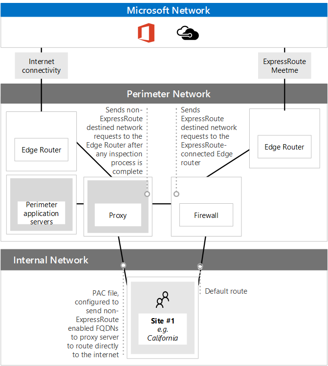

# <a name="implementing-expressroute-for-office-365"></a>Office 365 向け ExpressRoute の実装

Office 365 の ExpressRoute は、Office 365 サービスが直面している多くのインターネットに代替ルーティング パスを提供します。Office 365 の ExpressRoute のアーキテクチャがアドバタイズされているアクセス可能なインターネット上にこれらの IP プレフィックスの後の再配布の準備、ExpressRoute 回路を Office 365 サービスのパブリック IP のプレフィックスに基づいてください。ネットワークです。ExpressRoute するいくつか異なるルーティング パス、ExpressRoute、およびインターネットを通じて多くの Office 365 サービスを効果的に可能になります。ネットワーク上のルーティングのこの状態は、内部ネットワークのトポロジを設計する方法に大幅な変更を表します。
  
 **の状態:** 完全なガイド v2
  
中核となるネットワークおよびインターネットに挿入されたルートを持つ両方の専用回線経由で利用可能なルーティングのネットワークの複雑さに対応するために Office 365 の実装については、ExpressRoute を慎重に計画する必要があります。場合は、チームは、詳細な計画と、このガイドのテストを実行しない、お客様はリスクが高いが断続的または ExpressRoute 回路が有効になっているときに Office 365 への接続が完全に途絶えたがサービスします。
  
実装を成功させるには、インフラストラクチャの要件を分析、評価の詳細なネットワークを経由し設計、慎重に、段階的かつ制御された方法で展開を計画し、詳細な検証とテスト計画を構築する必要があります。大きな、分散された環境で数か月にわたる実装を表示することも珍しくはありません。このガイドは、事前に計画するために設計されています。
  
大規模な展開で成功したことがあります 6 か月計画では、多くの領域からのチーム メンバーは、多くの場合ネットワーク、ファイアウォールとプロキシ サーバーの管理者、Office 365 の管理者、セキュリティ、エンド ユーザー サポート、プロジェクトを含む組織管理、およびスポンサー。計画プロセスへの投資には、ダウンタイムや、複雑で高価なトラブルシューティングの展開の障害を体験する可能性が減少します。
  
この実装ガイドを開始する前に完了するのには次の前提条件と考えています。
  
1. ExpressRoute が推奨し、承認されたかどうかを判断するのには、ネットワークの評価を完了しました。

2. ExpressRoute ・ ネットワーク ・ サービス ・ プロバイダーを選択しました。[ExpressRoute のパートナーとピアリングの場所](https://azure.microsoft.com/documentation/articles/expressroute-locations/)に関する詳細情報を検索します。

3. 開封済みと[ExpressRoute のマニュアル](https://azure.microsoft.com/documentation/services/expressroute/)を理解して、内部ネットワークは ExpressRoute 前提条件のエンド ツー エンドの条件を満たすこと。

4. チームのすべてのパブリックのガイダンスとドキュメントに読み取り[https://aka.ms/expressrouteoffice365](https://aka.ms/expressrouteoffice365)、[https://aka.ms/ert](https://aka.ms/ert)など、重要な技術的な詳細を理解するのにはチャネル 9 の[Office 365 のトレーニングの Azure ExpressRoute](https://channel9.msdn.com/series/aer)シリーズ。

      - SaaS サービスのインターネットの依存関係です。

      - 非対称のルーティングを回避し、複雑なルーティングを処理する方法です。

      - 境界部のセキュリティ、可用性、およびアプリケーション レベルのコントロールを組み込む方法です。

## <a name="begin-by-gathering-requirements"></a>要件の収集を開始します。
<a name="requirements"> </a>

機能とする計画を立てて、組織内でサービスを決定することで起動します。別の Office 365 サービスの機能が使用され、それらの機能を使用するユーザーをホストするは、ネットワーク上のどの場所を決定する必要があります。シナリオのカタログが、ネットワークの属性を追加する必要があります。 これらのシナリオを必要とします。など、受信および送信ネットワーク トラフィックのフローと Office 365 エンドポイントがあるかを ExpressRoute か。
  
組織の要件を収集します。
  
- 組織を使用して Office 365 サービスの受信および送信ネットワーク トラフィックのカタログです。別の Office 365 シナリオを必要とするフローの詳細については、Office 365 の Url と IP アドレスの範囲] ページを参照してください。

- 内部の WAN のバックボーンとトポロジの詳細について、サテライト サイト、ネットワーク境界の出口のポイント、およびプロキシ サービスへのルーティング、最後のマイル ユーザー接続の接続が表示されている既存のネットワーク トポロジのドキュメントを収集します。

  - Office 365 とその他の Microsoft サービスに接続する、インターネットおよび提案された ExpressRoute の接続パスの両方が表示されているネットワークの図での受信サービスのエンドポイントを識別します。

  - すべてのユーザーの地理的な場所および場所現在インターネットに、出口があり、ExpressRoute ピアリングの場所に、出口を持つ場所が提示されると、拠点間の WAN 接続を特定します。

  - プロキシ、ファイアウォールなど、すべてのエッジ デバイスを識別し、カタログには、インターネットと ExpressRoute フローとの関係。

  - エンド ・ ユーザーがインターネットと ExpressRoute の両方のフローのルーティングを直接または間接アプリケーション プロキシを使用して、Office 365 サービスにアクセスするかどうかを文書化します。

- テナントの場所を追加し、対応の私場所です。

- Office 365 にユーザーの主要な場所から、予測と観測のネットワーク パフォーマンスと遅延の特性を予測します。Office 365 は、グローバルな分散環境の一連のサービスと、ユーザーは、テナントの場所とは異なる可能性がある場所に接続することに留意してください。このため、測定し、ExpressRoute とインターネット接続経由でユーザーとマイクロソフトのグローバル ネットワークの最も近い端の間の遅延時間を最適化することをお勧めします。このタスクを支援するためにネットワークの評価から評価結果を使用できます。

- 企業ネットワークのセキュリティと高可用性の要件を満たす必要があります ExpressRoute の新しい接続を一覧表示します。などの操作を行いますユーザー続けるか、インターネットの出口または ExpressRoute の回路のエラーが発生した場合、Office 365 へのアクセスを取得します。

- Office 365 受信および送信ネットワークのフロー ドキュメントはインターネット パスを使用し、ExpressRoute を使用します。ユーザーの地理的な場所と、設置型のネットワーク トポロジの詳細についての詳細については、計画を 1 つのユーザーの場所ごとに異なるを必要があります。

### <a name="catalog-your-outbound-and-inbound-network-traffic"></a>カタログの送信および受信ネットワーク トラフィック
<a name="trafficCatalog"> </a>

ルーティングおよびその他のネットワークの複雑さを最小限に抑えるには、のみに使用すること ExpressRoute Office 365 の規制要件のため、またはネットワークの評価の結果として、専用の接続を経由するために必要なネットワーク トラフィックのフローをお勧めします。さらに、実装プロジェクトの段階をまったく異なるとして ExpressRoute のルーティングおよびアプローチの送信および受信ネットワーク トラフィックのフローのスコープをステージすることをお勧めします。だけでユーザーには、送信ネットワーク トラフィックのフローとトポロジの複雑さと追加導入する際のリスクの増加を制御するため、インターネット経由での受信ネットワーク トラフィック フローことができます休暇が開始されたは、Office 365 の ExpressRoute を展開非対称可能性をルーティングします。
  
ネットワーク トラフィックのカタログには、オンプレミスのネットワークと Microsoft の間でする必要がありますすべての受信および送信ネットワーク接続の一覧が含まれます。
  
- 送信ネットワーク トラフィックのフローは、場所、接続を開始、オンプレミス環境からなど、内部のクライアントまたはサーバー、Microsoft のサービスの宛先からすべてのシナリオです。Office 365 に直接または間接的ななどと接続がプロキシ サーバー、ファイアウォール、またはその他のネットワーク デバイス パスで Office 365 にこれらの接続があります。

- 受信ネットワーク トラフィックのフローは、マイクロソフトのクラウドから設置型のホストに接続が開始されたすべてのシナリオです。通常、これらの接続は、ファイアウォールと外部で発行されたフローのお客様のセキュリティ ポリシーを必要とするその他のセキュリティ インフラストラクチャを経由する必要があります。

資料サービスが着信トラフィックを送信して**Office 365 の ExpressRoute**を[Office 365 でマークされている列を探しますを[Office 365 の ExpressRoute とルーティング](https://support.office.com/article/Routing-with-ExpressRoute-for-Office-365-e1da26c6-2d39-4379-af6f-4da213218408)の**ルートの対称性を保つ**」を読む端点](https://support.office.com/article/Office-365-URLs-and-IP-address-ranges-8548a211-3fe7-47cb-abb1-355ea5aa88a2)、残りの接続情報を確認する資料を参照します。
  
送信接続を必要とするサービスごとにネットワークのルーティング、プロキシの構成、パケットの検査などのサービスの計画的な接続について説明し、帯域幅が必要です。
  
受信接続を必要とするサービスごとにいくつかの追加情報を必要があります。マイクロソフト クラウド内のサーバーは、オンプレミスのネットワークへの接続を確立します。接続が正しく作成されていることを確認するには、説明するなどを含む、この接続のすべての側面について説明これらの着信接続を許可するサービスのパブリック DNS エントリを CIDR 形式の IPv4 の IP アドレス、どの ISP の機器が関係すると、および NAT の着信または送信元 NAT は、これらの接続を処理します。
  
インターネット経由で接続するかどうかに関係なく、着信接続を見直す必要があります。 または非対称のルーティングを確認するのには ExpressRoute が導入されていません。場合によっては、設置型エンドポイントを Office 365 サービスがまた月への着信接続を開始することが他のマイクロソフトおよびマイクロソフト以外のサービスがアクセスする必要があります。ExpressRoute は、これらのサービス用に Office 365 にルーティングを有効にするに他のシナリオは問題を非常に重要です。お客様は、多くの場合、ソース ベースの ExpressRoute を有効にした後、Microsoft からの入力方向のフローが対称維持するために、NAT など、内部のネットワーク固有の変更を実装する必要があります。
  
ここで、必要な詳細レベルのサンプルです。ここでは Exchange ハイブリッドは ExpressRoute 経由で社内のシステムにルーティングします。

|**接続のプロパティ**|**値**|
|:-----|:-----|
|**ネットワーク トラフィックの方向** <br/> |受信  <br/> |
|**サービス** <br/> |Exchange ハイブリッド  <br/> |
|**公開の Office 365 エンドポイント (ソース)** <br/> |Exchange Online (IP アドレス)  <br/> |
|**パブリックの設置型エンドポイント (移動先)** <br/> |5.5.5.5  <br/> |
|**パブリック (インターネット) DNS エントリ** <br/> |Autodiscover.contoso.com  <br/> |
|**この設置型のエンドポイントに使用するその他の (非-Office 365) マイクロソフトのサービス** <br/> |不要  <br/> |
|**この設置型エンドポイントによって使用されるインターネット上のユーザーとシステム** <br/> |はい  <br/> |
|**パブリック エンドポイントを公開する内部のシステム** <br/> |Exchange Server のクライアント アクセスの役割 (設置型) 192.168.101, 192.168.102, 192.168.103  <br/> |
|**パブリック エンドポイントの IP の提供情報** <br/> |**インターネットへ**: 5.5.0.0/16  <br/> **ExpressRoute に**: 5.5.5.0/24  <br/> |
|**/境界領域のセキュリティ ・ コントロール** <br/> |**インターネット パス**: DeviceID_002  <br/> **ExpressRoute パス**: DeviceID_003  <br/> |
|**高可用性を実現** <br/> |アクティブ/アクティブ冗長地域 2 の間で  <br/> ExpressRoute 回路のシカゴとダラス  <br/> |
|**パス対称コントロール** <br/> |**方法**: ソース NAT  <br/> **インターネット パス**: ソース NAT への着信接続 192.168.5.5  <br/> |**ExpressRoute パス**: ソース NAT 接続が 192.168.1.0 (シカゴ)、192.168.2.0 (ダラス)  <br/> |

のみで送信されているサービスの例を以下に示します。

|**接続のプロパティ**|**値**|
|:-----|:-----|
|**ネットワーク トラフィックの方向** <br/> |送信  <br/> |
|**サービス** <br/> |SharePoint Online  <br/> |
|**設置型エンドポイント (ソース)** <br/> |ユーザー ワークステーション  <br/> |
|**Office 365 エンドポイント (移動先) を公開** <br/> |SharePoint Online (IP アドレス)  <br/> |
|**パブリック (インターネット) DNS エントリ** <br/> |\*。 sharepoint.com (および追加の Fqdn)  <br/> |
|**CDN の紹介** <br/> |cdn.sharepointonline.com (および追加の Fqdn) の IP アドレスの CDN プロバイダーによって保持される)  <br/> |
|**IP の提供情報と使用中の NAT** <br/> |**インターネット パスまたは送信元 NAT**: 1.1.1.0/24  <br/> **ExpressRoute パスまたは送信元 NAT**: 1.1.2.0/24 (シカゴ) と 1.1.3.0/24 (ダラス)  <br/> |
|**接続方法** <br/> |**インターネット**: レイヤー 7 プロキシ (.pac ファイル) を経由して  <br/> **ExpressRoute**: 直接のルーティング (プロキシなし)  <br/> |
|**/境界領域のセキュリティ ・ コントロール** <br/> |**インターネット パス**: DeviceID_002  <br/> **ExpressRoute パス**: DeviceID_003  <br/> |
|**高可用性を実現** <br/> |**インターネット パス**: 冗長なインターネットの出口  <br/> **ExpressRoute パス**: 2 地理冗長 ExpressRoute 回路全体のシカゴとダラスのアクティブ/アクティブ 'ホット ポテト' ルーティング  <br/> |
|**パス対称コントロール** <br/> |**方法**: 送信元 NAT のすべての接続  <br/> |

### <a name="your-network-topology-design-with-regional-connectivity"></a>地域内の接続を持つネットワーク トポロジを設計
<a name="topology"> </a>

サービスと、関連するネットワーク トラフィックのフローを理解するとこれらの新しい接続性要件を組み込むし、すれば、ExpressRoute を使用して、Office 365 用に変更を示していますをネットワーク図を作成できます。ダイアグラムを含める必要があります。
  
1. Office 365 とその他のサービスにアクセスするすべてのユーザーの場所です。

2. すべてのインターネットおよび ExpressRoute の出口のポイントです。

3. 送信および受信するすべてのデバイスおよびルーター、ファイアウォール、プロキシ サーバーのアプリケーション、および侵入検出/防止を含め、ネットワーク接続を管理します。

4. ADFS web アプリケーションのプロキシ ・ サーバから接続を許可する内部の ADFS サーバーなど、すべての着信トラフィック用の内部宛先です。

5. 提供されるすべての IP サブネットのカタログ

6. 人のユーザーから Office 365 にアクセスするして、即時会議の一覧を表示、それぞれの場所を識別する-私 ExpressRoute を使用する場所です。

7. 場所と、ExpressRoute から得たマイクロソフト IP プレフィックスは受け入れられますが、内部のネットワーク トポロジの一部は、フィルターし、に伝達します。

8. ネットワーク トポロジには、各ネットワーク セグメントの地理的な場所と方法に接続する Microsoft のネットワーク ExpressRoute や、インターネット上でする必要がありますについて説明します。

次の図は、場所を使用するから Office 365 の着信および発信ルーティングの提供情報に Office 365 とそれぞれの場所を示しています。
  

  
発信トラフィックの場合は、人は、3 つの方法のいずれかで Office 365 をアクセスします。
  
1. 即時で-私北米カリフォルニア州内のユーザーの場所です。

2. 即時で-私香港に香港の方のための場所です。

3. を通じてインターネット バングラデシュ人が少なく、ExpressRoute 回路が準備されていません。


  
同様に、Office 365 からの受信ネットワーク トラフィックは、3 つの方法のいずれかで返します。
  
1. 即時で-私北米カリフォルニア州内のユーザーの場所です。

2. 即時で-私香港に香港の方のための場所です。

3. を通じてインターネット バングラデシュ人が少なく、ExpressRoute 回路が準備されていません。


  
### <a name="determine-the-appropriate-meet-me-location"></a>適切な対応を決定-私の場所

選択範囲を満たすに私、ExpressRoute 回路が Microsoft のネットワークに、ネットワークに接続されている物理的な場所の場所から Office 365 のユーザーのアクセス先の場所が影響を受けます。として SaaS を提供することでは、Office 365 は動作しません IaaS や PaaS 地域モデルでは、Azure では同じように。代わりに、Office 365 は分散コラボレーション サービスでは、一連のユーザーが複数のデータ センターおよび領域では、同じ場所またはユーザーのテナントをホストしている地域で必ずしもエンドポイントに接続する必要があります。
  
必要な対応を選択する際の最重要事項は、この-私、組織内のユーザーの接続元は、Office 365 の ExpressRoute の場所です。一般的な推奨 Office 365 の最適な接続ができるように、Office 365 サービスへのユーザー要求を引き継ぐ Microsoft のネットワークにネットワークの最短経路をルーティングでは、実装、多くの場合も対象と呼ばれるに 'ホット ポテト' ルーティングします。など、ほとんどの Office 365 ユーザーが 1 つまたは 2 つの場所にある場合は、対応を選択-私がそれらのユーザーの場所に近い場所では、最適な設計を作成します。大多数のユーザーは、多くの異なる領域にある企業、複数の ExpressRoute 回路のことを検討し、対応する可能性があります-私の場所です。ユーザー、サイトの一部は、Microsoft のネットワークと、Office 365 に最短または最も最適なパスできない場合があります、内部の WAN および ExpressRoute の対応を-私には、ポイントが、インターネット経由で。
  
多くの場合に、複数の対応があります-私を持つユーザーの相対的な近接領域内を選択することができる場所です。決定要因には、次の表に記入します。

|**ExpressRoute 対応を計画-私カリフォルニア州とニューヨークの場所**||
|:-----|:-----|
|場所  <br/> |人の数  <br/> |出口をインターネット経由で Microsoft ネットワークの待機時間が必要  <br/> |ExpressRoute 経由でマイクロソフト ネットワークへの予測した遅延時間  <br/> |
|ロサンゼルス  <br/> |10,000  <br/> |~ 使う  <br/> |~ (シリコン バレー) 経由で 10 ミリ秒  <br/> |
|ワシントン DC  <br/> |15,000  <br/> |~ 20 ミリ秒  <br/> |~ (ニューヨーク) 経由で 10 ミリ秒  <br/> |
|ダラス  <br/> |5,000  <br/> |~ 使う  <br/> |~ (ニューヨーク) を使用して 40 ms  <br/> |

グローバル ネットワーク アーキテクチャは、Office 365 の領域を示す、ExpressRoute ネットワーク サービス プロバイダーに対応すると、私の場所、および地域別の人々 の数が開発されている、すべての最適化が可能かどうか判断するために使用できます。示してグローバル hairpin ネットワーク接続の集合を取得するために遠く離れた場所にトラフィック ルーティング先の私の場所です。場合は、グローバル ・ ネットワークで、hairpin を検出するには、続行する前にそれを改善する必要があります。別の対応を検索するか-私の場所、または使用選択的なインターネットのブレーク アウト出口ポイント、hairpin を避けるためにします。
  
最初の図は、北アメリカで 2 つの物理的な場所でお客様の例を示します。オフィスの所在地、Office 365 テナントの場所に関する情報を表示でき、ExpressRoute のいくつかの選択肢に対応-私の場所です。この例では、お客様が選択されて、対応に私の順序で、2 つの原則に基づいて、場所。
  
1. 自分の組織内のユーザーに近いです。

2. Office 365 がホストされている Microsoft データ センターの近くに最も近い。


  
この概念を少し展開をさらに、同様の情報と意思決定のための例の多国籍顧客が直面している 2 番目の図です。この顧客には、バングラデシュで、設置面積の領域での成長に重点を置いて、10 人の少人数のチームだけで小規模なオフィスがあります。即時がある-私チェンナイと Office 365 でマイクロソフトのデータ センター内の場所でホストされているチェンナイ、即時の私の場所は、意味があります。ただし、10 人の追加回路の費用は大きな負担です。見ると、ネットワーク、ネットワーク間でネットワーク トラフィックを送信することに関連する遅延時間が ExpressRoute の別の回路を取得するために資本を費やすよりも効果的かどうか判断する必要があります。
  
また、バングラデシュに 10 人がありますパフォーマンスを向上させるよりも、最初の図に示した再現しましたと、内部ネットワークのルーティングは、Microsoft のネットワークにインターネットを介して送信ネットワーク トラフィックを以下に。
  

  
## <a name="create-your-expressroute-for-office-365-implementation-plan"></a>Office 365 導入の計画の ExpressRoute を作成します。
<a name="implementation"> </a>

実装計画には、次のよう、ネットワーク上の他のすべてのインフラストラクチャの構成の詳細と同様に ExpressRoute を構成するの両方の技術的な詳細をまとめる必要があります。
  
- ExpressRoute とインターネットの間で分割するサービスを計画します。

- 帯域幅、セキュリティ、高可用性およびフェイル オーバーを計画します。

- 着信および発信ルーティングでは、適切なルーティング パスの最適化処理の別の場所を含むデザインします。

- ネットワーク内に ExpressRoute ルートを提供する程度を決定し、クライアントがインターネットまたは ExpressRoute のパスを選択するための機構とはたとえば、ルーティングまたはアプリケーション プロキシを指示します。

- [送信者ポリシー フレームワーク](https://technet.microsoft.com/library/dn789058%28v=exchg.150%29.aspx)のエントリを含む、DNS レコードの変更を計画します。

- NAT. のソースが送信および受信を含む NAT の戦略を計画します。

### <a name="plan-your-routing-with-both-internet-and-expressroute-network-paths"></a>インターネットとネットワーク パスの ExpressRoute の両方で、ルーティングを計画します。
<a name="paths"> </a>

- 初期展開時に受信メールや、ハイブリッド接続など、すべての受信サービスはインターネットを使用するのにはお勧めします。

- エンド ユーザー クライアント LAN ルーティングでは、 [PAC と WPAD ファイルを構成する](https://aka.ms/manageo365endpoints)など、既定の工順、プロキシ サーバー、および BGP ルートのアドバタイズを計画します。

- プロキシ サーバー、ファイアウォール、およびクラウドのプロキシを含む、境界のルーティングを計画します。

### <a name="plan-your-bandwidth-security-high-availability-and-failover"></a>帯域幅、セキュリティ、高可用性およびフェイル オーバーを計画します。
<a name="availability"> </a>

各主要な Office 365 のワークロードに必要な帯域幅の計画を作成します。個別にオンライン ビジネスの帯域幅要件の SharePoint Online では、Exchange Online と Skype を見積もります。提供してきましたが Exchange Online とビジネスの出発点としての Skype の見積計算機を使用することができます。ただし、パイロット テストは、ユーザー プロファイル、および場所の代表的なサンプルは、組織の帯域幅のニーズを十分に理解する必要があります。
  
各インターネットおよび計画の ExpressRoute 出口の場所にセキュリティを処理する方法を追加、Office 365 へのすべての ExpressRoute 接続は、パブリック ・ ピアリングを使用し、外部に接続する、会社のセキュリティ ポリシーに従ってもセキュリティで保護する必要があります注意してください。ネットワークです。
  
詳細については、人が停止し、人が最も簡単な方法で完全にいっぱいに作業を実行することにする方法の種類によって影響を受ける計画を追加します。
  
#### <a name="plan-bandwidth-requirements-including-skype-for-business-requirements-on-jitter-latency-congestion-and-headroom"></a>ジッター、待機時間、混雑、および余裕のビジネス要件のための Skype を含む帯域幅要件を計画します。
  
ビジネス オンラインの Skype では、「[メディアの品質とビジネス オンラインの Skype でのネットワーク接続パフォーマンス](https://support.office.com/article/Media-Quality-and-Network-Connectivity-Performance-in-Skype-for-Business-Online-5fe3e01b-34cf-44e0-b897-b0b2a83f0917)の詳細については、その他の特定のネットワーク要件もあります。
  
**Azure の ExpressRoute は帯域幅の計画**を[Office 365 の ExpressRoute で、ネットワークの計画](https://support.office.com/article/Network-planning-with-ExpressRoute-for-Office-365-103208f1-e788-4601-aa45-504f896511cd)のセクションを参照してください。
  
パイロット ユーザーの帯域幅の評価を実行する場合、番組ガイドを使用できます。[ベースラインとパフォーマンスの履歴を使用して office 365 のパフォーマンスの調整](https://support.office.com/article/Office-365-performance-tuning-using-baselines-and-performance-history-1492cb94-bd62-43e6-b8d0-2a61ed88ebae)をします。
  
#### <a name="plan-for-high-availability-requirements"></a>高可用性の要件の計画
  
高可用性ニーズを満たすし、更新されたネットワーク トポロジの図にこれを組み込むのための計画を作成します。**高可用性を実現し Azure の ExpressRoute を使用したフェイル オーバー**で[Office 365 の ExpressRoute で、ネットワークの計画](https://support.office.com/article/Network-planning-with-ExpressRoute-for-Office-365-103208f1-e788-4601-aa45-504f896511cd)のセクションを参照してください。
  
#### <a name="plan-for-network-security-requirements"></a>ネットワークのセキュリティ要件の計画
  
ネットワークのセキュリティ要件を満たすし、更新されたネットワーク トポロジの図にこれを組み込むのための計画を作成します。[Office 365 の ExpressRoute で、ネットワークの計画](https://support.office.com/article/Network-planning-with-ExpressRoute-for-Office-365-103208f1-e788-4601-aa45-504f896511cd)では、 **Office 365 シナリオの ExpressRoute を Azure にセキュリティ制御を適用する**] セクションを参照してください。
  
### <a name="design-outbound-service-connectivity"></a>外部サービス接続を設計します。
<a name="outbound"> </a>

Office 365 の ExpressRoute には、理解できない場合があります*アウト バウンド*のネットワーク要件があります。具体的には、IP アドレスを Office 365 にユーザーとのネットワークを表すし、マイクロソフトに送信ネットワーク接続のソース エンドポイントが特定の要件を次の手順に従う必要がありますように動作します。
  
1. 端点は、会社とする ExpressRoute の接続を提供するキャリアに登録されているパブリックの IP アドレスである必要があります。

2. エンドポイントでは、ExpressRoute によってマイクロソフトに提供し、検証受け入れをする必要があります。

3. エンドポイントはする必要があります、同じまたはより優先ルーティング メトリックを使用してインターネットにはアドバタイズされません。

4. ExpressRoute 経由で構成されていない Microsoft サービスへの接続のエンドポイントを使用しないでください。

ネットワーク設計では、これらの要件を満たしていない場合、は、ユーザーの Office 365 と黒 holing のルートまたは非対称のルーティングのためには、他の Microsoft サービスへの接続障害が発生するリスクが高い。これは、ExpressRoute、上で Microsoft サービスに要求がルーティングされるが、応答は、インターネット経由で、またはその逆の場合は、ルーティングし、応答は、ファイアウォールなどのステートフルなネットワーク デバイスによって破棄されたときに発生します。
  
上記の要件を満たすために使用することが最も一般的な方法では、ソース、ネットワークの一部として実装されているか、ExpressRoute のキャリアによって提供される NAT を使用します。送信元 NAT を使用すると、詳細情報とプライベート IP アドレス、インターネットのネットワークの ExpressRoute からの抽象化とします。適切な IP ルートのアドバタイズを組み合わせることで、パスの対称性を確認する簡単なメカニズムを提供します。ExpressRoute ピアリングの場所に特有のステートフルなネットワーク デバイスを使用している場合、ピアリング パスの対称性を確保するのには各 ExpressRoute の別の NAT プールを実装しなければなりません。
  
[ExpressRoute NAT 要件](https://azure.microsoft.com/documentation/articles/expressroute-nat/)の詳細を参照します。
  
ネットワーク トポロジの図にアウト バウンド接続の変更を追加します。
  
### <a name="design-inbound-service-connectivity"></a>サービスが着信接続を設計します。
<a name="inbound"> </a>

大半の企業が Office 365 の展開を想定しています設置型のサービスを Office 365 からの着信接続のいくつかのフォームなど、Exchange、SharePoint、および Skype のビジネス ハイブリッド シナリオ、メールボックスの移行、および ad FS を使用する認証のインフラストラクチャです。アウト バウンド接続のため、設置型のネットワークと Microsoft の間追加ルーティング パスを有効にする ExpressRoute、これらの着信接続が非対称ルーティングによって影響を受ける可能性があります誤ってにこれらのフローを継続する予定がある場合でもインターネットを使用します。インターネットに影響を与えるベースの Office 365 から設置型システムへの受信フローがあることを確認するのには、以下に示すいくつかの対策が推奨されます。
  
着信ネットワーク トラフィック フローの非対称のルーティングのリスクを最小限に抑えるには、するには、送信元 NAT を使用して、ExpressRoute ルーティングの可視性を持つネットワーク セグメントにルーティングして、前にすべての着信接続ください。着信接続が許可された場合のネットワーク セグメント上にソース NAT が存在しない ExpressRoute にルーティングの可視性を Office 365 から送信された要求をインターネットから入力されますが、Office 365 に戻ると、応答には、ExpressRoute が便利非対称ルーティングの原因で、Microsoft ネットワークへのネットワーク パスです。
  
この要件を満たすには、次の実装パターンのいずれかを考慮することがあります。
  
1. 要求がファイアウォールなどのネットワーク機器を使用して内部ネットワークにルーティングされる前にソース NAT を実行またはインターネットから、オンプレミスのシステム パス上の分散システムをロードします。

2. ExpressRoute ルートや前面の受信サービスがサーバーを終了、リバース プロキシ システムでは、インターネットの接続が存在する処理は、ネットワーク セグメントに反映されないことを確認します。

明示的にこれらのシナリオで、ネットワークの会計とすべての受信ネットワーク トラフィックを保持することを展開し、非対称ルーティングの運用リスクを最小限に抑えるためのインターネットにより流れます。
  
ExpressRoute 接続上でいくつかの受信フローを指示することができる場合がある可能性があります。これらのシナリオでは、点を考慮して、次追加します。
  
1. Office 365 では、ターゲットの設置型のエンドポイントだけパブリック ip アドレスを使用することができます。つまり、でも、オンプレミス ExpressRoute 経由で着信のエンドポイントの公開された Office 365 にのみ、その必要がある場合と、それに関連付けられているパブリックの IP です。

2. 設置型のエンドポイントを解決するのには Office 365 のサービスを実行するすべての DNS 名前解決は、パブリック DNS を使用して発生します。これは、受信サービスのエンドポイントの FQDN をインターネット上の IP のマッピングに登録する必要があることを意味します。

3. ExpressRoute 経由で着信ネットワーク接続を受信するためには、パブリック IP サブネット上では、これらのエンドポイントを ExpressRoute 経由で Microsoft に提供する必要があります。

4. その適切なセキュリティを確保するのにはこれらの受信ネットワーク トラフィック フローを慎重に評価し、ネットワーク制御は、会社のセキュリティおよびネットワークのポリシーを適用します。

5. 1 回、設置型受信エンドポイントは、ExpressRoute 経由で Microsoft に提供されて、ExpressRoute は効果的になる Office 365 を含む、すべての Microsoft のサービスのエンドポイントの優先ルーティング パス。つまり、これらのエンドポイントのサブネットは Office 365 のサービスおよび Microsoft ネットワーク上の他のないサービスとの通信にのみ使用する必要があります。それ以外の場合、設計では、戻り値のパスがインターネットを使用して、ExpressRoute、上でルーティング サービスが使用する他の Microsoft からの着信接続が受信する、非対称のルーティングが発生します。

6. イベント、ExpressRoute の回路かを満たして-me ダウンは、場所、施設内のことを確認する必要があります別のネットワーク パス上で要求を受信する受信エンドポイントを利用できます。そのエンドポイントを複数の ExpressRoute の回路での広告のサブネットがあります。

7. これらのフローは、ファイアウォールなどのステートフルなネットワーク デバイスを通過するときに特に ExpressRoute、を通じて、ネットワークを入力するすべての受信ネットワーク トラフィック フローの送信元 NAT を適用することをお勧めします。

8. ADFS プロキシまたは Exchange の自動検出など、いくつかのオンプレミス サービス Office 365 のサービスと、インターネットからのユーザーの両方から受信要求の受信可能性があります。これらの要求に対して Office 365 はインターネット経由でユーザーの要求と同じ FQDN をターゲットすることにします。接続を許可する入力方向のユーザー、インターネットから、これらの設置型エンドポイントを ExpressRoute を使用する Office 365 の接続を実行する際に重要なルーティングの複雑さを表します。お客様の大多数の ExpressRoute 経由でこのような複雑なシナリオを実装することはお勧めできません運用上の理由。このオーバーヘッドが含まれている非対称ルーティングのリスクを管理して複数のディメンション間でルーティングの提供情報とポリシーを慎重に管理する必要があります。

### <a name="update-your-network-topology-plan-to-show-how-you-would-avoid-asymmetric-routes"></a>非対称のルーティングを回避する方法を表示するのには、ネットワーク トポロジの計画を更新します。
<a name="asymmetric"> </a>

組織内のユーザー使用できるようにシームレスに Office 365 とその他の重要なサービス、インターネット上に非対称ルーティングされないようにするには。非対称のルーティングが発生する 2 つの一般的な構成のお客様が必要があります。使用し、存在する可能性がありますこれら非対称のルーティングのシナリオのいずれかのかどうかを確認することを計画しているネットワーク構成を確認するのには絶好のタイミングを今すぐです。
  
最初に、次のネットワーク ダイアグラムに関連付けられているいくつかのさまざまな状況を説明します。この図では、着信要求を受信するすべてのサーバー ADFS またはオンプレミスのハイブリッドなどサーバー ニュージャージーのデータ ・ センターし、インターネットに提供します。
  
1. 境界領域のネットワークはセキュリティで保護されたは送信元 NAT 受信要求に対して使用します。

2. ニュージャージーのデータ ・ センター内のサーバーは、インターネットと ExpressRoute のルートの両方を参照してください。


  
それらを修正する方法の提案もあります。
  
#### <a name="problem-1-cloud-to-on-premises-connection-over-the-internet"></a>問題 1: クラウドをインターネット経由で接続を設置する
  
ネットワーク構成は、インターネット経由でマイクロソフトのクラウドからの着信要求に NAT を提供しない場合、非対称のネットワーク パスを次の図に示します。
  
1. Office 365 からの着信要求では、パブリック DNS から設置型エンドポイントの IP アドレスを取得し、境界ネットワークに要求を送信します。

2. 構成ではこの問題がある、送信元 NAT が構成されていないかは境界ネットワークで使用可能な送信した結果として、実際のソース IP アドレスを戻り値の変換先として使用されています。

  - ネットワーク上のサーバーは、任意の利用可能な ExpressRoute ネットワーク接続を介して Office 365 に戻りトラフィックをルーティングします。

  - 切断された接続の結果として、Office 365 には、そのフローの非対称のパスになります。


  
##### <a name="solution-1a-source-nat"></a>ソリューション 1 a: NAT のソース
  
この構成が正しくないネットワークを解決する、着信要求を送信元 NAT を追加するだけです。でこの図に示します。
  
1. 着信要求は、ニュージャージーのデータ センターの境界ネットワークからの入力を続けます。このソース NAT は使用可能です。

2. サーバーのルートからの応答は、同じネットワーク パスを返す応答の結果として、元の IP アドレスではなくソース NAT に関連付けられている ip アドレスにバックアップします。


  
##### <a name="solution-1b-route-scoping"></a>ソリューション 1 b: のルート スコープの設定
  
または、それらのコンピューターの別のネットワーク パスを削除するプレフィックスが提供されるように ExpressRoute BGP を許可しないように選択できます。でこの図に示します。
  
1. 着信要求は、ニュージャージーのデータ センターの境界ネットワークからの入力を続けます。この時間 ExpressRoute 回線経由で Microsoft からのプレフィックスは、ニュージャージーのデータ ・ センターには使用できません。

2. サーバーのルートからの応答は、同じネットワーク パスを返す応答の利用可能な唯一のルート経由で、元の IP アドレスに関連付けられた IP にバックアップします。


  
#### <a name="problem-2-cloud-to-on-premises-connection-over-expressroute"></a>ExpressRoute 経由で接続を設置する問題 2: クラウド
  
ネットワーク構成は ExpressRoute 経由でマイクロソフトのクラウドからの着信要求に NAT を提供しない場合、非対称のネットワーク パスを次の図に示します。
  
1. Office 365 からの着信要求は、DNS から IP アドレスを取得し、境界ネットワークに要求を送信します。

2. 構成ではこの問題がある、送信元 NAT が構成されていないかは境界ネットワークで使用可能な送信した結果として、実際のソース IP アドレスを戻り値の変換先として使用されています。

  - ネットワーク上のコンピューターは、任意の利用可能な ExpressRoute ネットワーク接続を介して Office 365 に戻りトラフィックをルーティングします。

  - Office 365 に非対称の接続になります。


  
##### <a name="solution-2-source-nat"></a>解決方法 2: 送信元 NAT
  
この構成が正しくないネットワークを解決する、着信要求を送信元 NAT を追加するだけです。でこの図に示します。
  
1. 受信要求は、ニューヨークのデータ センターの境界ネットワークからの入力を続けます。このソース NAT は使用可能です。

2. サーバーのルートからの応答は、同じネットワーク パスを返す応答の結果として、元の IP アドレスではなくソース NAT に関連付けられている ip アドレスにバックアップします。


  
### <a name="paper-verify-that-the-network-design-has-path-symmetry"></a>用紙では、ネットワークの設計がパスの対称性を持っていることを確認します。

この時点では、紙の上、実装計画に Office 365 を使用するさまざまなシナリオのルートの対称性が用意されていることを確認する必要があります。ユーザーが、サービスのさまざまな機能を使用する場合に実行されると予想される特定のネットワーク ルートを特定しておきます。設置型のネットワークと、接続パスの境界デバイスへの WAN のルーティングExpressRoute または、インターネットやオンラインのエンドポイントへの接続にします。
  
組織が採用するサービスとして識別していた Office 365 のネットワーク サービスのすべてのする必要があります。
  
この用紙ウォークスルーの 2 番目のユーザーにルートを実行するのに役立ちます。次のルートを取得し、ルーティングのパスに慣れていることを確認する各ネットワーク ホップが必要な場所に説明します。ExpressRoute Microsoft サーバーの IP アドレスがインターネットの既定のルートよりもルートのコストを削減することにより範囲のルートを常に提供することを忘れないでください。
  
### <a name="design-client-connectivity-configuration"></a>デザインのクライアント接続の構成
<a name="asymmetric"> </a>


  
使用する場合のトラフィックがインターネットのプロキシ サーバーにバインドされているし、PAC を調整する必要がありますまたは Office 365 に移動する際に必要な ExpressRoute トラフィックを送信するのには、ネットワーク上のクライアント コンピューターを確実にクライアントの構成ファイルが正しく構成されています。プロキシ サーバー、およびいくつかの Office 365 のトラフィックを含め、残りのトラフィックは、関連するプロキシに送信されます。ガイドをお読み、 [Office 365 エンドポイントを管理するの](https://aka.ms/manageo365endpoints)には PAC ファイルです。
  
> [!NOTE]
> エンドポイントでは、多くの場合、週単位と同じ頻度を変更します。のみ、サービスと機能は、組織が常に最新情報を確認する必要があります変更の数を減らすために採用していますに基づいて変更する必要があります。RSS フィードの変更を発表しましたが記録の過去すべての変更、IP アドレスは公表に**有効な日付**に注意してのアドバタイズされると、または有効な日付に到達するまでに、広告から削除しない場合があります。
  
## <a name="build-your-deployment-and-testing-procedures"></a>展開とテスト手順を作成します。
<a name="testing"> </a>

実装計画には、両方をテストし、ロールバック計画を含める必要があります。最も影響を与える計画を設計する場合は、実装は、期待どおりに動作しない場合、問題を発見した人の数です。高レベルの計画を検討する必要があります事項を次に示します。
  
1. ネットワーク セグメント、ユーザー サービス契約時の中断を最小限に抑えるためのステージです。

2. Traceroute を持つルートをテストするための計画し、TCP が個別のインターネット接続されているホストから接続します。

3. 可能であれば、テスト Office 365 テナントに隔離されたテスト ネットワーク上には、着信および発信のサービスのテストを行ってください。

      - 代わりに、テストを実行できます実稼動ネットワークに、お客様が Office 365 を使用されていないまたはパイロットの場合です。

      - または、テストは、確保されているテストの本番システムの停止時に実行されると監視のみです。

      - または、レイヤー 3 ルーターの各ノード上の各サービスへのルートを確認することによってには、テストを実行できます。このフォールバックを実行は、他のテストがない場合可能性のある物理的なテストの欠如により、リスクが生じるのためにのみ使用する必要があります。

### <a name="build-your-deployment-procedures"></a>展開手順を構築します。

展開手順は必要がありますを人の大規模なグループに展開する前にテストのための段階で人の小規模なグループに展開できます。ExpressRoute の展開を段階的にいくつかの方法を次に示します。
  
1. Microsoft ピアリングと ExpressRoute を設定し、のみの 1 つのホストに転送するルートのアドバタイズがテストのためのステージングします。

2. 最初に単一のネットワーク セグメントに ExpressRoute ネットワークへのルートをアドバタイズし、ネットワークのセグメントまたは地域別のルートのアドバタイズを展開します。

3. 場合は、最初に Office 365 の展開、少数の人のパイロットとして、ExpressRoute ネットワークの展開を使用します。

4. プロキシ サーバーを使用する場合はテスト PAC ファイルの詳細を追加する前にテストおよびフィードバックを ExpressRoute する人の数が少ないを指示する別の方法として設定できます。

実装計画では個々 の展開手順を実行する必要がありますまたはネットワーク構成の展開に使用する必要があるコマンドを一覧表示します。ネットワークの停止時間のすべての変更を事前に記述されている記述の展開計画とピアから行われる必要がありますが到着したときを確認します。ExpressRoute の技術的な構成に関するガイダンスを参照してください。
  
- 電子メールを送信し続けますが、オンプレミス サーバーの IP アドレスを変更した場合は、SPF TXT レコードを更新します。

- 新しい NAT 構成に対応する IP アドレスを変更した場合は、オンプレミスのサーバーの DNS エントリをすべてを更新します。

- 任意のルーティングまたはプロキシの構成を維持するために Office 365 エンドポイントの通知の RSS フィードを購読していることを確認します。

ExpressRoute 展開が完了した後テスト計画の手順を実行する必要があります。各手順の結果をログに記録する必要があります。テスト計画の結果では、実装に失敗しましたを示す場合に、元の本番環境にロールバックするための手順を含める必要があります。
  
### <a name="build-your-test-procedures"></a>ビルド、テストの手順

テストの手順は、Office 365 用の各 ExpressRoute を使用する送信および受信のネットワーク サービスとすることはできませんのテストを含める必要があります。手順は、各設置企業の LAN 内ではないユーザーを含む一意のネットワークの場所からテストを含める必要があります。
  
テスト動作のいくつかの例を以下にします。
  
1. 設置ルーターからネットワーク オペレーター ルーターに ping を実行します。

2. 500 + Office 365 と CRM オンラインの IP アドレス、設置型のルーター アドバタイズを受信を確認します。

3. 検証、着信と発信 NAT は ExpressRoute と内部ネットワーク間で動作します。

4. NAT へのルートをルーターから提供されていることを検証します。

5. ExpressRoute が、アドバタイズされたプレフィックスを受け入れたことを検証します。

      - ピアリングの提供情報を確認するのにには、次のコマンドレットを使用します。

      ```PowerShell
      Get-AzureRmExpressRouteCircuitRouteTable -DevicePath Primary -ExpressRouteCircuitName TestER -ResourceGroupName RG -PeeringType MicrosoftPeering
      ```

6. パブリック NAT IP を前の例のようにのより広い範囲の特定のサブセットでない場合、範囲は、他の ExpressRoute またはパブリックのインターネットのネットワーク接続経由でマイクロソフトにアドバタイズされませんを検証します。

7. ExpressRoute 回路がペアになって、両方の BGP セッションを実行していることを検証します。

8. NAT の内側に 1 つのホストを設定し、ホストの outlook.office365.com に新しい回線経由で接続をテストするのには、ping、tracert、および tcpping を使用します。または、Wireshark などのツールを使用する可能性がありますか、Microsoft ネットワーク モニターの 3.4 を検証するために MSEE にミラー化されたポートのいる outlook.office365.com に関連付けられている IP アドレスに接続すること。

9. Exchange のオンラインのアプリケーション レベルの機能をテストします。

  - テスト Outlook は、Exchange Online に接続し、電子メールを送受信することができます。

  - テストの Outlook は、オンライン モードを使用することができます。

  - スマート フォンの接続および送信/受信の機能をテストします。

10. SharePoint Online のアプリケーション レベルの機能をテストします。

  - 同期クライアントのビジネスの OneDrive をテストします。

  - SharePoint Online の web アクセスをテストします。

11. Skype の呼び出し元のビジネス シナリオのアプリケーション レベルの機能をテストします。

  - [招待状のエンド ・ ユーザーによって開始された] の認証されたユーザーとして電話会議に参加します。

  - カンファレンス ・ コール [MCU から送信された招待状] にユーザーを招待します。

  - ビジネス web アプリケーションで、Skype を使用して、匿名ユーザーとして会議に参加します。

  - PC の有線接続、IP 電話、およびモバイル デバイスからの呼び出しを結合します。

  - フェデレーション ユーザー o 検証の PSTN への呼び出しの呼び出し: 呼び出しが完了した、通話の音質が許容可能な接続時間が許容されます。

  - テナントの両方のメンバーの更新は、ユーザーとフェデレーション ユーザーの連絡先のプレゼンス状態を確認します。

### <a name="common-problems"></a>一般的な問題

非対称のルーティングは、最も一般的な実装の問題です。検索するいくつかの一般的なソースを以下に示します。
  
- 開いているか、フラットなネットワークのルーティング トポロジを使用して、ソースの場所での NAT が存在しません。

- SNAT を使用していない着信ルーティング サービス、インターネットと ExpressRoute の両方を接続します。

- ExpressRoute の広い範囲に展開する前に、テスト ネットワーク上の受信サービスをテストできません。

## <a name="deploying-expressroute-connectivity-through-your-network"></a>ネットワーク経由の ExpressRoute 接続を展開します。
<a name="testing"> </a>

新規のネットワーク セグメントごとにロール ・ バックするための計画を使用してネットワークのさまざまな部分に、接続を段階的にロールアウトするには、ネットワークの 1 つのセグメントに配置を準備します。場合、配置は、Office 365 の導入に配置、まず、Office 365 のパイロット ユーザーに展開し、そこから拡張します。
  
テスト用とし、生産の最初の。
  
- ExpressRoute を有効にする展開の手順を実行します。

- ネットワークへの経路は、期待どおりに表示をテストします。

- 各着信および発信のサービスのテストを実行します。

- すべての問題を発見した場合にロールバックします。

### <a name="set-up-a-test-connection-to-expressroute-with-a-test-network-segment"></a>テスト ネットワーク セグメントを持つ ExpressRoute へのテスト接続を設定します

紙に完成した計画を作成したら、小規模にテストするのには時間を勧めします。このテストでは、設置型ネットワークのテスト サブネットに Microsoft Peering と 1 つの ExpressRoute 接続を確立します。テスト サブネットとの間の接続を使用して[試用版の Office 365 テナント](https://go.microsoft.com/fwlink/p/?LinkID=403802)を構成してテスト サブネット内には、実稼働環境で送信および受信するすべてのサービス使用するにはが含まれます。テストのネットワーク セグメントに DNS をセットアップし、すべての着信および発信のサービスを確立します。テスト計画を実行し、各サービスおよびルートの伝達経路について熟知していることを確認します。
  
### <a name="execute-the-deployment-and-test-plans"></a>展開およびテスト計画を実行します。

上記の項目を完了すると、領域を確認、チームを確認して、展開を実行して、計画をテストする前に、完了したし、することを確認します。
  
- ネットワークの変更に関連する送信および受信のサービスの一覧です。

- インターネット出口と ExpressRoute の対応の両方を示すグローバル ネットワーク アーキテクチャの図を自分の場所です。

- ネットワーク ルーティング図の各サービスを展開するための別のネットワーク パスを示します。

- 展開は、必要に応じて、ロールバック、変更を実装する手順を計画します。

- 各 Office 365 とネットワーク サービスをテストするテスト計画。

- 受信および送信サービスの生産工順の紙の検証を完了します。

- 可用性のテストを含むテストのネットワーク セグメント間で完了したテストです。

全体の展開計画とテスト計画を実行するのに十分な長さは、いくつかのトラブルシューティングに使用できる時間と時間が必要な場合にバックアップをロールには、停止時間を選択します。
  
> [!CAUTION]
> インターネットと ExpressRoute の両方をルーティングの複雑な性質上、複雑なルーティングのトラブルシューティングを処理するには、このウィンドウに追加のバッファー時間を追加することをお勧めします。
  
### <a name="configure-qos-for-skype-for-business-online"></a>ビジネス用 Skype の QoS をオンライン設定します。

QoS では、Skype のオンライン ビジネスの音声と会議の利点を取得する必要があります。ExpressRoute ネットワーク接続がブロックされていないこと、他の Office 365 サービスのアクセスのいずれかを確認したら、QoS を設定できます。QoS の構成は、 [ExpressRoute とオンライン ビジネスの Skype での QoS](https://support.office.com/article/ExpressRoute-and-QoS-in-Skype-for-Business-Online-20c654da-30ee-4e4f-a764-8b7d8844431d)の資料の説明です。
  
## <a name="troubleshooting-your-implementation"></a>実装のトラブルシューティング
<a name="troubleshooting"> </a>

されたいずれかのこの実装のガイドの手順を検索する最初の場所は、実装計画に失敗したか。戻って、さらに小規模なネットワークのエラーを複製し、デバッグが可能な場合にテストを実行します。
  
あるインバウンドまたはアウト バウンド サービスは、テスト中に失敗しましたを識別します。失敗したサービスごとに専用の IP アドレスとサブネットを取得します。さあ、紙の上のネットワーク トポロジの図の説明、およびルーティングの検証します。具体的には、ExpressRoute ルーティング アドバタイズを確認、そのルーティング システムの停止時に可能な場合はトレースをテストします。
  
お客様のエンドポイントごとにネットワーク トレースを使用して PSPing を実行し、期待どおりにされることを検証するために送信元と宛先の IP アドレスを評価します。SNAT も、これが予想される場合に、元のソース IP アドレスを隠していることを確認してポート 25 上で公開するすべてのメール ホストに telnet を実行します。
  
注意してください ExpressRoute の両方のネットワーク構成を確認する必要があります ExpressRoute 接続を使用して Office 365 の展開中に、最適に設計されていて、クライアント コンピューターなど、ネットワーク上の他のコンポーネントを最適化してもします。この計画ガイドを使用して、トラブルシューティングの手順を実行したことがある、他も用意されています[パフォーマンスのトラブルシューティング Office 365 のプラン](https://support.office.com/article/Performance-troubleshooting-plan-for-Office-365-e241e5d9-b1d8-4f1d-a5c8-4106b7325f8c)です。
  
ここに戻る場合は、次の短いリンクをご利用ください: [https://aka.ms/implementexpressroute365](https://aka.ms/implementexpressroute365)
  
## <a name="related-topics"></a>関連項目

[Office 365 へのネットワーク接続](network-connectivity.md)
  
[Office 365 向け Azure ExpressRoute](azure-expressroute.md)
  
[Office 365 向け ExpressRoute の管理](managing-expressroute-for-connectivity.md)
  
[Office 365 向け ExpressRoute でのルーティング](routing-with-expressroute.md)
  
[Office 365 向け ExpressRoute でのネットワーク計画](network-planning-with-expressroute.md)
  
[Office 365 向け ExpressRoute での BGP コミュニティの使用のシナリオ (プレビュー)](bgp-communities-in-expressroute.md)
  
[Skype for Business Online でのメディア品質とネットワーク接続のパフォーマンス](https://support.office.com/article/5fe3e01b-34cf-44e0-b897-b0b2a83f0917)
  
[Skype for Business Online 向けのネットワークの最適化](https://support.office.com/article/b363bdca-b00d-4150-96c3-ec7eab5a8a43)
  
[Skype for Business Online での ExpressRoute および QoS](https://support.office.com/article/20c654da-30ee-4e4f-a764-8b7d8844431d)
  
[ExpressRoute を使用したコール フロー](https://support.office.com/article/413acb29-ad83-4393-9402-51d88e7561ab)
  
[ベースラインとパフォーマンス履歴を使用した、Office 365 のパフォーマンスのチューニング](performance-tuning-using-baselines-and-history.md)
  
[Office 365 のパフォーマンスに関するトラブルシューティングの計画](performance-troubleshooting-plan.md)
  
[Office 365 の URL と IP アドレス範囲](https://support.office.com/article/8548a211-3fe7-47cb-abb1-355ea5aa88a2)
  
[Office 365 のネットワークとパフォーマンスのチューニング](network-planning-and-performance.md)
