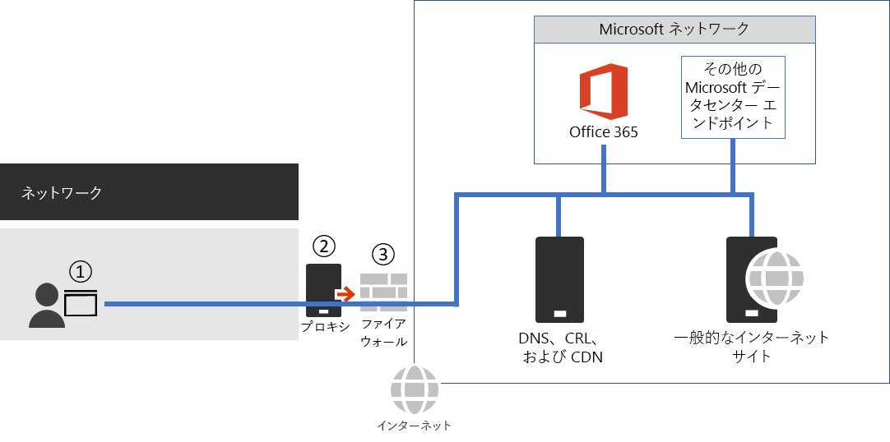

# <a name="managing-office-365-endpoints"></a><span data-ttu-id="01e83-104">Office 365 エンドポイントを管理します。</span><span class="sxs-lookup"><span data-stu-id="01e83-104">Managing Office 365 endpoints</span></span>

## <a name="office-365-network-connectivity"></a><span data-ttu-id="01e83-105">Office 365 のネットワーク接続</span><span class="sxs-lookup"><span data-stu-id="01e83-105">Office 365 network connectivity</span></span>

 <span data-ttu-id="01e83-p102">Office 365 への接続は、非常に大きく、最適なユーザーに近い低レイテンシの出口を構成するときを実行する信頼されたネットワーク要求で構成されます。いくつかの Office 365 の接続は、接続の最適化を利用できます。</span><span class="sxs-lookup"><span data-stu-id="01e83-p102">Connections to Office 365 consist of high volume, trusted network requests that perform best when they're made over a low-latency egress that is near the user. Some Office 365 connections can benefit from optimizing the connection.</span></span> 
  
1. <span data-ttu-id="01e83-108">ファイアウォールのことを確認 Office 365 エンドポイントへの接続のリストを使用できるようにします。</span><span class="sxs-lookup"><span data-stu-id="01e83-108">Ensure your firewall allow lists allow for connectivity to Office 365 endpoints.</span></span>
    
2. <span data-ttu-id="01e83-109">ワイルドカードと未公開の宛先へのインターネット接続を許可するのに、プロキシ インフラストラクチャを使用します。</span><span class="sxs-lookup"><span data-stu-id="01e83-109">Use your proxy infrastructure to allow Internet connectivity to wildcard and unpublished destinations.</span></span>
    
3. <span data-ttu-id="01e83-110">最適な境界領域のネットワーク構成を管理します。</span><span class="sxs-lookup"><span data-stu-id="01e83-110">Maintain an optimal perimeter network configuration.</span></span>
    
4. <span data-ttu-id="01e83-111">[最適な接続を取得していることを確認](https://aka.ms/o365perfprinciples)します。</span><span class="sxs-lookup"><span data-stu-id="01e83-111">[Ensure you're getting the best connectivity](https://aka.ms/o365perfprinciples).</span></span>
    
5. <span data-ttu-id="01e83-112">安全に Office 365 のトラフィックを管理し、最高のパフォーマンスを取得するための接続の原理を理解するのには[Office 365 のネットワーク接続性の原則](office-365-network-connectivity-principles.md)を参照してください。</span><span class="sxs-lookup"><span data-stu-id="01e83-112">Read [Office 365 Network Connectivity Principles](office-365-network-connectivity-principles.md) to understand the connectivity principles for securely managing Office 365 traffic and getting the best possible performance.</span></span> 
    

  
## <a name="update-your-firewalls-outbound-allow-lists"></a><span data-ttu-id="01e83-114">更新プログラム、ファイアウォールの外部リストを許可します。</span><span class="sxs-lookup"><span data-stu-id="01e83-114">Update your firewall's outbound allow lists</span></span>

<span data-ttu-id="01e83-p103">すべての信頼されたファイアウォールを使用して直接 Office 365 のネットワーク要求を送信する、すべての他のパケット レベルの検査をバイパスする処理では、ネットワークを最適化できます。これは、遅延から低速のパフォーマンスが低下し、境界領域の容量要件を軽減します。ネットワークを信頼するように要求を選択する最も簡単な方法では、上記の [**プロキシ**] タブで、構築済みの PAC ファイルを使用します。</span><span class="sxs-lookup"><span data-stu-id="01e83-p103">You can optimize your network by sending all trusted Office 365 network requests directly through your firewall, bypassing all additional packet level inspection or processing. This reduces slow performance from latency and reduces your perimeter capacity requirements. The easiest way to choose which network requests to trust is to use our pre-built PAC files on the **Proxies** tab above.</span></span> 
  
<span data-ttu-id="01e83-p104">ファイアウォールのブロックの送信トラフィックでは、すべての ip アドレスを確認する必要があり、この[XML ファイル](https://go.microsoft.com/fwlink/?LinkId=533185)で**必要な**のと Fqdn が表示されている場合は、許可リストには。いくつかサード パーティのサービスを使用する必要のすべてのサービスを認識します。おしないこれらのサード パーティ サービス プロバイダー、コンテンツ配信ネットワークでは、DNS プロバイダーの証明書などの IP アドレスを提供するとします。すべての Office 365 の機能は、方法に関する情報を多く公開して先に関係なく、Office 365 によって要求されたすべての宛先に到達できる必要があります。</span><span class="sxs-lookup"><span data-stu-id="01e83-p104">If your firewall blocks outbound traffic, you'll want to ensure all of the IP and FQDNs listed as **Required** in this [XML file](https://go.microsoft.com/fwlink/?LinkId=533185) are on the allow list. Recognize all services require the use of some 3rd party services. We don't provide IP addresses for these 3rd party services such as certificate providers, Content Delivery Networks, DNS providers, and so on. For full Office 365 functionality, you must be able to reach all destinations requested by Office 365 regardless of how much information we publish about the destination.</span></span> 
  
<span data-ttu-id="01e83-122">この機能を使用する必要があります解決するにはネットワーク要求の現在の IP アドレスが要求されていると、送信する、多数の宛先が、公開されている IP アドレスがないか、またはない特定の完全修飾ドメイン名を使用して、ワイルドカード ドメインとして登録されている、インターネット経由で要求をネットワークします。</span><span class="sxs-lookup"><span data-stu-id="01e83-122">Many destinations do not have an IP address published or are listed as a wildcard domain with no specific fully qualified domain name, to use this functionality you must be able to resolve these network requests to the current IP address being requested and send the network request over the Internet.</span></span>
  
<span data-ttu-id="01e83-p105">自分の代わりに XML ファイルを解析し、サービスまたは機能に基づいて自動的にファイアウォールを使用して直接ルーティングするルールを更新するためのファイアウォールを使用して、プロセスを自動化します。コミュニティによって作成され、する Cisco XE の工順または ACL の一覧の構成、テキスト形式または CSV にエクスポート オプションを使用して XML を解析する[Azure 範囲](https://azurerange.azurewebsites.net/)ツールを使用することもできます。</span><span class="sxs-lookup"><span data-stu-id="01e83-p105">Automate your process by using a firewall that parses the XML file on your behalf and updates your rules automatically based on the services or features you plan to route directly through your firewall. You can also use the [Azure Range](https://azurerange.azurewebsites.net/) tool that has been built by the community and parses the XML for you with export options for Cisco XE Route or ACL list configuration, plain text, or CSV.</span></span> 
  
<span data-ttu-id="01e83-125">ネットワーク宛先の長い説明は、[参照サイト](urls-and-ip-address-ranges.md)も、[ベースの RSS の変更ログ](https://go.microsoft.com/fwlink/p/?linkid=236301)から変更を購読することができますので。</span><span class="sxs-lookup"><span data-stu-id="01e83-125">A longer explanation of the network destinations is available on our [reference site](urls-and-ip-address-ranges.md) as well through our [RSS based change log](https://go.microsoft.com/fwlink/p/?linkid=236301) so you can subscribe to changes.</span></span> 
  
<span data-ttu-id="01e83-126"><a name="pacfiles"> </a></span><span class="sxs-lookup"><span data-stu-id="01e83-126"></span></span>
## <a name="configure-outbound-paths-with-pac-files"></a><span data-ttu-id="01e83-127">PAC ファイルを使用して送信パスを構成します。</span><span class="sxs-lookup"><span data-stu-id="01e83-127">Configure outbound paths with PAC files</span></span>

<span data-ttu-id="01e83-p106">WPAD PAC ファイルを使用すると、Office 365 に関連付けられているが、提供されている IP アドレスがないネットワーク要求を管理できます。プロキシまたは境界デバイス経由で送信される一般的なネットワーク要求には、追加の遅延が発生します。プロキシ認証では、最大の税を支払う、評判の検索などのパケットを検査する試みは、他のサービスが、ユーザー エクスペリエンスの低下します。さらに、これらの境界ネットワーク デバイスには、すべてのネットワーク要求を処理するために十分な容量が必要があります。Office 365 のネットワーク要求を渡すため、プロキシや検査のインフラストラクチャをバイパスすることをお勧めします。</span><span class="sxs-lookup"><span data-stu-id="01e83-p106">Use PAC or WPAD files to manage network requests that are associated with Office 365 but don't have an IP address provided. Typical network requests that are sent through a proxy or perimeter device incur additional latency. While proxy authentication incurs the largest tax, other services such as reputation lookup and attempts to inspect packets can cause a poor user experience. Additionally, these perimeter network devices need enough capacity to process all of the network requests. We recommend bypassing your proxy or inspection infrastructure for direct Office 365 network requests.</span></span>
  
<span data-ttu-id="01e83-p107">出発点としてどのようなネットワーク トラフィックは、プロキシに送信され、ファイアウォールに送信されますを決定するのに、PAC ファイルのいずれかを使用します。新しい PAC ファイルまたは WPAD ファイルに、Office 365 のコンサルタントのいずれかから[PAC ファイルの展開](https://blogs.technet.microsoft.com/undocumentedfeatures/2016/04/06/deploying-the-office-365-proxy-pac-to-manage-your-users/)については、この投稿を読む場合。出発点としてこれらを確認し、お客様の環境に合わせて編集します。</span><span class="sxs-lookup"><span data-stu-id="01e83-p107">Use one of our PAC files as a starting place to determine what network traffic will be sent to a proxy and which will be sent to a firewall. If you're new to PAC or WPAD files, read this post about [deploying PAC files](https://blogs.technet.microsoft.com/undocumentedfeatures/2016/04/06/deploying-the-office-365-proxy-pac-to-manage-your-users/) from one of our Office 365 consultants. You'll want to review these as a starting place and edit to suit your environment.</span></span> 
  
 <span data-ttu-id="01e83-136">**PAC ファイルを 7/10/2018 を更新**します。</span><span class="sxs-lookup"><span data-stu-id="01e83-136">**PAC files updated 7/10/2018**.</span></span> 
  
### <a name="1---pac-file-separates-required-internet-fqdns-from-known-office-365-fqdn"></a><span data-ttu-id="01e83-137">#1 - PAC ファイル: 必要な既知の Office 365 の FQDN から Fqdn をインターネットを分離します。</span><span class="sxs-lookup"><span data-stu-id="01e83-137">#1 - PAC file: Separates required Internet FQDNs from known Office 365 FQDN.</span></span>

<span data-ttu-id="01e83-p108">最初の例では、我々 の推奨されるアプローチのみインターネット上でエンドポイントを管理するためのデモです。Office 365 の宛先 IP アドレスが公開され、残りのネットワーク要求をプロキシに送信のためのプロキシをバイパスします。</span><span class="sxs-lookup"><span data-stu-id="01e83-p108">The first example is a demonstration of our recommended approach to managing endpoints over the Internet only. Bypasses the proxy for Office 365 destinations where the IP address is published and sends remaining network requests to the proxy.</span></span>
  
<span data-ttu-id="01e83-140">コード スニペット:</span><span class="sxs-lookup"><span data-stu-id="01e83-140">Code snippet:</span></span>
  
```
// JavaScript source code
//July 2018 - Updates go live 1st August2018
//This PAC file contains all FQDNs needed for all services and splits the traffic between those which Microsoft can provide IPs for (so can be sent through a managed firewall with conditional access if desired) and those which IPs cannot be provided for, so need to go to an unrestricted proxy or egress. 
//Due to the use of wildcards, some extra logic is provided to send traffic to the proxy before a 'direct' wildcard is hit.
//Includes Core ProPlus URLs but not Office Mobile/IPAD/IOS/ANDROID fqdns from https://support.office.com/en-gb/article/Network-requests-in-Office-365-ProPlus-eb73fcd1-ca88-4d02-a74b-2dd3a9f3364d
//Every Effort is made to ensure 100% accuracy but this PAC should be used as an example and cross-checked with your needs and the Office 365 URL &amp; IP page
//Intended only for Worldwide Office 365 instances, which the vast majority of customers will be using
function FindProxyForURL(url, host)
{
    // Define proxy server
    var proxyserver = "PROXY 10.10.10.10:8080";
    var proxyserver2 = "PROXY 10.10.10.11:8080";
    // Make host lowercase
    var lhost = host.toLowerCase();
    host = lhost;
    //Catch explicit FQDNs which need the proxy but are covered under wildcarded FQDNs which have IPs. This has to be done first before the wildcard is hit
    if ((shExpMatch(host, "quicktips.skypeforbusiness.com"))    
        || (shExpMatch(host, "*.um.outlook.com"))
        || (shExpMatch(host, "r3.res.office365.com"))
        || (shExpMatch(host, "r3.res.outlook.com"))
        || (shExpMatch(host, "r4.res.office365.com"))
        || (shExpMatch(host, "xsi.outlook.com"))
        || (shExpMatch(host, "r1.res.office365.com")))
    {
        return proxyserver;
    }
        //Send FQDNs which Microsoft provide IPs for direct, so they can be sent via a firewall
    else if ((isPlainHostName(host))
    || (shExpMatch(host, "*.aria.microsoft.com"))    
    || (shExpMatch(host, "*.dc.trouter.io"))
    || (shExpMatch(host, "*.lync.com"))
    || (shExpMatch(host, "*.manage.office.com"))
    || (shExpMatch(host, "*.office365.com"))
    || (shExpMatch(host, "*.onenote.com"))
    || (shExpMatch(host, "*.outlook.com"))
    || (shExpMatch(host, "*.outlook.office.com"))
    || (shExpMatch(host, "*.portal.cloudappsecurity.com"))
    || (shExpMatch(host, "*.protection.office.com"))
    || (shExpMatch(host, "*.sharepoint.com"))
    || (shExpMatch(host, "*.skype.com"))
    || (shExpMatch(host, "*.skypeforbusiness.com"))
    || (shExpMatch(host, "*.svc.ms"))
    || (shExpMatch(host, "*.teams.microsoft.com"))
    || (shExpMatch(host, "*.yammer.com"))
    || (shExpMatch(host, "*.yammerusercontent.com"))    
    || (shExpMatch(host, "*broadcast.officeapps.live.com"))
    || (shExpMatch(host, "*excel.officeapps.live.com"))
    || (shExpMatch(host, "*onenote.officeapps.live.com"))
    || (shExpMatch(host, "*powerpoint.officeapps.live.com"))
    || (shExpMatch(host, "*view.officeapps.live.com"))
    || (shExpMatch(host, "*visio.officeapps.live.com"))
    || (shExpMatch(host, "*word-edit.officeapps.live.com"))
    || (shExpMatch(host, "*word-view.officeapps.live.com"))
    || (shExpMatch(host, "admin.microsoft.com"))    
    || (shExpMatch(host, "account.office.net"))
    || (shExpMatch(host, "adminwebservice.microsoftonline.com"))
    || (shExpMatch(host, "agent.office.net"))
    || (shExpMatch(host, "api.login.microsoftonline.com"))
    || (shExpMatch(host, "api.passwordreset.microsoftonline.com"))
    || (shExpMatch(host, "apc.delve.office.com"))
    || (shExpMatch(host, "aus.delve.office.com"))
    || (shExpMatch(host, "autologon.microsoftazuread-sso.com"))  
    || (shExpMatch(host, "becws.microsoftonline.com"))
    || (shExpMatch(host, "browser.pipe.aria.microsoft.com"))  
    || (shExpMatch(host, "can.delve.office.com"))
    || (shExpMatch(host, "ccs.login.microsoftonline.com"))
    || (shExpMatch(host, "ccs-sdf.login.microsoftonline.com"))
    || (shExpMatch(host, "clientconfig.microsoftonline-p.net"))
    || (shExpMatch(host, "clientlog.portal.office.com"))
    || (shExpMatch(host, "companymanager.microsoftonline.com"))
    || (shExpMatch(host, "cus-000.tasks.osi.office.net"))
    || (shExpMatch(host, "delve.office.com"))
    || (shExpMatch(host, "device.login.microsoftonline.com"))    
    || (shExpMatch(host, "ea-000.tasks.osi.office.net"))
    || (shExpMatch(host, "eur.delve.office.com"))
    || (shExpMatch(host, "eus-zzz.tasks.osi.office.net"))
    || (shExpMatch(host, "gbr.delve.office.com"))    
    || (shExpMatch(host, "hip.microsoftonline-p.net"))
    || (shExpMatch(host, "hipservice.microsoftonline.com"))
    || (shExpMatch(host, "home.office.com"))
    || (shExpMatch(host, "ind.delve.office.com"))
    || (shExpMatch(host, "jpn.delve.office.com"))
    || (shExpMatch(host, "kor.delve.office.com"))
    || (shExpMatch(host, "lam.delve.office.com"))
    || (shExpMatch(host, "login.microsoft.com"))
    || (shExpMatch(host, "login.microsoftonline.com"))
    || (shExpMatch(host, "login.microsoftonline-p.com"))
    || (shExpMatch(host, "login.windows.net"))
    || (shExpMatch(host, "logincert.microsoftonline.com"))
    || (shExpMatch(host, "loginex.microsoftonline.com"))
    || (shExpMatch(host, "login-us.microsoftonline.com"))     
    || (shExpMatch(host, "manage.office.com"))
    || (shExpMatch(host, "mobile.pipe.aria.microsoft.com"))
    || (shExpMatch(host, "nam.delve.office.com"))
    || (shExpMatch(host, "neu-000.tasks.osi.office.net"))
    || (shExpMatch(host, "nexus.microsoftonline-p.com"))
    || (shExpMatch(host, "nexus.officeapps.live.com"))
    || (shExpMatch(host, "nexusrules.officeapps.live.com"))
    || (shExpMatch(host, "office.live.com"))
    || (shExpMatch(host, "officeapps.live.com"))
    || (shExpMatch(host, "passwordreset.microsoftonline.com"))
    || (shExpMatch(host, "portal.microsoftonline.com"))
    || (shExpMatch(host, "portal.office.com"))
    || (shExpMatch(host, "protection.office.com"))
    || (shExpMatch(host, "provisioningapi.microsoftonline.com"))
    || (shExpMatch(host, "scsinstrument-ss-us.trafficmanager.net"))   
    || (shExpMatch(host, "scsquery-ss-asia.trafficmanager.net")) 
    || (shExpMatch(host, "scsquery-ss-eu.trafficmanager.net")) 
    || (shExpMatch(host, "scsquery-ss-us.trafficmanager.net"))
    || (shExpMatch(host, "sea-000.tasks.osi.office.net"))    
    || (shExpMatch(host, "stamp2.login.microsoftonline.com"))
    || (shExpMatch(host, "suite.office.net"))    
    || (shExpMatch(host, "tasks.office.com"))
    || (shExpMatch(host, "teams.microsoft.com"))
    || (shExpMatch(host, "testconnectivity.microsoft.com"))
    || (shExpMatch(host, "webshell.suite.office.com"))
    || (shExpMatch(host, "weu-000.tasks.osi.office.net"))
    || (shExpMatch(host, "wus-000.tasks.osi.office.net"))
    || (shExpMatch(host, "www.office.com")))
      
    {
        return "DIRECT";
    }
    else
        // Send all unknown IP traffic to Proxy for unrestricted access. This section is not necessary if you have a catchall for all other traffic to go to an unfiltered proxy. 
        //However the fqdns required, but for which we dont have IPs for, are listed here incase you need an explicit list.
   if          ((shExpMatch(host, "*.aadrm.com"))
        || (shExpMatch(host, "*.adhybridhealth.azure.com")) 
        || (shExpMatch(host, "*.adl.windows.com"))   
        || (shExpMatch(host, "*.api.microsoftstream.com"))      
        || (shExpMatch(host, "*.assets-yammer.com"))   
        || (shExpMatch(host, "*.azureedge.net"))            
        || (shExpMatch(host, "*.azurerms.com"))
        || (shExpMatch(host, "*.cloudapp.net"))
        || (shExpMatch(host, "*.entrust.net")) 
        || (shExpMatch(host, "*.geotrust.com"))   
        || (shExpMatch(host, "*.helpshift.com"))   
        || (shExpMatch(host, "*.hockeyapp.net"))    
        || (shExpMatch(host, "*.localytics.com"))    
        || (shExpMatch(host, "*.log.optimizely.com"))    
        || (shExpMatch(host, "*.microsoft.com"))
        || (shExpMatch(host, "*.microsoftonline.com"))
        || (shExpMatch(host, "*.microsoftonline-p.com"))
        || (shExpMatch(host, "*.microsoftonline-p.net"))
        || (shExpMatch(host, "*.msecnd.net"))
        || (shExpMatch(host, "*.msedge.net"))      
        || (shExpMatch(host, "*.msocdn.com")) 
        || (shExpMatch(host, "*.mstea.ms"))    
        || (shExpMatch(host, "*.notification.api.microsoftstream.com")) 
        || (shExpMatch(host, "*.o365weve.com"))     
        || (shExpMatch(host, "*.office.com"))   
        || (shExpMatch(host, "*.office.net"))
        || (shExpMatch(host, "*.omniroot.com"))
        || (shExpMatch(host, "*.onmicrosoft.com"))
        || (shExpMatch(host, "*.phonefactor.net"))
        || (shExpMatch(host, "*.public-trust.com"))
        || (shExpMatch(host, "*.search.production.apac.trafficmanager.net"))
        || (shExpMatch(host, "*.search.production.emea.trafficmanager.net"))
        || (shExpMatch(host, "*.search.production.us.trafficmanager.net"))
        || (shExpMatch(host, "*.secure.skypeassets.com"))  
        || (shExpMatch(host, "*.sfbassets.com"))
        || (shExpMatch(host, "*.sharepointonline.com"))
        || (shExpMatch(host, "*.sway.com"))
        || (shExpMatch(host, "*.symcb.com"))
        || (shExpMatch(host, "*.teams.microsoft.com"))  
        || (shExpMatch(host, "*.tenor.com"))  
        || (shExpMatch(host, "*.symcd.com"))     
        || (shExpMatch(host, "*.users.storage.live.com"))
        || (shExpMatch(host, "*.verisign.com"))
        || (shExpMatch(host, "*.verisign.net"))
        || (shExpMatch(host, "*.windows.net"))
        || (shExpMatch(host, "*cdn.onenote.net"))
        || (shExpMatch(host, "account.activedirectory.windowsazure.com"))
        || (shExpMatch(host, "ad.atdmt.com"))
        || (shExpMatch(host, "admin.onedrive.com"))
        || (shExpMatch(host, "ajax.aspnetcdn.com"))
        || (shExpMatch(host, "aka.ms"))
        || (shExpMatch(host, "amp.azure.net"))
        || (shExpMatch(host, "api.microsoftstream.com"))
        || (shExpMatch(host, "apis.live.net"))  
        || (shExpMatch(host, "apps.identrust.com"))  
        || (shExpMatch(host, "assets.onestore.ms"))
        || (shExpMatch(host, "auth.gfx.ms"))
        || (shExpMatch(host, "cacerts.digicert.com"))        
        || (shExpMatch(host, "cdn.odc.officeapps.live.com"))  
        || (shExpMatch(host, "cdn.onenote.net"))
        || (shExpMatch(host, "cdn.optimizely.com")) 
        || (shExpMatch(host, "cert.int-x3.letsencrypt.org"))
        || (shExpMatch(host, "client.hip.live.com"))
        || (shExpMatch(host, "connect.facebook.net"))        
        || (shExpMatch(host, "crl.globalsign.com"))
        || (shExpMatch(host, "crl.globalsign.net"))
        || (shExpMatch(host, "crl.identrust.com"))    
        || (shExpMatch(host, "crl3.digicert.com"))  
        || (shExpMatch(host, "crl4.digicert.com"))
        || (shExpMatch(host, "cus-odc.officeapps.live.com"))              
        || (shExpMatch(host, "cus-roaming.officeapps.live.com"))
        || (shExpMatch(host, "dc.services.visualstudio.com"))
        || (shExpMatch(host, "domains.live.com"))
        || (shExpMatch(host, "ea-000.ocws.officeapps.live.com"))
        || (shExpMatch(host, "ea-roaming.officeapps.live.com"))          
        || (shExpMatch(host, "ecn.dev.virtualearth.net "))   
        || (shExpMatch(host, "eus2-000.ocws.officeapps.live.com"))
        || (shExpMatch(host, "eus2-roaming.officeapps.live.com"))             
        || (shExpMatch(host, "eus-odc.officeapps.live.com"))         
        || (shExpMatch(host, "eus-www.sway-cdn.com"))
        || (shExpMatch(host, "eus-www.sway-extensions.com"))        
        || (shExpMatch(host, "firstpartyapps.oaspapps.com"))
        || (shExpMatch(host, "g.live.com"))
        || (shExpMatch(host, "groupsapi2-prod.outlookgroups.ms"))  
        || (shExpMatch(host, "groupsapi3-prod.outlookgroups.ms"))  
        || (shExpMatch(host, "groupsapi4-prod.outlookgroups.ms"))  
        || (shExpMatch(host, "groupsapi-prod.outlookgroups.ms"))   
        || (shExpMatch(host, "isrg.trustid.ocsp.identrust.com"))   
        || (shExpMatch(host, "liverdcxstorage.blob.core.windowsazure.com"))
        || (shExpMatch(host, "management.azure.com"))        
        || (shExpMatch(host, "mem.gfx.ms"))
        || (shExpMatch(host, "mrodevicemgr.officeapps.live.com"))      
        || (shExpMatch(host, "ncus-000.ocws.officeapps.live.com"))
        || (shExpMatch(host, "ncus-roaming.officeapps.live.com"))                
        || (shExpMatch(host, "neu-000.ocws.officeapps.live.com")) 
        || (shExpMatch(host, "neu-odc.officeapps.live.com"))         
        || (shExpMatch(host, "neu-roaming.officeapps.live.com"))              
        || (shExpMatch(host, "nexus.officeapps.live.com"))
        || (shExpMatch(host, "nexusrules.officeapps.live.com"))
        || (shExpMatch(host, "nps.onyx.azure.net"))
        || (shExpMatch(host, "ocsa.officeapps.live.com"))
        || (shExpMatch(host, "ocsp.digicert.com"))
        || (shExpMatch(host, "ocspx.digicert.com"))
        || (shExpMatch(host, "ocsp.globalsign.com"))
        || (shExpMatch(host, "ocsp.int-x3.letsencrypt.org"))
        || (shExpMatch(host, "ocsp.msocsp.com"))       
        || (shExpMatch(host, "ocsp2.globalsign.com"))
        || (shExpMatch(host, "ocsredir.officeapps.live.com"))
        || (shExpMatch(host, "ocws.officeapps.live.com"))
        || (shExpMatch(host, "odc.officeapps.live.com"))  
        || (shExpMatch(host, "officecdn.microsoft.com.edgekey.net"))            
        || (shExpMatch(host, "officecdn.microsoft.com.edgesuite.net"))              
        || (shExpMatch(host, "ols.officeapps.live.com"))  
        || (shExpMatch(host, "oneclient.sfx.ms"))
        || (shExpMatch(host, "outlook.uservoice.com"))
        || (shExpMatch(host, "platform.linkedin.com"))
        || (shExpMatch(host, "policykeyservice.dc.ad.msft.net"))
        || (shExpMatch(host, "prod.firstpartyapps.oaspapps.com.akadns.net")) 
        || (shExpMatch(host, "r1.res.office365.com"))
        || (shExpMatch(host, "r3.res.office365.com"))
        || (shExpMatch(host, "r4.res.office365.com"))
        || (shExpMatch(host, "s.ytimg.com"))
        || (shExpMatch(host, "scus-000.ocws.officeapps.live.com"))
        || (shExpMatch(host, "scus-odc.officeapps.live.com"))         
        || (shExpMatch(host, "scus-roaming.officeapps.live.com"))                 
        || (shExpMatch(host, "sea-odc.officeapps.live.com"))         
        || (shExpMatch(host, "sea-roaming.officeapps.live.com"))              
        || (shExpMatch(host, "secure.globalsign.com"))
        || (shExpMatch(host, "site-cdn.onenote.net"))
        || (shExpMatch(host, "skydrive.wns.windows.com"))
        || (shExpMatch(host, "skypemaprdsitus.trafficmanager.net"))   
        || (shExpMatch(host, "spoprod-a.akamaihd.net"))  
        || (shExpMatch(host, "ssw.live.com"))
        || (shExpMatch(host, "staffhub.ms"))
        || (shExpMatch(host, "staffhub.uservoice.com"))
        || (shExpMatch(host, "storage.live.com"))
        || (shExpMatch(host, "sway.com")) 
        || (shExpMatch(host, "teams.microsoft.com"))              
        || (shExpMatch(host, "telemetry.remoteapp.windowsazure.com"))         
        || (shExpMatch(host, "telemetryservice.firstpartyapps.oaspapps.com"))    
        || (shExpMatch(host, "web.microsoftstream.com"))         
        || (shExpMatch(host, "weu-000.ocws.officeapps.live.com"))
        || (shExpMatch(host, "weu-odc.officeapps.live.com"))         
        || (shExpMatch(host, "weu-roaming.officeapps.live.com"))
        || (shExpMatch(host, "wu.client.hip.live.com"))
        || (shExpMatch(host, "wus-000.ocws.officeapps.live.com"))
        || (shExpMatch(host, "wus-firstpartyapps.oaspapps.com"))  
        || (shExpMatch(host, "wus-odc.officeapps.live.com"))         
        || (shExpMatch(host, "wus-roaming.officeapps.live.com"))
        || (shExpMatch(host, "wus-www.sway-cdn.com"))
        || (shExpMatch(host, "wus-www.sway-extensions.com"))   
        || (shExpMatch(host, "www.digicert.com"))
        || (shExpMatch(host, "www.google-analytics.com"))
        || (shExpMatch(host, "www.onedrive.com"))
        || (shExpMatch(host, "www.remoteapp.windowsazure.com"))
        || (shExpMatch(host, "www.youtube.com"))
        || (shExpMatch(host, "xsi.outlook.com")))
        
    {
        return proxyserver;
    }
    //Catchall for all other traffic to another proxy 
else return proxyserver;
}

```

### <a name="2---pac-file-connect-to-office-365-over-the-internet-and-expressroute"></a><span data-ttu-id="01e83-141">#2 - PAC ファイル: ExpressRoute、インターネット経由で Office 365 に接続</span><span class="sxs-lookup"><span data-stu-id="01e83-141">#2 - PAC file: Connect to Office 365 over the Internet and ExpressRoute</span></span>
<span data-ttu-id="01e83-142"><a name="bkmk_inet-aer"> </a></span><span class="sxs-lookup"><span data-stu-id="01e83-142"></span></span>

<span data-ttu-id="01e83-p109">2 番目の例は、ExpressRoute とインターネット回線が利用できる場合は、接続を管理するための当社の推奨される方法のデモンストレーションです。ExpressRoute ExpressRoute 回路の出力先を提供して、インターネット プロキシの出力先を提供のみを送信します。</span><span class="sxs-lookup"><span data-stu-id="01e83-p109">The second example is a demonstration of our recommended approach to managing connections when ExpressRoute and Internet circuits are available. Sends ExpressRoute advertised destinations to the ExpressRoute circuit and Internet only advertised destinations to the proxy.</span></span>
  
<span data-ttu-id="01e83-145">コード スニペット:</span><span class="sxs-lookup"><span data-stu-id="01e83-145">Code snippet:</span></span>
  
```
// JavaScript source code
//July 2018 Update
// Consolidated FQDNs of URLS which are reachable via Microsoft peering over ExpressRoute. All other traffic sent to a proxy in this example. 
//Every Effort is made to ensure 100% accuracy but this PAC should be used as an example and cross-checked with your traffic flow needs and the Office 365 URL &amp; IP page. 
//Intended only for Worldwide Office 365 instances, which the vast majority of customers will be using
//PAC presumes all Office 365 BGP communities/route filters are allowed.
function FindProxyForURL(url, host)
{
    // Define proxy server
    var proxyserver = "PROXY 10.10.10.10:8080";
    // Make host lowercase
    var lhost = host.toLowerCase();
    host = lhost;
    //SUB-FQDNs of ExpressRoutable wildcards which need to be explicitly sent to the proxy at the top of the PAC because they arent ER routable
    if ((shExpMatch(host, "xsi.outlook.com"))
        || (shExpMatch(host, "r3.res.outlook.com"))
        || (shExpMatch(host, "quicktips.skypeforbusiness.com"))
        || (shExpMatch(host, "*.um.outlook.com")))                  
    {
        return proxyserver;
    }
        //EXPRESS ROUTE DIRECT
    else if ((isPlainHostName(host))  
            || (shExpMatch(host, "*.aria.microsoft.com"))             
            || (shExpMatch(host, "*.dc.trouter.io"))
            || (shExpMatch(host, "*.lync.com"))
            || (shExpMatch(host, "*.manage.office.com"))
            || (shExpMatch(host, "*.outlook.com"))
            || (shExpMatch(host, "*.outlook.office.com"))
            || (shExpMatch(host, "*.portal.cloudappsecurity.com"))
            || (shExpMatch(host, "*.protection.office.com"))
            || (shExpMatch(host, "*.protection.outlook.com"))
            || (shExpMatch(host, "*.sharepoint.com")) 
            || (shExpMatch(host, "*.skype.com")) 
            || (shExpMatch(host, "*.skypeforbusiness.com")) 
            || (shExpMatch(host, "*.svc.ms"))   
            || (shExpMatch(host, "*.teams.microsoft.com"))  
            || (shExpMatch(host, "*broadcast.officeapps.live.com"))
            || (shExpMatch(host, "*excel.officeapps.live.com"))
            || (shExpMatch(host, "*onenote.officeapps.live.com"))
            || (shExpMatch(host, "*powerpoint.officeapps.live.com"))
            || (shExpMatch(host, "*view.officeapps.live.com"))                                 
            || (shExpMatch(host, "*visio.officeapps.live.com"))
            || (shExpMatch(host, "*word-edit.officeapps.live.com"))
            || (shExpMatch(host, "*word-view.officeapps.live.com"))
            || (shExpMatch(host, "account.office.net"))
            || (shExpMatch(host, "adminwebservice.microsoftonline.com"))
            || (shExpMatch(host, "agent.office.net"))  
            || (shExpMatch(host, "apc.delve.office.com"))
            || (shExpMatch(host, "api.login.microsoftonline.com"))
            || (shExpMatch(host, "api.passwordreset.microsoftonline.com"))
            || (shExpMatch(host, "aus.delve.office.com"))
            || (shExpMatch(host, "autologon.microsoftazuread-sso.com")) 
            || (shExpMatch(host, "becws.microsoftonline.com"))
            || (shExpMatch(host, "browser.pipe.aria.microsoft.com"))  
            || (shExpMatch(host, "can.delve.office.com")) 
            || (shExpMatch(host, "ccs.login.microsoftonline.com"))  
            || (shExpMatch(host, "ccs-sdf.login.microsoftonline.com"))
            || (shExpMatch(host, "clientconfig.microsoftonline-p.net"))
            || (shExpMatch(host, "companymanager.microsoftonline.com"))
            || (shExpMatch(host, "delve.office.com"))
            || (shExpMatch(host, "device.login.microsoftonline.com"))
            || (shExpMatch(host, "domains.live.com")) 
            || (shExpMatch(host, "eur.delve.office.com"))
            || (shExpMatch(host, "gbr.delve.office.com"))
            || (shExpMatch(host, "hip.microsoftonline-p.net"))
            || (shExpMatch(host, "hipservice.microsoftonline.com"))
            || (shExpMatch(host, "home.office.com"))
            || (shExpMatch(host, "ind.delve.office.com"))
            || (shExpMatch(host, "jpn.delve.office.com"))
            || (shExpMatch(host, "kor.delve.office.com"))
            || (shExpMatch(host, "lam.delve.office.com"))
            || (shExpMatch(host, "login.microsoft.com"))
            || (shExpMatch(host, "login.microsoftonline.com"))
            || (shExpMatch(host, "login.microsoftonline-p.net"))
            || (shExpMatch(host, "login.windows.net"))
            || (shExpMatch(host, "logincert.microsoftonline.com"))
            || (shExpMatch(host, "loginex.microsoftonline.com"))
            || (shExpMatch(host, "login-us.microsoftonline.com"))
            || (shExpMatch(host, "manage.office.com"))
            || (shExpMatch(host, "mobile.pipe.aria.microsoft.com"))
            || (shExpMatch(host, "nam.delve.office.com"))
            || (shExpMatch(host, "nexus.microsoftonline-p.net"))
            || (shExpMatch(host, "office.live.com")) 
            || (shExpMatch(host, "officeapps.live.com")) 
            || (shExpMatch(host, "outlook.office365.com")) 
            || (shExpMatch(host, "passwordreset.microsoftonline.com"))
            || (shExpMatch(host, "portal.office.com"))
            || (shExpMatch(host, "protection.office.com"))
            || (shExpMatch(host, "provisioningapi.microsoftonline.com"))
            || (shExpMatch(host, "scsinstrument-ss-us.trafficmanager.net")) 
            || (shExpMatch(host, "scsquery-ss-asia.trafficmanager.net"))
            || (shExpMatch(host, "scsquery-ss-eu.trafficmanager.net")) 
            || (shExpMatch(host, "scsquery-ss-us.trafficmanager.net"))  
            || (shExpMatch(host, "signup.microsoft.com"))
            || (shExpMatch(host, "smtp.office365.com"))  
            || (shExpMatch(host, "stamp2.login.microsoftonline.com"))
            || (shExpMatch(host, "suite.office.net")) 
            || (shExpMatch(host, "teams.microsoft.com")) 
            || (shExpMatch(host, "webshell.suite.office.com")) 
            || (shExpMatch(host, "www.office.com")))             
       
    {
        return "DIRECT";
    }
        //Catchall for all other traffic to proxy
    else
    {
        return proxyserver;
    }
}

```

### <a name="3---pac-file-manage-all-office-365-destinations-collectively"></a><span data-ttu-id="01e83-146">#3 - PAC ファイル: Office 365 のすべての宛先を一括管理</span><span class="sxs-lookup"><span data-stu-id="01e83-146">#3 - PAC file: Manage all Office 365 destinations collectively</span></span>
<span data-ttu-id="01e83-147"><a name="bkmk_inet-direct"> </a></span><span class="sxs-lookup"><span data-stu-id="01e83-147"></span></span>

<span data-ttu-id="01e83-p110">3 番目の例では、単一の宛先を Office 365 に関連するすべてのネットワーク要求を送信することを示します。これは Office 365 のネットワーク要求のすべての検査をバイパスして、PAC 形式のカスタマイズに使用する] ボックスの一覧では、エンドポイントの公開されているすべての書式が用意されています。</span><span class="sxs-lookup"><span data-stu-id="01e83-p110">The third example demonstrates sending all network requests associated with Office 365 to a single destination. This is commonly used to bypass all inspection of Office 365 network requests and offers you a format where all published endpoints are in list in the PAC format to use for your customization.</span></span>
  
<span data-ttu-id="01e83-150">コード スニペット:</span><span class="sxs-lookup"><span data-stu-id="01e83-150">Code snippet:</span></span>
  
```
// JavaScript source code
//July 2018 Update new URLS go live 1st August 2018 -
//Consolidated FQDNs required to access Office 365 - All services including optional components covered and elements covered under wildcards removed. 
//Some repeated domains have been consoliodated into unpublished wildcards in order to keep the file as small as possible.
//Includes Core ProPlus URLs but not Office Mobile/IPAD/IOS/ANDROID fqdns from https://support.office.com/en-gb/article/Network-requests-in-Office-365-ProPlus-eb73fcd1-ca88-4d02-a74b-2dd3a9f3364d
//Every Effort is made to ensure 100% accuracy but this PAC should be used as an example and cross-checked with your needs and the Office 365 URL &amp; IP page
//Intended only for Worldwide Office 365 instances, which the vast majority of customers will be using
function FindProxyForURL(url, host)
{
    // Define proxy server
    var proxyserver = "PROXY 10.10.10.10:8080";
    // Make host lowercase
    var lhost = host.toLowerCase();
    host = lhost;
   if  ((shExpMatch(host, "*.aadrm.com"))
        || (shExpMatch(host, "*.adhybridhealth.azure.com"))
        || (shExpMatch(host, "*.adl.windows.com"))
        || (shExpMatch(host, "*.api.microsoftstream.com"))  
        || (shExpMatch(host, "*.assets-yammer.com"))
        || (shExpMatch(host, "autologon.microsoftazuread-sso.com"))  
        || (shExpMatch(host, "*.azureedge.net"))   
        || (shExpMatch(host, "*.azurerms.com"))
        || (shExpMatch(host, "*.cloudapp.net")) 
        || (shExpMatch(host, "*.dc.trouter.io"))
        || (shExpMatch(host, "*.entrust.net")) 
        || (shExpMatch(host, "*.geotrust.com"))
        || (shExpMatch(host, "*.helpshift.com"))
        || (shExpMatch(host, "*.hockeyapp.net"))       
        || (shExpMatch(host, "*.localytics.com"))
        || (shExpMatch(host, "*.log.optimizely.com"))     
        || (shExpMatch(host, "*.lync.com"))
        || (shExpMatch(host, "*.microsoft.com"))
        || (shExpMatch(host, "*.microsoftonline.com"))
        || (shExpMatch(host, "*.microsoftonline-p.com"))
        || (shExpMatch(host, "*.microsoftonline-p.net"))
        || (shExpMatch(host, "*.msecnd.net"))
        || (shExpMatch(host, "*.msedge.net"))
        || (shExpMatch(host, "*.msocdn.com"))
        || (shExpMatch(host, "*.mstea.ms"))
        || (shExpMatch(host, "*.o365weve.com"))
        || (shExpMatch(host, "*.office.com"))
        || (shExpMatch(host, "*.office.net"))
        || (shExpMatch(host, "*.office365.com"))
        || (shExpMatch(host, "*.omniroot.com"))
        || (shExpMatch(host, "*.onenote.com"))
        || (shExpMatch(host, "*.onmicrosoft.com"))
        || (shExpMatch(host, "*.outlook.com"))
        || (shExpMatch(host, "*.phonefactor.net")) 
        || (shExpMatch(host, "*.portal.cloudappsecurity.com"))
        || (shExpMatch(host, "*.public-trust.com"))
        || (shExpMatch(host, "*.search.production.apac.trafficmanager.net"))
        || (shExpMatch(host, "*.search.production.emea.trafficmanager.net"))
        || (shExpMatch(host, "*.search.production.us.trafficmanager.net"))
        || (shExpMatch(host, "*.secure.skypeassets.com"))
        || (shExpMatch(host, "*.sfbassets.com"))  
        || (shExpMatch(host, "*.sharepoint.com"))
        || (shExpMatch(host, "*.sharepointonline.com"))
        || (shExpMatch(host, "*.skype.com"))
        || (shExpMatch(host, "*.skypeforbusiness.com"))
        || (shExpMatch(host, "*.svc.ms")) 
        || (shExpMatch(host, "*.sway.com"))
        || (shExpMatch(host, "*.symcb.com"))
        || (shExpMatch(host, "*.symcd.com"))
        || (shExpMatch(host, "*.tenor.com"))
        || (shExpMatch(host, "*.users.storage.live.com"))
        || (shExpMatch(host, "*.verisign.com"))
        || (shExpMatch(host, "*.verisign.net"))
        || (shExpMatch(host, "*.windows.net"))
        || (shExpMatch(host, "*.yammer.com"))
        || (shExpMatch(host, "*.yammerusercontent.com"))         
        || (shExpMatch(host, "*broadcast.officeapps.live.com"))
        || (shExpMatch(host, "*cdn.onenote.net"))
        || (shExpMatch(host, "*excel.officeapps.live.com"))
        || (shExpMatch(host, "*onenote.officeapps.live.com"))
        || (shExpMatch(host, "*powerpoint.officeapps.live.com"))
        || (shExpMatch(host, "*view.officeapps.live.com"))
        || (shExpMatch(host, "*visio.officeapps.live.com"))
        || (shExpMatch(host, "*word-edit.officeapps.live.com"))
        || (shExpMatch(host, "*word-view.officeapps.live.com"))    
        || (shExpMatch(host, "account.activedirectory.windowsazure.com"))
        || (shExpMatch(host, "ad.atdmt.com"))
        || (shExpMatch(host, "admin.onedrive.com"))
        || (shExpMatch(host, "ajax.aspnetcdn.com"))
        || (shExpMatch(host, "aka.ms"))
        || (shExpMatch(host, "amp.azure.net"))
        || (shExpMatch(host, "api.microsoftstream.com"))
        || (shExpMatch(host, "apis.live.net"))
        || (shExpMatch(host, "apps.identrust.com")) 
        || (shExpMatch(host, "assets.onestore.ms"))
        || (shExpMatch(host, "auth.gfx.ms"))
        || (shExpMatch(host, "cacerts.digicert.com"))    
        || (shExpMatch(host, "cdn.odc.officeapps.live.com"))  
        || (shExpMatch(host, "cdn.onenote.net"))
        || (shExpMatch(host, "cdn.optimizely.com"))
        || (shExpMatch(host, "cert.int-x3.letsencrypt.org"))
        || (shExpMatch(host, "client.hip.live.com"))     
        || (shExpMatch(host, "connect.facebook.net"))
        || (shExpMatch(host, "crl.globalsign.com"))
        || (shExpMatch(host, "crl.globalsign.net"))
        || (shExpMatch(host, "crl.identrust.com"))    
        || (shExpMatch(host, "crl3.digicert.com"))  
        || (shExpMatch(host, "crl4.digicert.com"))
        || (shExpMatch(host, "cus-odc.officeapps.live.com"))              
        || (shExpMatch(host, "cus-roaming.officeapps.live.com"))      
        || (shExpMatch(host, "dc.services.visualstudio.com"))
        || (shExpMatch(host, "domains.live.com"))
        || (shExpMatch(host, "ea-000.ocws.officeapps.live.com")) 
        || (shExpMatch(host, "ea-roaming.officeapps.live.com"))           
        || (shExpMatch(host, "ecn.dev.virtualearth.net"))
        || (shExpMatch(host, "eus2-000.ocws.officeapps.live.com"))
        || (shExpMatch(host, "eus2-roaming.officeapps.live.com"))              
        || (shExpMatch(host, "eus-odc.officeapps.live.com"))              
        || (shExpMatch(host, "eus-www.sway-cdn.com"))
        || (shExpMatch(host, "eus-www.sway-extensions.com"))
        || (shExpMatch(host, "firstpartyapps.oaspapps.com"))
        || (shExpMatch(host, "g.live.com"))
        || (shExpMatch(host, "groupsapi2-prod.outlookgroups.ms"))  
        || (shExpMatch(host, "groupsapi3-prod.outlookgroups.ms"))  
        || (shExpMatch(host, "groupsapi4-prod.outlookgroups.ms"))  
        || (shExpMatch(host, "groupsapi-prod.outlookgroups.ms"))  
        || (shExpMatch(host, "isrg.trustid.ocsp.identrust.com"))
        || (shExpMatch(host, "liverdcxstorage.blob.core.windowsazure.com"))
        || (shExpMatch(host, "management.azure.com"))
        || (shExpMatch(host, "mem.gfx.ms"))
        || (shExpMatch(host, "mrodevicemgr.officeapps.live.com"))               
        || (shExpMatch(host, "ncus-000.ocws.officeapps.live.com"))
        || (shExpMatch(host, "ncus-roaming.officeapps.live.com"))                 
        || (shExpMatch(host, "neu-000.ocws.officeapps.live.com")) 
        || (shExpMatch(host, "neu-odc.officeapps.live.com"))              
        || (shExpMatch(host, "neu-roaming.officeapps.live.com"))              
        || (shExpMatch(host, "nexus.officeapps.live.com"))
        || (shExpMatch(host, "nexusrules.officeapps.live.com"))
        || (shExpMatch(host, "nps.onyx.azure.net"))   
        || (shExpMatch(host, "ocsa.officeapps.live.com"))
        || (shExpMatch(host, "ocsp.digicert.com"))
        || (shExpMatch(host, "ocsp.globalsign.com"))
        || (shExpMatch(host, "ocsp.int-x3.letsencrypt.org"))
        || (shExpMatch(host, "ocsp.msocsp.com"))     
        || (shExpMatch(host, "ocsp2.globalsign.com")) 
        || (shExpMatch(host, "ocspx.digicert.com"))
        || (shExpMatch(host, "ocsredir.officeapps.live.com"))
        || (shExpMatch(host, "ocws.officeapps.live.com"))
        || (shExpMatch(host, "odc.officeapps.live.com"))  
        || (shExpMatch(host, "office.live.com"))
        || (shExpMatch(host, "officeapps.live.com"))
        || (shExpMatch(host, "officecdn.microsoft.com.edgekey.net"))              
        || (shExpMatch(host, "officecdn.microsoft.com.edgesuite.net"))
        || (shExpMatch(host, "ols.officeapps.live.com"))  
        || (shExpMatch(host, "oneclient.sfx.ms"))
        || (shExpMatch(host, "outlook.uservoice.com"))
        || (shExpMatch(host, "platform.linkedin.com"))
        || (shExpMatch(host, "policykeyservice.dc.ad.msft.net"))
        || (shExpMatch(host, "prod.firstpartyapps.oaspapps.com.akadns.net"))
        || (shExpMatch(host, "s.ytimg.com"))
        || (shExpMatch(host, "s0.assets-yammer.com"))  
        || (shExpMatch(host, "scsinstrument-ss-us.trafficmanager.net")) 
        || (shExpMatch(host, "scsquery-ss-asia.trafficmanager.net"))
        || (shExpMatch(host, "scsquery-ss-eu.trafficmanager.net")) 
        || (shExpMatch(host, "scsquery-ss-us.trafficmanager.net")) 
        || (shExpMatch(host, "scus-000.ocws.officeapps.live.com"))
        || (shExpMatch(host, "scus-odc.officeapps.live.com"))         
        || (shExpMatch(host, "scus-roaming.officeapps.live.com"))                 
        || (shExpMatch(host, "sea-odc.officeapps.live.com"))              
        || (shExpMatch(host, "sea-roaming.officeapps.live.com"))              
        || (shExpMatch(host, "secure.globalsign.com"))
        || (shExpMatch(host, "site-cdn.onenote.net"))
        || (shExpMatch(host, "skydrive.wns.windows.com"))
        || (shExpMatch(host, "skypemaprdsitus.trafficmanager.net"))
        || (shExpMatch(host, "spoprod-a.akamaihd.net"))
        || (shExpMatch(host, "ssw.live.com"))
        || (shExpMatch(host, "staffhub.ms"))
        || (shExpMatch(host, "staffhub.uservoice.com"))    
        || (shExpMatch(host, "storage.live.com"))
        || (shExpMatch(host, "telemetry.remoteapp.windowsazure.com"))
        || (shExpMatch(host, "telemetryservice.firstpartyapps.oaspapps.com"))
        || (shExpMatch(host, "web.microsoftstream.com"))   
        || (shExpMatch(host, "weu-000.ocws.officeapps.live.com")) 
        || (shExpMatch(host, "weu-odc.officeapps.live.com"))              
        || (shExpMatch(host, "weu-roaming.officeapps.live.com"))              
        || (shExpMatch(host, "wu.client.hip.live.com"))
        || (shExpMatch(host, "wus-000.ocws.officeapps.live.com"))  
        || (shExpMatch(host, "wus-firstpartyapps.oaspapps.com"))  
        || (shExpMatch(host, "wus-odc.officeapps.live.com"))              
        || (shExpMatch(host, "wus-roaming.officeapps.live.com"))              
        || (shExpMatch(host, "wus-www.sway-cdn.com"))
        || (shExpMatch(host, "wus-www.sway-extensions.com"))        
        || (shExpMatch(host, "www.digicert.com"))
        || (shExpMatch(host, "www.google-analytics.com"))
        || (shExpMatch(host, "www.onedrive.com"))
        || (shExpMatch(host, "www.remoteapp.windowsazure.com"))
        || (shExpMatch(host, "www.youtube.com")))
    {
        return proxyserver;
    }
        //Catchall for all other traffic to another proxy
    else return "PROXY 10.10.10.11:8080";
}

```

### <a name="use-custom-scripts-or-manually-create-your-own-pac-files"></a><span data-ttu-id="01e83-151">カスタム スクリプトを使用するか PAC ファイルを手動で作成します。</span><span class="sxs-lookup"><span data-stu-id="01e83-151">Use custom scripts or manually create your own PAC files</span></span>
<span data-ttu-id="01e83-152"><a name="pacfiles_manual"> </a></span><span class="sxs-lookup"><span data-stu-id="01e83-152"></span></span>

<span data-ttu-id="01e83-p111">構築した休暇を共有するには何かコメントでメモここでは、コミュニティからのいくつかの他のツールです。この資料で参照されているツールが公式にはコミュニティのサポートされているなし、マイクロソフトが管理しているし、利便性のためにここで説明します。</span><span class="sxs-lookup"><span data-stu-id="01e83-p111">Here's a few more tools from the community, if you've built something you'd like to share leave a note in the comments. None of the community tools referenced in this article are officially supported or maintained by Microsoft and are provided here for your convenience.</span></span>
  
- <span data-ttu-id="01e83-p112">これは、Office 365 コミュニティのメンバーによって作成されたツール、プロセスを管理するための最も古いコミュニティの生成ツールです。ここでは、[ダウンロード](https://gallery.technet.microsoft.com/Office-365-Proxy-Pac-60fb28f7)へのリンクです。</span><span class="sxs-lookup"><span data-stu-id="01e83-p112">This is the oldest community generated tool to help manage the process, a tool built by a member of the Office 365 community. Here is link to [download](https://gallery.technet.microsoft.com/Office-365-Proxy-Pac-60fb28f7).</span></span>
    
- <span data-ttu-id="01e83-157">エクスポート可能なファイアウォール規則の概念実証:[マイクロソフト クラウド IP API](https://mscloudips.azurewebsites.net/)です。</span><span class="sxs-lookup"><span data-stu-id="01e83-157">Proof of Concept with exportable firewall rules: [Microsoft Cloud IP API](https://mscloudips.azurewebsites.net/).</span></span>
    
- <span data-ttu-id="01e83-158">IT Praktyk: [RSS 変換](https://gallery.technet.microsoft.com/Convert-the-RSS-channel-5efe18b7)を[XML に変換](https://gallery.technet.microsoft.com/Convert-the-O365IPAddresses-9890d896)します。</span><span class="sxs-lookup"><span data-stu-id="01e83-158">From IT Praktyk: [RSS conversion](https://gallery.technet.microsoft.com/Convert-the-RSS-channel-5efe18b7) and [XML conversion](https://gallery.technet.microsoft.com/Convert-the-O365IPAddresses-9890d896).</span></span>
    
- <span data-ttu-id="01e83-159">Peter Abele: から[ダウンロード](https://gallery.technet.microsoft.com/How-to-create-an-up-to-b1fc33f3)してください。</span><span class="sxs-lookup"><span data-stu-id="01e83-159">From Peter Abele: [Download](https://gallery.technet.microsoft.com/How-to-create-an-up-to-b1fc33f3).</span></span>
    
- <span data-ttu-id="01e83-p113">どのネットワークを決定する、ネットワークの分析を要求する使用は、プロキシ インフラストラクチャをバイパスする必要があります。顧客プロキシをバイパスするために使用する最も一般的な Fqdn には、これらのエンドポイントから送信されると、ネットワーク トラフィック量のため、次が含まれています。</span><span class="sxs-lookup"><span data-stu-id="01e83-p113">Use your network analysis to determine which network requests should bypass your proxy infrastructure. The most common FQDNs used to bypass customer proxies include the following due to the volume of network traffic sent and received from these endpoints.</span></span>
    
  ```
  outlook.office365.com
  outlook.office.com
  <tenant-name>.sharepoint.com
  <tenant-name>-my.sharepoint.com
  <tenant-name>-<app>.sharepoint.com
  *.Lync.com
  
  ```

- <span data-ttu-id="01e83-162">直接ファイアウォールに送信されるすべてのネットワーク要求がファイアウォールを経由する要求を許可する] ボックスの一覧を許可するに対応するエントリを持つようにします。</span><span class="sxs-lookup"><span data-stu-id="01e83-162">Ensure any network requests being sent to your firewall directly have a corresponding entry in the firewall allow list to allow the request to go through.</span></span>
    
## <a name="perimeter-network-integration"></a><span data-ttu-id="01e83-163">境界領域ネットワークの統合</span><span class="sxs-lookup"><span data-stu-id="01e83-163">Perimeter network integration</span></span>
<span data-ttu-id="01e83-164"><a name="BKMK_Perimeter"> </a></span><span class="sxs-lookup"><span data-stu-id="01e83-164"></span></span>

<span data-ttu-id="01e83-165">役に立つ情報マイクロソフトの WAN では、世界最大規模のバックボーンの 1 つですか。</span><span class="sxs-lookup"><span data-stu-id="01e83-165">Did you know Microsoft's WAN is one of the largest backbones in the world?</span></span>
  
<span data-ttu-id="01e83-p114">この大規模なネットワークは、どの Office 365 とその他のクラウド サービスは世界中の場所に関係なく動作します。高帯域幅、低レイテンシ、フェイル オーバー対応リンクの何千もの民間企業の暗い光ファイバー、およびクラウド サービスを使用して容易にできるようにするのにはすべてのデータ センターとエッジのノード間の接続を複数 Terabit のルートのマイルに当社のネットワークで構成されます。</span><span class="sxs-lookup"><span data-stu-id="01e83-p114">It's true, this massive network is what makes Office 365 and our other cloud services work regardless of where in the world you are. Our network consists of high bandwidth, low latency, fail-over capable links with thousands of route miles of privately owned dark fiber, and multi-Terabit connections between datacenters and edge nodes, all to make it easier to use our cloud services.</span></span>
  
<span data-ttu-id="01e83-p115">このようなネットワークを使って、できるだけ早く、ネットワークに接続するのには、組織のデバイスをします。2500 以上の ISP のピアリング関係を持つグローバルなプレゼンス、70 ポイントへのネットワークから取得する必要がありますシームレスです。ISP のピアリング関係では、最適です[ここでいくつかの例では](https://blogs.technet.microsoft.com/onthewire/2017/03/22/__)良好ではだめですねピアリングのやり取りに当社のネットワークのことを確認する数分を費やすのも悪くないことはできません。</span><span class="sxs-lookup"><span data-stu-id="01e83-p115">With a network like this, you want your organization's devices to connect to our network as soon as possible. With over 2500 ISP peering relationships globally and 70 points of presence, getting from your network to ours should be seamless. It can't hurt to spend a few minutes making sure your ISP's peering relationship is the most optimal, [here's a few examples](https://blogs.technet.microsoft.com/onthewire/2017/03/22/__) of good and not so good peering hand-offs to our network.</span></span> 
  
<span data-ttu-id="01e83-p116">手動で、または自動的に最適な状態で使用する機器によって、Office 365 アプリケーションのネットワーク要求を処理するために、ネットワーク上のデバイスを構成します。どのような最適な状態で Office 365 のネットワーク トラフィックを処理するために必要な構成の変更は、お客様の環境によって異なります。Office 365 のネットワーク要求には、次のネットワーク構成が挙げられます。</span><span class="sxs-lookup"><span data-stu-id="01e83-p116">You can manually or automatically configure the devices on your network to optimally handle Office 365 application network requests, depending on your equipment. What configuration changes you need to make to optimally handle Office 365 network traffic will depend on your environment. Office 365 network requests may benefit from network configurations that allow the following:</span></span>
  
- <span data-ttu-id="01e83-174">重要度の低いネットワーク ・ トラフィックの優先順位です。</span><span class="sxs-lookup"><span data-stu-id="01e83-174">Priority over less critical network traffic.</span></span>
    
- <span data-ttu-id="01e83-p117">低速の WAN 経由で backhauling を避けるためにローカルの出口へのルーティング リンクを活用しながら低レーテンシーの利用可能な Microsoft のネットワークにします。[詳細はここでは、](https://blogs.technet.microsoft.com/onthewire/2017/05/03/office-365-connectivity-guidance-part-2/)お客様との契約に基づきます。</span><span class="sxs-lookup"><span data-stu-id="01e83-p117">Routing to a local egress to avoid backhauling over a slow WAN link while taking advantage of the low latency available on the Microsoft network. [Here's a good discussion](https://blogs.technet.microsoft.com/onthewire/2017/05/03/office-365-connectivity-guidance-part-2/) based on customer engagements.</span></span> 
    
- <span data-ttu-id="01e83-177">ローカル出口の近くで DNS を使用したネットワーク要求をローカルの出口を離れることを確認は、最も近い Microsoft ピアリングの場所に到着します。</span><span class="sxs-lookup"><span data-stu-id="01e83-177">Using DNS near a local egress to ensure the network request that leaves the local egress arrives at the nearest Microsoft peering location.</span></span>
    
- <span data-ttu-id="01e83-178">詳細なパケット検査やその他の負荷の高いネットワーク パケットをスケールで待機時間の要件を満たすための処理から除外します。</span><span class="sxs-lookup"><span data-stu-id="01e83-178">Exclusion from deep packet inspection or other intensive network packet processing to meet latency requirements at scale.</span></span>
    
<span data-ttu-id="01e83-p118">最新のネットワーク デバイスには、汎用的な信頼されていないインターネット トラフィックとは異なる Office 365 などの信頼されたアプリケーションのネットワーク要求を管理する機能が含まれます。SD WAN ソリューションの新たな展望を持つこのようなトラフィックとパスの選択の差別化要因と実行することも時間の可用性、遅延またはパフォーマンスのさまざまな接続パスのポイントなど、ネットワークの変更の状態の認識でユーザーと、クラウドです。</span><span class="sxs-lookup"><span data-stu-id="01e83-p118">Modern network devices include capabilities to manage network requests for trusted applications such as Office 365 differently than generic, untrusted Internet traffic. With the emerging landscape of SD-WAN solutions, such differentiation of traffic and path selection can also be performed with awareness of the changing state of the network, such as point in time availability, latency or performance of various connectivity paths between the user and the cloud.</span></span>
  
<span data-ttu-id="01e83-181">ネットワーク構成の計画に関する追加のガイダンスについては、[ネットワークと Office 365 の移行計画](network-and-migration-planning.md)、[パフォーマンスのトラブルシューティング Office 365 のプラン](performance-troubleshooting-plan.md)、および[Office 365 の展開計画のチェックリスト](deployment-planning-checklist.md)を参照してください。</span><span class="sxs-lookup"><span data-stu-id="01e83-181">See [Network and migration planning for Office 365](network-and-migration-planning.md), [Performance troubleshooting plan for Office 365](performance-troubleshooting-plan.md), and [Deployment planning checklist for Office 365](deployment-planning-checklist.md) for additional guidance on planning your network configuration.</span></span> 
  
### <a name="to-implement-this-scenario"></a><span data-ttu-id="01e83-182">このシナリオを実装するには。</span><span class="sxs-lookup"><span data-stu-id="01e83-182">To implement this scenario:</span></span>

<span data-ttu-id="01e83-p119">ネットワーク ソリューションまたはサービス プロバイダーに確認して Office 365 の URL を使用することができ、IP の定義のローカル (ユーザー)、低オーバーヘッドを容易にするために XML からネットワークのトラフィックを Office 365 の出口、他のアプリケーションに対して優先順位を管理し、調整した場合、Office 365 のネットワークの状態を変更することによって Microsoft のネットワーク接続のネットワーク パスです。一部のソリューションをダウンロードして、スタック内の Office 365 の URL と IP の Xml 定義を自動化します。</span><span class="sxs-lookup"><span data-stu-id="01e83-p119">Check with your network solution or service provider if they can use Office 365 URL and IP definitions from XML to facilitate local (to the user), low overhead network egress for Office 365 traffic, manage its priority relative to other applications and adjust the network path for Office 365 connections into Microsoft network depending on changing network conditions. Some solutions download and automate Office 365 URL and IP XMLs definition in their stacks.</span></span>
  
<span data-ttu-id="01e83-185">常に確実に導入済みのソリューションでは、弾力性、適切な地域の Office 365 のトラフィックのネットワーク パスの冗長性のために必要な程度には Office 365 の Url や ip アドレスの変更に対応して発行になります。</span><span class="sxs-lookup"><span data-stu-id="01e83-185">Always ensure that the implemented solution has necessary degree of resiliency, appropriate geo-redundancy of the network path for Office 365 traffic and accommodates changes to Office 365 URLs and IPs as they become published.</span></span>
  
## <a name="web-service"></a><span data-ttu-id="01e83-186">Web サービス</span><span class="sxs-lookup"><span data-stu-id="01e83-186">Web service</span></span>
<span data-ttu-id="01e83-187"><a name="webservice"> </a></span><span class="sxs-lookup"><span data-stu-id="01e83-187"></span></span>

<span data-ttu-id="01e83-p120">特定し、Office 365 のネットワーク トラフィックを区別するために、新しい web サービスは、Office 365 エンドポイントの場合、評価、構成、および常に最新の変更を簡単にすることを公開します。(プレビュー) では今すぐにこの新しい web サービスは、記事では、 [Office 365 の Url と IP アドレスの範囲](urls-and-ip-address-ranges.md)、RSS および XML 形式のデータとエンドポイントのリストを最終的に置き換えられます。エンドポイント データのこれらの形式を予定して、2018 年 10 月 2日の使用をやめる予定です。</span><span class="sxs-lookup"><span data-stu-id="01e83-p120">To help you better identify and differentiate Office 365 network traffic, a new web service publishes Office 365 endpoints, making it easier for you to evaluate, configure, and stay up to date with changes. This new web service (now in preview), will eventually replace the lists of endpoints in the [Office 365 URLs and IP address ranges](urls-and-ip-address-ranges.md) article, along with the RSS and XML versions of that data. These format of endpoint data are planned to be phased out on October 2, 2018.</span></span> 
  
<span data-ttu-id="01e83-191">顧客またはネットワーク境界デバイスのベンダーでは、Office 365 の IP アドレスと FQDN エントリの新しい REST ベースの web サービスに対して作成できます。</span><span class="sxs-lookup"><span data-stu-id="01e83-191">As a customer or a network perimeter device vendor, you can build against the new REST-based web service for the Office 365 IP address and FQDN entries.</span></span>
  
- <span data-ttu-id="01e83-192">Office 365 の Url と IP アドレスの範囲の最新のバージョンを使用して[https://endpoints.office.com/version](https://endpoints.office.com/version?clientrequestid=b10c5ed1-bad1-445f-b386-b919946339a7)。</span><span class="sxs-lookup"><span data-stu-id="01e83-192">For the latest version of the Office 365 URLs and IP address ranges, use [https://endpoints.office.com/version](https://endpoints.office.com/version?clientrequestid=b10c5ed1-bad1-445f-b386-b919946339a7).</span></span>
    
- <span data-ttu-id="01e83-193">Office 365 の Url およびファイアウォールとプロキシ サーバーの IP アドレスの範囲] ページでデータを使用して、 [https://endpoints.office.com/endpoints/worldwide](https://endpoints.office.com/endpoints/worldwide?clientrequestid=b10c5ed1-bad1-445f-b386-b919946339a7)。</span><span class="sxs-lookup"><span data-stu-id="01e83-193">For the data on the Office 365 URLs and IP address ranges page for firewalls and proxy servers, use [https://endpoints.office.com/endpoints/worldwide](https://endpoints.office.com/endpoints/worldwide?clientrequestid=b10c5ed1-bad1-445f-b386-b919946339a7).</span></span>
    
- <span data-ttu-id="01e83-194">最新の変更内容を取得するを使用して、 [https://endpoints.office.com/changes/worldwide/0000000000](https://endpoints.office.com/changes/worldwide/0000000000?clientrequestid=b10c5ed1-bad1-445f-b386-b919946339a7)。</span><span class="sxs-lookup"><span data-stu-id="01e83-194">To get the latest changes, use [https://endpoints.office.com/changes/worldwide/0000000000](https://endpoints.office.com/changes/worldwide/0000000000?clientrequestid=b10c5ed1-bad1-445f-b386-b919946339a7).</span></span>
    
<span data-ttu-id="01e83-195">お客様は、この web サービスを使用できます。</span><span class="sxs-lookup"><span data-stu-id="01e83-195">As a customer, you can use this web service to:</span></span> 
  
- <span data-ttu-id="01e83-196">Office 365 エンドポイントのデータを取得し、ネットワーク デバイスのすべての書式を変更する PowerShell スクリプトを更新します。</span><span class="sxs-lookup"><span data-stu-id="01e83-196">Update your PowerShell scripts to obtain Office 365 endpoint data and modify any formatting for your networking devices.</span></span>
    
- <span data-ttu-id="01e83-197">PAC ファイルをクライアント コンピューターに展開を更新するのにには、この情報を使用します。</span><span class="sxs-lookup"><span data-stu-id="01e83-197">Use this information to update PAC files deployed to client computers.</span></span>
    
<span data-ttu-id="01e83-198">ネットワーク境界デバイスのベンダーとして、この web サービスを使用できます。</span><span class="sxs-lookup"><span data-stu-id="01e83-198">As a network perimeter device vendor, you can use this web service to:</span></span> 
  
- <span data-ttu-id="01e83-199">作成し、自動構成の一覧をダウンロードするのにはデバイスのソフトウェアをテストします。</span><span class="sxs-lookup"><span data-stu-id="01e83-199">Create and test device software to download the list for automated configuration.</span></span> 
    
- <span data-ttu-id="01e83-200">現在のバージョンを確認します。</span><span class="sxs-lookup"><span data-stu-id="01e83-200">Check for the current version.</span></span>
    
- <span data-ttu-id="01e83-201">現在の変更を取得します。</span><span class="sxs-lookup"><span data-stu-id="01e83-201">Get the current changes.</span></span>
    
<span data-ttu-id="01e83-202">次のセクションでは、この web サービスは、サービスが一般に利用可能になるまでの時間の経過と共に変わることがありますのプレビューについて説明します。</span><span class="sxs-lookup"><span data-stu-id="01e83-202">The following sections describe the preview of this web service, which might change over time until the service is generally available.</span></span> 
  
<span data-ttu-id="01e83-203">Web サービス上のデータが最新の状態および web サービスの Url にさらに変更を加える予定がないこと、またはこの web サービスの全般的な可用性リリースの前にデータのスキーマが返されます。</span><span class="sxs-lookup"><span data-stu-id="01e83-203">The data on the web service is up to date and we are not planning to make further changes to the web service URLs or returned data schema before the general availability release of this web service.</span></span>
  
<span data-ttu-id="01e83-204">詳細についてを参照してください。</span><span class="sxs-lookup"><span data-stu-id="01e83-204">For additional information, see:</span></span>
  
- [<span data-ttu-id="01e83-205">Office 365 テクニカル コミュニティ フォーラムのお知らせのブログ投稿</span><span class="sxs-lookup"><span data-stu-id="01e83-205">Announcement blog post in the Office 365 Tech Community Forum</span></span>](https://techcommunity.microsoft.com/t5/Office-365-Blog/Announcing-Office-365-endpoint-categories-and-Office-365-IP/ba-p/177638)
    
- [<span data-ttu-id="01e83-206">Web サービスの使用方法に関する質問に、office 365 テクニカル コミュニティ フォーラム</span><span class="sxs-lookup"><span data-stu-id="01e83-206">Office 365 Tech Community Forum for questions about use of the web services</span></span>](https://techcommunity.microsoft.com/t5/Office-365-Networking/bd-p/Office365Networking)
    
### <a name="common-parameters"></a><span data-ttu-id="01e83-207">共通のパラメーター</span><span class="sxs-lookup"><span data-stu-id="01e83-207">Common parameters</span></span>

<span data-ttu-id="01e83-208">これらのパラメーターは、すべての web サービス メソッド間で共通です。</span><span class="sxs-lookup"><span data-stu-id="01e83-208">These parameters are common across all the web service methods:</span></span>
  
- <span data-ttu-id="01e83-p121">**形式 CSV を = |JSON**のクエリ文字列パラメーター。既定では、返されるデータの形式は、JSON は。コンマ区切り値 (CSV) 形式でデータを返すためにオプションのパラメーターが含まれます。</span><span class="sxs-lookup"><span data-stu-id="01e83-p121">**format=CSV | JSON** - Query string parameter. By default, the returned data format is JSON. Include this optional parameter to return the data in comma-separated values (CSV) format.</span></span> 
    
- <span data-ttu-id="01e83-p122">**ClientRequestId**のクエリ文字列パラメーター。クライアント セッションの関連付けを作成する必要な GUID です。各 web サービスを呼び出すクライアント コンピューターの GUID を生成する必要があります。阻止されている web サービスによって、将来のために、次の例に示すように Guid を使用することはしません。GUID の形式は、チームの xxxx が xxxx-で入力して、x は 16 進数を表します。GUID を生成するには、[新しい Guid](https://docs.microsoft.com/powershell/module/microsoft.powershell.utility/new-guid?view=powershell-6)の PowerShell コマンドを使用します。</span><span class="sxs-lookup"><span data-stu-id="01e83-p122">**ClientRequestId** - Query string parameter. A required GUID that you generate for client session association. You should generate a GUID for each client machine that calls the web service. Do not use the GUIDs shown in the following examples because they may be blocked by the web service in the future. GUID format is xxxxxxxx-xxxx-xxxx-xxxx-xxxxxxxxxxxx, where x represents a hexadecimal number. To generate a GUID, use the [New-Guid](https://docs.microsoft.com/powershell/module/microsoft.powershell.utility/new-guid?view=powershell-6) PowerShell command.</span></span> 
    
### <a name="version-web-method"></a><span data-ttu-id="01e83-218">Web メソッドのバージョン</span><span class="sxs-lookup"><span data-stu-id="01e83-218">Version web method</span></span>

<span data-ttu-id="01e83-p123">Microsoft Office 365 の IP アドレスと FQDN エントリを 1 か月のと場合によってはサイクルの終了時の更新操作または要件をサポートします。パブリッシュされた各インスタンスのデータには、バージョン番号が割り当てられます。バージョンの web メソッドを使用して、Office 365 サービスのインスタンスごとに最新バージョンのポーリングを行うことができます。日単位、または、最も、1 時間ごとにバージョンを確認することをお勧めします。</span><span class="sxs-lookup"><span data-stu-id="01e83-p123">Microsoft updates the Office 365 IP address and FQDN entries at the end of each month and occasionally out of cycle for operational or support requirements. The data for each published instance is assigned a version number. The version web method lets you poll for the latest version for each Office 365 service instance. We recommend you check the version daily, or at the most, hourly.</span></span>
  
<span data-ttu-id="01e83-223">バージョンの web メソッドの 1 つのパラメーターがあります。</span><span class="sxs-lookup"><span data-stu-id="01e83-223">There is one parameter for the version web method:</span></span>
  
- <span data-ttu-id="01e83-p124">**AllVersions = true** -クエリ文字列パラメーター。既定では、返されるバージョンは、最新版は。発行済みバージョンを要求するオプションのパラメーターが含まれます。</span><span class="sxs-lookup"><span data-stu-id="01e83-p124">**AllVersions=true** - Query string parameter. By default, the version returned is the latest. Include this optional parameter to request all published versions.</span></span> 
    
- <span data-ttu-id="01e83-p125">**インスタンス**のルートのパラメーターです。この省略可能なパラメーターは、バージョンを取得するインスタンスを指定します。省略すると、すべてのインスタンスが返されます。インスタンスが無効です: 世界中で、中国、ドイツ、USGovDoD、USGovGCCHigh</span><span class="sxs-lookup"><span data-stu-id="01e83-p125">**Instance** - Route parameter. This optional parameter specifies the instance to return the version for. If omitted, all instances are returned. Valid instances are: Worldwide, China, Germany, USGovDoD, USGovGCCHigh</span></span> 
    
<span data-ttu-id="01e83-p126">バージョンの web メソッドの結果には、1 つのレコードまたはレコードの配列があります。各レコードの要素は次のとおりです。</span><span class="sxs-lookup"><span data-stu-id="01e83-p126">The result from the version web method may be a single record or an array of records. The elements of each record are:</span></span>
  
- <span data-ttu-id="01e83-233">インスタンス - Office 365 のサービス インスタンスの短い形式の名前。</span><span class="sxs-lookup"><span data-stu-id="01e83-233">instance - The short name of the Office 365 service instance.</span></span>
    
- <span data-ttu-id="01e83-234">最新のエンドポイントの指定したインスタンスの最新のバージョンです。</span><span class="sxs-lookup"><span data-stu-id="01e83-234">latest - The latest version for endpoints of the specified instance.</span></span>
    
- <span data-ttu-id="01e83-p127">[バージョン]: 指定されたインスタンスのすべての以前のバージョンの一覧です。この要素は、AllVersions パラメーターが true の場合に含まれます。</span><span class="sxs-lookup"><span data-stu-id="01e83-p127">versions - A list of all previous versions for the specified instance. This element is only included if the AllVersions parameter is true.</span></span>
   
#### <a name="examples"></a><span data-ttu-id="01e83-237">例:</span><span class="sxs-lookup"><span data-stu-id="01e83-237">Examples:</span></span>
  
<span data-ttu-id="01e83-238">要求 URI の例 1: ** <span>https:</span>//endpoints.office.com/version?ClientRequestId=b10c5ed1-bad1-445f-b386-b919946339a7**</span><span class="sxs-lookup"><span data-stu-id="01e83-238">Example 1 request URI: **<span>https:</span>//endpoints.office.com/version?ClientRequestId=b10c5ed1-bad1-445f-b386-b919946339a7**</span></span>
  
<span data-ttu-id="01e83-p128">この URI では、最新バージョンの Office 365 サービスの各インスタンスを返します。例の結果:</span><span class="sxs-lookup"><span data-stu-id="01e83-p128">This URI returns the latest version of each Office 365 service instance. Example result:</span></span>
  
```
[
 {
  "instance": "Worldwide", 
  "latest": "2018063000"
 },
 {
  "instance": "USGovDoD", 
  "latest": "2018063000"
 },
 {
  "instance": "USGovGCCHigh",
  "latest": "2018063000"
 },
 {
  "instance": "China",
  "latest": "2018063000"
 },
 {
  "instance": "Germany",
  "latest": "2018063000"
 }
] 
```

> [!IMPORTANT]
> <span data-ttu-id="01e83-p129">これらの Uri 内の ClientRequestID パラメーターの GUID は、単なる一例です。しようとする web サービスの Uri を独自の GUID を生成します。これらの例に示すように Guid は、web サービスによって、将来的にブロックすることがあります。</span><span class="sxs-lookup"><span data-stu-id="01e83-p129">The GUID for the ClientRequestID parameter in these URIs are only an example. To try the web service URIs out, generate your own GUID. The GUIDs shown in these examples may be blocked by the web service in the future.</span></span> 
  
<span data-ttu-id="01e83-244">要求 URI の例 2: ** <span>https:</span>//endpoints.office.com/version/Worldwide?ClientRequestId=b10c5ed1-bad1-445f-b386-b919946339a7**</span><span class="sxs-lookup"><span data-stu-id="01e83-244">Example 2 request URI: **<span>https:</span>//endpoints.office.com/version/Worldwide?ClientRequestId=b10c5ed1-bad1-445f-b386-b919946339a7**</span></span>
  
<span data-ttu-id="01e83-p130">この URI は、指定した Office 365 のサービス インスタンスの最新バージョンを返します。例の結果:</span><span class="sxs-lookup"><span data-stu-id="01e83-p130">This URI returns the latest version of the specified Office 365 service instance. Example result:</span></span>
  
```
{
 "instance": "Worldwide",
 "latest": "2018063000"
}
```

<span data-ttu-id="01e83-247">要求 URI の例 3: ** <span>https:</span>//endpoints.office.com/version/Worldwide?Format=CSV&amp;ClientRequestId = b10c5ed1-bad1-445f-b386-b919946339a7**</span><span class="sxs-lookup"><span data-stu-id="01e83-247">Example 3 request URI: **<span>https:</span>//endpoints.office.com/version/Worldwide?Format=CSV&amp;ClientRequestId=b10c5ed1-bad1-445f-b386-b919946339a7**</span></span>
  
<span data-ttu-id="01e83-p131">この URI は、CSV 形式で出力を示しています。例の結果:</span><span class="sxs-lookup"><span data-stu-id="01e83-p131">This URI shows output in CSV format. Example result:</span></span>
  
```
instance,latest
Worldwide,2018063000
```

<span data-ttu-id="01e83-250">要求 URI の例 4: ** <span>https:</span>//endpoints.office.com/version/Worldwide?AllVersions=true&amp;ClientRequestId = b10c5ed1-bad1-445f-b386-b919946339a7**</span><span class="sxs-lookup"><span data-stu-id="01e83-250">Example 4 request URI: **<span>https:</span>//endpoints.office.com/version/Worldwide?AllVersions=true&amp;ClientRequestId=b10c5ed1-bad1-445f-b386-b919946339a7**</span></span>
  
<span data-ttu-id="01e83-p132">この URI は、Office 365 の世界中のサービス インスタンスに対して発行されたすべての以前のバージョンを示しています。例の結果:</span><span class="sxs-lookup"><span data-stu-id="01e83-p132">This URI shows all prior versions that have been published for the Office 365 worldwide service instance. Example result:</span></span>
  
```
{
  "instance": "Worldwide",
  "latest": "2018063000",
  "versions": [
    "2018063000",
    "2018062000"
  ]
}
```

### <a name="endpoints-web-method"></a><span data-ttu-id="01e83-253">エンドポイントの web メソッド</span><span class="sxs-lookup"><span data-stu-id="01e83-253">Endpoints web method</span></span>

<span data-ttu-id="01e83-p133">エンドポイントの web メソッドでは、IP アドレスの範囲と、Office 365 サービスを構成する Url のすべてのレコードを返します。エンドポイントの web メソッドのパラメーターは次のとおりです。</span><span class="sxs-lookup"><span data-stu-id="01e83-p133">The endpoints web method returns all records for IP address ranges and URLs that make up the Office 365 service. Parameters for the endpoints web method are:</span></span>
  
- <span data-ttu-id="01e83-p134">**ServiceAreas**のクエリ文字列パラメーター。サービス分野のコンマ区切りのリスト。有効な項目は、一般的な Exchange、SharePoint、Skype。共通のサービス エリアのアイテムは他のすべてのサービス領域の前提条件であるため、web サービスは常に含めます。このパラメーターが含まれていない場合、サービスのすべての領域が返されます。</span><span class="sxs-lookup"><span data-stu-id="01e83-p134">**ServiceAreas** - Query string parameter. A comma-separated list of service areas. Valid items are Common,Exchange,SharePoint,Skype. Because Common service area items are a prerequisite for all other service areas, the web service will always include them. If you do not include this parameter, all service areas are returned.</span></span> 
    
- <span data-ttu-id="01e83-p135">**TenantName**のクエリ文字列パラメーター。Office 365 テナントの名前です。Web サービスは、指定された名前と、テナント名を含む Url の部分に挿入します。Url の一部にワイルドカード文字があるテナント名を指定しない場合 (\*)。</span><span class="sxs-lookup"><span data-stu-id="01e83-p135">**TenantName** - Query string parameter. Your Office 365 tenant name. The web service takes your provided name and inserts it in parts of URLs that include the tenant name. If you don't provide a tenant name, those parts of URLs have the wildcard character (\*).</span></span> 
    
- <span data-ttu-id="01e83-p136">**NoIPv6**のクエリ文字列パラメーター。True に設定するときに除外する IPv6 アドレスからの出力などのネットワークで IPv6 を使用しない場合。</span><span class="sxs-lookup"><span data-stu-id="01e83-p136">**NoIPv6** - Query string parameter. Set this to true to exclude IPv6 addresses from the output, for example, if you don't use IPv6 in your network.</span></span> 
    
- <span data-ttu-id="01e83-p137">**インスタンス**のルートのパラメーターです。この必須パラメーターは、インスタンスのエンドポイントを取得するを指定します。インスタンスが無効です: 世界中で、中国、ドイツ、USGovDoD、USGovGCCHigh。</span><span class="sxs-lookup"><span data-stu-id="01e83-p137">**Instance** - Route parameter. This required parameter specifies the instance to return the endpoints for. Valid instances are: Worldwide, China, Germany, USGovDoD, USGovGCCHigh.</span></span> 
    
<span data-ttu-id="01e83-p138">エンドポイントの web メソッドの結果では、エンドポイントのセットを表す各レコードのレコードの配列です。各レコードの要素は次のとおりです。</span><span class="sxs-lookup"><span data-stu-id="01e83-p138">The result from the endpoints web method is an array of records with each record representing an endpoint set. The elements for each record are:</span></span>
  
- <span data-ttu-id="01e83-272">id のエンドポイントの不変の id 番号を設定します。</span><span class="sxs-lookup"><span data-stu-id="01e83-272">id - The immutable id number of the endpoint set.</span></span>
    
- <span data-ttu-id="01e83-273">serviceArea - [サービス] 領域の一部である: 一般的な Exchange、SharePoint、または Skype。</span><span class="sxs-lookup"><span data-stu-id="01e83-273">serviceArea - The service area that this is part of: Common, Exchange, SharePoint, or Skype.</span></span>
    
- <span data-ttu-id="01e83-p139">url のエンドポイントの Url を設定します。DNS レコードの JSON 配列。空白の場合は省略します。</span><span class="sxs-lookup"><span data-stu-id="01e83-p139">urls - URLs for the endpoint set. A JSON array of DNS records. Omitted if blank.</span></span>
    
- <span data-ttu-id="01e83-p140">tcpPorts - エンドポイントの TCP ポートを設定します。ポートのすべての要素は、ポートまたはダッシュ (-) 文字で区切られたポート範囲のコンマ区切りリストとして書式設定されます。ポートは、エンドポイントは、そのカテゴリの設定という点で、すべての IP アドレスとすべての Url に適用されます。空白の場合は省略します。</span><span class="sxs-lookup"><span data-stu-id="01e83-p140">tcpPorts - TCP ports for the endpoint set. All ports elements are formatted as a comma-separated list of ports or port ranges separated by a dash character (-). Ports apply to all IP addresses and all URLs in that endpoint set for that category. Omitted if blank.</span></span>
    
- <span data-ttu-id="01e83-p141">udpPorts - ip アドレスの UDP ポートでは、このエンドポイントのセットの範囲が対応します。空白の場合は省略します。</span><span class="sxs-lookup"><span data-stu-id="01e83-p141">udpPorts - UDP ports for the IP address ranges in this endpoint set. Omitted if blank.</span></span>
    
- <span data-ttu-id="01e83-p142">ip アドレスの設定のように表示されている TCP または UDP のポートに関連付けられているエンドポイントに関連付けられている IP アドレスの範囲です。空白の場合は省略します。</span><span class="sxs-lookup"><span data-stu-id="01e83-p142">ips - The IP address ranges associated with this endpoint set as associated with the listed TCP or UDP ports. Omitted if blank.</span></span>
    
- <span data-ttu-id="01e83-p143">カテゴリ - エンドポイントの接続のカテゴリを設定します。有効な値は、最適化、許可、および既定値は。必須。</span><span class="sxs-lookup"><span data-stu-id="01e83-p143">category - The connectivity category for the endpoint set. Valid values are Optimize, Allow, and Default. Required.</span></span>
    
- <span data-ttu-id="01e83-288">expressRoute が True または False の場合、このエンドポイントのセットは、ExpressRoute 経由でルーティングされます。</span><span class="sxs-lookup"><span data-stu-id="01e83-288">expressRoute - True or False if this endpoint set is routed over ExpressRoute.</span></span>
    
- <span data-ttu-id="01e83-p144">このエンドポイントのセットがサポートされている Office 365 に接続する必要がある場合、必要なは True です。False の場合は省略します。</span><span class="sxs-lookup"><span data-stu-id="01e83-p144">required - True if this endpoint set is required to have connectivity for Office 365 to be supported. Omitted if false.</span></span>
    
- <span data-ttu-id="01e83-p145">注意事項 - 省略可能なエンドポイントの場合、このテキストは、Office 365 の機能と、IP アドレスは失われます Url を説明このエンドポイントでネットワーク層の設定にアクセスできません。空白の場合は省略します。</span><span class="sxs-lookup"><span data-stu-id="01e83-p145">notes - For optional endpoints, this text describes Office 365 functionality that will be missing if IP addresses or URLs in this endpoint set cannot be accessed at the network layer. Omitted if blank.</span></span>
    
#### <a name="examples"></a><span data-ttu-id="01e83-293">例:</span><span class="sxs-lookup"><span data-stu-id="01e83-293">Examples:</span></span>
  
<span data-ttu-id="01e83-294">要求 URI の例 1: ** <span>https:</span>//endpoints.office.com/endpoints/Worldwide?ClientRequestId=b10c5ed1-bad1-445f-b386-b919946339a7**</span><span class="sxs-lookup"><span data-stu-id="01e83-294">Example 1 request URI: **<span>https:</span>//endpoints.office.com/endpoints/Worldwide?ClientRequestId=b10c5ed1-bad1-445f-b386-b919946339a7**</span></span>
  
<span data-ttu-id="01e83-p146">この URI では、ワークロードのすべての Office 365 の世界中のインスタンスのすべてのエンドポイントを取得します。結果の出力の抜粋を表示する例:</span><span class="sxs-lookup"><span data-stu-id="01e83-p146">This URI obtains all endpoints for the Office 365 worldwide instance for all workloads. Example result showing an excerpt of the output:</span></span>
  
```
[ 
 { 
  "id": 1, 
  "serviceArea": "Exchange", 
  "serviceAreaDisplayName": "Exchange Online", 
  "urls": 
   [ 
    "*.protection.outlook.com" 
   ], 
  "ips": 
   [ 
    "2a01:111:f403::/48", "23.103.132.0/22", "23.103.136.0/21", "23.103.198.0/23", "23.103.212.0/22", "40.92.0.0/14", "40.107.0.0/17", "40.107.128.0/18", "52.100.0.0/14", "213.199.154.0/24", "213.199.180.128/26", "94.245.120.64/26", "207.46.163.0/24", "65.55.88.0/24", "216.32.180.0/23", "23.103.144.0/20", "65.55.169.0/24", "207.46.100.0/24", "2a01:111:f400:7c00::/54", "157.56.110.0/23", "23.103.200.0/22", "104.47.0.0/17", "2a01:111:f400:fc00::/54", "157.55.234.0/24", "157.56.112.0/24", "52.238.78.88/32" 
   ], 
  "tcpPorts": "443", 
  "expressRoute": true, 
  "category": "Allow" 
 }, 
 { 
  "id": 2, 
  "serviceArea": "Exchange", 
  "serviceAreaDisplayName": "Exchange Online", 
  "urls": 
   [ 
    "*.mail.protection.outlook.com" 
   ],
...
```

<span data-ttu-id="01e83-297">この例では、追加のエンドポイントの設定は含まれません。</span><span class="sxs-lookup"><span data-stu-id="01e83-297">Additional endpoint sets are not included in this example.</span></span>
  
<span data-ttu-id="01e83-298">要求 URI の例 2: ** <span>https:</span>//endpoints.office.com/endpoints/Worldwide?ServiceAreas=Exchange&amp;ClientRequestId = b10c5ed1-bad1-445f-b386-b919946339a7**</span><span class="sxs-lookup"><span data-stu-id="01e83-298">Example 2 request URI: **<span>https:</span>//endpoints.office.com/endpoints/Worldwide?ServiceAreas=Exchange&amp;ClientRequestId=b10c5ed1-bad1-445f-b386-b919946339a7**</span></span>
  
<span data-ttu-id="01e83-299">この例では、Exchange のオンラインおよび依存関係のみを Office 365 の世界中のインスタンスのエンドポイントを取得します。</span><span class="sxs-lookup"><span data-stu-id="01e83-299">This example obtains endpoints for the Office 365 Worldwide instance for Exchange Online and dependencies only.</span></span>
  
<span data-ttu-id="01e83-300">出力例 2 は例 1 に似ていますが、結果は含まれませんのエンドポイントまたは Skype の SharePoint Online のオンライン ビジネスの。</span><span class="sxs-lookup"><span data-stu-id="01e83-300">The output for example 2 is similar to example 1 except that the results will not include endpoints for SharePoint Online or Skype for Business Online.</span></span>
  
### <a name="changes-web-method"></a><span data-ttu-id="01e83-301">変更は web メソッド</span><span class="sxs-lookup"><span data-stu-id="01e83-301">Changes web method</span></span>

<span data-ttu-id="01e83-p147">変更 web メソッドは、公開されている最新の更新プログラムを返します。これは、通常、IP アドレスの範囲および Url の前の月の変更です。</span><span class="sxs-lookup"><span data-stu-id="01e83-p147">The changes web method returns the most recent updates that have been published. This is typically the previous month's changes to IP address ranges and URLs.</span></span>
  
> [!NOTE]
> <span data-ttu-id="01e83-304">API の変更からデータをプレビューで正確では、開発のために使用されるとテストのみ。</span><span class="sxs-lookup"><span data-stu-id="01e83-304">Data from the changes API is accurate in the preview and should be used for development and testing only.</span></span> 
  
<span data-ttu-id="01e83-305">変更 web メソッドのパラメーターは次のとおりです。</span><span class="sxs-lookup"><span data-stu-id="01e83-305">The parameter for the changes web method is:</span></span>
  
- <span data-ttu-id="01e83-p148">**バージョン**の URL のために必要な工順のパラメーターです。現在実装するいると、そのバージョン以降の変更を表示するバージョンです。形式は、YYYYMMDDNN です。</span><span class="sxs-lookup"><span data-stu-id="01e83-p148">**Version** - Required URL route parameter. The version that you have currently implemented, and you want to see the changes since that version. The format is YYYYMMDDNN.</span></span> 
    
<span data-ttu-id="01e83-p149">変更の web メソッドの結果は、端点の特定のバージョンの変更を表す各レコードを持つレコードの配列です。各レコードの要素は次のとおりです。</span><span class="sxs-lookup"><span data-stu-id="01e83-p149">The result from the changes web method is an array of records with each record representing a change in a specific version of the endpoints. The elements for each record are:</span></span>
  
- <span data-ttu-id="01e83-311">id の変更レコードの不変の id です。</span><span class="sxs-lookup"><span data-stu-id="01e83-311">id - The immutable id of the change record.</span></span>
    
- <span data-ttu-id="01e83-p150">endpointSetId - エンドポイントの ID は、変更されているレコードを設定します。必須。</span><span class="sxs-lookup"><span data-stu-id="01e83-p150">endpointSetId - The ID of the endpoint set record that is changed. Required.</span></span>
    
- <span data-ttu-id="01e83-314">廃棄 - これの変更、追加、または削除することができ、でしたエンドポイントのセットのレコードへの変更について説明します。</span><span class="sxs-lookup"><span data-stu-id="01e83-314">disposition - This can be either of change, add, or remove and describes what the change did to the endpoint set record.</span></span>
    
- <span data-ttu-id="01e83-p151">バージョンが公開されているエンドポイントの設定の変更が導入されました。形式 YYYYMMDDNN、NN がある場合はインクリメントの自然数を 1 日に公開するために必要な複数のバージョンのバージョン番号です。</span><span class="sxs-lookup"><span data-stu-id="01e83-p151">version - The version of the published endpoint set in which the change was introduced. Version numbers are of the format YYYYMMDDNN, where NN is a natural number incremented if there are multiple versions required to be published on a single day.</span></span>
    
- <span data-ttu-id="01e83-p152">以前のエンドポイントに変更された要素の前の値の詳細なサブ構造を設定します。これは新たに追加したエンドポイントのセットは含まれません。TcpPorts、udpPorts が含まれています ExpressRoute、カテゴリが必要です、メモします。</span><span class="sxs-lookup"><span data-stu-id="01e83-p152">previous - A substructure detailing previous values of changed elements on the endpoint set. This will not be included for newly added endpoint sets. Includes tcpPorts, udpPorts, ExpressRoute, category, required, notes.</span></span>
    
- <span data-ttu-id="01e83-p153">現在のサブ構造の詳細、endpoinset の変更要素の値を更新します。TcpPorts、udpPorts が含まれています ExpressRoute、カテゴリが必要です、メモします。</span><span class="sxs-lookup"><span data-stu-id="01e83-p153">current - A substructure detailing updated values of changes elements on the endpoinset. Includes tcpPorts, udpPorts, ExpressRoute, category, required, notes.</span></span>
    
- <span data-ttu-id="01e83-p154">追加 - エンドポイントに追加する項目の詳細なサブ構造体のコレクションを設定します。追加機能がない場合は省略します。</span><span class="sxs-lookup"><span data-stu-id="01e83-p154">add - A sub structure detailing items to be added to endpoint set collections. Omitted if there are no additions.</span></span>
    
  - <span data-ttu-id="01e83-324">effectiveDate - は、追加機能がサービスでライブするときに、データを定義します。</span><span class="sxs-lookup"><span data-stu-id="01e83-324">effectiveDate - Defines the data when the additions will be live in the service.</span></span>
    
  - <span data-ttu-id="01e83-325">ip アドレスの ip アドレスの配列に追加する項目。</span><span class="sxs-lookup"><span data-stu-id="01e83-325">ips - Items to be added to the ips array.</span></span>
    
  - <span data-ttu-id="01e83-326">url アイテムの url の配列に追加します。</span><span class="sxs-lookup"><span data-stu-id="01e83-326">urls- Items to be added to the urls array.</span></span>
    
- <span data-ttu-id="01e83-p155">削除 - エンドポイントから削除する項目の詳細なサブ構造を設定します。削除がない場合は省略します。</span><span class="sxs-lookup"><span data-stu-id="01e83-p155">remove - A substructure detailing items to be removed from the endpoint set. Omitted if there are no removals.</span></span>
    
  - <span data-ttu-id="01e83-329">ip アドレスの ip アドレスの配列から削除する項目。</span><span class="sxs-lookup"><span data-stu-id="01e83-329">ips - Items to be removed from the ips array.</span></span>
    
  - <span data-ttu-id="01e83-330">url アイテムの url の配列から削除します。</span><span class="sxs-lookup"><span data-stu-id="01e83-330">urls- Items to be removed from the urls array.</span></span>
    
 <span data-ttu-id="01e83-331">**例:**</span><span class="sxs-lookup"><span data-stu-id="01e83-331">**Examples:**</span></span>
  
<span data-ttu-id="01e83-332">要求 URI の例 1: ** <span>https:</span>//endpoints.office.com/changes/worldwide/0000000000?ClientRequestId=b10c5ed1-bad1-445f-b386-b919946339a7**</span><span class="sxs-lookup"><span data-stu-id="01e83-332">Example 1 request URI: **<span>https:</span>//endpoints.office.com/changes/worldwide/0000000000?ClientRequestId=b10c5ed1-bad1-445f-b386-b919946339a7**</span></span>
  
<span data-ttu-id="01e83-p156">これは、Office 365 の世界中のサービス インスタンスに以前のすべての変更を要求します。例の結果:</span><span class="sxs-lookup"><span data-stu-id="01e83-p156">This requests all previous changes to the Office 365 worldwide service instance. Example result:</span></span>
  
```
[ 
 { 
  "id": 424, 
  "endpointSetId": 32, 
  "disposition": "Change", 
  "version": "2018062700", 
  "remove": 
   { 
    "urls": 
     [ 
      "*.api.skype.com", "skypegraph.skype.com" 
     ] 
   } 
 }, 
 { 
  "id": 426, 
  "endpointSetId": 31, 
  "disposition": "Change", 
  "version": "2018062700", 
  "add": 
   { 
    "effectiveDate": "20180609", 
    "ips": 
     [ 
      "51.140.203.190/32" 
     ]
   },
  "remove": 
   { 
    "ips": 
     [
...

```

<span data-ttu-id="01e83-335">要求 URI の例 2: ** <span>https:</span>//endpoints.office.com/changes/worldwide/2018062700?ClientRequestId=b10c5ed1-bad1-445f-b386-b919946339a7**</span><span class="sxs-lookup"><span data-stu-id="01e83-335">Example 2 request URI: **<span>https:</span>//endpoints.office.com/changes/worldwide/2018062700?ClientRequestId=b10c5ed1-bad1-445f-b386-b919946339a7**</span></span>
  
<span data-ttu-id="01e83-p157">これに変更を要求、Office 365 の世界中のインスタンスに指定したバージョン以降です。指定されたバージョンは、最新です。例の結果:</span><span class="sxs-lookup"><span data-stu-id="01e83-p157">This requests changes since the specified version to the Office 365 Worldwide instance. In this case, the version specified is the latest. Example result:</span></span>
  
```
[
  {
    "id":3,
    "endpointSetId":33,
    "changeDescription":"Removing old IP prefixes",
    "disposition":"Change",
    "version":"2018031301",
    "remove":{
      "ips":["65.55.127.0/24","66.119.157.192/26","66.119.158.0/25",
      "111.221.76.128/25","111.221.77.0/26","207.46.5.0/24"]
    }
  },
  {
    "id":4,
    "endpointSetId":45,
    "changeDescription":"Removing old IP prefixes",
    "disposition":"Change",
    "version":"2018031301",
    "remove":{
      "ips":["13.78.93.8/32","40.113.87.220/32","40.114.149.220/32",
      "40.117.100.83/32","40.118.214.164/32","104.208.31.113/32"]
    }
  }
]

```

### <a name="example-powershell-script"></a><span data-ttu-id="01e83-339">PowerShell スクリプトの例</span><span class="sxs-lookup"><span data-stu-id="01e83-339">Example PowerShell Script</span></span>

<span data-ttu-id="01e83-p158">ここでは、アクションが更新されたデータに対して実行する必要があるかどうかを確認するを実行することができます PowerShell スクリプトです。このスクリプトでは、Office 365 の世界中のインスタンスのエンドポイントのバージョン番号を確認します。変更がある場合は、端点と「許可」と「最適化」のカテゴリのエンドポイントのフィルターをダウンロードします。複数の呼び出し間で一意の ClientRequestId を使用し、最新バージョンについては、一時ファイルを保存します。バージョンの更新をチェックするは、このスクリプトを 1 時間に 1 回呼び出す必要があります。</span><span class="sxs-lookup"><span data-stu-id="01e83-p158">Here is a PowerShell script that you can run to see if there are actions you need to take for updated data. This script checks the version number for the Office 365 Worldwide instance endpoints. When there is a change, it downloads the endpoints and filters for the "Allow" and "Optimize" category endpoints. It also uses a unique ClientRequestId across multiple calls and saves the latest version found in a temporary file. You should call this script once an hour to check for a version update.</span></span>
  
```
# webservice root URL
$ws = "https://endpoints.office.com"
# path where client ID and latest version number will be stored
$datapath = $Env:TEMP + "\endpoints_clientid_latestversion.txt"
# fetch client ID and version if data file exists; otherwise create new file
if (Test-Path $datapath) {
    $content = Get-Content $datapath
    $clientRequestId = $content[0]
    $lastVersion = $content[1]
}
else {
    $clientRequestId = [GUID]::NewGuid().Guid
    $lastVersion = "0000000000"
    @($clientRequestId, $lastVersion) | Out-File $datapath
}
# call version method to check the latest version, and pull new data if version number is different
$version = Invoke-RestMethod -Uri ($ws + "/version/Worldwide?clientRequestId=" + $clientRequestId)
if ($version.latest -gt $lastVersion) {
    Write-Host "New version of Office 365 worldwide commercial service instance endpoints detected"
    
    # write the new version number to the data file
    @($clientRequestId, $version.latest) | Out-File $datapath
    # invoke endpoints method to get the new data
    $endpointSets = Invoke-RestMethod -Uri ($ws + "/endpoints/Worldwide?clientRequestId=" + $clientRequestId)
    # filter results for Allow and Optimize endpoints, and transform these into custom objects with port and category
    $flatUrls = $endpointSets | ForEach-Object {
        $endpointSet = $_
        $urls = $(if ($endpointSet.urls.Count -gt 0) { $endpointSet.urls } else { @() })
        $urlCustomObjects = @()
        if ($endpointSet.category -in ("Allow", "Optimize")) {
            $urlCustomObjects = $urls | ForEach-Object {
                [PSCustomObject]@{
                    category = $endpointSet.category;
                    url      = $_;
                    tcpPorts = $endpointSet.tcpPorts;
                    udpPorts = $endpointSet.udpPorts;
                }
            }
        }
        $urlCustomObjects
    }
    $flatIps = $endpointSets | ForEach-Object {
        $endpointSet = $_
        $ips = $(if ($endpointSet.ips.Count -gt 0) { $endpointSet.ips } else { @() })
        # IPv4 strings have dots while IPv6 strings have colons
        $ip4s = $ips | Where-Object { $_ -like '*.*' }
        
        $ipCustomObjects = @()
        if ($endpointSet.category -in ("Allow", "Optimize")) {
            $ipCustomObjects = $ip4s | ForEach-Object {
                [PSCustomObject]@{
                    category = $endpointSet.category;
                    ip = $_;
                    tcpPorts = $endpointSet.tcpPorts;
                    udpPorts = $endpointSet.udpPorts;
                }
            }
        }
        $ipCustomObjects
    }
    Write-Output "IPv4 Firewall IP Address Ranges"
    ($flatIps.ip | Sort-Object -Unique) -join "," | Out-String
    Write-Output "URLs for Proxy Server"
    ($flatUrls.url | Sort-Object -Unique) -join "," | Out-String
    # TODO Call Send-MailMessage with new endpoints data
}
else {
    Write-Host "Office 365 worldwide commercial service instance endpoints are up-to-date"
}
```

### <a name="example-python-script"></a><span data-ttu-id="01e83-345">Python スクリプトの例</span><span class="sxs-lookup"><span data-stu-id="01e83-345">Example Python Script</span></span>

<span data-ttu-id="01e83-p159">ここでは、Python スクリプトを実行できるアクションが更新されたデータに対して実行する必要があるかどうかを確認する Windows の 10 の Python 3.6.3 を使用してテストします。このスクリプトでは、Office 365 の世界中のインスタンスのエンドポイントのバージョン番号を確認します。変更がある場合は、端点と「許可」と「最適化」のカテゴリのエンドポイントのフィルターをダウンロードします。複数の呼び出し間で一意の ClientRequestId を使用し、最新バージョンについては、一時ファイルを保存します。バージョンの更新をチェックするは、このスクリプトを 1 時間に 1 回呼び出す必要があります。</span><span class="sxs-lookup"><span data-stu-id="01e83-p159">Here is a Python script, tested with Python 3.6.3 on Windows 10, that you can run to see if there are actions you need to take for updated data. This script checks the version number for the Office 365 Worldwide instance endpoints. When there is a change, it downloads the endpoints and filters for the "Allow" and "Optimize" category endpoints. It also uses a unique ClientRequestId across multiple calls and saves the latest version found in a temporary file. You should call this script once an hour to check for a version update.</span></span>
  
```
import json
import os
import urllib.request
import uuid
# helper to call the webservice and parse the response
def webApiGet(methodName, instanceName, clientRequestId):
    ws = "https://endpoints.office.com"
    requestPath = ws + '/' + methodName + '/' + instanceName + '?clientRequestId=' + clientRequestId
    request = urllib.request.Request(requestPath)
    with urllib.request.urlopen(request) as response:
        return json.loads(response.read().decode())
# path where client ID and latest version number will be stored
datapath = os.environ['TEMP'] + '\endpoints_clientid_latestversion.txt'
# fetch client ID and version if data exists; otherwise create new file
if os.path.exists(datapath):
    with open(datapath, 'r') as fin:
        clientRequestId = fin.readline().strip()
        latestVersion = fin.readline().strip()
else:
    clientRequestId = str(uuid.uuid4())
    latestVersion = '0000000000'
    with open(datapath, 'w') as fout:
        fout.write(clientRequestId + '\n' + latestVersion)
# call version method to check the latest version, and pull new data if version number is different
version = webApiGet('version', 'Worldwide', clientRequestId)
if version['latest'] > latestVersion:
    print('New version of Office 365 worldwide commercial service instance endpoints detected')
    # write the new version number to the data file
    with open(datapath, 'w') as fout:
        fout.write(clientRequestId + '\n' + version['latest'])
    # invoke endpoints method to get the new data
    endpointSets = webApiGet('endpoints', 'Worldwide', clientRequestId)
    # filter results for Allow and Optimize endpoints, and transform these into tuples with port and category
    flatUrls = []
    for endpointSet in endpointSets:
        if endpointSet['category'] in ('Optimize', 'Allow'):
            category = endpointSet['category']
            urls = endpointSet['urls'] if 'urls' in endpointSet else []
            tcpPorts = endpointSet['tcpPorts'] if 'tcpPorts' in endpointSet else ''
            udpPorts = endpointSet['udpPorts'] if 'udpPorts' in endpointSet else ''
            flatUrls.extend([(category, url, tcpPorts, udpPorts) for url in urls])
    flatIps = []
    for endpointSet in endpointSets:
        if endpointSet['category'] in ('Optimize', 'Allow'):
            ips = endpointSet['ips'] if 'ips' in endpointSet else []
            category = endpointSet['category']
            # IPv4 strings have dots while IPv6 strings have colons
            ip4s = [ip for ip in ips if '.' in ip]
            tcpPorts = endpointSet['tcpPorts'] if 'tcpPorts' in endpointSet else ''
            udpPorts = endpointSet['udpPorts'] if 'udpPorts' in endpointSet else ''
            flatIps.extend([(category, ip, tcpPorts, udpPorts) for ip in ip4s])
    print('IPv4 Firewall IP Address Ranges')
    print(','.join(sorted(set([ip for (category, ip, tcpPorts, udpPorts) in flatIps]))))
    print('URLs for Proxy Server')
    print(','.join(sorted(set([url for (category, url, tcpPorts, udpPorts) in flatUrls]))))
    
    # TODO send mail (e.g. with smtplib/email modules) with new endpoints data
else:
    print('Office 365 worldwide commercial service instance endpoints are up-to-date')
```

### <a name="web-service-interface-versioning"></a><span data-ttu-id="01e83-351">Web サービス インターフェイスのバージョン管理</span><span class="sxs-lookup"><span data-stu-id="01e83-351">Web Service interface versioning</span></span>

<span data-ttu-id="01e83-p160">パラメーターまたはこれらの web サービス メソッドの結果への更新は、将来的に必要な可能性があります。これらの web サービスの全般的な可用性のバージョンが公開された後、マイクロソフトは web サービスへの材料の更新の事前通知を提供する合理的な努力を確認します。マイクロソフトでは、更新プログラムで web サービスを使用してクライアントへの変更を必要とすると考えていますと、Microsoft は、以前のバージョン (前のバージョン 1 名) の新しいバージョンのリリース後に、少なくとも月 12 (12) の利用可能な web サービスで保持されます。その時にアップグレードを実行するお客様は、web サービスとそのメソッドにアクセスできないことがあります。ユーザーは、web サービスのクライアントが web サービス インターフェイスのシグネチャを次の変更が加えられた場合にエラーが発生せず作業を続行することを確認する必要があります。</span><span class="sxs-lookup"><span data-stu-id="01e83-p160">Updates to the parameters or results for these web service methods may be required in the future. After the general availability version of these web services is published, Microsoft will make reasonable efforts to provide advance notice of material updates to the web service. When Microsoft believes that an update will require changes to clients using the web service, Microsoft will keep the previous version (one version back) of the web service available for at least twelve (12) months after the release of the new version. Customers who do not upgrade during that time may be unable to access the web service and its methods. Customers must ensure that clients of the web service continue working without error if the following changes are made to the web service interface signature:</span></span>
  
- <span data-ttu-id="01e83-357">新しい省略可能なパラメーターを追加する既存の web メソッドを古いバージョンのクライアントによって提供される必要はありませんし、結果に影響を与えない、古いクライアントを受け取ります。</span><span class="sxs-lookup"><span data-stu-id="01e83-357">Adding a new optional parameter to an existing web method that doesn't have to be provided by older clients and doesn't impact the result an older client receives.</span></span>
    
- <span data-ttu-id="01e83-358">CSV の応答に、応答の残りのアイテムまたはその他の列のいずれかで新しい名前付き属性を追加します。</span><span class="sxs-lookup"><span data-stu-id="01e83-358">Adding a new named attribute in one of the response REST items or additional columns to the response CSV.</span></span>
    
- <span data-ttu-id="01e83-359">古いクライアントによって呼び出されていない新しい名前を持つ新しい web メソッドを追加します。</span><span class="sxs-lookup"><span data-stu-id="01e83-359">Adding a new web method with a new name that is not called by the older clients.</span></span>
    
## <a name="faq"></a><span data-ttu-id="01e83-360">FAQ</span><span class="sxs-lookup"><span data-stu-id="01e83-360">FAQ</span></span>

<span data-ttu-id="01e83-361">接続に関する管理者のよく寄せられる質問:</span><span class="sxs-lookup"><span data-stu-id="01e83-361">Frequently-asked administrator questions about connectivity:</span></span>
  
### <a name="how-do-i-submit-a-question"></a><span data-ttu-id="01e83-362">質問を送信する方法は?</span><span class="sxs-lookup"><span data-stu-id="01e83-362">How do I submit a question?</span></span>

<span data-ttu-id="01e83-p161">か、記事が役に立ちましたかどうかを示すために下部にあるリンクをクリックし、新たな質問を送信します。私たちは、フィードバックを監視し、最も頻繁に寄せられる質問をここで更新します。</span><span class="sxs-lookup"><span data-stu-id="01e83-p161">Click the link at the bottom to indicate if the article was helpful or not and submit any additional questions. We monitor the feedback and update the questions here with the most frequently asked.</span></span>
  
### <a name="when-is-the-xml-file-updated"></a><span data-ttu-id="01e83-365">XML ファイルが更新されたとき</span><span class="sxs-lookup"><span data-stu-id="01e83-365">When is the XML file updated?</span></span>

<span data-ttu-id="01e83-p162">新しいエンドポイントを発表しましたが、ときに通常は 30 + 1 日のバッファーが有効なネットワーク要求がそれらに移動を開始する前に。このバッファーは、お客様を確認して、パートナーに自分のシステムを更新する機会があります。FQDN と IP プレフィックスの追加と削除は、すなわち、新しい FQDN は XML ファイルで使用する前に 30 日間、お知らせと同時に XML ファイルで処理されます。停止発表と同時に、XML からエンドポイントを削除する際にそれらの削除を発表する前に削除している私たちのエンドポイントへのネットワーク要求を送信するためには既に使用されません。</span><span class="sxs-lookup"><span data-stu-id="01e83-p162">When new endpoints are announced, there is usually a 30+ day buffer before they are effective and network requests begin going to them. This buffer is to ensure customers and partners have an opportunity to update their systems. FQDN and IP prefix additions and removals are processed in the XML file at the same time as the announcement, meaning a new FQDN will be in the XML file 30 days before use. Since we stop sending network requests to endpoints we're removing prior to announcing their removal, when we remove the endpoint from the XML at the same time as the announcement it is already unused.</span></span>
  
### <a name="how-can-i-be-notified-of-changes"></a><span data-ttu-id="01e83-370">方法ことができますか変更が通知されるでしょうか。</span><span class="sxs-lookup"><span data-stu-id="01e83-370">How can I be notified of changes?</span></span>
<span data-ttu-id="01e83-371"><a name="bkmk_changes"> </a></span><span class="sxs-lookup"><span data-stu-id="01e83-371"></span></span>

<span data-ttu-id="01e83-p163">Office 365 エンドポイントは、毎月 30 日間の通知の最後に発行されます。変更が 1 か月に 2 回以上を発生することがありますか、通知期間が短い。エンドポイントを追加する場合の[RSS フィード](https://go.microsoft.com/fwlink/p/?linkid=236301)に記載されている有効日は、エンドポイントに、ネットワーク要求を送信すた後日付です。RSS を新しいなら、ここでは、方法には、 [Outlook で購読](https://go.microsoft.com/fwlink/p/?LinkId=532416)するか、または[RSS フィードのメールでの更新がある](https://go.microsoft.com/fwlink/p/?LinkId=532417)ことができます。</span><span class="sxs-lookup"><span data-stu-id="01e83-p163">Office 365 endpoints are published at the end of each month with 30 days notice. Occasionally changes will occur more than once a month or with shorter notice periods. When an endpoint is added, the effective date listed in the [RSS feed](https://go.microsoft.com/fwlink/p/?linkid=236301) is the date after which network requests will be sent to the endpoint. If you're new to RSS, here is how to [subscribe via Outlook](https://go.microsoft.com/fwlink/p/?LinkId=532416) or you can [have the RSS feed updates emailed to you](https://go.microsoft.com/fwlink/p/?LinkId=532417).</span></span>
  
### <a name="how-do-i-read-the-rss-change-log"></a><span data-ttu-id="01e83-376">RSS 変更のログを読み取る方法</span><span class="sxs-lookup"><span data-stu-id="01e83-376">How do I read the RSS change log?</span></span>
<span data-ttu-id="01e83-377"><a name="bkmk_changes"> </a></span><span class="sxs-lookup"><span data-stu-id="01e83-377"></span></span>

<span data-ttu-id="01e83-p164">RSS フィードを購読すると後を解析することについては、手動でまたはスクリプトを使用しています。次の表形式の RSS フィード o 容易にできるようにします。</span><span class="sxs-lookup"><span data-stu-id="01e83-p164">After you subscribe to the RSS feed, you can parse the information yourself or with a script. The following table describes the format of the RSS feed o make it easier.</span></span>
  
|<span data-ttu-id="01e83-380">**セクション**</span><span class="sxs-lookup"><span data-stu-id="01e83-380">**Section**</span></span>|<span data-ttu-id="01e83-381">**パート 1**</span><span class="sxs-lookup"><span data-stu-id="01e83-381">**Part 1**</span></span>|<span data-ttu-id="01e83-382">**パート 2**</span><span class="sxs-lookup"><span data-stu-id="01e83-382">**Part 2**</span></span>|<span data-ttu-id="01e83-383">**パート 3**</span><span class="sxs-lookup"><span data-stu-id="01e83-383">**Part 3**</span></span>|<span data-ttu-id="01e83-384">**パート 4**</span><span class="sxs-lookup"><span data-stu-id="01e83-384">**Part 4**</span></span>|<span data-ttu-id="01e83-385">**第 5 部**</span><span class="sxs-lookup"><span data-stu-id="01e83-385">**Part 5**</span></span>|<span data-ttu-id="01e83-386">**第 6 部**</span><span class="sxs-lookup"><span data-stu-id="01e83-386">**Part 6**</span></span>|
|:-----|:-----|:-----|:-----|:-----|:-----|:-----|
|<span data-ttu-id="01e83-387">**説明**</span><span class="sxs-lookup"><span data-stu-id="01e83-387">**Description**</span></span> <br/> |<span data-ttu-id="01e83-388">カウント</span><span class="sxs-lookup"><span data-stu-id="01e83-388">Count</span></span>  <br/> |<span data-ttu-id="01e83-389">エンドポイントに送信されるネットワーク要求を必要とするその後の日付です。</span><span class="sxs-lookup"><span data-stu-id="01e83-389">Date after which you can expect network requests to be sent to the endpoint.</span></span>  <br/> |<span data-ttu-id="01e83-390">機能またはエンドポイントを必要とするサービスの基本的な説明です。</span><span class="sxs-lookup"><span data-stu-id="01e83-390">Basic description of the feature or service that requires the endpoint.</span></span>  <br/> |<span data-ttu-id="01e83-391">インターネットだけでなく、ExpressRoute 回路では、このエンドポイントに接続することができますか。</span><span class="sxs-lookup"><span data-stu-id="01e83-391">Can you connect to this endpoint on an ExpressRoute Circuit in addition to the internet?</span></span>  <br/> |<span data-ttu-id="01e83-392">**[はい]** - インターネットと ExpressRoute の両方では、このエンドポイントに接続することができます。</span><span class="sxs-lookup"><span data-stu-id="01e83-392">**Yes** - you can connect to this endpoint on both the internet and ExpressRoute.</span></span>  <br/> <span data-ttu-id="01e83-393">**[いいえ**] - インターネット上には、このエンドポイントに接続するだけです。</span><span class="sxs-lookup"><span data-stu-id="01e83-393">**No** - you can only connect to this endpoint on the internet.</span></span>  <br/> |<span data-ttu-id="01e83-394">ターゲット FQDN または IP 範囲を追加または削除されています。</span><span class="sxs-lookup"><span data-stu-id="01e83-394">The destination FQDN or IP range being added or removed.</span></span>  <br/> |
|<span data-ttu-id="01e83-395">**使用例**</span><span class="sxs-lookup"><span data-stu-id="01e83-395">**Example**</span></span> <br/> |<span data-ttu-id="01e83-396">1/</span><span class="sxs-lookup"><span data-stu-id="01e83-396">1/</span></span>  <br/> |<span data-ttu-id="01e83-397">[効果的な xx と xx と xxx。</span><span class="sxs-lookup"><span data-stu-id="01e83-397">[Effective xx/xx/xxx.</span></span>  <br/> |<span data-ttu-id="01e83-398">必要な:\<説明\>。</span><span class="sxs-lookup"><span data-stu-id="01e83-398">Required: \<description\>.</span></span>  <br/> |<span data-ttu-id="01e83-399">ExpressRoute。</span><span class="sxs-lookup"><span data-stu-id="01e83-399">ExpressRoute:</span></span>  <br/> |<span data-ttu-id="01e83-400">\<はい/いいえ\>。</span><span class="sxs-lookup"><span data-stu-id="01e83-400">\<Yes/No\>.</span></span>  <br/> |<span data-ttu-id="01e83-401">\<FQDN と IP\>]、</span><span class="sxs-lookup"><span data-stu-id="01e83-401">\<FQDN/IP\>],</span></span>  <br/> |
   
<span data-ttu-id="01e83-402">その他の点に注意してください、すべてのエントリには、一般的な一連の区切り記号:</span><span class="sxs-lookup"><span data-stu-id="01e83-402">A couple other things to note, every entry has a common set of delimiters:</span></span>
  
- <span data-ttu-id="01e83-403">**/** カウントの後</span><span class="sxs-lookup"><span data-stu-id="01e83-403">**/** - after the count</span></span> 
    
- <span data-ttu-id="01e83-404">数のエントリを示すために **[** -</span><span class="sxs-lookup"><span data-stu-id="01e83-404">**[** - to indicate the entry for the count</span></span> 
    
- <span data-ttu-id="01e83-p165">**.**-エントリの独立した各セクションの間に使用</span><span class="sxs-lookup"><span data-stu-id="01e83-p165">**.** - used in between each distinct section of the entry</span></span> 
    
- <span data-ttu-id="01e83-407">**]、** - 1 つのエントリの終了を示す</span><span class="sxs-lookup"><span data-stu-id="01e83-407">**],** - to indicate the end of a single entry</span></span> 
    
- <span data-ttu-id="01e83-p166">**].**-すべてのエントリの終了を示すために</span><span class="sxs-lookup"><span data-stu-id="01e83-p166">**].** - To indicate the end of all the entries</span></span> 
    
### <a name="how-do-i-determine-the-location-of-my-tenant"></a><span data-ttu-id="01e83-410">自分のテナントの場所を確認する方法はありますか</span><span class="sxs-lookup"><span data-stu-id="01e83-410">How do I determine the location of my tenant?</span></span>

 <span data-ttu-id="01e83-411">**テナントの場所**は、当社の[データ センターのマップ](https://o365datacentermap.azurewebsites.net/)を使用して最適な決定されます。</span><span class="sxs-lookup"><span data-stu-id="01e83-411">**Tenant location** is best determined using our [datacenter map](https://o365datacentermap.azurewebsites.net/).</span></span>
  
### <a name="am-i-peering-appropriately-with-microsoft"></a><span data-ttu-id="01e83-412">Am にピアリング適切にマイクロソフトのでしょうか。</span><span class="sxs-lookup"><span data-stu-id="01e83-412">Am I peering appropriately with Microsoft?</span></span>

 <span data-ttu-id="01e83-413">**Peering の場所**については、[マイクロソフトとピアリング](https://www.microsoft.com/peering)で詳細に説明します。</span><span class="sxs-lookup"><span data-stu-id="01e83-413">**Peering locations** are described in more detail in [peering with Microsoft](https://www.microsoft.com/peering).</span></span>
  
<span data-ttu-id="01e83-p167">2500 以上の ISP のピアリング関係を持つグローバルなプレゼンス、70 ポイントへのネットワークから取得する必要がありますシームレスです。ISP のピアリング関係では、最適です[ここでいくつかの例では](https://blogs.technet.microsoft.com/onthewire/2017/03/22/__)良好ではだめですねピアリングのやり取りに当社のネットワークのことを確認する数分を費やすのも悪くないことはできません。</span><span class="sxs-lookup"><span data-stu-id="01e83-p167">With over 2500 ISP peering relationships globally and 70 points of presence, getting from your network to ours should be seamless. It can't hurt to spend a few minutes making sure your ISP's peering relationship is the most optimal, [here's a few examples](https://blogs.technet.microsoft.com/onthewire/2017/03/22/__) of good and not so good peering hand-offs to our network.</span></span> 
  
### <a name="how-do-i-determine-which-ip-addresses-to-accept-over-expressroute"></a><span data-ttu-id="01e83-416">判別する方法 ExpressRoute をそのまま使用する IP アドレスですか。</span><span class="sxs-lookup"><span data-stu-id="01e83-416">How do I determine which IP addresses to accept over ExpressRoute?</span></span>

 <span data-ttu-id="01e83-417">**ExpressRoute の承認ルート**は、[マイクロソフトの IP の範囲](https://www.microsoft.com/download/details.aspx?id=53602)や特定の Office 365 [BGP コミュニティ](https://support.office.com/article/Using-BGP-communities-in-ExpressRoute-for-Office-365-scenarios-preview-9ac4d7d4-d9f8-40a8-8c78-2a6d7fe96099)によって定義されます。</span><span class="sxs-lookup"><span data-stu-id="01e83-417">**Accepted ExpressRoute routes** are defined by [Microsoft's IP ranges](https://www.microsoft.com/download/details.aspx?id=53602) and the specific Office 365 [BGP communities](https://support.office.com/article/Using-BGP-communities-in-ExpressRoute-for-Office-365-scenarios-preview-9ac4d7d4-d9f8-40a8-8c78-2a6d7fe96099).</span></span>
  
### <a name="how-do-i-determine-which-endpoints-i-need"></a><span data-ttu-id="01e83-418">必要なエンドポイントを判断する方法ですか。</span><span class="sxs-lookup"><span data-stu-id="01e83-418">How do I determine which endpoints I need?</span></span>

<span data-ttu-id="01e83-p168">定期的に新しい機能やサービスに追加 Office 365 製品ファミリで、接続性のランドス ケープを展開します。E3、E5 の SKU を購読しているエンドポイントのリストを考慮する簡単な方法がすべてのスイートのすべての機能を取得する必要があります。これらの Sku のいずれかを購読していない場合、違いは、エンドポイントの数は最小限です。</span><span class="sxs-lookup"><span data-stu-id="01e83-p168">We regularly add new features and services to the Office 365 suite, expanding the connectivity landscape. If you're subscribed to the E3 or E5 SKU, the simple way to think about the list of endpoints is that you need all of them to get full functionality for the suite. If you aren't subscribed to either of these SKUs the difference is minimal in terms of the number of endpoints.</span></span>
  
<span data-ttu-id="01e83-422">[Office 365 のネットワーク接続性の原則](office-365-network-connectivity-principles.md)については、Office 365 エンドポイントのカテゴリを取得して安全に Office 365 のトラフィックを管理し、最高のパフォーマンスを取得するための接続の原理を理解するのにを参照してください。</span><span class="sxs-lookup"><span data-stu-id="01e83-422">Read [Office 365 Network Connectivity Principles](office-365-network-connectivity-principles.md) to get more information on Office 365 endpoint categories, and to understand the connectivity principles for securely managing Office 365 traffic and getting the best possible performance.</span></span> 
  
<span data-ttu-id="01e83-p169">下の図では、FQDN、Office オンラインのセクションの表の一部の例を表示できます。行は、機能と接続性の違いによって構成されます。最初の 2 行がマークされているエンドポイントでは、Office オンラインを示す Office 365 の認証と Id、およびポータルで必要し、のセクションを共有します。これは、これらの共有サービスに依存している Office 365 のサービスの一般的です。3 番目の行は、クライアント コンピューターに到達できる必要があることを示します\*です。 Office オンラインと 4 番目の行を使用する officeapps.live.com は、コンピューターが到達することも場合がありますことを示します\*です。 Office オンラインを使用する cdn.office.net です。</span><span class="sxs-lookup"><span data-stu-id="01e83-p169">In the image below, you can see an example from a portion of the FQDN table in the Office Online section. The rows are organized by feature and differences in connectivity. The first two rows indicate Office Online relies on the endpoints marked Required in the Office 365 Authentication and Identity and portal and shared sections. This is typical for a service within Office 365 to rely on these shared services. The third row indicates client computers must be able to reach \*.officeapps.live.com to use Office Online and the fourth row indicates computers must also be able to reach \*.cdn.office.net to use Office Online.</span></span>
  
<span data-ttu-id="01e83-428">場合でも、3 つの行の両方と、Office オンラインを使用するために必要な 4 は、先が異なることを示すに分割されています。</span><span class="sxs-lookup"><span data-stu-id="01e83-428">Even though both row three and four are required to use Office Online, they've been separated to indicate the destination is different:</span></span>
  
1. <span data-ttu-id="01e83-429">\*。 officeapps.live.com は、CDN はありません、この名前空間への要求の意味は、マイクロソフトのデータ センターに直接送られます。</span><span class="sxs-lookup"><span data-stu-id="01e83-429">\*.officeapps.live.com does not represent a CDN, meaning requests to this namespace will go directly to a Microsoft datacenter.</span></span>
    
2. <span data-ttu-id="01e83-430">\*。 officeapps.live.com は、マイクロソフトの Peering を使用して ExpressRoute の回路上でアクセス可能です。</span><span class="sxs-lookup"><span data-stu-id="01e83-430">\*.officeapps.live.com is accessible on ExpressRoute circuits using Microsoft Peering.</span></span>
    
3. <span data-ttu-id="01e83-431">Office オンラインに関連付けられている IP アドレスと\*です。 officeapps.live.com は、このリンクによって確認できます。</span><span class="sxs-lookup"><span data-stu-id="01e83-431">The IP addresses associated with Office Online and \*.officeapps.live.com can be found by following this link.</span></span>
    
4. <span data-ttu-id="01e83-432">\*。 cdn.office.net は、Akamai がホストしている CDN を表し、この名前空間への要求の意味は、akamai 社のデータ センターに送られます。</span><span class="sxs-lookup"><span data-stu-id="01e83-432">\*.cdn.office.net represents a CDN hosted by Akamai, meaning requests to this namespace will go to an Akamai datacenter.</span></span>
    
5. <span data-ttu-id="01e83-433">\*。 cdn.office.net は ExpressRoute の回路上でアクセス可能ではありません。</span><span class="sxs-lookup"><span data-stu-id="01e83-433">\*.cdn.office.net is not accessible on ExpressRoute circuits.</span></span>
    
6. <span data-ttu-id="01e83-434">Office オンラインに関連付けられている IP アドレスと\*です。 cdn.office.net は使用できません。</span><span class="sxs-lookup"><span data-stu-id="01e83-434">The IP addresses associated with Office Online and \*.cdn.office.net are not available.</span></span>
    
![エンドポイント] ページの画面キャプチャ](media/42b487f3-24f3-48fe-9885-f97aae3194f3.png)
  
### <a name="i-see-network-requests-to-ip-addresses-not-on-the-published-list-do-i-need-to-provide-access-to-them"></a><span data-ttu-id="01e83-436">発行済みの一覧にない IP アドレスへのネットワーク要求を表示すると、必要へのアクセスを提供するでしょうか。</span><span class="sxs-lookup"><span data-stu-id="01e83-436">I see network requests to IP addresses not on the published list, do I need to provide access to them?</span></span>
<span data-ttu-id="01e83-437"><a name="bkmk_MissingIP"> </a></span><span class="sxs-lookup"><span data-stu-id="01e83-437"></span></span>

<span data-ttu-id="01e83-p170">のみ IP アドレスを提供する Office 365 サーバーをインターネットまたは ExpressRoute の上に直接にルーティングする必要があります。すべての IP アドレスのネットワーク要求が表示されますの包括的なリストではありません。Microsoft およびサード ・ パーティ製の所有している、パブリッシュされていない場合、IP アドレスへのネットワーク要求が表示されます。これらの IP アドレスが動的に生成されるかを変更するときに、タイムリーな通知を防止する方法で管理します。場合は、ファイアウォールでは、これらのネットワーク要求の Fqdn に基づいてアクセスを許可することはできません、要求を管理するために、PAC または WPAD ファイルを使用します。</span><span class="sxs-lookup"><span data-stu-id="01e83-p170">We only provide IP addresses for the Office 365 servers you should route directly to over the Internet or ExpressRoute. This isn't a comprehensive list of all IP addresses you'll see network requests for. You'll see network requests to Microsoft and third-party owned, unpublished, IP addresses. These IP addresses are dynamically generated or managed in a way that prevents timely notice when they change. If your firewall can't allow access based on the FQDNs for these network requests, use a PAC or WPAD file to manage the requests.</span></span>
  
<span data-ttu-id="01e83-443">IP は、Office 365 の詳細情報を表示するに関連付けられているを参照してください。</span><span class="sxs-lookup"><span data-stu-id="01e83-443">See an IP associated with Office 365 that you want more information on?</span></span>
  
1. <span data-ttu-id="01e83-444">[CIDR の電卓](http://jodies.de/ipcalc)を使用して大規模な公開されている範囲の IP アドレスが含まれているかどうかを確認してください。</span><span class="sxs-lookup"><span data-stu-id="01e83-444">Check if the IP address is included in a larger published range using a [CIDR calculator](http://jodies.de/ipcalc).</span></span>
    
2. <span data-ttu-id="01e83-p171">パートナーが[whois クエリ](https://dnsquery.org/)を使用して ip アドレスを所有しているかどうかを参照してください。マイクロソフトが所有している場合は、内部の相手がある可能性があります。</span><span class="sxs-lookup"><span data-stu-id="01e83-p171">See if a partner owns the IP with a [whois query](https://dnsquery.org/). If it's Microsoft owned, it may be an internal partner.</span></span>
    
3. <span data-ttu-id="01e83-p172">証明書をチェックし、IP アドレスへの接続をブラウザーで*HTTPS://\<と\>*、IP アドレスに関連付けられているどのようなドメインを理解する証明書に記載されているドメインを確認します。場合 IP アドレスを所有している Microsoft は、Office 365 の IP アドレスの一覧ではなく可能性があります IP アドレスは、公開されている IP 情報を使用しないで Microsoft ドメインまたは*MSOCDN.NET*などの Microsoft CDN に関連付けられます。証明書のドメインは、いずれかの IP アドレスの一覧を表示する要求は、行う場合は、知らせてください。</span><span class="sxs-lookup"><span data-stu-id="01e83-p172">Check the certificate, in a browser connect to the IP address using  *HTTPS://\<IP_ADDRESS\>*  , check the domains listed on the certificate to understand what domains are associated with the IP address. If it's a Microsoft owned IP address and not on the list of Office 365 IP addresses, it's likely the IP address is associated with a Microsoft CDN such as  *MSOCDN.NET*  or another Microsoft domain without published IP information. If you do find the domain on the certificate is one where we claim to list the IP address, please let us know.</span></span> 
    
### <a name="why-do-i-see-names-such-as-nsatcnet-or-akadnsnet-in-the-microsoft-domain-names"></a><span data-ttu-id="01e83-450">Nsatc.net や akadns.net では、マイクロソフトのドメイン名などの名前を参照してください理由は?</span><span class="sxs-lookup"><span data-stu-id="01e83-450">Why do I see names such as nsatc.net or akadns.net in the Microsoft domain names?</span></span>
<span data-ttu-id="01e83-451"><a name="bkmk_akamai"> </a></span><span class="sxs-lookup"><span data-stu-id="01e83-451"></span></span>

<span data-ttu-id="01e83-p173">Office 365 とその他の Microsoft サービスは、Office 365 のエクスペリエンスを向上させるために akamai 社、MarkMonitor などのいくつかのサードパーティのサービスを使用します。最高のエクスペリエンスを提供してください、可能な場合があります変更これらのサービス、将来的にします。操作中に、サード パーティのドメインを所有している、レコード、または IP アドレスを指す CNAME レコード多くの場合発行されます。サード パーティのドメインが、CDN などのコンテンツをホストまたは地理的なトラフィック管理サービスなどのサービスをホストすることがあります。これらのサード パーティへの接続が表示されたら、これらはリダイレクトまたは参照は、最初の要求で、クライアントからではないのです。一部のお客様がこのフォームを参照のことを確認する必要があり、潜在的な Fqdn でサード パーティのサービスの長いリストを使用して可能性がありますを明示的に追加せずにリダイレクトを許可します。</span><span class="sxs-lookup"><span data-stu-id="01e83-p173">Office 365 and other Microsoft services use several third-party services such as Akamai and MarkMonitor to improve your Office 365 experience. To keep giving you the best experience possible, we may change these services in the future. In doing so, we often publish the CNAME record which points to a third party owned domain, A record, or IP address. Third party domains may host content, such as a CDN, or they may host a service, such as a geographical traffic management service. When you see connections to these third parties, they're in the form of a redirect or referral, not an initial request from the client. Some customers need to ensure this form of referral and redirection is allowed to pass without explicitly adding the long list of potential FQDNs third party services may use.</span></span>
  
<span data-ttu-id="01e83-p174">サービスの一覧は、いつでも変更されることがします。現在使用中のサービスの一部は次のとおりです。</span><span class="sxs-lookup"><span data-stu-id="01e83-p174">The list of services is subject to change at any time. Some of the services currently in use include:</span></span>
  
<span data-ttu-id="01e83-p175">含む要求が表示されたら、 [MarkMonitor](https://www.markmonitor.com/)を使用中は*\*です。 nsatc.net* 。このサービスは、ドメイン名の保護、悪意のある行為から保護するための監視を提供します。</span><span class="sxs-lookup"><span data-stu-id="01e83-p175">[MarkMonitor](https://www.markmonitor.com/) is in use when you see requests that include  *\*.nsatc.net*  . This service provides domain name protection and monitoring to protect against malicious behavior.</span></span> 
  
<span data-ttu-id="01e83-p176">要求が表示されたら、 [ExactTarget](https://www.marketingcloud.com/)を使用中は*\*です。 exacttarget.com* 。このサービスは、電子メールのリンクの管理し、悪意のある行為に対する監視を提供します。</span><span class="sxs-lookup"><span data-stu-id="01e83-p176">[ExactTarget](https://www.marketingcloud.com/) is in use when you see requests to  *\*.exacttarget.com*  . This service provides email link management and monitoring against malicious behavior.</span></span> 
  
<span data-ttu-id="01e83-p177">[Akamai 社](https://www.akamai.com/)は、Fqdn を次のいずれかを含む要求が表示された場合、使用中です。このサービスでは、geo DNS、コンテンツ配信ネットワーク サービスを提供します。</span><span class="sxs-lookup"><span data-stu-id="01e83-p177">[Akamai](https://www.akamai.com/) is in use when you see requests that include one of the following FQDNs. This service offers geo-DNS and content delivery network services.</span></span> 
  
```
*.akadns.net
*.akam.net
*.akamai.com
*.akamai.net
*.akamaiedge.net
*.akamaihd.net
*.akamaized.net
*.edgekey.net
*.edgesuite.net

```

### <a name="what-are-the-three-types-of-office-365-endpoints"></a><span data-ttu-id="01e83-466">3 種類の Office 365 の端点を挙げてください。</span><span class="sxs-lookup"><span data-stu-id="01e83-466">What are the three types of Office 365 endpoints?</span></span>
<span data-ttu-id="01e83-467"><a name="bkmk_akamai"> </a></span><span class="sxs-lookup"><span data-stu-id="01e83-467"></span></span>

- <span data-ttu-id="01e83-p178">DNS 参照や CDN コンテンツの検索などの基本的なインターネット サービスを取得するためにサードパーティのサービスに接続します。また、統合、OneNote ノートブック内の YouTube のビデオを組み込むなどのサードパーティ製のサービスに接続します。</span><span class="sxs-lookup"><span data-stu-id="01e83-p178">You connect to third-party services to retrieve basic internet services such as DNS lookups and CDN content retrieval. You also connect to third-party services for integrations such as incorporating YouTube videos in your OneNote notebooks.</span></span>
    
- <span data-ttu-id="01e83-p179">ホストされ、マイクロソフトがお使いのコンピューターに最も近いインターネット上の場所にあるマイクロソフトのグローバル ・ ネットワークを入力するのにはネットワーク要求を有効にするエッジのノードなどを実行、セカンダリ ・ サービスに接続します。地球上の 3 番目に大きなネットワークとしては、接続エクスペリエンスを向上します。また、さまざまな Office 365 サービスで Azure のメディア サービスを使用するなど、Microsoft Azure サービスに接続します。</span><span class="sxs-lookup"><span data-stu-id="01e83-p179">You connect to secondary services hosted and run by Microsoft such as edge nodes that enable your network request to enter Microsoft's global network at the closest internet location to your computer. As the third largest network on the planet, this improves your connectivity experience. You also connect to Microsoft Azure services such as Azure Media Services which are used by a variety of Office 365 services.</span></span>
    
- <span data-ttu-id="01e83-p180">オンラインの Exchange メールボックス サーバーなど、Skype ビジネス オンラインのサーバーが、一意で独自のデータが存在するための Office 365 サービスのプライマリに接続します。FQDN または IP アドレス、プライマリの Office 365 サービスに接続し、インターネットまたは ExpressRoute の回路を使用できます。サード ・ パーティと、インターネット回線で、Fqdn を使用して、セカンダリ ・ サービスにのみ接続できます。</span><span class="sxs-lookup"><span data-stu-id="01e83-p180">You connect to primary Office 365 services such as the Exchange Online mailbox server or the Skype for Business Online server where your unique and proprietary data lives. You can connect to the primary Office 365 services by FQDN or IP address and use internet or ExpressRoute circuits. You can only connect to the third party and secondary services using FQDNs on an internet circuit.</span></span>
    
<span data-ttu-id="01e83-p181">次の図は、これらのサービス領域の違いを示しています。この図では、左下にお客様の設置型のネットワークのネットワーク接続を管理するために複数のネットワーク デバイスがあります。次のような構成は、エンタープライズ規模のお客様に共通です。ネットワークにのみ、クライアント コンピューターと同様にサポートされているインターネットの間にファイアウォールがあるし、ファイアウォールの許可リストのルールに Fqdn およびワイルドカードをサポートできることを確認します。</span><span class="sxs-lookup"><span data-stu-id="01e83-p181">The following diagram shows the differences between these service areas. In this diagram, the customer on-premises network in the lower left has multiple network devices to assist in managing network connectivity. Configurations like this one are common for enterprise customers. If your network only has a firewall between your client computers and the internet, that's supported as well, and you'll want to ensure your firewall can support FQDNs and wildcards in the allow list rules.</span></span>
  
<span data-ttu-id="01e83-480">[Office 365 のネットワーク接続性の原則](office-365-network-connectivity-principles.md)については、Office 365 エンドポイントのカテゴリを取得して安全に Office 365 のトラフィックを管理し、最高のパフォーマンスを取得するための接続の原理を理解するのにを参照してください。</span><span class="sxs-lookup"><span data-stu-id="01e83-480">Read [Office 365 Network Connectivity Principles](office-365-network-connectivity-principles.md) to get more information on Office 365 endpoint categories, and to understand the connectivity principles for securely managing Office 365 traffic and getting the best possible performance.</span></span> 
  

  
### <a name="i-cant-or-dont-want-to-use-any-third-party-service"></a><span data-ttu-id="01e83-482">または任意のサードパーティのサービスを使用したくないできません。</span><span class="sxs-lookup"><span data-stu-id="01e83-482">I can't or don't want to use any third-party service</span></span>
<span data-ttu-id="01e83-483"><a name="bkmk_thirdparty"> </a></span><span class="sxs-lookup"><span data-stu-id="01e83-483"></span></span>

<span data-ttu-id="01e83-p182">Office 365 は、一連のサービスをインターネット経由で機能するように構築、使用可能な多くの標準的なインターネット サービスに基づく信頼性と可用性の約束です。などの DNS、CRL、および Cdn などの標準のインターネット サービスは、最近のほとんどのインターネット サービスを使用して到達できる必要があると同様に、Office 365 を使用するのには到達可能でなければなりません。</span><span class="sxs-lookup"><span data-stu-id="01e83-p182">Office 365 is a suite of services built to function over the internet, the reliability and availability promises are based on many standard internet services being available. For example, standard internet services such as DNS, CRL, and CDNs must be reachable to use Office 365 just as they must be reachable to use most modern internet services.</span></span>
  
<span data-ttu-id="01e83-p183">これらの基本的なインターネット サービスの機能を統合するためにのみ使用されるサードパーティ製のサービスがあります。など、マイクロソフトのチーム内での Giphy.com を使用してにより、シームレスにチーム内での Gif が含まれます。同様に、YouTube、Flickr は、インターネットからの Office クライアントに、ビデオや画像をシームレスに統合するために使用するサードパーティのサービスです。これらが統合に必要なときに、サービスのコア機能は、エンドポイントがアクセス可能でない場合で機能しますが、Office 365 エンドポイントの資料では省略可能としてマークしています。</span><span class="sxs-lookup"><span data-stu-id="01e83-p183">In addition to these basic internet services, there are third-party services that are only used to integrate functionality. For example, using Giphy.com within Microsoft Teams allows customers to seamlessly include Gifs within Teams. Similarly, YouTube and Flickr are third-party services that are used to seamlessly integrate video and images into Office clients from the internet. While these are needed for integration, they're marked as optional in the Office 365 endpoints article which means core functionality of the service will continue to function if the endpoint isn't accessible.</span></span>
  
<span data-ttu-id="01e83-490">Office 365 を使用しようとするいるし、サードパーティのサービスにアクセスできない検索が[必須であるか、またはこの資料では省略可能にマークされているすべての Fqdn はプロキシとファイアウォールを通過できる](urls-and-ip-address-ranges.md)ことを確認します。</span><span class="sxs-lookup"><span data-stu-id="01e83-490">If you're attempting to use Office 365 and are finding third party services aren't accessible you'll want to [ensure all FQDNs marked required or optional in this article are allowed through the proxy and firewall](urls-and-ip-address-ranges.md).</span></span>
  
### <a name="i-cant-or-dont-want-to-use-any-secondary-services"></a><span data-ttu-id="01e83-491">または、セカンダリ ・ サービスを使用したくないできません。</span><span class="sxs-lookup"><span data-stu-id="01e83-491">I can't or don't want to use any secondary services</span></span>
<span data-ttu-id="01e83-492"><a name="bkmk_secondary"> </a></span><span class="sxs-lookup"><span data-stu-id="01e83-492"></span></span>

<span data-ttu-id="01e83-p184">セカンダリ ・ サービスは、Office 365 の管理には相当しないマイクロソフトのサービスです。これらは、ネットワーク エッジ、Azure メディア サービスでは、Azure コンテンツ配信ネットワークのようなものです。これらは Office 365 を使用するすべての必須であり、到達可能である必要があります。</span><span class="sxs-lookup"><span data-stu-id="01e83-p184">Secondary services are Microsoft services that don't fall within Office 365 control. These are things like the edge network, Azure Media Services, and Azure Content Delivery Networks. These are all required to use Office 365 and must be reachable.</span></span>
  
<span data-ttu-id="01e83-496">Office 365 を使用しようとするいるし、サードパーティのサービスにアクセスできない検索が[必須であるか、またはこの資料では省略可能にマークされているすべての Fqdn はプロキシとファイアウォールを通過できる](urls-and-ip-address-ranges.md)ことを確認します。</span><span class="sxs-lookup"><span data-stu-id="01e83-496">If you're attempting to use Office 365 and are finding third party services aren't accessible you'll want to [ensure all FQDNs marked required or optional in this article are allowed through the proxy and firewall](urls-and-ip-address-ranges.md).</span></span>
  
### <a name="how-do-i-block-access-to-microsofts-consumer-services"></a><span data-ttu-id="01e83-497">マイクロソフトのコンシューマー サービスへのアクセスをブロックする方法は?</span><span class="sxs-lookup"><span data-stu-id="01e83-497">How do I block access to Microsoft's consumer services?</span></span>
<span data-ttu-id="01e83-498"><a name="bkmk_consumer"> </a></span><span class="sxs-lookup"><span data-stu-id="01e83-498"></span></span>

<span data-ttu-id="01e83-p185">自己の責任において、消費者サービスへのアクセス制限を行う必要があります、コンシューマー サービスをブロックする唯一確実な方法は、 *login.live.com* FQDN へのアクセスを制限します。この FQDN は、MSDN、TechNet、およびその他のユーザーなどの非消費者サービスなどのサービスの広範なセットで使用されます。この FQDN へのアクセスを制限するもこれらのサービスに関連付けられているネットワークの要求のルールの例外を含める必要がある可能性があります。</span><span class="sxs-lookup"><span data-stu-id="01e83-p185">Restricting access to our consumer services should be done at your own risk, the only reliable way to block consumer services is to restrict access to the  *login.live.com*  FQDN. This FQDN is used by a broad set of services including non-consumer services such as MSDN, TechNet, and others. Restricting access to this FQDN may result in the need to also include exceptions to the rule for network requests associated with these services.</span></span> 
  
<span data-ttu-id="01e83-502">Exfiltrate については、Office 365 テナントまたはその他のサービスを使用するネットワーク上の他のユーザーの Microsoft コンシューマー サービスだけにアクセスをブロックしない機能しないように注意してください。</span><span class="sxs-lookup"><span data-stu-id="01e83-502">Keep in mind that blocking access to the Microsoft consumer services alone won't prevent the ability for someone on your network to exfiltrate information using an Office 365 tenant or other service.</span></span>
  
## <a name="related-topics"></a><span data-ttu-id="01e83-503">関連項目</span><span class="sxs-lookup"><span data-stu-id="01e83-503">Related Topics</span></span>

[<span data-ttu-id="01e83-504">Microsoft Azure データ センターの IP の範囲</span><span class="sxs-lookup"><span data-stu-id="01e83-504">Microsoft Azure Datacenter IP Ranges</span></span>](https://www.microsoft.com/download/details.aspx?id=41653)
  
[<span data-ttu-id="01e83-505">Microsoft のパブリック IP スペース</span><span class="sxs-lookup"><span data-stu-id="01e83-505">Microsoft Public IP Space</span></span>](https://www.microsoft.com/download/details.aspx?id=53602)
  
[<span data-ttu-id="01e83-506">Microsoft Intune のネットワーク インフラストラクチャの要件</span><span class="sxs-lookup"><span data-stu-id="01e83-506">Network infrastructure requirements for Microsoft Intune</span></span>](https://docs.microsoft.com/intune/get-started/network-infrastructure-requirements-for-microsoft-intune)
  
[<span data-ttu-id="01e83-507">電源の BI および ExpressRoute</span><span class="sxs-lookup"><span data-stu-id="01e83-507">Power BI and ExpressRoute</span></span>](https://powerbi.microsoft.com/documentation/powerbi-admin-power-bi-expressroute/)
  
[<span data-ttu-id="01e83-508">Office 365 の URL と IP アドレス範囲</span><span class="sxs-lookup"><span data-stu-id="01e83-508">Office 365 URLs and IP address ranges</span></span>](urls-and-ip-address-ranges.md)
  
[<span data-ttu-id="01e83-509">Office 365 向け ExpressRoute の管理</span><span class="sxs-lookup"><span data-stu-id="01e83-509">Managing ExpressRoute for Office 365 connectivity</span></span>](managing-expressroute-for-connectivity.md)
  
[<span data-ttu-id="01e83-510">Office 365 ネットワーク接続の原則</span><span class="sxs-lookup"><span data-stu-id="01e83-510">Office 365 Network Connectivity Principles</span></span>](office-365-network-connectivity-principles.md)
  

