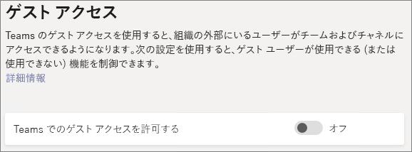
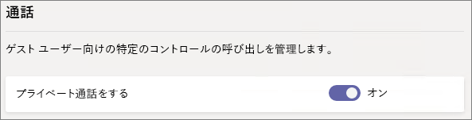
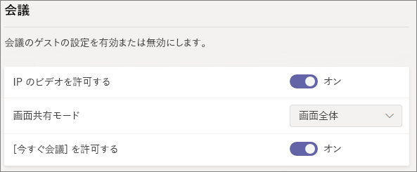
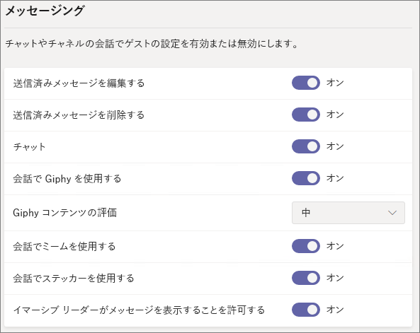
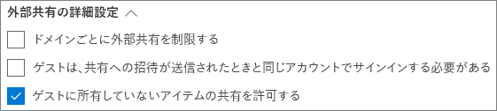
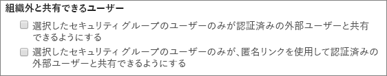

# Microsoft 365 ゲストの共有設定のリファレンスMicrosoft 365 guest sharing settings reference

この記事では、Microsoft 365 のワークロードについて、Teams、Office 365 グループ、SharePoint、OneDrive のゲスト共有に影響を与える可能性のあるさまざまな設定について説明します。This article provides a reference for the various settings that can affect guest sharing for the Microsoft 365 workloads: Teams, Office 365 Groups, SharePoint, and OneDrive. これらの設定は、Azure Active Directory、Microsoft 365、Teams、および SharePoint 管理センターにあります。These settings are located in the Azure Active Directory, Microsoft 365, Teams, and SharePoint admin centers.

## Azure Active DirectoryAzure Active Directory

**管理者ロール:** グローバル管理者**Admin role:** Global administrator

Azure Active Directory は、Microsoft 365 により使用されるディレクトリ サービスです。Azure Active Directory is the directory service used by  Microsoft 365. Azure Active Directory の組織の関係設定は、Teams、Office 365 グループ、SharePoint、OneDrive での共有に直接影響します。The Azure Active Directory Organizational relationships settings directly affect sharing in Teams, Office 365 Groups, SharePoint, and OneDrive.

> [!NOTE]
> これらの設定は、[SharePoint および OneDrive の Azure AD B2B (プレビュー) との統合](https://docs.microsoft.com/sharepoint/sharepoint-azureb2b-integration-preview)が構成された場合にのみ、SharePoint に反映されます。These settings only affect SharePoint when [SharePoint and OneDrive integration with Azure AD B2B (Preview)](https://docs.microsoft.com/sharepoint/sharepoint-azureb2b-integration-preview) has been configured. 次の表では、この設定が構成されていることを前提としています。The table below assumes that this has been configured.

### 組織の関係の設定Organizational relationships settings

**ナビゲーション:** [[Azure Active Directory 管理センター]](https://aad.portal.azure.com) > [Azure Active Directory] > [組織の関係] > [設定]**Navigation:** [Azure Active Directory admin center](https://aad.portal.azure.com) > Azure Active Directory > Organizational relationships > Settings

|**Setting****Setting**|**Default****Default**|**説明****Description**|
|:-----|:-----|:-----|
|ゲスト ユーザーのアクセス許可が制限されているGuest users permissions are limited|はいYes|この設定は、ゲストが実行できるディレクトリ タスクに影響します。This setting affects the directory tasks that a guest can perform.|
|管理者と、ゲストの招待元ロールのユーザーが招待できるAdmins and users in the guest inviter role can invite|はいYes|**[はい]** に設定すると、管理者は、Azure AD と Teams や SharePoint などの Microsoft 365 共有エクスペリエンスを使用してゲストを招待できます。**[いいえ]** に設定するとゲストを招待できません。When set to **Yes**, admins can invite guests via Azure AD and via  Microsoft 365 sharing experiences such as Teams and SharePoint; when set to **No**, they cannot.|
|メンバーが招待できるMembers can invite|はいYes|**[はい]** に設定すると、Azure AD メンバーは Azure AD を使用してゲストを招待できます。**[いいえ]** に設定すると招待できません。When set to **Yes**, Azure AD members can invite guests via Azure AD; when set to **No**, they cannot. **[はい]** に設定すると、Office 365 グループのメンバーは所有者の承認を受けているゲストを招待できます。**[いいえ]** に設定すると、Office 365 グループのメンバーは所有者の承認を受けているゲストを招待できますが、所有者が承認するにはグローバル管理者でなければなりません。When set to **Yes**, Office 365 Group members can invite guests with owner approval; when set to **No**, Office 365 Group members can invite guests with owner approval but owners must be global administrators to approve.   **[メンバーが招待できる]** は、(ゲストではなく) Azure AD のメンバーを参照し、Microsoft 365 のサイトまたはグループ メンバーを参照しない点に注意してください。Note that **Members can invite** refers to members in Azure AD (as opposed to guests) and not to site or group members in  Microsoft 365.   これは、Microsoft 365 セキュリティとプライバシーの **[ユーザーが組織に新しいゲストを追加できるようにする]** 設定と同じです。This is identical to the **Let users add new guests to the organization** setting in Microsoft 365 Security & privacy.|
|ゲストが招待できるGuests can invite|はいYes|**[はい]** に設定すると、ディレクトリ内のゲストは他のゲストを招待して、Azure AD リソースおよび SharePoint と OneDrive のファイルとフォルダーで共同作業を行うことができます。**[いいえ]** に設定するとこれができません。When set to **Yes**, guests in the directory can invite other guests to collaborate on Azure AD resources and on files and folders in SharePoint and OneDrive; when set to **No**, they cannot.   SharePoint 管理センターでは、**[一致する電子メール アドレスを正確に入力して外部ユーザーによるディレクトリ内のユーザー アカウントの検索を許可する]** を有効にする必要があることに注意してください。Note that **Allow external users to find user accounts in the directory by typing in exact email address matches** must be turned on in the SharePoint admin center for guests to share files and folders with other guests.|
|ゲストの電子メール ワンタイム パスコードを有効にする (プレビュー)Enable Email One-Time Passcode for guests (Preview)|いいえNo|**[はい]** に設定すると、MSA、職場または学校のアカウントを持っていないゲストは、[ワンタイム パスコードを使用して Azure AD で認証](https://docs.microsoft.com/azure/active-directory/b2b/one-time-passcode)できます。**[いいえ]** に設定すると、ユーザーは認証を行うために Microsoft アカウントを作成する必要があります。When set to **Yes**, guests without an MSA or a work or school account can [authenticate with Azure AD using a one-time passcode](https://docs.microsoft.com/azure/active-directory/b2b/one-time-passcode); when set to **No**, users will need to create a Microsoft account in order to authenticate. [SharePoint および OneDrive の Azure AD B2B (プレビュー) との統合](https://docs.microsoft.com/sharepoint/sharepoint-azureb2b-integration-preview)を機能させるには、この設定を **[はい]** に設定する必要があります。This setting must be set to **Yes** for [SharePoint and OneDrive integration with Azure AD B2B (Preview)](https://docs.microsoft.com/sharepoint/sharepoint-azureb2b-integration-preview) to work.|
|共同作業における制限事項Collaboration restrictions|招待を任意のドメインに送信することを許可するAllow invitations to be sent to any domain|この設定では、共有するドメインの許可またはブロックのリストを指定できます。This setting allows you to specify a list of allowed or blocked domains for sharing. 許可されたドメインを指定すると、共有の招待をそのドメインにのみ送信できます。When allowed domains are specified, then sharing invitations can only be sent to those domains. 拒否されたドメインを指定すると、共有の招待はそのドメインに送信できません。When denied domains are specified, then sharing invitations cannot be sent to those domains.   この設定は、Teams や SharePoint などの Microsoft 365 共有エクスペリエンスに影響します。This setting affects  Microsoft 365 sharing experiences such as Teams and SharePoint. SharePoint と Teams でドメインのフィルタリングを使用して、より詳細にドメインを許可したりブロックしたりできます。You can allow or block domains at a more granular level by using domain filtering in SharePoint or Teams.|

これらの設定は、ユーザーがディレクトリに招待される方法に影響します。These settings affect how users are invited to the directory. ディレクトリにすでに存在しているゲストとの共有には影響しません。They do not affect sharing with guests who are already in the directory.

## Microsoft 365Microsoft 365

**管理者ロール:** グローバル管理者**Admin role:** Global administrator

Microsoft 365 管理センターには、共有および Office 365 グループ用の組織レベル設定があります。The Microsoft 365 admin center has organization-level settings for sharing and for Office 365 Groups.

### 共有Sharing

**ナビゲーション:** [[Microsoft 365 管理センター]](https://admin.microsoft.com) > [設定] > [セキュリティとプライバシー] > [共有]**Navigation:** [Microsoft 365 admin center](https://admin.microsoft.com) > Settings > Security & privacy > Sharing

|**Setting****Setting**|**Default****Default**|**説明****Description**|
|:-----|:-----|:-----|
|ユーザーが組織に新しいゲストを追加できるようにするLet users add new guests to the organization|オンOn|**[はい]** に設定すると、Azure AD メンバーは Azure AD を使用してゲストを招待できます。**[いいえ]** に設定すると招待できません。When set to **Yes**, Azure AD members can invite guests via Azure AD; when set to **No**, they cannot. **[はい]** に設定すると、Office 365 グループのメンバーは所有者の承認を受けているゲストを招待できます。**[いいえ]** に設定すると、Office 365 グループのメンバーは所有者の承認を受けているゲストを招待できますが、所有者が承認するにはグローバル管理者でなければなりません。When set to **Yes**, Office 365 Group members can invite guests with owner approval; when set to **No**, Office 365 Group members can invite guests with owner approval but owners must be global administrators to approve.   **[メンバーが招待できる]** は、(ゲストではなく) Azure AD のメンバーを参照し、Microsoft 365 のサイトまたは グループ メンバーは参照しません。Note that **Members can invite** refers to members in Azure AD (as opposed to guests) and not to site or gorup members in  Microsoft 365.   これは、Azure Active Directory の組織の関係設定で **[メンバーが招待できる]** 設定と同じです。This is identical to the **Members can invite** setting in Azure Active Directory Organizational relationships settings.|

### Office 365 グループOffice 365 Groups

**ナビゲーション:** [[Microsoft 365 管理センター]](https://admin.microsoft.com) > [設定] > [セキュリティとアドイン] > [Office 365 グループ]**Navigation:** [Microsoft 365 admin center](https://admin.microsoft.com) > Settings > Services & add-ins > Office 365 Groups

|**Setting****Setting**|**Default****Default**|**説明****Description**|
|:-----|:-----|:-----|
|組織の外部のグループ メンバーがグループのコンテンツにアクセスできるようにするLet group members outside your organization access group content|オンOn|**[オン]** に設定すると、ゲストはグループのコンテンツにアクセスできます。**[オフ]** に設定するとアクセスできません。When set to **On**, guests can access groups content; when set to **Off**, they can't. この設定は、ゲスト ユーザーが Office 365 グループまたは Teams と連携している場合に **[オン]** にしてください。This setting should be **On** for any scenario where guest users are interacting with Office 365 Groups or Teams.|
|グループ所有者が組織外のユーザーをグループに追加できるようにするLet group owners add people outside your organization to groups|オンOn|**[オン]** の場合、Office 365 グループ または Teams の所有者は新しいゲストをグループに招待できます。When **On**, Owners of Office 365 Groups or Teams can invite new guests to the group. **[オフ]** の場合、所有者はディレクトリ内にすでに存在しているゲストのみを招待できます。When **Off**, owners can only invite guests who are already in the directory.|

## TeamsTeams

Teams のマスター ゲスト アクセスのスイッチである **[Teams でのゲスト アクセスを許可する]** を **[オン]** にして、他のゲスト設定を選択できるようにする必要があります。The Teams master guest access switch, **Allow guest access in Teams**, must be **On** for the other guest settings to be available.

**管理者ロール:** Teams サービス管理者**Admin role:** Teams service administrator

### ゲスト アクセスGuest access

**ナビゲーション:** [[Teams 管理センター]](https://admin.teams.microsoft.com) > [組織全体の設定] > [ゲスト アクセス]**Navigation:** [Teams admin center](https://admin.teams.microsoft.com) > Org-wide settings > Guest access

|**Setting****Setting**|**Default****Default**|**説明****Description**|
|:-----|:-----|:-----|
|Teams でのゲスト アクセスを許可するAuthorize guest access in Microsoft Teams|オフOff|Teams 全体でゲスト アクセスをオンまたはオフにします。Turns guest access on or off for Teams overall. この設定は、一度変更し反映されるのに 24 時間かかることがあります。This setting can take 24 hours to take effect once changed.|

### ゲスト通話Guest calling

**ナビゲーション:** [[Teams 管理センター]](https://admin.teams.microsoft.com) > [組織全体の設定] > [ゲスト アクセス]**Navigation:** [Teams admin center](https://admin.teams.microsoft.com) > Org-wide settings > Guest access

|**Setting****Setting**|**Default****Default**|**説明****Description**|
|:-----|:-----|:-----|
|プライベート通話をするMake private calls|オンOn|**[オン]** の場合、ゲストは Teams でピアツーピアの通話を行うことができます。**[オフ]** の場合は通話できません。When **On**, guests can make peer-to-peer calls in Teams; when **Off**, they can't.|

### ゲスト会議Guest meeting

**ナビゲーション:** [[Teams 管理センター]](https://admin.teams.microsoft.com) > [組織全体の設定] > [ゲスト アクセス]**Navigation:** [Teams admin center](https://admin.teams.microsoft.com) > Org-wide settings > Guest access

|**Setting****Setting**|**Default****Default**|**説明****Description**|
|:-----|:-----|:-----|
|IP のビデオを許可するAllow IP video|オンOn|**[オン]** の場合、ゲストは通話と会議でビデオを使用できます。**[オフ]** の場合は使用できません。When **On**, guests can use video in their calls and meetings; when **Off**, they can't.|
|画面共有モードScreen sharing mode|画面全体Entire screen|**[無効]** にすると、ゲストは Teams で画面を共有できません。When **Disabled**, guests can't share their screens in Teams. **[1 つのアプリケーション]** に設定すると、ゲストは画面上でアプリケーションを 1 つのみ共有できます。When set to **Single application**, guests can only share a single application on their screen. **[画面全体]** に設定すると、ゲストはアプリケーションまたは画面全体を共有するよう選択できます。When set to **Entire screen**, guests can choose to share an applicaion or their entire screen.|
|[会議の開始] を許可するAllow Meet Now|オンOn|**[オン]** の場合、ゲストは Teams で [会議の開始] 機能を使用できます。**[オフ]** の場合は使用できません。When **On**, guests can use the Meet Now feature in Teams; when **Off**, they can't.|

### ゲスト メッセージングGuest messaging

**ナビゲーション:** [[Teams 管理センター]](https://admin.teams.microsoft.com) > [組織全体の設定] > [ゲスト アクセス]**Navigation:** [Teams admin center](https://admin.teams.microsoft.com) > Org-wide settings > Guest access

|**Setting****Setting**|**Default****Default**|**説明****Description**|
|:-----|:-----|:-----|
|送信済みメッセージを編集するEdit sent messages|オンOn|**[オン]** の場合、ゲストは以前に送信したメッセージを編集できます。**[オフ]** の場合は編集できません。When **On**, guests can edit messages they previously sent; when **Off**, they can't.|
|送信済みメッセージを削除するDelete sent messages|オンOn|**[オン]** の場合、ゲストは以前に送信したメッセージを削除できます。**[オフ]** の場合は削除できません。When **On**, guests can delete messages they previously sent; when **Off**, they can't.|
|チャットChat|オンOn|**[オン]** の場合、ゲストは Teams でチャット機能を使用できます。**[オフ]** の場合は使用できません。When **On**, guests can use chat in Teams; when **Off**, they can't.|
|会話で Giphy を使用するUse Giphys in conversations|オンOn|**[オン]** の場合、ゲストは会話で Giphy を使用できます。**[オフ]** の場合は使用できません。When **On**, guests can use Giphys in conversations; when **Off**, they can't.|
|Giphy コンテンツの評価Giphy content rating|中Moderate|**[すべてのコンテンツを許可]** に設定すると、ゲストはコンテンツ評価に関係なく、すべての Giphy をチャットに挿入できるようになります。When set to **Allow all content**, guests will can insert all Giphys in chats, regardless of the content rating. **[中]** に設定すると、ゲストは Giphy をチャットに挿入できますが、成人向けコンテンツの挿入についてはある程度制限されます。Wnen set to **Moderate** guests can insert Giphys in chats, but will be moderately restricted from adult content. **[高]** に設定すると、ゲストは Giphy をチャットに挿入できますが、成人向けコンテンツの挿入については制限されます。When set to **Strict** guests can insert Giphys in chats, but will be restricted from inserting adult content.|
|会話でミームを使用するUse Memes in conversations|オンOn|**[オン]** の場合、ゲストは会話でミームを使用できます。**[オフ]** の場合は使用できません。When **On**, guests can use memes in conversations; when **Off**, they can't.|
|会話でステッカーを使用するUser stickers in conversations|オンOn|**[オン]** の場合、ゲストは会話でステッカーを使用できます。**[オフ]** の場合は使用できません。When **On**, guests can use stickers in conversations; when **Off**, they can't.|
|イマーシブ リーダーがメッセージを表示するのを許可するAllow immersive reader for viewing messages|オンOn|**[オン]** の場合、ゲストはイマーシブ リーダーでメッセージを表示できます。**[オフ]** の場合は表示できません。When **On**, guests can view messages in Immersive Reader; when **Off**, they can't.|

## SharePoint と OneDrive (組織レベル)SharePoint and OneDrive (organization-level)

**管理者ロール:** SharePoint 管理者**Admin role:** SharePoint administrator

これらの設定は組織のすべてのサイトに影響します。These settings affect all of the sites in the organization. Office 365 グループや Teams には直接影響しませんが、これらの設定を Office 365 グループ と Teams の設定に合わせて、ユーザー エクスペリエンスの問題を回避することをお勧めしますThey do not affect Office 365 Groups or Teams directly, however we recommend that you align these settings with the settings for Office 365 Groups and Teams to avoid user experience issues. (たとえば、ゲスト共有が SharePoint ではなく Teams で許可されている場合、Teams ファイルは SharePoint に保存されているため、Teams のゲストは [ファイル] タブにアクセスできません)。(For example, if guest sharing is allowed in Teams but not SharePoint, then guests in Teams will not have access to the Files tab because Teams files are stored in SharePoint.)

### SharePoint と OneDrive の共有設定SharePoint and OneDrive sharing settings

OneDrive はSharePoint のサイトの階層であるため、組織レベルの共有設定は、他の SharePoint サイトに影響するように OneDrive に直接影響します。Because OneDrive is a hierarchy of sites within SharePoint, the organization-level sharing settings directly affect OneDrive just as they do other SharePoint sites.

**ナビゲーション:** [SharePoint 管理センター] > [共有]**Navigation:** SharePoint admin center > Sharing

|**Setting****Setting**|**Default****Default**|**説明****Description**|
|:-----|:-----|:-----|
|SharePointSharePoint|すべてのユーザーAnyone|SharePoint サイトで許可されている制限が最も少ない共有アクセス許可を指定します。Specifies the most permissive sharing permissions allowed for SharePoint sites.|
|OneDriveOneDrive|すべてのユーザーAnyone|OneDrive サイトで許可されている制限が最も少ない共有アクセス許可を指定します。Specifies the most permissive sharing permissions allowed for OneDrive sites. この設定は SharePoint の設定よりも制限を少なくすることはできません。This setting cannot be more permissive than the SharePoint setting.|

### SharePoint と OneDrive の詳細な共有設定SharePoint and OneDrive advanced sharing settings

**ナビゲーション:** [SharePoint 管理センター] > [共有]**Navigation:** SharePoint admin center > Sharing

|**Setting****Setting**|**Default****Default**|**説明****Description**|
|:-----|:-----|:-----|
|ドメインごとに外部共有を制限するLimit external sharing by domain|オフOff|この設定では、共有するドメインの許可またはブロックのリストを指定できます。This setting allows you to specify a list of allowed or blocked domains for sharing. 許可されたドメインを指定すると、共有の招待をそのドメインにのみ送信できます。When allowed domains are specified, then sharing invitations can only be sent to those domains. 拒否されたドメインを指定すると、共有の招待はそのドメインに送信できません。When denied domains are specified, then sharing invitations cannot be sent to those domains.   この設定は、組織内のすべての SharePoint サイトと OneDrive サイトに影響します。This setting affects all SharePoint and OneDrive sites in the organization.|
|ゲストは共有への招待が送信されたアカウントと同じアカウントを使用してサインインする必要があるGuests must sign in using the same account to which sharing invitations are sent|オフOff|招待の送信先とは別のメールアドレスを使用して、ゲストがサイト共有の招待を交換しないようにします。Prevents guests from redeeming site sharing invitations using a different email address than the invitation was sent to.  [SharePoint および OneDrive の Azure AD B2B (プレビュー) との統合](https://docs.microsoft.com/sharepoint/sharepoint-azureb2b-integration-preview)では、招待の送信先のメールアドレスに基づいてすべてのゲストがディレクトリに追加されるため、この設定は使用されません。[SharePoint and OneDrive integration with Azure AD B2B (Preview)](https://docs.microsoft.com/sharepoint/sharepoint-azureb2b-integration-preview) does not use this setting because all guests are added to the directory based on the email address that the invitation was sent to. 代わりのメールアドレスは、サイトにアクセスする際に使用できません。Alternate email addresses cannot be used to access the site.|
|ゲストに所有していないアイテムの共有を許可するAllow guests to share items they don't own|オンOn|**[オン]** の場合、ゲストは他のユーザーやゲストと自分が所有していないアイテムを共有できます。**[オフ]** の場合は共有できません。When **On**, guests can share items that they don't own with other users or guests; when **Off** they cannot. ゲストは常にフル コントロールのあるアイテムを共有できます。Guests can always share items for which they have full control.|

### SharePoint と OneDrive のファイルとフォルダーのリンク設定SharePoint and OneDrive file and folder link settings

SharePoint と OneDrive でファイルとフォルダーを共有すると、共有の受信者はファイルまたはフォルダーに直接アクセスできるようになるのではなく、ファイルまたはフォルダーへのアクセス許可のリンクが送信されます。When files and folders are shared in SharePoint and OneDrive, sharing recipients are sent a link with permissions to the file or folder rather than being granted direct access to the file or folder themselves. リンクにはいくつかの種類があり、ユーザーがファイルまたはフォルダーを共有するときに表示される既定のリンクの種類を選択できます。Several types of links are available, and you can choose the default link type presented to users when they share a file or folder. また、*すべてのユーザー*のリンクのアクセス許可と有効期限のオプションを設定することもできます。You can also set permissions and expiration options for *Anyone* links.

**ナビゲーション:** [SharePoint 管理センター] > [共有]**Navigation:** SharePoint admin center > Sharing

|**Setting****Setting**|**Default****Default**|**説明****Description**|
|:-----|:-----|:-----|
|ファイルとフォルダーのリンクFile and folder links|リンクを知っているすべてのユーザーAnyone with this link|ユーザーがファイルまたはフォルダーを共有するときに、既定で表示される共有リンクを指定します。Specifies which sharing link is shown by default when a user shares a file or folder. ユーザーは必要に応じて、共有する前にオプションを変更できます。Users can change the option before sharing if they want. 既定値が **[リンクを知っているすべてのユーザー]** に設定されており、*[すべてのユーザー]* の共有が特定のサイトで許可されていない場合は、**組織内のユーザーのみ**がそのサイトの既定値として表示されます。If the default is set to **Anyone with the link** and *Anyone* sharing is not allowed for a given site, then **Only people in your organization** will be shown as the default for that site.|
|これらのリンクは指定された日数以内に有効期限が切れるThese links must expire within this many days|オフ (有効期限なし)Off (no expiration)|*[すべてのユーザー]* のリンクが作成されてから期限切れになるまでの日数を指定します。Specifies the number of days after an *Anyone* link is created that it expires. 期限切れのリンクは更新できません。Expired links cannot be renewed. 期限が切れた後も共有を続ける必要がある場合は、新しいリンクを作成します。Create a new link if you need to continue sharing past the expiration.|
|ファイルのアクセス許可File permissions|表示と編集View and edit slide notes|ユーザーが *[すべてのユーザー]* のリンクを作成するときに使用できるファイルのアクセス許可のレベルを指定します。Specifies the file permission levels available to users when creating an *Anyone* link. **[表示]** が選択されている場合、ユーザーは、表示のアクセス許可のある *[すべてのユーザー]* ファイルのリンクのみを作成できます。If **View** is selected, then users can only create *Anyone* file links with view permissions. **[表示と編集]** が選択されている場合、ユーザーはリンクを作成するときに、[表示] と [表示と編集] のアクセス許可の中から選択できます。If **View, and edit** is selected, then users can choose between view and view and edit permissions when they create the link.|
|フォルダーのアクセス許可Folder permissions|表示、編集、およびアップロードView, edit, and upload|ユーザーが *[すべてのユーザー]* のリンクを作成するときに使用できるフォルダーのアクセス許可のレベルを指定します。Specifies the folder permission levels available to users when creating an *Anyone* link. **[表示]** が選択されている場合、ユーザーは、表示のアクセス許可のある *[すべてのユーザー]* フォルダーのリンクのみを作成できます。If **View** is selected, then users can only create *Anyone* folder links with view permissions. **[表示、編集、およびアップロード]** が選択されている場合、ユーザーはリンクを作成するときに、[表示] と [表示、編集、およびアップロード] のアクセス許可の中から選択できます。If **View, edit, and upload** is selected, then users can choose between view and view, edit, and upload permissions when they creat the link.|

### SharePoint と OneDrive のセキュリティ グループ設定SharePoint and OneDrive security group settings

SharePoint と OneDrive のゲストと共有できるユーザーを制限する場合は、指定したセキュリティ グループ内のユーザーへの共有を制限することで行うことができます。If you want to limit who can share with guests in SharePoint and OneDrive, you can do so by limiting sharing to people in specified security groups. これらの設定は、Office 365 グループまたは Teams による共有には影響しません。These settings do not affect sharing via Office 365 Groups or Teams. グループまたはチーム経由で招待されたゲストも、関連サイトにアクセスできます。ただし、ドキュメントとフォルダーの共有は、指定したセキュリティ グループのユーザーのみが行うことができます。Guests invited via a group or team would also have access to the associated site, though document and folder sharing could only be done by people in the specified security groups.

**ナビゲーション:** [SharePoint 管理センター] > [共有] > [特定のセキュリティ グループへの外部共有を制限]**Navigation:** SharePoint admin center > Sharing > Limit external sharing to specific security groups

|**Setting****Setting**|**Default****Default**|**説明****Description**|
|:-----|:-----|:-----|
|選択したセキュリティ グループのユーザーのみが認証済みの外部ユーザーと共有できるようにするnote the security groups listed for Let only users in selected security groups share with authenticated external users.|オフOff|**[オン]** の場合、指定したセキュリティ グループのユーザーのみが外部ユーザーと共有できます。When **On**, only the people in the specified security groups can share with external users. *[特定のユーザー]* のリンクのみが使用できます。Only *Specific people* links are available. **[選択したセキュリティ グループのユーザーのみが、匿名リンクを使用して認証済みの外部ユーザーと共有できるようにする]** も合わせて **[オン]** になっていない限り、*[すべてのユーザー]* の共有は実質的に無効になります。*Anyone* sharing is effectively disabled unless **Let only users in selected security groups share with authenticated external users and using anonymous links** is also **On**|
|選択したセキュリティ グループのユーザーのみが、匿名リンクを使用して認証済みの外部ユーザーと共有できるようにするnote the security groups listed for Let only users in selected security groups share with authenticated external users and using anonymous links.|オフOff|**[オン]** の場合、指定したセキュリティ グループのユーザーのみがゲストと共有できます。When **On**, only the people in the specified security groups can share with guests. *[すべてのユーザー]* と *[特定のユーザー]* の両方のリンクが使用できます。Both *Anyone* and *Specific people* links are available.|

この両方の設定は同時に使用できます。Both of these settings can be used at the same time. ユーザーが両方の設定で指定されているセキュリティ グループにいる場合、より制限の少ないアクセス許可レベルが優先されます (*[すべてのユーザー]* と *[特定のユーザー]*)。If a user is in security groups specified for both settings, then the greater permission level prevails (*Anyone* plus *Specific user*).

## SharePoint (サイト レベル)SharePoint (site level)

**管理者ロール:** SharePoint 管理者**Admin role:** SharePoint administrator

### サイトの共有Site sharing

SharePoint の各サイトにゲストの共有のアクセス許可を設定できます。You can set guest sharing permissions for each site in SharePoint. この設定は、サイトの共有と、ファイルとフォルダーの共有の両方に適用されますThis setting applies to both site sharing and file and folder sharing. (*[すべてのユーザー]* の共有はサイトの共有には利用できません)。(*Anyone* sharing is not available for site sharing. **[すべてのユーザー]** を選択した場合、ユーザーは *[すべてのユーザー]* のリンクを使用してファイルとフォルダーを、新規および既存のゲストとはサイト自体を共有できます)。If you choose **Anyone**, users will be able to share files and folders by using *Anyone* links, and the site itself with new and existing guests.)

**ナビゲーション:** [SharePoint 管理センター] > [アクティブなサイト] > [サイトを選択] > [共有]**Navigation:** SharePoint admin center > Active sites > select the site > Sharing

|**Setting****Setting**|**Default****Default**|**説明****Description**|
|:-----|:-----|:-----|
|サイトのコンテンツの共有先Site content can be shared with|サイトの種類によって異なります (次の表を参照してください)Varies by site type (see the table below)|このサイトに許可されている外部共有の種類を示します。Indicates the type of external sharing allowed for this site. ここで使用できるオプションは、SharePoint における組織レベルの共有設定の対象です。Options available here are subject to the organization-level sharing settings for SharePoint.|

これらの設定は SharePoint における組織全体の設定の対象になるため、組織レベルの設定が変更された場合は、サイトで有効な共有設定が変更される可能性があります。Because these settings are subject to the organization-wide settings for SharePoint, the effective sharing setting for the site may change if the organization-level setting changes. ここで設定を選択し、組織レベルがより制限の多い値に設定された場合、このサイトはその制限の多い値で動作します。If you choose a setting here and the organization-level is later set to a more restrictive value, then this site will operate at that more restrictive value. たとえば、**[すべてのユーザー]** を選択した後に、組織レベルの設定を **[新規および既存のゲスト]** に設定した場合、このサイトでは新規および既存のゲストのみが許可されます。For example, if you choose **Anyone** and the organization-level setting is later set to **New and existing guests**, then this site will only allow new and existing guests. 組織レベルの設定を **[すべてのユーザー]** に戻すと、このサイトでは *[すべてのユーザー]* のリンクが再度許可されます。If the organization-level setting is then set back to **Anyone**, this site would again allow *Anyone* links.

次の表は、各サイトの種類の既定の共有設定を示しています。The table below shows the default sharing setting for each site type.

|**サイトの種類****Site Type**|**既定の共有設定****Default sharing setting**|
|:-----|:-----|
|クラシックClassic|**組織内のユーザーのみ****Only people in your organization**|
|OneDriveOneDrive|**すべてのユーザー****Anyone**|
|グループに接続されたサイト (チームを含む)Group-connected sites (including Teams)|Office 365 グループの設定の、**[グループ所有者が組織外のユーザーをグループに追加できるようにする]** が **[オン]** の場合、**[新規および既存のゲスト]** になり、オフの場合は **[既存のゲストのみ]** になります。**New and existing guests** if the Office 365 Groups setting **Let group owners add people outside the organization to groups** is **On**; otherwise **Existing guests only**|
|通信Communication sites|**組織内のユーザーのみ****Only people in your organization**|
|グループのないモダン サイト (#STS3 TeamSite)Modern sites with no group (#STS3 TeamSite)|**組織内のユーザーのみ****Only people in your organization**|

## 関連項目See also

[SharePoint と OneDrive の外部共有の概要SharePoint and OneDrive external sharing overview](https://docs.microsoft.com/sharepoint/external-sharing-overview)

[Microsoft Teams でのゲスト アクセスGuest access in Microsoft Teams](https://docs.microsoft.com/MicrosoftTeams/guest-access)

[Office 365 グループへのゲストの追加Adding guests to Office 365 Groups](https://support.office.com/article/bfc7a840-868f-4fd6-a390-f347bf51aff6)
