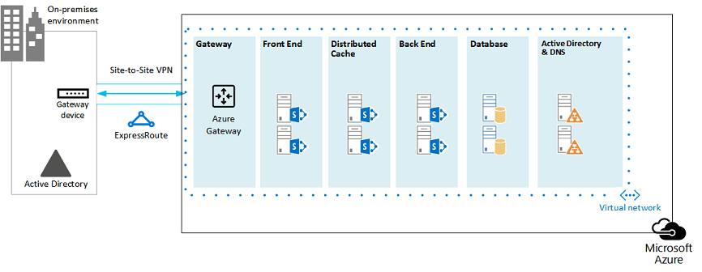

# SharePoint 2013 用の Microsoft Azure アーキテクチャMicrosoft Azure Architectures for SharePoint 2013

Azure は SharePoint Server 2013 ソリューションをホストするための優れた環境です。Azure is a good environment for hosting a SharePoint Server 2013 solution. ほとんどの場合、Microsoft 365 をお勧めしますが、Azure でホストされている SharePoint Server ファームは特定のソリューションに適したオプションになります。In most cases, we recommend Microsoft 365, but a SharePoint Server farm hosted in Azure can be a good option for specific solutions. この記事では、SharePoint ソリューションが Azure プラットフォームに適合するように設計する方法について説明します。This article describes how to architect SharePoint solutions so they are a good fit in the Azure platform. 次の 2 つのソリューションが例として使用されています。The following two specific solutions are used as examples:
  
- [Microsoft Azure での SharePoint Server 2013 の障害復旧SharePoint Server 2013 Disaster Recovery in Microsoft Azure](sharepoint-server-2013-disaster-recovery-in-microsoft-azure.md)
    
- [SharePoint Server 2013 を使用した Microsoft Azure のインターネット サイトInternet Sites in Microsoft Azure using SharePoint Server 2013](internet-sites-in-microsoft-azure-using-sharepoint-server-2013.md)
    
## 推奨されている Azure インフラストラクチャ サービスの SharePoint ソリューションRecommended SharePoint solutions for Azure Infrastructure Services

Azure infrastructure services is a compelling option for hosting SharePoint solutions.Azure infrastructure services is a compelling option for hosting SharePoint solutions. Some solutions are a better fit for this platform than others.Some solutions are a better fit for this platform than others. The following table shows recommended solutions.The following table shows recommended solutions.
  
|**解決方法****Solution**|**Azure でそのソリューションが推奨されている理由****Why this solution is recommended for Azure**|
|:-----|:-----|
|開発環境とテスト環境Development and test environments    |これらの環境を簡単に作成して管理できます。It's easy to create and manage these environments.    |
|Azure に対するオンプレミス SharePoint ファームの障害復旧Disaster recovery of on-premises SharePoint farms to Azure    |**ホストされているセカンダリ データセンター** 別の地域にあるセカンダリ データセンターに投資するのではなく、Azure を使用します。**Hosted secondary datacenter** Use Azure instead of investing in a secondary datacenter in a different region.   **Lower-cost disaster-recovery environments** Maintain and pay for fewer resources than an on-premises disaster recovery environment.**Lower-cost disaster-recovery environments** Maintain and pay for fewer resources than an on-premises disaster recovery environment. The number of resources depends on the disaster recovery environment you choose: cold standby, warm standby, or hot standby.The number of resources depends on the disaster recovery environment you choose: cold standby, warm standby, or hot standby.   **More elastic platform** In the event of a disaster, easily scale-out your recovery SharePoint farm to meet load requirements.**More elastic platform** In the event of a disaster, easily scale-out your recovery SharePoint farm to meet load requirements. Scale in when you no longer need the resources.Scale in when you no longer need the resources.   「[Microsoft Azure での SharePoint Server 2013 の障害復旧](sharepoint-server-2013-disaster-recovery-in-microsoft-azure.md)」をご覧ください。See [SharePoint Server 2013 Disaster Recovery in Microsoft Azure](sharepoint-server-2013-disaster-recovery-in-microsoft-azure.md).    |
|Microsoft 365 で利用できない機能とスケールを使用する、インターネットに接続されたサイトInternet-facing sites that use features and scale not available in Microsoft 365    |**作業の重点** インフラストラクチャの構築ではなく、魅力的なサイトの構築のほうに集中できます。**Focus your efforts** Concentrate on building a great site rather than building infrastructure.   **Take advantage of elasticity in Azure** Size the farm for the demand by adding new servers, and pay only for resources you need.**Take advantage of elasticity in Azure** Size the farm for the demand by adding new servers, and pay only for resources you need. Dynamic machine allocation is not supported (auto scale).Dynamic machine allocation is not supported (auto scale).   **Azure Active Directory (AD) の使用** ユーザー アカウントに関して Azure AD を活用します。**Use Azure Active Directory (AD)** Take advantage of Azure AD for customer accounts.   **Microsoft 365 で利用できない SharePoint 機能の追加**詳細なレポートおよび web 分析を追加します。**Add SharePoint functionality not available in Microsoft 365** Add deep reporting and web analytics.   「[SharePoint Server 2013 を使用した Microsoft Azure のインターネット サイト](internet-sites-in-microsoft-azure-using-sharepoint-server-2013.md)」をご覧ください。See [Internet Sites in Microsoft Azure using SharePoint Server 2013](internet-sites-in-microsoft-azure-using-sharepoint-server-2013.md).    |
|Microsoft 365 またはオンプレミス環境をサポートするためのアプリファームApp farms to support Microsoft 365 or on-premises environments    |**アプリのビルド、テスト、ホスト** Azure で、オンプレミス環境とクラウド環境の両方をサポートできます。**Build, test, and host apps** in Azure to support both on-premises and cloud environments.   **このロールのホスト** オンプレミス環境用の新しいハードウェアを購入する代わりに、Azure で行います。**Host this role** in Azure instead of buying new hardware for on-premises environments.   |
   
イントラネットとコラボレーションのソリューション、およびワークロードに関しては、以下の選択肢を考慮してください。For intranet and collaboration solutions and workloads, consider the following options:
  
- Microsoft 365 がビジネス要件を満たしているかどうか、またはソリューションの一部であるかどうかを判断します。Determine if Microsoft 365 meets your business requirements or can be part of the solution. Microsoft 365 には、常に最新の豊富な機能セットが用意されています。Microsoft 365 provides a rich feature set that is always up to date.
    
- Microsoft 365 がお客様のすべてのビジネス要件を満たしていない場合は、Microsoft コンサルティングサービス (MCS) からの SharePoint 2013 の標準実装を検討してください。If Microsoft 365 does not meet all your business requirements, consider a standard implementation of SharePoint 2013 on premises from Microsoft Consulting Services (MCS). 標準のアーキテクチャは、カスタマイズされたアーキテクチャよりもソリューションの実装が迅速かつ安価で、なおかつ簡単です。A standard architecture can be a quicker, cheaper, and easier solution for you to support than a customized one. 
    
- 標準実装がビジネス要件を満たさない場合には、カスタマイズされたオンプレミスのソリューションを考慮します。If a standard implementation doesn't meet your business requirements, consider a customized on-premises solution.
    
- If using a cloud platform is important for your business requirements, consider a standard or customized implementation of SharePoint 2013 hosted in Azure infrastructure services.If using a cloud platform is important for your business requirements, consider a standard or customized implementation of SharePoint 2013 hosted in Azure infrastructure services. SharePoint solutions are much easier to support in Azure than other non-native Microsoft public cloud platforms.SharePoint solutions are much easier to support in Azure than other non-native Microsoft public cloud platforms.
    
## Azure 環境を設計する前にBefore you design the Azure environment

While this article uses example SharePoint topologies, you can use these design concepts with any SharePoint farm topology.While this article uses example SharePoint topologies, you can use these design concepts with any SharePoint farm topology. Before you design the Azure environment, use the following topology, architecture, capacity, and performance guidance to design the SharePoint farm:Before you design the Azure environment, use the following topology, architecture, capacity, and performance guidance to design the SharePoint farm:
  
- [SharePoint 2013 の IT 担当者向けアーキテクチャ設計Architecture design for SharePoint 2013 IT pros](https://technet.microsoft.com/sharepoint/fp123594.aspx)
    
- [Plan for performance and capacity management in SharePoint Server 2013Plan for performance and capacity management in SharePoint Server 2013](https://technet.microsoft.com/library/8dd52916-f77d-4444-b593-1f7d6f330e5f.aspx)
    
## Active Directory ドメインの種類の決定Determine the Active Directory domain type

Each SharePoint Server farm relies on Active Directory to provide administrative accounts for farm setup.Each SharePoint Server farm relies on Active Directory to provide administrative accounts for farm setup. At this time, there are two options for SharePoint solutions in Azure.At this time, there are two options for SharePoint solutions in Azure. These are described in the following table.These are described in the following table.
  
|**オプション****Option**|**説明****Description**|
|:-----|:-----|
|専用ドメインDedicated domain    |You can deploy a dedicated and isolated Active Directory domain to Azure to support your SharePoint farm.You can deploy a dedicated and isolated Active Directory domain to Azure to support your SharePoint farm. This is a good choice for public-facing Internet sites.This is a good choice for public-facing Internet sites.    |
|クロスプレミス接続を使用したオンプレミス ドメインの拡張Extend the on-premises domain through a cross-premises connection    |When you extend the on-premises domain through a cross-premises connection, users access the SharePoint farm via your intranet as if it were hosted on-premises.When you extend the on-premises domain through a cross-premises connection, users access the SharePoint farm via your intranet as if it were hosted on-premises. You can take advantage of your on-premises Active Directory and DNS implementation.You can take advantage of your on-premises Active Directory and DNS implementation.    オンプレミスのファームとの間でフェールオーバーするために Azure で障害復旧環境を構築するには、クロスプレミス接続が必要になります。A cross-premises connection is required for building a disaster-recovery environment in Azure to fail over to from your on-premises farm.    |
   
This article includes design concepts for extending the on-premises domain through a cross-premises connection.This article includes design concepts for extending the on-premises domain through a cross-premises connection. If your solution uses a dedicated domain, you don't need a cross-premises connection.If your solution uses a dedicated domain, you don't need a cross-premises connection.
  
## 仮想ネットワークの設計Design the virtual network

First you need a virtual network in Azure, which includes subnets on which you will place your virtual machines.First you need a virtual network in Azure, which includes subnets on which you will place your virtual machines. The virtual network needs a private IP address space, portions of which you assign to the subnets.The virtual network needs a private IP address space, portions of which you assign to the subnets.
  
クロスプレミス接続を使用して Azure にオンプレミス ネットワークを拡張する場合は (このことは障害回復環境で必要となります)、オンプレミス環境と他の Azure 仮想ネットワークを含む組織ネットワークの他のどの場所にも使用されていないプライベート アドレス空間を選択する必要があります。If you are extending your on-premises network to Azure through a cross-premises connection (required for a disaster recovery environment), you must choose a private address space that is not already in use elsewhere in your organization network, which can include your on-premises environment and other Azure virtual networks. 
  
**図 1:Azure での仮想ネットワークを使用したオンプレミス環境****Figure 1: On-premises environment with a virtual network in Azure**

  
この図では次のようになっています。In this diagram:
  
- A virtual network in Azure is illustrated side-by-side to the on-premises environment.A virtual network in Azure is illustrated side-by-side to the on-premises environment. The two environments are not yet connected by a cross-premises connection, which can be a site-to-site VPN connection or ExpressRoute.The two environments are not yet connected by a cross-premises connection, which can be a site-to-site VPN connection or ExpressRoute.
    
- At this point, the virtual network just includes the subnets and no other architectural elements.At this point, the virtual network just includes the subnets and no other architectural elements. One subnet will host the Azure gateway and other subnets host the tiers of the SharePoint farm, with an additional one for Active Directory and DNS.One subnet will host the Azure gateway and other subnets host the tiers of the SharePoint farm, with an additional one for Active Directory and DNS.
    
## クロスプレミス接続の追加Add cross-premises connectivity

The next deployment step is to create the cross-premises connection (if this applies to your solution).The next deployment step is to create the cross-premises connection (if this applies to your solution). For cross-premises connections, a Azure gateway resides in a separate gateway subnet, which you must create and assign an address space.For cross-premises connections, a Azure gateway resides in a separate gateway subnet, which you must create and assign an address space. 
  
クロスプレミス接続を計画する場合は、Azure ゲートウェイと、オンプレミス ゲートウェイ デバイスへの接続を定義して作成します。When you plan for a cross-premises connection, you define and create an Azure gateway and connection to an on-premises gateway device.
  
**図 2:オンプレミス環境と Azure 間でサイト間接続を提供するための Azure ゲートウェイとオンプレミス ゲートウェイ デバイスの使用****Figure 2: Using an Azure gateway and an on-premises gateway device to provide site-to-site connectivity between the on-premises environment and Azure**

  
この図では次のようになっています。In this diagram:
  
- 前述の図に加えられた点として、オンプレミス環境がクロスプレミス接続 (サイト間 VPN 接続または ExpressRoute である場合もあります) を介して Azure 仮想ネットワークに接続されています。Adding to the previous diagram, the on-premises environment is connected to the Azure virtual network by a cross-premise connection, which can be a site-to-site VPN connection or ExpressRoute.
    
- Azure ゲートウェイはゲートウェイ サブネット上に配置します。An Azure gateway is on a gateway subnet.
    
- オンプレミス環境には、ルーターまたは VPN サーバーなどのゲートウェイ デバイスが含まれます。The on-premises environment includes a gateway device, such as a router or VPN server.
    
クロスプレミス仮想ネットワークの計画と作成に関する詳細については、「[オンプレミス ネットワークを Microsoft Azure 仮想ネットワークに接続する](connect-an-on-premises-network-to-a-microsoft-azure-virtual-network.md)」をご参照ください。For additional information to plan for and create a cross-premises virtual network, see [Connect an on-premises network to a Microsoft Azure virtual network](connect-an-on-premises-network-to-a-microsoft-azure-virtual-network.md).
  
## Active Directory ドメインサービス (AD DS) と DNS を追加するAdd Active Directory Domain Services (AD DS) and DNS

Azure における障害復旧の場合、Windows Server AD と DNS をハイブリッド シナリオで展開します。このとき、Windows Server AD は、オンプレミスと Azure 仮想マシンの両方に展開されます。For disaster recovery in Azure, you deploy Windows Server AD and DNS in a hybrid scenario where Windows Server AD is deployed both on-premises and on Azure virtual machines.
  
**図 3: Active Directory ドメインのハイブリッド構成****Figure 3: Hybrid Active Directory domain configuration**

  
This diagram builds on the previous diagrams by adding two virtual machines to a Windows Server AD and DNS subnet.This diagram builds on the previous diagrams by adding two virtual machines to a Windows Server AD and DNS subnet. These virtual machines are replica domain controllers and DNS servers.These virtual machines are replica domain controllers and DNS servers. They are an extension of the on-premises Windows Server AD environment.They are an extension of the on-premises Windows Server AD environment. 
  
The following table provides configuration recommendations for these virtual machines in Azure.The following table provides configuration recommendations for these virtual machines in Azure. Use these as a starting point for designing your own environment—even for a dedicated domain where your Azure environment doesn't communicate with your on-premises environment.Use these as a starting point for designing your own environment—even for a dedicated domain where your Azure environment doesn't communicate with your on-premises environment.
  
|**アイテム****Item**|**構成****Configuration**|
|:-----|:-----|
|Azure での仮想マシンのサイズVirtual machine size in Azure    |標準層の A1 または A2 サイズA1 or A2 size in the Standard tier    |
|オペレーティング システムOperating system    |Windows Server 2012 R2Windows Server 2012 R2    |
|Active Directory ロールActive Directory role    |AD DS domain controller designated as a global catalog server.AD DS domain controller designated as a global catalog server. This configuration reduces egress traffic across the cross-premises connection.This configuration reduces egress traffic across the cross-premises connection.    変更率の高いマルチドメイン環境の場合 (一般的ではありません)、オンプレミスのドメイン コントローラーが、Azure 内のグローバル カタログ サーバーと同期しないように構成して、レプリケーション トラフィックを削減します。In a multidomain environment with high rates of change (this is not common), configure domain controllers on premises not to sync with the global catalog servers in Azure, to reduce replication traffic.    |
|DNS ロールDNS role    |ドメイン コントローラーで DNS サーバー サービスをインストールして構成します。Install and configure the DNS Server service on the domain controllers.    |
|データ ディスクData disks    |Place the Active Directory database, logs, and SYSVOL on additional Azure data disks.Place the Active Directory database, logs, and SYSVOL on additional Azure data disks. Do not place these on the operating system disk or the temporary disks provided by Azure.Do not place these on the operating system disk or the temporary disks provided by Azure.    |
|IP アドレスIP addresses    |静的 IP アドレスを使用して仮想ネットワークを構成し、ドメイン コントローラーの構成後にこれらのアドレスを仮想ネットワーク内の仮想マシンに割り当てます。Use static IP addresses and configure the virtual network to assign these addresses to the virtual machines in the virtual network after the domain controllers have been configured.    |
   
> [!IMPORTANT]
> Before you deploy Active Directory in Azure, read [Guidelines for Deploying Windows Server Active Directory on Azure Virtual Machines](https://go.microsoft.com/fwlink/p/?linkid=392681).Before you deploy Active Directory in Azure, read [Guidelines for Deploying Windows Server Active Directory on Azure Virtual Machines](https://go.microsoft.com/fwlink/p/?linkid=392681). These help you determine if a different architecture or different configuration settings are needed for your solution.These help you determine if a different architecture or different configuration settings are needed for your solution. 
  
## SharePoint ファームの追加Add the SharePoint farm

該当するサブネット上の層に SharePoint ファームの仮想マシンを配置します。Place the virtual machines of the SharePoint farm in tiers on the appropriate subnets.
  
**図 4: SharePoint 仮想マシンの配置****Figure 4: Placement of SharePoint virtual machines**

  
この図は前の図に基づいて作成されていて、それぞれの層で SharePoint ファーム サーバー ロールが追加されています。This diagram builds on the previous diagrams by adding the SharePoint farm server roles in their respective tiers.
  
- SQL Server を実行する 2 つのデータベース仮想マシンによってデータベース層が作成されます。Two database virtual machines running SQL Server create the database tier.
    
- それぞれのロール (フロント エンド サーバー、分散キャッシュ サーバー、バック エンド サーバー) ごとに、SharePoint Server 2013 を実行する 2 つの仮想マシンが含まれています。Two virtual machines running SharePoint Server 2013 for each of the following tiers: front end servers, distributed cache servers, and back end servers.
    
## 可用性セットと障害ドメイン用のサーバー ロールの設計と調整Design and fine tune server roles for availability sets and fault domains

A fault domain is a grouping of hardware in which role instances run.A fault domain is a grouping of hardware in which role instances run. Virtual machines within the same fault domain can be updated by the Azure infrastructure at the same time.Virtual machines within the same fault domain can be updated by the Azure infrastructure at the same time. Or, they can fail at the same time because they share the same rack.Or, they can fail at the same time because they share the same rack. To avoid the risk of having two virtual machines on the same fault domain, you can configure your virtual machines as an availability set, which ensures that each virtual machine is in a different fault domain.To avoid the risk of having two virtual machines on the same fault domain, you can configure your virtual machines as an availability set, which ensures that each virtual machine is in a different fault domain. If three virtual machines are configured as an availability set, Azure guarantees that no more than two of the virtual machines are located in the same fault domain.If three virtual machines are configured as an availability set, Azure guarantees that no more than two of the virtual machines are located in the same fault domain.
  
When you design the Azure architecture for a SharePoint farm, configure identical server roles to be part of an availability set.When you design the Azure architecture for a SharePoint farm, configure identical server roles to be part of an availability set. This ensures that your virtual machines are spread across multiple fault domains.This ensures that your virtual machines are spread across multiple fault domains.
  
**図 5: SharePoint ファーム層の高可用性を確保するための Azure 可用性セットの使用****Figure 5: Use Azure Availability Sets to provide high availability for the SharePoint farm tiers**

  
This diagram calls out the configuration of availability sets within the Azure infrastructure.This diagram calls out the configuration of availability sets within the Azure infrastructure. Each of the following roles share a separate availability set:Each of the following roles share a separate availability set:
  
- Active Directory と DNSActive Directory and DNS
    
- データベースDatabase
    
- バック エンドBack end
    
- 分散キャッシュDistribute cache
    
- フロント エンドFront end
    
The SharePoint farm might need to be fine tuned in the Azure platform.The SharePoint farm might need to be fine tuned in the Azure platform. To ensure high availability of all components, ensure that the server roles are all configured identically.To ensure high availability of all components, ensure that the server roles are all configured identically.
  
Here is an example that shows a standard Internet Sites architecture that meets specific capacity and performance goals.Here is an example that shows a standard Internet Sites architecture that meets specific capacity and performance goals. This example is featured in the following architecture model: [Internet Sites Search Architectures for SharePoint Server 2013](https://go.microsoft.com/fwlink/p/?LinkId=261519).This example is featured in the following architecture model: [Internet Sites Search Architectures for SharePoint Server 2013](https://go.microsoft.com/fwlink/p/?LinkId=261519).
  
**図 6: 3 層ファームにおけるキャパシティとパフォーマンスの目標に関する計画例****Figure 6: Planning example for capacity and performance goals in a three-tier farm**

  
この図では次のようになっています。In this diagram:
  
- 3 層ファームは、Web サーバー、アプリケーション サーバー、データベース サーバーで表されます。A three-tier farm is represented: web servers, application servers, and database servers.
    
- 3 つの Web サーバーは複数のコンポーネントを含んでおり、同一に構成されています。The three web servers are configured identically with multiple components.
    
- 2 つのデータベース サーバーは同一に構成されています。The two database servers are configured identically.
    
- The three application servers are not configured identically.The three application servers are not configured identically. These server roles require fine tuning for availability sets in Azure.These server roles require fine tuning for availability sets in Azure.
    
アプリケーション サーバー層について詳しく見てみましょう。Let's look closer at the application server tier.
  
**図 7: 調整前のアプリケーション サーバー層****Figure 7: Application server tier before fine tuning**

  
この図では次のようになっています。In this diagram:
  
- 3 つのサーバーがアプリケーション層に含まれています。Three servers are included in the application tier.
    
- 最初のサーバーには 4 つのコンポーネントが含まれています。The first server includes four components.
    
- 2　番目のサーバーには、3 つのコンポーネントが含まれています。The second server includes three components.
    
- 3 番目のサーバーには、2 つのコンポーネントが含まれています。The third server includes two components.
    
You determine the number of components by the performance and capacity targets for the farm.You determine the number of components by the performance and capacity targets for the farm. To adapt this architecture for Azure, we'll replicate the four components across all three servers.To adapt this architecture for Azure, we'll replicate the four components across all three servers. This increases the number of components beyond what is necessary for performance and capacity.This increases the number of components beyond what is necessary for performance and capacity. The tradeoff is that this design ensures high availability of all four components in the Azure platform when these three virtual machines are assigned to an availability set.The tradeoff is that this design ensures high availability of all four components in the Azure platform when these three virtual machines are assigned to an availability set.
  
**図 8: 調整後のアプリケーション サーバー層****Figure 8: Application server tier after fine tuning**

  
この図は、同じ 4 つのコンポーネントを含み、同一に構成されている 3 つのアプリケーション サーバーすべてを示しています。This diagram shows all three application servers configured identically with the same four components.
  
SharePoint ファームの各層に可用性セットを追加すると、実装作業が完了します。When we add availability sets to the tiers of the SharePoint farm, the implementation is complete.
  
**図 9:Azure インフラストラクチャ サービスに実装された SharePoint ファーム****Figure 9: The completed SharePoint farm in Azure infrastructure services**

  
この図は、Azure インフラストラクチャ サービスに実装された、各層内のサーバー用の障害ドメインを提供する可用性セットを備えた SharePoint ファームを示しています。This diagram shows the SharePoint farm implemented in Azure infrastructure services, with availability sets to provide fault domains for the servers in each tier.
  
## 関連項目See Also

[クラウド導入およびハイブリッド ソリューションCloud adoption and hybrid solutions](cloud-adoption-and-hybrid-solutions.yml)
  
[SharePoint Server 2013 を使用した Microsoft Azure のインターネット サイトInternet Sites in Microsoft Azure using SharePoint Server 2013](internet-sites-in-microsoft-azure-using-sharepoint-server-2013.md)
  
[Microsoft Azure での SharePoint Server 2013 の障害復旧SharePoint Server 2013 Disaster Recovery in Microsoft Azure](sharepoint-server-2013-disaster-recovery-in-microsoft-azure.md)

