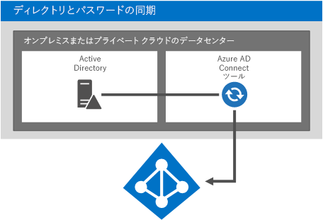
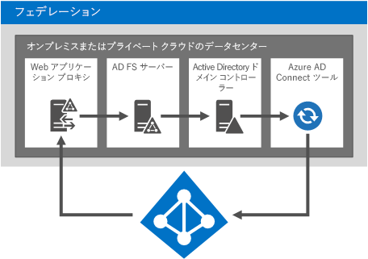
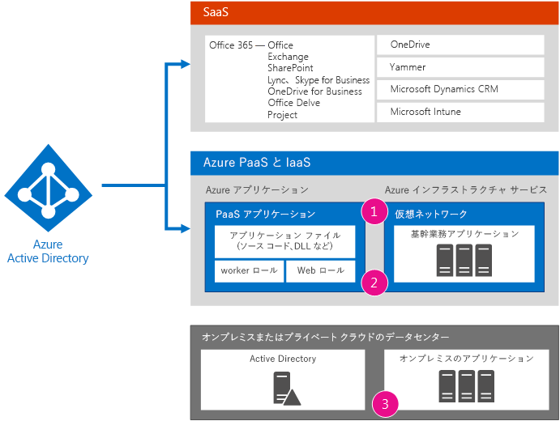
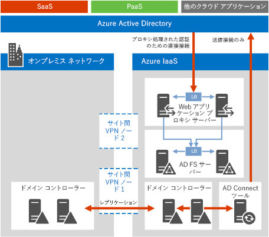
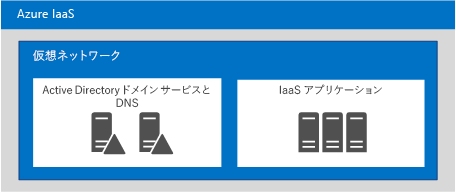

# エンタープライズ アーキテクトのための Microsoft クラウド ID

 **概要:** Microsoft クラウド サービスとプラットフォームの ID ソリューションを設計します。
  
この記事では、Microsoft クラウド サービスとプラットフォームを使用して、組織の ID を設計する上で IT アーキテクトが知る必要のある事柄を説明します。この記事を 5 ページのポスターとして表示し、タブロイド形式 (レジャー、11 x 17、または A3 とも表される) で印刷することもできます。
  

  
[PDF](https://go.microsoft.com/fwlink/p/?LinkId=524586) | [Visio](https://download.microsoft.com/download/2/3/8/238228E6-9017-4F6C-BD3C-5559E6708F82/MSFT_cloud_architecture_identity.vsd) | [その他の言語](https://www.microsoft.com/download/details.aspx?id=54431)
  
すべてのモデルを [Microsoft クラウド IT アーキテクチャのリソース](microsoft-cloud-it-architecture-resources.md)で見ることも、「[Microsoft の Enterprise Cloud ロードマップ: IT の意思決定者向けのリソース](https://aka.ms/cloudarchitecture)」でスワイプして見ることもできます。
  
> [!NOTE]
> この記事は「**エンタープライズ アーキテクトのための Microsoft クラウド ID**」ポスター (2016 年 1 月版) を反映しています。ポスターの 2016 年 4 月以降の版の変更点は含まれていません。
  
## Microsoft クラウドの ID を設計する

ID を Microsoft クラウドと統合すると、広範なサービスとクラウド プラットフォームのオプションにアクセスできるようになります。主に 2 つのオプションがあります。
  
- Microsoft Azure Active Directory (AD) と統合できます。これには、オンプレミスのアカウントを、Microsoft クラウドの ID プロバイダーである Azure AD に同期することが含まれます。
    
- オンプレミスの Active Directory ドメイン サービス (AD DS) 環境を、Microsoft Azure インフラストラクチャ サービスで実行されている仮想マシンに拡張できます。
    

  
 **図 1:クラウドの ID の設計のオプション**
  
図 1 は、Azure AD が Microsoft のサービスとしてのソフトウェア (SaaS) サービスと Azure のサービスとしてのプラットフォーム (PaaS) アプリケーションの ID プロバイダーであることと、どのようにして基幹業務アプリケーションがオンプレミスの AD DS を使用するのかを示しています。 
  
### Azure Active Directory

Microsoft Azure AD は、Microsoft クラウドでホストされる、ID およびアクセス管理サービスです。これは、Microsoft クラウド サービスとプラットフォームの中心にあります。Azure AD と統合すると、現在のアカウントとパスワードのセットを使用して、すべての Microsoft SaaS サービスにアクセスできるようになります。その統合により、Azure PaaS アプリケーションのクラウドベースの ID も提供されます。 
  
> [!NOTE]
> Azure AD を統合するからといって、大企業や、Azure のサービスとしてのインフラストラクチャ (IaaS) で実行されている Windows ベースの仮想マシンのためのオンプレミスの AD DS が必要なくなるわけではありません。 
  
Azure AD には 3 つのエディションがあります。それは、無料、基本、プレミアムです。 
  
||||
|:-----|:-----|:-----|
|**無料**   |**基本**   |**プレミアム**   |
| 	ユーザー アカウントの管理    オンプレミスのディレクトリと同期する    Azure、Office 365、何千もの他の人気のある SaaS アプリケーション (Salesforce、Workday、Concur、DocuSign、Google アプリ、Box、ServiceNow、Dropbox など) 間でのシングル サインオン   | 無料エディションのすべての機能に加え、以下が含まれます。    会社のブランド化    グループベースのアプリケーションへのアクセス    セルフサービスによるパスワードのリセット    99.9% のエンタープライズ SLA    | 無料と基本エディションのすべての機能に加え、以下が含まれます。    セルフサービスによるグループの管理    	高度なセキュリティ レポートと警告    	多要素認証    オンプレミス AD DS へのライトバックによるパスワードのリセット    Azure AD Connect ツールの双方向同期    Azure AD アプリケーション プロキシ    	Microsoft Forefront Identity Manager (MIM)   |
   
バージョンについて詳しくは、「[Azure Active Directory のエディション](https://go.microsoft.com/fwlink/p/?LinkId=524280)」をご覧ください。
  
### オプション 1:Azure Active Directory と統合する

ほとんどの組織では、標準的なオブジェクトのセットと Azure AD テナントの属性を同期します。Azure AD Connect ツールは、オンプレミス AD DS と Azure AD テナント間でアカウントを同期します。
  

  
 **図 2:Azure AD と統合する**
  
図 2 は、Azure AD Connect ツールが AD DS の変更を取得し、Azure AD テナントに送信する方法を示します。この場合、Azure AD テナントは、重要なオンプレミス ディレクトリ コンテンツの、クラウドでホストされたコピーです。
  
多くの組織は、オンプレミスの ID プロバイダーとして AD DS を使用しています。異なる種類のオンプレミスの ID プロバイダー (LDAP を使用する ID プロバイダーなど) を使用し、それらを Azure AD に同期できます。
  
### オプション 2: Azure に AD DS を拡張する

Azure インフラストラクチャ サービスで実行されている仮想マシンに AD DS を拡張すると、Azure AD との同期とは異なるソリューションとアプリケーションのセットがサポートされます。2 つを以下に示します。
  
- NTLM や Kerberos 認証を必要とするクラウドベースのソリューションや、AD DS ドメインに参加している仮想マシンをサポートします。
    
- Microsoft クラウド サービスとプラットフォーム間でのクラウド サービスとアプリケーションの他の統合の可能性を追加します。
    

  
 **図 3:Azure に AD DS を拡張する**
  
図 3 は、オンプレミスの VPN デバイスや Azure VPN ゲートウェイを通じて Azure 仮想ネットワークに接続している AD DS ドメイン コントローラーを示しています。Azure 仮想ネットワークには、基幹業務アプリケーションとその独自の AD DS ドメイン コントローラー セットのサーバーが含まれています。
  
### 詳細

- [簡単にディレクトリを Office 365 と同期できます](https://go.microsoft.com/fwlink/p/?LinkId=524281)
    
- [インフォグラフィック:クラウド ID およびアクセス管理](https://go.microsoft.com/fwlink/p/?LinkId=524282)
    
- [Azure Active Directory](https://go.microsoft.com/fwlink/p/?LinkId=524283)
    
## オンプレミスの AD DS アカウントを Microsoft Azure AD と統合する

オンプレミスの AD DS アカウントを Azure AD と統合すると、ユーザーは、オンプレミスの AD DS アカウントを使用して以下にアクセスできるようになります。
  
- すべてのMicrosoft SaaS サービス (Office 365、Microsoft Intune、Dynamics CRM Online)
    
- Azure PaaS で実行されているアプリケーション
    
この統合を構成する方法は 2 つあります。
  
- ディレクトリ同期とパスワード同期
    
- フェデレーションとシングル サインオン
    
まずは、お客様のニーズを満たす最も簡単なオプションを使用します。必要に応じて、これらのオプション間を切り替えることができます。
  
> [!NOTE]
> クラウド専用のアカウントを使用する (オンプレミスの AD DS と統合しない) ことは、エンタープライズ規模の組織にはお勧めしません。 
  
### ディレクトリ同期とパスワード同期

これは最も簡単なオプションであり、Azure AD Connect ツールを実行するサーバーのみが必要です。 
  

  
 **図 4:ディレクトリ同期とパスワード同期を構成する**
  
図 4 は、オンプレミスやプライベート クラウドのデータ センターと AD DS ドメイン コントローラーを示しています。Azure AD Connect ツールを実行するサーバーは、アカウント名のリストを Azure AD と同期します。
  
このオプションを使用する場合:
  
- ユーザー アカウントは、オンプレミスの AD DS (または他の ID プロバイダー) から Azure AD テナントに同期されます。オンプレミスのディレクトリは、アカウントに対して権限のあるソースのままで、そこからすべてのアカウントの変更を管理します。
    
- Azure AD は、Microsoft SaaS ベースのサービスと Azure PaaS アプリケーションのすべての認証を実行します。
    
- 複数の AD DS フォレストの同期を構成することもできます。
    
パスワード同期を使用する場合:
  
- ユーザーは、クラウド サービスにアクセスするときにパスワードを入力するように求められます。このパスワードは、オンプレミスのリソースで使用するパスワードと同じです。
    
- ユーザーのパスワードは、Azure AD にクリア テキストとして送信されることは決してありません。その代わり、パスワードのハッシュが使用されます。暗号により、パスワード ハッシュの暗号化やリバース エンジニアリングを行い、クリア テキストのパスワードを取得することは不可能です。 
    
多要素認証 (MFA) を使用する場合:
  
- Office 365 により提供される基本的な MFA の機能を活用できます。
    
- Azure PaaS アプリケーションの開発者は、Azure 多要素認証サービスを活用できます。
    
ディレクトリ同期では、オンプレミスの MFA ソリューションとの統合は提供されません。
  
### フェデレーションとシングル サインオン

このオプションには、追加のサーバーとインフラストラクチャが必要です。 
  

  
 **図 5: フェデレーション認証に必要なサーバー**
  
図 5 は、フェデレーション認証用のコンポーネントのセットを示しています。Azure AD は、Active Directory フェデレーション サービス (AD FS) サーバーに認証要求を転送する Web アプリケーション プロキシに接続します。AD FS サーバーは、評価と応答のために AD DS ドメイン コントローラーに要求を転送します。Azure AD Connect ツールを実行するサーバーは、AD DS から Azure AD にアカウント名のリストを同期します。
  
フェデレーションは、以下の追加のエンタープライズ機能を提供します。
  
- Azure AD に送信されるすべての認証要求は、AD FS を通じてオンプレミスの ID プロバイダーに転送され実行されます。
    
- Microsoft 以外の ID プロバイダーと共に機能します。
    
- パスワード ハッシュ同期は、フェデレーション サインインのサインイン バックアップとして使用できます (たとえば、フェデレーション認証に失敗した場合)。
    
以下の場合は、フェデレーションを使用します。
  
- シングル サインオンが必要です。シングル サインオンでは、クラウド サービスにアクセスする際、ユーザーは資格情報 (ユーザー名やパスワード) の入力を求められません。
    
- AD FS は既に展開されています。
    
- サードパーティの ID プロバイダーを使用します。
    
- Forefront Identity Manager 2010 R2 を使用します (パスワード ハッシュ同期をサポートしません)。
    
- オンプレミスの統合されたスマート カードやその他の MFA ソリューションがあります。
    
- サインイン監査またはアカウントの無効化あるいはその両方が必要です。
    
- 組織では、ネットワークの場所や作業時間による、クライアントのサインインの制限が必要です。
    
- 連邦情報処理規格 (FIPS) に準拠している必要があります。
    
フェデレーション認証には、インフラストラクチャ オンプレミスへの多額の投資が必要です。
  
- オンプレミスのサーバーは、会社のファイアウォールを介してインターネットにアクセスできる必要があります。Microsoft は、境界ネットワークに展開された Web アプリケーション プロキシ サーバーの使用をお勧めします。
    
- ハードウェア、ライセンス、AD FS サーバー、AD FS プロキシ、Web アプリケーション プロキシ サーバーの操作、ファイアウォール、ロード バランサーが必要です。 
    
- ユーザーが Office 365 とその他のクラウド アプリケーションへのアクセスを確保するために、可用性とパフォーマンスは重要です。
    
### 詳細

- [簡単にディレクトリを Office 365 と同期できます](https://go.microsoft.com/fwlink/p/?LinkId=524281)
    
- [Office 365 へのディレクトリ同期を通してユーザーをプロビジョニングするための準備](https://go.microsoft.com/fwlink/p/?LinkId=524284)
    
- [Office 365 の多要素認証](https://go.microsoft.com/fwlink/p/?LinkID=392012)
    
- [Azure 多要素認証](https://go.microsoft.com/fwlink/p/?LinkId=524285)
    
- [TechEd 2014:ディレクトリ統合:Active Directory と Azure Active Directory を使用して 1 つのディレクトリを作成する](https://go.microsoft.com/fwlink/p/?LinkId=524286)
    
## Azure に AD DS を拡張する

Azure インフラストラクチャ サービスの仮想マシンで実行されている基幹業務アプリケーションをサポートするためには、まず Azure に AD DS を拡張します。この拡張により、以下が行えるようになります。
  
- NTLM や Kerberos 認証を必要とするクラウドベースのソリューションや、AD DS ドメインに参加している仮想マシンに対するサポート。
    
- クラウド サービスとアプリケーションの他の統合をいつでも追加できる可能性があります。
    

  
 **図 6: Azure 仮想ネットワークに AD DS を拡張する**
  
図 6 は、オンプレミスやプライベート クラウドのデータ センター、Azure 仮想マシンに接続している AD DS、サイト間 VPN や ExpressRoute 接続を示しています。Azure 仮想ネットワークには、基幹業務アプリケーションとその独自の AD DS ドメイン コントローラー セットのサーバーが含まれています。この構成は、オンプレミスの AD DS と Azure インフラストラクチャ サービスのハイブリッド展開です。以下が必要です。
  
- Azure 仮想ネットワーク。
    
- オンプレミスの仮想プライベート ネットワーク (VPN) デバイスやルーターと、Azure の VPN ゲートウェイ間の接続。
    
- オンプレミスの IP アドレス空間の一部を仮想ネットワーク内の仮想マシンに使用すること。
    
- 仮想ネットワーク内の 1 つ以上のドメイン コントローラーを、グローバル カタログ サーバーとして展開すること (VPN 接続経由の出力トラフィックが減少します)。
    
この ID アーキテクチャは、Azure AD との同期とは異なるソリューションとアプリケーションのセットをサポートします。
  
### オンプレミスから Azure への接続のオプション

オンプレミス ネットワークを Azure 仮想ネットワークに接続するには、以下を使用できます。
  
- サイト間 VPN 接続。単一の Azure 仮想ネットワーク に 1 ～ 10 個のサイト (他の Azure 仮想ネットワークを含む) を接続できます。
    
- ExpressRoute。これは、パートナーのネットワークとデータセンター サービスのプロバイダーを経由する Azure へのセキュリティ保護されたプライベート WAN リンクです。ExpressRoute 接続では、高い信頼性、広い帯域幅、低レイテンシが実現できます。
    
### 詳細

- [仮想ネットワークのクロスプレミス接続](https://go.microsoft.com/fwlink/p/?LinkId=524293)
    
- [ExpressRoute の技術概要](https://go.microsoft.com/fwlink/?LinkID=392081)
    
- [Azure 仮想マシン上で Windows Server Active Directory を展開するためのガイドライン](https://go.microsoft.com/fwlink/p/?LinkId=524295)
    
## アプリケーションをクラウド ID と統合する

クラウドで実行するアプリケーションを設計および開発する際は、必要な資格情報のセットなど、認証プロセスのユーザー エクスペリエンスが一貫したものになるようにする必要があります。たとえば、Windows の資格情報を使用する場合、Azure AD や拡張 AD DS のどちらであろうと、ユーザーがすばやく認証を行い、タスクに集中できるようにします。
  

  
 **図 7:アプリケーションをクラウド ID と統合する**
  
図 7 は、アプリケーションをクラウド ID と統合するための 3 つのオプションを示しています。
  
1. クラウドでホストされているアプリケーションを Azure AD に登録します。
    
    MSDN 記事「[アプリケーションを Azure Active Directory と統合する](https://go.microsoft.com/fwlink/p/?LinkId=524303)」をご覧ください。これにより、Azure AD を使用して PaaS アプリケーションへのアクセスを認証することが可能になり、また、アプリケーションが Office 365 などの他のクラウド サービスのコンテンツにユーザーや管理者に代わってアクセスするための権限を、ユーザーや管理者がアプリケーションに対して付与できるようになります。詳細とコード サンプルについては、MSDN 記事「[Azure Active Directory の認証シナリオ](https://go.microsoft.com/fwlink/p/?LinkId=524304)」をご覧ください。 
    
2. AD SD、Windows Server 2012 R2 上の AD FS、Azure AD を使用してセキュリティ保護されているアプリケーションにアクセスするためにプログラムによる認証を必要とするアプリケーションでは、以下を使用できます。
    
  - [Azure AD Graph API](https://go.microsoft.com/fwlink/p/?LinkId=524305)
    
  - [Active Directory 認証ライブラリ (ADAL)](https://go.microsoft.com/fwlink/p/?LinkID=524297)
    
    Azure AD Graph API は、OAuth と OpenID Connect をサポートします。PaaS アプリケーションでも動作します。
    
3. Windows 認証 (NTLM や Kerberos) を直接使用するように、オンプレミスのアプリケーションや Azure 仮想ネットワークの仮想マシンで実行されている基幹業務アプリケーションを構成します。これは、ユーザーにとって最適なエクスペリエンスであり、この場合、サーバー アプリケーションの開発者は最小限の構成を行うだけでよいことになります。
    
### アプリケーション統合の例

組織は、他のアプリケーションが最新の売上データを取得できる REST エンドポイントを公開する ASP.NET アプリケーションを作成します。その REST エンドポイントへのアクセスは、Azure AD でセキュリティ保護されます。アプリケーションは、ASP.NET アプリケーションが要求されたデータを送信する前に、Azure AD で認証できる資格情報を指定する必要があります。組織内の他の開発者は、REST エンドポイントからの売上データを使用して独自のアプリケーションを記述できます。
  
Azure AD への認証を行いデータを取得するため、ADAL はユーザー認証プロセスを管理して、売上データへのアクセスに使用できるように、アプリケーションにアクセス トークンを渡します。ADAL によって、トークン、OAuth フロー、その他の要素の取得と解析はだいぶ簡略化されます。ADAL も、急速に変化するテクノロジ ソリューションであるため、開発者は NuGet で最新バージョンを探すようにしてください。
  
## ディレクトリ コンポーネントを Azure に展開する

パスワード同期やフェデレーション認証用のサーバーなどのディレクトリ コンポーネントは、オンプレミスのデータ センターではなく、Azure 仮想ネットワークに展開できます。Azure に AD DS を拡張する場合は特に、その利点をご検討ください。
  
Azure 仮想ネットワークに格納できるディレクトリ コンポーネントを以下に示します。
  
- Azure AD Connect ツール
    
- フェデレーション認証コンポーネント
    
- スタンドアロン AD DS 環境
    
### AD Connect ツール

Azure AD Connect ツールは、Azure 仮想ネットワーク上のクラウドにホストできます。このワークロードを Azure に展開することには、次のような利点があります。
  
- プロビジョニングを高速化して運用コストを削減できる可能性がある
    
- 可用性が向上する
    

  
 **図 8:Azure で実行されている AD Connect ツール**
  
図 8 は、Azure 仮想ネットワーク内の仮想マシンで実行されている AD Connect ツールを示しています。AD Connect ツールはオンプレミスの AD DS ドメイン コントローラーに対してアカウントの変更についてのクエリを実行し、Office 365 にそれらの変更を送信します。このソリューションは、以下と共に機能します。
  
- Office 365 サービス。
    
- インターネット上で利用できる Azure PaaS アプリケーション。
    
- サイト間 VPN や ExpressRoute 接続を介して、オンプレミス環境から利用できる Azure 内の基幹業務アプリケーション。
    
詳しくは「[オンプレミスの ID を Azure Active Directory と統合する](https://go.microsoft.com/fwlink/p/?LinkId=524307)」をご覧ください。
  
### フェデレーション認証インフラストラクチャ

オンプレミスに AD FS をまだ展開していない場合は、このワークロードを Azure に展開することの利点についてご検討ください。それには次のようなものがあります。
  
- クラウド サービスへの認証の独立性を提供します (オンプレミスには依存しない)
    
- オンプレミスにホストされるサーバーとツールの数を減らします
    
- 2 ノードのフェールオーバー クラスターのサイト間 VPN ゲートウェイを使用して Azure に接続します (新しい点)
    
- ACL を使用することにより、Web アプリケーション プロキシ サーバーのみが AD FS と通信できるようにし、ドメイン コントローラーや他のサーバーが直接 AD FS と通信することのないようにします
    

  
 **図 9:Azure でフェデレーション認証インフラストラクチャを展開する**
  
図 9 は、Azure 仮想ネットワーク内のドメイン コントローラーのセットとの間で AD DS 情報をレプリケートするオンプレミスのドメイン コントローラーのセットを示しています。Azure 仮想ネットワーク内のサーバーで実行されている Azure AD Connect ツールは、ローカルのドメイン コントローラーに対して変更についてのクエリを実行し、Azure AD にそれらの変更を送信します。Microsoft SaaS サービス、Azure PaaS アプリケーション、その他のクラウド アプリケーションから受信した Azure AD への認証要求は、外部のロード バランサーに転送されます。その後、外部ロード バランサーは要求を Web アプリケーション プロキシ サーバーのセットに転送します。Web アプリケーション プロキシ サーバーは要求を内部ロード バランサーに転送し、内部ロード バランサーは AD FS サーバーのセットに転送します。その後、送信資格情報を検証するため、AD FS サーバーは要求をドメイン コントローラーに転送します。
  
 このソリューションは、以下と共に機能します。
  
- Kerberos を必要とするアプリケーション
    
- すべての Microsoft の SaaS サービス
    
- インターネットに接続された Azure 内のアプリケーション
    
- 組織の AD DS のアカウントのセットでの認証を必要とする Azure IaaS や PaaS 内のアプリケーション
    
詳しくは「[オンプレミスの ID を Azure Active Directory と統合する](https://go.microsoft.com/fwlink/p/?LinkId=524307)」をご覧ください。
  
### Azure 仮想ネットワーク内のスタンドアロン AD DS 環境

必ずしも、クラウド アプリケーションをオンプレミス環境と統合する必要はありません。たとえば、Azure 仮想ネットワーク内のスタンドアロン AD DS ドメインは、インターネット サイトなど、一般向けのアプリケーションをサポートします。
  

  
 **図 10:サーバーベース アプリケーションのスタンドアロン AD DS 環境**
  
図 10 は、AD DS と DNS の両方のサービスを提供する AD DS サーバーのセットと、アプリケーションをホストするサーバーのセットをホストしている Azure の仮想ネットワークを示しています。このソリューションは、以下と共に機能します。
  
- インターネットに接続された Web サイトとアプリケーション
    
- NTLM や Kerberos 認証を必要とするアプリケーション
    
- AD DS を必要とする Windows ベースのサーバーで実行されているアプリケーション
    
詳しくは「[オンプレミスの ID を Azure Active Directory と統合する](https://go.microsoft.com/fwlink/p/?LinkId=524307)」をご覧ください。
  
## 関連項目

[Microsoft クラウド IT アーキテクチャのリソース](microsoft-cloud-it-architecture-resources.md)

[Microsoft's Enterprise Cloud Roadmap: Resources for IT Decision Makers](https://sway.com/FJ2xsyWtkJc2taRD)

