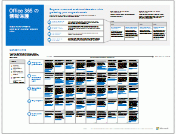

# Microsoft クラウド IT アーキテクチャのリソース

 **概要:**Microsoft クラウド サービスおよびプラットフォームについて説明します。Enterprise Cloud ロードマップの確認、クラウド アーキテクチャ シリーズの検索、などを行います。
  
これらのアーキテクチャ ツールおよびポスターでは、Office 365、Microsoft Azure、Microsoft Intune、Microsoft Dynamics 365、プライベート クラウドのデータ センター、オンプレミスとクラウドのハイブリッド ソリューションを含む Microsoft クラウド サービスおよびプラットフォームについての情報を提供します。IT 意思決定者と設計者はこれらのリソースを使用して、ワークロードの最適なソリューションを決定し、ID やセキュリティなどのコア インフラストラクチャ コンポーネントについて決定することができます。
  
- **[Microsoft の Enterprise Cloud ロードマップ](microsoft-cloud-it-architecture-resources.md#roadmap)** (Sway)
    
- **[エンタープライズ アーキテクト シリーズ向けの Microsoft クラウド](microsoft-cloud-it-architecture-resources.md#cloudarch)** 。[Microsoft クラウド サービスとプラットフォームのオプション](microsoft-cloud-it-architecture-resources.md#platformoptions)、[エンタープライズ アーキテクトのための Microsoft クラウド ID](microsoft-cloud-it-architecture-resources.md#identity)、[エンタープライズ アーキテクトのための Microsoft クラウドのセキュリティ](microsoft-cloud-it-architecture-resources.md#security)、[エンタープライズ アーキテクトのための Microsoft クラウド ネットワーク](microsoft-cloud-it-architecture-resources.md#networking)、[エンタープライズ アーキテクトのための Microsoft Mobility および Security](microsoft-cloud-it-architecture-resources.md#mobility)、[エンタープライズ アーキテクトのための Microsoft クラウド ストレージ](microsoft-cloud-it-architecture-resources.md#storage)、[エンタープライズ アーキテクトのための Microsoft ハイブリッド クラウド](microsoft-cloud-it-architecture-resources.md#hybrid)、および [Microsoft Cloud の Contoso](microsoft-cloud-it-architecture-resources.md#contoso) のポスターを含みます。
    
- **[Office 365 Enterprise ソリューション シリーズ](microsoft-cloud-it-architecture-resources.md#BKMK_o365solutions)** 。[Office 365 の情報保護](microsoft-cloud-it-architecture-resources.md#BKMK_infoprotect)、[Office 365 の ID とデバイス保護](microsoft-cloud-it-architecture-resources.md#BKMK_O365IDP)、[Office 365 のファイル保護ソリューション](microsoft-cloud-it-architecture-resources.md#BKMK_O365fileprotect)、[Office 365 クライアントの管理に関する変更](microsoft-cloud-it-architecture-resources.md#changemgmt)を含みます。
    
> [!TIP]
> このページのポスターのほとんどは、中国語、英語、フランス語、ドイツ語、イタリア語、日本語、韓国語、ポルトガル語、ロシア語、スペイン語を含む複数の言語で提供されています。これらの言語のいずれかのポスターをダウンロードするには、ポスターの **[その他の言語]** リンクをクリックします。
  
ご意見をお知らせください。[cloudadopt@microsoft.com](mailto:cloudadopt@microsoft.com) に電子メールを送信してください。
  
## Microsoft の Enterprise Cloud ロードマップ

業界で最も包括的なクラウド ソリューションを説明しているポスター、アイコン セット、コミュニティの場、その他のリソースを参照してください。
  
|**項目**|**説明**|
|:-----|:-----|
|[          ](https://aka.ms/cloudarchitecture)   [Microsoft のエンタープライズ クラウド ロードマップ](https://aka.ms/cloudarchitecture) (https://aka.ms/cloudarchitecture)   |この Sway エクスペリエンスを通して、業界で最も包括的なクラウド ソリューションを説明しているリソースをご確認ください。    |
   
## エンタープライズ アーキテクト シリーズ向けの Microsoft クラウド

これらのクラウド アーキテクチャ ポスターでは、Office 365、Microsoft Azure、Microsoft Intune、Microsoft Dynamics CRM Online、プライベート クラウドのデータ センター、オンプレミスとクラウドのハイブリッド ソリューションを含む Microsoft クラウド サービスおよびプラットフォームについての情報を提供します。IT 意思決定者と設計者はこれらのリソースを使用して、ワークロードの最適なソリューションを決定し、ID やセキュリティなどのコア インフラストラクチャ コンポーネントについて決定することができます。
  
### Microsoft クラウド サービスとプラットフォームのオプション

各種の Microsoft クラウド サービスとプラットフォーム サービスの重要な相違点について説明します。ご使用のソリューションに最もよく合うものを見つけてください。
  
|**項目**|**説明**|
|:-----|:-----|
|[          ](https://www.microsoft.com/download/details.aspx?id=54432)   [PDF](https://go.microsoft.com/fwlink/p/?LinkId=524731) |[Visio](https://go.microsoft.com/fwlink/p/?LinkId=524732) |[その他の言語](https://www.microsoft.com/download/details.aspx?id=54432)   | このモデルでは、次について説明します。    Office 365 を含む、サービスとしてのソフトウェア (SaaS) 提供物    Microsoft Azure における、サービスとしてのプラットフォーム (PaaS) 機能    Microsoft Azure における、サービスとしてのインフラストラクチャ (IaaS) 機能    Windows Server および System Center を使用する、プライベート クラウドのデータセンター機能    Microsoft 社の IT 部門が、これらのクラウド サービスにどのように移行し、ハイブリッド クラウドをどのように構築しているかを学びます。   |
   
### エンタープライズ アーキテクトのための Microsoft クラウド ID

Microsoft クラウド サービスおよびプラットフォームを使用して、組織のためのアイデンティティを設計する上で IT アーキテクトが知る必要のある事柄。
  
|**項目**|**説明**|
|:-----|:-----|
|[          ](https://www.microsoft.com/download/details.aspx?id=54431)   [PDF](https://go.microsoft.com/fwlink/p/?LinkId=524586) |[Visio](https://download.microsoft.com/download/2/3/8/238228E6-9017-4F6C-BD3C-5559E6708F82/MSFT_cloud_architecture_identity.vsd)          [記事](https://technet.microsoft.com/library/mt613459.aspx) |[その他の言語](https://www.microsoft.com/download/details.aspx?id=54431)   | このモデルには次のものが含まれています。    サービス (IDaaS) プロバイダーの ID として Azure AD を用いる    Azure AD IDaaS 機能    オンプレミスの Active Directory ドメイン サービス アカウントと Microsoft Azure Active Directory を統合する    ディレクトリ コンポーネントを Azure に配置する    Azure IaaS のワークロードのドメイン サービス オプション    記事フォーム内の情報の表示:[エンタープライズ アーキテクトのための Microsoft クラウド ID](microsoft-cloud-identity-for-enterprise-architects.md)。    |
   
### エンタープライズ アーキテクトのための Microsoft クラウドのセキュリティ

Microsoft クラウド サービスおよびプラットフォームにおけるセキュリティについて IT アーキテクトが知る必要のある事柄。
  
|**項目**|**説明**|
|:-----|:-----|
|[          ](https://www.microsoft.com/download/details.aspx?id=48121)   [PDF](https://go.microsoft.com/fwlink/p/?linkid=842070) |[Visio](https://go.microsoft.com/fwlink/p/?LinkId=842071) |[その他の言語](https://www.microsoft.com/download/details.aspx?id=48121)   | このモデルには次のものが含まれています。    セキュリティで保護されたサービスとプラットフォームを提供するうえでの Microsoft の役割    セキュリティ上のリスクを軽減するためのお客様の責任範囲    最高度のセキュリティ証明    Microsoft コンサルティング サービスによって提供されるセキュリティ ソリューション    このアーキテクチャ ポスターに基づく Microsoft Virtual Academy コースである[Security in a Cloud-Enabled World](https://aka.ms/securecustomermva) を受講してください。   |
   
### エンタープライズ アーキテクトのための Microsoft クラウド ネットワーク

Microsoft クラウド サービスおよびプラットフォームのネットワーキングに関して IT アーキテクトが知る必要のある事柄。
  
|**項目**|**説明**|
|:-----|:-----|
|[          ](https://www.microsoft.com/download/details.aspx?id=54425)   [PDF](https://go.microsoft.com/fwlink/p/?linkid=842073) |[Visio](https://go.microsoft.com/fwlink/p/?linkid=842074)          [記事](https://technet.microsoft.com/library/mt733214.aspx) |[その他の言語](https://www.microsoft.com/download/details.aspx?id=54425)   | このモデルには以下のページが含まれています。   **クラウド接続用のネットワークの進化**: クラウド移行によって、企業ネットワークの内外でのトラフィック フローの容量と特性が変化します。また、セキュリティ リスクを軽減するためのアプローチにも影響します。   **Microsoft クラウド接続の一般的な要素**: ネットワーキングと Microsoft クラウドの統合によって、広範なサービスへの最適なアクセスが提供されます。   **Microsoft クラウド接続用の ExpressRoute** ExpressRoute は、Microsoft のクラウドへのプライベートで専用の高スループットなネットワーク接続を提供します。   **Microsoft SaaS (Office 365、Microsoft Intune、および Dynamics CRM Online) 用ネットワーキングの設計**: Microsoft SaaS サービス用のネットワークを最適化するには、インターネット エッジ、クライアント デバイス、および標準の IT 運用を慎重に分析する必要があります。   **Azure PaaS 用のネットワーキングの設計**: Azure PaaS アプリ用のネットワーキングを最適化するには、適切なインターネット帯域幅が必要であり、複数のサイトまたはアプリにまたがるネットワーク トラフィックの分散が必要とされる可能性があります。   **Azure IaaS のネットワークの設計** サブネット、アドレス空間、ルーティング、DNS、負荷分散や、オンプレミスのネットワーク、その他の VNet、インターネットなどへの接続など、サーバーベースの IT ワークロードをホストするために最適な Azure 仮想ネットワーク (VNet) を作成するには、設計プロセスを実行します。    このアーキテクチャ ポスターに基づく新しい Microsoft Virtual Academy コースである[Optimize Your Network for Microsoft Cloud Offerings](https://aka.ms/optimizecloudnetworkingmva) を受講してください。   |
   
### エンタープライズ アーキテクトのための Microsoft Mobility および Security

Microsoft クラウド サービスおよびプラットフォームによるモビリティについて IT アーキテクトが知る必要のある事柄。
  
|**項目**|**説明**|
|:-----|:-----|
|[          ](https://www.microsoft.com/download/details.aspx?id=55023)   [PDF](https://go.microsoft.com/fwlink/p/?linkid=842076) |[Visio](https://go.microsoft.com/fwlink/p/?linkid=842077) |[その他の言語](https://www.microsoft.com/download/details.aspx?id=55023)   | Microsoft は、データとアプリケーションの保護に対応した管理制御により、モバイルの生産性に対する広範なサポートを提供しています。    Microsoft のビジネス向けモバイル アプリ。    モバイル アプリの開発用プラットフォーム、サービス、およびリソース。    モバイル デバイスからクラウドベースのアプリケーションおよびデータへのアクセスの管理。    Office 365 MDM、Azure Active Directory Premium、および Intune の機能の比較とプラットフォーム サポート。   |
   
### エンタープライズ アーキテクトのための Microsoft クラウド ストレージ

Microsoft クラウド サービスおよびプラットフォームにおけるストレージ オプションについて IT アーキテクトが知る必要のある事柄。
  
|**項目**|**説明**|
|:-----|:-----|
|[          ](https://www.microsoft.com/download/details.aspx?id=49552)   [PDF](https://go.microsoft.com/fwlink/p/?linkid=842079) |[Visio](https://go.microsoft.com/fwlink/p/?linkid=842080)          [記事](https://technet.microsoft.com/library/mt842597.aspx) |[その他の言語](https://www.microsoft.com/download/details.aspx?id=49552)   | このモデルには次のものが含まれています。    クラウド ストレージを使用する理由と主なシナリオ。    最小限の構成でいつでも使用可能な、既存のサービスに付属しているクラウド ストレージ オプション。    カスタム調整用の追加の構成やコーディングを伴うソリューションのストレージの開始点として使用可能な、いくらかのアセンブリが必要なストレージ オプション。    独自のストレージ ソリューションまたはアプリ用のストレージを最初から作成するための、ストレージ ブロックを使用した構築。   |
   
### エンタープライズ アーキテクトのための Microsoft ハイブリッド クラウド

Microsoft のサービスとプラットフォーム用のハイブリッド クラウドに関して IT アーキテクトが知る必要のある事柄。
  
|**項目**|**説明**|
|:-----|:-----|
|[          ](https://www.microsoft.com/download/details.aspx?id=54424)   [PDF](https://go.microsoft.com/fwlink/p/?linkid=842082) |[Visio](https://go.microsoft.com/fwlink/p/?linkid=842083)          [記事](https://technet.microsoft.com/library/mt750500.aspx) |[その他の言語](https://www.microsoft.com/download/details.aspx?id=54424)   | このモデルには以下のページが含まれています。   **ハイブリッド クラウドの概要** Microsoft のクラウド サービス (SaaS、Azure PaaS、そして Azure IaaS) とそれらの共通の要素。   **Microsoft ハイブリッド クラウド シナリオのアーキテクチャ** Microsoft のクラウド製品のハイブリッド クラウドのアーキテクチャ ダイアグラム。オンプレミス インフラストラクチャ、ネットワーク、および ID の共通レイヤーを示します。   **Microsoft SaaS (Office 365) のハイブリッド クラウド シナリオ** SaaS ハイブリッド シナリオ アーキテクチャと、Skype for Business、SharePoint Server、そして Exchange Server の主要なハイブリッド構成の説明。   **Azure PaaS のハイブリッド クラウド シナリオ** Azure PaaS ハイブリッド シナリオのアーキテクチャ、および Azure PaaS ハイブリッド アプリケーションの説明とその例、および SQL Server 2016 Stretch Database の説明。   **Azure IaaS のハイブリッド クラウド シナリオ** Azure IaaS ハイブリッド シナリオのアーキテクチャ、および Azure IaaS でホストされる基幹業務 (LOB) アプリケーションの説明。   |
   
### Microsoft Cloud の Contoso

架空ではありますが代表的な世界規模の組織が Microsoft のクラウド商品 (Office 365、Azure、Dynamics 365、および Intune を含む) を実装している方法を示します。
  
|**項目**|**説明**|
|:-----|:-----|
|[          ](https://www.microsoft.com/download/details.aspx?id=54427)   [PDF](https://go.microsoft.com/fwlink/p/?linkid=842085) |[Visio](https://go.microsoft.com/fwlink/p/?linkid=842086)          [記事](https://technet.microsoft.com/library/mt775341.aspx) |[その他の言語](https://www.microsoft.com/download/details.aspx?id=54427)   |パリに本社を置く世界規模の製造複合企業の Contoso Corporation が、クラウド包括型の IT インフラストラクチャを採用している方法と、ネットワーク、ID、およびセキュリティに関する主要な設計決定に対応している方法を説明しています。    |
   
### サンタ クラウド

サンタと仲間の小さな妖精たちが Microsoft のクラウド ソリューションを使用して年ごとの配達を行う方法を説明します。
  
|**アイテム**|**説明**|
|:-----|:-----|
|[          ](https://www.microsoft.com/download/details.aspx?id=55039)   [PDF](https://go.microsoft.com/fwlink/p/?linkid=842088)   |悪い子と良い子を判別して 12 月 24 日にプレゼントを配る対象を決めるため、サンタクロースと仲間の小さな妖精たちの IT 部門は Office 365、Azure、Dynamics 365、Intune を使用します。    |
   
## Office 365 Enterprise ソリューション シリーズ

Office 365 Enterprise ソリューション シリーズには、Office 365 の機能、特にざまざまなプラットフォームで使える機能を実装するためのガイダンスが用意されています。
  
### Office 365 の情報保護

企業資産を保護する、エンタープライズ組織向けの機能です。
  
|**項目**|**説明**|
|:-----|:-----|
|[          ](https://www.microsoft.com/download/details.aspx?id=54429)   [PDF](http://download.microsoft.com/download/2/3/D/23D91386-8349-4F7A-9470-FD5AED861F16/MSFT_cloud_architecture_informationprotection.pdf) |[Visio](http://download.microsoft.com/download/2/3/D/23D91386-8349-4F7A-9470-FD5AED861F16/MSFT_cloud_architecture_informationprotection.vsd) |[その他の言語](https://www.microsoft.com/download/details.aspx?id=54429)   |Microsoft は、企業資産を保護する最も包括的な機能のセットを提供します。このモデルは、組織が導入する機能を計画する際に、系統的なアプローチを行うのに役立ちます。    |
   
### Office 365 の ID とデバイス保護

Office 365、他の SaaS サービス、および Azure AD アプリケーション プロキシで公開したオンプレミス アプリケーションにアクセスする ID とデバイスを保護するために推奨される機能。
  
|**項目**|**説明**|
|:-----|:-----|
|[          ](https://www.microsoft.com/download/details.aspx?id=55032)   [PDF](https://go.microsoft.com/fwlink/p/?linkid=841656) |[Visio](https://go.microsoft.com/fwlink/p/?linkid=841657) |[その他の言語](https://www.microsoft.com/download/details.aspx?id=55032)   |データ、ID、デバイス全体で一貫したレベルの保護を使用することが重要です。このドキュメントでは、ID とデバイスを保護する機能に関する詳細情報に、どの機能が相当するのかを説明します。    |
   
### Office 365 のファイル保護ソリューション

Office 365 のファイル保護のために推奨される機能は、3 段階の秘密度レベルに基づいています。
  
|**項目**|**説明**|
|:-----|:-----|
|[          ](https://www.microsoft.com/download/details.aspx?id=55523)   [PDF](http://download.microsoft.com/download/7/8/9/789645A5-BD10-4541-BC33-F8D1EFF5E911/MSFT_cloud_architecture_O365 file protection.pdf) |[Visio](http://download.microsoft.com/download/7/8/9/789645A5-BD10-4541-BC33-F8D1EFF5E911/MSFT_cloud_architecture_O365%20file%20protection.vsdx)   |データ、ID、デバイス全体で一貫したレベルの保護を使用することが重要です。このドキュメントでは、Office 365 のファイルを保護する機能に関する詳細情報に、どの機能が相当するのかを説明します。    |
   
### Office 365 クライアントの管理に関する変更

Office 365 クライアント アプリケーションと Windows 10 のブランチ リリースの管理に関して IT アーキテクトが知る必要のある事柄。 
  
|**項目**|**説明**|
|:-----|:-----|
|[          ](https://www.microsoft.com/download/details.aspx?id=49141)   [PDF](https://go.microsoft.com/fwlink/p/?LinkId=626681) |[Visio](https://go.microsoft.com/fwlink/p/?LinkId=626680)          [Article](https://technet.microsoft.com/library/mt584223.aspx) |[その他の言語](https://www.microsoft.com/download/details.aspx?id=49141)   | Windows 10 と Office 365 クライアント アプリケーション用のサービス提供モデル    リリース オプション    リリース ケーデンス    変更の種類    役割と責任    更新プログラムの展開の管理    記事フォーム内の情報の表示:[Change management for Office 365 clients](http://technet.microsoft.com/library/815fa1aa-0355-40b5-b7bc-cdf7d4610062.aspx)。    |
   