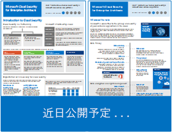
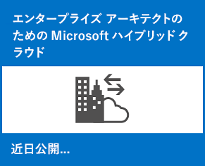
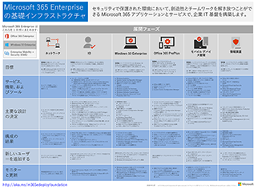
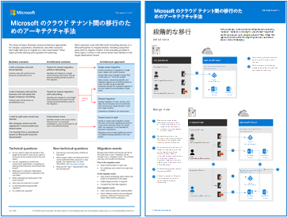
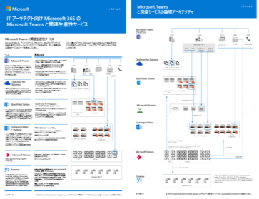
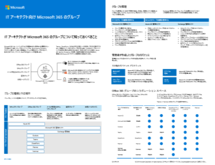
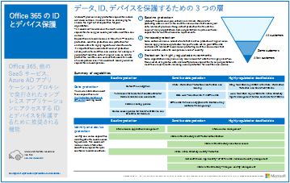
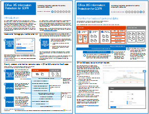
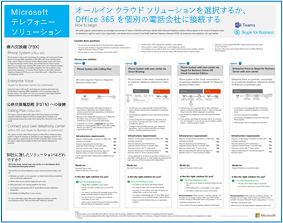

# Microsoft クラウド IT アーキテクチャのリソースMicrosoft cloud IT architecture resources

 **概要:** Microsoft ID, セキュリティ、ネットワーク、およびハイブリッドにおけるコア クラウド アーキテクチャの概念について説明します。Microsoft のクラウドを使用する場合は、ファイル、ID、およびデバイスを保護するための推奨事項を確認してください。Windows 10 および Office ProPlus で最新のセキュリティで保護されたデスクトップを展開する方法について説明します。**Summary:** Learn core cloud architecture concepts for Microsoft identity, security, networking, and hybrid. Review prescriptive recommendations for protecting files, identities, and devices when using Microsoft's cloud. Learn how to deploy a modern and secure desktop with Windows 10 and Office ProPlus.
  
これらのアーキテクチャ ツールおよびポスターでは、Office 365、Windows 10、Azure Active Directory, Microsoft Intune、Microsoft Dynamics 365、および プライベート クラウドのデータ センター、オンプレミスとクラウドのハイブリッド ソリューションを含む Microsoft クラウド サービスについての情報を提供します。IT 意思決定者と設計者はこれらのリソースを使用して、ワークロードに最適なソリューションを決定し、ID やセキュリティなどのコア インフラストラクチャ コンポーネントについて決定することができます。These architecture tools and posters give you information about Microsoft cloud services, including Office 365, Windows 10, Azure Active Directory, Microsoft Intune, Microsoft Dynamics 365, and hybrid on-premises and cloud solutions. IT decision makers and architects can use these resources to determine the ideal solutions for their workloads and to make decisions about core infrastructure components such as identity and security. 
  
<!--**[Microsoft's Enterprise Cloud Roadmap](microsoft-cloud-it-architecture-resources.md#roadmap)** (Sway) -->
    
- **[エンタープライズ アーキテクト シリーズ向けの Microsoft クラウド](microsoft-cloud-it-architecture-resources.md#cloudarch)** 
    **[Microsoft cloud for enterprise architects series](microsoft-cloud-it-architecture-resources.md#cloudarch)** 
  <!-- [Microsoft Cloud Services and Platform Options](microsoft-cloud-it-architecture-resources.md#platformoptions) -->
    - [エンタープライズ アーキテクトのための Microsoft クラウド IDMicrosoft cloud identity for enterprise architects](microsoft-cloud-it-architecture-resources.md#identity)
    - [エンタープライズ アーキテクトのための Microsoft クラウドのセキュリティMicrosoft cloud security for enterprise architects](microsoft-cloud-it-architecture-resources.md#security)
    - [エンタープライズ アーキテクトのための Microsoft Cloud ネットワークMicrosoft cloud networking for enterprise architects](microsoft-cloud-it-architecture-resources.md#networking)
    - [エンタープライズ アーキテクトのための Microsoft ハイブリッド クラウドMicrosoft hybrid cloud for enterprise architects](microsoft-cloud-it-architecture-resources.md#hybrid)
    - [一般的な攻撃と、組織を保護する Microsoft の機能Common attacks and Microsoft capabilities that protect your organization](#common-attacks-and-microsoft-capabilities-that-protect-your-organization)
    - [Microsoft 365 Enterprise の基礎インフラストラクチャMicrosoft 365 Enterprise Foundation Infrastructure](#m365foundationinfra)
    - [Microsoft のクラウド テナント間の移行のためのアーキテクチャ手法Architecture approaches for Microsoft cloud tenant-to-tenant migrations](#architecture-approaches-for-microsoft-cloud-tenant-to-tenant-migrations)
    
- **[Microsoft 365 Enterprise ソリューション シリーズ](microsoft-cloud-it-architecture-resources.md#BKMK_o365solutions)**:**[Microsoft 365 enterprise solution series](microsoft-cloud-it-architecture-resources.md#BKMK_o365solutions)**:
    - [IT アーキテクト向け Microsoft 365 の Microsoft Teams と関連生産性サービスMicrosoft Teams and related productivity services in Microsoft 365 for IT architects](#microsoft-teams-and-related-productivity-services-in-microsoft-365-for-it-architects)
    - [IT アーキテクト向け Microsoft 365 のグループGroups in Microsoft 365 for IT architects](#groups-in-microsoft-365-for-it-architects)
    - [Office 365 の ID とデバイス保護Identity and device protection for Office 365](microsoft-cloud-it-architecture-resources.md#BKMK_O365IDP)
    - [Office 365 のファイル保護ソリューションFile protection solutions in Office 365](microsoft-cloud-it-architecture-resources.md#BKMK_O365fileprotect)
    - [GDPR のための Office 365 の情報保護Office 365 Information Protection for GDPR](#office-365-information-protection-for-gdpr)
    - [選挙運動、非営利組織、およびその他のアジャイル組織のための Microsoft Security ガイダンスMicrosoft Security Guidance for Political Campaigns, Nonprofits, and Other Agile Organizations](#microsoft-security-guidance-for-political-campaigns-nonprofits-and-other-agile-organizations)
    - [Microsoft テレフォニー ソリューションMicrosoft Telephony Solutions](#microsoft-telephony-solutions) 
    - [Microsoft の最新のセキュリティで保護されたデスクトップの展開Deploy a modern and secure desktop with Microsoft](microsoft-cloud-it-architecture-resources.md#msd)
    
ご意見を電子メールで [cloudadopt@microsoft.com](mailto:cloudadopt@microsoft.com) 宛てにお送りください。Let us know what you think! Send us email at [cloudadopt@microsoft.com](mailto:cloudadopt@microsoft.com). 

<!--

## Microsoft's Enterprise Cloud Roadmap

See the posters, icon sets, community venues, and other resources that describe the industry's most complete cloud solution.
  
|**Item**|**Description**|
|:-----|:-----|
|[          ](https://aka.ms/cloudarchitecture)   [Microsoft's Enterprise Cloud Roadmap](https://aka.ms/cloudarchitecture) (https://aka.ms/cloudarchitecture)   |Swipe through this Sway experience for the resources that describe the industry's most complete cloud solution.    |
-->
  

## エンタープライズ アーキテクト シリーズ向けの Microsoft クラウド## Microsoft cloud for enterprise architects series

これらのクラウド アーキテクチャ ポスターでは、Office 365、Azure Active Directory、Microsoft Intune、Microsoft Dynamics CRM Online、およびオンプレミスとクラウドのハイブリッド ソリューションを含む Microsoft クラウド サービスについての情報を提供します。IT 意思決定者と設計者はこれらのリソースを使用して、ワークロードに最適なソリューションを決定し、ID やセキュリティなどのコア インフラストラクチャ コンポーネントについて決定することができます。These cloud architecture posters give you information about Microsoft cloud services, including Office 365, Azure Active Directory, Microsoft Intune, Microsoft Dynamics CRM Online, and hybrid on-premises and cloud solutions. IT decision makers and architects can use these resources to determine the ideal solutions for their workloads and to make decisions about core infrastructure components such as identity and security.

<!--  

### Microsoft Cloud Services and Platform Options

Learn key differences between Microsoft cloud services and platform offerings. Find the best fit for your solution.
  
|**Item**|**Description**|
|:-----|:-----|
|[          ](https://www.microsoft.com/download/details.aspx?id=54432)   [PDF](https://go.microsoft.com/fwlink/p/?LinkId=524731)  \| [Visio](https://go.microsoft.com/fwlink/p/?LinkId=524732)  \| [More languages](https://www.microsoft.com/download/details.aspx?id=54432)   | This model describes: <ul><li>  Software as a Service (SaaS) offerings, including Office 365 </li><li>  Platform as a Service (PaaS) features in Microsoft Azure </li><li>  Infrastructure as a Service (IaaS) features in Microsoft Azure </li><li>  Private cloud datacenter capabilities using Windows Server and System Center </li><li>  Learn how Microsoft's own IT department is migrating to these cloud services and building its hybrid cloud. </li></ul> |
-->

   

### エンタープライズ アーキテクトのための Microsoft クラウド ID### Microsoft cloud identity for enterprise architects

Microsoft クラウド サービスおよびプラットフォームを使用して、組織のためのアイデンティティを設計する上で IT アーキテクトが知る必要のある事柄。What IT architects need to know about designing identity for organizations using Microsoft cloud services and platforms.
  
|**アイテム****Item**|**説明****Description**|
|:-----|:-----|
|[          ](https://www.microsoft.com/download/details.aspx?id=54431)[          ](https://www.microsoft.com/download/details.aspx?id=54431)   [PDF](https://go.microsoft.com/fwlink/p/?LinkId=524586)  \| [Visio](https://download.microsoft.com/download/2/3/8/238228E6-9017-4F6C-BD3C-5559E6708F82/MSFT_cloud_architecture_identity.vsd)           \| [その他の言語](https://www.microsoft.com/download/details.aspx?id=54431)[PDF](https://go.microsoft.com/fwlink/p/?LinkId=524586)  \| [Visio](https://download.microsoft.com/download/2/3/8/238228E6-9017-4F6C-BD3C-5559E6708F82/MSFT_cloud_architecture_identity.vsd)           \| [More languages](https://www.microsoft.com/download/details.aspx?id=54431)   | このモデルには次のものが含まれています。This model contains: <ul><li>Microsoft のクラウド ID の概要Introduction to identity with Microsoft’s cloud </li><li>Azure AD IDaaS 機能Azure AD IDaaS capabilities </li><li>オンプレミスの Active Directory Domain Services アカウントと Microsoft Azure Active Directory を統合するIntegrating on-premises Active Directory Domain Services accounts with Microsoft Azure Active Directory </li><li>ディレクトリ コンポーネントを Azure に配置するPutting directory components in Azure </li><li>Azure IaaS のワークロードのドメイン サービス オプションDomain services options for workloads in Azure IaaS </li></ul> |
   

### エンタープライズ アーキテクトのための Microsoft クラウドのセキュリティMicrosoft cloud security for enterprise architects

Microsoft クラウド サービスおよびプラットフォームにおけるセキュリティについて IT アーキテクトが知る必要のある事柄。What IT architects need to know about security in Microsoft cloud services and platforms.
  
|**アイテム****Item**|**説明****Description**|
|:-----|:-----|
|[          ](https://www.microsoft.com/download/details.aspx?id=48121)[          ](https://www.microsoft.com/download/details.aspx?id=48121)   [PDF](https://go.microsoft.com/fwlink/p/?linkid=842070)  \| [Visio](https://go.microsoft.com/fwlink/p/?LinkId=842071)  \| [その他の言語](https://www.microsoft.com/download/details.aspx?id=48121)[PDF](https://go.microsoft.com/fwlink/p/?linkid=842070)  \| [Visio](https://go.microsoft.com/fwlink/p/?LinkId=842071)  \| [More languages](https://www.microsoft.com/download/details.aspx?id=48121)   | このモデルには次のものが含まれています。This model contains: <ul><li>安全なサービスとプラットフォームを提供することにおける Microsoft の役割Microsoft's role in providing secure services and platforms</li><li>セキュリティ上のリスクを軽減するというお客様側の責任Customer responsibilities to mitigate security risks</li><li>最高位のセキュリティ認定Top security certifications </li><li>Microsoft コンサルティング サービスが提供するセキュリティ サービスSecurity offerings provided by Microsoft consulting services </ul> |
   

### エンタープライズ アーキテクトのための Microsoft Cloud ネットワークMicrosoft cloud networking for enterprise architects

Microsoft クラウド サービスおよびプラットフォームのネットワーキングに関して IT アーキテクトが知る必要のある事柄。What IT architects need to know about networking for Microsoft cloud services and platforms.
  
|**アイテム****Item**|**説明****Description**|
|:-----|:-----|
|   [PDF](media/Network-Poster/MSFT_cloud_architecture_networking.pdf)  \| [Visio](https://github.com/MicrosoftDocs/OfficeDocs-Enterprise/raw/live/Enterprise/media/Network-Poster/MSFT_cloud_architecture_networking.vsdx)[PDF](media/Network-Poster/MSFT_cloud_architecture_networking.pdf)  \| [Visio](https://github.com/MicrosoftDocs/OfficeDocs-Enterprise/raw/live/Enterprise/media/Network-Poster/MSFT_cloud_architecture_networking.vsdx)   | このモデルには次のものが含まれています。This model contains: <ul><li> クラウド接続のためのネットワークの進化Evolving your network for cloud connectivity </li><li> Microsoft のクラウド接続の一般的な要素Common elements of Microsoft cloud connectivity </li><li> Microsoft クラウド接続のためのExpressRouteExpressRoute for Microsoft cloud connectivity </li><li> Microsoft SaaS、Azure PaaS、および Azure IaaS のネットワークの設計Designing networking for Microsoft SaaS, Azure PaaS, and  Azure IaaS </li></ul>    |

### エンタープライズ アーキテクトのための Microsoft ハイブリッド クラウドMicrosoft hybrid cloud for enterprise architects

Microsoft のサービスとプラットフォーム用のハイブリッド クラウドに関して IT アーキテクトが知る必要のある事柄。What IT architects need to know about hybrid cloud for Microsoft services and platforms.
  
|**アイテム****Item**|**説明****Description**|
|:-----|:-----|
|   [PDF](media/Hybrid-Poster/MSFT_cloud_architecture_hybrid.pdf)  \| [Visio](https://github.com/MicrosoftDocs/OfficeDocs-Enterprise/raw/live/Enterprise/media/Hybrid-Poster/MSFT_cloud_architecture_hybrid.vsdx)[PDF](media/Hybrid-Poster/MSFT_cloud_architecture_hybrid.pdf)  \| [Visio](https://github.com/MicrosoftDocs/OfficeDocs-Enterprise/raw/live/Enterprise/media/Hybrid-Poster/MSFT_cloud_architecture_hybrid.vsdx)  | このモデルには次のものが含まれています。This model contains: <ul><li> Microsoft のクラウド製品 (SaaS、Azure PaaS、Azure IaaS) とそれらの共通の要素。Microsoft's cloud offerings (SaaS, Azure PaaS, and Azure IaaS) and their common elements </li><li> Microsoft のクラウド製品向けのハイブリッド クラウド アーキテクチャHybrid cloud architecture for Microsoft's cloud offerings </li><li> Microsoft SaaS (Office 365)、Azure PaaS、および Azure IaaS のハイブリッド クラウド シナリオHybrid cloud scenarios for Microsoft SaaS (Office 365), Azure PaaS, and Azure IaaS </li></ul> |
   

### 一般的な攻撃と、組織を保護する Microsoft の機能Common attacks and Microsoft capabilities that protect your organization
最も一般的なサイバー攻撃と、攻撃の各段階で Microsoft が組織を支援する方法について説明します。Learn about the most common cyber attacks and how Microsoft can help your organization at every stage of an attack. 

|**アイテム****Item**|**説明****Description**|
|:-----|:-----|
|   [PDF](https://download.microsoft.com/download/F/A/C/FACFC1E9-FA35-4DF1-943C-8D4237B4275B/MSFT_Cloud_architecture_security_commonattacks.pdf) \| [Visio](https://download.microsoft.com/download/F/A/C/FACFC1E9-FA35-4DF1-943C-8D4237B4275B/MSFT_Cloud_architecture_security_commonattacks.vsdx)[PDF](https://download.microsoft.com/download/F/A/C/FACFC1E9-FA35-4DF1-943C-8D4237B4275B/MSFT_Cloud_architecture_security_commonattacks.pdf) \| [Visio](https://download.microsoft.com/download/F/A/C/FACFC1E9-FA35-4DF1-943C-8D4237B4275B/MSFT_Cloud_architecture_security_commonattacks.vsdx)   | このポスターは、一般的な攻撃の経路を示し、攻撃の各段階で攻撃者を阻止する機能について説明します。This poster illustrates the path of common attacks and describes which capabilities help stop attackers at each stage of an attack.  |

### Microsoft 365 Enterprise の基盤インフラストラクチャMicrosoft 365 Enterprise Foundation Infrastructure

展開を開始するための Microsoft 365 Enterprise の[基盤インフラストラクチャ](https://docs.microsoft.com/microsoft-365/enterprise/deploy-foundation-infrastructure)をひとめで確認できます。Get an at-a-glance view of the [foundation infrastructure](https://docs.microsoft.com/microsoft-365/enterprise/deploy-foundation-infrastructure) for Microsoft 365 Enterprise to begin your deployment.
  
|**Item****Item**|**説明****Description**|
|:-----|:-----|
|   [オンライン表示](https://aka.ms/m365efoundinfraposter) \| [PDF](https://github.com/MicrosoftDocs/microsoft-365-docs/raw/public/microsoft-365/enterprise/media/deploy-foundation-infrastructure/Microsoft365EnterpriseFoundInfra.pdf)[View online](https://aka.ms/m365efoundinfraposter) \| [PDF](https://github.com/MicrosoftDocs/microsoft-365-docs/raw/public/microsoft-365/enterprise/media/deploy-foundation-infrastructure/Microsoft365EnterpriseFoundInfra.pdf)   | このポスターでは、目標、機能とツール、設計上の決定、構成結果、オンボード、および継続的な監視と更新の観点から、基盤インフラストラクチャの各フェーズについて要約します。This poster summarizes each phase of the foundation infrastructure in terms of goals, features and tools, design decisions, configuration results, onboarding, and ongoing monitoring and updates.  | 

### Microsoft のクラウド テナント間の移行のためのアーキテクチャ手法Architecture approaches for Microsoft cloud tenant-to-tenant migrations 
この一連のトピックでは、合併、買収、分割、および新しいクラウド テナントへの移行に導くその他のシナリオに対応する複数のアーキテクチャ手法を示します。This series of topics illustrates several architecture approaches for mergers, acquisitions, divestitures, and other scenarios that might lead you to migrate to a new cloud tenant. これらのトピックでは、計画の出発点となるガイダンスを提供します。These topics provide starting-point guidance for planning.

|**Item****Item**|**説明****Description**|
|:-----|:-----|
|   [PDF](downloads/Microsoft-365-tenant-to-tenant-migration.pdf) \| [Visio](https://github.com/MicrosoftDocs/OfficeDocs-Enterprise/raw/live/Enterprise/downloads/Microsoft-365-tenant-to-tenant-migration.vsdx)[PDF](downloads/Microsoft-365-tenant-to-tenant-migration.pdf) \| [Visio](https://github.com/MicrosoftDocs/OfficeDocs-Enterprise/raw/live/Enterprise/downloads/Microsoft-365-tenant-to-tenant-migration.vsdx)     |このモデルには次のものが含まれています。This model contains: <ul><li>アーキテクチャ手法のためのビジネス シナリオのマッピング。A mapping of business scenarios to architecture approaches</li><li>設計上の考慮事項Design considerations</li><li>単一イベントの移行のフローSingle event migration flow</li><li>段階的な移行のフローPhased migration flow</li><li>テナント移動または分割フローTenant move or split flow</li></ul>|

## Microsoft 365 Enterprise ソリューション シリーズMicrosoft 365 enterprise solution series

Microsoft 365 Enterprise ソリューション シリーズには、Microsoft 365 の機能、特にざまざまなプラットフォームで使える機能を実装するためのガイダンスが用意されています。The Microsoft 365 enterprise solution series provides guidance for implementing Microsoft 365 capabilities, especially where capabilities cross technologies.

### IT アーキテクト向け Microsoft 365 の Microsoft Teams と関連生産性サービスMicrosoft Teams and related productivity services in Microsoft 365 for IT architects
Microsoft Teamsをリードする Microsoft 365 での生産性サービスの論理的なアーキテクチャ。The logical architecture of productivity services in Microsoft 365, leading with Microsoft Teams.

|**アイテム****Item**|**説明****Description**|
|:-----|:-----|
|   [PDF](downloads/msft-m365-teams-logical-architecture.pdf) \| [Visio](https://github.com/MicrosoftDocs/OfficeDocs-Enterprise/raw/live/Enterprise/downloads/msft-m365-teams-logical-architecture.vsdx)[PDF](downloads/msft-m365-teams-logical-architecture.pdf) \| [Visio](https://github.com/MicrosoftDocs/OfficeDocs-Enterprise/raw/live/Enterprise/downloads/msft-m365-teams-logical-architecture.vsdx)     |マイクロソフトは、連携してデータ ガバナンス、セキュリティ、およびコンプライアンス機能を備えたコラボレーション エクスペリエンスを提供する、一連の生産性サービスを提供しています。Microsoft provides a suite of productivity services that work together to provide collaboration experiences with data governance, security, and compliance capabilities.    この一連の図は、Microsoft Teams をはじめとする、エンタープライ ズアーキテクト向けの生産性サービスの論理アーキテクチャを概説したものです。This series of illustrations provides a view into the logical architecture of productivity services for enterprise architects, leading with Microsoft Teams.|

### IT アーキテクト向け Microsoft 365 のグループGroups in Microsoft 365 for IT Architects
IT アーキテクトが Microsoft 365 のグループについて知っておくべきことWhat IT architects need to know about groups in Microsoft 365

|**アイテム****Item**|**説明****Description**|
|:-----|:-----|
|   [PDF](downloads/msft-m365-groups.pdf) \| [Visio](https://github.com/MicrosoftDocs/OfficeDocs-Enterprise/raw/live/Enterprise/downloads/msft-m365-groups.vsdx)[PDF](downloads/msft-m365-groups.pdf) \| [Visio](https://github.com/MicrosoftDocs/OfficeDocs-Enterprise/raw/live/Enterprise/downloads/msft-m365-groups.vsdx) |これらの図は、さまざまな種類のグループがどのように作成および管理されているか、そしていくつかのガバナンスの推奨事項を詳述しています。These illustrations detail the different types of groups, how these are created and managed, and a few governance recommendations.|

   

### Office 365 の ID とデバイス保護Identity and device protection for Office 365

Office 365、他の SaaS サービス、および Azure AD アプリケーション プロキシで公開したオンプレミス アプリケーションにアクセスする ID とデバイスを保護するために推奨される機能。Recommended capabilities for protecting identities and devices that access Office 365, other SaaS services, and on-premises applications published with Azure AD Application Proxy.
  
|**アイテム****Item**|**説明****Description**|
|:-----|:-----|
|[          ](https://www.microsoft.com/download/details.aspx?id=55032)[          ](https://www.microsoft.com/download/details.aspx?id=55032)   [PDF](https://go.microsoft.com/fwlink/p/?linkid=841656)  \| [Visio](https://go.microsoft.com/fwlink/p/?linkid=841657)  \| [その他の言語](https://www.microsoft.com/download/details.aspx?id=55032)[PDF](https://go.microsoft.com/fwlink/p/?linkid=841656)  \| [Visio](https://go.microsoft.com/fwlink/p/?linkid=841657)  \| [More languages](https://www.microsoft.com/download/details.aspx?id=55032)   |データ、ID、デバイス全体で一貫したレベルの保護を使用することが重要です。このドキュメントでは、ID とデバイスを保護する機能に関する詳細情報に、どの機能が相当するのかを説明します。It's important to use consistent levels of protection across your data, identities, and devices. This document shows you which capabilities are comparable with more information on capabilities to protect identities and devices.    |
   

### Office 365 のファイル保護ソリューションFile protection solutions in Office 365

Office 365 のファイル保護のために推奨される機能は、3 段階の秘密度レベルに基づいています。Recommended capabilities for protecting files in Office 365 based on three different sensitivity levels.
  
|**アイテム****Item**|**説明****Description**|
|:-----|:-----|
|[          ](https://www.microsoft.com/download/details.aspx?id=55523)[          ](https://www.microsoft.com/download/details.aspx?id=55523)   [PDF](https://go.microsoft.com/fwlink/?linkid=2004320)  \| [Visio](https://download.microsoft.com/download/7/8/9/789645A5-BD10-4541-BC33-F8D1EFF5E911/MSFT_cloud_architecture_O365%20file%20protection.vsdx)[PDF](https://go.microsoft.com/fwlink/?linkid=2004320)  \| [Visio](https://download.microsoft.com/download/7/8/9/789645A5-BD10-4541-BC33-F8D1EFF5E911/MSFT_cloud_architecture_O365%20file%20protection.vsdx)   |データ、ID、デバイス全体で一貫したレベルの保護を使用することが重要です。このドキュメントでは、Office 365 のファイルを保護する機能に関する詳細情報に、どの機能が相当するのかを説明します。It's important to use consistent levels of protection across your data, identities, and devices. This document shows you which capabilities are comparable with more information on capabilities to protect files in Office 365.    |
   

### GDPR のための Office 365 の情報保護Office 365 Information Protection for GDPR

個人データの検出、分類、保護、および監視に規定された推奨事項。このソリューションでは、例として一般データ保護規制 (GDPR) を使用しますが、その他の多くの規制遵守のためにも同じ手順を適用することができます。Prescriptive recommendations for discovering, classifying, protecting, and monitoring personal data. This solution uses General Data Protection Regulation (GDPR) as an example, but you can apply the same process to achieve compliance with many other regulations.

|**Item****Item**|**説明****Description**|
|:-----|:-----|
|    [PDF](https://download.microsoft.com/download/E/C/D/ECD5A339-EF10-4420-B3A9-99098884D716/MSFT_Cloud_architecture_information%20protection%20for%20GDPR.pdf) \| [Visio](https://download.microsoft.com/download/E/C/D/ECD5A339-EF10-4420-B3A9-99098884D716/MSFT_Cloud_architecture_information%20protection%20for%20GDPR.vsdx)[PDF](https://download.microsoft.com/download/E/C/D/ECD5A339-EF10-4420-B3A9-99098884D716/MSFT_Cloud_architecture_information%20protection%20for%20GDPR.pdf) \| [Visio](https://download.microsoft.com/download/E/C/D/ECD5A339-EF10-4420-B3A9-99098884D716/MSFT_Cloud_architecture_information%20protection%20for%20GDPR.vsdx)    |このコンテンツを記事形式で表示するには、「[GDPR のための Office 365 の情報保護](https://docs.microsoft.com/Office365/SecurityCompliance/office-365-information-protection-for-gdpr)」を参照してください。To see this content in article format, see [Office 365 Information Protection for GDPR](https://docs.microsoft.com/Office365/SecurityCompliance/office-365-information-protection-for-gdpr).      |

### 選挙運動、非営利組織、およびその他のアジャイル組織のための Microsoft Security ガイダンスMicrosoft Security Guidance for Political Campaigns, Nonprofits, and Other Agile Organizations 

このガイドでは、セキュリティで保護されたクラウド環境を実装する方法について説明します。このソリューション ガイダンスは、どのような組織でも使用できます。アジャイルな組織向けの、BYOD によるアクセスおよびゲスト アカウントに関する追加のヘルプが含まれています。このガイダンスは、独自の環境を設計するための開始点としてご利用ください。This guidance describes how to implement a secure cloud environment. The solution guidance can be used by any organization. It includes extra help for agile organizations with BYOD access and guest accounts. You can use this guidance as a starting-point for designing your own environment.

|**Item****Item**|**説明****Description**|
|:-----|:-----|
|**選挙運動のための Microsoft Security ガイダンス****Microsoft Security Guidance for Political Campaigns**   [          ](https://download.microsoft.com/download/B/4/D/B4D520C3-4D0C-4B4D-BFB9-09F0651C2775/MSFT_Cloud_architecture_security%20for%20political%20campaigns.pdf)[          ](https://download.microsoft.com/download/B/4/D/B4D520C3-4D0C-4B4D-BFB9-09F0651C2775/MSFT_Cloud_architecture_security%20for%20political%20campaigns.pdf)   [PDF](https://download.microsoft.com/download/B/4/D/B4D520C3-4D0C-4B4D-BFB9-09F0651C2775/MSFT_Cloud_architecture_security%20for%20political%20campaigns.pdf)  \| [Visio](https://download.microsoft.com/download/B/4/D/B4D520C3-4D0C-4B4D-BFB9-09F0651C2775/MSFT_Cloud_architecture_security%20for%20political%20campaigns.vsdx)[PDF](https://download.microsoft.com/download/B/4/D/B4D520C3-4D0C-4B4D-BFB9-09F0651C2775/MSFT_Cloud_architecture_security%20for%20political%20campaigns.pdf)  \| [Visio](https://download.microsoft.com/download/B/4/D/B4D520C3-4D0C-4B4D-BFB9-09F0651C2775/MSFT_Cloud_architecture_security%20for%20political%20campaigns.vsdx)   |このガイダンスでは、選挙運動を行う団体を例として使用しています。このガイダンスは、任意の環境を設計するための開始点としてご利用ください。This guidance uses a political campaign organization as an example. Use this guidance as a starting point for any environment.    |
|**非営利組織のための Microsoft Security ガイダンス****Microsoft Security Guidance for Nonprofits**   [          ](https://download.microsoft.com/download/9/4/3/94389612-C679-4061-8DF2-D9A15D72B65F/Microsoft_Cloud%20Architecture_Security%20for%20Nonprofits.pdf)[          ](https://download.microsoft.com/download/9/4/3/94389612-C679-4061-8DF2-D9A15D72B65F/Microsoft_Cloud%20Architecture_Security%20for%20Nonprofits.pdf)   [PDF](https://download.microsoft.com/download/9/4/3/94389612-C679-4061-8DF2-D9A15D72B65F/Microsoft_Cloud%20Architecture_Security%20for%20Nonprofits.pdf)  \| [Visio](https://download.microsoft.com/download/9/4/3/94389612-C679-4061-8DF2-D9A15D72B65F/Microsoft_Cloud%20Architecture_Security%20for%20Nonprofits.vsdx)[PDF](https://download.microsoft.com/download/9/4/3/94389612-C679-4061-8DF2-D9A15D72B65F/Microsoft_Cloud%20Architecture_Security%20for%20Nonprofits.pdf)  \| [Visio](https://download.microsoft.com/download/9/4/3/94389612-C679-4061-8DF2-D9A15D72B65F/Microsoft_Cloud%20Architecture_Security%20for%20Nonprofits.vsdx)   |このガイドは、非営利組織用に少し改定されています。たとえば、Office 365 Nonprofit のプランについて言及しています。技術的なガイダンスは選挙運動のソリューション ガイドと同じです。This guide is slightly revised for nonprofit organizations. For example, it references Office 365 Nonprofit plans. The technical guidance is the same as the political campaign solution guide.    |

このガイダンスにはテスト ラボ ガイドが含まれます。詳細については、「[選挙運動、非営利組織、およびその他のアジャイル組織のための Microsoft Security ガイダンス](https://docs.microsoft.com/Office365/SecurityCompliance/microsoft-security-guidance-for-political-campaigns-nonprofits-and-other-agile-o)」を参照してください。This guidance includes Test Lab Guides. For more information, see [Microsoft Security Guidance for Political Campaigns, Nonprofits, and Other Agile Organizations](https://docs.microsoft.com/Office365/SecurityCompliance/microsoft-security-guidance-for-political-campaigns-nonprofits-and-other-agile-o).

### Microsoft テレフォニー ソリューションMicrosoft Telephony Solutions

Microsoft では、Microsoft クラウド内の Teams の使用を開始する際に使用できるいくつかのオプションをサポートしています。このポスターは、どの Microsoft テレフォニー ソリューション (クラウド内の電話システムまたはオンプレミスのエンタープライズ ボイス) が組織のユーザーに適しているかを判断し、組織を公衆交換電話網 (PSTN) に接続する方法を決定するのに役立ちます。Microsoft supports several options as you begin your journey to Teams in the Microsoft cloud. This poster helps you decide which Microsoft telephony solution (Phone System in the cloud or Enterprise Voice on-premises) is right for users in your organization, and how your organization can connect to the Public Switched Telephone Network (PSTN).

  
[PDF](https://github.com/MicrosoftDocs/OfficeDocs-SkypeForBusiness/blob/live/Teams/downloads/telephony-solutions/microsoft-telephony-solutions-12-18.pdf) | [Visio](https://github.com/MicrosoftDocs/OfficeDocs-SkypeForBusiness/blob/live/Teams/downloads/telephony-solutions/microsoft-telephony-solutions-12-18.vsdx)[PDF](https://github.com/MicrosoftDocs/OfficeDocs-SkypeForBusiness/blob/live/Teams/downloads/telephony-solutions/microsoft-telephony-solutions-12-18.pdf) | [Visio](https://github.com/MicrosoftDocs/OfficeDocs-SkypeForBusiness/blob/live/Teams/downloads/telephony-solutions/microsoft-telephony-solutions-12-18.vsdx) 

詳細については、このポスターの記事を参照してください: [Microsoft テレフォニー ソリューション](https://docs.microsoft.com/SkypeForBusiness/hybrid/msft-telephony-solutions)。For more information, see the article for this poster: [Microsoft Telephony Solutions](https://docs.microsoft.com/SkypeForBusiness/hybrid/msft-telephony-solutions).
  

### Microsoft の最新のセキュリティで保護されたデスクトップの展開Deploy a modern and secure desktop with Microsoft

Windows 10 での Office 365 ProPlus の更新プログラムの展開と管理について IT アーキテクトが知る必要のある事柄。What IT architects need to know about deploying and managing updates for Office 365 ProPlus on Windows 10.
  
|**アイテム****Item**|**説明****Description**|
|:-----|:-----|
|[          ](https://www.microsoft.com/download/details.aspx?id=55987)[          ](https://www.microsoft.com/download/details.aspx?id=55987)   [PDF](https://download.microsoft.com/download/4/E/9/4E90E227-770A-41D1-99FE-925A64D81A55/MSFT_modern_secure_desktop.pdf)  \| [Visio](https://download.microsoft.com/download/4/E/9/4E90E227-770A-41D1-99FE-925A64D81A55/MSFT_modern_secure_desktop.vsdx)[PDF](https://download.microsoft.com/download/4/E/9/4E90E227-770A-41D1-99FE-925A64D81A55/MSFT_modern_secure_desktop.pdf)  \| [Visio](https://download.microsoft.com/download/4/E/9/4E90E227-770A-41D1-99FE-925A64D81A55/MSFT_modern_secure_desktop.vsdx)   | このモデルには次のものが含まれています。This model contains: <ul><li>  Microsoft Cloud から Windows 10 と Office ProPlus を展開するDeploying Windows 10 and Office ProPlus from the Microsoft cloud </li><li>  Microsoft Endpoint Configuration Manager を使用して Windows 10 と Office ProPlus を展開するDeploying Windows 10 and Office ProPlus with Microsoft Endpoint Configuration Manager </li><li>  Microsoft Cloud から Windows 10 と Office ProPlus の更新プログラムを管理するManaging updates for Windows 10 and Office ProPlus from the Microsoft cloud </li><li>  Microsoft Endpoint Configuration Manager を使用して Windows 10 と Office ProPlus の更新プログラムを管理するManaging updates for Windows 10 and Office ProPlus with Microsoft Endpoint Configuration Manager </li><li>  Windows 10 のすぐに使用可能な追加保護機能Out-of-the-box and additional protection capabilities of Windows 10 </li></ul>  |
   
## 関連項目See Also

[SharePoint、Exchange、Skype for Business、Lync のアーキテクチャ モデルArchitectural models for SharePoint, Exchange, Skype for Business, and Lync](architectural-models-for-sharepoint-exchange-skype-for-business-and-lync.md)
  
[クラウド導入のテスト ラボ ガイド (TLG)Cloud adoption Test Lab Guides (TLGs)](cloud-adoption-test-lab-guides-tlgs.md)
  
[セキュリティ ソリューションSecurity solutions](security-solutions.md)
  
[ハイブリッド ソリューションHybrid solutions](hybrid-solutions.md)

