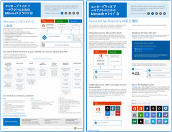
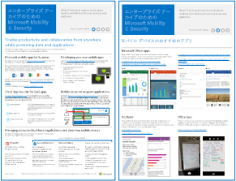
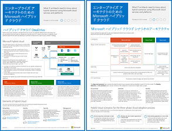
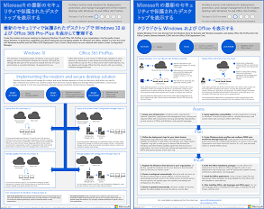

# Microsoft クラウド IT アーキテクチャのリソースMicrosoft Cloud IT architecture resources

 **概要:**Microsoft クラウド サービスおよびプラットフォームについて説明します。Enterprise Cloud ロードマップの確認、クラウド アーキテクチャ シリーズの検索、などを行います。**Summary:** Learn about Microsoft cloud services and platforms. Review our enterprise cloud roadmap, explore our cloud architecture series, and more.
  
以下のアーキテクチャ ツールおよびポスターでは、Office 365、Microsoft Azure、Microsoft Intune、Microsoft Dynamics 365、プライベート クラウドのデータ センター、オンプレミスとクラウドのハイブリッド ソリューションを含む Microsoft クラウド サービスおよびプラットフォームについての情報を提供します。IT 意思決定者と設計者はこれらのリソースを使用して、ワークロードの最適なソリューションを決定し、ID やセキュリティなどのコア インフラストラクチャ コンポーネントについて決定することができます。These architecture tools and posters give you information about Microsoft cloud services and platforms, including Office 365, Microsoft Azure, Microsoft Intune, Microsoft Dynamics 365, private cloud datacenter, and hybrid on-premises and cloud solutions. IT decision makers and architects can use these resources to determine the ideal solutions for their workloads and to make decisions about core infrastructure components such as identity and security. 
  
- **[Microsoft の Enterprise Cloud ロードマップ](microsoft-cloud-it-architecture-resources.md#roadmap)** (Sway)**[Microsoft's Enterprise Cloud Roadmap](microsoft-cloud-it-architecture-resources.md#roadmap)** (Sway)
    
- **[エンタープライズ アーキテクト シリーズ向けの Microsoft クラウド](microsoft-cloud-it-architecture-resources.md#cloudarch)****[Microsoft Cloud for Enterprise Architects Series](microsoft-cloud-it-architecture-resources.md#cloudarch)** 
    - [Microsoft クラウド サービスとプラットフォームのオプションMicrosoft Cloud Services and Platform Options](microsoft-cloud-it-architecture-resources.md#platformoptions)
    - [エンタープライズ アーキテクトのための Microsoft クラウド IDMicrosoft Cloud Identity for Enterprise Architects](microsoft-cloud-it-architecture-resources.md#identity)
    - [エンタープライズ アーキテクトのための Microsoft クラウドのセキュリティMicrosoft Cloud Security for Enterprise Architects](microsoft-cloud-it-architecture-resources.md#security)
    - [エンタープライズ アーキテクトのための Microsoft クラウド ネットワークMicrosoft Cloud Networking for Enterprise Architects](microsoft-cloud-it-architecture-resources.md#networking)
    - [エンタープライズ アーキテクトのための Microsoft Mobility および SecurityMicrosoft Mobility and Security for Enterprise Architects](microsoft-cloud-it-architecture-resources.md#mobility)
    - [エンタープライズ アーキテクトのための Microsoft クラウド ストレージMicrosoft Cloud Storage for Enterprise Architects](microsoft-cloud-it-architecture-resources.md#storage)
    - [エンタープライズ アーキテクトのための Microsoft ハイブリッド クラウドMicrosoft Hybrid Cloud for Enterprise Architects](microsoft-cloud-it-architecture-resources.md#hybrid)
    - [Microsoft Cloud の ContosoContoso in the Microsoft Cloud](microsoft-cloud-it-architecture-resources.md#contoso)
    
- **[Office 365 Enterprise ソリューション シリーズ](microsoft-cloud-it-architecture-resources.md#BKMK_o365solutions)**:**[Office 365 Enterprise Solution Series](microsoft-cloud-it-architecture-resources.md#BKMK_o365solutions)**:
    - [Office 365 の情報保護Information Protection for Office 365](microsoft-cloud-it-architecture-resources.md#BKMK_infoprotect)
    - [Office 365 の ID とデバイス保護Identity and Device Protection for Office 365](microsoft-cloud-it-architecture-resources.md#BKMK_O365IDP)
    - [Office 365 のファイル保護ソリューションFile Protection Solutions in Office 365](microsoft-cloud-it-architecture-resources.md#BKMK_O365fileprotect)
    - [Office 365 クライアントの管理に関する変更Change Management for Office 365 Clients](microsoft-cloud-it-architecture-resources.md#changemgmt)
    - [Microsoft の最新のセキュリティで保護されたデスクトップの展開Deploy a modern and secure desktop with Microsoft](microsoft-cloud-it-architecture-resources.md#msd)
    
> [!TIP]
> このページのポスターのほとんどは、中国語、英語、フランス語、ドイツ語、イタリア語、日本語、韓国語、ポルトガル語、ロシア語、スペイン語を含む複数の言語で提供されています。これらの言語のいずれかのポスターをダウンロードするには、ポスターの **[その他の言語]** リンクをクリックします。Most of the posters on this page are available in multiple languages, including Chinese, English, French, German, Italian, Japanese, Korean, Portuguese, Russian, and Spanish. To download a poster in one of these languages, click the **More languages** link for that poster.
  
ご意見を電子メールで [cloudadopt@microsoft.com](mailto:cloudadopt@microsoft.com) 宛てにお送りください。Let us know what you think! Send us email at [cloudadopt@microsoft.com](mailto:cloudadopt@microsoft.com). 
  

## Microsoft の Enterprise Cloud ロードマップMicrosoft's Enterprise Cloud Roadmap

業界で最も包括的なクラウド ソリューションを説明しているポスター、アイコン セット、コミュニティの場、その他のリソースを参照してください。See the posters, icon sets, community venues, and other resources that describe the industry's most complete cloud solution.
  
|**アイテム****Item**|**説明****Description**|
|:-----|:-----|
|[          ](https://aka.ms/cloudarchitecture)[          ](https://aka.ms/cloudarchitecture)   [Microsoft のエンタープライズ クラウド ロードマップ](https://aka.ms/cloudarchitecture) ((https://aka.ms/cloudarchitecture))[Microsoft's Enterprise Cloud Roadmap](https://aka.ms/cloudarchitecture) ((https://aka.ms/cloudarchitecture))   |この Sway エクスペリエンスを通して、業界で最も包括的なクラウド ソリューションを説明しているリソースをご確認ください。Swipe through this Sway experience for the resources that describe the industry's most complete cloud solution.    |
   

## エンタープライズ アーキテクト シリーズ向けの Microsoft クラウドMicrosoft Cloud for Enterprise Architects Series

これらのクラウド アーキテクチャ ポスターでは、Office 365、Microsoft Azure、Microsoft Intune、Microsoft Dynamics CRM Online、プライベート クラウドのデータ センター、オンプレミスとクラウドのハイブリッド ソリューションを含む Microsoft クラウド サービスおよびプラットフォームについての情報を提供します。IT 意思決定者と設計者はこれらのリソースを使用して、ワークロードの最適なソリューションを決定し、ID やセキュリティなどのコア インフラストラクチャ コンポーネントについて決定することができます。These cloud architecture posters give you information about Microsoft cloud services and platforms, including Office 365, Microsoft Azure, Microsoft Intune, Microsoft Dynamics CRM Online, private cloud datacenter, and hybrid on-premises and cloud solutions. IT decision makers and architects can use these resources to determine the ideal solutions for their workloads and to make decisions about core infrastructure components such as identity and security.
  

### Microsoft クラウド サービスとプラットフォームのオプションMicrosoft Cloud Services and Platform Options

各種の Microsoft クラウド サービスとプラットフォーム サービスの重要な相違点について説明します。ご使用のソリューションに最もよく合うものを見つけてください。Learn key differences between Microsoft cloud services and platform offerings. Find the best fit for your solution.
  
|**アイテム****Item**|**説明****Description**|
|:-----|:-----|
|[          ](https://www.microsoft.com/download/details.aspx?id=54432)[          ](https://www.microsoft.com/download/details.aspx?id=54432)   [PDF](https://go.microsoft.com/fwlink/p/?LinkId=524731)  \\[PDF](https://go.microsoft.com/fwlink/p/?LinkId=524731)  \\| [Visio](https://go.microsoft.com/fwlink/p/?LinkId=524732)  \\[Visio](https://go.microsoft.com/fwlink/p/?LinkId=524732)  \\| [その他の言語](https://www.microsoft.com/download/details.aspx?id=54432)[More languages](https://www.microsoft.com/download/details.aspx?id=54432)   | このモデルでは、次について説明します。This model describes: <ul><li>  Office 365 を含む、サービスとしてのソフトウェア (SaaS) 提供物Software as a Service (SaaS) offerings, including Office 365 </li><li>  Microsoft Azure における、サービスとしてのプラットフォーム (PaaS) 機能Platform as a Service (PaaS) features in Microsoft Azure </li><li>  Microsoft Azure における、サービスとしてのインフラストラクチャ (IaaS) 機能Infrastructure as a Service (IaaS) features in Microsoft Azure </li><li>  Windows Server および System Center を使用する、プライベート クラウドのデータセンター機能Private cloud datacenter capabilities using Windows Server and System Center </li><li>  Microsoft 社の IT 部門が、これらのクラウド サービスにどのように移行し、ハイブリッド クラウドをどのように構築しているかを学びます。Learn how Microsoft's own IT department is migrating to these cloud services and building its hybrid cloud. </li></ul> |
   

### エンタープライズ アーキテクトのための Microsoft クラウド IDMicrosoft Cloud Identity for Enterprise Architects

Microsoft クラウド サービスおよびプラットフォームを使用して、組織のためのアイデンティティを設計する上で IT アーキテクトが知る必要のある事柄。What IT architects need to know about designing identity for organizations using Microsoft cloud services and platforms.
  
|**アイテム****Item**|**説明****Description**|
|:-----|:-----|
|[          ](https://www.microsoft.com/download/details.aspx?id=54431)[          ](https://www.microsoft.com/download/details.aspx?id=54431)   [PDF](https://go.microsoft.com/fwlink/p/?LinkId=524586)  \\[PDF](https://go.microsoft.com/fwlink/p/?LinkId=524586)  \\| [Visio](https://download.microsoft.com/download/2/3/8/238228E6-9017-4F6C-BD3C-5559E6708F82/MSFT_cloud_architecture_identity.vsd)           \\[Visio](https://download.microsoft.com/download/2/3/8/238228E6-9017-4F6C-BD3C-5559E6708F82/MSFT_cloud_architecture_identity.vsd)           \\| [記事](https://technet.microsoft.com/library/mt613459.aspx)[Article](https://technet.microsoft.com/library/mt613459.aspx)   [その他の言語](https://www.microsoft.com/download/details.aspx?id=54431)[More languages](https://www.microsoft.com/download/details.aspx?id=54431)   | このモデルには次のものが含まれています。This model contains: <ul><li>Microsoft クラウドでの ID の使用についてIntroduction to identity with Microsoft’s cloud </li> <li>Azure AD IDaaS 機能Azure AD IDaaS capabilities </li><li>オンプレミスの Active Directory ドメイン サービス アカウントと Microsoft Azure Active Directory を統合するIntegrating on-premises Active Directory Domain Services accounts with Microsoft Azure Active Directory </li> <li>ディレクトリ コンポーネントを Azure に配置するPutting directory components in Azure </li><li>Azure IaaS のワークロードのドメイン サービス オプションDomain services options for workloads in Azure IaaS </li></ul>  |
   

### エンタープライズ アーキテクトのための Microsoft クラウドのセキュリティMicrosoft Cloud Security for Enterprise Architects

Microsoft クラウド サービスおよびプラットフォームにおけるセキュリティについて IT アーキテクトが知る必要のある事柄。What IT architects need to know about security in Microsoft cloud services and platforms.
  
|**アイテム****Item**|**説明****Description**|
|:-----|:-----|
|[          ](https://www.microsoft.com/download/details.aspx?id=48121)[          ](https://www.microsoft.com/download/details.aspx?id=48121)   [PDF](https://go.microsoft.com/fwlink/p/?linkid=842070)  \\[PDF](https://go.microsoft.com/fwlink/p/?linkid=842070)  \\| [Visio](https://go.microsoft.com/fwlink/p/?LinkId=842071)  \\[Visio](https://go.microsoft.com/fwlink/p/?LinkId=842071)  \\| [その他の言語](https://www.microsoft.com/download/details.aspx?id=48121)[More languages](https://www.microsoft.com/download/details.aspx?id=48121)   | このモデルには次のものが含まれています。This model contains: <ul><li>セキュリティで保護されたサービスとプラットフォームを提供するうえでの Microsoft の役割Microsoft's role in providing secure services and platforms</li><li>セキュリティ上のリスクを軽減するためのお客様の責任範囲Customer responsibilities to mitigate security risks</li><li>最高度のセキュリティ証明Top security certifications </li><li>Microsoft コンサルティング サービスによって提供されるセキュリティ ソリューションSecurity offerings provided by Microsoft consulting services </ul></li>このアーキテクチャ ポスターに基づく Microsoft Virtual Academy コースである「[クラウド対応世界のセキュリティ](https://mva.microsoft.com/training-courses/security-in-a-cloudenabled-world-12725?l=CfLHobAcB_3904300474)」を受講してください。Take [Security in a Cloud-Enabled World](https://mva.microsoft.com/training-courses/security-in-a-cloudenabled-world-12725?l=CfLHobAcB_3904300474), a Microsoft Virtual Academy course based on this architecture poster.  |
   

### エンタープライズ アーキテクトのための Microsoft クラウド ネットワークMicrosoft Cloud Networking for Enterprise Architects

Microsoft クラウド サービスおよびプラットフォームのネットワーキングに関して IT アーキテクトが知る必要のある事柄。What IT architects need to know about networking for Microsoft cloud services and platforms.
  
|**アイテム****Item**|**説明****Description**|
|:-----|:-----|
|[          ](https://www.microsoft.com/download/details.aspx?id=54425)[          ](https://www.microsoft.com/download/details.aspx?id=54425)   [PDF](https://go.microsoft.com/fwlink/p/?linkid=842073)  \\[PDF](https://go.microsoft.com/fwlink/p/?linkid=842073)  \\| [Visio](https://go.microsoft.com/fwlink/p/?linkid=842074)           \\[Visio](https://go.microsoft.com/fwlink/p/?linkid=842074)           \\| [記事](https://technet.microsoft.com/library/mt733214.aspx)[Article](https://technet.microsoft.com/library/mt733214.aspx)  [その他の言語](https://www.microsoft.com/download/details.aspx?id=54425)[More languages](https://www.microsoft.com/download/details.aspx?id=54425)   | このモデルには以下のページが含まれています。This model contains the following pages: <ul><li> **クラウド接続用のネットワークの進化**: クラウド移行によって、企業ネットワークの内外でのトラフィック フローの容量と特性が変化します。また、セキュリティ リスクを軽減するためのアプローチにも影響します。**Evolving your network for cloud connectivity** Cloud migration changes the volume and nature of traffic flows within and outside a corporate network. It also affects approaches to mitigating security risk. </li><li> **Microsoft クラウド接続の一般的な要素**: ネットワーキングと Microsoft クラウドの統合によって、広範なサービスへの最適なアクセスが提供されます。**Common elements of Microsoft cloud connectivity** Integrating your networking with the Microsoft cloud provides optimal access to a broad range of services. </li><li> **Microsoft クラウド接続用の ExpressRoute** ExpressRoute は、Microsoft のクラウドへのプライベートで専用の高スループットなネットワーク接続を提供します。**ExpressRoute for Microsoft cloud connectivity** ExpressRoute provides a private, dedicated, high-throughput network connection to Microsoft's cloud. </li><li> **Microsoft SaaS (Office 365、Microsoft Intune、および Dynamics CRM Online) 用ネットワーキングの設計**: Microsoft SaaS サービス用のネットワークを最適化するには、インターネット エッジ、クライアント デバイス、および標準の IT 運用を慎重に分析する必要があります。**Designing networking for Microsoft SaaS (Office 365, Microsoft Intune, and Dynamics CRM Online)** Optimizing your network for Microsoft SaaS services requires careful analysis of your Internet edge, your client devices, and typical IT operations. </li><li> **Azure PaaS 用のネットワーキングの設計**: Azure PaaS アプリ用のネットワーキングを最適化するには、適切なインターネット帯域幅が必要であり、複数のサイトまたはアプリにまたがるネットワーク トラフィックの分散が必要とされる可能性があります。**Designing networking for Azure PaaS** Optimizing networking for Azure PaaS apps requires adequate Internet bandwidth and can require the distribution of network traffic across multiple sites or apps. </li><li> **Azure IaaS のネットワークの設計** サブネット、アドレス空間、ルーティング、DNS、負荷分散や、オンプレミスのネットワーク、その他の VNet、インターネットなどへの接続など、サーバーベースの IT ワークロードをホストするために最適な Azure 仮想ネットワーク (VNet) を作成するには、設計プロセスを実行します。**Designing networking for Azure IaaS** Step through the design process to create an optimal Azure virtual network (VNet) for hosting server-based IT workloads, including subnets, address spaces, routing, DNS, load balancing, and connectivity to your on-premises network, other VNets, and the Internet. </li></ul>   このアーキテクチャ ポスターに基づく新しい Microsoft Virtual Academy コースである「[Microsoft クラウド サービスに合わせてネットワークを最適化する](https://aka.ms/optimizecloudnetworkingmva)」を受講してください。Take [Optimize Your Network for Microsoft Cloud Offerings](https://aka.ms/optimizecloudnetworkingmva), a new Microsoft Virtual Academy course based on this architecture poster.   |
   

### エンタープライズ アーキテクトのための Microsoft Mobility および SecurityMicrosoft Mobility and Security for Enterprise Architects

Microsoft クラウド サービスおよびプラットフォームによるモビリティについて IT アーキテクトが知る必要のある事柄。What IT architects need to know about mobility with Microsoft cloud services and platforms.
  
|**アイテム****Item**|**説明****Description**|
|:-----|:-----|
|[          ](https://www.microsoft.com/download/details.aspx?id=55023)[          ](https://www.microsoft.com/download/details.aspx?id=55023)   [PDF](https://go.microsoft.com/fwlink/p/?linkid=842076)  \\[PDF](https://go.microsoft.com/fwlink/p/?linkid=842076)  \\| [Visio](https://go.microsoft.com/fwlink/p/?linkid=842077)  \\[Visio](https://go.microsoft.com/fwlink/p/?linkid=842077)  \\| [その他の言語](https://www.microsoft.com/download/details.aspx?id=55023)[More languages](https://www.microsoft.com/download/details.aspx?id=55023)   | このモデルには次のものが含まれています。This model contains: <ul><li>ビジネス向け上位モバイル アプリTop mobile apps for business </li><li>モバイル アプリの開発用プラットフォーム、サービス、およびリソースPlatform, services, and resources for developing mobile apps </li><li>モバイル デバイスからクラウドベースのアプリケーションおよびデータへのアクセスの管理Managing access to cloud-based applications and data from mobile devices </li><li>Office 365 MDM、Azure Active Directory Premium、および Intune の機能の比較とプラットフォーム サポートComparison of capabilities and platform support for Office 365 MDM, Azure Active Directory Premium, and Intune </li></ul>  |
   

### エンタープライズ アーキテクトのための Microsoft クラウド ストレージMicrosoft Cloud Storage for Enterprise Architects

Microsoft クラウド サービスおよびプラットフォームにおけるストレージ オプションについて IT アーキテクトが知る必要のある事柄。What IT architects need to know about storage options in Microsoft cloud services and platforms.
  
|**アイテム****Item**|**説明****Description**|
|:-----|:-----|
|[          ](https://www.microsoft.com/download/details.aspx?id=49552)[          ](https://www.microsoft.com/download/details.aspx?id=49552)   [PDF](https://go.microsoft.com/fwlink/p/?linkid=842079)  \\[PDF](https://go.microsoft.com/fwlink/p/?linkid=842079)  \\| [Visio](https://go.microsoft.com/fwlink/p/?linkid=842080)           \\[Visio](https://go.microsoft.com/fwlink/p/?linkid=842080)           \\| [記事](hhttps://technet.microsoft.com/library/mt842597.aspx)[Article](hhttps://technet.microsoft.com/library/mt842597.aspx)  [その他の言語](https://www.microsoft.com/download/details.aspx?id=49552)[More languages](https://www.microsoft.com/download/details.aspx?id=49552)   | このモデルには次のものが含まれています。This model contains: <ul><li>クラウド ストレージを使用する理由と主なシナリオReasons for using cloud storage and the key scenarios </li><li>既存のサービスに付属している、事前にパッケージ化されたクラウド ストレージ オプションCloud storage options that are bundled with existing services </li><li>使用するストレージ ソリューションの開始点として使用できるストレージ オプションStorage options that you can use as a starting point for your storage solution </li><li>独自のストレージ ソリューションまたはアプリ用のストレージを作成するためのストレージ構築ブロックStorage building blocks to create your own storage solution or storage for your apps</li></ul> |
   

### エンタープライズ アーキテクトのための Microsoft ハイブリッド クラウドMicrosoft Hybrid Cloud for Enterprise Architects

Microsoft のサービスとプラットフォーム用のハイブリッド クラウドに関して IT アーキテクトが知る必要のある事柄。What IT architects need to know about hybrid cloud for Microsoft services and platforms.
  
|**アイテム****Item**|**説明****Description**|
|:-----|:-----|
|[          ](https://www.microsoft.com/download/details.aspx?id=54424)[          ](https://www.microsoft.com/download/details.aspx?id=54424)   [PDF](https://go.microsoft.com/fwlink/p/?linkid=842082)  \\[PDF](https://go.microsoft.com/fwlink/p/?linkid=842082)  \\| [Visio](https://go.microsoft.com/fwlink/p/?linkid=842083)           \\[Visio](https://go.microsoft.com/fwlink/p/?linkid=842083)           \\| [記事](https://technet.microsoft.com/library/mt750500.aspx)[Article](https://technet.microsoft.com/library/mt750500.aspx)  [その他の言語](https://www.microsoft.com/download/details.aspx?id=54424)[More languages](https://www.microsoft.com/download/details.aspx?id=54424)   | このモデルには以下のページが含まれています。This model contains the following pages: <ul><li> **ハイブリッド クラウドの概要** Microsoft のクラウド サービス (SaaS、Azure PaaS、そして Azure IaaS) とそれらの共通の要素。**Hybrid cloud overview** Microsoft's cloud offerings (SaaS, Azure PaaS, and Azure IaaS) and their common elements. </li><li> **Microsoft ハイブリッド クラウド シナリオのアーキテクチャ** Microsoft のクラウド製品のハイブリッド クラウドのアーキテクチャ ダイアグラム。オンプレミス インフラストラクチャ、ネットワーク、および ID の共通レイヤーを示します。**Architecture of Microsoft hybrid cloud scenarios** An architectural diagram of hybrid cloud for Microsoft's cloud offerings, showing the common layers of on-premises infrastructure, networking, and identity. </li><li> **Microsoft SaaS (Office 365) のハイブリッド クラウド シナリオ** SaaS ハイブリッド シナリオ アーキテクチャと、Skype for Business、SharePoint Server、そして Exchange Server の主要なハイブリッド構成の説明。**Hybrid cloud scenarios for Microsoft SaaS (Office 365)** The SaaS hybrid scenario architecture and descriptions of key hybrid configurations for Skype for Business, SharePoint Server, and Exchange Server. </li><li> **Azure PaaS のハイブリッド クラウド シナリオ** Azure PaaS ハイブリッド シナリオのアーキテクチャ、および Azure PaaS ハイブリッド アプリケーションの説明とその例、および SQL Server 2016 Stretch Database の説明。**Hybrid cloud scenarios for Azure PaaS** The Azure PaaS hybrid scenario architecture, the description of an Azure PaaS hybrid application with an example, and the description of SQL Server 2016 Stretch Database. </li><li> **Azure IaaS のハイブリッド クラウド シナリオ** Azure IaaS ハイブリッド シナリオのアーキテクチャ、および Azure IaaS でホストされる基幹業務 (LOB) アプリケーションの説明。**Hybrid cloud scenarios for Azure IaaS** The Azure IaaS hybrid scenario architecture and the description of a line of business (LOB) application hosted in Azure IaaS. </li></ul> |
   

### Microsoft Cloud の ContosoContoso in the Microsoft Cloud

架空ではありますが代表的な世界規模の組織が Microsoft のクラウド商品 (Office 365、Azure、Dynamics 365、および Intune を含む) を実装している方法を示します。How a fictional but representative global organization has implemented Microsoft's cloud offerings, including Office 365, Azure, Dynamics 365, and Intune.
  
|**アイテム****Item**|**説明****Description**|
|:-----|:-----|
|[          ](https://www.microsoft.com/download/details.aspx?id=54427)[          ](https://www.microsoft.com/download/details.aspx?id=54427)   [PDF](https://go.microsoft.com/fwlink/p/?linkid=842085)  \\[PDF](https://go.microsoft.com/fwlink/p/?linkid=842085)  \\| [Visio](https://go.microsoft.com/fwlink/p/?linkid=842086)           \\[Visio](https://go.microsoft.com/fwlink/p/?linkid=842086)           \\| [記事](https://technet.microsoft.com/library/mt775341.aspx)[Article](https://technet.microsoft.com/library/mt775341.aspx)  [その他の言語](https://www.microsoft.com/download/details.aspx?id=54427)[More languages](https://www.microsoft.com/download/details.aspx?id=54427)   |このモデルには次のものが含まれています。This model contains: <ul><li>Contoso Corporation の概要Overview of the Contoso Corporation </li><li>Contoso 社の IT インフラストラクチャおよびニーズContoso's IT infrastructure and needs </li><li>Contoso 社のクラウド ネットワークCloud networking for Contoso</li><li>Contoso 社のクラウド IDCloud identity for Contoso</li><li>Contoso 社のサブスクリプション、ライセンス、およびユーザー アカウントContoso's subscriptions, licenses, and user accounts</li><li>Contoso 社のクラウドのセキュリティCloud security for Contoso</li><li>Contoso 社のエンタープライズ クラウドのシナリオEnterprise cloud scenarios for Contoso</li></ul>  |
   

### サンタ クラウドThe Santa Cloud

サンタと仲間の小さな妖精たちが Microsoft のクラウド ソリューションを使用して年ごとの配達を行う方法を説明します。How Santa and his elves use Microsoft's cloud offerings to make their annual deliveries.
  
|**アイテム****Item**|**説明****Description**|
|:-----|:-----|
|[          ](https://www.microsoft.com/download/details.aspx?id=55039)[          ](https://www.microsoft.com/download/details.aspx?id=55039)   [PDF](https://go.microsoft.com/fwlink/p/?linkid=842088)[PDF](https://go.microsoft.com/fwlink/p/?linkid=842088)   |悪い子と良い子を判別して 12 月 24 日にプレゼントを配る対象を決めるため、サンタクロースと仲間の小さな妖精たちの IT 部門は Office 365、Azure、Dynamics 365、Intune を使用します。To determine who is naughty and nice and the presents to deliver on December 24, Santa Claus and his elfin IT department use Office 365, Azure, Dynamics 365, and Intune.   |
   

## Office 365 Enterprise ソリューション シリーズOffice 365 Enterprise Solution Series

Office 365 Enterprise ソリューション シリーズには、Office 365 の機能、特にざまざまなプラットフォームで使える機能を実装するためのガイダンスが用意されています。The Office 365 enterprise solution series provides guidance for implementing Office 365 capabilities, especially where capabilities cross technologies.
  

### Office 365 の情報保護Information Protection for Office 365

企業資産を保護する、エンタープライズ組織向けの機能です。Capabilities for enterprise organizations to protect corporate assets.
  
|**アイテム****Item**|**説明****Description**|
|:-----|:-----|
|[          ](https://www.microsoft.com/download/details.aspx?id=54429)[          ](https://www.microsoft.com/download/details.aspx?id=54429)   [PDF](http://download.microsoft.com/download/2/3/D/23D91386-8349-4F7A-9470-FD5AED861F16/MSFT_cloud_architecture_informationprotection.pdf)  \\[PDF](http://download.microsoft.com/download/2/3/D/23D91386-8349-4F7A-9470-FD5AED861F16/MSFT_cloud_architecture_informationprotection.pdf)  \\| [Visio](http://download.microsoft.com/download/2/3/D/23D91386-8349-4F7A-9470-FD5AED861F16/MSFT_cloud_architecture_informationprotection.vsd)  \\[Visio](http://download.microsoft.com/download/2/3/D/23D91386-8349-4F7A-9470-FD5AED861F16/MSFT_cloud_architecture_informationprotection.vsd)  \\| [その他の言語](https://www.microsoft.com/download/details.aspx?id=54429)[More languages](https://www.microsoft.com/download/details.aspx?id=54429)   |Microsoft は、企業資産を保護する最も包括的な機能のセットを提供します。このモデルは、組織が導入する機能を計画する際に、系統的なアプローチを行うのに役立ちます。Microsoft provides the most complete set of capabilities to protect your corporate assets. This model helps organizations take a methodical approach when planning which capabilities to implement.   |
   

### Office 365 の ID とデバイス保護Identity and Device Protection for Office 365

Office 365、他の SaaS サービス、および Azure AD アプリケーション プロキシで公開したオンプレミス アプリケーションにアクセスする ID とデバイスを保護するために推奨される機能。Recommended capabilities for protecting identities and devices that access Office 365, other SaaS services, and on-premises applications published with Azure AD Application Proxy.
  
|**アイテム****Item**|**説明****Description**|
|:-----|:-----|
|[          ](https://www.microsoft.com/download/details.aspx?id=55032)[          ](https://www.microsoft.com/download/details.aspx?id=55032)   [PDF](https://go.microsoft.com/fwlink/p/?linkid=841656)  \\[PDF](https://go.microsoft.com/fwlink/p/?linkid=841656)  \\| [Visio](https://go.microsoft.com/fwlink/p/?linkid=841657)  \\[Visio](https://go.microsoft.com/fwlink/p/?linkid=841657)  \\| [その他の言語](https://www.microsoft.com/download/details.aspx?id=55032)[More languages](https://www.microsoft.com/download/details.aspx?id=55032)   |データ、ID、デバイス全体で一貫したレベルの保護を使用することが重要です。このドキュメントでは、ID とデバイスを保護する機能に関する詳細情報に、どの機能が相当するのかを説明します。It's important to use consistent levels of protection across your data, identities, and devices. This document shows you which capabilities are comparable with more information on capabilities to protect identities and devices.    |
   

### Office 365 のファイル保護ソリューションFile Protection Solutions in Office 365

Office 365 のファイル保護のために推奨される機能は、3 段階の秘密度レベルに基づいています。Recommended capabilities for protecting files in Office 365 based on three different sensitivity levels.
  
|**アイテム****Item**|**説明****Description**|
|:-----|:-----|
|[          ](https://www.microsoft.com/download/details.aspx?id=55523)[          ](https://www.microsoft.com/download/details.aspx?id=55523)   [PDF](http://download.microsoft.com/download/7/8/9/789645A5-BD10-4541-BC33-F8D1EFF5E911/MSFT_cloud_architecture_O365 file protection.pdf)  \\[PDF](http://download.microsoft.com/download/7/8/9/789645A5-BD10-4541-BC33-F8D1EFF5E911/MSFT_cloud_architecture_O365 file protection.pdf)  \\| [Visio](http://download.microsoft.com/download/7/8/9/789645A5-BD10-4541-BC33-F8D1EFF5E911/MSFT_cloud_architecture_O365%20file%20protection.vsdx)[Visio](http://download.microsoft.com/download/7/8/9/789645A5-BD10-4541-BC33-F8D1EFF5E911/MSFT_cloud_architecture_O365%20file%20protection.vsdx)   |データ、ID、デバイス全体で一貫したレベルの保護を使用することが重要です。このドキュメントでは、Office 365 のファイルを保護する機能に関する詳細情報に、どの機能が相当するのかを説明します。It's important to use consistent levels of protection across your data, identities, and devices. This document shows you which capabilities are comparable with more information on capabilities to protect files in Office 365.    |
   

### Office 365 クライアントの管理に関する変更Change Management for Office 365 Clients

Office 365 クライアント アプリケーションと Windows 10 のリリースの管理に関して IT アーキテクトが知る必要のある事柄。What IT architects need to know about managing releases for the Office 365 client applications and Windows 10. 
  
|**アイテム****Item**|**説明****Description**|
|:-----|:-----|
|[          ](https://www.microsoft.com/download/details.aspx?id=49141)[          ](https://www.microsoft.com/download/details.aspx?id=49141)   [PDF](https://go.microsoft.com/fwlink/p/?LinkId=626681)  \\[PDF](https://go.microsoft.com/fwlink/p/?LinkId=626681)  \\| [Visio](https://go.microsoft.com/fwlink/p/?LinkId=626680)           \\[Visio](https://go.microsoft.com/fwlink/p/?LinkId=626680)           \\| [記事](https://technet.microsoft.com/library/mt584223.aspx)[Article](https://technet.microsoft.com/library/mt584223.aspx)  [その他の言語](https://www.microsoft.com/download/details.aspx?id=49141)[More languages](https://www.microsoft.com/download/details.aspx?id=49141)   | このモデルには次のものが含まれています。This model contains: <ul><li>Windows 10 と Office 365 クライアント アプリケーション用のサービス提供モデルThe servicing model for Windows 10 and the Office 365 client applications </li><li>  リリース オプションRelease Options </li><li>  リリース ケーデンスRelease Cadences </li><li>  変更の種類Types of Changes </li><li>  役割と責任Roles and Responsibilities </li><li>  更新プログラムの展開の管理Manage Update Deployments </li></ul>   記事の形式で情報を表示: [Office 365 クライアントの変更管理](http://technet.microsoft.com/library/815fa1aa-0355-40b5-b7bc-cdf7d4610062.aspx)View the information in article form: [Change management for Office 365 clients](http://technet.microsoft.com/library/815fa1aa-0355-40b5-b7bc-cdf7d4610062.aspx).    |
   

### Microsoft の最新のセキュリティで保護されたデスクトップの展開Deploy a modern and secure desktop with Microsoft

Windows 10 での Office 365 ProPlus の更新プログラムの展開と管理について IT アーキテクトが知る必要のある事柄。What IT architects need to know about deploying and managing updates for Office 365 ProPlus on Windows 10.
  
|**アイテム****Item**|**説明****Description**|
|:-----|:-----|
|[          ](https://www.microsoft.com/download/details.aspx?id=55987)[          ](https://www.microsoft.com/download/details.aspx?id=55987)   [PDF](http://download.microsoft.com/download/4/E/9/4E90E227-770A-41D1-99FE-925A64D81A55/MSFT_modern_secure_desktop.pdf)  \\[PDF](http://download.microsoft.com/download/4/E/9/4E90E227-770A-41D1-99FE-925A64D81A55/MSFT_modern_secure_desktop.pdf)  \\| [Visio](http://download.microsoft.com/download/4/E/9/4E90E227-770A-41D1-99FE-925A64D81A55/MSFT_modern_secure_desktop.vsdx)[Visio](http://download.microsoft.com/download/4/E/9/4E90E227-770A-41D1-99FE-925A64D81A55/MSFT_modern_secure_desktop.vsdx)   | このモデルには次のものが含まれています。This model contains: <ul><li>  Microsoft Cloud から Windows 10 と Office ProPlus を展開するDeploying Windows 10 and Office ProPlus from the Microsoft cloud </li><li>  System Center Configuration Manager を使用して Windows 10 と Office ProPlus を展開するDeploying Windows 10 and Office ProPlus with System Center Configuration Manager </li><li>  Microsoft Cloud から Windows 10 と Office ProPlus の更新プログラムを管理するManaging updates for Windows 10 and Office ProPlus from the Microsoft cloud </li><li>  System Center Configuration Manager を使用して Windows 10 と Office ProPlus の更新プログラムを管理するManaging updates for Windows 10 and Office ProPlus with System Center Configuration Manager </li><li>  Windows 10 のすぐに使用可能な追加保護機能Out-of-the-box and additional protection capabilities of Windows 10 </li></ul>  |
   
## 関連項目See Also

[SharePoint、Exchange、Skype for Business、Lync のアーキテクチャ モデルArchitectural models for SharePoint, Exchange, Skype for Business, and Lync](architectural-models-for-sharepoint-exchange-skype-for-business-and-lync.md)
  
[クラウド導入のテスト ラボ ガイド (TLG)Cloud adoption Test Lab Guides (TLGs)](cloud-adoption-test-lab-guides-tlgs.md)
  
[セキュリティ ソリューションSecurity solutions](security-solutions.md)
  
[ハイブリッド ソリューションHybrid solutions](hybrid-solutions.md)

