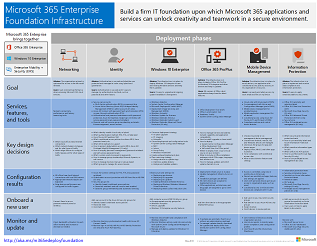

# Microsoft クラウド IT アーキテクチャのリソース

これらのアーキテクチャツールおよびポスターには、microsoft 365、Windows 10、Azure Active Directory、Microsoft Intune、Microsoft Dynamics 365、ハイブリッドオンプレミスおよびクラウドソリューションなどの Microsoft クラウドサービスに関する情報が提供されています。 IT 意思決定者と設計者はこれらのリソースを使用して、ワークロードの最適なソリューションを決定し、ID やセキュリティなどのコア インフラストラクチャ コンポーネントについて決定することができます。 
  
<!--**[Microsoft's Enterprise Cloud Roadmap](microsoft-cloud-it-architecture-resources.md#roadmap)** (Sway) -->
    
- **[エンタープライズ アーキテクト シリーズ向けの Microsoft クラウド](microsoft-cloud-it-architecture-resources.md#cloudarch)** 
    <!-- [Microsoft Cloud Services and Platform Options](microsoft-cloud-it-architecture-resources.md#platformoptions) -->
    - [エンタープライズ アーキテクトのための Microsoft クラウド ID](microsoft-cloud-it-architecture-resources.md#identity)
    - [エンタープライズ アーキテクトのための Microsoft クラウドのセキュリティ](microsoft-cloud-it-architecture-resources.md#security)
    - [エンタープライズ アーキテクトのための Microsoft Cloud ネットワーク](microsoft-cloud-it-architecture-resources.md#networking)
    - [エンタープライズ アーキテクトのための Microsoft ハイブリッド クラウド](microsoft-cloud-it-architecture-resources.md#hybrid)
    - [一般的な攻撃と、組織を保護する Microsoft の機能](#common-attacks-and-microsoft-capabilities-that-protect-your-organization)
    - [Microsoft 365 Enterprise の基礎インフラストラクチャ](#m365foundationinfra)
    - [Microsoft のクラウド テナント間の移行のためのアーキテクチャ手法](#architecture-approaches-for-microsoft-cloud-tenant-to-tenant-migrations)
    
- **[Microsoft 365 Enterprise ソリューション シリーズ](microsoft-cloud-it-architecture-resources.md#BKMK_o365solutions)**:
    - [IT アーキテクト向け Microsoft 365 の Microsoft Teams と関連生産性サービス](#microsoft-teams-and-related-productivity-services-in-microsoft-365-for-it-architects)
    - [IT アーキテクト向け Microsoft 365 のグループ](#groups-in-microsoft-365-for-it-architects)
    - [多地域組織向けのセキュリティと情報保護](#security-and-information-protection-for-multi-region-organizations)
    - [Office 365 の ID とデバイス保護](microsoft-cloud-it-architecture-resources.md#BKMK_O365IDP)
    - [Office 365 のファイル保護ソリューション](microsoft-cloud-it-architecture-resources.md#BKMK_O365fileprotect)
    - [GDPR のための Office 365 の情報保護](#office-365-information-protection-for-gdpr)
    - [選挙運動、非営利組織、およびその他のアジャイル組織のための Microsoft Security ガイダンス](#microsoft-security-guidance-for-political-campaigns-nonprofits-and-other-agile-organizations)
    - [Microsoft テレフォニー ソリューション](#microsoft-telephony-solutions) 
    
ご意見を電子メールで [cloudadopt@microsoft.com](mailto:cloudadopt@microsoft.com) 宛てにお送りください。 

<!--

## Microsoft's Enterprise Cloud Roadmap

See the posters, icon sets, community venues, and other resources that describe the industry's most complete cloud solution.
  
|**Item**|**Description**|
|:-----|:-----|
|[          ](https://aka.ms/cloudarchitecture)   [Microsoft's Enterprise Cloud Roadmap](https://aka.ms/cloudarchitecture) (https://aka.ms/cloudarchitecture)   |Swipe through this Sway experience for the resources that describe the industry's most complete cloud solution.    |
-->
  

## エンタープライズ アーキテクト シリーズ向けの Microsoft クラウド

これらのクラウドアーキテクチャのポスターには、microsoft 365、Azure Active Directory、Microsoft Intune、Microsoft Dynamics CRM Online、ハイブリッドオンプレミスおよびクラウドソリューションなどの Microsoft クラウドサービスに関する情報が記載されています。 IT 意思決定者と設計者はこれらのリソースを使用して、ワークロードの最適なソリューションを決定し、ID やセキュリティなどのコア インフラストラクチャ コンポーネントについて決定することができます。

<!--  

### Microsoft Cloud Services and Platform Options

Learn key differences between Microsoft cloud services and platform offerings. Find the best fit for your solution.
  
|**Item**|**Description**|
|:-----|:-----|
|[          ](https://www.microsoft.com/download/details.aspx?id=54432)   [PDF](https://go.microsoft.com/fwlink/p/?LinkId=524731)  \| [Visio](https://go.microsoft.com/fwlink/p/?LinkId=524732)  \| [More languages](https://www.microsoft.com/download/details.aspx?id=54432)   | This model describes: <ul><li>  Software as a Service (SaaS) offerings, including Microsoft 365 </li><li>  Platform as a Service (PaaS) features in Microsoft Azure </li><li>  Infrastructure as a Service (IaaS) features in Microsoft Azure </li><li>  Private cloud datacenter capabilities using Windows Server and System Center </li><li>  Learn how Microsoft's own IT department is migrating to these cloud services and building its hybrid cloud. </li></ul> |
-->

   

### エンタープライズ アーキテクトのための Microsoft クラウド ID

Microsoft クラウド サービスおよびプラットフォームを使用して、組織のためのアイデンティティを設計する上で IT アーキテクトが知る必要のある事柄。
  
|**アイテム**|**説明**|
|:-----|:-----|
|[          ](https://www.microsoft.com/download/details.aspx?id=54431)   [PDF](https://go.microsoft.com/fwlink/p/?LinkId=524586)  \| [Visio](https://download.microsoft.com/download/2/3/8/238228E6-9017-4F6C-BD3C-5559E6708F82/MSFT_cloud_architecture_identity.vsd)           \| [その他の言語](https://www.microsoft.com/download/details.aspx?id=54431)   | このモデルには次のものが含まれています。 <ul><li>Microsoft のクラウド ID の概要 </li><li>Azure AD IDaaS 機能 </li><li>オンプレミスの Active Directory Domain Services アカウントと Microsoft Azure Active Directory を統合する </li><li>ディレクトリ コンポーネントを Azure に配置する </li><li>Azure IaaS のワークロードのドメイン サービス オプション </li></ul> |
   

### エンタープライズ アーキテクトのための Microsoft クラウドのセキュリティ

Microsoft クラウド サービスおよびプラットフォームにおけるセキュリティについて IT アーキテクトが知る必要のある事柄。
  
|**アイテム**|**説明**|
|:-----|:-----|
|[          ](https://www.microsoft.com/download/details.aspx?id=48121)   [PDF](https://go.microsoft.com/fwlink/p/?linkid=842070)  \| [Visio](https://go.microsoft.com/fwlink/p/?LinkId=842071)  \| [その他の言語](https://www.microsoft.com/download/details.aspx?id=48121)   | このモデルには次のものが含まれています。 <ul><li>安全なサービスとプラットフォームを提供することにおける Microsoft の役割</li><li>セキュリティ上のリスクを軽減するというお客様側の責任</li><li>最高位のセキュリティ認定 </li><li>Microsoft コンサルティング サービスが提供するセキュリティ サービス </ul> |
   

### エンタープライズ アーキテクトのための Microsoft Cloud ネットワーク

Microsoft クラウド サービスおよびプラットフォームのネットワーキングに関して IT アーキテクトが知る必要のある事柄。
  
|**アイテム**|**説明**|
|:-----|:-----|
|   [PDF](downloads/MSFT_cloud_architecture_networking.pdf)  \| [Visio](https://github.com/MicrosoftDocs/OfficeDocs-Enterprise/raw/live/Enterprise/downloads/MSFT_cloud_architecture_networking.vsdx)   | このモデルには次のものが含まれています。 <ul><li> クラウド接続のためのネットワークの進化 </li><li> Microsoft のクラウド接続の一般的な要素 </li><li> Microsoft クラウド接続のためのExpressRoute </li><li> Microsoft SaaS、Azure PaaS、および Azure IaaS のネットワークの設計 </li></ul>    |

### エンタープライズ アーキテクトのための Microsoft ハイブリッド クラウド

Microsoft のサービスとプラットフォーム用のハイブリッド クラウドに関して IT アーキテクトが知る必要のある事柄。
  
|**アイテム**|**説明**|
|:-----|:-----|
|   [PDF](downloads/MSFT_cloud_architecture_hybrid.pdf)  \| [Visio](https://github.com/MicrosoftDocs/OfficeDocs-Enterprise/raw/live/Enterprise/downloads/MSFT_cloud_architecture_hybrid.vsdx)  | このモデルには次のものが含まれています。 <ul><li> Microsoft のクラウド製品 (SaaS、Azure PaaS、Azure IaaS) とそれらの共通の要素。 </li><li> Microsoft のクラウド製品向けのハイブリッド クラウド アーキテクチャ </li><li> Microsoft SaaS (Microsoft 365)、Azure PaaS、および Azure IaaS のハイブリッドクラウドシナリオ </li></ul> |
   

### 一般的な攻撃と、組織を保護する Microsoft の機能
最も一般的なサイバー攻撃と、攻撃の各段階で Microsoft が組織を支援する方法について説明します。 

|**アイテム**|**説明**|
|:-----|:-----|
|   [PDF](https://download.microsoft.com/download/F/A/C/FACFC1E9-FA35-4DF1-943C-8D4237B4275B/MSFT_Cloud_architecture_security_commonattacks.pdf) \| [Visio](https://download.microsoft.com/download/F/A/C/FACFC1E9-FA35-4DF1-943C-8D4237B4275B/MSFT_Cloud_architecture_security_commonattacks.vsdx)   | このポスターは、一般的な攻撃の経路を示し、攻撃の各段階で攻撃者を阻止する機能について説明します。  |

### Microsoft 365 Enterprise の基盤インフラストラクチャ

展開を開始するための Microsoft 365 Enterprise の[基盤インフラストラクチャ](https://docs.microsoft.com/microsoft-365/enterprise/deploy-foundation-infrastructure)をひとめで確認できます。
  
|**Item**|**説明**|
|:-----|:-----|
|   [オンライン表示](https://aka.ms/m365efoundinfraposter) \| [PDF](https://github.com/MicrosoftDocs/microsoft-365-docs/raw/public/microsoft-365/media/deploy-foundation-infrastructure/Microsoft365EnterpriseFoundInfra.pdf)   | このポスターでは、目標、機能とツール、設計上の決定、構成結果、オンボード、および継続的な監視と更新の観点から、基盤インフラストラクチャの各フェーズについて要約します。  | 

### Microsoft のクラウド テナント間の移行のためのアーキテクチャ手法 
この一連のトピックでは、合併、買収、分割、および新しいクラウド テナントへの移行に導くその他のシナリオに対応する複数のアーキテクチャ手法を示します。 これらのトピックでは、計画の出発点となるガイダンスを提供します。

|**Item**|**説明**|
|:-----|:-----|
|   [PDF](downloads/Microsoft-365-tenant-to-tenant-migration.pdf) \| [Visio](https://github.com/MicrosoftDocs/OfficeDocs-Enterprise/raw/live/Enterprise/downloads/Microsoft-365-tenant-to-tenant-migration.vsdx)     |このモデルには次のものが含まれています。 <ul><li>アーキテクチャ手法のためのビジネス シナリオのマッピング。</li><li>設計上の考慮事項</li><li>単一イベントの移行のフロー</li><li>段階的な移行のフロー</li><li>テナント移動または分割フロー</li></ul>|

## Microsoft 365 Enterprise ソリューション シリーズ

Microsoft 365 Enterprise ソリューション シリーズには、Microsoft 365 の機能、特にざまざまなプラットフォームで使える機能を実装するためのガイダンスが用意されています。

### IT アーキテクト向け Microsoft 365 の Microsoft Teams と関連生産性サービス
Microsoft Teamsをリードする Microsoft 365 での生産性サービスの論理的なアーキテクチャ。

|**アイテム**|**説明**|
|:-----|:-----|
|   [PDF](downloads/msft-m365-teams-logical-architecture.pdf) \| [Visio](https://github.com/MicrosoftDocs/OfficeDocs-Enterprise/raw/live/Enterprise/downloads/msft-m365-teams-logical-architecture.vsdx)     |マイクロソフトは、連携してデータ ガバナンス、セキュリティ、およびコンプライアンス機能を備えたコラボレーション エクスペリエンスを提供する、一連の生産性サービスを提供しています。    この一連の図は、Microsoft Teams をはじめとする、エンタープライ ズアーキテクト向けの生産性サービスの論理アーキテクチャを概説したものです。|

### IT アーキテクト向け Microsoft 365 のグループ
IT アーキテクトが Microsoft 365 のグループについて知っておくべきこと

|**アイテム**|**説明**|
|:-----|:-----|
|   [PDF](downloads/msft-m365-groups.pdf) \| [Visio](https://github.com/MicrosoftDocs/OfficeDocs-Enterprise/raw/live/Enterprise/downloads/msft-m365-groups.vsdx) |これらの図は、さまざまな種類のグループがどのように作成および管理されているか、そしていくつかのガバナンスの推奨事項を詳述しています。|

### 多地域組織向けのセキュリティと情報保護
単一の Microsoft 365 テナントを使用する多地域組織向けのセキュリティと情報保護

|**項目**|**Description**|
|:-----|:-----|
|   [PDF](https://github.com/MicrosoftDocs/microsoft-365-docs/raw/public/microsoft-365/downloads/msft-security-info-protect-multi-region.pdf) \| [Visio](https://github.com/MicrosoftDocs/microsoft-365-docs/raw/public/microsoft-365/downloads/msft-security-info-protect-multi-region.vsdx) |グローバル組織で単一の Microsoft 365 テナントを使用することは、さまざまな理由で最適な選択肢と経験です。 ただし、多くのアーキテクトは、さまざまな地域でセキュリティおよび情報保護の目標を達成する方法に取り組んでいます。 このトピックでは、推奨事項について説明します。 |

   

### Office 365 の ID とデバイス保護

Office 365、他の SaaS サービス、および Azure AD アプリケーション プロキシで公開したオンプレミス アプリケーションにアクセスする ID とデバイスを保護するために推奨される機能。
  
|**アイテム**|**説明**|
|:-----|:-----|
|[          ](https://www.microsoft.com/download/details.aspx?id=55032)   [PDF](https://go.microsoft.com/fwlink/p/?linkid=841656)  \| [Visio](https://go.microsoft.com/fwlink/p/?linkid=841657)  \| [その他の言語](https://www.microsoft.com/download/details.aspx?id=55032)   |データ、ID、デバイス全体で一貫したレベルの保護を使用することが重要です。このドキュメントでは、ID とデバイスを保護する機能に関する詳細情報に、どの機能が相当するのかを説明します。    |
   

### Office 365 のファイル保護ソリューション

Office 365 のファイル保護のために推奨される機能は、3 段階の秘密度レベルに基づいています。
  
|**アイテム**|**説明**|
|:-----|:-----|
|[          ](https://www.microsoft.com/download/details.aspx?id=55523)   [PDF](https://go.microsoft.com/fwlink/?linkid=2004320)  \| [Visio](https://download.microsoft.com/download/7/8/9/789645A5-BD10-4541-BC33-F8D1EFF5E911/MSFT_cloud_architecture_O365%20file%20protection.vsdx)   |データ、ID、デバイス全体で一貫したレベルの保護を使用することが重要です。このドキュメントでは、Office 365 のファイルを保護する機能に関する詳細情報に、どの機能が相当するのかを説明します。    |
   

### GDPR のための Office 365 の情報保護

個人データの検出、分類、保護、および監視に規定された推奨事項。このソリューションでは、例として一般データ保護規制 (GDPR) を使用しますが、その他の多くの規制遵守のためにも同じ手順を適用することができます。

|**Item**|**説明**|
|:-----|:-----|
|    [PDF](https://download.microsoft.com/download/E/C/D/ECD5A339-EF10-4420-B3A9-99098884D716/MSFT_Cloud_architecture_information%20protection%20for%20GDPR.pdf) \| [Visio](https://download.microsoft.com/download/E/C/D/ECD5A339-EF10-4420-B3A9-99098884D716/MSFT_Cloud_architecture_information%20protection%20for%20GDPR.vsdx)    |このコンテンツを記事形式で表示するには、「[GDPR のための Office 365 の情報保護](https://docs.microsoft.com/Office365/SecurityCompliance/office-365-information-protection-for-gdpr)」を参照してください。      |

### 選挙運動、非営利組織、およびその他のアジャイル組織のための Microsoft Security ガイダンス 

このガイドでは、セキュリティで保護されたクラウド環境を実装する方法について説明します。このソリューション ガイダンスは、どのような組織でも使用できます。アジャイルな組織向けの、BYOD によるアクセスおよびゲスト アカウントに関する追加のヘルプが含まれています。このガイダンスは、独自の環境を設計するための開始点としてご利用ください。

|**Item**|**説明**|
|:-----|:-----|
|**選挙運動のための Microsoft Security ガイダンス**   [          ](https://download.microsoft.com/download/B/4/D/B4D520C3-4D0C-4B4D-BFB9-09F0651C2775/MSFT_Cloud_architecture_security%20for%20political%20campaigns.pdf)   [PDF](https://download.microsoft.com/download/B/4/D/B4D520C3-4D0C-4B4D-BFB9-09F0651C2775/MSFT_Cloud_architecture_security%20for%20political%20campaigns.pdf)  \| [Visio](https://download.microsoft.com/download/B/4/D/B4D520C3-4D0C-4B4D-BFB9-09F0651C2775/MSFT_Cloud_architecture_security%20for%20political%20campaigns.vsdx)   |このガイダンスでは、選挙運動を行う団体を例として使用しています。このガイダンスは、任意の環境を設計するための開始点としてご利用ください。    |
|**非営利組織のための Microsoft Security ガイダンス**   [          ](https://download.microsoft.com/download/9/4/3/94389612-C679-4061-8DF2-D9A15D72B65F/Microsoft_Cloud%20Architecture_Security%20for%20Nonprofits.pdf)   [PDF](https://download.microsoft.com/download/9/4/3/94389612-C679-4061-8DF2-D9A15D72B65F/Microsoft_Cloud%20Architecture_Security%20for%20Nonprofits.pdf)  \| [Visio](https://download.microsoft.com/download/9/4/3/94389612-C679-4061-8DF2-D9A15D72B65F/Microsoft_Cloud%20Architecture_Security%20for%20Nonprofits.vsdx)   |このガイドは、非営利組織用に少し改定されています。たとえば、Office 365 Nonprofit のプランについて言及しています。技術的なガイダンスは選挙運動のソリューション ガイドと同じです。    |

このガイダンスにはテスト ラボ ガイドが含まれます。詳細については、「[選挙運動、非営利組織、およびその他のアジャイル組織のための Microsoft Security ガイダンス](https://docs.microsoft.com/Office365/SecurityCompliance/microsoft-security-guidance-for-political-campaigns-nonprofits-and-other-agile-o)」を参照してください。

### Microsoft テレフォニー ソリューション

Microsoft では、Microsoft クラウド内の Teams の使用を開始する際に使用できるいくつかのオプションをサポートしています。このポスターは、どの Microsoft テレフォニー ソリューション (クラウド内の電話システムまたはオンプレミスのエンタープライズ ボイス) が組織のユーザーに適しているかを判断し、組織を公衆交換電話網 (PSTN) に接続する方法を決定するのに役立ちます。

  
[PDF](https://github.com/MicrosoftDocs/OfficeDocs-SkypeForBusiness/blob/live/Teams/downloads/telephony-solutions/microsoft-telephony-solutions-12-18.pdf) | [Visio](https://github.com/MicrosoftDocs/OfficeDocs-SkypeForBusiness/blob/live/Teams/downloads/telephony-solutions/microsoft-telephony-solutions-12-18.vsdx) 

詳細については、このポスターの記事を参照してください: [Microsoft テレフォニー ソリューション](https://docs.microsoft.com/SkypeForBusiness/hybrid/msft-telephony-solutions)。
  
## 関連項目

[SharePoint、Exchange、Skype for Business、Lync のアーキテクチャ モデル](architectural-models-for-sharepoint-exchange-skype-for-business-and-lync.md)
  
[Microsoft 365 Enterprise のテスト ラボ ガイド](https://docs.microsoft.com/microsoft-365/enterprise/m365-enterprise-test-lab-guides)
  
[ハイブリッド ソリューション](hybrid-solutions.md)

