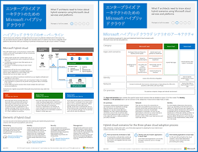

# エンタープライズ アーキテクトのための Microsoft ハイブリッド クラウド

 **概要:** Microsoft クラウド サービスおよびプラットフォームを使用するハイブリッド シナリオについて IT アーキテクトが知る必要のある内容。
  
この記事で取り上げられている一連のリンク記事では、Microsoft クラウド サービスとプラットフォームを使用したハイブリッド アーキテクチャと構成について、IT アーキテクトが知る必要のある事柄を説明します。この記事を 7 ページのポスターとして表示し、タブロイド形式 (レジャー、11 x 17、または A3 とも表される) で印刷することもできます。
  

  
[PDF](https://go.microsoft.com/fwlink/p/?linkid=842082) | [Visio](https://go.microsoft.com/fwlink/p/?linkid=842083) | 
[その他の言語](https://www.microsoft.com/download/details.aspx?id=54424)
  
すべての[マイクロソフトのクラウドの IT アーキテクチャのリソース](microsoft-cloud-it-architecture-resources.md)でモデルを表示しを機械に通す[マイクロソフトのエンタープライズ ・ クラウド ・ ロードマップ: IT 意思決定者のためのリソース](https://aka.ms/cloudarchitecture)。
  
次のセクションを参照してください。
  
- [ハイブリッド クラウドの概要](hybrid-cloud-overview.md)
    
    Microsoft のクラウド製品 (SaaS、Azure PaaS、Azure IaaS) とそれらの共通の要素。
    
- [Microsoft ハイブリッド クラウド シナリオのアーキテクチャ](architecture-of-microsoft-hybrid-cloud-scenarios.md)
    
    Microsoft のクラウド製品のハイブリッド クラウドのアーキテクチャ ダイアグラム。オンプレミス インフラストラクチャ、ネットワーク、ID の共通レイヤーを示します。
    
- [Microsoft SaaS (Office 365) のハイブリッド クラウド シナリオ](hybrid-cloud-scenarios-for-microsoft-saas-office-365.md)
    
    SaaS ハイブリッド シナリオ アーキテクチャと、Skype for Business、SharePoint Server、Exchange Server の主要なハイブリッド構成の説明。
    
- [Azure PaaS のハイブリッド クラウド シナリオ](hybrid-cloud-scenarios-for-azure-paas.md)
    
    Azure PaaS ハイブリッド シナリオのアーキテクチャ、Azure PaaS ハイブリッド アプリケーションの説明とその例、SQL Server 2016 Stretch Database の説明。
    
- [Azure IaaS のハイブリッド クラウド シナリオ](hybrid-cloud-scenarios-for-azure-iaas.md)
    
    Azure IaaS ハイブリッド シナリオのアーキテクチャ、および Azure IaaS でホストされる基幹業務 (LOB) アプリケーションの説明。
    
> [!NOTE]
> これらの記事は、「エンタープライズ アーキテクトのための Microsoft ハイブリッド クラウド」のポスターの **2017 年 6 月** リリースを反映しています。
  
## See Also

[Microsoft クラウド IT アーキテクチャのリソース](microsoft-cloud-it-architecture-resources.md)

[Microsoft's Enterprise Cloud Roadmap: Resources for IT Decision Makers](https://sway.com/FJ2xsyWtkJc2taRD)

