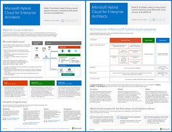

# エンタープライズ アーキテクトのための Microsoft ハイブリッド クラウドMicrosoft Hybrid Cloud for Enterprise Architects

 **概要:** Microsoft クラウド サービスおよびプラットフォームを使用するハイブリッド シナリオについて IT アーキテクトが知る必要のある内容。**Summary:** What IT architects need to know about hybrid scenarios using Microsoft cloud services and platforms.
  
この記事で取り上げられている一連のリンク記事では、Microsoft クラウド サービスとプラットフォームを使用したハイブリッド アーキテクチャと構成について、IT アーキテクトが知る必要のある事柄を説明します。この記事を 7 ページのポスターとして表示し、タブロイド形式 (レジャー、11 x 17、または A3 とも表される) で印刷することもできます。This article links you to a set of articles that describe what IT architects need to know about hybrid architecture and configurations with Microsoft cloud services and platforms. You can also view this article as a 7-page poster and print it in tabloid format (also known as ledger, 11 x 17, or A3).
  

  
[PDF](https://go.microsoft.com/fwlink/p/?linkid=842082) | [Visio](https://go.microsoft.com/fwlink/p/?linkid=842083) | 
[その他の言語](https://www.microsoft.com/download/details.aspx?id=54424)[PDF](https://go.microsoft.com/fwlink/p/?linkid=842082) | [Visio](https://go.microsoft.com/fwlink/p/?linkid=842083) | 
[More languages](https://www.microsoft.com/download/details.aspx?id=54424)
  
[Microsoft Cloud IT アーキテクチャのリソース](microsoft-cloud-it-architecture-resources.md)のすべてのモデルを表示することもできます。You can also see all of the models in the [Microsoft Cloud IT architecture resources](microsoft-cloud-it-architecture-resources.md) and swipe throughMicrosoft's Enterprise Cloud Roadmap: Resources for IT Decision Makers.
  
次のセクションを参照してください。See the following sections:
  
- [ハイブリッド クラウドの概要Hybrid cloud overview](hybrid-cloud-overview.md)
    
    Microsoft のクラウド製品 (SaaS、Azure PaaS、Azure IaaS) とそれらの共通の要素。Microsoft's cloud offerings (SaaS, Azure PaaS, and Azure IaaS) and their common elements.
    
- [Microsoft ハイブリッド クラウド シナリオのアーキテクチャArchitecture of Microsoft hybrid cloud scenarios](architecture-of-microsoft-hybrid-cloud-scenarios.md)
    
    Microsoft のクラウド製品のハイブリッド クラウドのアーキテクチャ ダイアグラム。オンプレミス インフラストラクチャ、ネットワーク、ID の共通レイヤーを示します。An architectural diagram of hybrid cloud for Microsoft's cloud offerings, showing the common layers of on-premises infrastructure, networking, and identity.
    
- [Microsoft SaaS (Office 365) のハイブリッド クラウド シナリオHybrid cloud scenarios for Microsoft SaaS (Office 365)](hybrid-cloud-scenarios-for-microsoft-saas-office-365.md)
    
    SaaS ハイブリッド シナリオ アーキテクチャと、Skype for Business、SharePoint Server、Exchange Server の主要なハイブリッド構成の説明。The SaaS hybrid scenario architecture and descriptions of key hybrid configurations for Skype for Business, SharePoint Server, and Exchange Server.
    
- [Azure PaaS のハイブリッド クラウド シナリオHybrid cloud scenarios for Azure PaaS](hybrid-cloud-scenarios-for-azure-paas.md)
    
    Azure PaaS ハイブリッド シナリオのアーキテクチャ、Azure PaaS ハイブリッド アプリケーションの説明とその例、SQL Server 2016 Stretch Database の説明。The Azure PaaS hybrid scenario architecture, the description of an Azure PaaS hybrid application with an example, and the description of SQL Server 2016 Stretch Database.
    
- [Azure IaaS のハイブリッド クラウド シナリオHybrid cloud scenarios for Azure IaaS](hybrid-cloud-scenarios-for-azure-iaas.md)
    
    Azure IaaS ハイブリッド シナリオのアーキテクチャ、および Azure IaaS でホストされる基幹業務 (LOB) アプリケーションの説明。The Azure IaaS hybrid scenario architecture and the description of a line of business (LOB) application hosted in Azure IaaS.
    
> [!NOTE]
> これらの記事は、「エンタープライズ アーキテクトのための Microsoft ハイブリッド クラウド」のポスターの **2017 年 6 月** リリースを反映しています。These articles reflect the **June 2017** release of the Microsoft Hybrid Cloud for Enterprise Architects poster.
  
## 関連項目See Also

[Microsoft クラウド IT アーキテクチャのリソースMicrosoft Cloud IT architecture resources](microsoft-cloud-it-architecture-resources.md)

[Microsoft's Enterprise Cloud Roadmap: Resources for IT Decision MakersMicrosoft's Enterprise Cloud Roadmap: Resources for IT Decision Makers](https://sway.com/FJ2xsyWtkJc2taRD)

