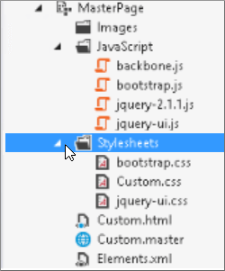

# SharePoint Online での縮小とバンドルMinification and bundling in SharePoint Online

この資料では、SharePoint Online 内のページの読み込みにかかる時間を短縮して HTTP 要求の数を減らすために縮小し、Web の基礎とテクニックのバンドルを使用する方法について説明します。This article describes how to use minification and bundling techniques with Web Essentials to reduce the number of HTTP requests and to reduce the time it takes to load pages in SharePoint Online.
  
Web サイトをカスタマイズする際、結局カスタマイズをサポートするために、サーバーに多数の余分なファイルが追加されてしまうことがあります。余分な JavaScript、CSS、および画像を追加すると、サーバーに対する HTTP 要求の数が増加し、結果として Web ページの表示にかかる時間が増加します。同種のファイルが複数ある場合、これらのファイルをバンドルすることにより、ファイルのダウンロードをさらに高速にすることができます。When you customize your website you can end up adding a large number of extra files to the server to support the customization. Adding extra JavaScript, CSS, and images increases the number of HTTP requests to the server which in turn increases the time it takes to display a web page. If you have multiple files of the same type, you can bundle these files to make downloading these files faster.
  
JavaScript、CSS ファイルでは、縮小、空白文字およびその他の必要のない文字を削除することによってファイルの合計サイズを小さくと呼ばれる手法を使用することもできます。For JavaScript and CSS files, you can also use an approach called minification, where you reduce the total size of files by removing whitespace and other characters that aren't necessary.
  
## Web Essentials による JavaScript ファイルと CSS ファイルの縮小とバンドルMinification and bundling JavaScript and CSS files with Web Essentials

Web Essentials などのサードパーティ製ソフトウェアを使用すると、CSS ファイルと JavaScript ファイルをバンドルできます。You can use third-party software such as Web Essentials to bundle CSS and JavaScript files.
  
> [!IMPORTANT]
> Web に関する重要事項は、サード ・ パーティ製、オープン ソース、コミュニティ ベースのプロジェクトです。ソフトウェアは、Visual Studio 2012 と 2013 の Visual Studio の拡張機能し、Microsoft ではサポートされていません。Web に関する重要事項をダウンロードするで web サイトを参照してください。 [http://vswebessentials.com/download](https://go.microsoft.com/fwlink/p/?LinkId=525629)。Web Essentials is a third-party, open-source, community-based project. The software is an extension to Visual Studio 2012 and Visual Studio 2013 and is not supported by Microsoft. To download Web Essentials, visit the website at [http://vswebessentials.com/download](https://go.microsoft.com/fwlink/p/?LinkId=525629). 
  
Web Essentials は、2 つの形式のバンドルを提供しています。Web Essentials offers two forms of bundling:
  
- .bundle:CSS ファイルと JavaScript ファイル用.bundle: for CSS and JavaScript files
    
- .sprite:画像用 (Visual Studio 2013 でのみ使用可能).sprite: for images (only available in Visual Studio 2013)
    
次のようなカスタム マスター ページの内部で参照されるブランド設定要素を持つ既存の機能がある場合は、Web Essentials を使用できます。You can use Web Essentials if you have an existing feature with some branding elements that are referenced inside a custom master page, such as:
  

  
 **Web Essentials の TE000127218 と CSS のバンドルを作成するには****To create a TE000127218 and CSS bundle in Web Essentials**
  
1. Visual Studio のソリューション エクスプローラーで、バンドルに含めるファイルを選択します。In Visual Studio, in Solution Explorer, select the files that you want to include in the bundle.
    
2. 選択したファイルを右クリックし、 **Web に関する重要事項**\>のコンテキスト メニューから**バンドル ファイルを作成する JavaScript** 。例えば：Right-click the selected files and then select **Web Essentials** \> **Create JavaScript bundle file** from the context menu. For example: 
    
    
  
## JavaScript ファイルと CSS ファイルのバンドルの結果を表示します。Viewing the results of bundling JavaScript and CSS files

JavaScript と CSS のバンドルを作成すると、Web Essentials はレシピ ファイルという XML ファイルを作成します。レシピ ファイルでは、JavaScript ファイルと CSS ファイルとともに、その他の構成情報が特定されています。When you create a JavaScript and CSS bundle, Web Essentials creates an XML file called a recipe file that identifies the JavaScript and CSS files as well as some other configuration information: 
  

  
また、バンドル レシピで minify フラグが true に設定されている場合、ファイルのサイズが減少するとともに、一緒にバンドルされます。つまり、マスター ページで参照できる、縮小された新しいバージョンの JavaScript ファイルが作成されたということです。In addition, if the minify flag is set to true in the bundling recipe the files are reduced in size as well as bundled together. This means that new, minified versions of the JavaScript files were created that you can reference in your master page.
  

  
Web サイトからページを読み込むとき、Internet Explorer 11 などの Web ブラウザーから、開発者向けのツールを使用して、サーバーに送信された要求の数と、各ファイルの読み込みにかかった時間を確認できます。When you load a page from your web site, you can use the developer tools from your web browser, such as Internet Explorer 11, to see the number of requests sent to the server and how long each file took to load.
  
次の図は、縮小する前に JavaScript および CSS ファイルを読み込んだ結果です。The following figure is the result of loading the JavaScript and CSS files before minification.
  

  
CSS ファイルと JavaScript ファイルを一緒にバンドルした後、要求数は 74 に減少し、各ファイルは、元のファイルを個別にダウンロードするより若干長く時間がかかっただけです。After bundling the CSS and JavaScript files together, the number of requests dropped to 74 and each file took only slightly longer than the original files to download individually:
  

  
バンドル後、JavaScript のバンドル ファイルは 815 KB から 365 KB と大幅に減少しています。After bundling, the JavaScript bundle file is reduced significantly from 815KB to 365KB:
  

  
## イメージ スプライトを作成して画像をバンドルするBundling images by creating an image sprite

JavaScript、CSS ファイルをバンドルする方法と同様より大きなスプライト シートに多数の小さいアイコンとその他の一般的なイメージを結合して個々 のイメージを表示するのには CSS を使用できます。各イメージをダウンロードするには、ユーザーの web ブラウザーはスプライト シートを 1 回ダウンロードし、し、それをローカル コンピューターにキャッシュします。ダウンロードし、web サーバーへのラウンド トリップの数を削減して、ページの読み込みのパフォーマンスが向上します。Similar to how you bundle JavaScript and CSS files, you can combine many small icons and other common images into a larger sprite sheet and then use CSS to reveal the individual images. Instead of downloading each individual image, the user's web browser downloads the sprite sheet once and then caches it on the local computer. This improves page load performance by cutting down on the number of downloads and round trips to the web server.
  
 **Web Essentials でイメージ スプライトを作成するには****To create an image sprite in Web Essentials**
  
1. Visual Studio のソリューション エクスプローラーで、バンドルに含めるファイルを選択します。In Visual Studio, in Solution Explorer, select the files that you want to include in the bundle.
    
2. 選択したファイルを右クリックし、 **Web に関する重要事項**\>のコンテキスト メニューから**画像のスプライトを作成**します。例えば：Right-click the selected files and then select **Web Essentials** \> **Create image sprite** from the context menu. For example: 
    
    
  
3. スプライト ファイルを保存する場所を選択します。.sprite ファイルは、スプライトの設定とファイルについて記述された XML ファイルです。次の図は、スプライト PNG ファイルとその対応する .sprite XML ファイルの例を示しています。Choose a location to save the sprite file. The .sprite file is an XML file that describes the settings and files in the sprite. The following figures show an example of a sprite PNG file and its corresponding .sprite XML file.
    
    
  
    
  

