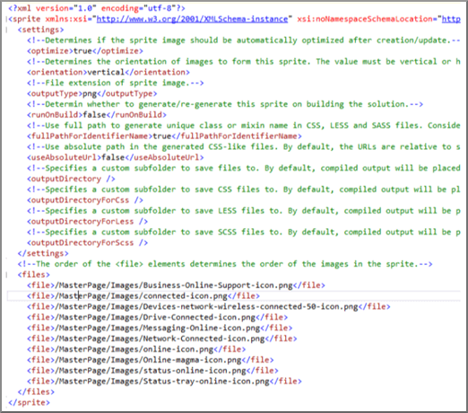

# SharePoint Online での縮小とバンドル

この資料では、SharePoint Online 内のページの読み込みにかかる時間を短縮して HTTP 要求の数を減らすために縮小し、Web の基礎とテクニックのバンドルを使用する方法について説明します。
  
Web サイトをカスタマイズする際、結局カスタマイズをサポートするために、サーバーに多数の余分なファイルが追加されてしまうことがあります。余分な JavaScript、CSS、および画像を追加すると、サーバーに対する HTTP 要求の数が増加し、結果として Web ページの表示にかかる時間が増加します。同種のファイルが複数ある場合、これらのファイルをバンドルすることにより、ファイルのダウンロードをさらに高速にすることができます。
  
JavaScript、CSS ファイルでは、縮小、空白文字およびその他の必要のない文字を削除することによってファイルの合計サイズを小さくと呼ばれる手法を使用することもできます。
  
## Web Essentials による JavaScript ファイルと CSS ファイルの縮小とバンドル

Web Essentials などのサードパーティ製ソフトウェアを使用すると、CSS ファイルと JavaScript ファイルをバンドルできます。
  
> [!IMPORTANT]
> Web に関する重要事項は、サード ・ パーティ製、オープン ソース、コミュニティ ベースのプロジェクトです。ソフトウェアは、Visual Studio 2012 と 2013 の Visual Studio の拡張機能し、Microsoft ではサポートされていません。Web に関する重要事項をダウンロードするで web サイトを参照してください。 [http://vswebessentials.com/download](https://go.microsoft.com/fwlink/p/?LinkId=525629)。 
  
Web Essentials は、2 つの形式のバンドルを提供しています。
  
- .bundle:CSS ファイルと JavaScript ファイル用
    
- .sprite:画像用 (Visual Studio 2013 でのみ使用可能)
    
次のようなカスタム マスター ページの内部で参照されるブランド設定要素を持つ既存の機能がある場合は、Web Essentials を使用できます。
  

  
 **Web Essentials の TE000127218 と CSS のバンドルを作成するには**
  
1. Visual Studio のソリューション エクスプローラーで、バンドルに含めるファイルを選択します。
    
2. 選択したファイルを右クリックし、 **Web に関する重要事項**\>のコンテキスト メニューから**バンドル ファイルを作成する JavaScript** 。例えば： 
    
    
  
## JavaScript ファイルと CSS ファイルのバンドルの結果を表示します。

JavaScript と CSS のバンドルを作成すると、Web Essentials はレシピ ファイルという XML ファイルを作成します。レシピ ファイルでは、JavaScript ファイルと CSS ファイルとともに、その他の構成情報が特定されています。 
  

  
また、バンドル レシピで minify フラグが true に設定されている場合、ファイルのサイズが減少するとともに、一緒にバンドルされます。つまり、マスター ページで参照できる、縮小された新しいバージョンの JavaScript ファイルが作成されたということです。
  

  
Web サイトからページを読み込むとき、Internet Explorer 11 などの Web ブラウザーから、開発者向けのツールを使用して、サーバーに送信された要求の数と、各ファイルの読み込みにかかった時間を確認できます。
  
次の図は、縮小する前に JavaScript および CSS ファイルを読み込んだ結果です。
  

  
CSS ファイルと JavaScript ファイルを一緒にバンドルした後、要求数は 74 に減少し、各ファイルは、元のファイルを個別にダウンロードするより若干長く時間がかかっただけです。
  

  
バンドル後、JavaScript のバンドル ファイルは 815 KB から 365 KB と大幅に減少しています。
  

  
## イメージ スプライトを作成して画像をバンドルする

JavaScript、CSS ファイルをバンドルする方法と同様より大きなスプライト シートに多数の小さいアイコンとその他の一般的なイメージを結合して個々 のイメージを表示するのには CSS を使用できます。各イメージをダウンロードするには、ユーザーの web ブラウザーはスプライト シートを 1 回ダウンロードし、し、それをローカル コンピューターにキャッシュします。ダウンロードし、web サーバーへのラウンド トリップの数を削減して、ページの読み込みのパフォーマンスが向上します。
  
 **Web Essentials でイメージ スプライトを作成するには**
  
1. Visual Studio のソリューション エクスプローラーで、バンドルに含めるファイルを選択します。
    
2. 選択したファイルを右クリックし、 **Web に関する重要事項**\>のコンテキスト メニューから**画像のスプライトを作成**します。例えば： 
    
    
  
3. スプライト ファイルを保存する場所を選択します。.sprite ファイルは、スプライトの設定とファイルについて記述された XML ファイルです。次の図は、スプライト PNG ファイルとその対応する .sprite XML ファイルの例を示しています。
    
    
  
    
  

