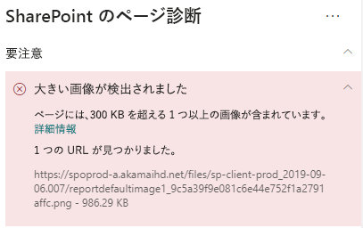
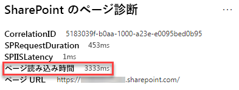

# SharePoint Online のモダン サイト ページで画像を最適化するOptimize images in SharePoint Online modern site pages

この記事では SharePoint Online のモダン サイト ページで画像を最適化する方法について説明します。This article will help you understand how to optimize images in SharePoint Online modern site pages.

クラシック発行サイトで画像を最適化する方法の詳細については、「[SharePoint Online の画像の最適化](image-optimization-for-sharepoint-online.md)」を参照してください。For information about optimizing images in classic publishing sites, see [Image optimization for SharePoint Online](image-optimization-for-sharepoint-online.md)..

>[!NOTE]
>Sharepoint Online の最新ポータルでのパフォーマンスの詳細については、「[SharePoint のモダン エクスペリエンスにおけるパフォーマンス](https://docs.microsoft.com/sharepoint/modern-experience-performance)」を参照してください。For more information about performance in SharePoint Online modern portals, see [Performance in the modern SharePoint experience](https://docs.microsoft.com/sharepoint/modern-experience-performance).

## SharePoint 用ページ診断ツールを使用して画像の最適化を分析するUse the Page Diagnostics for SharePoint tool to analyze image optimization

**SharePoint 用ページ診断ツール**は、Chrome および [バージョン 77 以降の Microsoft Edge](https://www.microsoftedgeinsider.com/download?form=MI13E8&OCID=MI13E8) 用のブラウザー拡張機能で、これを使用して SharePoint のモダン発行サイト ページおよびクラシック発行サイト ページの両方を分析できます。The **Page Diagnostics for SharePoint tool** is a browser extension for Chrome and [Microsoft Edge version 77 or later](https://www.microsoftedgeinsider.com/download?form=MI13E8&OCID=MI13E8) you can use to analyze SharePoint both modern and classic publishing site pages. このツールでは、定義されている一連のパフォーマンス条件に対するページのパフォーマンスを示す分析済みの各ページのレポートが作成されます。The tool provides a report for each analyzed page showing how the page performs against a defined set of performance criteria. SharePoint 用ページ診断ツールのインストール方法および詳細情報については、「[SharePoint Online 用ページ診断ツールを使用する](page-diagnostics-for-spo.md)」を参照してください。To install and learn about the Page Diagnostics for SharePoint tool, visit [Use the Page Diagnostics tool for SharePoint Online](page-diagnostics-for-spo.md).

SharePoint のモダン サイトを SharePoint 用ページ診断ツールを使用して分析すると、サイズの大きな画像に関する情報が [_診断テスト_] ウィンドウに表示されます。When you analyze a SharePoint modern site with the Page Diagnostics for SharePoint tool, you can see information about large images in the _Diagnostic tests_ pane.

考えられる結果は次のとおりです。Possible results include:

- **注意が必要です** (赤): このページには大きさが 300KB 以上の画像が **1 つ以上**含まれています**Attention required** (red): The page contains **one or more** images over 300KB in size
- **対処は不要です** (緑): このページには大きさが 300KB 以上の画像は含まれていません**No action required** (green): The page contains no images over 300KB in size

結果の [**注意が必要です**] セクションに [**大きな画像が検出されました**] という結果が表示された場合は、結果をクリックすると追加の詳細が表示されます。If the **Large images detected** result appears in the **Attention required** section of the results, you can click the result to see additional details.

## 大きな画像に関する問題を修復するRemediate large image issues

大きさが 300KB 以上の画像がページに含まれている場合は、[**大きな画像が検出されました**] という結果を選択してサイズが大きすぎる画像を確認します。If a page contains images over 300KB in size, select the **Large images detected** result to see which images are too large. SharePoint Online のモダン ページでは、画像の表示とサイズはブラウザー ウィンドウのサイズとクライアント モニターの解像度に応じて自動的に決定されます。In modern SharePoint Online pages, renditions of images are automatically provided and sized depending on the size of the browser window and the resolution of the client monitor. 画像は、SharePoint Online にアップロードする前に、 Web での使用のために必ず最適化する必要があります。You should always optimize images for web use prior to upload to SharePoint Online. サイズが非常に大きい画像のサイズと解像度が自動的に縮小されます。これにより、予期しない表示特性が発生する可能性があります。Very large images will be automatically reduced in size and resolution which can result in unexpected rendering characteristics.

パフォーマンスの問題を修復するためにページを修正する前に、分析結果のページ読み込み時間をメモしてください。Before you make page revisions to remediate performance issues, make a note of the page load time in the analysis results. 修正後にツールをもう一度実行して新しい結果がベースライン基準内にあるかどうかを確認し、新しいページ読み込み時間をチェックして改善されたかどうかを確認します。Run the tool again after your revision to see if the new result is within the baseline standard, and check the new page load time to see if there was an improvement.

>[!NOTE]
>ページ読み込み時間は、ネットワーク負荷、時間帯、その他の一時的な状態など、さまざまな要素によって異なります。Page load time can vary based on a variety of factors such as network load, time of day, and other transient conditions. 結果を平均化するために、変更の前後に数回に渡ってページ読み込み時間をテストする必要があります。You should test page load time a few times before and after making changes to help you average the results.

## 関連項目Related topics

[SharePoint Online のパフォーマンスをチューニングするTune SharePoint Online performance](tune-sharepoint-online-performance.md)

[Office 365 のパフォーマンスをチューニングするTune Office 365 performance](tune-office-365-performance.md)

[SharePoint のモダン エクスペリエンスにおけるパフォーマンスPerformance in the modern SharePoint experience](https://docs.microsoft.com/sharepoint/modern-experience-performance.md)

[コンテンツ配信ネットワークContent delivery networks](content-delivery-networks.md)

[SharePoint Online での Office 365 コンテンツ配信ネットワーク (CDN) の使用Use the Office 365 Content Delivery Network (CDN) with SharePoint Online](use-office-365-cdn-with-spo.md)
